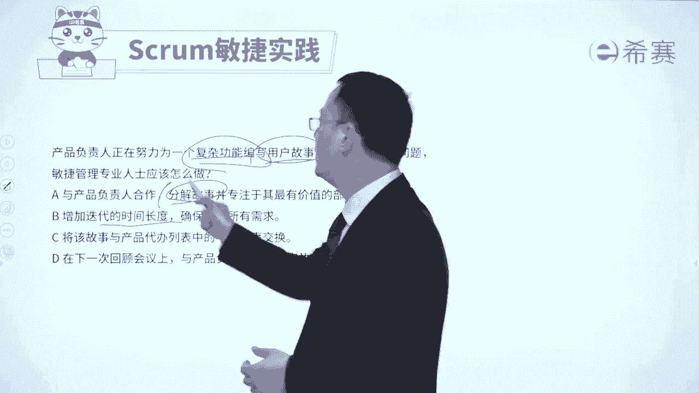
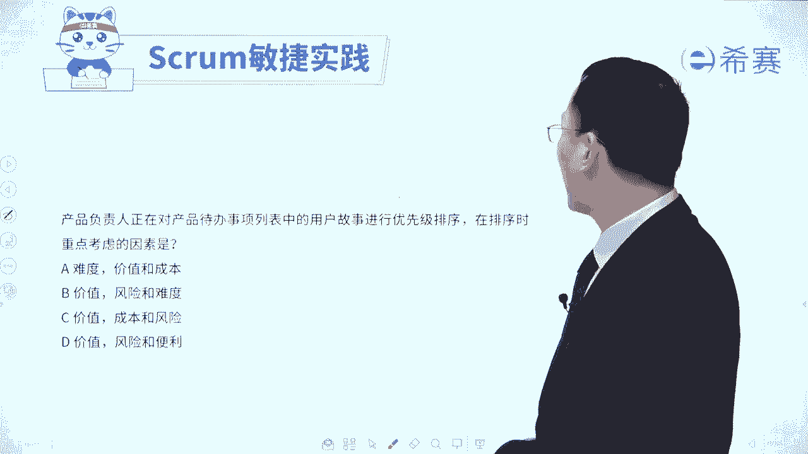
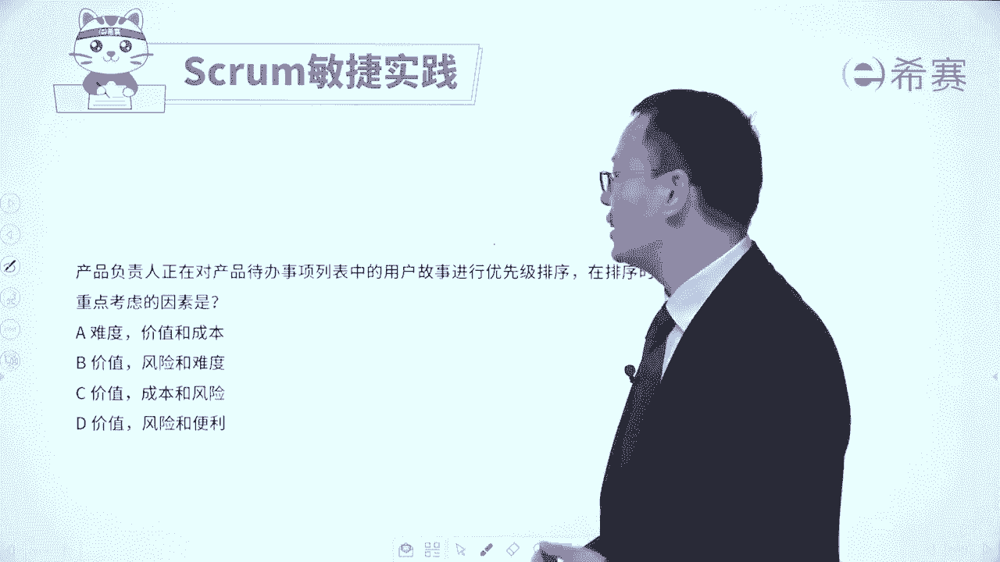
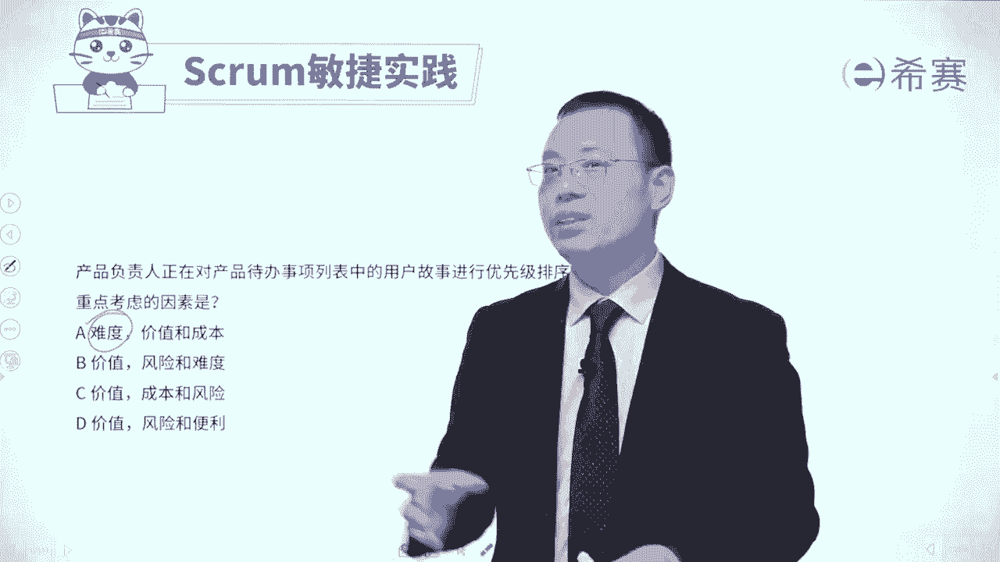
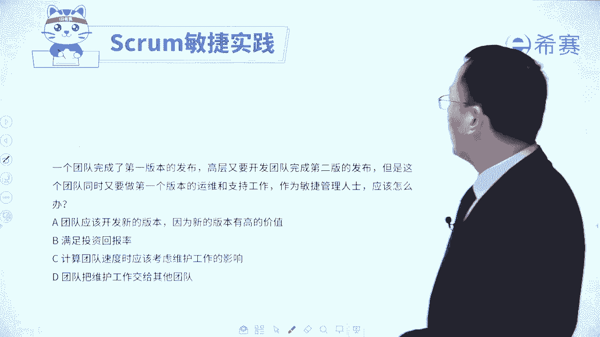
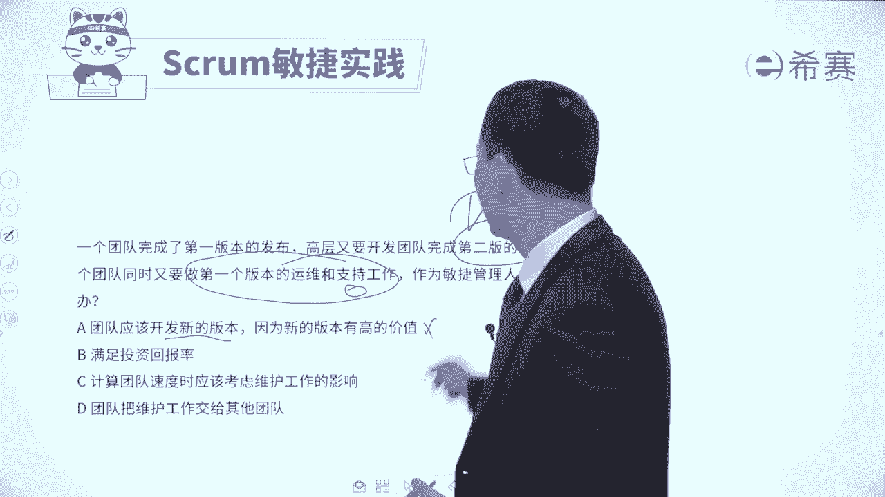
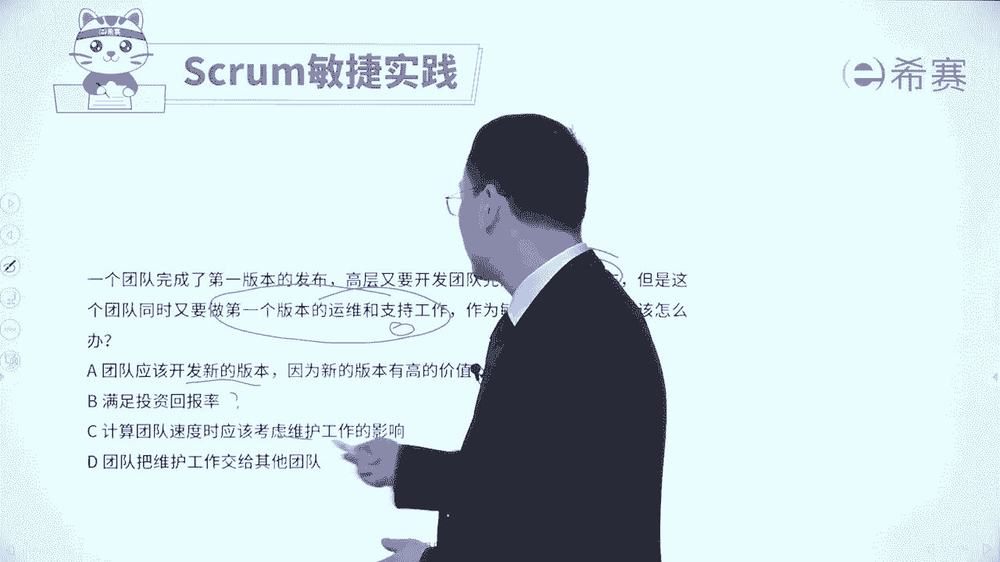

# 【免费分享】PMP项目管理认证考试第七版全套完整系统精讲课 - P112：32产品待办事项列表习题讲解 - PMP课堂 - BV1EqYWerEjx

大家好，我们刚刚已经是花了一些时间看到了关于产品代办事项列表的若干的知识点内容。接下来我们会通过几个题目，一个是来去巩固关于产品代办事项列表的这个知识点。

还有一方面呢是有一些东西可能会对他进行小量的补充。我们先来看一下这样一道试题。敏捷项目的项目经理，他被要求将预算呢减少30%。由于这是一个小型的项目团队，因此，预算主要是分配给资源。

项目经理应该使用什么策略才能够在受限环境中保持交付价值。请注意它是要去将预算减少30%。而这个预算都用来干什么呀？就是安排这个人工来做事情。其实也就是说你的工作量会减少30%。

你的工作量减少30%的情况下，怎么样能够去保证依然交付价值呢。😊，那当然是优先做重要的事情嘛，应该是这个逻辑，对吧？看一下四个选项，选项A平衡项目团队以适应预算的挑战，并且呢能够去提供培训。

以降低绩效来那个低下的风险。这个有点强人所难吧。如果说真的可以这样的话，那说明这里面还有很多很多水分，对不对？所以这个有点太过于夸张了啊，就是减少了30%的这个人时，依然可以把项目给完成。

这个有点太夸张了。啊，第二个选项优先考虑产品代办事项，以寻找高业务价值和低工作量，能够去调整项目预算和人员配置已完成。什么意思呢？就是优先找那些价值比较高，同时供应量比较低的东西。

其实就是做一个这种排序，通过排序的方式把那些价值比较大的东西往上面去浮。😊，价值又大，工作量又小的东西，重点往上面浮。那当然就是一个很好的一个逻辑。相对应的那种价值比较低一点的。

并且还有是工作量又很大的东西就往下面乘。而我们用有有限的这一个工作量来去完成那些高价值的东西。所以它刚好就是一个极其好的一个选项啊。好，第三个，将项目范围仅限于基本的关键功能。

并且呢以当前人员配置水平来运行项目，直到完成所有的预算。这是什么意思？很显然，这个基本的关键功能和这里面说的是高价值的功能就不一样。我们在敏捷中其实会提倡的是它是价值驱动的这种方式来做事情的。

所以一定是要去交付价值。我们的敏捷团队也是要去交付价值。所以这个不匹配啊。😊，第三个不合适。好，第4个，减少项目人员，并相应的去调整范围和时间表，以支持预算的消减。这个呢他其实说的方式你不能说他错。

但是他没有讲出要点，要点一定是我们能够去优先考虑高价的东西才能够真正的交付价值。你怎么样才够去交付价值？你要时刻记得题干中说的是，虽然人数减少了，或者是给你的工作量时间减少了，但你依然能够去交付价值。

怎么交付价值，优先把高价值东西先去完成。所以答案是选B选项。这里面就告诉我们说，整个产品代办事项列表，它就是一个有序的列表是以价值为导向的。我们把那一个高价值的高业务价值给挑出来找出来。

我们再来看一道题目，公司正在进行敏捷开发，新来的公司领导呢，对于敏捷并不了解他询问敏捷项目管理的专业人士，关于产品代办事项列表的这些事情。那么项目管理的这个专业人士。

他应该如何去回复关于这个产品代办事项列表下呢。😊，选项A应该对于该事项进行精细化的分解，并准确的估算啊。你一看到这个词肯定不对啊，我们怎么会对它进行那么准确的估算呢？都是做着做着才去做的。

它是一个渐进明细的过程，是一个滚动式规划的过程。好，B选项应该对事项进行精细化的分解，并在冲刺计划中来去估算。呃，这个好像其实。😊，还可以，对不对？看上去好像还可以。如果说这样一看没有特别合适的话。

你觉得可以留下来。好，我们看一下C选项，应该对于该事项进行逐步精细化，并且在迭代计划中来进行估算。哎，你会发现怎么C和B说的好像非常相似啊。它唯一的差别是什么呢？唯一的差别，这个时候是精细化的分解。

这个是逐步精细化。那我们知道敏捷它其实是渐进明细的过程，应该是逐步精细化，会比那更好。所以有C以后把这个B给PK下去了。😊，最后一个应该对该事项进行精细化分解啊，那这一看就是被PK下去，对吧？

所以呢答案只有C选项，就是我们要对于这样些个需求内容，对这个产品代办事项列表的东析，应该是逐步的精细化。呃，每一轮迭代我要去做什么事情，就去细化这些用户故事去讲一讲啊，然后再去拆解成任务。好。

到下一轮迭代时候，我们又要做哪一些这些用户故事，把它去精细化细化，然后去拆解成这些任务，1。1点来去进行一轮一轮去进行。所以整个产品代办事项列表中的这些细化的这个梳理啊，它是一个渐进明细的过程。

每一轮迭代来去梳理一些东西，每一轮迭代去梳理一些东西。😊，好，我们再来看一个题目，产品负制人正在努力为一个复杂功能来去编写用户故事。若要处理这样一个问题的话，敏捷管理专业人士应该要怎么做？

那既然是一个复杂的功能。所以这个用户故事估计也是一个比较粗略的，会比较大的一个东西，对不对？而咱们的敏捷中有一个叫dep法则或者dep模型，我们现在把它做了一个详略的蛋的做能够估计的。

所以最好的方式应该是用一种分解的这个思路。来看一下四个选项。选项A与产品复制人合作，分解故事，并且是专注于其最有价值的部分。哎，这刚好就符合，对不对？它就是正确答案呢。兄弟姐妹它就是正确答案啊。好。

B选项增加迭代的时间长度，确保呢满足所有的需求，一般情况下我们不会去修改这一个时间和，尤其不会让他的一个时间变得更长，不会去拉长这一个时间和。好，C选项将该故事与产品代班事项中的不同的故事来进行交换。

你交换又有什么用？这颗粒太大的话，这一轮迭代完不成，就不太好，我们应该是把它细化。好，最后一个选项在下一次的回顾会议上与产品负制人一起去评审故事内容。😊，嗯，他没有抓住焦点。

焦点是这是一个复杂的用户故事。我们要去编用户故事的时候呢，我们可以把它分解成几个小的故事。所以呢答案是选A选项。😊。

过大的用户故事，我们需要去做拆分，你只有把它拆分成比较小的颗粒，才能够在每一轮迭代中就完完成它。好，我们再来看一个题目，产品负责人他对于产品代办事项列表中的用户故事进行优先级排序。那么在排序的时候。

重点考虑什么呀？重点考虑的首先一定是价值啊，第一位是价值。所以这个先没干掉。然后其次呢还会有关于风险啊成本啊这些东西。所以这样看起来的话，你这个是你需要去稍微记一记的。就是重点考虑是价值，其次是风险。

除此以外呢，还有包括成本啊一些依赖关系啊，一些政治因素等。😊。

好，我们再来看最后一道题目。关于这个板块的一个团队完成了第一版的发布，高层又要开发团队，完成第二版的发布。但是呢这个团队同时又要做第一版的这些运维和知识的工作。那么作为敏捷管理的人士，你应该怎么做。

其实他就是告诉你，我们现在既要去开发第二版的功能。同时又要做第一版的这些运维的一些工作知识的工作。那要做还是不做呢？都要做，你不能只做第一这个部分，你也不能只做这一个部分，应该是两个部分都做。😊。

我们来看一下四个选项，选项A团队应该开发新的版本，这个本身没毛病，但是他好像说的是只开发新的版本，这就有问题啊。好，第二个满足投资回报率，他没有讲一个清晰的一个一个具体操作。第三个。

计算团队速度时应该要考虑到维护工作的影响，也就把这个。😊。

既要考虑到做事情，也要考虑到运维的事情，把两方面都考虑进来，这才是OK的啊。好，最后一个团队把维护工作交给其他团队，这本来就是你该做的事情，你怎么能够把它假手于人呢？这就是你的事情了。所以只有C选项。

它列出的就是既包含了这种功能性的这一些事情，也包含一些非功能性的事情，非功能性的事情，就包括这些什么运维的工作呀，一些技术债务呀、风险应对呀等这些东西都包含进来。所以答案是选C。😊。

那整个关于产品代办事项列表product backlog呢，我们就通过几道题目分享到这里，你是不是对它有更深的认识和了解了呢？我们接下来还会再讲另外一个叫迭代代办事项列表。😊。

