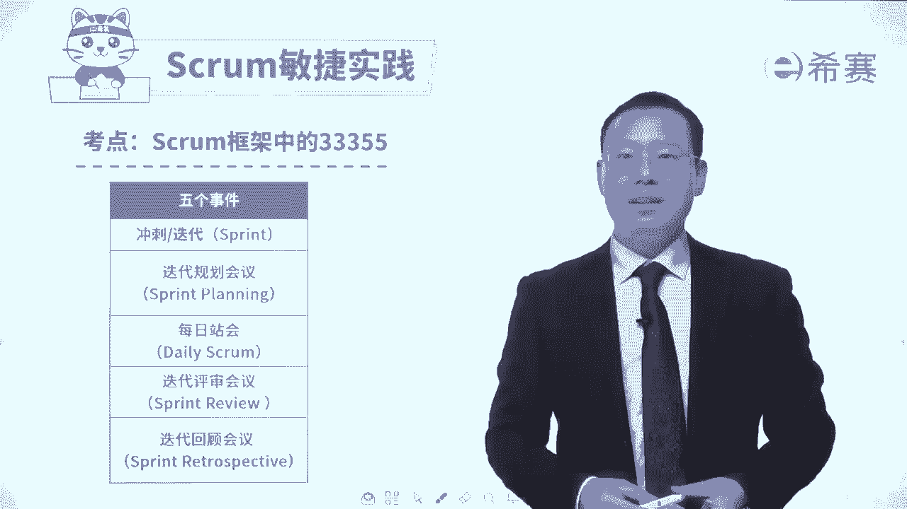
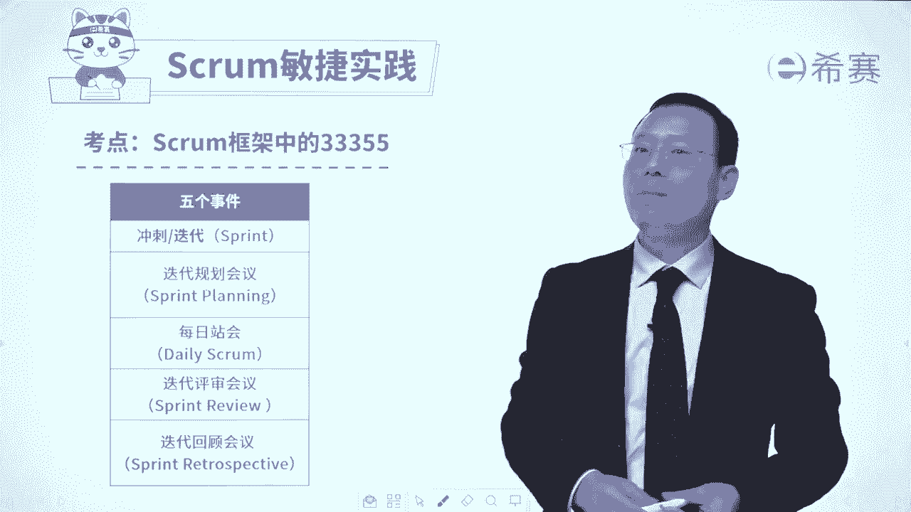
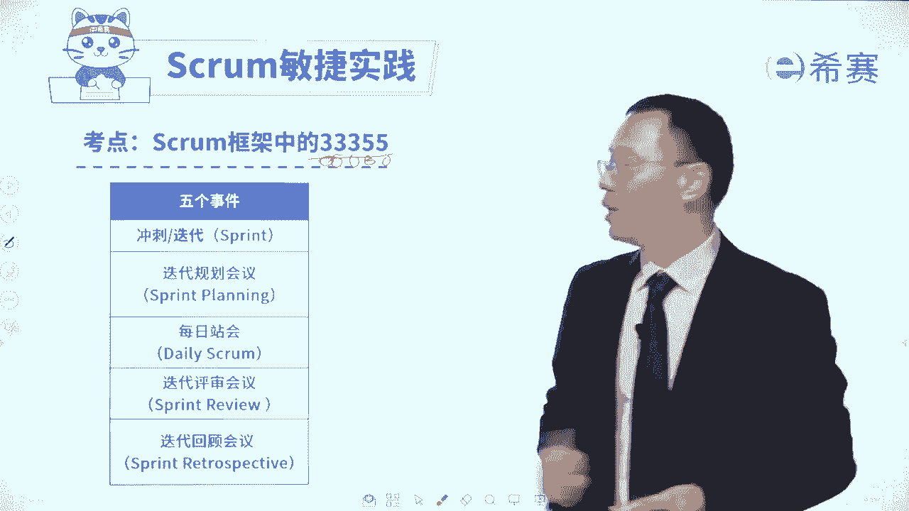

# 【免费分享】PMP项目管理认证考试第七版全套完整系统精讲课 - P116：36迭代Sprint - PMP课堂 - BV1EqYWerEjx

大家好，我们继续来分享的是s敏捷实践中的内容。那scrrum敏捷实践呢，如果说是简单归纳的话，可以叫做敏捷的33355。首先是三个支撑，然后呢是三个角色，然后是三个工箭。

在接下来呢是5个事件和5个价值观。那5个事件中，首先第一个叫冲刺迭代sprint。我们一起来去认识一下关于冲刺迭代sprint。那我们这张图呢其实已经是见过好多次啊，在这里你会发现整个这样一个过程。

它就是属于一个冲刺或叫迭代或者叫sprint这三个词汇呢是可以去等同着去用，是混着去用的，你需要去了解一下。那整个一轮迭代是干什么呢？一般来讲，一轮迭代是会从整个产品代办事项列表中捞出一部分还没有做的。

并且优先级比较高的东西。来列到这样一个内容中来。当然前提是先去定目标。我们要去目标是要去做什么就。😊。

这一轮迭代的目标是什么？然后再去定具体的这些个代办事项。然后再把这个代办事项呢再去做分解，分解成小的任务。然后大家再去认领任务，认领完的任务都会列到这个产品代办事项列表中来。

接下来团队就可以去开始来做事情，团队做事情的过程中，每一天都会开每日账会。然后呢做呀做呀做做东西不只是做它，还包括去测试它去修改它啊，一直都测到没有问题为止，然后呢，就得到这一个这个增量。

这个增量的东西，这个已经完成这用户故事东西，我们会召开一个叫迭代评审会议，在迭代评审会议中会有PO以及有可能会有客户来去参会，来去对于这样一个已完成的用户故事进行评审。评审通过的部分呢。

就得到一个叫可交付的产品增量，没有通过的部分，那么再把它打回去，又回到整个这个产品代办事项列表中来，然后呢，我们做完这一轮迭代以后呢，后面会有一个叫迭代。😊。

回顾会议在这个迭代回顾会议中来去回顾这一轮迭代，我们哪一些地方做的比较不错，哪一些地方可能还是要去做一些修改调整。好，又开始进行下一轮的迭代，这就是整个这样一个冲刺迭代的过程。

当然我们还会有一个叫迭代零和迭代N，了解一下迭代零是刚刚开始的时候，我们第一轮首发的迭代呢不会具体去做这些事情，所以不完全按照这个S做一些准备性的工作。那就是迭代0。还有就是迭代N是最后一个迭代。

最后一个迭代也不去做这些具体事情，而是对于整个做完的东西来去进行一个梳理啊，清理啊整理呀的这一个情况。那这是迭代零和迭代N。我们整整个通过这个内容呢，再一次来回顾了一下关于冲刺迭代sprint。😊。

再说一次，这三个词汇，它其实就是一个词汇是可以混着去用。呃，可能在考试中既有可能会讲到是冲刺，也可能会讲到迭代，也可能会直接用的是spring啊，都是可行的。好，那么关于这一个呃第一个。

这一个事件呢迭代呢我们就已经是分享到这里。接下来我们会认真去开展后面的考试考的比较多的关于迭代规划会议，以及每日战会和迭代评审会议迭代的回顾会议。

