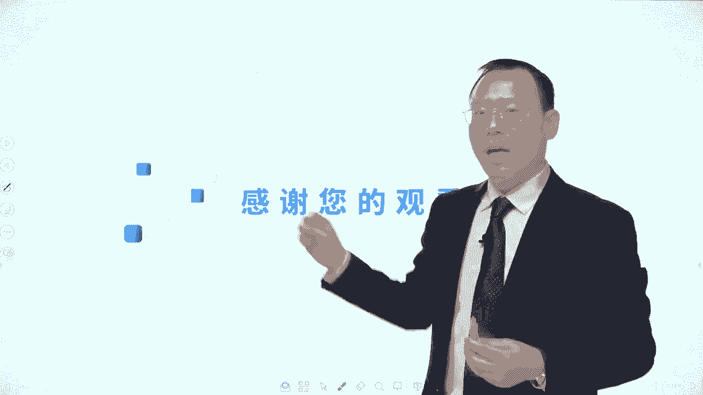
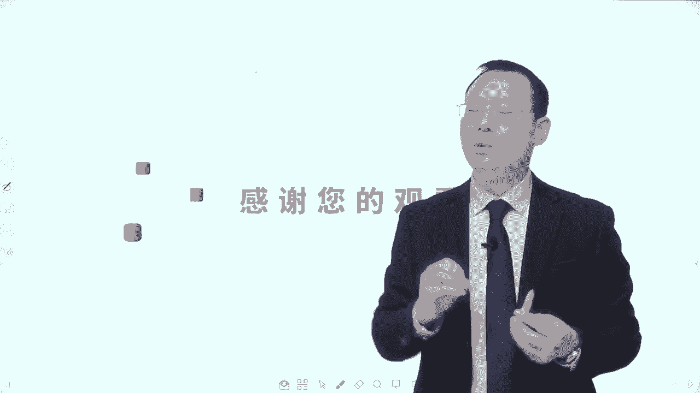
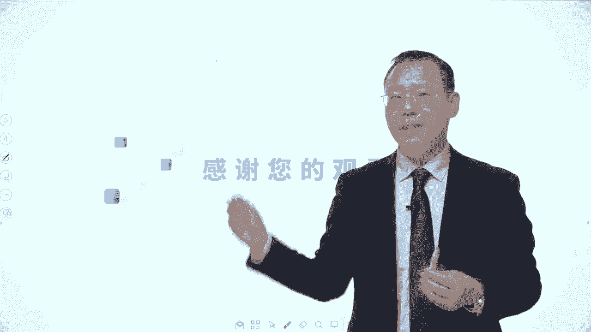
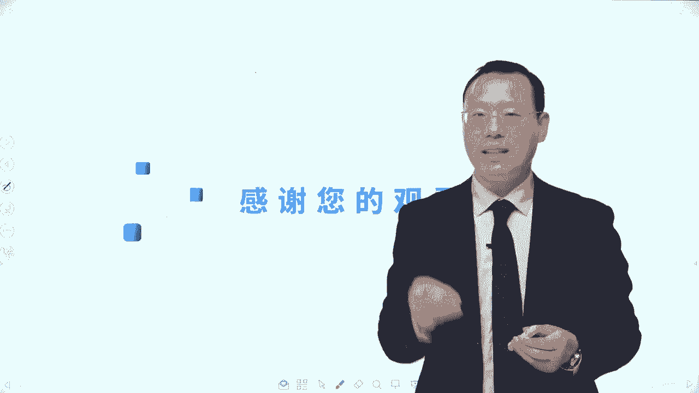

# 【免费分享】PMP项目管理认证考试第七版全套完整系统精讲课 - P120：45Scrum五大价值观及Scrum实践回顾 - PMP课堂 - BV1EqYWerEjx

大家好，接下来我们继续分享的是scrn敏捷实践中的最后一个内容叫五大价值观。他这五大价值观呢跟我们说敏捷宣言，他的类似大价值观不是一个意思。他其实也是说我们在做敏捷的时候。

所需要去遵循或者秉承的一些行为处事的一些规则或原则。我们一起来看一下。首先这五大价值观中第一条叫承诺commitment。承诺说的是什么？做的是我们团队成员他能够主动的站出来认领任务。

能够对这些个要做的事情，来去主动承诺，对目标做出承诺。并且团队成员他是对谁做承诺，他是对这个事情对目标本身做承诺，而不是对于敏捷教练做承诺，也不是说对于PO来做承诺。

所以这个人群他是把事情放在重要的位置，他是要价值驱动的这种方式来去完成事情去交付价值。那你要去主动积极的来去完成事情，主动去挑大梁去认领重要事情。这是第一条叫承诺。第二条呢叫专注foox。

专注说的是全身心都要用到你所承诺的事情上面去。那关于专注呢，罗老师在这里给大家去又做了几个简单的补充。你稍微留意一下啊。😊，首先第一个这个专注的是团队成员，他应该是全职的团队成员。

他不会是要兼到多个项目上来，他是只做这一个项目上的事情。所以他要把他时间精力集中在本项目上。其次第二个呢是专注是说我们团队成员要专注在本项目上的事情，你可能会有一些其他的事情来去打扰你，干扰到你。

那这个时候呢，敏捷教练，你要帮团队去清除障碍，能够让团队成员可以专注在本项目上的事情。第三个是我们在这一轮迭代中，在前面有一个迭代规划会议，能够去列出本轮迭代要做的事情。这相当于说是一个迭代计划。

那做好了这个迭代规划会议，做好了这个迭代代班事项列表以后呢，就尽量去落实去完成它。如果没有很特殊的情况。我们不要去随意的去更改一些内容，尽量是完成本轮迭代，非必要不更换。哎。

这是关于专注来做一个简单的引申。😊，然后还有一个呢就是开放开放的这种价值观opness。他讲的是说团队内所有的信息要对所有的人开放。其实讲的是什么？叫透明沟通。关于透明沟通。我们前面已经讲过几次。

再提一次也不要紧。因为你多听几遍，你就深深的记在你心里面啊。首先第一个我们可能会通过一些每日站会的方式，来去同步信息做透明沟通。第二个呢。

我们可能会通过看板呐信息发射源的这种方式把一些重要的信息都放在这一个地方，用可视化的方式，让大家都可以看到，包括要做的事情，以及包括遇到一些风险挑战，包括这一个呃迭代的燃禁图燃起图都是可以的。

那放在一个公共区间，用这个信息发射源，让所有人都可以看到。第三个呢是通过集中办公的方式能够方便大家经常面对面的沟通，以及包括渗透式的沟通。当然还有。😊，就是我们在整个做事情的过程中。

前面会有迭代规划会议，后面会有迭代评审会议，后面还会有迭代回顾会议，大家都参加。这样的话也都能够让这个信息更好的去透明。当信息比较透明以后呢，我们就没有那么多那些个冲突矛盾，就会减少一些。😊。

这是关于这个开放。我们要把这些相对的信息能够同步给大家，既能够让对方知道，并且还能够让对方理解。应该是到这种程度。然后第四个词呢叫尊重respect，那说的是每一个人都有他自己独特的价值和经验。

我们要去尊重对方。我们在前面讲过说，敏捷团队中的成员。我们其实会更提倡的是什么？是T型人才，T型还是一砖在这一方面很专业，多人在各方面都略懂一些。那一砖多人的这些个人才。

我们不要说你看不起他他看不起他有个什么鄙视链，这种方式就不利于团队友好的协作，共同去共事。而是要相互尊重，彼此尊重。当然也包括说是领导要对员工是尊重的。员工对客户也是尊重的，各方面都是相互尊重的呃。

这样的话呢才能够更有效的把事情往前顺利的推进。最后一个词叫勇气courage。😊，勇气说的是我们要去勇于承诺，要有这份勇气，敢于担当，勇于承诺。勇于去履行这个承诺。还有呢就是如果有一些东西是不合适的。

我们也要去勇敢的say no也是好的，这是他的这样的五大价值观。考试呢其实很少会直接去考这样一个五大价值观，它就是做一个补充，让我们知道哦，原来我们用敏捷的方式来行为处事的时候。

还有这么一些东西是需要去注意的，需要去留意的。😊，我们还是来看一个题目啊，有一个这样的题目，很有意思，说在迭代规划会议中呢，敏捷团队估算出一个功能特性，所需要的时间为两周。这个特性这个词稍微解释一下。

你可以把它简单的以为就是功能啊，就是功能，他其实fecher呢说的是一个大的功能，就是可能会包含若干的功能的这个叫特性。O好，那么他说一个功能特性所需要的时间为两周。

但是新来的敏捷教练要求必须在一周之内去完成，明明是两周非得要一周完成，这不是强人所难吗？那团队成员向敏捷教练解释说一周内完成是不可能的并且呢没有理由给出一周的这个交付期限。

那敏捷教练他的做法是不符合以下的哪一个价值观呢。很显然他没有去尊重事实本身，他也没有去尊重团团队成员，对不对？所以呢答案应该是这一条。😊，没有很友好的去做一个尊重。当然了，整个关于敏捷的这五大价值观。

其实很少会考，它应该是说融入到我们的学液中，融入到我们这样一个理解中，然后有助于我们更好的来去理解各种题目，应该是这样的一个情形。好，这是关于scr框架的这样一个五大价值观。那么到此为止的话呢。

我们的整个s框架中的33355其实基本上就已经说完了。我们来简单回顾一下，我们都说了一些什么东西啊。😊，就整个敏捷的s况。那首先是有一个重要的角色叫产品负责人。他能够从客户那边去获取一些需求信息。

把这个需求信息整理成用户故事的方式来得到一个产品代办事项列表。然后呢，他会对这些代办事项列表中的这些代办事项来进行排序，按照价值进行排序。当然也可以参考一些风险啊、成本啊等等因素来进行排序。

当列完的东西里面除了包含功能性的需求，也可以包含一些非功能性的需求。好，然后接下来我们在每一轮迭代中，就整个这是一轮迭代。那么在每一轮迭代中呢，可能他会跟大家去讲一讲这些事情，然后跟团队一起来去讨论。

然后把那些靠前面那些东西拎出来去做。那这个把它拎出来去做这一次会议呢叫迭代规划会议，我们会在迭代规划会议上来去讲一讲哎这一轮目标是什么，就是我们这轮迭代的目标是什么，我们要去完成哪一些代办事项。

然后这些代办事项呢，我们可能还会把它再拆解成任务，拆分成细分成具体的任务。然后大家去认领任务。团队前面主动来认领任务。这个主动认领就包括我们刚才说的是你要去勇于承诺，你要。😊，去有勇气去承诺，对吧？好。

然后认领完任务以后呢，就开始去做事情。当然我们在认领完任务以后，得到的这个结果就是一个叫迭代代办事项列表，叫sprint backlog。那这个迭代代办事项列表中就会列出来本轮迭代要做的事情。😊。

理论上来讲，团队成员在这一轮迭代中就要专注着把这个里面的东西尽量去完成。这个完成是指你要去开发完，还要去测试通过。这样的话呢才能够方便别人去验收也通过。那做的过程中。

其实我们每一天可能都会开一些叫每日战会。每日战会它的关注焦点是去做信息的同步。也如说我们每一个人每一天都会讲我昨天干了什么？我今天要干什么？我干这个事情遇到什么问题，障碍风险挑战把它提出来抛出问题。

那每日战会他重点是去同步信息，而不是去解决问题。好，做完这些事情可能慢慢慢呢，我们就差不多该做的事情做的差不多了。啊，这个时候呢可以去做这个迭代评审了。迭代评审呢会有一个重要的会议叫迭代评审会议。

在迭代评审会议中呢，那通常情况下，那大老板就是这个产品负责人，他要跟大家去讲讲整体的情况是什么样的。然后呢，团队成员他也要去讲一讲，我们这轮迭代做的怎么样。然后呢，他再去给大家去演示一下结果。😊。

然后PO再来去负责做那个同意或不同意做验收。当然如果有客户在客户来做验收，然后呢做的好的东西就得到一个潜在的可发布产品质量。那做的不太好的东西呢，又打回去回到这个产品代办事项列表中。

再一次去讨论它的这个重要性。好，然后呢我们还会去考虑一下现在的外部的局势是什么？市场的环境是什么？我们下一轮可以怎么样去做一些改进，重点会放在了什么地方，所以是对后续它的这个趋势发展会做一些分析。好。

做完这个事情以后呢，我们得到了一个叫潜在的可发布的产品质量。那这个潜在的可发布产品质量，就是已经真正的验收通过了，真正的已经完成的东西，它就可以去加到我们上一个版本中来。这样的话呢，上一个版本的东西。

它就会变得更丰富了，就可以给别人直接去使用呢。😊，而做完这些事情以后呢，团队自己还会再召开一个叫迭代回顾会议。这个迭代回顾会议，它的焦点是指向未来。我们在下一轮迭代中。

我们可以怎么样去优化和改进做的更好。所以他会讨论我们在这一轮迭代中，哪些地方做的好，继续发扬，哪些地方做的不好，下一轮怎么样去改进，给出一个具体的改进建议和计划。好，搞完这些东西以后呢。

我们就又回到下一轮又开始做这一个。😊，迭代规划会议，然后又开始下一轮。而在这个过程中有一个角色非常的重要，它会能够去确保整个迭代能够有序的去进行。然后并且呢大家遇到困难和挑战。

都可以去向他寻求知持和帮助，它就叫敏捷教练。敏捷教练呢，他一方面是能够去做一个促进者做一个催化剂，能够把这些东西往前去推进，引导大家提醒大家啊来去建议大家做一些事情。同时呢它是一个资源库或是一个资源池。

你需要什么东西，你来找我呀，我来去帮助你呀。同时呢他还是一个老母机这样的角色。那团队如果说是受到一些干扰啊，受到一些各各种问题啊，他能够帮大家去清除障碍。啊，所以这是敏捷教练要样的事情。

所以我们基本上到目前为止，你再去看这一张图，你是不是会对他更加清晰和认知和了解了。你会发现整个scr这种敏捷实践，它是一个非常完整的这种敏捷项目管理的实践，它是会重点落在。😊，这一个敏捷项目管理上面。

它是有管理的因素。它不是说像那种像我们后面还会学到一个词叫呃极限编程叉P。那叉P它会更多的是做敏捷的实践，去做敏捷开发的那个维度，这是不一样的。好了，那么整个关于敏捷的石块实践呢，我们就分享到这里。

感谢你收看。如果对于这样一个内容，还有什么样一些疑问呢，问题啊，都可以是在我们的课堂上或者是在我们的学员群里面来去互动。呃，当如果说是对某道试题不太懂的话呢，也可以在直接在西下的平台上面来去提问题留言。

这样的话呢，我们的助教老师都会给大家去做解答。那我们整个关于敏捷的石块实践框架呢，就到这里，感谢你的收看。😊。

