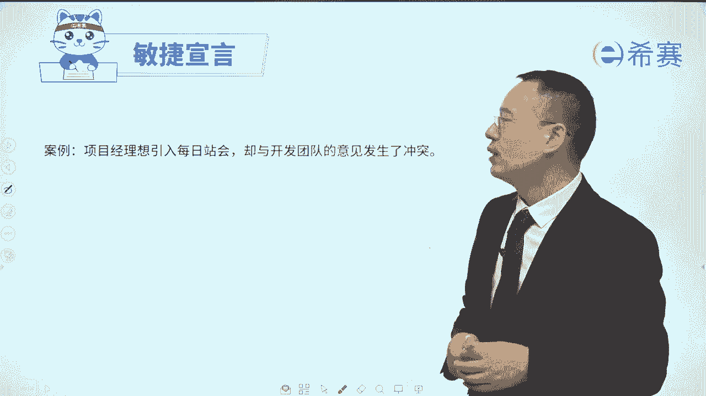
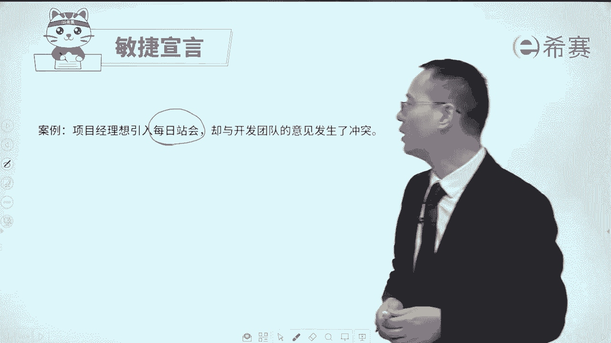

# 【免费分享】PMP项目管理认证考试第七版全套完整系统精讲课 - P84：4《敏捷宣言》解读中 - PMP课堂 - BV1EqYWerEjx

接下来一起来去展开来看一下敏捷宣言，我们对它进行一个解读，首先敏捷宣言中的第一句叫个体和互动，剩余流程和工具，它也就是强调了以人为本，这是什么个情况呢，其实你会发现做事情。

如果说有一些好的流程被验证过的，那么我们做事情的时候，就是按照这个流程来一步一步按部就班的进行，它是最省时最省力，并且效果也会非常好，如果说有一些好的工具可以去直接使用，那肯定也是会非常好的。

但是请注意啊，有一个，但是啊但是这个流程本身它是死的，而人是活的，你们在做项目的时候有没有遇到过这种情况，就是某一个项目推不动，理论上来讲到这个节点应该是谁谁谁来去支持，但是你找谁的时候，我没空。

我没时间，你找另外一个人的时候，他也是说这个不归我管，有些流程他推不动，所以流程是死的，而人是活的，但某一些东西推不动的时候怎么办呢，罗老师在这里给你分享一个词，也希望你能够记得住啊，叫谁痛谁动。

就是这个事情谁会最关心你，就去在谁面前去哭对吧，会哭的孩子有奶喝，所以谁会关心这个事情，你就去找哪个领导，这是一种方式，所以人是活的再好的过程，再好的工具，它需要有合适人来去运行，同样的一些流程。

同样的一些工具，你会发现不同的项目组，不同的项目经理，他管理起来那是千差万别，所以还是要靠人来去完成个体和互动，它才是我们项目获得成功的一个重要的因素，呃，比即便说我我们在整个做项目的时候啊。

其实在后面讲敏捷原则里面会讲到一条，说是要面对面的沟通，那如果说团队成员他不能够面对面的时候呢，可能有一些工具可以去支持，比方说我们用这种呃即时通信的工具，我们会发语音呐，发视频呐对吧。

这样一些即时通信的工具，但是即便有这些东西，它也不能完全替代人类来去对话，还是需要人来去互动这些事情，所以第一条就是个体和互动，它胜过了流程和工具，那如果某一件事情你要求大家怎么怎么样。

你先得要去跟这些人搞好关系，或者跟这些人有一些交流和互动，有一些交代好，我们来看一下啊，某个项目经理。

他突然之间就说啊，这样的话呢呃我们就可以每天同步信息了。

站着开会有什么要求，必须时间很短，你站久了以后呢，腿酸对吧，那么每天站着开会的时候，只回答三个问题，一个是我昨天干了什么，一个是我今天要干什么，一个是我干这个事情遇到了什么困难，风险挑战。

那这样的话呢就能够同步信息，当然我们后面会展开讲啊，先简单过一下，可是团队成员却不同意，他会不同意，这个时候该怎么办呢，其实啊在敏捷中一个好的方式，就是说当我们想要去引入某些新的工具。

或者引入某些新的流程之前呢，应该要先跟团队去沟通，跟人沟通个体和互动，当我们能够去了解他们是怎么想的，以及告诉他们说，用这些流程和工具，可能对我们有什么好处的时候，那么这个事情的推进可能会更好一点。

因为人其实更重要，不管引入什么工具，我们都需要有人和人的自互动以及人的支持，这样的话呢，这个事情才能够比较好的去往前推进，所以这个信息会告诉我们，即便看上去再好的工具，你也需要有场景，也需要有一些铺垫。

也需要有一个引入的这样一个流程，有一有引入的这样一个过程，好我们再来看看第二条叫工作的软件，剩余详尽的文档，什么叫工作的软件呢，就是你会发现软件有个特点，当我输入什么信息，他就会输出什么东西。

我点什么按钮，它就出什么页面或弹出什么报告，对吧，哎这就是表示这个软件它在工作，当我们在什么样的场景下做什么操作的时候，他就会给出我一些什么样的反馈，这就是表示在工作。

那工作软件也就是我们做了开发这个软件呢，能够做出一个结果，这个结果是可以去运行的，可以去使用的，就像你目前在使用的这个微信呐，你使用的这个C赛app呀，啊你使用的这些个打电话的工具呀等等对吧。

你使用的这个软件它可以工作，他说工作软件胜过详尽的文档，什么意思呢，用传统的方式来去做项目，尤其是有一些公司，他会做那个CMI3级的评审，四级的评审，CMML评审五级，你们公司评到几级。

你如果说你参与过，你大概就知道做这样一个过程中，就是会有大量的文档，那为什么要需要大量文档呢，就是因为在做软件的时候，如果没有文档的支撑，你事后去看那些东西的时候呀。

你会发现你看不懂就不知道别人写的什么鬼，有这种情形，所以才需要有文档，可是有的时候呢做事情他容易矫枉过正，就是有点过了一点，就重点去关注文档的一些东西，而真正能够产生价值，这个软件他却没有去特别重视。

所以敏捷中它会重新就是又回归到本源，会更关心的是你要做的是这个软件，那些文档是作为一种辅助，作为一种支撑，所以呢相对而言的话，文档是够用就好，所以面面俱到的文档，过多的这些文档。

其实有的时候呢并不是一个好事情，为什么，尤其是当我们如果做的某一些项目，它是一种变化特别频繁的项目的时候，你的需求变化特别频繁，所以你前期花很多的时间去做这种很详细，很细致的文档，去捕捉各种细节。

它就是一种浪费，因为你后面它发生变化以后，你是改这个ABCD文档还是不改呢，你如果不改的话，它就不一致，你改的话又要花很多时间，并且后面还可能再一次发生改变，所以有的时候面面俱到的文档。

可能还甚至不如那种少量的文档，而事实上在敏捷中，它更提倡的是短小的，然后能够去突出主题的这些文档就可以了，够用就好，所以文档它是够用就好，可以工作，软件才是衡量软件的一个价值或者一个标准。

你只要说这个东西它能够去产生结果，比方说你用这个微信工具，你可以跟他发信息发过去，你把信息写在这里，点发送，能够发给他，你把图片给发给他，你把视频可以发给他，你发邮件过去，他能够收到邮件。

这才是真正的在工作，而软件呢就是需要有这样一个结果，来去替代我们的一些劳动，所以它才是真正核心重要的，当然了，事实上我们在前面也看过，我们说什么，说做软件的时候，左侧也很重要，只是右侧更关心。

所以是不是说我们就不要文档了呀，也不是啊，你千万不要以为说那我们就不要文档了，这个肯定是错误的，只是说文档呢写得比较简洁，写的够用就好，写的短小，能够突出主题就好，这是第二条信息。

那我们来看一下在某个会议上，团队呢在骄傲地去掩饰他们所构建的软件，用户却在抱怨说软件少了某个重要的特性，特性叫fetch啊，在整个敏捷中你还会遇到很多次啊，fetch你把它简单理解为叫功能。

叫function也没关系，虽然说严格意义上来讲其实有差别，但是你简单把它理解为就是若干的那个软件，功能啊，好客户呢，他在抱怨说软件少了某些重要的特性，或者呢他们是不能够正常的去工作。

最后呀会议就在争吵中就结束了，他有人就说，如果之前能够全面详尽的文档，那就好了，真的是这样的吗，请注意哦，在整个敏捷中可工作的软件胜过详尽的文档，如果说你想要衡量一个软件，它是不是成功。

其实就看它有没有这个可供的软件，OK只有去有功的软件，并且用它才是真正的一个好的这样一个流程，一个交付的结果，并且我们在用它的时候，才知道说哪一些部分是我要的功能，以及哪一些部分的功能其实是我不需要的。

可以需要去做调整和改进的啊，给一些反馈信息去调整改进的，所以在整个敏捷中更强调的是可用的软件，以及基于这个不可用的部分，我去给一些反馈性的意见，让你下一轮去修改和调整，我们来看一道题目。

某个公司它的项目管理方式啊，正在是由传统的方式来去，转型到敏捷管理的方式，而作为敏捷管理的首个项目，请注意是首个项目，在迭代规划会议中啊，这是一个新的名词啊，你可以把它简单理解为。

就是说我们不是说敏捷是一个波浪型的方式吗，啊那就是第一个波浪的一开始的时候，做计划的时候啊，在这个第一个波浪做计划的时候，在迭代规划会议中呢，团队成员正在对本次的冲刺冲刺呢，其实就是一个一个波浪啊。

一个波浪啊，一个冲刺对于本能冲刺的设计进行讨论，团队成员因为项目中需要更详细的设计文档，而产生一些冲突，团队成员A他认为说必须要有文档，因为系统功能很复杂，所以必须要有很详细很细致的文档。

而团队成员B他说敏捷中呢就不需要文档，那么作为敏捷教练你该怎么办啊，敏捷教练也是一个新词，简单来讲就是敏捷项目管理的项目经理，你这样这样理解啊，就是管这个敏捷团队的一个项目经理啊，叫敏捷教练。

那么敏捷教练应该怎么做呢，选项A为了不让文档拖延进度，同意B的说法，诶可以不要文档是吗，当然不是啊，在敏捷中，我们只是说可工作软件是剩余那些详尽的文档，但并不表示就不要文档，所以这个说法是有问题的。

好第二个解释，有价值的迭代会高于文档，但不完全禁止文档诶，这个说法其实就是正确的，就说有价值的迭代，什么叫有价值的迭代呢，其实就是能够产生结果的有用的东西，我们这个东西做完了。

这一轮迭代迭代就是一个波浪啊，迭代和冲刺它都是一个波浪呃，但这是很多新名词，我们是通过一边讲这题目，一边来去补充一些名词，同时呢去辅助我们对于这个敏捷的内容，有更深的认知和了解，好不好。

那么这样一个迭代其实是一这一轮波浪啊，这一轮啊这是一个迭代，这是一个迭代对吧，那么有价值的迭代，也许我们这一轮迭代中，能够产生一些有用的内容，一些可用的功能，它会胜于面面俱到的文档，但是呢并不禁止文档。

也就是说文档依然是有效的，并不是说就不要文档了，好第三条，所以这句是对的啊，第三条呢询问项目转型的负责人，是否需要文档换，这还要问他吗，你作为敏捷教练，就是你作为这个敏捷的负责人，你当然是最清楚的。

肯定是要的啊，只是说是简洁够用就好，第四条，为了在执行中不返工，同意编制文档已去记录，这个话呢，编制文档本身，这句话本身这一单看没有错，可是它的含义是什么，它的含义给的是说，要有一个详细的这样一个文档。

而这就是跟敏捷相冲突，敏捷中说我们不要花大量时间去捕捉细节，去准备详细的文档，因为后面有可能会发生一些变化，所以单看这句话没错，要跟这个题目放在一起，它就是错误的，所以这个题目的答案呢是选第二个选项。

我们做有价值的这些个东西，超过了或剩余文档，但是并不表示文档就不不要了，文档还是要简洁的，够用的就好好，我们再来看一个题目，一个敏捷从业人员，什么叫敏捷从业人员呢，你可以理解就是一个敏捷的教练啊。

或者一个敏捷的项目经理，他遇到了一个利益相关者，利益相关者你前面见过吧，其实就是相关方或者呢叫干系人啊，他遇到了一个利益相关者，这个利益相关者坚持团队在开始任何工作之前。

必须要创建一个完整的非常详细的文章，一看这说话就不对对吧，那么这个敏捷的从业人员他应该怎么做呢，呃这个内容其实还没有讲过啊，就通过这个题目正好来去补充一下，我们看一下几个选项。

选项A说是纠正这个利益相关者，因为敏捷团队只可以使用工作的软件，而不是完美的文档，只可以这种方式就不对了啊，应该说是工作软件剩余完备的文档，所以这就这种表达就是有问题的好，第二个选项。

展示团队过去曾经成功的使用定期的产品演示，并在过程中改变了计划，这个说的是什么意思呢，我们嗯你可以理解为就是给一些证据告诉他，我原来用敏捷的方式来去做事情，好得很，我没有做那种很细致很详细的文档。

我就是重点关注的是，每一轮能够交付一些有用的东西，好得很，大家都很喜欢，很接受，并且项目也最后成功了，改是这个意思，所以呢它其实是一个正确的东西啊，啊我们做一个候选项，看有没有比它更好的。

第三个与这个利益相关者审查产品待办列表，并明确每一个发布中可以有哪些用户故事啊，这里面有很多陌生的词汇，简单给你过一下啊，你稍微留了解一下，与这个利益相关者去审查产品待办列表，其实也就说总需求啊。

审查总需求，并且明确每一个发布中发布呢，就是说我们可能会分几轮来去交付啊，某一轮大的交付叫发布，明确每一个发布中会包含哪些个用户故事，用户故事呢其实就是需求，它的意思是什么，他的意思其实就是说。

我提前就做好了明确的规划，先干什么，然后再干什么再干什么，可是敏捷中我们说过，它唯一不变的就是变化，我们要去拥抱变化，所以你很难在一开始就把这些东西都定下来，所以这种方式是有问题的啊，你定不了。

因为在过程中，随时都有可能会发生新的调整和变化，因为它强调的就是敏捷的项目，好，最后一个创建一个完整的，非常详细的这个计划来去满足，这一看就是错的，因为本身敏捷就不是这种这种套路，所以剩下的只有B选项。

B选项它的意思是什么呢，B选项的意思它就表示说，其实你看用这种敏捷的方式来做事情，其实也很好哦，并且呢效果非常棒，我们以前给那个农业银行做过，我们给工商银行做过，我们给招商银行做过项目。

都是用这种敏捷的方式来去做，效果非常好，所以你可以放心，你相信我没问题的，好不好，这个意思啊，所以整个这个题目他就告诉你说，你用这个成功的经验来去来去告诉他啊，那么这里解释一下。

什么叫成功的使用定期的产品演示呢，定期的产品演示也就是这个波浪中，我们在这一个在，在这个地方来给对方去演示汇报，并且去获取他的反馈信息，在这个地方去演示汇报，来获得他的一些反馈信息。

所以定期的演示其实就是定期的去交付结果，交付结果给去给到那个甲方爸爸，或者给到那个代表甲方爸爸的人，然后他们来给我们一些反馈信息，以及对我们的结果进行验收，其实就是一种敏捷，正常的做法。

就不断频繁的去交付东西，频繁的交付东西就这么一回事啊，好并且在这个过程中去改变计划，也就是说你可能交付了一次，他会给你提一些新的反馈，你就会修改你的东西，修改的计划，然后下一轮又交付了。

他又给你一些反馈，你又去修改计划，这样不断去调整和反馈，来去达到一个最终所要的东西，是这个意思啊，好我们再来看到下一条叫客户合作，剩余合同谈判也强调说我们和客户之间，我们应该是一个合作共赢的关系。

那这里有一句话真的是很重要，我也希望你能够记得，首先呢合同谈判呢，他形成合同是一个固定的这个条纹，而事实上第二句，客户很难再一次性的将需求，完整且清晰的表述在合同里面，谁能够在还没有八字没一撇的时候。

就能够想明白我要做的事情包含哪些细节，细节细节细节细节，很多东西他是做着做才会清晰的，当然不排除某一些类型的项目它是清晰的，但是像软件这种项目，它就有很多东西是不太清晰的，是做着做着才会清晰。

所以敏捷它本身也有适用场景，它最开始就是来自于软件开发，那么某一些软件开发中，你就很难清晰的去了解清楚或表述清楚，包括罗老师曾经做过一个项目，我们给对方真的是做了有半年的时间，那前半年每一次他都是说。

你们有什么就给我们提供什么功能，你们给别人做个什么东西，你就给我们提供什么东西，差不多过了半年以后，他才第一次讲说哎，我们想要做一个什么什么功能，会实现一个什么什么功能，所以很多时候客户他其实不一定。

每个客户都清楚自己要什么东西，以及他也不清楚你能够做什么东西，所以呀在做软件中他不能够讲述的时候呢，那么合同里面合同还是要签啊，签了合同才能够干活呀，签了合同才能够是有法律效应，那他才会要付钱。

你才要干活呀，所以在这个时候可能定的只是一些大框框，大条条的东西，有利于引导协同工作的合同才是好的合同，你不需要说非得要非常清晰，具体不是每一条都那么清晰，具体嗯不现实对吧。

并且呢再通过一个能够引导他协作的这种合同，从而能够让客户专注于他的商业决策，什么意思呢，就是在过程中客户说哈什么东西，什么功能对我来讲很重要，要不你们加上那个功能诶，这才是最重要的。

这样的话才能够真正的去帮他来去创造价值，而我们就是形成一种伙伴的关系，客户来定义价值，客户关注哪些东西是有用的，我们是合作的关系，你能够帮他来获取价值，他就能够给你支付账款，那双方都有好处。

