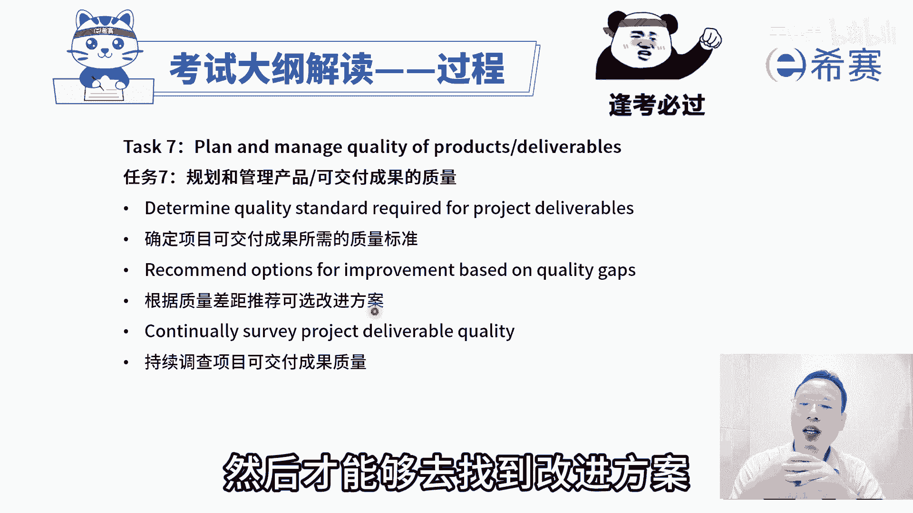

# 【官方推荐】2024年最新PMP项目管理视频教程-60天高效拿下PMP项目管理《PMBOK指南》第七版精讲视频课程-零基础通关PMP-考情-考题-预测-真题 - P1 - 平安麦 - BV1RG4pe7EbC

家人们准备好一次拿下PMP证书吗。

说真的，PMP考试其实很水，真的不需要全部学完，作为一个专门分享PMP备考的专业up主，为了让宝子们一次顺利通过考试，准备了PMP必备的材料，宝子们三连评论666即可获得。

接下来我们一起分享的是偏僻考试第七版考纲，在第七版考纲中，它是按照人员，过程和商业环境，这三个维度来去按照分数计分的，那么关于过程这个板块呢，他考试占比占到了有一半50%，占90道题目。

如果说我们已经是看过了，关于有呃资源啊，然后沟通啊，干系人呐，范围呀，进度啊，成本啊，质量啊，然后以及整合呀，风险啊，采购啊，看过这些内容以后，我们再来看过程这个板块拓的间隙考纲。

你会发现其实大部分你都很容易理解，而少部分不太好理解的东西，我们在后面的敏捷中会展开来讲，到我们一起来看一下，那整个过程这个板块呢它就是涵盖到整合范围，进度成本质量资源沟通风险，采购相关方等这些内容。

包括启动规划，执行监控收尾这些内容，中间有少量的内容，他是超出了这样一个十大知识领域，五大关注，那么他会从这个敏捷实况的实践，以及敏捷阶段框架中来得到一个有效的补充，我们一起来看一看。

首先第一个关于过程的任务，叫以交付商业价值所需的紧迫性来执行项目，它里面有一个很重要的词汇叫商业价值，我们做的事情一定是能够去交付商业价值，这样的话那才值得去做，那首先我们说做项目本身。

他是需要有这个商业价值，就是这个项目值得去做，同时在做项目的过程中，我们会在敏捷中还会讲到，他会把要做的功能一个两个三个四个五个，它也会是按照商业价值来进行有效排序，那么在这种排序的情况下。

我们优先做这种价值比较大的，然后再然后也会有这样一个过程，那么这里首先第一条就是评估机会，以便增量交付价值，所谓增量交付也是在敏捷中会讲到的一个内容，就是我并不需要把所有的东西全部都做完以后。

才交给客户，我们是先做了一些有用的东西就交给客户，然后再做一部分增量交付，再做一部分增量交付，所以他给的是说评估机会来去，增量交付能够持续交付好，第二个要检查整个项目的商业价值。

就整个这个项目本身是值得去做的，以及每一个具体要做的内容，它是值得去做的，第三个支持团队根据需要来细分项目的任务，以便找到最小可行产品，这也是在敏捷中会讲到的一个内容，就是我们的这些东西，很多的情况下。

我并不需要把所有东西都完成再交付，我们先做一个所谓的叫最小可行成平，mini viable product叫MVP，我们先做一个MVP来看他是不是对付对方，是需要的有用的，然后在此基础上面再去丰富。

再去增加，所以他这边的话更多是这种增量交付迭代交付，然后持续交付MVP的这样一个思想好，其实关注焦点是商业价值，所以以交付商业价值所需的这个紧迫性，这个所谓的紧迫性其实就是有有序的排序。

OK根据他的这个商业价值，有序排序来执行项目好，第二个任务呢叫管理沟通，那你如果已经是学过了关于沟通管理的话呢，就比较清晰，你看首先是分析所有相关方他的一个沟通需求，他是在什么时候需要信息。

需要什么信息，以什么样的方式来去给他等等，你把这些沟通需求搞搞清楚，以后呢我们就去可以做一个沟通管理计划对吧，哎就一个沟通策略的这个计划好，第二步是确定所有相关方的这个沟通方式，渠道频率，详细程度。

这不就是把他这个沟通需求，再细化到这样一些细节的方式，渠道频率和详细程度吗，好第三个有效的沟通项目的信息和更新，这个呢相当说是收集沟通的需求，这个是做一个沟通的计划，而这就是落实沟通，去执行沟通。

去管理沟通好，最后一条，确认沟通是否有效并获取反馈，这是在监督沟通，看监督的有效性，所以你会发现整个这样一个考纲中的，关于沟通这一个板块，它就是跟我们在十大知识领域中的沟通管理，几乎是一样的好。

再看到第三条，A few moments later，第三个任务呢，评估和管理风险，他讲的就是要去确定风险管理的可选方案，以及迭代评估和排列优先级，怎么讲呢，首先就是我们在做项目的过程中。

风险是不可避免的，如果产生风险，我们应该是要去想到一些方式和方法，来去应对它，那么整个在风险管理中，我们说先去识别风险，再做定性的分析，对风险进行排序，然后再做量化的分析，对风险更深的认识和了解。

然后再去规划风险应对，然后呢再去实施风险应对，然后后面是去监督风险，那么整个过程这就是所谓的确定风险管理，他的建议可选方案就是包含了这类内容，后面又要说迭代评估和排列优先级。

其实所谓迭代评估也是持续的过程，那我们在整个风险管理中有个监督风险，他也会强调我们要持续关注项目的间歇风险，有没有新的风险产生啊，旧的风险是否已经过时啊，这都是在做迭代建议过程。

并且所谓排列优先级是我们在做定性风险分析，对待优先级排序，所以整体来讲，这个任务三，他就是跟我们的风险管理是相一致的，接下来我们看到任务四叫相关方参与，其实也就是要去争取相关方的参与。

让他更好的去支持项目，让他抵制变得更少，那我们来看，首先第一个叫分析相关方，包括他的权利，包括他的利益，包括他的影响作用，然后可以用权利，利益方格等这些方式来去分析这些相关方，他在什么位置。

他对这个项目的一些影响和权利是什么样的，然后从而能够去有效的把相关方进行分类，也就是第二句话，对相关方进行分类，这个维度的人员我们要重点管理，然后这个维度的人员我们又如何如何，这个维度又如何又如何。

对吧好，第三个就是按照类别来促进相关的参与，其实也就是说根据你的分类的方式，对不同的方格里面的人员，我们有一套自己的这个应对的规则和方法，来去有效的去管理它，最后一句，制定执行和确认相关方参与策略。

其实也就是说我们去落实相关方参与策略中的，这些个东西去执行，并且如果发现做的不够好的地方呢，我们可能需要去做相对应的调整，这就是整个跟我们的十大知识领域中，相关方管理这个板块是完全匹配的。

好在接下来呢会看到一个叫规划和管理，预算和资源，那这就是既会可考虑到我们这个成本管理，同时呢也会考虑到我们这个资源管理，我们一起来看一下，但重点是在成本管理，您看，首先第一句。

是根据项目范围和从过去的项目中来汲取的，经验教训来估算项目资源的需求，也就是说我们这个项目需要什么样的一些资源，需要多少数量，OK这就是我们在资源管理那一章节里面，我们其实会有去估算资源，对吧好。

接下来是预测未来预算的挑战，所有的预算挑战，其实说我大概可能需要多少预算，以及可能会存在哪一些风险，然后对于这些风险的话呢，我们可能还要再多花多少钱一个啊，成本的储备或者是预算的储备来去做啊。

这就是关于对未来这个估算啊，预算啊，估做这些事情，下一条监控项目预算偏差，如有需要根据治理流程来进行调整，也就是我们想用政治分析啊之类的，这样一些方法来去监控，看目前的成本是超支还是节约。

而如果说成本超支的话，我们该采取什么样的措施来去有效的处理，可能需要去动用这些应急储备啊，动用一些管理储备，可能要去做一些申请之类的，即使我们再去控制成本好，后面还有一条规划和管理资源。

今天来到我们资源管理这个专业中，我们已经是大概知道要多少资源，然后呢，我们该如何去有效的去利用好这样一些资源，我们该如何去打造团队，建设团队，让这些资源能够更更有战斗力，来去完成某些事情。

所以这是既考虑到这个成本，也考虑到资源管理好，再看下一个叫规划和管理进度，你看这里就是重点管理进度，他第一句话说估算项目的任务，其实也就是估算他的这个工作量咯，然后估算工作量以后呢，就能够估算出时间咯。

能够去列出这些里程碑节点呢，然后他们这些内部依赖关系，外部依赖关系FSFF整这些依赖关系啊，还包括说故事点，故事点呢是我们在敏捷项目管理这一段，会再展开讲的，这个内容其实也就是一种公量。

然后会基于这些信息，然后你看第二个，利用标杆对照和历史数据来去做一些努力，做什么努力啊，类比估算啊，参数估算呐，哎就是这么一回事对吧，就是利用过往的这些历史数据来做类比估算啊，如果有大量的历史数据的话。

我们能够得到一些参数模型，那就做参数估算，然后基于这些个信息，基于它的这样一个呃，比方说是进度网络图和这些估算数据，我们来去做一个进度计划，所以是基于方法论来去准备进度计划，做出一个具体的进度计划。

然后再看这个进度计划的进展情况，我们去监控它的这样一个进展情况，所以基于方法论来去度量进展情况，其实你同样的会发现我们在政治分析，政治管理中，他依然可以算出，我们目前是进度是落后还是超前。

未来还需要花多少时间去完成，哎都是有这些，所以这就是我们去做制定进度计划，便是控制进度，在规划和管理进度，还有一个是基于方法论来根据需要来修改，进度计划，也就是我们在监控的过程中。

如果发现进度已经是严重落后，可能需要去对原有的这样一个进度计划，做相对应的调整，这其实也是控制进度的一部分内容，好最后一条配合其他的项目和运营工作，我们在做进度管理的过程中，也需要去做一些整合的方式。

来共同完成一些事情，所以要配合一些其他的工作内容好，这是关于进度管理，我们前面已经是看过了成本呐，资源呐进度，然后再接下来看另外一个呢是质量任务七，规划和管理，产品的质量，规划和管理可交付成果的质量。

OK也就是说我们需要去做好质量管理，那么首先的第一句呢就是确定项目可交付成果，它所需要的这个质量标准，也就是我们在最前面说，制定质量管理计划的时候，在质量管理计划中会包含质量的标准。

然后第二个呢是根据质量的差距，来推荐可改进的方案，那你首先你得要去做一个控制质量，你才能够发现质量的偏差，然后才能够去找到改进方案。

所以这个其实是在控制质量，OK这叫控制质量。

然后在最后一句说持续的调查项目，可交付成果的这样一个质量，那么在这个过程中，如果是持续的过程中的这个管理呢，就是管理质量，那么也就是规划质量管理，控制质量，管理质量。

它都是跟我们的在质量管理这个知识领域，完全是一致的，好再来往下面看到第八条叫规划和管理范围哦，整体来的范围其实我们去算工作量也好呀，计算质量也好呀，算这些资源也好啊，都是基于范围来的。

那么这个规划和管理范围中，首先第一句要确定需求并排列需求的优先顺序，也就是从客户这边来去获取，关于项目的一些需求，并且呢需求它一定是有更重要的，其次的，然后再次的，然后基于需求。

然后我们把它去转变成范围，并且对范围呢进行分解来分解这个范围，我们为什么要分解，因为把它分到更小的颗粒度以后，更方便我们去管控，更方便去管理跟跟进，所以呢才叫去做分解，比方说创建工作分解结构。

那这里还有一个词叫代办事项backlog，这个呢是在敏捷里面会讲到的，我们在习惯实践中会讲到一个叫产品，代办事项列表，Product by cloud，还有一个呢是冲刺代办列表。

叫spring back loud，也就是在敏捷面会再展开讲好，后面还有一个叫监督和确认范围，那确认范围其实是做验收，然后还要去监控范围呢，就是关于这个范围的变化，我们需要去走变更的流程。

所以整个任务八基本上就是范围管理，然后再来看到任务九，他就说是整合项目规划活动哇，这里有一个点你需要去了解，你会发现他把整个我们在项目管理中的整合，管理呢拆分成很多个部分，一个是整合项目规划的部分。

然后再一个呢是管理项目的变更，它也是属于整合里面的这个实施整体变更，控制的变更，然后再还有一个呢是管理项目工作，这就是执行，这是在整合中的执行，然后再还有一个呢说确保知识转移。

这也是属于在整合项目管理中的这样一个管理，项目知识，那还有一个说规划和管理项目，它的这样一个收尾或移交，这是结束项目或阶段，所以你会发现整合就包含在好几个不同任务中，我们一起来看一下。

首先看到还是第一个关于整合项目的规划活动，那我们知道规划其实是plan做计划对吧，就是各方面的计划，他的首先第一句说叫强化项目的计划，或强化阶段的计划，因为我们知道房事预则立，不预则废，如果没有计划呢。

这个事情可能会一盘散沙，可能会没有一个依据，没有一个着落，第二句就依赖关系差距和持续商业价值评估，整合的项目管理计划，首先我们得要知道项目管理计划，它是一个综合性的计划，它是整合了范围管理计划。

需求管理计划，进度管理计划，成本管理计划，质量管理计划等等等等，一系列，有十几个计划，对不对，所以呢，其实首先第一个是，我们需要去知道计划的重要性，及时能够去做出计划。

并且能够去评估这个计划是否依然有效，那我们来看一看，我们后面还要去监控的时候也是一样的，拿那个结果和这个计划去比对，看是否需要去做相对应的一些调整，所以是基于一些外部的环境的情况，来去看这个计划。

他的这个实际情形好，接下来说是分析收集的数据，那这个收集数据是用来干什么，其实很多时候我们收集更多的信息，是为了方便我们去做决策，所以后面有一条说收集和分析数据，已做出明智的项目决策。

那么这个决策里面有什么呢，就是我们要不要改计划呀，我们要不要做项目的一些调整呢，而且我们要不要去申请更多的资源呢，或者申请延长更多时间呢等等，其实这就是我们在做一些监控的事情。

好后面还有个说确定关键的信息要求，其实也就是说，如果我们需要很好的去做这个项目的话，哪一些信息是我重点需要去考虑，哪些是我重点需要去观察和了解的好，这就是在整合项目的规划活动，管理，项目变更哎。

我们前面有一个过程叫实施整体变控制，那你看首先第一个预测并拥抱变更的需要，其实也就是说，如果你明确的知道变更，他几乎是在所难免的，那如果用预测形象管理方式呢，它会有一个叫实施整体变更控制。

我们就要需要去遵循这个变更控制的，这样一个过程，那如果在敏捷中，我们后面会讲到敏捷中拥抱变化，他也有一套方式来去拥抱，那如何去拥抱我们在敏捷中会再展开来讲，首先有这个思路好，第二个说确定处理变更的策略。

在预测中就一定是实时指令变控制这个策略，而在敏捷中是一种拥抱变化的，这种策略是不一样的，但他都是有对应的策略，第三个基于方法论来去执行变管理策略，也许你有了这个变更的策略以后，要去落实去执行啊。

最后一个确定变更应对措施，以推进项目，我们继续有效的去管控，避免这个项目的范围蔓延，避免这个项目做到一种失控的这个状态，从而能够去有效的把所有东西都管控在里面，OK这是第十条任务叫管理项目的变更。

再来看第11条，规划和管理采购，其实并不是每一件事情，我们都能够去亲力亲为的去做，有些时候有一些事情也许是找别人做会更划算，更合适，那我们首先了解一下，他说定义资源的需求和需要，我们需要做一些什么东西。

然后第二是沟通资源的需求，我们可能从哪里去获取到，如果有可能说并不会从自己去完成的话呢，我们就可以从外面去采购，所以第三句，管理供应商或者是管理合同，也就是我们通过这种采购的方式。

甲乙双方之间我们需要什么资源，我们提供什么样的资金，他最后就能够帮我们把这个东西给完成好，这里还有第四条规划和管理采购策略，也就是说我们已经是知道，我们有需要这样一些资源，我们也知道有对应的一些供应商。

然后呢，我们也知道要该怎么样去跟他有效的去合作，能够让我得到我想要的东西，他得到他想要的东西好，并且呢去落实去执行，去执行，就是去发布招标广告呀，然后去开这一投标人会议呀，然后去开标评标呀。

然后签合同啊，对吧好，后面一个叫制定交付解决方案，其实也就是签完合同以后呢，对方他应该是要能够去给我们去落实这些东西，那么他要去制定他一个具体的这个交付方案，也就是投标的过程。

投标中他要去提供这样一个好的解决方案，这都是跟采购有关，一般很多时候，采购呢是站在一个甲方的角度来考量这个事情，接下来看到的是第12个任务，叫管理项目弓箭，这弓箭这个词EFACTOR。

它其实你把它简单理解，其实就是组成部分组成部件，你就像我们的积木块，积木块里面有很多的组成部件，那么对应的我们在项目管理中，也有很多的这些文件呐，这些东西它都是你的一些所谓的叫弓箭啊，简单这样来理解。

那么他第一句说要去确定管理项目工建的需求，内容，时间地点人员等等，也就是说我们如果是要去产生什么东西的话，一定是需要有一些人在对应的时间，提出什么样一些要求来去做什么事情，从而能够去产生若干的弓箭。

我们先要搞搞清楚这一些需求情况好，第二个确认项目信息是否是保持最新，并且呢所有相关班都可以访问它，其实讲的就是一个重点，就是版本的控制，也就是目前我们所去交付给大家的这些个工件，就是这些文件啊。

这些东西它都是最新的，但相对的这些有权限的人是可以访问得到的好，下一条持续评估项目工建管理的有效性，也许我们目前这些工件，它都是处在一个良好的状态里面，然后都是最新的版本，其实我们在十大知识领域中呢。

没有特别专门去强调说管理项目工建，但是呢默认会有一个叫整理这些个经验教训，整理这些组织过程资产，那包括说整理这些项目文件，那这些文件呢其实也就属于我们的这些工件，我们需要去有效的管控好这些东西。

而真正在落实项目的过程中，这些文件它是一个非常重要的支撑，而这些工件它都是一很重要的一个支撑，然后再接下来看到第13条，确定适当的项目方法论方法和实践，其实我们前面已经大概简单认识了一下。

有预测型项目管理方法呀，敏捷型项目管理方法呀，其实即便说是敏捷也好，它里面还会有SPRANT的方法呀，有什么看板的方法呀，有精益呀，有水晶啊，有那个TTD啊等等这些东西。

那么这里面说是要去确定一个适当的，这个方法管理，首先第一个评估项目的需要复杂性和规模，如果项目它的规模特别特别大，那么你用敏捷的方式来搞，那就不太合适，敏捷它更适合用这种小规模的短时间的，如果周期很长。

你还是要一定是用预测的方式，在预测中，你分小阶段的时候可以在内部用敏捷，但大方向应该是大方向是比较清晰且一致的，所以公司的这些项目本身的这一特质，他的这些复杂性和规模情况。

我们可能会采取的这些方法是不一样的好，第二个推荐项目执行的这一个策略啊，有些东西你是自己亲自开发比较合适，还是说从外面去找一些资源来去帮你去完成，比较合适，还是说你需要去通过一些融资的方式来去，自己做。

以及你所推荐的这些方法论，是用预测的方法来去做，还是用敏捷的方法，还是混合混合，它是指预测加上迭代预测，加上增量预测，加上敏捷等多种方式，也可以说是先预测再敏捷，也可以是先敏捷再预测。

也可是边敏捷并预测，这都是一种混合，那到底是基于这个项目本身，它的这个具体情况和特质，我们来看如何做比较好好再来呢，在整个项目生命周期中，使用迭代增量实践来做事情，那这个特征就说如果某一些项目。

它本身特质就是适合用这种敏捷，用迭代这种方式来做的话呢，我们可以考虑用敏捷迭代，这呢是等会后面再敏捷中会展开来讲，并且事实上像这里给来说，经验教训是持续的可以去增加的，然后一些相关犯的这些参与。

也是我们可能会过程识别一些新的相关班，都把它累积下来，风险也是会识别新的风险，然后去阶段性的去处理一些对应的风险，然后处理完的东西也会做一些新的文档的整理，那么也是一种增量，但事实上呢。

我们除了有这样一些过程性的文件的增量以外，我们对于整个要做的工作内容，它是可以去增量的迭代开发的，所以我们在后面敏捷中会展开讲这一部分，这是确定适当的项目方法论，方法和实践。

也是要基于这个项目本身的这一特性，来去选择合适的方法和实践，第14个任务，建立项目治理的结构，那么关于治理呢，我们在最开始有讲过，我们说韩信点兵多多益善，那刘邦去管韩信，管张良。

管萧何这大领导管这些领导们，他属于治理，然后领导管下面人员，他属于管理，那你大概知道这个意图，整个公司的大领导，董事会他来去给公司定好一套规则和机制，这属于治理，所以这里有一条说确定适当的项目治理啊。

用什么样的方式去做治理，这个呢其实不是项目经理们干的事情啊，项目经理都还够不够格，但是一定要稍微了解下，有这么一个思路好，这里还有一条定义，上报的路径和阈值，也就是说某一些事情该如何去处理。

我们这种规则啊，路径升问题升级的这个原则，或者说是过程流程，这些东西呢都会是你治理面提前定好的，那我们要有这个意识，就是这套规则是什么样的，是提前治理定好的，然后再来看看第15个问题，管理项目问题。

我们经常会把问题和风险区分来，但是事实上你在后面你会发现，在敏捷项目管理中呢，有的时候把问题和风险就混到一起来，不严格去区分，但在预测形象管理中，我们有的是把问题和风险是区分，怎么区分呢。

风险是还没有发生，但是将来有概率的，而问题呢是已经发生的，所以我们来看一下，首先第一句话认识到风险何时成为问题，何时成为问题啊，它已经真的发生了，或者板上钉钉肯定要发生了。

那么这时候都可以当这是一种问题，当然这句话其实重点不是说，我要知道什么时候成问题，我知道是说如果出现了问题，我们得怎么办，那出现了问题肯定是要去找应对的措施，对不对，所以呢如果出现问题。

我们可能要去收集更多的信息，然后分析影响，然后再找寻解决方案，然后再去处理解决这个问题，一般是这个逻辑好到第二句，采用最佳行动解决问题，以实现项目成功，也就是说出现问题以后，我们要去分析分析原因。

采取采取一些措施，然后去落实去处理掉这样一个问题啊，那并且呢问题本身我们一定要去跟踪啊，比方说发现了问题啊，要写到这个问题日志里面来，然后去安排给谁，谁作为责任人，然后后面的每个步骤环节对吧。

哎这都是关于问题，后面一条，与相关方就解决问题的方法来进行合作，那么其实也就是我们如果要去解决某些问题啊，也许不只是说靠我们自己的力量就可以，可能还是要靠更多的力量，那么我们有可能是跟别人一起。

还有就是可能在做项目的过程中，相关的他自己也会遇到很多的一些问题和挑战，那我们是需要去主动的帮助他来解决，因为我们是拿了别人的钱替别人去干活，所以要去解决好他的这些问题，所以这是最后一句。

说与相关方就问题解决的方法来进行合作，那其实关于管理项目问题，我们接下来看到第16条，一共有17条啊，倒数第二条了，说确保知识转移，以实现项目的连续性，首先我们在做项目的过程中，一定会有一些经验和教训。

那么有经验的话呢，就可以让下一次做的更好，如果说是一些教训呢，哎就可以避让下次可就避免了这些事情，所以经验和教训它都是好的事情啊，他都是能够让我们对未来做事情的时候，可以少走一些弯路的这些东西。

那这个题标题说是确保知识转移，也就是我们这些经验和教训能够得到传承，我们这些组织过程资产他能够得到有效的传承，第一句讨论团队类的项目责任，其实也就是说谁会负责什么事情，谁会负责什么事情，你负责这个事情。

那么出了问题，你也比较容易去留得更深的认识和了解哎，能够去总结一些经验和教训好，第二个概述，对项目工作环境的这个提问，这个点怎么讲呢，其实也就是说你负责这个事情，你要搞清楚这个事情是什么样的情况下。

这个事情就可以有效的去开展，可以顺利去开展，其实也就是一种标准启动的标准好，并且你在做这个事情的过程中，如果真的有一些经验和教训，有这些知识的产生，包括隐性的知识和显性知识，那我们需要去说。

有一个方法来去管理好这些知识，包括知识管理工具和信息管理工具，把隐性知识变成显性知识，把显性知识把它编撰成册，得到这个经验教训的预测，这也是确认知识转移的这一方法，我们来看到整个过程中的最后一条。

叫规划和管理项目的收尾或移交，规划和管理阶段的收尾或移交，其实也就是结束项目或阶段，好结束项目或阶段呢，我们是在项目整合管理中的，最后一个内容讲到的，那么首先第一个说确认成功收尾项目，或者说阶段的标准。

这个标准是什么呀，通常我们是在最最开始的时候，制定项目章程的时候就定好了，这个标准也是以终为始的这种方式好，第二句，确认移交的准备情况，其实你既然要去做这个结束项目或阶段，要去做收尾，要去做移交。

一定要提前准备好很多东西，包括这些可交付成果以及支撑性的文档，各方面的，像以前我罗老师，以前自己在软件这个行业中去工作的时候呢，那我们既要去交付这个成果给对方，同时还会涉涉及到有需求规格说明书啊。

该要设计说明书啊，详细设计说明书啊，数据库设计说明书啊，还有什么用户手册呀啊等等这些一大堆东西，111起写一大摞，那么这东西要提前准备好好，最后一个完成收尾项目或阶段的活动。

还包括说总结最后的经验和教训，自己内部去复盘回顾和房型，然后还有场务采购的结尾呀，财务的收尾呀啊资源要去示范掉，那么这些采购财务财务就是要打款么，然后资源给释放掉，其实也就是项目最后做完了以后。

他在前面就解散了，大家就各干各的事情去了，可以做下一个项目了，那我们刚花了一些时间来去给大家解读了一下，关于整个考纲中的第二个板块叫过程，而过程呢考试呢占比占到了一半，有90道题目，它是非常重要的。

基本上你认认真学过的五大过程组，十大知识领域，49个过程，你对这个过程的这些内容，就会相对比较清楚的认识和了解，而我们后面还会讲敏捷的surround的框架，我们还会讲敏捷阶段框架。

那这些时间他都是能够对我们的过程，有更深的认识和补充，我相信你认真去学一定没问题，我们一起来看到的是pip考试第七版考纲中，关于人员的这个板块，那整个第七门考试呢，它目前是按照人员的这个板块占比。

占到42%，有76道题目，然后过程呢占到一半，有90道题目，然后还有商业环境占到8%，有14道题目，我们来看一下整个关于人员这个板块呢，TT监考纲一共有14条task，整个考纲。

他其实讲的是关于人际关系与团队技能，就是我们的软技能，包括沟通能力啊，倾听的能力啊，冲突处理能力啊，情商啊，影响力，领导力，谈判的能力，然后观察交谈，政治意识，团队建设等等这些。

那我们重点会是按照这样一个项目经理啊，团队呀跟干型人呐，还有沟通这几个维度来去考虑，我们一起来看到，首先第一个任务task个叫管理冲突，我们经常会讲到说有人的地方就有江湖，就有是非。

那有冲突是在所难免的，我们得要了解一下到底是为什么会有这样冲突，冲突的来源有哪一些，以及目前冲突的严重程度是什么样子，然后呢再去分析一下，可能导致的这一个背景是什么，再来去找到一些可能的解决方案。

可以去评估一下解决方案，推荐解决方案，然后去协调解决方案，这个呢我们在冲突管理这一段，已经是有学过了啊，这是冲突管理，这是我们需要去了解的，那人员的第二个内容叫领导，团队，其实也就是有领导力。

所谓领导力我们前面也讲过，说兄弟们给我上，兄弟们跟我上都是一种领导力，就是能够去引领别人，来去完成工作内容的这一种能力，那你要去引领别人，首先你自己要有一个清晰的目标，所以是设定清晰的愿景和使命。

这样才能够去激发大家，然后第二呢支持多样性和包容性，也就是说大家可能是各不相同的，其实可能每一个人，他的这种行为习惯和行为处事，那那个谭生他要带领着像猪八戒这样的人，孙悟空这样的人。

和沙和尚这样的人是完全不一样的人，那你要去领导不一样的人，包括他们这种行为呀，想法呀，习惯啊，能力啊各不相同，第三个要重视服务型领导，也就是这个是我们在后面讲，敏捷项目管理的时候，会展开来讲的。

一种叫仆人式领导或者服务型领导，也就是领导，你不是那个高高在上的，来去发号司令的这个角色，你更多的是能够去为团队提供支持和帮助，让团队更有效的去做某些事情，把这事情往前推进啊，会更加重视服务型的。

其实在敏捷中会重点强调好，最后一个要确定适当的领导风格嗯，就是其实你在不同的场景下，你管理不同的群体，你这种领导风格一定是要有所调整，你去管蓝领工人和管这些白领阶层，你管那种文化工作者和管这些程序员。

他的管理方式一定是不相同的，你需要去有效的调动大家的积极性，来去参与一些事情，来去解决事情，所以这是你要有这个领导力，能够去领导团队，并且呢在整个过程中，你需要去懂得一些关于激励因素啊，激励模型。

因为其实我们在前面已经是学过了很多，激励模型啊，就是这些激励模型它不相同的时候，他的这种操作方式是不一样的，你能否去激发激励，鼓励大家来做某些事情，并且呢我们大家一起去共事的时候。

你也要善于去利用这样一种所谓叫做团队章程，或者呢叫社会契约，就团队章程，社会契约啊，它就是我们经常会讲到一个词，没有规矩不成方圆，那这个呢就是我们的团队规矩，咱把规矩列好，不管说是共同共事的规矩。

沟通的规矩，产生冲突的规矩，汇报的这个制度规矩，奖励的这样一个制度规矩，惩罚的制度规矩，我们提前把东西列好，并且有效去落实，这是去激发激励和影响团队，然后再有一条叫分析团队成员和相关方的影响。

哎我们需要去了解大家的这个，比方说他的权利啊，他的利益呀，他的这些个影响力啊，他会看透什么东西啊，你对他有越多的了解，那么你才能够越有效的去打动他，去引领他，去影响他，区分各种方案。

以领导各种团队成员和相关方，其实也就是说我们这种领导方式，针对不同的人，你的这种管理风格和领导策略方式是不一样的，以及针对同一个人，他在不同阶段的时候，他在作为一个新手阶段的时候。

作为一个正在学习的阶段的时候，已经是比较熟练的阶段的时候，已经是可以独当一面的时候，我们都是会有一些不同的方式和方法，来去领导他们，引领他们啊，这是关于领导团队，其实也是你的领导力好。

第三个任务呢叫支持团队绩效，其实也就是说你要有一些好的方式和方法，能够去让团队成员成长起来，并且他到底有没有成长，你需要有一套这种度量的指标，来去测量它是不是真的成长了，所以第一句话叫根据关键绩效指标。

KPI来评估团队成员的绩效，看每一个人他的建一个行为模型啊，能力模型啊，各方面是不是达到一个我所期待的，这个状态和水平好，然后是知识并认可团队成员的成长和发展，也就是说团队成员。

他如果在这一岗位上他还不足的话，他需要去弥补某些技能才能够去完成胜任的话，我们需要去帮他来找到这些东西来支持他，让他去成长，并且呢他如果真的有成长，我们也要对他表示认可，还有就是他为这个团队做出的贡献。

我们也要去认可他啊，去支持他，确定适当的反馈方法，因为他可能在做事情的过程中，我们其实需要很多这种正向反馈对吧，我们自己需要一些正向反馈，那同样的我们的团队成员，他也需要一些正向反馈，他做的不好的时候。

我要告诉他诶你可以怎么弄，就变得更好，他做好的时候，我们说诶这样做非常好，你继续加油，可以做的更好，类似这样一个方式，我们需要一些反馈的机制，需要给到他反馈，其实这也是在给他指路指路，指路啊，给他导航。

那还有一条呢是核实绩效的改进，就是他如果说目前的这个表现情况，有点差强人意，有什么样一些方式和方法能够去优化改进提升，让大家更有的动力以及能力更强，能够更好的去往前冲，这都是你作为项目经理。

你所需要去关心的，这是关于支持团队绩效，然后第四个任务呢叫授权团队成员和相关方，你要知道你在什么情况下，你才使得授权一定是他做的还不错，所以我们有一个基本认识，就是当我们想办法让他提升起来。

并且让他做的还不错的时候，我们才会去授权他去做一些事情，对吧好，您看，首先是围绕团队优势经营组织，什么叫围绕团队优势经营组织，组织其实就是这个团队，他如果在某一方面很强，那么在这个维度上。

我们是可以授权让他去做这个事情，他如果说是在这方面很弱，那这个事情上呢，他就是还是要受管控，受控制的对吧好，还有第二个呢，支持团队任务的责任，什么叫支持团队任务，责任就是他们是自我组织，自我管理。

这个呢我们在敏捷中会看的更加仔细一点啊，大家是自我认自我认领任务，自我组织，自我管理，你不要去微观管理，你要避免微观管理，你要管大条，管大内容，我只管给你一个，就是我给你定一个目标，然后我要一个结果。

你只要做到了都是OK的，过程中我可以适当的去考察，但是我不会盯的那么细，那么细好，这是支持团队的这个任务责任，还有一个是评估任务责任的这个证据，其实也就是你要有依据，你说他表现的好，你有依据。

你说谁表现的还不太够，你也要有依据，你要有数据说话，我们前面学过一个叫政治分析对吧，拿正直来去看待这个人的这样一个完成情况，也是可以的一种方式啊，还有说确定并赋予不同等级的这个决策权限。

他的水平是这么高，那么你就可以给他多一些这种权限，让他去自主自主裁量，他的水平是这么高，那么我给他自由裁量权就少一些，他如果水平在这里，什么也不要自己做决定，什么东西都听我的，我告诉你，这里我指哪。

你打哪就可以了对吧，我按按我的要求来进行就可以，所以不同的水平，不同的人员，你的这种授权方式是不一样的，以及同一个人他在不同的阶段的时候，你的授权方式也是不一样的好，然后看到第五个任务。

确保团队成员得到充分的培训，以及确保相关方得到充分的培训，相关班也叫干系人，首先就是你要去知道团队成员，他并不一定说一定都能够满足，我们这个工作的需要和要求，他如果不满足怎么办呢。

我们需要去把那个能力给拉上来，拉起来怎么拉，有一种最快的方式就是培训，那我们先要去了解他需要一些什么培训，他需要一些什么样的技能和能力好，如果说发现或明白了以后，接下来就是根据这些要求。

我们来去定一个培训方案，比方说很多企业他会去找西塞来去啊，做这样一个团队这个成长的培训方案，那我们也就是罗老师也会经常去一些企业，给他们做一些项目管理培训啊，产品管理培训啊，啊这些。

就我们还有些很多老师，去给他们做各种技能培训，那你有这样一个培训的需求，并且是基于这个需求来定一个培训方案，然后接下来就是去找到对应的资源，这个找到对应的资源，它不一定是项目经理自己亲自找。

甚至说不一定是项目经理亲自来给大家培训，可以亲自做，也可以是寻求其他的帮助，找PO啊，来找公司人力资源部啊，来找这些个团队来去获取资源，可以是公司内部的这样一些内训师，也可以是外部的这样一些培训师。

也不一定是非得是内训师，也可以是公司内部的一些其他的工作人员，他不一定是专门的工类型师，他就是普通的工作人员，但他在这一方面做的非常好，他也可以给大家提供培训，这都是可以的啊。

但也可以去从外部找人都是可以的，并且呢我们培训，其实你不能够是光是靠这个培训，因为有的时候如果没有考核呀，很多人他就不认不认真，所以呢这还有一个叫度量培训的结果，我们需要有一些考核。

这些考察来看大家这个进展情况，看到底做的怎么样啊，这是第五条，要去确保团队成员他得到充分的培训，当然只充分这个词，你不要去非得叫钻牛角尖说啊，我怎么样才叫充分，他的意思就是，我们要想办法。

让他能够达到这个工作岗位，所需要具备的技能和能力，尽量让他达到，是这个意思啊，然后呢再有一个叫建设团队，那建设团队其实我们让他去达到，这也是建设团队的方式之一，但是建设团队中还包含了什么呢。

就是人和人之间，那么这里你看，首先那个要评估相关方的这些技能，或者团队这些技能，第二个减少项目资源需求嗯，也就是说如果说我们的技能水平越行的话，那我可能就不需要那么多人来去做，对不对。

我水平不太行的时候，我觉得需要更多人来去完成，那么我们团队成员开水平，我们要去评估一下，如果达到某种状态或水平的时候呢，可以适当的去减少一些对应的资源，把这个资源示范出去，可以去做一些其他的事情。

并且呢要持续评估和更新团队技能，刚开始小五进来的时候呢，他是一个初级工程师，现在呢他已经成长为一个中级工程师，他已经可以去负责好多好多事情了，他就不需要专门有一个师傅去带着他呀。

还需要呃他一天只能做一点东西啊，他可以甚至两个小时就可以完成某些事情对吧，那么我们要不断去评估，这样的话呢，对他的这一工作任务分配也会有些调整，还有就是维护团队和知识转移，这个什么意思。

就我们后面会其实专也会讲到，就是他在做这个事情的过程中，一定会有一些经验和教训，那么好的经验要传承下来，要分享出去，坏的教训也要留下来同步出去，这样的话，避免下一个人在这个类似的事情上栽跟投。

以及说能够让下一个人在类似的事情上，可以做的更好一些，这些都是能够让我们团队变得更牛的，一种方式啊，这是关于建立团队啊，这是关于建立团队，然后建立完团队呢，其实团队他在真正做事情的过程中啊。

会遇到大量的这样一些困难挑战障碍，那我们还需要去帮团队去成长，那你怎么样去判断的成长呢，你首先得要了解团队都有什么一些困难障碍，所以是确定团队的这些关键障碍，困难和阻碍好确定好。

然后发现哇这么多这么多这么多的情况下，我的资源永远都是有限的，你的精力也是有限的，怎么办呢，我们对这些个困难障碍和阻碍，来进行一个优先级排序，我们优先处理最前面的，然后再然后对有这个先和后的这个关系好。

排完序以后，接下来他说使用人际关系来去实施解决方案，来以消除这样一个障碍，因为很多时候，比方说你说你发现这个流程推不动，那可能需要我来去给那个刘总打一个电话嗯，那可能你会发现这笔资金。

他客户一直是不能够及时的去支付，那可能需要有商务出马来去，跟客户有一些互动和交流啊，或者可能需要有采购部来去出马来，去做某些事情，所以他会说通过各种各样的方式来帮助团队，去消除障碍。

比方说有些人他经常三天两头被拉过去去开会，但是这些会议呢跟他的工作本身没有什么关系，那这个时候项目经理就要出马来，去跟那个召开会议的人去沟通说啊，那下次呢可以能不能够就不要去找谁来开会。

但是也能够达到他的目的，所以这是通过各种人际关系技能，来去帮团队去消除障碍，这也就是服务型领导所需要去干的活，我们在敏捷中会展开来讲好最后一句，通过持续的再评估，以确保团队障碍，困难阻碍得到解决。

因为这些困难障碍，他不是说今天出现了就不会再出现了，可能会后面突然又冒出来，所以呢我们在后面敏捷中还会学到开每日站，会讲到昨天干了什么，今天要干什么，以及干这个事情的过程中遇到了什么困难，挑战和障碍啊。

这在敏捷中会更多的展开来讲，而你作为一个仆人式领导，做一个服务型领导，你需要能够去帮团的去消除障碍，困难和阻碍好，第八个任务谈判项目协议，那所谓谈判项目协议，其实在生活中，项目经理通常不太具备这个能力。

也不太需要去有这个职责来去做这个谈判，但是呢我们需要稍微了解一下，其实在签合同的时候，甲乙双方之间一定是有些协商的，OK这个协商谈判，就是谈判以后已达成双半的共识，双赢共赢才是一个好的局面，对吧。

首先第一个分析谈判的边界，已达成协议，就是你负责做什么东西，我负责做什么东西啊，我们各自哪些是范围以内，哪些是范围以外，然后什么时候要交付什么东西，要你以及你要去交付多少钱，第二个评估优先事项。

并确定最终目标，也就是要做的事情有很多的，最核心的是什么，最重要的是什么，以价值为导向，这也是在敏捷中会强调以价值为导向的方式，然后并且把整个要做的事情给框定下来。

第三个验证项目协议的目标是否可以得到满足，这也是在最后做验收咯，就是我们整个项目完成以后，在验收的时候，那需要去考虑按什么来验收啊，按合同来验收，就是按照这个协议来去验收，看协议的目标有没有达成。

按合同里面的要求是不是有达成，还有一个是参与协议的进行谈判，就是协议中可能会有很多内容，这样具体条款我们需要去做一些协商，还有说确定谈判的策略，什么谈判策略，其实有一个最为有意思的。

就是大家去买东西的时候砍价，你砍价的时候，如果价格砍不下来，你说那那算了，那我就不要了，我就走了，好当你走的时候哎过来过来过来，这也是一种策略对吧，就是我去放弃它，当然真正的在一个商业上的。

这看这个谈判策略的，我们在这个行业，在这个偏僻考试呢，不去涉及，不去涉猎，它是一个专门的一个学科，一个学问啊，那么这就是关于那个谈判项目的协议，建一个任务来看到第九个任务叫与相关方合作。

那我们怎么样去跟相关合作，首先第一个就是我们去做事情，一定是需要去满足相关方的需求，那你先要去了解了解它的这一个需求，所以第一条，他说去评估利益相关方的这个参与和需求。

也就是说他可能有什么一些呃功能上的要求，性能上的要求，沟通上的要求，汇报上的要求等等啊，我们去了解了解，并且呢他可能什么时候会去参与这个项目，支持这个项目，或者拒绝这个项目啊什么的。

或者说是有一些阻碍之类的，我们了解的越清晰，越具体就越可有针对性的来去帮助，来去解决，来去化解好，第二个优化相关判断，需求期望和项目目标之间的一致性，其实也就是说他的需求。

如果跟项目目标之间有一定的偏差的时候，你需要去引导他，需要去达成某一种共识，是这样一个逻辑啊，最后一句，建立信任并影响相关方，以实现项目的目标，其实也就是说，我们要如何来去做这个相关方的参与呢。

是要去争取它，让他更好的去支持这个事情，让他们抵制变得更少一点点，抵制变少，知识越多，那这个项目就更容易去达成，所以他怎么样才能够去支持你，你需要跟他有一种信任的氛围和环境，所以你要去构建信任。

这也是你项目经理的一个技能，这是第九条，叫与相关班的合作来id，看到第十个任务叫建立共识，这个建立共识更多的讲的是什么呢，其实沟通中去解决误会，我们在前面讲过说，人与人之间有人的地方就有江湖。

就有是非就有冲突对吧，那除了有这种大的冲突以外，可能还会有一些小的误解，如果说有误会有误解的情况下，我们说其实很多时候是源于什么信息的不对称，当有一些信息不对称的时候，可能会有很多的误解产生。

我们要先分析一下误解它的原因是什么啊，用一些根本原因分析，用那个因果图，鱼骨图无外法的那种方式来去分析，然后第二个是调查所有必要的各方已达成共识，也就是说如果双方之间有误解，我们一定是让大家一起过来。

那么这其实也是冲突中的一种处理方式啊，来去达成某种共识，支持各方协议的结果，如果说大家一起达成共识，那这共识的结果呢我们都要去支持你，不要说开会的时候啥也不做声，开完会以后在BBBBB这种方式是最讨厌。

最让人头疼的对吧，那么既然开会已经定下了，定下来的东西，大家都去遵守好，后面还可说调查潜在的误解，其实也就是说这个关于误解这个事情，还要持续持续去考虑，因为有可能后面还会导致什么样的一个情形。

又有一些新的误解呢，我们是需要去做一些操作和处理，可持续的去发现并且去处理这些误解，这是任务时叫建立共识，好任务，第11个参与和支持虚拟团队，诶这个终于讲到一个新的东西叫虚拟团队了。

虚拟团队他特指的是说我们大家在工作，但是呢不是在一起，我们会通过电话的方式，网络的方式，邮件的方式来去沟通交流联络，那么这个虚拟团队我们都知道，首先第一个他的可能是地理位置对吧，方案分散在全球啊。

地理位置啊什么之类的，但是呢它有它的好处，就是它能够用更短的，更小的代价来获得更优质的资源，而它的弊端就是沟通有赞美，那么关于参与和支持虚拟团队，我们来认识一下，首先第一个检查虚拟团队成员他的一个需要。

而他可能会在哪些地方呢，我们怎么样才能够去做到一种联络和互动啊，还需要有网络呀，还需要有一些什么电子看板呢，需要有这样一些个在线沟通这些系统啊，第二个调查虚拟团队成员，他参与的这样一个替代方案。

就有什么好的工具和方法能够去帮他，或如果他达不到的时候，我们还可以怎么办呢，哎我们能否用就是公司的一些其他人员，集中办公的方式来去解决某些事情，第三个，实时虚拟团队成员参与的各种可行的方案。

其实也就是说如果虚拟团队成员一起来去讨论，得到某一些方案以后呢，也是可以去落实和执行的好，最后一个持续评估虚拟团队成员，他参与的这个有效性啊，如果说他的状态不太好不太行。

那你也是需要去跟他有一些交流和互动，想办法把他这个状态给拉起来对吧，其实很多时候就是沟通不畅快，真的是会影响心情，影响心情以后整个状态就会变得杠一点，但是要让他持续小赢，持续能够做成一点东西。

让我们配合极其默契，即便不在一起，依然是能够心有灵犀一点通，这就是参与和支持虚拟团队，接下来看到第12个任务，定义团队的基本规则，嘿这就是我们说没有规矩不成方圆，我们把这个规矩给定下来。

就人和人之间一定要有一些这些基本的规矩，你看与团队以及与外部层相关方一起来去沟通，一些组织的原则，也就是我们去行为处事，有些什么基本的一些条款，这个PRINCIP是需要去共同遵守的。

包括说汇报的时候怎么怎么汇报，然后打电话的时候怎么样弄，开会的时候怎么样去弄，然后写一些代码的时候，要有一些什么样的一些备注啊，头文件呐，然后check in啊，check out啊。

这些东西都要有一些基本的规矩，OK好建立一个促进遵守基本规则的环境，规矩是定好了，但是你知道有时候有一些好的环境，他能够激发人的这种善意，一些恶的环境他会激发你的这种恶意，对吧。

那我们能否去创建一个比较好的环境，让大家都愿意去遵守规则，那些破坏规则的人士得到惩罚，而遵守规则呢会得到奖励，得到认可，那这样的话就是一个比较棒的一个状态，最后一句要管理和纠正违反基本规则行为。

也就是说如果有谁去违反规则，他是需要需要受到处罚，受到惩罚，如果是在遵守规则，我们可以表示认可，甚至可以在一定程度上表示奖励，这是关于第12条，定义团队的基本规则，第13条指导相关方。

那么其实相关方他在参与这个事情的时候，他有他的一些想法和意识，但是某一些时候，某一些事情我们也需要他来配合和支持，那如果说他不太会的话，怎么办呢，我们也要去引导他，要去指导他，要去mentor。

所以不仅仅是要去指导团队成员，还要去指导相关方，那么指导相关方呢，我们同样要去分配合适的间隔指导时间，并且呢你要去逮住机会来去给他提供这些指导，因为有的时候也要是一种比较巧妙的状态，你去帮助别人。

也要是让别人觉得很舒服的状态，所以他给了一个叫识别，并就指导机会来采取行动，也说也要找到机会来去给别人提供指导，这是关于指导相关方，最后一条关于人缘的这个考纲呢，叫运用情商来提高团队绩效。

那情商这个词它跟智商类似，就说你去运用情绪的这种商术能力，首先第一个说通过使用性格特点指标，来评估行为，那性格特点指标其实有很多啊，比方说九型人格呀，然后DISS的模型呢呃MBTI呀。

这种方式都是可以去对人来进行评估的，我们对这个人进行评估，而是说能够通过这样一种方式呢，呃知道哦，可能他更适合做什么什么事情，或者他的习惯是怎么怎么样的，这样呢我们就能够更有效的去用好这个人。

好下面一个分析性格特点的指标，并且呢根据关键的项目，相关方的这个情感需要来进行调整，其实也就是说你能够让他好好的去做事情，并且能让他心甘情愿去做某些事情，还能够让他变得做的很愉快对吧。

哎这是一个非常棒的一个事情，其实这一条就是运用情商的能能力，我们能够让别人舒服，也让自己舒服，那刚刚呢我就是花了一些时间，对于考纲中人员这个板块来进行解读，其实不管说是这种领导力啊，沟通能力啊。

冲突解决能力啊，情商的运用的能力啊，啊会议的能力啊等等，所有跟人打交道的东西，包括谈判呐，这些东都是还是很重要的东西，不只是考试很重要，生活中尤其重要，希望每一位小伙伴在这个板块中。

都可以做的非常棒优秀，分享的是偏僻考试第七版考纲的解读，那考试中目前是按照第六版的拼搏指南，第七版的拼搏指南，以及第七版的考纲来进行考察，整个考试呢是按照三个模块来积分，一个模块是关于人员。

一个是关于过程，还有一个呢是关于商业环境，它们分别占比人员占到42%，有76道题目，过程呢占到50%，有90道题目，而商业环境它相对会少很多，它只有8%，有14道题目，它们加到一起一共是有180道题目。

那我们一起来看到的是关于商业环境这一板块，它的考纲内容啊，整个关于商业环境考纲只有四条信息，只有四条，我们一起来认识一下，其实关于商业环境，首先他会给到一个非常重要的信息，就是我们既然要去做项目。

他不是为做而做，一定是能够产生商业价值，我们前面已经学过了价值，包含有形的价值和无形的价值，那是有形价值加上无形价值，它们一起让我们会判定说，这样一个项目是值得做的，并且其实很多时候项目它产生价值。

不是说在做的过程中就会产生，而是做完以后投入到运营，投入到使用的过程中，它会产生价值，而咱们在整个关于商业环境这个板块中呢，他还要强调一个特别重要的词汇叫合规，什么叫合规呢。

你可以把它简单理解为是合乎规范规则规律啊，合规这样一个意思就是不违规，不违法就是合规，那如果说一个项目它如果是违规的话，那肯定是不适合存在他合规的情况下，就或者说他在擦边的情况下。

怎么样去做一些什么样的操作，让他能够达到合规，当然我们考试不会考的这么复杂啊，但是你至少知道做的事情一定是合规的，再有一个呢就是其实企业它会有这样一个变革，原来那一套方式如果已经是不适用的话。

他可能就会有一些新的方式来去产生，那么这里又涉及到那种驱动组织变革，其实是项目，它会驱动组织变革，一个一个的项目的完成，它能够去驱动组织变革，但是这里有一点我们需要搞清楚，项目经理本身。

它不具备这种直接去主导变革的这个位置，因为它的位置是相对比较小，比较低的，但是它可以去促进这个事情，当然整个关于偏僻考试中，关于商业环境的认识和了解呢，不会考的特别的细，就是我们稍微有所了解就可以了。

我们来看一下整个考纲中的四条有哪些内容，首先第一条是关于合规，说规划项目的合规性，并且呢去管理项目的合规性，就是我们要把这个词分开来读啊，就是我们去做项目管理的时候呢，在前期规划的时候。

一定要去尽量做的东西就是合规的，罗翔老师有讲过，说最赚钱的项目都写在刑法里面，那类型呢通常都是不合规的，而咱们在做事情的时候，你看确认项目合规的需求，就是包括他的安全啊，健康啊，各方面这个安全健康啊。

其实一方面是说不违规不违法，还有一方面是，现在更加强调了一个叫可持续发展，就是既能够让我们赚到钱，同时不会破坏环境，也不会去伤害这些个用户，以及不会去伤害这些个工作人员，那这是合规的一个要求。

所以说要求安全性呢，健康啊，这方面都是有有标准和要求的啊，第二个是对于合规类别来进行分类，那么这里面就可能会包含，我们经常会讲到一个词叫三三重底线，就是做一个项目，它既要能够赚到钱。

同时呢也不能够去破坏这个环境，那么关于破坏环境这块，肯定也有很多分类的方式，还有一个呢是不能够对这人有伤害，对这个社会有伤害，这就包括了工人以及使用这样一个项目，结果的人员，就是用户。

那这里就是对这样一个合规的可能类别，来做一个区分，还有就是确定对合规潜在的威胁，其实也就是说如果哪些事情没有做好，就有可能会导致它不合规，那么如果有一些方式可能会导致不合规呢。

我们是一定要去杜绝或一定要去处理的，使用合适的一些方式和方法来去支持合规，想办法让我们做的项目是合乎规范和符建，一个法律要求的，还有就是如果不合规的话，我们要了解一下不合规他的这些后果。

其实很多时候为什么像现在有一些人，他去做某一些事情，他为什么去做违法，就是因为他违法的成本实在太低了，他如果安安分分的去做事情呢，可能就觉得自己他不想要去安分的去做事情，他宁愿去擦边。

那如果说我们的这一个法律法规，对某一些东西的要求会比较严格的话，我们需要去了解一下不合规可能导致的后果，这样的话就三思而后行好，还有一条就是确定满足合规需求的，必要的方法和行动。

其实也就是我们需要去了解呃，各种不确定性呢，风险呢以及可能会有哪些法律条款啊，条文啊什么，这些东西我们需要去如何去满足它啊，衡量整个项目的合规程度，理论上是完全合规的，既能够去啊赚到钱，也不会破坏环境。

也不会对这些人有伤害，有影响，也不会去违规，不会去违法，这是商业环境的第一条，我们做事情要合规，并要管理项目的合规，The next day，第二条呢是评估，并且是提供项目的效益和价值。

那他讲的这个效应呢，其实是好处，benefit就是我们做项目啊，本身一定是产生价值的项目才值得去做对吧，那我们首先呢要去分析一下，建一个项目，它能够为客户带来什么样的价值和收益。

以及能够为我们自己带来什么样的一个，价值和收益，需要搞搞清楚这个情况，所以是调查已经识别到了这些收益和价值啊，为持续的收益实现而签署所有的协议，其实也就是说我们要做什么样的一些操作。

从而能够去确保双方能够达到这一个，共赢的状态，就是他能够有收益，你也能够有收益，那就是我们可以产生收益，并且我们的客户也能够从中获得收益，那么这样的话，我们可能需要去跟每一些人去产生合作。

合作的话可能是有这种协议，或者合同会有一个约束，第三个验证度量系统是否就位以跟踪收益，其实这个很少会去做啊，通常我们的收益在什么时候才会去实现呢，是项目已经完成以后。

已经是投入到运营使用以后才会去产生收益，那么这都是呃叫什么啊，后评价系统这种后评价系统的话，其实咱们在做项目的时候不太会去涉及到，因为我们整个偏僻考试，他几乎就是讲的是项目在交付之前的这一段。

但是你知道知道应该是有人负责，那谁来负责，通常是产品经理是这样一个产品经理啊，关注更宽的这一个产品生命周期，他会关注产品已经是做完了，并且是投入使用的过程中，他去跟踪这个收益的情况。

它有一套度量的标准和系统，好再下一条说评估交付可选方案的，以论证价值，其实也就是说做事情可能有多种方案，那么我们想要去了解每一种方案，它所产生的这个价值，以及他所付出的代价。

也就是经常我们会讲到一个叫投入产出比，或者你可以这样来理解，就是我做这样一件事情划算还是不划算，我在这个项目中做某一个动作或做某一些行为，他是合适还是不合适，这就是所谓的去评估这个交付的这个可选方案。

它的这个价值，最后还一条说评估价值获取过程的这样一些，相关方，其实也就是我们在做事情的过程中，要产生一些价值，并且呢可能会想尽办法来争取干系人，或者相关方他们的这样一个参与。

想办法让他更好的去支持这个项目，而把这个抵制呢降到最低，那我们需要去评估一下，在我们去获取价值的这样一个过程中，相关方它的这样一个做法，是不是有利于我们这个事情往前推进，呃其实总体来讲就是说价值。

因为项目是一定要产产生价值才值得去做，它如果不产生价值，就不值得去做好，第三条关于商业环境的考纲呢，他讲的是说要去评估，并且呢要去解决这些外部业务，环境变化与影响范围，什么意思呢。

就是我们其实是在一个动态的环境中做事情，那么在动态环境中，他不可能说所有东西都是，跟你最开始启动项目的时候的东西是一模一样，可能外部有很多的东西在不断调整和变化，包括一些法律法规呀，一些政治因素呀。

一些市场条件呢，以及技术在做新的发展，那呃这个人们经常会讲到一个词叫PEL分析，叫宏观态势分析，那我们需要去了解这些宏观态势的发展变化，看他对我们现在目前正在做的项目，有没有一些影响，但咱们在偏僻中。

其实不要求你去做这些什么宏观态势分析，只是说要有这个意识，就是有可能我们不仅仅只是关注项目上的事情，还有就是别的外部的东西可能会对他有影响，别的外部东西对他有影响，我们也要适当的去关注，是这个意思啊。

啊，所以他给的第一条是调查外部商业环境的变化，那么技术有什么变化，法律有什么调整，政治这个叫地缘政治，其实本地的这样一些政治情况，或当地的这一政治情况，有什么一些可能会对我们项目影响啊。

要了解这些个外部环境的影响，这是第一个，第二个，根据外部业务环境的变化，来评估对于项目他的这个影响，并确定他的优先级，或者评估他对于代办事项的影响，并确定优先级啊，这里有两句，为什么要断开呢。

其实是这样的，就前面说评估这些个外部环境的变化，对于项目的影响，他讲的是预测型项目管理，中外部发生变化以后，我们的项目环境，我的需求他要去实现的话，可能会有一些什么新的挑战和困难，而另外一个词代办事项。

它通常会是用在这样一种叫敏捷项目管理，也就是拥抱变化的这种方式嗯，尤其是像互联网软件呢这种行业，它的变更特别频繁，他就需要去拥抱变化，那么对于这种代办事项的这个影响，我们也需要去了解外部的影响。

他对于我们现在正在做的事情，其实简单来讲，这句话就是说，我们需要去根据外部这个环境的变化，来评估他对我们正在做的这些事情的影响，并且来去敲定哪一些所谓敲定优先级啊，有一个点一定要清晰啊。

就是我们所有的东西去排优先级，一定是基于资源有限，在资源有限的情况下，我要优先做什么，然后再做什么，再做什么，那么这里同样的，就是我的这样一个资源有限的情况下，我要去处理某些事情。

我会优先最先去处理什么东西最重要的，然后再处理什么，然后再其次有这一个优先顺序，所以是根据外部环境来评估他对我们的影响，从而能够去给出我们的一个决策，或者是解决方案，我们先去搞什么，再搞什么好。

在第三句，建议范围变更的科学方案，那就是范围做一些调整，变更可能会影响到成本呐，影响到这些进度啊，影响到资源哎我们去看一下，如果说外部环境发生了影响以后，我们可能需要去对我们的经营范围。

做什么样一个调整，或者呢说是建议待办事项的这个变更，其实也还是我们要做的，只是说是一个是说预测型，一个是敏捷型啊，总之就是我们要做的这些事情，内容本身可能要做什么样的一些新的调整。

所谓的可选方案就是plan b啊之类的好，最后一句，持续的去审查外部的这些商业环境，以了解对于项目或者代办事项的影响，也就是说我们这个调查和了解并不是一时的，而是持续的，因为只要你在做项目。

他一定是在社会中去做，然后在这个社会环境中去做事情的话，外部环境发生影响，一定会对我们项目本身产生影响，大家都知道我们一个人是在一个企业的工作，然后企业做的事情他是在一个行业。

而行业呢它也是属于一个整个大的一个环境，商业环境，所以如果大环境影响，它会对整个行业造成影响，行业影响可能会对我们的企业有影响，企业有影响，对我们的工作内容也有影响，对这个项目本身也有影响。

所以我们才需要去关注外部的这些环境，这当然只是了解你有有这个概念就可以了，有这一个大致的这个思想就可以，接下来我们看到是考纲中关于商业环境的，最后一个任务叫支持组织变革，这是为什么要变革，变个多难啊。

多累呀，很多时候其实是因为原有的那套方式和方法，它已经不那么管用，所以才会迫使我们去发生变革，那对于原样的方法不管用的时候，我们去发生变革，一定也是从上往下的方式变革才会比较管用。

那个项目经理其实是不太能够去主导变革的，但是呢我们说过叫越位思考，等位操作，你需要去替领导去分忧解难，那我们来看一下关于知识组织变革，首先第一个评估组织文化，就是了解一下我们公司的这个状态和文化。

因为有一些企业文化它是拥抱变化的，也有一些企业文化它是相对比较僵化的，或者说是像那种等级比较森严的，而我们需要去了解了解，我们公司的这个企业文化情况，然后评估组织变革对于项目的影响。

并且去确定所需要做的操作，也就是如果说我们公司在某一些方面，发生什么调整的话，他对于我正在做的这个项目会有什么影响，其实有的时候啊它是双向的，很多时候是基于这个项目需要做什么调整啊。

另一个项目做什么调整啊，一个一个调整下来，公司慢慢就发生了一些调整和变化，也有可能会是公司的某些政策发生调整以后，对项目有一些影响，那总之就是我们需要去了解这些个变革，相关的信息。

然后再看我们作为一个项目组的成员，需要在里面去做什么事情，完成什么工作好，最后一句，评估项目对于组织的影响，并确定所需要的行动，你看前提就是说组织的变革对于项目的影响，这就是项目对于组织变革的影响。

所以是双向的，就是不管说是公司对我们这个项目上的影响，变变化导致的影响也好，还是项目对于整个公司的调整的影响也好，我们都需要去有所了解，那这里面其实会在整个呃偏僻考试的第七版呢。

他加了一些这种变革的模型，我们后面也会去给大家去讲一讲，这些个变革的模型，所以整个关于考纲中的商业环境，可能讲的比较粗糙啊，就是嗯你也只需要稍微有所了解，你把我们课程中的第一章和第二章认真学过。

然后后面内容大方向的了解了以后呢，基本上这个商业环境的大部分内容，就已经包含了它，一个是关于知识组织的变革，一个是关于评估一下外部的这些环境变化，然后第三个呢是去评估，建一个项目的建效益和价值。

而第一个呢是去做一个合规性好。

