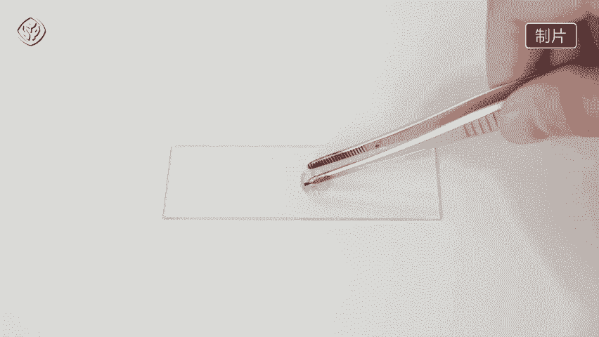
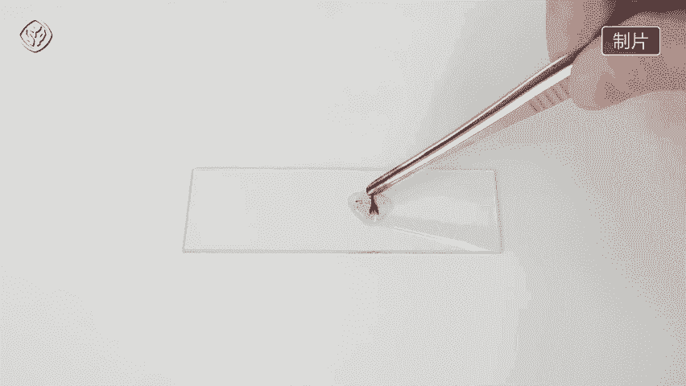
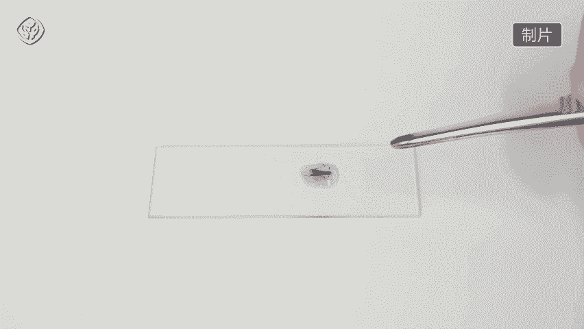
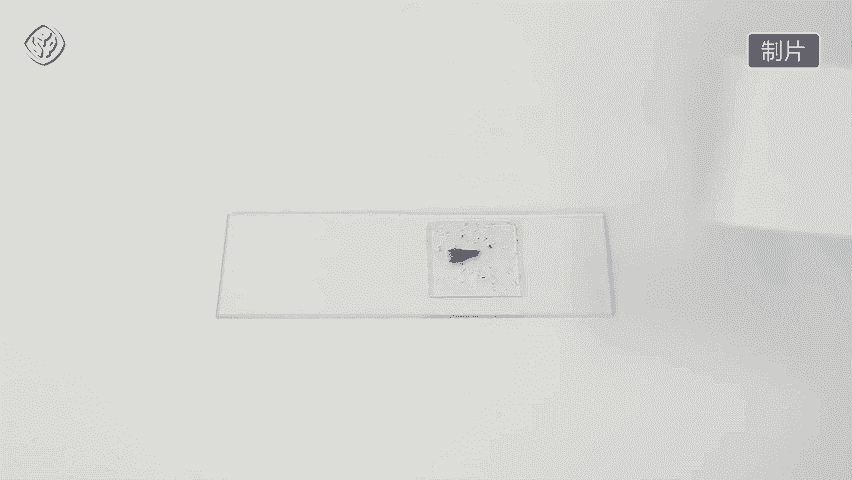

# 【必修二】5.2-低温诱导植物细胞染色体数目的变化-人教社_清晰 480P.mp4 - P1 - 你的灿宝呀 - BV1GH4y1X7BS

导植物细胞染色体数目的变化，材料用具，洋葱培养皿，吸水纸，镊子剪刀滴管在玻片盖，玻片卡诺氏液质量浓度为0。01克，每毫升的甲子溶液，质量分数为15%的盐酸，体积分数为95%的酒精显微镜烧杯，实验前。

将洋葱在4℃的冰箱冷藏室内放置一周，取出后，将洋葱放在装满清水的烧杯上方，让洋葱的底部接触水面，于是温约25℃进行培养，带洋葱长出约一厘米长的不定根时，将整个装置放入冰箱冷藏室内。

诱导培养48~72小时，剪取诱导处理的根尖0。5到一厘米，放入卡诺试液中浸泡，0。5到一小时，以固定细胞的形态，然后用体积分数为95%，的酒精冲洗两次，将处理后的根尖，放入一比一的盐酸酒精混合液中。

室温下解离三到5分钟，使组织中的细胞相互分离，为了防止解离过度，带根尖软化后，用镊子取出，放入盛有清水的培养皿中漂洗10分钟，漂洗完毕，将根茎放入盛有质量浓度为0。01克，每毫升的甲紫溶液的培养皿中。

三到5分钟，对根尖细胞中的染色体进行染色，在洁净的载玻片上滴一滴清水，用镊子将染色后的根尖取出，放入滴有清水的载玻片上。

并用镊子前端将根尖碾碎。

盖上盖玻片。

然后在装片上盖一张吸水纸。

用拇指对准盖玻片的位置，隔着吸水纸轻轻按压，使细胞分散开来。

利于观察，先用低倍镜寻找染色体形态较好的分裂项，视野中既有正常的二倍体细胞，也有染色体数目发生改变的细胞，确认某个细胞发生染色体数目变化后，再用高倍镜观察，观察到低温诱导处理后的洋葱根尖细胞。

出现了染色体数目发生变化的现象，实验结论，用低温处理植物分生组织细胞，一段时间后。