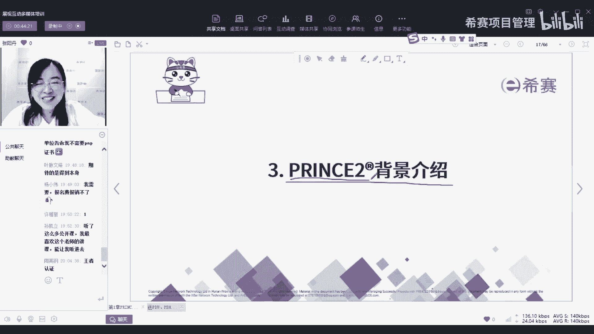
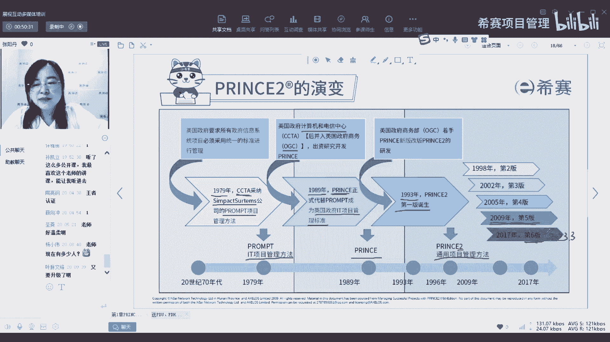
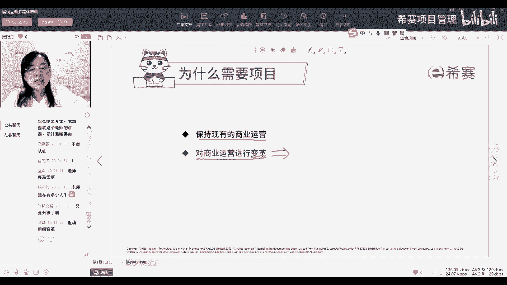
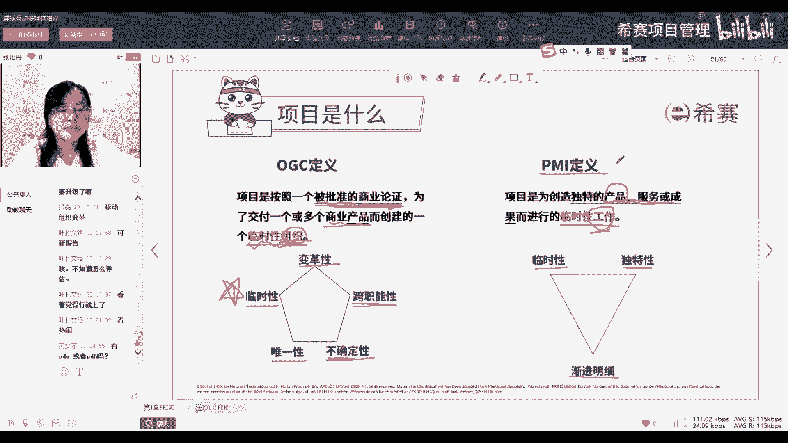
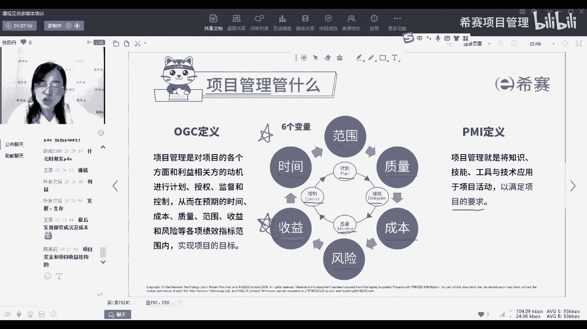
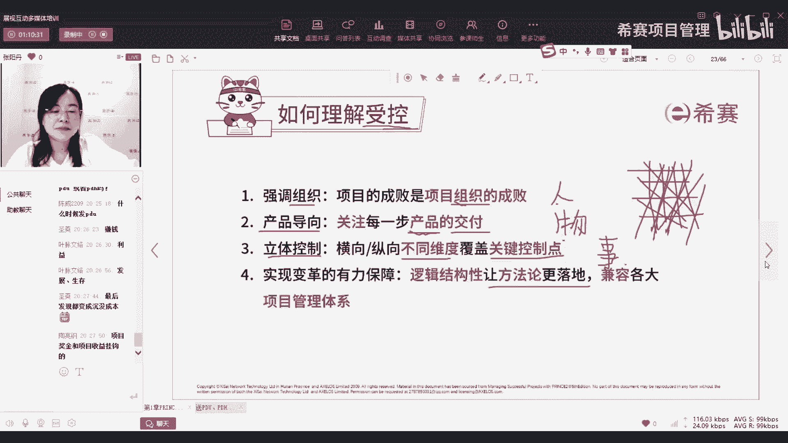
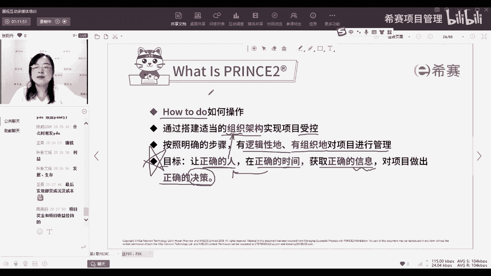

# 【报考指南】2023年Prince2认证考试介绍系列视频（建议收藏）！ - P4：04PRINCE2背景介绍 - 希赛项目管理 - BV1Ru411P74n

那在讲这个之前，大家有没有想过prince这个名字啊，会不会觉得诶一门项目管理的课程，为什么起了一个名字叫王子，那我第一次遇到的时候，我也觉得好奇怪哦，听起来不像是一个项目管理的课程。

倒是有一点像目前现在很多像什么组合呀，出道的这些组合，他们的名字什么prince two呀，prince呀，什么王子王子天团呀之类的这种类似的，那我们其实这个呢名字也是跟他的背景相关的。

因为我们刚刚有讲，嗯对有这个有这个原因啊。

好那我们来具体的看一下啊，prince to它的演变，它也不是说111出生就叫prince to，它其实也是有一些些的演变的一个过程，那最早呢在79年11家就是我们的英国政府，他用了一家公司。

就叫这个公司，Synthetms，这个公司呢他用了一个方法叫prompt，这个prompt是一个T的项目管理方法，那这个政府呢他用了这个方法以后，觉得诶管我的IT项目还管的挺好的。

他就一直在沿用沿用这一家，然后用了10年，用了89年以后，那这个我们这个英政府的计算机和电信中心，它就并入了OGC，然后并入OGC以后呢，你再老去用人家企业的那种那套方法论，就感觉有点嗯不是很好。

就是你自己一个公一个政府部门，你没有自己的体系，你还要去借用企业的，所以他就通过这10年对这个prompt这个，方法论的一个使用，然后呢总结了一些经验，然后又总结了一些自己的一些实际项目中。

吸取了一些经验，然后就创建了我们的prince，就这个时候就是我们prince真正的出现了，就是89年他就出生了啊，有没有89年的小伙伴，刚好跟我们prince是同一年的啊。

那这个时候呢他就是英国政府的I7，项目管理的标准，就是只要是英国政府相关的it相关的项目，那都必须要用prince这个方法论，去进行项目管理啊，有个同学说啊，老师今天温柔。

一方面是因为老师那个嗓子这两天有点不舒服，所以声音有点低沉，希望大家不要觉得我的声音过于的低沉，就好了好，那但是89年他刚出生的时候呢，他还是只用于it部门，但现在呢他已经成为一个通用的了。

那什么时候他成为一个通用的了呢，就是93年就他又用了几年，觉得诶IT用的很好，但是好像这个他也不是那么局限于，只能在IT领域用，我别的领域好像也可以用啊，所以呢他就在93年产生了prince two。

就从prince变成了它的进阶版，叫prince two，这个时候的to呢，就代表是通用的项目管理方法论，意思就是不只是IT领域用了我其他的领域，我的制造业，医药业，甚至军工企业，包括那个软。

其他的一些领域都可以去使用的一种方法论，所以这个就是to的意思有，因为有很多同学以为这个to是不是第二版，但其实不是第二版，它只是为了跟以前的IT的这个标准，去进行一个区分，是作为一个提升升级版。

所以呢就是一个to，但是后来呢他就觉得，就因为他一直都只是说是一个通用的方法论，就没有再把这个数字进行一个变更，所以就一直叫prince，就这样降下来了，那他从出生以后呢，嗯93年有了第一版。

现在到目前最新的已经是第六版了，那第六版，那但是我们目前啊跟大家讲一下，我们目前学的是第五版，考试也是第五版，为什么呢，因为prince他虽然学了这么有这么多版本，然后刚刚我们也讲了。

他是什么时候进的中国，08年进的中国，然后你看他08年进了中国，09年出了第五版，但是他在刚开始进入中国的时候，它是一个全英文的，就是不管是教材也好，考试也好，都是全英文的版本，然后就发现进入中国以后。

中国的市场，就是你要想要在一个像中国这么大体量的，一个国家去推行的话，你如果只局限在英语就有点受限，所以呢他就一开始要开发中文版，所以呢09年出了第五版以后呢，就开始逐渐的在去推中文版。

那中文版推出来以后，后面他是17年才推的第六版，当时退出G6版也都是英文，然后是今年年今年3月份才有了第六版的中文，也就是今年的2023年3月，才出了第六版的中文的教材。

所以我们目前因为他出了新版的教材，那我们去做课研呀，课改也是需要一定的时间去熟悉这个，他更改版以后的这个教材，以及他改版以后的这个考试，所以我们目前主流的就还是在考第五版，第六版的话呢。

我们预计下半年可能就是会推出，第六版的中文了，所以如果同学们感兴趣的话呢，到时候也可以再来看一看，第六版和第，我们也会再去讲第六版和第五版，有哪些更新的内容，所以这一点要跟大家再讲一下。

我们为什么没有考，又有同学问我老师现在已经是最新的第六版了，为什么我们还在学第五版，是因为这个点是因为中文和英文的关系好，这个就是我们prince two的演变，那演变到现在呢就是第五版。

第六版最新的了，对是的，所以不过呢其实我们看了一下它大体的内容，框架没有变化，就还是我们的三个七还是这样，只是说对于每一个框架，就是每一个七里面的细节的一些东西，做了一些些的调整。

做了一些些的补充或者是一系列的删减，这个不管你是考第五版还是第六版，对于你实际做项目影响是不大的，你没有嗯，你不用说啊，我是不是要等等我们下半年再去考第六版，完全没必要。

如果你是想要去了解这一门体系的内容，去想要考一个证书去实用，那其实第五版和第六版都可以，你早考也是早好，那我们到时候第六版出来了以后，如果你想知道区别，我们也是可以给大家开放这个第六版的。

这个学习的权限，让大家了解有哪些不同点好。

那接下来呢就是刚刚我们说的prince two，它叫prince，它叫prince two，它的意思是一个方法论，那他为什么要起这个名字啊，那其实这个呢就是一个首字母的缩写。

它的全称呢就是projects in controlled environments，也就是在受控环境中的项目，因为它是用的非常好，所以大家一般都是称为称它为一个成功的项目，管理方法论好。

那至于说为什么刚好用了prince呢，一方面啊是刚好这些首字母的缩写，你看组成就是它，还有一方面可能也跟英国的文化有关系吧，毕竟英国的王室是文化是非常知名的，包括英国女王呀，英国国王呀这种的。

但就是大家都是非常的认可，那英国政府他当时推的时候呢，我们觉得他也有一丝丝的，想要蹭一下王室的热度，就觉得诶我跟王室相关，那我肯定那大家去去接受他的时候呢，看着女王的面子上也要去给他给。

就是去关注一下呀，去支持一下，这个意思，我们觉得是这样子的，但是官方没有给嗯，没有给出具体的解释了，所以这个大家就自己自己领悟，自己想要你想要去从哪个角度来理解，都是可以的，好。

那接下来呢我们就来具体的拆解一下，我们这些单词，因为它其实就是这几个单词，三个单词，所以我们就具体的来拆解一下什么是项目，什么是项目管理，那什么又是受控的环境好，首先我们讲什么是项目。

那在讲什么是项目之前，大家想一想，我们为什么要项目，为什么我们需要项目呢，因为你看有很多公司他会觉得说啊，我就是做运营呀，我就是正常的我的产线，五条产线，我的订单都是够的呀，我每天我的产线都在跑。

我就正常的去做呀，为什么现在突然你说我要把一条产线停下来，要去做改造，要浪费我，可能几一两个月或甚至是几个月的时间，我没有办法去铲除我的订单，我要来做你这个项目最终还不一定能有收益。

不一定能把我前几个月损失的，我的订单量补回来，为什么呢，为什么需要项目，那大家其实学了PP，其实应该能知道，PP里面有讲说我们要去怎么样，它有两个点，为什么要做项目，就是首先我们要去获取商业价值。

其实呢是要去推动我们的组织变革，嗯那我们在prince to中去讲了，我们嗯企业，目前所有的企业其实都面临两个问题，一个呢就是我们要保持现有的商业运营，还有一个呢就是对我们的商业运营进行变革，进行变革。

也就是变，那既然变，你要你怎么样去变呢，是不是就得通过一个项目去变，所以呢在prince two中呢，他就强调项目是引入变革的一个手段，那至于说我们为什么要变，就像我刚刚说的，我的项目做得好。

我的运营做的好好的，我的产线跑的顺顺的，你突然说啊，把这个产线停了，我要去变，为什么要变呢，人家产线同不同意你变，厂长同不同意你变，那我们变的前提肯定是什么，肯定是有问题。

就像我们中医有一句话叫什么堵则痛，痛则思变，变则通，你肯定是有一些地方堵了，比如说我刚刚说的，你一个一个工厂，你的项目你的产线运营的很好，你的订单也很好，但是你能保证说是你现有的这个产线，能一直很稳定。

或者说你现在产能一天是10K，你也不能说一直安于现状，说我我10K我就满足了，那你也得想一想，我能不能一天做到12K，如果我能一天做到12K，那我是不是可以产生的订单就更多啦。

那我每个月的营收是不是就更多啦，所以这个就是我们变的一个点，或者是说我现在一个一天做10K，然后我的单价是多少，那有一个竞争对手，他说他引入了新的设备诶，他一天可以做20K出来，然后它的价格就变低了。

那对我来说是不是就对我造成了一个威胁，那我要是想跟他竞争，我就不能说我还拿我10K的日产能去跟他，20K的日产能去pk，那我肯定pk不赢呀，那我就怎么样，我也只能去唉想办法提升我的产能。

比如说我去买一个新设备，组一个新的产线，或者是招一些更有经验的一些工人，这这些也都是我要去变的一个点，所以那我们既然要变，我们就需要用项目来进行变革，因为你项目就是一个小小的短短的。

或者是一个嗯投入成本不那么高，不会去影响到我正常的运营模式的，这样的一个事件，去促使我一边可以运营，还一边可以去想办法去做一些提升，做一些改变啊，这个就是我们说为什么要去做项目，那知道了为什么要做项目。

接下来呢就是项目是什么，那在pp中也就是PMI的定义，项目是为了创造独特的产品服务，或者是成果而进行的临时性的工作，那这个定义呢是第六版的定义，但是现在在第七版里面其实就是骗PMP的。

第七版其实已经开始，对于他这个定义做了一些调整，就是他的他认为啊，我的项目应该不仅仅聚焦在，我要去创造我的可交付成果，而应该要聚焦在什么，聚焦在我的预期成果，也就是我做这个项目。

想要达到什么样的预期效果，他想要给我给对于我的组织也好，对于我的公司也好，做出什么样的贡献，从这个点出发去做，而不是仅仅去看我产出的东西是什么啊，这个是P的定义，NPU的定义呢它就更加的细致。

更加的清晰了，prince to定义是，项目是按照一个被批准的商业论证，为了交付一个或多个商业产品，而创建的一个临时性的组织，他这里也提到了商业产品，但是呢它有一个前提，他交付商业产品的前提是。

要通过被批准的商业论证去交付，什么叫被批准的商业论证，大家记不记得商业论证的作用是什么，商业论证它有另外一个在偏僻中，它另外一个名字叫什么经济可行性研究报告，也就是研究一下我这个项目是否可行。

那我们嗯有讲说你做项目，你肯定是要研究它的可行性的，但是我们在P中呢没有去强调这个点，因为项目pp里面的商业论证是在项目之前，也就是他前期的工作，而我们在prince to中，他是明确告诉你。

你要做项目，你就要去考虑商业论证，商业论证是项目中的一个环节，就你做项目，你必须要去自己去研究一下，你这个商业论证，你这个项目是否可行，就是你为什么要做，那它能给你带来哪些好处。

这个好处是不是大家都认可的，以及我是不是可以做出来的，那这个呢我们具体后面再讲那个主题的时候，会专门有一个主题，就是商业论证，去详细的跟大家讲商业论证的内容，那既然这里他提到了被批准。

也就是说首先我得就是叫什么教授哎那个词啊，突然脑子下短路，就是我得是名正言顺，我得确定我确实做这个是可行的，我才能去做，而不是说哪个领导脑子脑袋一热，一拍脑袋说哎你去做一个这个，然后做了一段时间以后。

他又觉得哎不赚钱，那算了，不做了吧，那像这种的就非常的伤人的，就是打击人的积极性，虽然你不做了，对我的工资呀什么的没有什么损失，但是我们辛辛苦苦投入了很多时间精力去分析，去准备，去构建规划。

结果你突然说不做了，大家有没有遇到过这种情况，就是你前期老板让你去说唉要做一个新项目，你去做一堆的分析啊，收集信息啊，然后去汇总去整理啊，去天天给他做报告，说说觉得这个东西怎么弄啊，规划呀。

然后也跟相关的部门都沟通好了，让他们提供多少资源呀，怎么怎么样，然后突然你都弄完了，去找领导，然后领导也说好，你开始做吧，你们多多，你做了一段时间，领导突然跟你说，嗯不哎呀，不做了。

这个呃上面就是没有人给钱或者怎么样的说，我们又想了别的方案了，你这个案子就不做了，然后让交给别的组做别的事情去了，哎这种时候真的是非常的打击人的积极性，就是你辛辛苦苦的付出的努力，然后啪打水漂了。

所以我们在prince中，他就告诉你不要去做无用功，如果你一开始就能想清楚，你这个可能是无用功，那我们一开始就不要去做，而且它还有一个非常特别的点临时性的组织，你看pp说他是一个临时性的工作。

也就是说你就做事就行了，只要把这个事儿完成，至于具体谁来做没关系，你项目经理一个人做完也行，而且事实上大家是不是经常做事的时候，就发现什么事都是项目经理做，追进度也是项目经理追追采购也是项目经理追。

然后呢质检也是项目经理去追，包括测试品质的事情，都是项目经理在拿着小鞭子在后面催他们说，哎呀快点去测呀，哎呀快点去给报告呀，哎呀快点找客户批准呀，哎呀快点去安排出货呀，就项目经理就就是他一个人的事儿。

其他人就是说唉呀催我了，我就动一下，你不催我就没有那种主人翁的意识，觉得我确实得做这个事情，而像prince two中呢，他就明确了项目，它是一个组织，也就是说不是一个人能完成的。

你必须要大家一起凑在一起，每个人都明确我要做什么，每个人也都把自己，当成是这个项目的一个主人翁，就是我确实有所要承担的责任，那这一块我认领了，我就要对他负责，而不是说我分配给你，你分分配给他了。

他说你为什么分配给我，我不是很想做，那既然那你催我就做，你不催我就不做，是这样子，所以既然它把它设定成一个组织，那大家都明确自己的职责了，就不用项目经理在后面拿个小辫子打着他，催着他往前走了。

而且还有这个另外一个点，我们刚刚讲到的prince to，它针对的是什么，除了项目集，还有组织集，就是组织型，就是这里的，因为它是涉及到一个组织，所以呢我们就会要了解组织里面的各个层次。

有哪些人负担哪些责任，谁要参与进来，谁要进行决策，谁要去执行具体的交付工作啊，这样是不是大家就很清晰了，你有了责任人，有了DRI，该怎么做，就找他，他没做好，那就是他的责任。

他要去承担这一部分事情的一个后果，好这个就是它们的定义，那特点呢pp里面它的特点就是三个临时性，独特性，还有一个渐进明细性啊，pp啊prince two里面呢就是五个特点，其中临时性和独特性呢。

就是这里的临时性和唯一性跟偏僻是一样的，那它还有三个一个变革性，就是我们刚刚讲到的，它是引入变革的手段，你要去变，你就得通过项目来，所以它具有变革性，就肯定是跟现有的东西，在现有的基础上是去做一些变化。

做一些不一样的东西，同时呢因为我们要涉及到方方面面的人员，所以他肯定是具有跨职能性的，你得跟不同的职能部门打交道，那这就意味着什么，意味着你再去规划的时候，你就不能只考虑你一个层面的内容。

一个部门的利益也得考虑到方方面面的利益，怎么样让，因为我们之前说你做项目，如果只有你一个部门收益，你是肯定推不动的，比如说生产，他说他为你做这个项目能给他带来什么，因为我们都是什么利益驱动。

你没有说是你在公司做项目，你还能说什么，我靠着人情，因为这个生管主管跟我熟，他就帮我做，那个是那个人跟我熟，所以他愿意给我弄，没有的，你肯定都是以利益去驱使你，如果只靠你的人格魅力，也没有谁赢。

能有那么大的人格魅力，所以你要去考虑会有不同的部门，不同部门之间的利益可能会有冲突，你就要去获取他们的利益，然后想办法能让他们去有利可图，他们才能愿意去帮助你去完成这个项目，那还有一个不确定性。

那这个不确定性呢其实就是风险对吧，我们在pp里面也有讲了风险管理，但是在prince two中，它会强调项目都会具有不确定性，因为如果你的项目都是确定的，你一眼能看到我所有的事情的发展都是正常的。

不会受到干扰，但其实也就不需要我们去管理它，你就像一条那个像那个玩具，放在那个轨道上的小火车，你只要按了开关键，它就绕着轨道一直绕啊绕啊绕，这种情况下你不去管它，它反正一直一直绕。

但是我们的项目是真的这样吗，你按了开关键，它就自己在轨道上跑了吗，肯定不对，不是啊，它中间会有各种，就像我们在路上开车一样，突然冲出来一个人，突然路上有一个坑，突然嗯前面堵车了，这种不确定性很多。

你都要去及时的去呃掌握你的方向盘，掌握你的油门，掌握你的刹车，所以才需要我们去做项目管理，所以我们的项目经理就相当于是一个驾驶员，你要确保你这个车一直开在正确的道路上。

这个就是prince two的项目的五个特点，那这五个特点呢考试的时候会考，所以大家一定要记得。

好那接下来呢就讲关于项目管理管什么，项目管理在PP里面呢，它其实就讲了，你要去满足项目的要求，但具体什么要求没有讲，因因项目来说，你可以去根据你的项目自己去设定，而prince two中呢。

他明确了六个指标范围，质量成本风险收益和时间，那其他的五个呢，也就是说我们你去管项目，就是管这六个方面，你这六个方面你都去给他设定目标，如果都达成了，那就说明你做的很好，那你怎么去管呢。

就是通过pd c的循环计划，授权监控监督以及控制，去不停的循环去管理这些，那这六个变量大家其实都比较熟了啊，像时间呀，范围，成本质量风险，就是PP里面讲的唯一一个不同的收益啊，我们等一会儿啊。

把我们把这个项目管理这个这这一点讲完了，我们休息课间休息的时候给大家送PDU，那你这个收益这个点嗯，大家做项目有没有想过我为什么要做这个项目，就是你刚刚有很多同学是做项目管理。

有没有想过为什么要做这个项目，仅仅是说这个工作给我发工资吗，仅仅是说我把项目做完了会有奖金吗，对对从我们个人的角度来说，我们当然是希望能赚钱嘛，就是有，但是你从整个公司层面，他为什么要接这个项目。

他为什么要把招你把你招进来，让你来做项目管理，去管这个项目，其实就是要去看收益，你必然是要对给给组织，给公司有收益，才会要做项目，但是其实我们在实际的工作中，很少有项目经理他会去考虑收益，他都不考虑。

他只会考虑说我要怎么去做，我要怎么去把它做好就行了，但是如果你不考虑收益，其实是很危险的，就是你只就其实还是之前我们讲的那个点，你知道你要做什么事情，但是呢你没有一个驱动，你就觉得啊我为了我的工资。

我得去管好这个项目，但是其实你就之前我们老师开玩笑说，你就算项目管得差，他又不会扣你钱，还是按着还是正常给你发工资呀，怎么样的呢，那你加班加到11点，跟家道跟05：30就准时下班，全凭个人自觉。

就看有些人他脸皮厚，像我们之前有一些主管就是脸皮很厚呀，他到点就下班，没搞完，被客户骂骂就骂一顿药，又不影响他的工资，但这种其实对于管项目来说就很糟糕，会影响到我们的项目推进，所以对。

所以呢你就得你要去关注收益，你要知道这个项目能给你小的来说，给你带来多少奖金，大的来说能给公司带来什么，这样的话大家才能有共同的驱使的动力，是的好，那这个呢就是我们项目管理，要管的六个绩效指标。

这个呢考试的时候也会考基础题，考的会比较多，所以这六个词时间范围，质量成本风险和收益。

大家一定要记在脑海里，那最后呢我们把这个数控讲完，讲完我们就休息一下，那刚刚有讲他是受控环境下的项目管理，那受控是怎么理解呢，其实就结合我们刚刚讲的几个点，首先呢强调组织就是项目的成败。

是项目组织的成败，也就是从人的角度出发，如果你项目没做好，肯定是人的问题，你人员不配合人员管理的有问题，你人员的该做的职责没做到位，才会出现偏差，所以呢就从人的角度先把人管好，那管好了人也就成功了大半。

每个人都明确自己要干什么，每个小兵都站在自己该站的位置上了，然后接下来就是开始做第二部产品导向，关注我们产品，关注产品是什么，关注产品的质量是什么，关注产品的交付，也就是从物的角度出发。

也就是告诉你要做什么事情，告诉你要做什么东西出来，这样的话你就很明确了啊，我的职责是什么，那在这个产品中，我负责哪一环，具体我要达到一个什么样的程度，以及第三点立体的控制，那这个立体控制呢，其实就是说。

我们从不同的维度来给一些关键的节点，也就是我们要怎么样做事情，去确保我们的人和，确保我们的产品都是按顺按要求交付的呢，也就是从市的维度出发，那从这三个维度出发，其实就相当于是我们去织一个网。

以横向的网是人，纵向的网是物，那洗交叉的这个网呢就是我们要做的事情，你把这些网都把这些经纬线都列得很密了，那是不是你这个网就比较容易能兜得住东西，就不用担心它会超出你这个控制的范围。

它就在你这个网子里面跑，那这样就会更加的容易在我们的掌控范围内，所以呢这个就是我们讲的prince，它的受控的点从这三个角度都给你包含进来，让你的项目做的更顺畅，更容易。

而我们既然把三个方面都讲的这么详细了，那其实呢它的方法论呢就会更加的落地，也就是更容易实操啊，这个就是我们受控的这个概念。

好那我们来回忆一下啊，回复习一下我们刚刚讲的prince to是什么，首先就是告诉我们该怎么去做，就是具体每一件事情怎么做，具体每一个文件怎么写，同时呢通过搭建适当的组织架构。

也就是从人的角度来确保我们的项目是受控的，以及安排怎么样去做事，由谁来去做事，就通过一个逻辑化的概念，逻辑化的流程去管理我们的项目，那他的目标是什么呢，这个目标非常的重要啊。

让正确的人在正确的时间获取正确的信息，对项目做出正确的决策，那我们后面的内容呢也就是会从比如说组织，就是讲我们的人怎么样去做正确的人，怎么样去找正确的人，那流程以及计划。

就是怎么样在正确的时间去找这个正确的人，获取正确的信息，也同样是在我们的计划进展和流程里面去体现，让他获取正确的信息，而做出正确的决策，就是去确保我们每一个节节关键的节点，我们做出的决策都是可行的。

都是可以推动我们项目继续向前的，那这个就是我们prince是什么。

