# 【报考指南】2023年Prince2认证考试介绍系列视频（建议收藏）！ - P6：06PRINCE2高效备考 - 希赛项目管理 - BV1Ru411P74n

那接下来呢就讲了一下我们的高效备考，也就是说我怎么样可以顺利的通过这门考试。

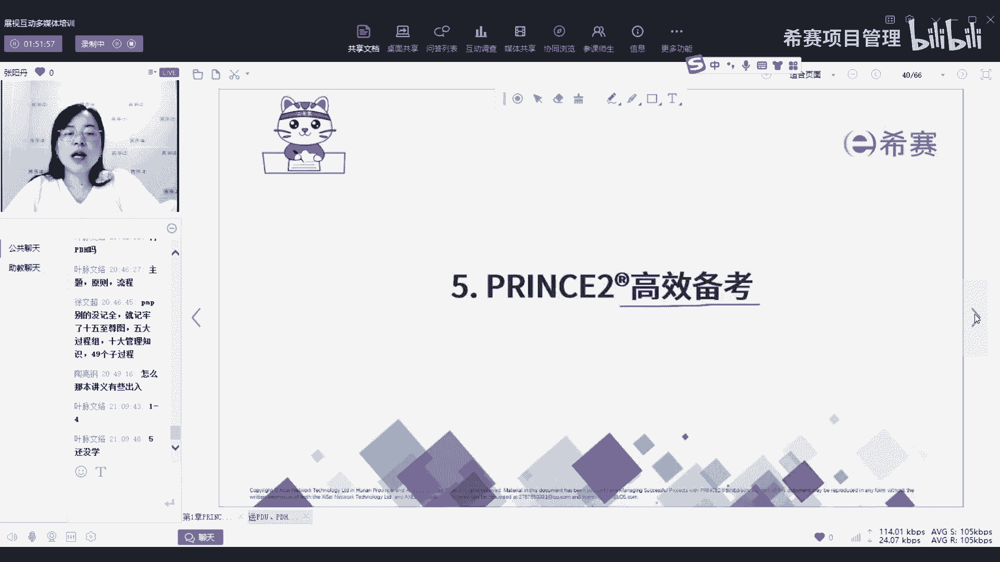

那在讲这个考试之前呢，先来跟大家明确一下我们学习的初心，就是因为有很多同学问我说，老师我考了P图的证书，真的能找到工作吗，真的能像你刚刚讲的，我可以找到一个30K，40K或者是嗯那个年薪过。

就是工资翻番的工作吗，那这里老师要先跟大家说一个实话，你们想一想，如果你考一个研究生的证书，你能保证一定能找到一份非常好的工作，钱多事少，离家近这样的工作吗，不一定对不对，因为你就算是研究生毕业。

他也会有在研究生这个门槛里面，也会有一些更好的，会有一些更不好的，所以呢你还是得去实际的去选择，去做一些那个筛选，那你研究生的证书都不能保证说，你一定去找一个非常好的工作。

更何况仅仅是一个专业技能的证书，它的含金量，绝对比不过一个研究生的文凭的证书，所以说这个点的意思是什么，不能说把所有的赌注都放在这个证书上，就说我一定靠这个去换工作，升职加薪，迎娶白富美，如果没有达成。

那就是这个证书没有用，所以他其实本身我们学这个证书应该是什么，应该就是我们要去提升，我们本质上的本本身的能力，提升我们的不管是项目管理的能力，还是一个思维的能力，还是一个体系化的一个搭建。

这都是对于我们能力的提升，而至于说我可以去找更好的工作，可以去找到更好的工资，那些都是怎么样，都是他很能带给你的附加的价值，而这个附加的价值有当然更好，但是你不能仅仅把这个附加的价值，当做你的目标。

如果是这样的话，那我们的目标就比较难达成了哦，所以我们的初心，首先第一个通过考试，这是自然的，你既然要考证，你肯定首先就是要通过，那我们呢也是可以确保大家都能，只要你按照老师的要求来认真上课，认真刷题。

认真复习，那你通过考试是没有问题的，我们目前prince的通过率是百分百，这个老师可以给你讲啊，是百分之百，所以通过考试我觉得对所有同学都没有问题，只要你按照我们的要求来做了。

这个我是可以给你打包票的好，然后呢你学了通过了考试，那就说明你这个知识至少你学了吗，那你的体系是不是就在你的脑海里，3742有了一个框架，那就把我们平时工作中缺失的那一部分，为什么要从这一步走到下一步。

这些之间，他们的一个零散的这个线就给它搭建起来了，那再接下来呢你既然你体系都已经搭建好了，那你是不是就可以提升了，对于你自己来说，你的能力就提升一些了，那同时跟着我们一起学习，包括我们群里面。

我们的班级群里面有很多同学，其实都是有很非常丰富的工作经验了，思考问题的角度也是不一样的，大家一起讨论，那你就可以知道诶，切换一种看问题的角度，那对于我们的思维能力也是一种提升，而这个PGU的页面。

我等会下课的时候会再放一次啊，我们现在课上就不再放好，然后还有就是拓展人脉，拓展人脉，这个呢也是给我们带来的一个附加的价值，就是我们有班级群呀，然后也会有一个那个叫什么校友群。

那大家都可以进入到相关的群体群里面去，跟同行业的人呀，或者是同一个位置的同一个地理环境的人呀，一起去沟通一下，了解一下，切磋切磋一下，那你就可以认识到更多的人，你的眼界也会变得更广啊，李中华同学。

关于培训费，你可以咨询一下销售啊，然后老学员应该是有折扣，就是如果你是现在的老学员，他是可以有折扣的，而且好像还可以送PDU，如果报名老学员报名还可以额外送PDU。

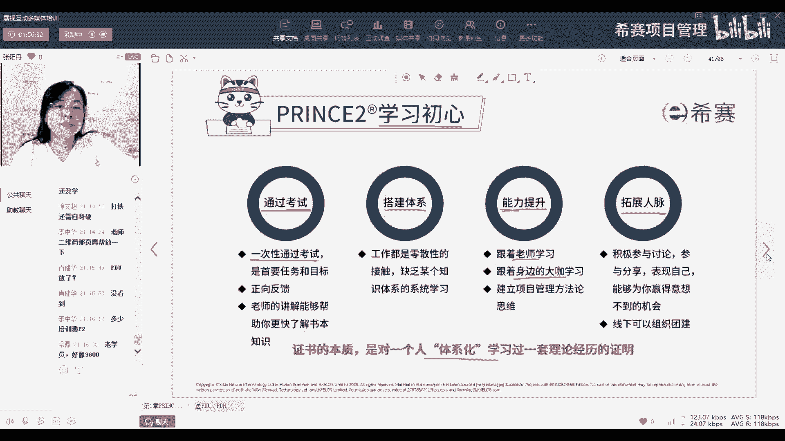

这个就是我们学习的初心，那具体备考考试的类型呢，刚刚我讲了，我们考试是分为基础级和从业级，那基础级呢其实它就是没有什么考试条件，就是你只要学完了就可以去考，那它的题型呢就是75道单选，然后又五道不计分。

所以总分70分，通过35分就算通过，那他呢是闭卷考试，考试时长是一个小时，要提前15天在网上预约，因为它是线上考，所以你是提前预约的，那从业绩的考试它就有一个门槛，要么你是通过了基础级的考试。

或者有PP的证书，这两个条件二选一，只有满足这两个条件，你才能去考从业级的考试，或者是说你可以先去考从业级的考试，然后再拿到偏僻的证书，这个是没有关系的，就是你的偏僻证书是在你从业级考试之前拿。

还是之后拿都不影响，但是你得有，因为你得有P的证书，他才给你发从业绩的证书，不然的话你那个考试的成绩会有，但是没有证书出来好，然后从一级的考试呢，它是八个大题，每个大题下面有十个选择题。

这十个选择题的题型，我们等会也会展示总分的80分，然后呢通44分算通过，他也是网上考，提前15天预约，然后是2。5个小时，他是开卷，开卷的意思呢就是可以看官方教材啊，就这本书这个大家报名了以后呢。

也会寄给大家，然后只能看这个官方教材，不可以去嗯什么翻书那个网上查呀，找别人咨询呀，都是不行的，只能看书，这个是考试类型。

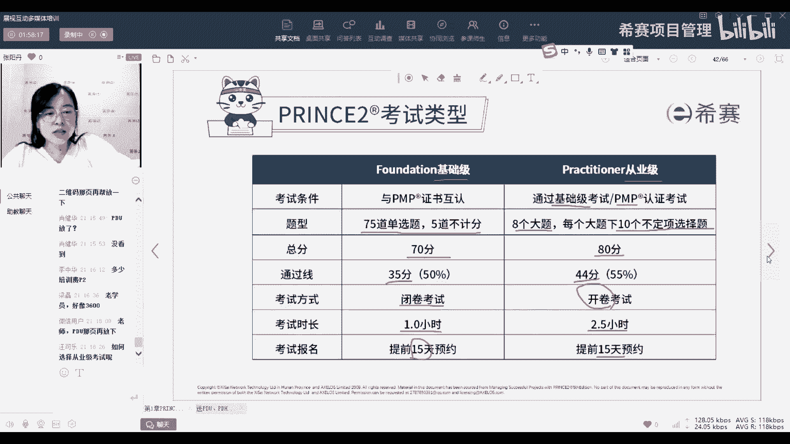

然后题型呢基础题的题型就是选择单选，问你什么什么，然后四个选项让你选一个好P2的这个多选啊，也来跟给大家看一下，我们从业绩，首先从业节的题型，它的项目情节它会有一个项目情节，就是会告诉你一个具体的项目。

你让我们做PMP的时候，经常会说他这个信息给的不全，就经常会说啊，我不会会去脑补他这个是什么意思呀，这个人他会不会有别的想法呀，但是从我们prince to从业绩，他就是避免你有这种脑补。

他就把这个项目的信息给你写的非常的详细，告诉你你有几个阶段，每个阶段有哪些活动，你为什么会有这个项目，你这个项目具体是什么，他要做哪些内容，以及它会一些文件，比如说商业论证。

具体有哪些信息都会写的很清楚，然后你基于这些信息再去判断，所以有很多人也说我们的从业级的题目像什么，像剧本杀，就你先把自己融入到这个项目去，像在看一个故事一样融入进去，当做是故事里面的一个角色。

然后基于这个角色，你可能要去做出一些什么判断嗯，考试费考试费应该是好像是一样的吧，你这个啊好像不太一样，你也可以去问一下啊，因为考试费这个我也不太清楚，可以问一下销售啊。

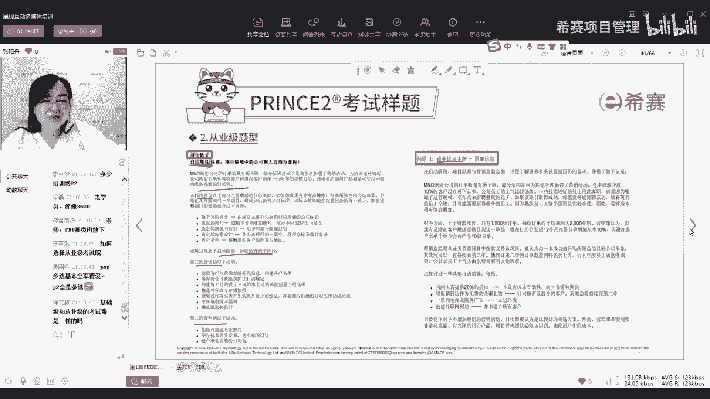

然后题型这个有同学在说说这个多选怎么办啊，首先呢它也会告诉你，你要选两项，而且这五个里面的，其实两项会比pp里面的要好选，是为什么它这些内容都是有一个前提，比如说他问你，他应该记录在哪个标题之下。

那这个标题你就去书上找这个标题的定义，然后找了那个定义，你就看这句话是不是那个定义，如果是就判断对，如果不是就直接排除，所以会容易一些嗯，然后还有一种呢叫逻辑判断题，就是会给你两句话，一个是命题。

一个是理由，理由呢就是书上的知识点，命题呢就是项目情节里面的实际的案例，那我们就要去判断命题和理由，他们之间他们是不是正确，就是知识点对不对。

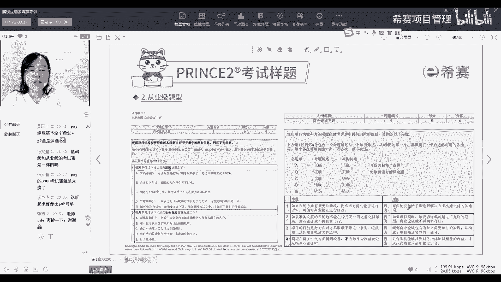

以及这个案例对不对，然后还有111些题型，就是嗯像这种这个是比较特别的一个题型啊，就是嗯他会左边给你四个选四个题干，右边五个选项，一般看到这种，大家就会觉得是连线题，但它不是连线，它其实是什么。

是这四道题有共同的五个选项，就是说你做第一题，你要从这五个选项里选一个，做第二题也要从这五个选项里选一个，那就是只展现形式不一样，就是本来他应该是第一题是什么，然后ABCD5CDE五个选项。

然后第二题题干是什么，ABCDE这样去选，但是呢因为这五个选项都一样，它就放在一起了，那大家第一次做的时候，如果你没看清楚，你可能就会以为他是连线题，这样就容易做错。

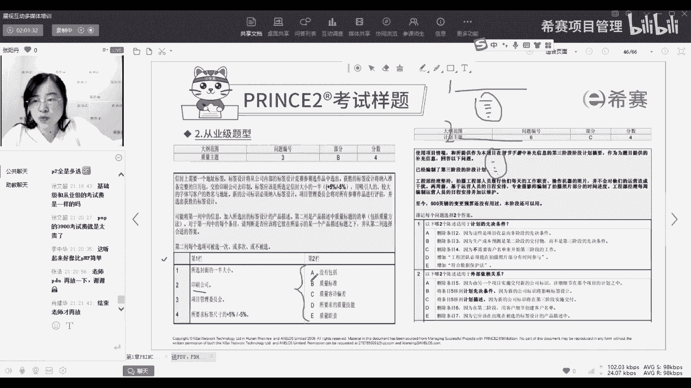

这个只是展示的问题，好这个就是我们从业绩的一个题型，那我们怎么样去备考啊，结合我们pp里面的五大过程组，给大家做一个计划，就启动阶段先报名，然后了解我们的课程，计划阶段呢就是定一个学习的计划。

同时课前要去预习啊，这个老师也跟大家提醒了，大家可以提前去预习我们的视频，执行呢就是我们具体的你定了学习计划，就要按照计划来完成，要我们的所有的课程都要按时的去听，如果没有时间听直播课。

听回放也可以要把它补上，然后呢有问题就问我或者问佩奇老师都可以，我们都在群里，然后呢我也都加了同学们的微信，有问题都可以来问，包括我们在群里有什么不懂的都可以去问，都可以互相交流。

还有我们群里面会有群案例讨论，大家要及时的去参与监控，就是嗯老师会有些同学说，哎老师你怎么知道我学了多少，老师能看到你们的学习记录，所以如果你没有认真学，我会去提醒你，定期提醒你。

然后我们还会有模拟卷去测试一下你的成绩，如果老师觉得你测试OK就会提醒你，让你去考试，然后考完了，那我们就证书反正到手了，同时在实际的工作中去运用了，那这个实际的运用呢不仅仅是在收尾一次。

他就会转到我们的运营阶段，去持续的去运用我们的时间，这个就是我们的备考流程，啊它不是八篇短文啊，它是一篇整的，会有一个整的前提，然后呢结合到每一个大题，可能会有一些附加信息嗯，你考基础还是从业。

这个是看你自己啊，王小英同学，你如果有PP证书，你就可以直接考从业级，你如果没有PMP证书，你就可以去考基础级。

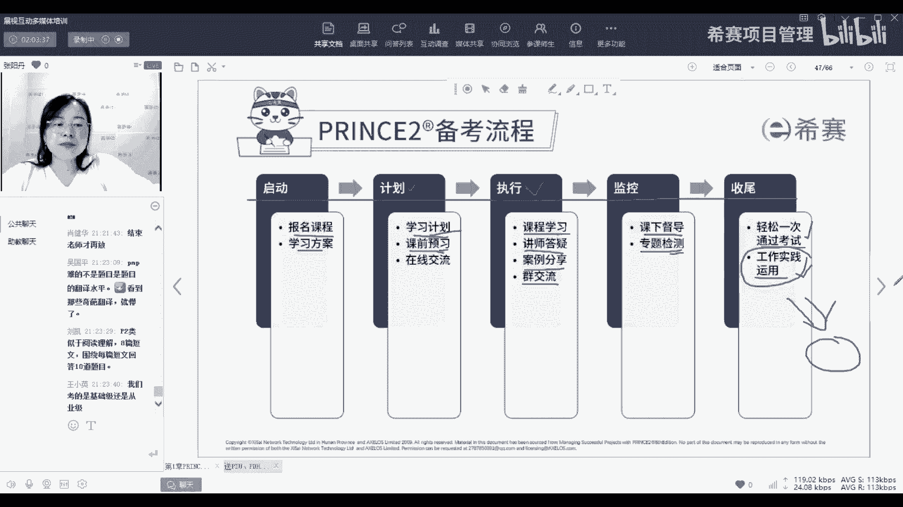

然后我们的学习方式呢，就是首先你要读那个看书，我们的官方教材大家都收到了，没事可以先看一看，然后呢我们在政课学习上面，你学完了每一章就回去把政客，把书上的相关的内容看一看，就比如说我们今天学了第一章。

你回去就去把第一章的书翻一翻，老师讲的重点取标一标，然后后续所有课程学完以后再去把书翻一遍，又会有不一样的理解，然后积极的输出你学的知识点，及时的去发出来，跟大家一起交流，一起互动。

然后有一些案例呢也可以把它，就比如说我们可以做一些呃管理产品，像商业论证啊，风险登记单呀，这些产品你去结合自己的工作去写一写，写完了以后可以发给我，帮你去检查，帮你去批改。

然后就是关于我们要去利用一些小技巧，因为我们是开卷考试嘛。

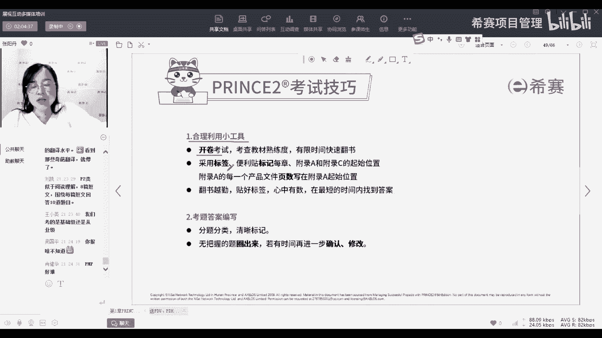

所以呢大家直接去贴一些标签，比如说像这样在书上贴一些这种标签。

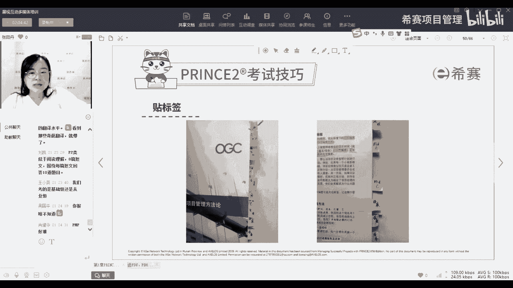

方便我们去翻书，然后呢还有就是我们的一些英文，这个每一个主题，每一个章节的英文，大家可以写在附录这里嗯，写在目录这里，对我们线上考试就是带官方教材，因为那就是开卷，因为它的重点从业绩的重点在于你去运用。

所以他不去要求你一定要死记硬背这些，他只要你理解就够了，那你理解其实他也觉得你既然理解了，那你是不是逐字逐句地记住了就不重要了。

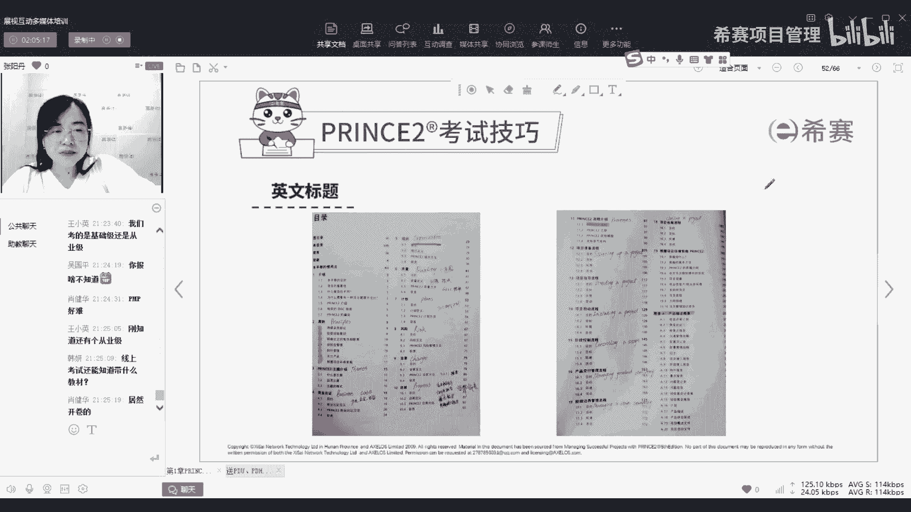

所以是允许你翻书，然后这个英文标题大家可以截个图，课后呢在你的目录那里备注一下，因为考试的时候，他的大纲范围他可能会用英文写，所以呢如果大家英文平时接触的少，就可以备注一下，这样到时候翻的时候也比较快。

好线上考试他会那个就像这样，我能看到你可以开摄像头，到时候那个考试的软件你也是会开摄像头，他能看到你，然后他会要求你把书展示给他看。

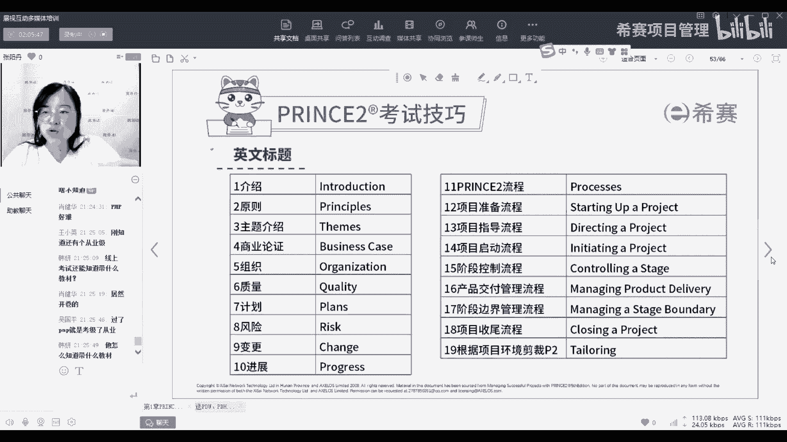

然后考试的流程就是如果你要考试了，你就去找销售去买那个考试费，他会给你发链接，然后买完以后呢，班主任会把考试卷发给你，然后我们就去官网去注册，注册呢就嗯去激活账号，然后有如果有偏僻证书就上传。

然后呢就去预约考试，预约完了你就及时的去下，会下载一个考试平台，我们就去测试，然后到考试那天就登录去答题，然后提交交完以后，马上这个成绩就会出来，就你考完它就会显示你考了多少分，通过还是没通过好。

这个考试费你可以去问一下销售啊，陶亮刚同学，因为我具体不太清楚，他好像如果你报一门还是报两门，会有一些区别对。

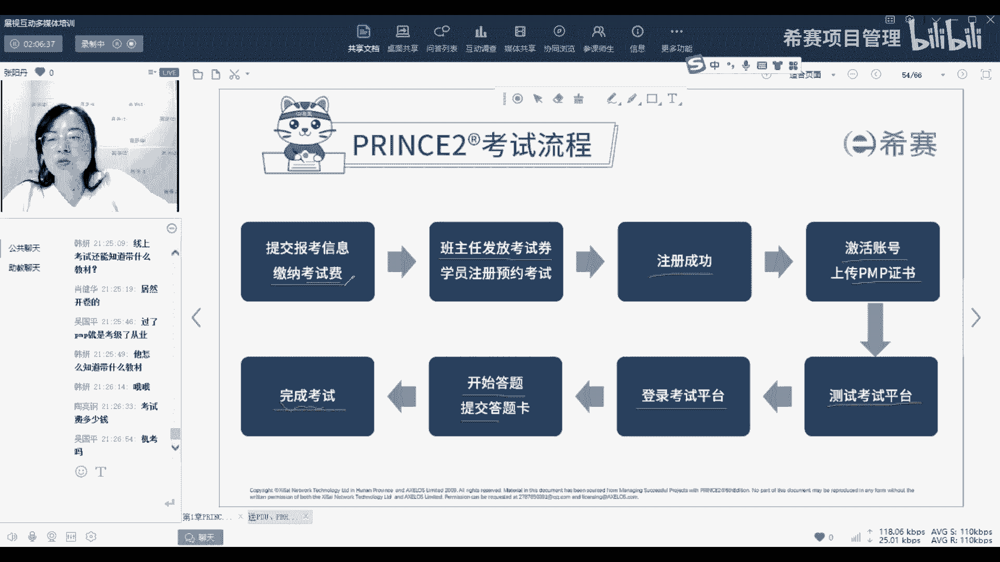

都是机考，就是你自己的电脑考好。

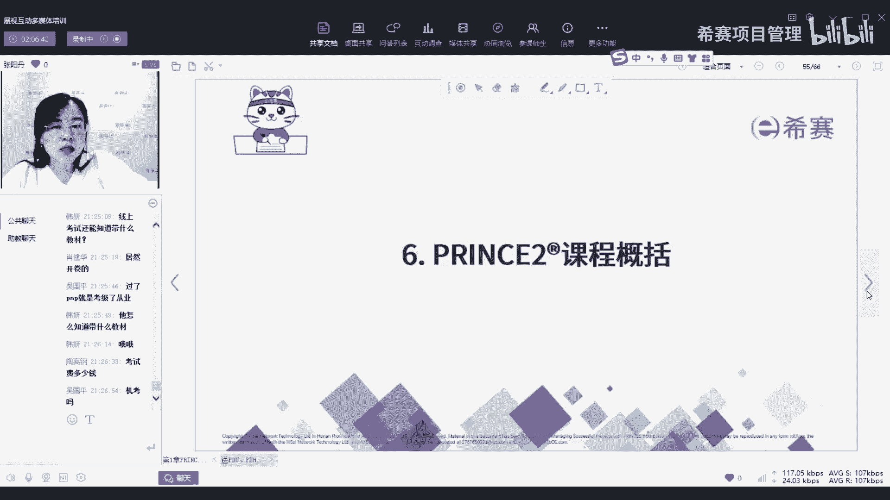

然后呢，我们的课程概括，就是我刚刚其实在前面老师介绍的时候，有提到，我们一共课程会有案例课，习题课，教练课和模考课，那案例课和教练课呢就是佩奇老师讲，就主要是讲我们通过案例来强化，我们的知识点的理解。

以及按教练课呢，就是对于实际工作的问题进行答疑，而习题课和模考课，重点就是做题，考试刷题的重点就是复习知识点，找题感，然后强调解题技巧和通过方法，就是由我来讲，那我们的这两条线呢。

就是如果你想要重点在于要去考证，那你的第一就是看第一条线，就是我们看录播课，然后直接看习题课，模考课去复习，从这条线如果你的时间不是太够，就走这条线去先考证，那如果你的重点在于说。

我想要具体的去学习这个知识呢，就走第一条线，通过录播课去预习，然后案例课，教练课以及我们的群案例讨论，从这条线去深化我们的知识点。

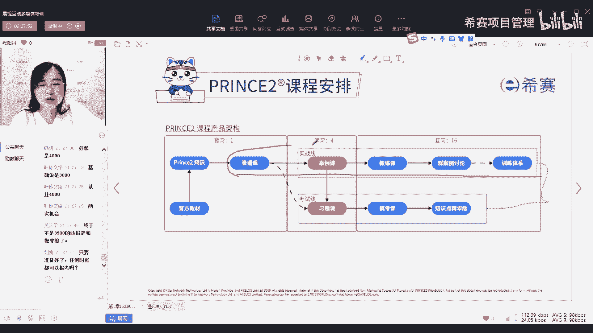

然后我们的群案例讨论呢，就是每周五我们会在群里发一个案例，那同学们应该如果进群比较早的，应该已经接触过几次了，就是会发一些实际的呃小例子，工作中的例子，然后让大家去讨论，看看怎么样去做。

然后呢同学们就会发表自己的观点，那你就可能从这些别人的发言中知道诶，他看问题的角度跟我不一样，那我就可以去学习一下，参考一下对，只要你准备好了，你什么时候都可以考，当然你准备好的前提是要来找我啊。

需要我帮你把把关，帮你评估一下你是不是真的可以考好。

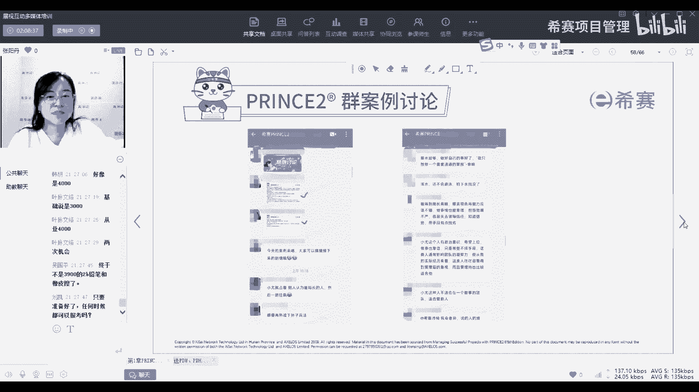

那我这个呢就是我们的课表，大家应该报名的班主任应该也发给你们了，我们的课表呢集集主要是集中在周二跟周四，那也会有几天是安排在周一，周五和周六，因为会涉及到一些我们课程的变化。

包括像这里是应该是有那个假期吧，好像所以才会有有一些些的时间不一样，会要去稍微做一些调整。

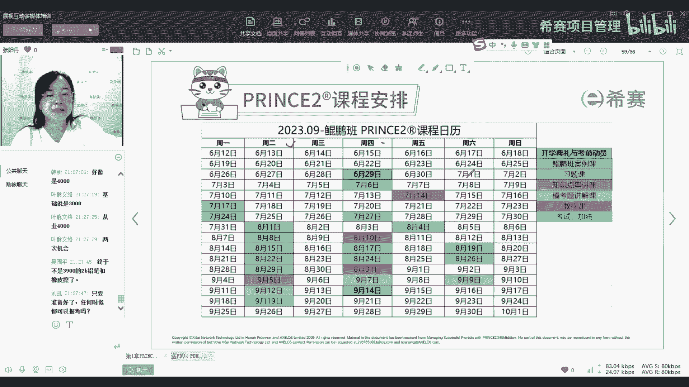

那我们的课后陪伴这个就很熟悉了，我们会有每日一练，然后章节练习，每日每日无题，就是我每天在我后面嗯，上完商业论证，我会开始在群里发每日五题的小程序，大家就可以直接在群里做题。

然后呢题库里面有两我们两套从业级的模拟卷，两套基础级的模拟卷，因为prince他的考试，它重点在于让你知道怎么去考，所以呢它的题量不会很多，你只要掌握他这个出题的思路，基本上考试就没有问题了。

所以不要看它很少，多刷总是有用的，然后呢就是刚刚有同学提的就是报考费数，老学员报名呢可以打八折，那你去问一下，看最近还有没有什么别的活动，说不定会有更多的一些优惠，这个我也不知道可以具体要问销售。

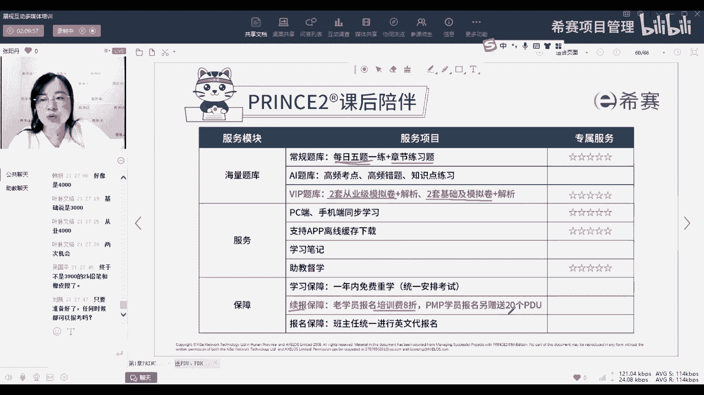