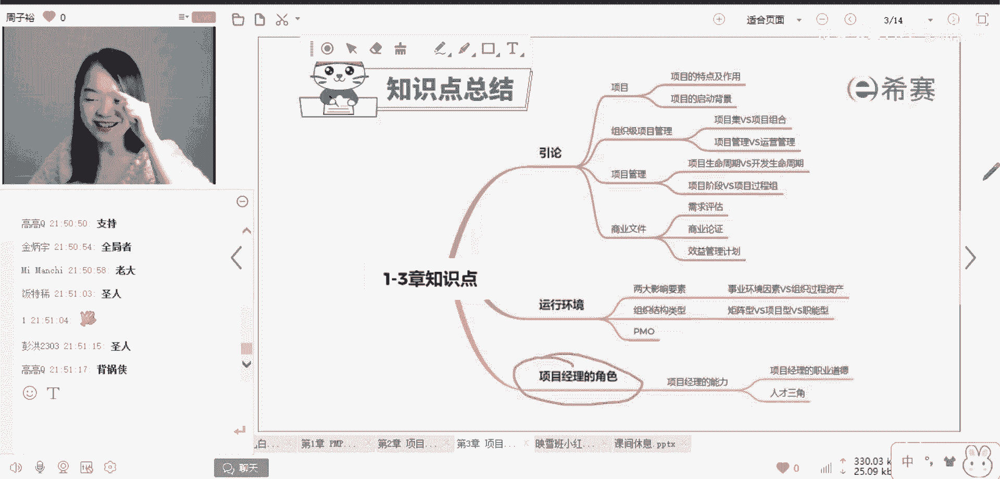
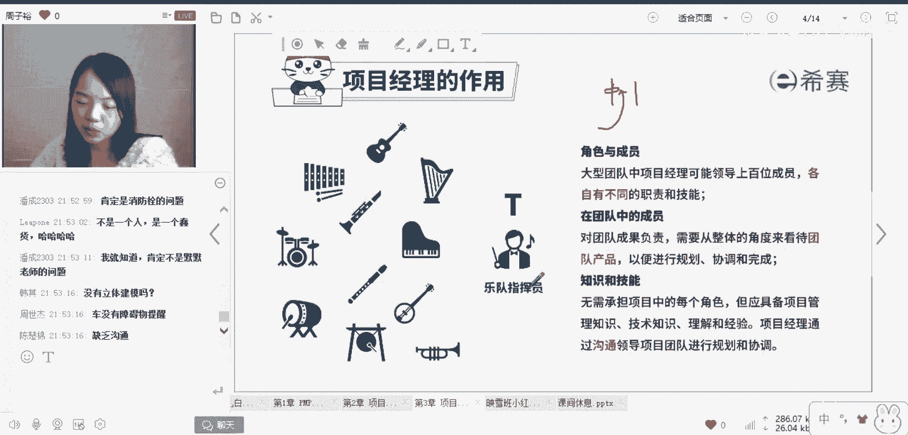
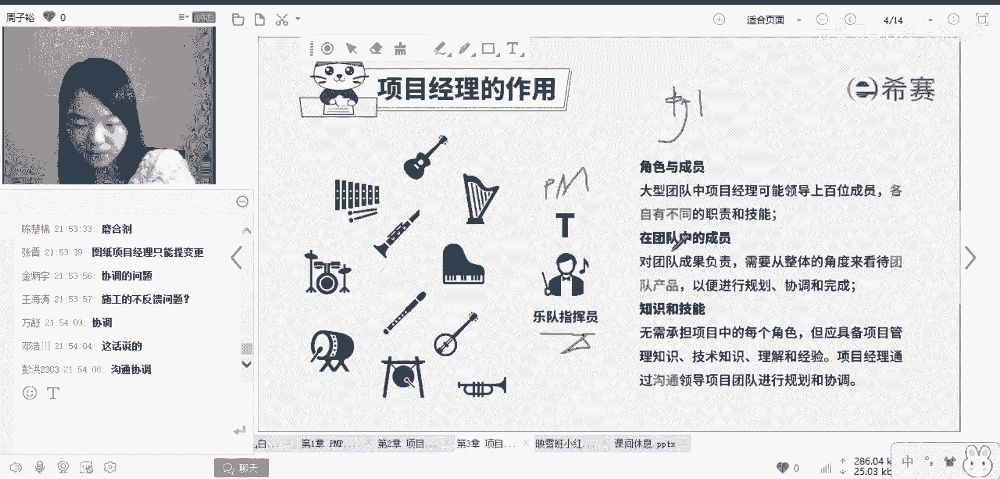

# 【收藏】2023年《PMP项目管理视频教程》最新版PMP相关概念考点解读精讲视频（建议三连~收获更多） - P3：视频3 项目经理的角色 - 希赛项目管理 - BV1WP411D7KJ

好我们刚才学到了项目的运行环境，接下来我们来讲一下。

如何成为一名合格的项目经理，也就是说我们要去了解一下。

项目经理所要承担的角色，来项目经理的作用，项目经理的角色其实考点很少啊，也是我们预习过的同学啊。

都在这里给敲圣人了，没错圣人就是你，你就是圣人。

怎么理解呢，想一下项目经理他是一个什么样的角色呀。

我举个例子，这个例子也是我一直在给大家提的。

我前两天我前两天啊，我在地下车库去停车的时候，哎我是一个老司机，我18岁考的驾照，我把自己的车给划了。

我停那个地下车库啊，我就去呃，倒车倒车入库的时候，突然有一个消防栓伸出来，把我车屁股给划了，我是顺着这个停车线把这个车停进去的。

大家帮我想一下啊，我的技术你不要去。

我想就不考虑我的技术原因，我明明是顺着这个停车线走的很好，结果他消火栓伸出来把我的车屁股给挂了，为什么呀。

为什么出现这种情况。

为什么，引导错了哎对了。

设计规划有问题不错，因为我是做工程出身的，我原来搞这种消防验收检查，搞监理啊，我立马就想明白这个问题出在哪了，你说你搞一个工程，消火栓不伸进停车线，这是不是最基础的要求，那为什么会这样呢。

因为画消防设计图纸的人，和画停车线设计图纸的人，他不是一个人，也就是一张图，他画了消火栓的位置，一个图，他画了停车的位置，停车线的位置，两张图上各自没有对方的东西，所以他们两个都觉得自己做得对。

但是他们没有考虑到，这两个图叠加在一起就出现问题啦。

这是为什么呢，就是因为这个协调者的角色没有做好。

项目经理没有做好，所以你会发现p m p的项目经理啊。

它往往就是很类似于乐队的一个指挥员。

这就是一个很典型的项目经理，确实所以就是你说你几个人。

几十个人共同去演奏一首曲子的时候。

你要想每个人都是演的对的节奏，哎呀你弹钢琴的弹的也对。

你吹笛子的吹的也对，但你们两个合不上了，为什么呢，其实就是这个项目经理指挥没有做好，所以乐队指挥就是一个典型的，非常类似于项目经理的角色，他可以从中协调，所以我们说项目经理是干啥的呀。

它最主要的作用就是对这些事情来进行统筹，规划协调，所以每个项目都必须要有项目经理，所以在一个团队当中。

每个人他能各自负责不同的职责，当然也会有我们团队共同负责的东西。

而作为项目经理，他应该去做好沟通，做好协调，通过这种技能来从中进行整合。

这就是一个典型的项目经理，那我问大家，项目经理需要掌握所有的技能。

你作为一个乐队的指挥，你需要吹笛子弹琴吹拉弹唱。

任何的乐器你都要会吗会吗。

不需要不需要，所以说项目经理他仅仅是一个管理者的角色。

这些技能不是说你一定要懂的。

所以这一块就是项目经理啊，找到一种感觉，他就是一个统筹者。

