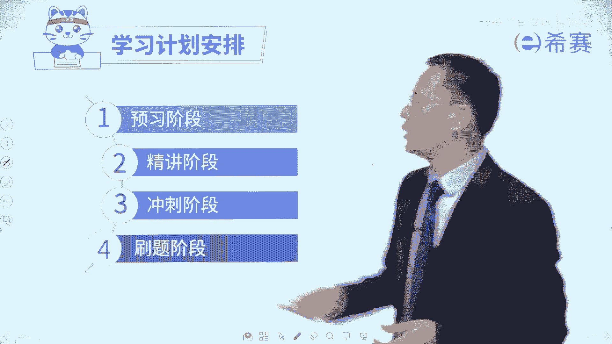

# 【收藏】2024年PMP项目管理考试第七版精讲视频《PMBOK指南》学习教程！零基础入门！ - P46：0.10PMP考试学习计划安排 - 希赛项目管理 - BV1gcpMeRE5C

大家好，接下来由我跟大家一起来共同分享一下，关于偏僻考试他的那些学习计划的安排。

那我们关于学习呢我们是分到这样几个阶段，首先前期是有一个预习的阶段。

我们做了一些预习以后，你去学习这些内容就会变得更轻松一些，接下来是有精讲课的阶段，冲刺的阶段以及后面的这个刷题的阶段，那我们的给大家做了这一个学习计划，大家可以看一下啊，比方说我以某一个班为样例。

我们在前面呢会有一个叫预习阶段，会建议大家去预习什么东西，请注意哦，这个预习不是说你可预习可不预习，真的是要认真的预习，要认真预习880视频教程，也就是罗老师在这个大屏幕前认真的去讲的，这些东西。

要花时间认真去预习一下，然后接下来是到了正课阶段，那么正课呢其实最好是跟着我们的节奏来，尽量去上啊，一般是先预习过这个章节，然后再上这个内容，你会变得更轻松一点，你要是完全没有上过的话。

如果也没有工作经验的话，没有这样一些项目管理工作经验的话，你听起来可能会有点辛苦，所以呢还是会建议这个预习的部分要做啊，紧跟着去做，一边预习，一边上课，一边预习一边上课，这样是可以的。

然后到第三个阶段呢是冲刺串讲，那么这个冲刺串讲请注意，我们现在也是一个是把这些内容，从从头到尾去串一遍，并且呢我们现在有个特色，就是西塞考神陌陌老师会给大家做一个点睛课，那这个点睛课已经是接受过这个呃。

考试的验证啊，效果非常好，一定要认真的去听，后面第四个就是刷题阶段，因为只要是做偏僻的学习，肯定是需要去刷题的，你要是完全不刷题，这个就有点难度，单刷题呢，它并不是说考试就是从这个题库里面来。

但是你会能够通过刷题来去知道这些试题的，出题调性，解题的思路，掌握一种做题的手感，那么这样的话遇到各种题目，你都会变得更加迎刃而解啊，轻松一些，最后还有一个冲刺，就是做一个总复习啊。

对应的就去参加考试了，那我们除了有这些东西以外呢，第二个就是我们会稍微去在这个学习计划中，列出来，我们的这个日常学习的一些基本的一些信息啊，比方说课前预习看什么，然后学习看什么，然后章节练习题在哪里。

然后错题回顾在哪里，然后拓展题在哪里，思维导图在哪里，然后再有的是资料啊，我们所有会能够给大家看到的资料，我前面也有讲过，我们会给大家开放三个班级，就是每一个季度会有三个不同老师来讲课，对不对。

打个比方，我我和呃谁来去配一个班级，然后陌陌老师和谁来配一个班级，然后佩吉老师和谁来配一个班级，那我们三个老师是三种不同的风格，我们会把这三个不同风格的老师的课程，都会分享给你。

你可以从这个地方去看到那些个视频课程，你可以去挑选那种适合你风格的老师的课来听，那还有就是我们最后会更新一个日历，能够看到，你会发现，你其实只要花上大概3~4个月的，这个业余时间好好学习。

你就可以顺利掌握这一套结构化项目管理知识，能够对你的职业能够去助力，并且呢我有一句话要送给你，叫求其上，得其中，求其中，得其下，求其下必败，所以一定要对自己有高标准，严要求往上进，然后奔着3A去。

不是说非得要拿下3A，但是你要有这个心性，有这个状态的话呢，你的学习会变得更好一些。