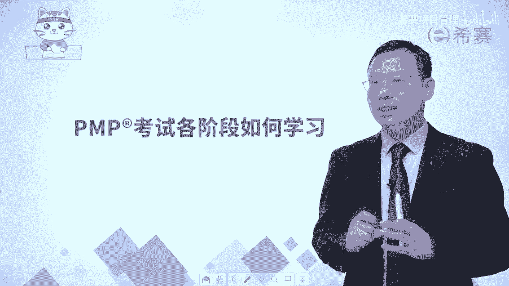
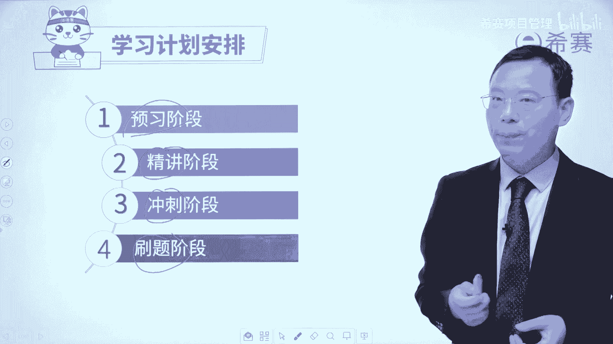
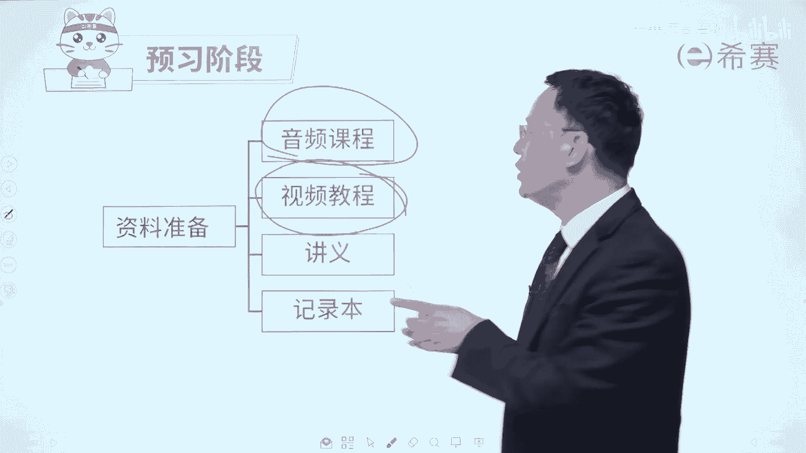

# 【收藏】2024年PMP项目管理考试第七版精讲视频《PMBOK指南》学习教程！零基础入门！ - P47：0.11PMP考试各阶段如何学习 - 希赛项目管理 - BV1gcpMeRE5C

大家好，欢迎来到习赛晚，其实有很多同学可能已经是脱离学校，已经有一段时间很久没有去认真的去学习。

以及认真去应对考试，那么拿起书说到考试会有一点点紧张，那到底该怎么样去学习，怎么样去复习呢，我们来稍微去给大家做一个简单的分享啊。

事实上我们对于学习做了这样四个阶段，是分别预习精讲，冲刺串讲以及刷题的这样几个阶段。

那我们来看一下分别怎么做，首先预习阶段该怎么做呢，在预习阶段中，我们会给大家提供的这样一个视频教程。

也就是880视频教程，就是像此时此刻，这种罗老师在大屏幕前去录的课程，然后呢，我们还给大家提供了这样一个音频的课程，也就是你每一天在上下班路上呢，你在洗碗的时候呀，在拖地的时候呀。

你在不方便去看视频的时候呀，都有这样一个完整的课程。

对应的音频可以给你免费听，还有呢就是我们有讲义，你可以是一边看视频的时候，一边去在讲义上面写一些笔记，当你把某些重要东西，也可以在本子上面去记录下来，我的推荐呢是你可以直接写在这个讲义上面。

不一定非得是拿个本子去写就可以了，那么如果说你预习过留了一些印象就是很好的，不一定说非得要是学完一遍就能记住，没有几个人能够学完一遍就记住啊，我也记不住，但是我们学过了以后呢会留下印象。

这样的话我们接下来就可以去做精讲，好像这就是一个880视频教程的示例，就是罗老师会穿正装打领带，然后在这个大屏幕前给你巴拉巴拉的去讲课，这样子是不是有点帅好，那除此以外呢，我们接下来就是到了精讲的阶段。

也就是会有某一个老师来去给你。

专门讲这一课程，然后还有老师来专门给你去讲习题课，那么这种精讲的时候呢，我推荐就是说你一定是预习过对应的章节，再听这个精讲，你会效果更好，如果你说我的时间特别紧，时间特别紧的时候选什么呢。

时间特别紧的时候，我的建议是学880视频教程的预习部分，加上这样一个精讲课中的这一个章节，练习题的部分可能会更好一点好，那么对应的这个精讲的时候呢，是拿着这个讲义去上课，然后在讲义上面可以写写画画。

去做记录，做笔记，因为有可能你在听800的时候，你只是听过一遍，但是有很多东西并没有很深入的去理解，那再听一遍的时候，你会理解的更深入一点，并且呢听完课以后一定要做一点点练习题，你做练习题。

还有就是有错题集里面的错题呢也要去处理掉，然后你做了练习题以后，你再去上习题课，效果会更好，就是精讲中既有正课，又有习题课，这都是相关联的好，接下来到第三个就是冲刺阶段。

那么冲刺阶段该怎么办呢，其实冲刺阶段中，首先第一个我们会给大家去讲这个网络课堂呃，会把所有内容去稍微回顾一下，总结一下，还有一个很重要的啊，会强烈推荐的是点睛课，点睛课，可是我们西夏的考神陌陌老师。

来专门给大家去整理这些课程啊，当然还有就是我们在平台上面会有答疑，你可以在平台上面问问题，当然也可以在群那个班级学员群里面去问问题，然后会有答疑，然后呢你要去自己去做题目，做模拟卷来去检视一下。

我们可能会安排一些这种测试呀，然后有时候如果我们没有安排的话呢，你自己去把那个后台的这种模拟卷，我们一定会在群里面提醒你，一定要认真的去做来去检测自己，你要知道坚持就是胜利对吧。

那么其实整个PNP考试啊，你在预习的时候，精讲的时候都认真做到以后，然后精讲的中也有习题课对吧，然后后面去模考再冲刺，然后最后花一点时间去查漏补缺，基本上没有太多问题。

那我们西赛呢其实还有一个好处是什么，就除了有这样一些课程，有这样一些习题以外，我们的这个平台它有一定的智能性，它能够去记录出你都做了多少东西，你都学了多少东西，你做的怎么样，那试题的正确率怎么样。

唉这都是能够去记录下来，您就可以专门有侧重的去攻克那些难关，然后不断去通过这种PDCA循环的方式，一轮一轮的去让自己变得更熟练，有人说过，我们要深度的去记住一个知识点，需要六次，需要遇见六次。

那就是啊我在这里又遇到过一次，这里又遇到过一次啊，这个地方又遇到一次，这个地方遇到两次，这个地方还遇到过一次，不就差不多了吗对吧，并且考试它并不需要你考满分，你考到108分，你就可以通过考试啊。

你考3A的话，那大概可能是呃得到80%以上的分值，你就可以拿到3A，所以一起加油，我们正所谓的说是叫求其上，得其中，求其中，得其下，求其下必败，所以我们一定要去把自己目标定高一点啊，定高一点定高一点。

