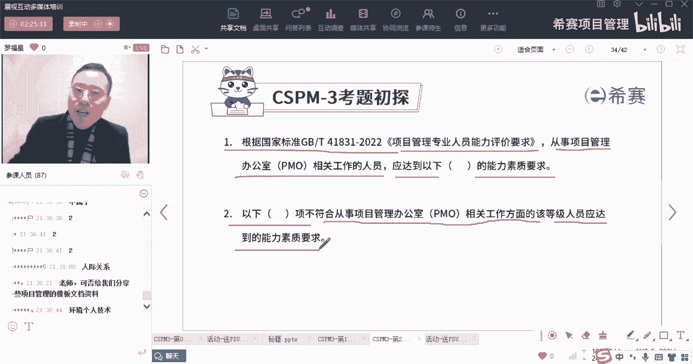

# 【收藏】CSPM-3中级项目管理认证考试直播课精讲视频合集（零基础入门系统教程）！ - P11：CSPM长空2-4项目管理专业人员的能力要求详解 - 希赛项目管理 - BV16p42197SH

好接下来我们来看一下关于第三集，他说关于第三集啊，第三集。

项目管理专业人员的能力要求的详解在里面，同样也有考上，首先就是这句话，你见过了对吧，一个是基本要求，基本要求说能够应对复杂项目目标来去实现，负责，能够以确定的方式来去做什么，有系统性的思考。

并且能够简化这些复杂的问题，以及我们做这个事情，能够去促成这些复杂的利益相关方，来达成共识的能力，能够明确各种复杂的他们决策的职责，能够去借助这些个人员的力量，能够去组织大家去分解这些复杂的目标啊。

能够去实现这些预期的复杂项目的目标啊，这是你的一个基本要求。

这是第三级的基本要求，除此以外呢，他还会有知识的要求，能力的要求和经验的要求，他的知识要求里面，他会说对于以下的知识领域，要达到应用和分析的程度，而对于另外以下的知识领域，达到一个整合和评价的程度。

这里有一个考试的题目叫资源管理，OK他是什么点，我给你稍微解释一下，就是他对于第三集，就是cs p m中，对于第三集他说你要能够去借人的事，借人的事你如何去借人的事呢，唉资源管理我们说有两个。

资源管理中包含两个资源，一个是什么，一个什么，兄弟们，资源管理中包含两个两大资源是什么，谁第一个超帅的，还没得到课堂小礼物的同学，可以抓紧时间啊，资源管理中我们一般会说要包含两大资，两大类型的资源啊。

是哪个，OK小某某学同学叫什么名字，对小学同学你叫什么名字，可以把名字调一下啊，对我们一般说是有人力资源，还有实物资源，对不对，有人力资源和食物资源，而其中关于人力资源，这不就是我们去借人的事吗。

我们就要去见人的世人，是不是，OK恭喜杨向明同学啊，恭喜杨向明同学，后面还有机会啊，兄弟们，杨晓明同学，这段上等我先讲完吧，那个那个要不然换，等一会儿等一会儿好，所以呢我们就是要知道他说在哪一个板块中。

关于整合和评价是有要求，是关于资源管理，他会希望对于资源管理，对于人对于借力的这个板块需要做得更好好，对于其他这些什么计划呀，范围呀，进度呀，质量啊，成本啊，沟通啊等等，还包括说什么汇报呀，收益啊。

变革管理啊这些东西呢，哎我们说他说能够去应用和分析，就能够去用就可以了，能够去使用就可以了，但是对于资源材料能够去整合评价，其实具体的关于整合评价和应用分析，应该说是整合评价到了一个更高的一个维度。

你能够更好的去整合这些东西来做，一来为你所用的这个情形O好。

这里有个题目，根据cs pm第三集中项目管理的能力评价要求，对于知识要求，以下哪一项是达到一个整合和评价的要求啊，请注意是资源管理啊，是资源管理，这个就不让你做了，感恩才变过好，下面还有一句。

他说带领项目团队高效高效执行，实现投资回报的最大化，它是属于国家标准，对于第三级管理人员的要求吗，是的，打个一不是拿一个二，看谁打第一个，打个正确答案出来，OK啊，这是mm同学。

你已经我已经开始超过你名字的啊，喜你恭喜你，是的，它不属于啊，兄弟们，他不属于啊，这种说叫投资投资最大化，它至少到了第四集，第五集去了，对不对，到第四集，这是第四集啊，第三集依然是属于在管理复杂的项目。

去管理复杂的项目，而这种所谓叫投资组合投投资的话，其实已经是占了一个更高的维度，这一个领导者的维度，占了一个替公司公司老板的维度。

嗯好好，除了有这个除了有个这样一个知识要求以后呢。

还有一个是能力要求，能力要求这里诶，你看到说第三集的能力要求，说从事项目管理群，群主的能力要求中的等级要求是这样的，环境能力要求个人能力要求和技术能力要求，环境能力要求是遵循标准要求。

个人能力要求是自我反思诶，跟前面一样对吧，可诚信可靠，人际沟通，团队合作哎，这里还加了一些，你看加了一些什么叫冲突管理谋略谈判诶，你会发现这些这都是跟什么有关系，兄弟们。

你有没有发现老师刚圈出来这几个词，它跟什么有关系，它都是会跟人与人之间有关系，跟人与人之间，OK我们去人与人之间产生冲突，然后我要怎么样去处理啊，怎么样人要怎么样去处理，人要怎么样去规划，谋谋划这东西。

人要如何去谈判，所以他整个第三层更关键的是借人的事，能借人的力量来做事情啊，对人际关系这一块板块为主啊，好它的技术面是什么需求啊，收益啊，范围时间质量啊等等一大堆，关于项目管理办公室也是类似的啊。

也差不多也基本上也是差不多。

我们来看一个题目，根据国家标准，那个项目管理专业人员能力评价要求，从事项目管理办公室的相关人员，他应该要达到以下什么的能力素质要求哇。

这个题目这个题目就比较这个题目就比较扯了，那么这个PO的要求它要达到什么样的能力数值，那么这里面就同样的会有这些个包括反思呀，然后有团队合作呀，还有冲突呀，谋略呀谈判，OK就说你会发现。

PO这个板块和人这块其实差不多，OK既有环境的要求。

有个人的要求，也有技术技术的要求啊，有这些要求。

所以他们这里面有自我反思和管理，自我反思和管理，那么这个自我反思和管理。

就是这个板块中的是属于个人能力，好下面还有一个题目，他说以下哪一项，它不符合从事项目管理，办公室人员在该等级应该达到要求什么要求。

没有在第三集里面要求呢，关于这些什么，他给了一个这个这个信息的原因，好扯淡，这个信的原因是什么呢，请注意他说的是能力素质要求，他说是能力素质要求，可是这些东西他说是属于知识F能力。

他说这个东西属于知识要求。

也就是属于这个地方往前面翻啊，所以这个叫知识要求，兄弟们居然会有这种题目，有点扯啊，你如果手上有讲义。

可能会更好一点，他说是这个是属于知识要求，而不是属于能力要求，能力要求中没有这个关于这些个呃。

什么计划管理呀，质量管理啊，这么多的东西，变革管理这个属于知识要求，当然这个的话你可能要拿着讲义你才好做，要没拿着讲的话，你不好做好，再往下面走。

看这个怎么选，你也可以写1234来代表ABCD啊，好我看到有很多小伙伴都已经是给了正确答案，要恭喜你啊，答案确实是选最后一个，就是说关于团队合作。

他属于能力素质中的个人能力，OK也就是说往这里看啊，团队合作是属于能力素质中的个人能力，个人能力包含什么呢，个人能力包含了有团队合作，OK包含了团队合作，包含了自我自我反思和自我管理，自我反思自我管理。

包含有冲突管理，包含有谈判，包含有谋略等等，所以这个就有点考的有点细了。

考的有点过细了对吧，在后面一个是叫经验的要求，那么经验要求，其实你前面已经在上一站已经看过了，经验要求说是如果说是呃，他说首先具有5年以上的项目管理经验，或者说是3年以上的什么什么经验。

然后呢作为一个管理者，也有5年以上的什么什么经验，或者是两个复杂的经验，然后呢还有什么组织的过程经验，那么这些经验，他说其实也可以有什么案例分享的经验呢，培训授课的经验啊，也都可以有。

但是这些经验都还是停留在，做项目的最高程度的经验，包括PO也是一样的啊，PO中也会说是关于项目管理呀，呃做流程啊，做管理啊，然后以及做组织过程，资产的这些管理都还是停留在项目的这个层面。

是复杂项目的这个层面好，这里有个题目，他说担任过一次或以上的项目群经理角色，是不是第三级的要求，是还是不是是打个一，不是打一个二，担任过一次以上的项目群经理的要求，我们有没有这个要求。

请注意啊，项目群经理，我们一般说说到项目群经理是什么呢，项目群经理是到了第四集。

项目群经理到了第四集就说群主是到了第四集，OK组合是到第五集，所以在第三集里面，他没有要求到了一个项目群的要求，他只要交付复杂的项目管理，交付复杂项目就可以了啊，所以这个题目的答案应该是NO NO。

没有这个要求好，再来看一个题目，说根据这个国标推41831202，项目管理专业人员能力评价要求什么因素，对于项目管理，专业人员能力评价是具有更加重要的影响，什么因素对于这个东西有更多的影响。

我刚才在第一章有讲过，对吧啊，有很多同学给出来叫经验，对不对，叫项目管理工作经验经验好，然后呢还有一道题目，刚刚不好意思，刚刚已经把题目答案给你搞出来了啊，还有一个题目。

他说项目管理专业人员能力评价要求，一共有五个级别，一项哪一项不属于，请注意说的是不属于，他说不属于第三级，项目管理专业人员的能力能力要求好，一个是复杂项目，复杂项目利益相关方达成共识能力。

这不是你看过了吗，对，然后建立一个受控的一个环境的能力，以及较应对较为复杂的项目环境的能力，这都是关于复杂项目管理的这个板块为主，其中第二句你可能会不清晰，不确定，但它确实有这一句原话，有这句原话。

可是我们在这个时候没有说，关于战略，我们一般讲战略在第几集到第五集，兄弟们战略到了第五集啊，战略战略到了第五集去了，是这个差别，OK今天晚上的这个CSP的课程，是不是还有点意思哈哈通过这种方式来讲。

虽然也很枯燥，但是我希望你能够你能够稍微记住，然后呢，等会我也会把这个讲义再发到班级群，我发到班级群以后呢，你一定要找时间看一看好不好，我发到班级群，你一定要找时间看一看，同时我会明确告诉你。

就是我会发的这个班级群，我是做成图片的形式来去发，为什么要做成普遍的形式来去发呢，我相信可能来去上节课里面，也会有一些一些一些竞品，但是没关系，我允许我也没办法不允许啊，只能是允许，但是我不是。

我不希望你能够能够一键把它复制过去，所以我会我会做成图片的方式再发，好不好，你们也要能够去接受啊，能够接受我这个情况也不能说，反正这个也没什么好知识产权的，但是我不想要被别人一键一键复制，是这个意思。

对整个这个内容呢，它相对来说就是比较比较就是像中国的考试，就是我们从小到大的考试，我们从小考到大就这么考的，是不是这样子，兄弟们，OK好了。

今天晚上就这么多，感谢收看。