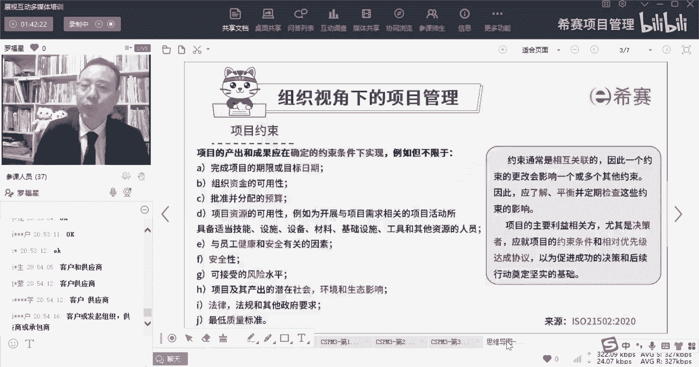
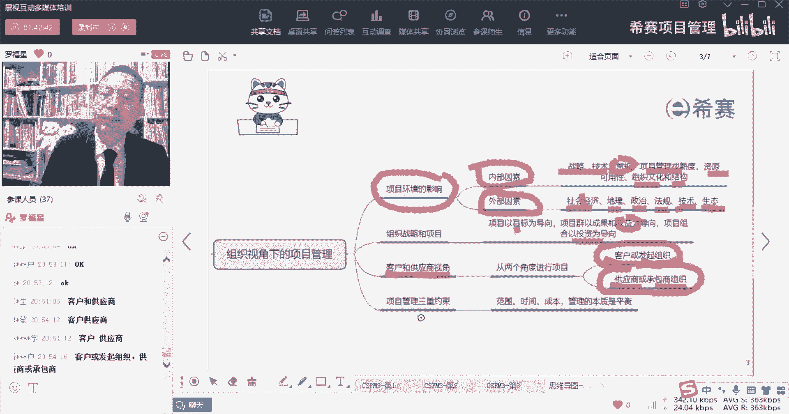
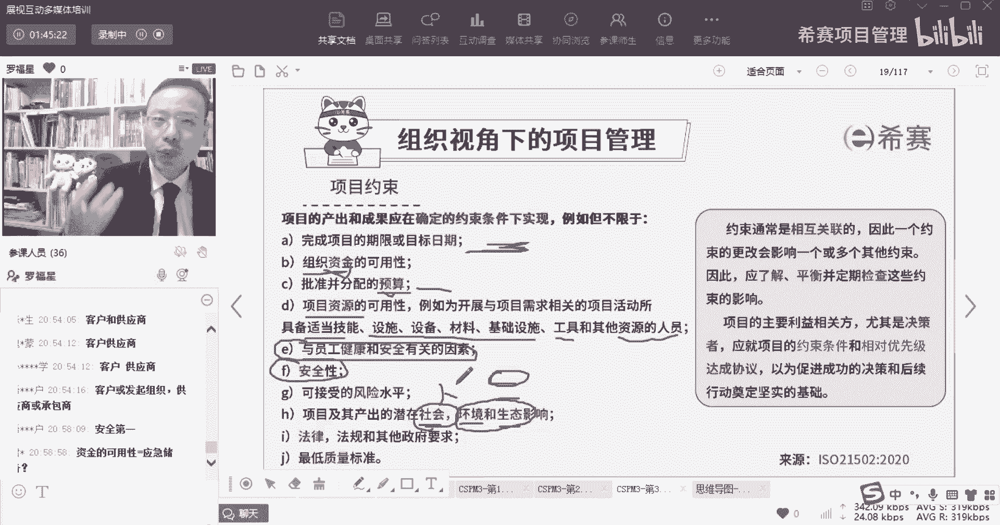
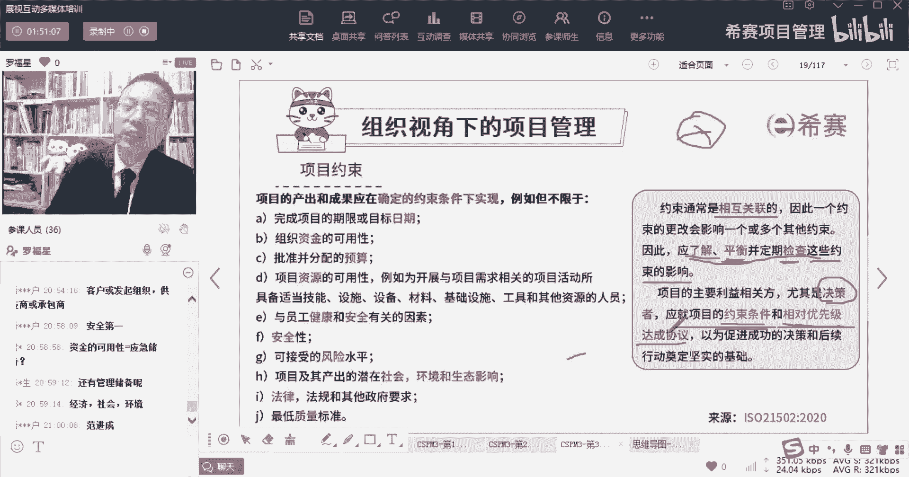
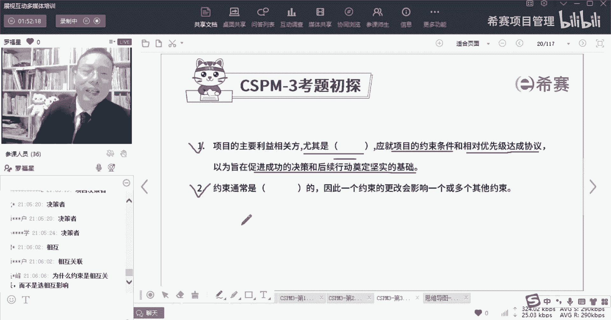
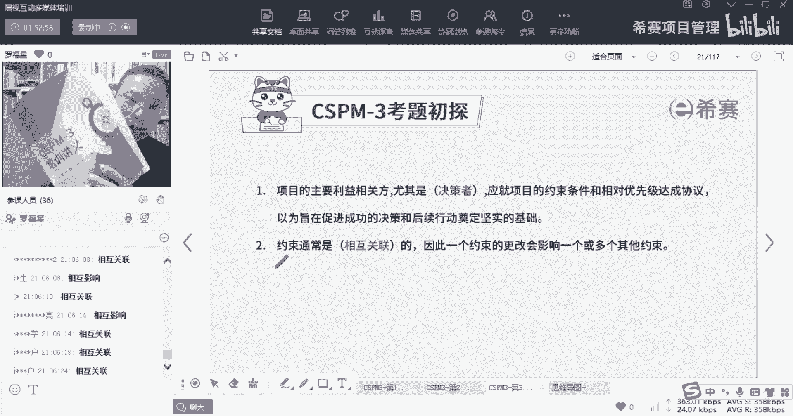
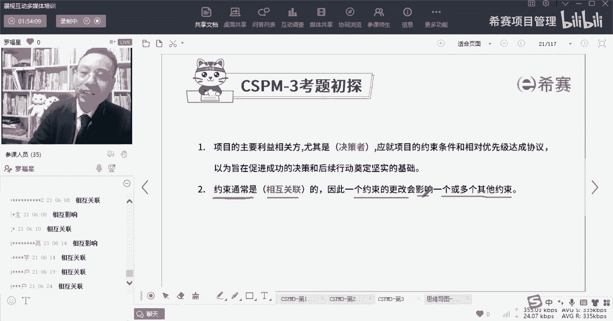
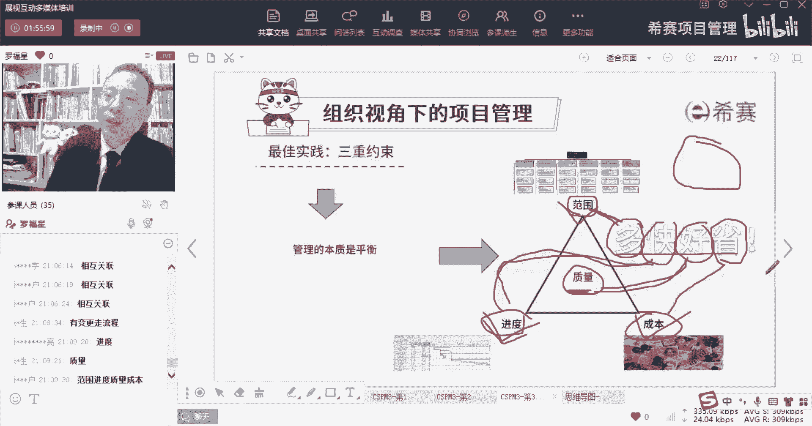
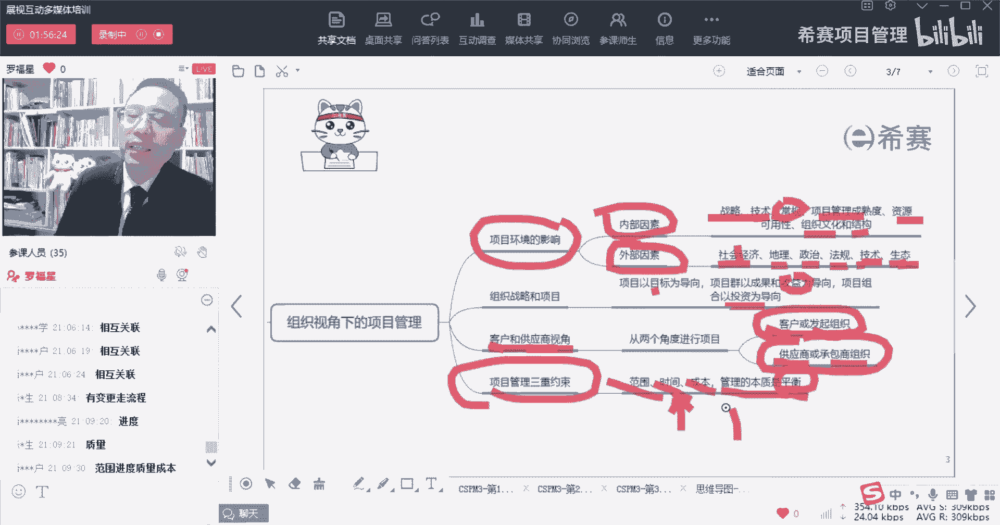
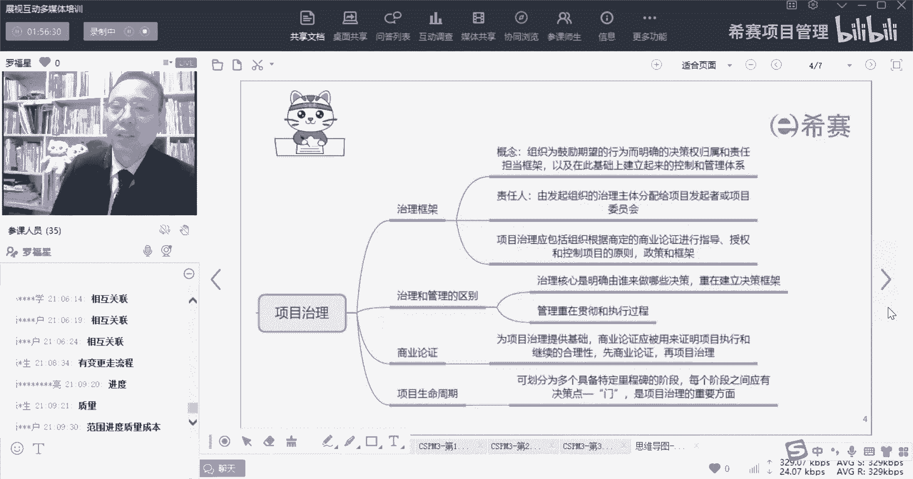

# 【收藏】CSPM-3中级项目管理认证考试直播课精讲视频合集（零基础入门系统教程）！ - P16：CSPM长空3-5项目约束及三重约束 - 希赛项目管理 - BV16p42197SH

接下来讲到另外一个信息，在组织视角下的项目管理中，会讲到第三个信息啊，叫约束啊。

这是关于供应商和那个客户，所以一个是从客户的角度，或者说是从发起组织的角度，一个是从供应商或是承包商的角度，你只要把它理解为是一个是提需求的人，一个是去做东西，这两个维度来去看待就可以了，好再下来。

第一在下面用的就是关于约束。

那么关于约束呢，我们来看一下什么叫余约束条件，其实就是说你必须在什么什么时间之内完成，你必须要做到什么水平和程度，你必须要不能花多少，超过多少多少钱，然后你必须要做做多少内容等等。

唉这都是一个约束性的条件，OK那么他说项目的产出和成果呢，应该是在确定的约束条件下来实行，那么约束条件有很多，比方说一个是完成期限或目标的那个时期，这就是进度，对不对，有进度的约束啊。

有进度的约束在那个组织的资金的可用性，那么资金可用性，其实这个资金可用性呢其实它虽然也叫资金，但是甚至有可以把它当做一种资源来对待，当做一种资源来对待，还有就是批准和分配的预算。

也是我们我们这个项目上要花多少钱，这是我们公司有没有钱可以花，然后呢我们这个项目上要花多少钱，然后公司的各种资源的可用性，包括你看包括他说是项目活动所需要的，这些适当技能的这些人才呀。

然后一些基础设施呀，然后材料设备呀，然后工具呀，以及对那些其他的人员呢，所以资源也是我们的一个约束条件啊，除此以外，他就是与员工的健康和安全有关的因素，这些这个点包括像这个点呢，这种安全的这种东西呢。

它其实会更加贴近于这种现代化的管理思想，在现代化的管理思想中，你不能说是为了达到目的，不择手段，你需要去考虑到员工吗也好，包括说你的客户也好，你要考虑到他们这种身体的安全，生命的安全。

还有一些就是那种没有什么毒害作用，毒副作用之类的好，除此以外，他说还有是项目以及其产出，它所潜在的社会影响，环境影响，生态影响，这个呢叫三重底线，谁帮我把三重底线敲一下，学了NPD。

你们有没有同学是上过NP课程的，把三重底线敲一下，他其实会讲到一个什么信息呢，就是说我们的很多东西要跟跟这个社会，也就是人有关系，跟社会跟人有关系，然后呢跟那个资金，跟那个那个那个跟钱跟钱有关系。

还有一个呢是跟生态环境也有关系，你不能踏破这些东西，你必须是你就说你都要基本是要盈利的，你一个项目不盈利没关系，你俩两个项目，三个项目不盈利都没关系，但是你如果说十个项目，一个项目都不赢。

你那一定会有很多的问题，一定会有很多很多的问题，所以盈利这是一个基本的信息，然后呢还有就是人的这个板块，就说是人，你不能够让人受伤害呀，让人受污染啊。

得了什么什么什么肺尘病啊，什么乱叫的东西，然后呢还有就是你这种环境，你不能破坏生态环境，这些都是你的一种约束条件啊，都是你的约束好，除此以外呢，还有一个看一下有同学问了一个什么问题啊。

资金的可用性等于应急储备，不是不是不是资金的可用性，是说我们有没有这么多钱可以去做，比方说做一个项目，它的投入资金可能是20个亿，就像我之前去一家企业，在山东给一家企业做培训。

然后他们公司他们单位在内蒙去去去承接，别人的矿业去做一些什么矿业相关的，因为我是我就是好奇，我说为什么你们去到那个地方，他是因为要开一个矿，要花很多很多很多钱，同时呢他们公司有钱。

他们自己公司是一个矿业公司啊，是一个矿业集团，是一个世界500强的一个公司，同时他们公司又比较有钱，所以他们可以去做那个东西，那资金可用，组织的资金可用性，就是我有没有这么闲钱可以去用。

即使这个资金的可用性，你可以理解为你有没有，你有你有没有这个启动资金，可以去启动这个项目啊，哎这个说是预算呢，就是这个项目本身要要用多少钱，要用多少钱，比方说你可能你这个项目上你需要用的钱是。

假如说是1000万，那你们公司同时做的项目可能有十个项目，那么对你就需要有一个亿，你需要有一个亿的话呢，你可能目前的资金可能有五五千万，但同时呢你还有一些应收账款，应收账款可能有8000万。

你还有一些要支付的账款又有多少诶，你能够把这东西给，能够hold住所有组织资金的可用性，说是你们公司有没有对应的这些资金，能够够够让你开展这个项目的，当然了，如果说是实在不够的话，怎么办呢。

也有一种方式是找银行去借，找银行去借贷也是可以的，好我们再来继续往下面看，那么组织的约束条件中，除了这些以外，还有一个叫做可接受的风险水平，就是我们说通常一个东西它的收益比较低。

那我就能接受比较低的风险，如果他收益比较高呢，我也能接受比较高的风险，我们说是富贵险中求，所以呢其实会根据这个风险情况，根据这个收益情况，我们来去判定这个风险，那如果说这个项目。

它的收益本身只有这么一点点大，你还让我冒一个这么大的风险，那我就不乐意了，对不对，就不想干了，所以呢还有就是风险也是我们的一个约束条件，还有就是法律法规，这是一定很重要的啊，一定是很重要的。

你不能去违违法的这种方式来去做，违法一时半会没有被抓出来，但是天网恢恢疏而不漏，总是会累的对吧，还有就是最低质量标准，什么叫最低质量标准呢，就是我们要去做的这些东西，你要做到什么程度才可以交付。

因为本身对于质量的追求，它是一个无止境的，你可以做成一个1000万的这个东西，的这个质量水平，你也可以把它花在投1000万变2000万的话，他自然可以再提高一点点，你可以做到3000万。

质量可以再提高一点点，但其实质量永远都是无止境的，那这里我们做的任何一个东西，你其实对它有个基本的指令，要求达到多少程度就够了对吧，那么这些都是你的一个约束条件，所以基本上你就会发现范围进度成本质量啊。

资源，然后呃风险，然后以及说什么呃那种法律和社会安全，这些都是你的一些个约束条件，而约束条件呢通常情况下它不是孤立的，它很多时候是相互关联的，相互关联是什么意思呢，就是说你可能某一个约束条件。

它可能会影响其他的约束条件，就比方说你我们就说拿范围，进度成本这几个约束条件来讲，那你的范围如果做的多一点，那么你对应的花的时间就会更长，而这就影响了时间，你要时间用的更短，你可能就要花更多人来去做。

那么可能有影响资源以及影响你的资金，影响你的成本，如果你不想要用更多的钱来去做，你不想让更多人去做，那你可能就偷工减料，质量就做得更差，所以又影响质量，所以这些约束条件它们相互之间是有关联关系。

而不是孤立的，那我们在做项目的时候怎么办呢，我们说不能够按下葫芦起来瓢，所以我们要去平衡，要去综合考量，虽然说是要了解这些约束的影响，要去balance要去平衡这些约束的影响。

并且呢要定期去检查这些约束条件，OK那他和项目的主要利益相关方，尤其是作为一个决策的，更加需要去就这项目的一些约束条件，和相对的优先级来达成共识，从而能够去促进成功的决策和后续的行动，奠定一个坚实基础。

什么意思呢，就是我们明明确确知道项目有很多的约束条件，他们彼此之间有一些此消彼长的关系，有一些关联关系，那领导者你一定要对于这些约束条件，首先应该是了解，第二个呢是能够对它有一个共识，优先级当共识啊。

所以这个约束条件优先级，这都是你要考试要考的东西啊，到时候考试会考的东西，你达成了共识以后，你就不至于说你想有一些军方的项目，它质量要求更高，多花点钱，他无所谓，他没关系，他可以放，可以花的对吧。

那还有某一些那种项目，比方说是精英艺术节呀，啊什么各种白玉兰奖啊等等这种项目，它的时间限制就是非常严格，他必须在这个时间点就要开奖了，就要搞什么什么的，那有一些系统必须得上线啊。

超男超女啊什么之类的活动投票对吧，那投票平台你必须得要照早早把它做好，你否则到那个节点你还不能投票就有问题，所以每一个不同类型的项目，它的优先级是不相同的，它的约束条件优先级是不相同的。

而你作为一个领导者，你一定要搞，搞清楚这个项目它的优先条件都有哪一些，以及对于这些优先条件，能它的优先级来做成达成共识。

达成协议好，我们来看两个题目，先看第一个题目啊，先看第一个，K1同学啊，腰啊同学是第一个项目项目项目的决策阶段啊，还有北同学，还有各位小伙伴，你应该就这项目的约束条件和相对优先级，来达成协议或达成共识。

从而能够促进项目成功的决策，以及后续行动来奠定一个坚实基础啊，第二个题目，OK是相互的或者相互关联的对吧。

嗯嗯你问了一个很好的问题，你问了一个非常好的问题，它其实本身呢相互关联或相互影响它的，如果说我们在中文里面要去深究它的话，一定是有一些差异的，但是因为写教材的人其实跟，其实你如果说你仔细去翻啊。

你如果仔细去翻的话，你会发现我们给你发的那本叫ISO51205，5512520512150221502，那本书和讲义，这本书上面一些措辞是不一样的。

措辞是不一样的，所以这种措辞其实有的时候呢其实会不同人，他可能会有一些不同的这一个一个措辞方式，但它意思其实就是有相互关联，或者是有相互影响的这种关联和影响，不严格去追究他吧，因为咱们也不是语文课。

我也不是语文老师，没有办法以很短的时间就能用一个很坚韧的词，来给你解释清楚，但事实上他的意思就是说是相互影响，或是相互关联啊，考试不会考这种填空题，考试考的是选择题啊，那个选择题是比比较明显能够区分的。

你不用担心，它是很明显能够去区分的，你只要知道说是原来约束条件，它们之间是相互有关联或相互有影响的，彼此之间可能你的怎么怎么样，一下我的就怎么样，我的怎么样，你就怎么样，他们之间是相互影响。

所以约束条件通常是相互关联的，因此呢一个约束的更改，会影响到一个或多个其他的约束，就是目前这个考试考的比较简单，还有一个就是考的有点死，考的有点死，就是它的翻译开始那版是什么，他后面考就怎么考的。

后面可能会需要去确定一个，真实的一个翻译版本，目前翻译版本还是不是很好，有些东西不是很好好。

我们再继续往下面看，那约束就很多了，比方说我们经常会说的是叫范围，进度成本，还有质量对吧，叫范进程，那这都是我们的一些约束，那么项目的三重约束经常讲的是范进程，进程就是范围。

进度成本范围呢就是做且只做哪些事情，这是我们的范围管理，我们只做范围以内的事情，超出范围的事情就可以不用做，就是这个而进度管理，说的是我们必须在什么时间节点做到什么程度，什么时间节点要交付什么东西。

这是关于进度，而成本管理，就我们只能花多少钱去完成什么，什么什么事情呃，同时呢还有一个词叫质量，那么质量管理中，其实也就是说你做到你做的这些内容，他做到什么水平或者做到什么程度。

OK你做的这个内容做到什么水平，或者做到什么程度，这是关于他这个质量，那大家经常会讲到一个词叫多快好省，多快好省对吧，那你想要多的是什么，多，是真多，是对应哪个词多，对应的范围，进度成本质量是不是范围。

然后快对应的是什么，快对应的是不是这个这个进度，然后好对应的是什么，好对应的是不是质量，然后省对你什么省，是不是对应的这个成本，所以京东有一句词就叫叫多快好省，那其实就是说我的东西又多。

然后它但它那多快好省，多说的是内容多啊，就品种多，然后它的快速的是那个交付的速度比较快，但是我们其实可以把这个多化成，在这个地方用一下，也就是说多数是我们做东西啊越多越好，或者说什么要做多少东西。

然后呢是时间越快越好，对应的时间之内完成质量做的比较好，同时呢比较节省成本，这是项目的那个管理的这个约束啊。

这个约束是一个比较简单的，那我们来来看一下，就整个项目的三重约束，就范围，时间成本质量等等啊这些东西，那么它的本质是什么呢，它的本质是平衡，从中去取得一个平衡，达到一个比较合适的状态。

因为有一些项目他可能会更看重的是时间，这个这个这个约束条件，有一些项目可能会更看重的是质量，另一个条件看懂的约束条件可能是有不相同的。

这是关于项目的这个约束条件。

