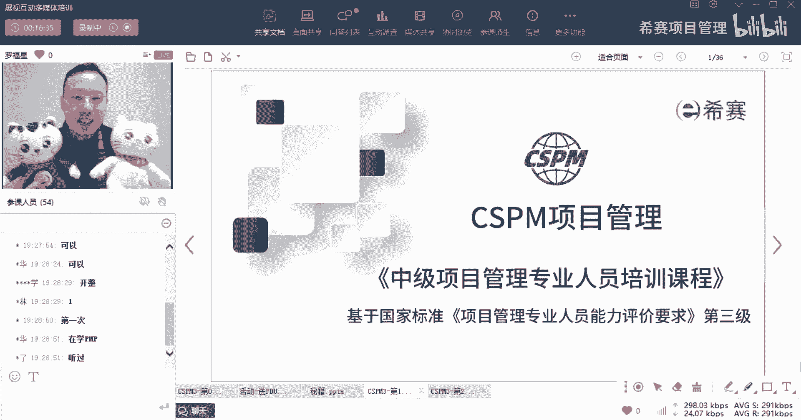
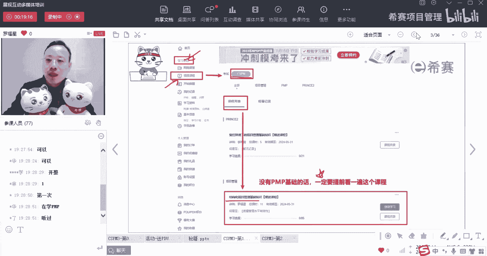
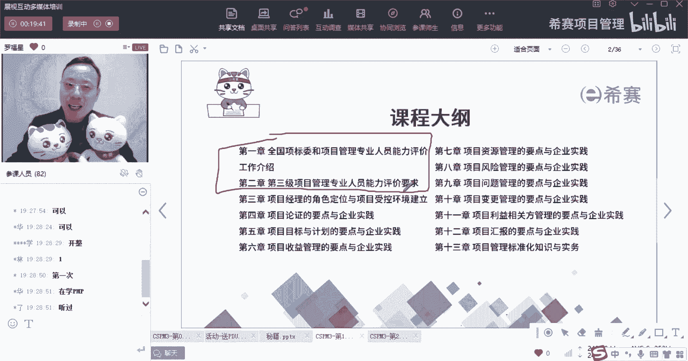
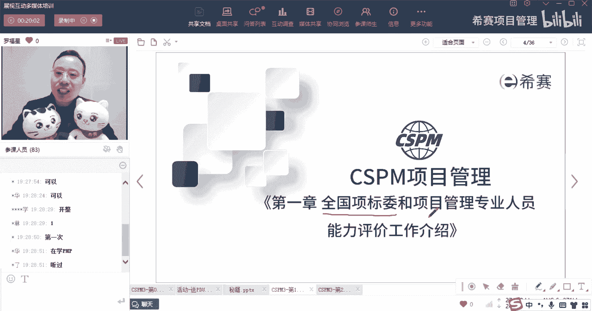
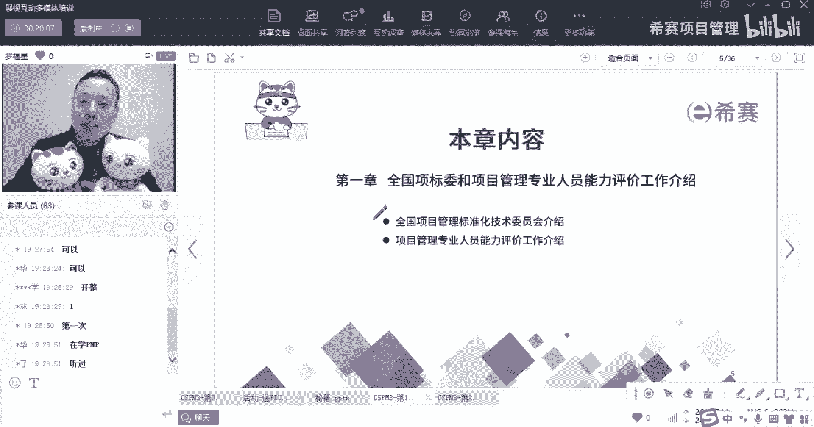
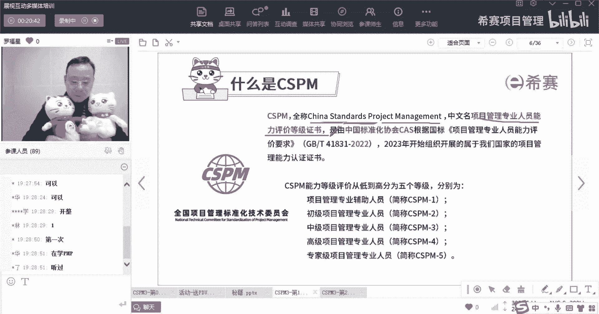
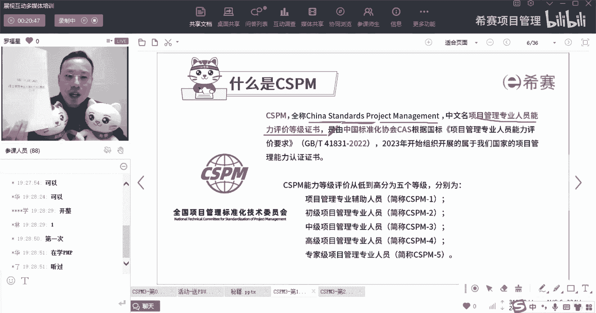
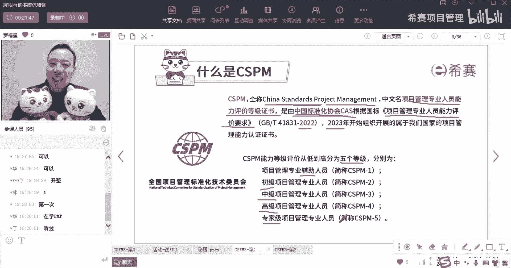

# 【收藏】CSPM-3中级项目管理认证考试直播课精讲视频合集（零基础入门系统教程）！ - P1：CSPM长空1-1首课什么是CSPM - 希赛项目管理 - BV16p42197SH

大家晚上好，欢迎来到西塞网专业的职业教育平台，我是罗福星。

整个CSPM课程它一共是分到13章，那么这13章呢其实每一章都有考试的题目，而我们今天晚上要学的内容是第一章和第二章，我们今天晚上学的是第一章，叫全国项目标委和项目管理专业人员，能力评价的这些工作。

第二个呢是讲的是第三级项目管理专业人员，他的能力评价要求。

首先这个章节，第一章讲的是全国向标委和项目管理，专业人员的能力评价工作，这个章节其实内容就是两个，也就是标题上的内容，第一个是关于全国项目标委的介绍，第二个呢是关于项目管理。

专业人员能力评价工作要求的这个介绍，那么我们就会分分两段来进行啊。

第一段是关于全国向标委的介绍，那全国象标委，首先我们得要了解一下什么叫CSPM对吧，我们一直在讲cs p m CSP嘛，它的英文叫SENTIFIED，叫证书或认证，然后是RITA。

这个叫战略project manager manager，就是项目管理，也就是说是关于项目管理这个认证啊，他的中文全称叫项目管理，专业人员能力评价体系，他跟我们之前的认证有什么不同呢。

它会有一些这种有一个叫能力评价的，这个这个这个这本这本书籍，OK叫项目管理专业人员能力评价要求。

这是一个国标啊。

这是一个国标，那这个国标里面的内容他会考试考个大概有呃，有有有有几分，然后呢他这个整个这个cs pm是由谁来去推的呢，是由中国标准化协会CAS，中国标准化协会cs来推，毕竟他在什么时候才定了这一国标呢。

它是2022年，也就是去年在2022年的时候才定，这个国标，叫项目管理专业人员能力评价要求，项目管理专业人员能力评价要求啊，然后在2023年的时候，才真正开始开展这个项目管理的，这个人员的能力认证。

他整个认证分到了五个等级，从低到高，依次是辅助啊，然后是初级项目管理的专业人员，中级项目管理专业人员，高级项目管理专业人员，以及专家级项目管理专业人员啊，这个是会考试的哟，这是有题没有考的。

