# 【收藏】CSPM-3中级项目管理认证考试直播课精讲视频合集（零基础入门系统教程）！ - P23：CSPM长空3-12项目组织 - 希赛项目管理 - BV16p42197SH

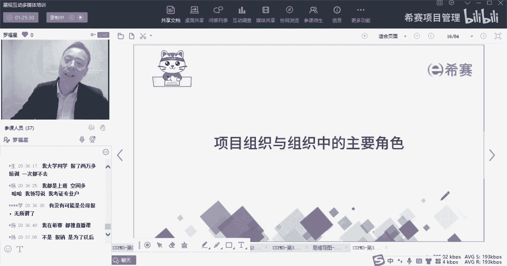

接下来就看了一下项目组织和组织的角色，那这几个主要角色，这里有一张图，整个项目组织他就是一个临时性的结构，它用来去定义角色职责和权限，所以项目组织是一个临时性的结构，他说是来去定义组织的角色职责和权限。

也就是说你负责干什么，你负责干什么，你负责干什么，你负责干什么，你能够做哪些东西，能做哪些东西，谁跟谁汇报，谁跟谁汇报等等这些东西啊，他说这样的话就形成一个所谓的组织，一个organization。

那么整个组织他都是通过名字，将个人分配给项目中的特定的角色，就是我们每一个人可以干什么，可以干什么对吧，那就是你你会负责，你会负责去管理这个项目上的事情，而你作为一个工作报的负责呢，你会负责去交付。

你负责去执行这些事情，你作为发起人呢，嗯你是负责去给大家提供指导和帮助，提供支持，而你作为一个什么发起组织，你是去来去选中项目呀，然后去给他提供什么资，什么资源啊，资金啊等等这些东西对吧好。

那么整个组织它里面有这样几条信息，他说首先第一个是组织是来取搞，搞清楚各自的角色和职责，你是干什么，你是干什么，你是干什么的对吧，第二个他说组织应该要明确报告的路径，就是你向你汇报，你向你汇报。

你向你汇报啊，这种汇报的路径，第三个，他说是由发起人或者说是项目委员会来去批准，其实也就是这个这个组织是由发起机构，大佬老大啊，大佬们老大们他们来去批准这个组织结构，或者由项目发行来去批准啊。

或者是由项目委员会，项目委员会呢其实就是一群人哦，项目发起人呢也是一个人呢，他可以是一个人，但是我们同时还是为一个叫项目发起者，也可以是一堆人啊，都是可以的，那么当然他们可以去发起这样一个项目。

他说与项目设计的每一个人进行沟通，我们的组织里面就是，其实大家就是有这种沟通的链路，有沟通链路，当然这个沟通其实不是真的说你这个发起人，你还要跟这个工作包负责人沟通啊，跟成员沟通其实不至于。

但是我们是有人，人和人之间是需要有沟通，那么我们来稍微看一下这张组织结构图，居然组织结构图中，首先第一个是从顶上来讲，有这个发起组织，发起组织他要去发起这个项目，所以他是这样的一个投资的角色。

比如说我这个钱是做这个项目是划算的，是合适的，我愿意去做这一个项目对吧，我公司有有账面上有很多很多钱，我希望去通过做这个项目，可以赚到更多的钱，所以发起组织他去启动这个项目，去发起这样一个项目。

然后接下来呢，这个项目的这个事情就安排给谁呢，安排给发起人来去做，安倍给发起人来去做，当然也可能会是安排有一个叫项目委员会，他们是给项目来提供指导，提供支持的这个角色，那这里还给了另外一个词叫项目保证。

项目保证是什么意思呢，就是你你听说过一个，你知道有个叫QA和QC对吧，我们说质量管理中有个叫QC，就是质量检查，还有一个QA呢叫质量保证人员，那咱们在这个地方的项目保证，它就是类似于那个质量保证的意思。

就是说能够去确保这个项目是在什么，什么什么状态下的这样一个一个一个角色，就保证这个项目是OK的，这样一个状态，能够也是给团队提供支持和辅助的这个角色，OK好，再往下面走，就是当项目经理。

项目经理负责去管理这一个项目，那么他去管理这个项目，同时呢他背后除了发起人给他提供支持以外，同时还有另外一个角色，也可能会给他提供一些帮助，叫项目管理办公室，OK那项目管理办公室。

它能够给我们的提供一些知识，就是具体如何做项目，如何去开展项目，用什么样的一些个什么模板啊，文档啊，流程啊等等各种方式，他会来提供一些支持，而项目经理负责去管理这个项目的时候，如果说这个项目比较大。

你还可以把它再拆分成更小的板块，那么就让小组长，你负责做一块事情，另外一位小组长你负责做一块事情，在一个小组长负责做一块事情，那么这些小组长呢叫工作包的负责人，每一个小组长他们负责的这些事情。

他们会安排团的成员来去落实去进行，所以小组长和团的成员你们负责去做事情，去执行，而项目经理是负责区域管理，当然也有可能说这个项目本身没那么大的话呢，项目经理自己就带着人去搞了对吧，比方说我们做软件项目。

一个项目经理带着十来个人去做开发，我带了一个一二十个人做开发，你就你就亲自就就参与稿了对吧，他不一定非得是所有这样一个工作包的负责人，它可以有也可以没有啊，是可以有也可以没有，那也有一种可能性是什么呢。

也有可能我这个事情虽然也比较复杂，但是我们公司又没有那么多人，那怎么办，哎我从外面去购买一些人力资源外包的服务，或者我把这东西外包给别人对吧，我说给一给一些什么叫协议组织，让别人去帮我完成，能不能够诶。

我把这个A部分让张三的公司帮我完成，我把那个B部分让李四的公司帮我去完成，也是可以的，所以整个这样一个组织结构，它其实就是涉及到说是把谁安排做什么，什么事情，你安排做什么角色，你做什么什么事情。

有一个清晰的汇报路径，然后呢。

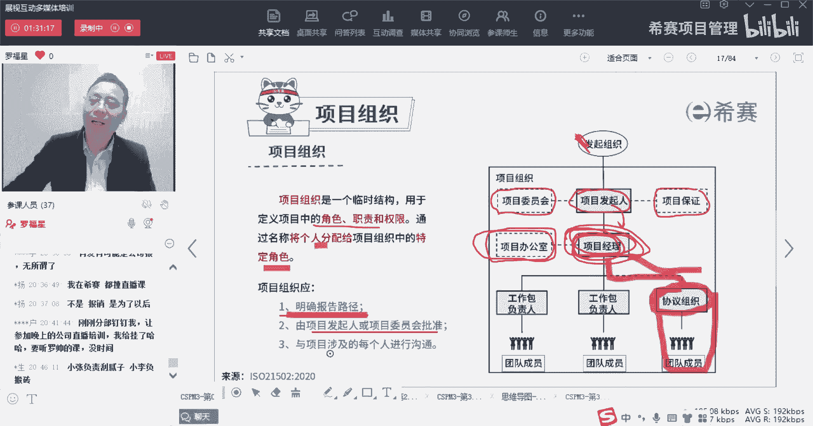

每一个人，他都是有一些一些沟通的路径和情况的，我们来看一下，看一个题目，我牺牲用户，这个太快了，你们都这么快的吗，这是提前准备过呀，好像我那个PPT还没发出来诶，我是准备讲完以后再发的。

因为我怕你发完以后，你们看了一眼都已经知道答案了，这个可以啊，先要恭喜你们都是选对了啊，他说是项目组织呢是一个临时结构，然后用于去定义项目的角色，职责和权限，通过名称来将个人分配给到项目中的。

这样一些特定的角色，那么不不符合，请注意他说的是不符合不符合项目组织的说法，首先第一个是说有明确的报告路径诶，这是开始就已经说好了对吧，第二个说是由项目发起人，或者说是项目委员会来去批准。

这个临时的组织啊。

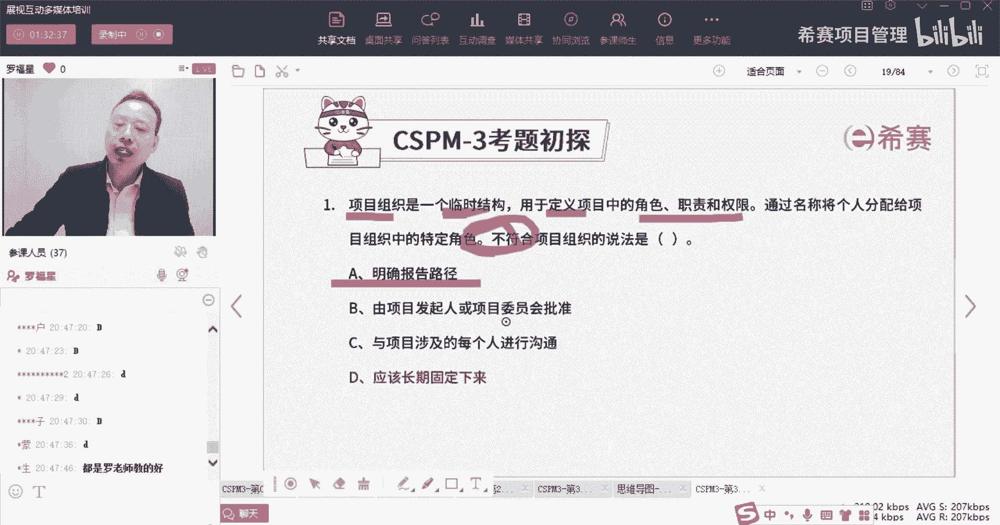

也就是由由由这个项目发行人，或者说是项目委员会他来去批准啊。

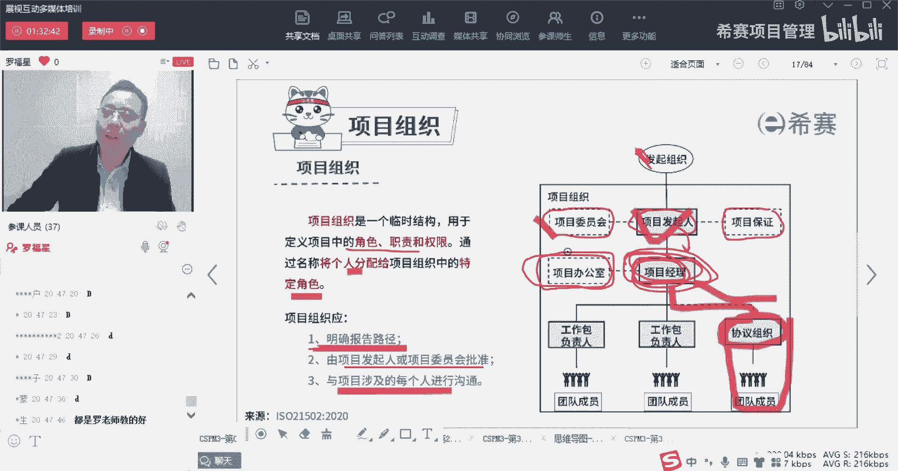

第二句，第三句呢，说是与项目涉及的每一个人来进行沟通，而这都是，但是最后一句却不对，他说应该长期固定下来，题目的题干中等，已经告诉你是个临时的结构，临时的结构，那我们这个项目上的这个组织。

它本身是一个临时性的结构，所以它不是长期固定的啊，它其实是临时结构啊，是临时结构，所以答案是选最后一个选项，这是错的，它不是长期固定的好。

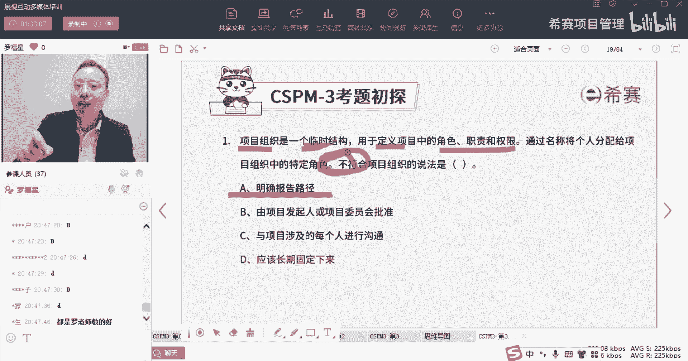

我们再来看另外一个这个题目呢，这个题目虽然没有讲过，但是你凭直觉，你有一种常识，你通过常识，我相信你可以选出来，兄弟们通过常识来选，我西餐用户叫什么名字啊，这个速度最快的那位同学。

做的最快的一位同学可以把名字敲一下啊，哦高总高总高总，你的字还是改不了名字呀，今天要给高总发个小礼物啊，好这个题目呢首先你们都选对了，然后他说是以下哪一项不属于不属于不属于啊。

一下雷项是不属于项目组织结构中的，这样一个角色，那项目组织结构一般说的都是内部的人员对吧，就是咱们自己公司内部的啊，不是外部的，都是咱们公司内部的对吧，而这个供应商供应商可以是内部，但是也可以是外部的。

我们说甲方乙方的话，供应商它是乙方，OK它是乙方，那我们这个项目组织决策中，有有有有项目委员会啊，有项目的发起人呐，还有工作报的负责人呐，还有项目经理啊，还有一些PO呀，还有那个什么啊。

那个就是大的一个发起。

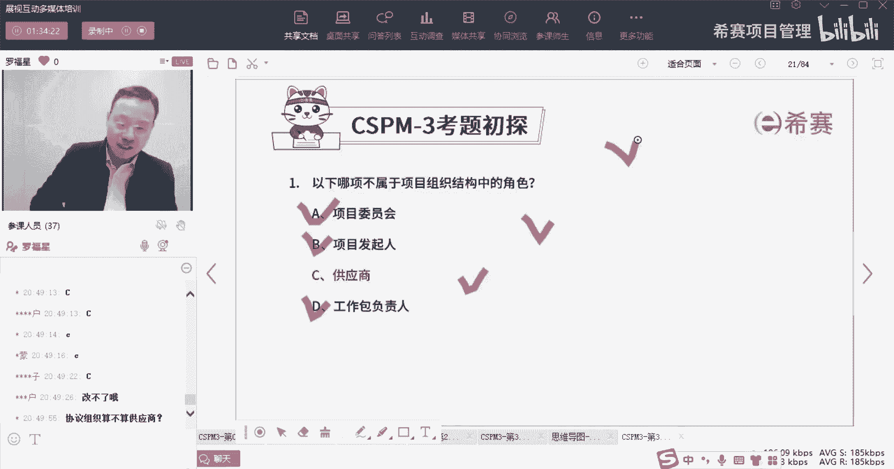

你看这里有有大的一个发起人，有发起组织，有发起人，有项目经理。

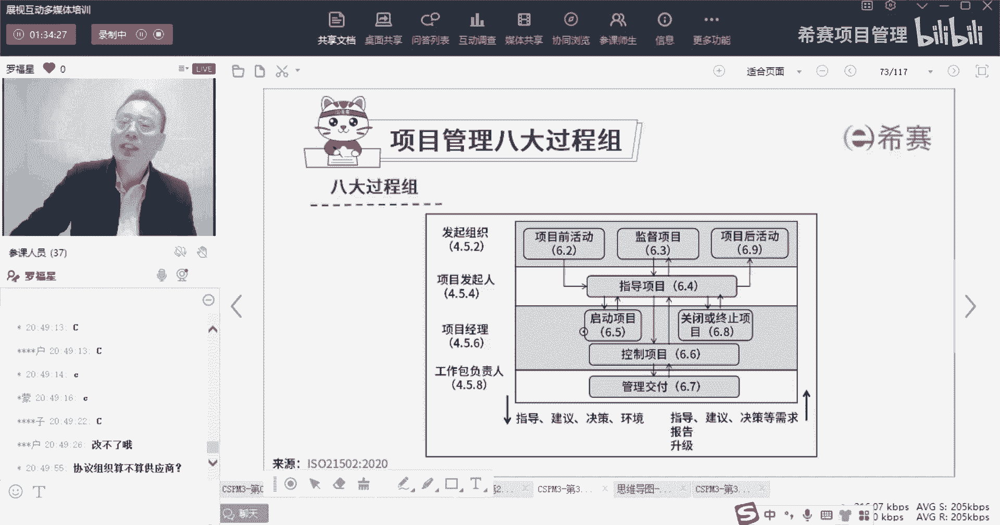

有工作包对吧，协议组织，其实他可嗯协议组织呢其实可以算到那种。

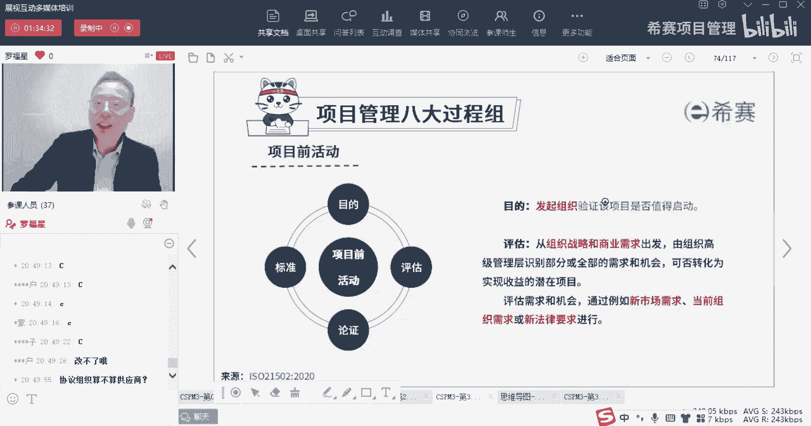

也可以算是外部的人，可以算是外部的人员，可以算是外部人员，但是在这个地方的话，他们确实是它的意图还是很明显啊。

就是他在这个地方，他的意图呢，他就是会把这个供应商不不不放到这边来。

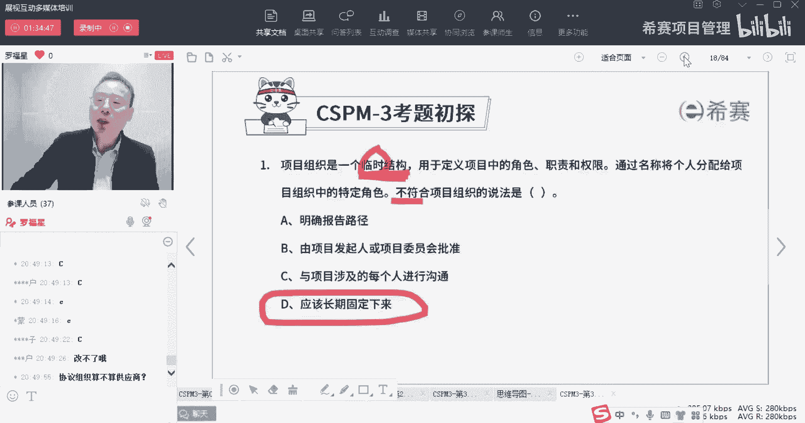

事实上呢确实协议组织他也有点可以算是，可以算是供应商，可以算是供应商，你说的很对，但是如果要严格去探讨的话呢，它确实也是属于我们这个组织里面的，它也不能算是我们组织里面的，就是他算的这个结构中。

但是它这个结构呢是属于一种算什么，就外语言它是属于一种外语结构，它不属于我们自己的这个项目结构，哎呀这个说法好像有点有点没法自圆其说了。

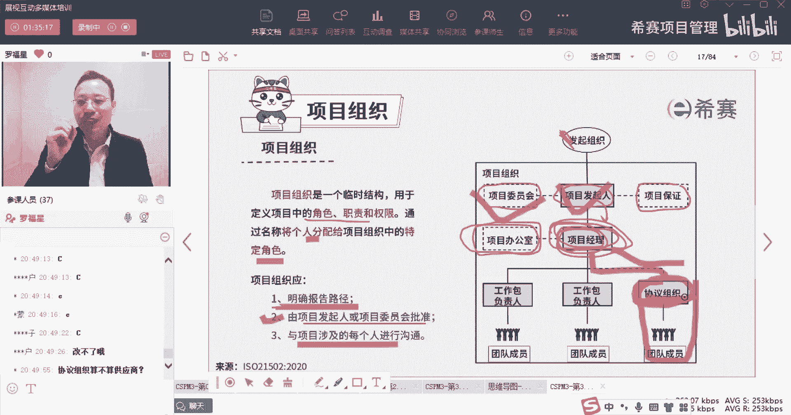

就他的意图是，说的是我们自己内部的这些人为主，但是确确实实这个这个协议组织呢是外部的，是可以是从外部的啊。

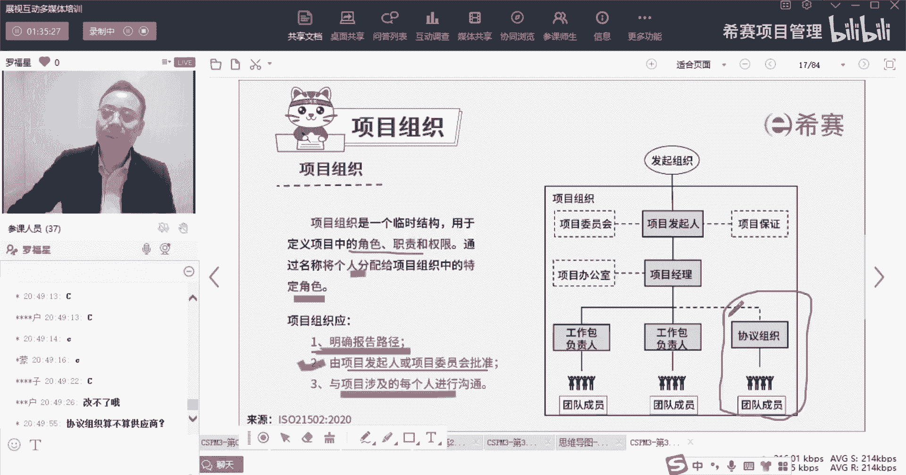

好我们再来往下面看，接下来呢就是项目组织，那么项目项目组织，他说你看他是一个临时性的结构对吧，用于去定义他的角色职责和权限，然后项目组织的设计可以是基于项目的环境，组织的环境以及项目的利益相关关。

其实也就是说呃，啊对供应商本身，你肯定是不能够完全去管理它的，这个是对的啊，这个是对的，是的劳务派遣啊，然后我们整个项目组织设计，他说是跟公司的项目环境有关系，跟组织的环境有关系。

跟我们这些什么利益相关方有关系，所以你会基于各种情况和因素，来去安排大家的这种位置啊，角色啊等等，所以他说是应该为每个人去详细定义，他的这个项目定义，定义项目组织，了解他们的角色和职责。

当你把它定义清楚以后，很多事情是其实更好开展，他说在整个项目中职责应该是相互一致的，也就是说你搞的东西你不能够去论乱什么呢，有一些人是会负责做监管的角色，有一些人负责去执行的角色，但是你不能又做监管。

又做执行，也就是说你不可以又做运动员，又做裁判。

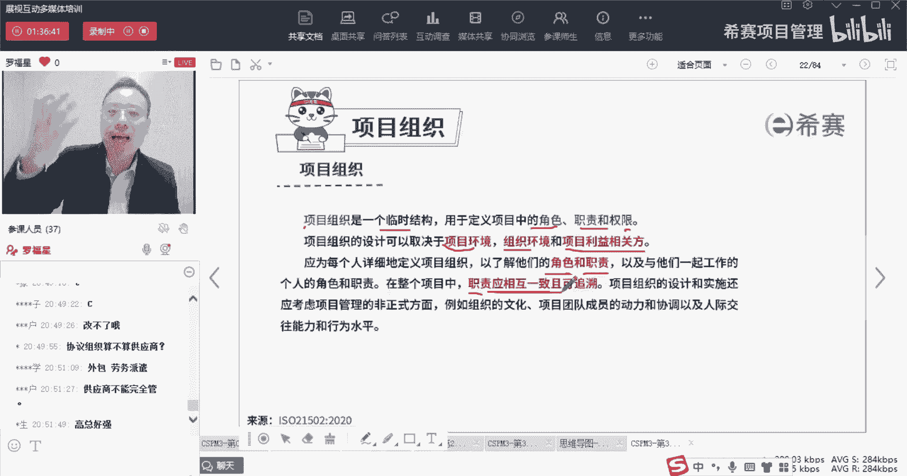

你如果同时做运动员和裁判的话，这个事情就不好搞下去，所以你的角色，你的职责应该是相相相一致的好，还是说他能够去追溯下去。

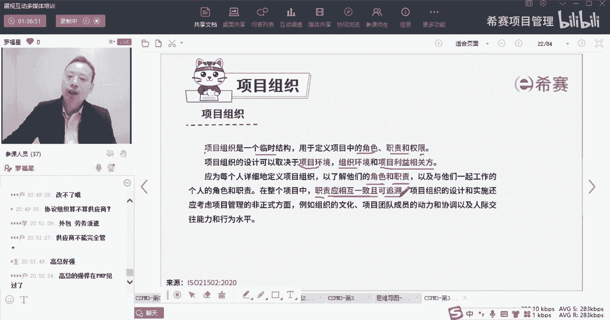