# 【收藏】CSPM-3中级项目管理认证考试直播课精讲视频合集（零基础入门系统教程）！ - P25：CSPM长空3-14项目组织中的角色上 - 希赛项目管理 - BV16p42197SH

那么在接下来就开始看到的是，整个在项目组织中有各个不同的角色，现在看的是第一个角色叫发起组织啊，先看看是发起组织，那么发起组织它是个什么组织呢，他说是一个上级权威机构，是领导们，是大老板们。

OK是领导们，他说应该向项目委员会。

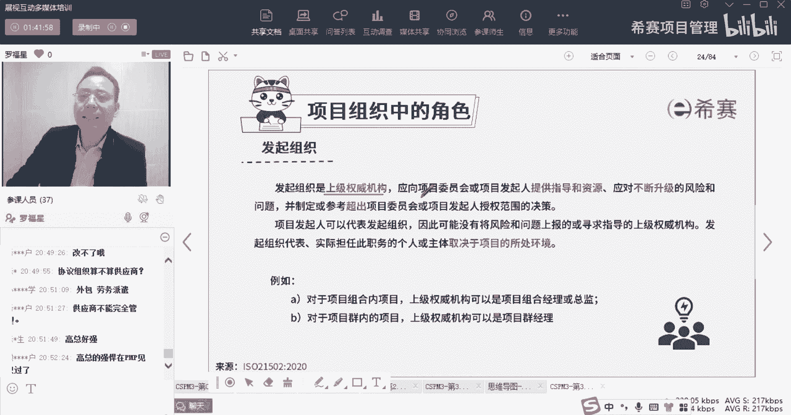

或是项目发起来提供指导和资源，所以是他来向项目发起人提供资源，他来向项目委员会来提供资源，get到了吗，所以他是一个大老板，它充当一个什么管，他充了一个什么角度呢，他是充当一个叫投资的角度。

就是他会觉得说这些东西值得做这个项目。

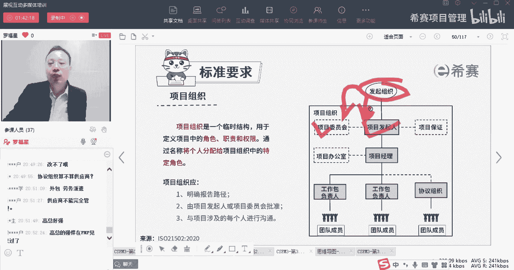

还是不值得做这个项目，他来去拍板做决定，OK并且呢他说对于这种不断升级的风险和问题，他是要负责去应对的，也就是那些问题一直升级升级。

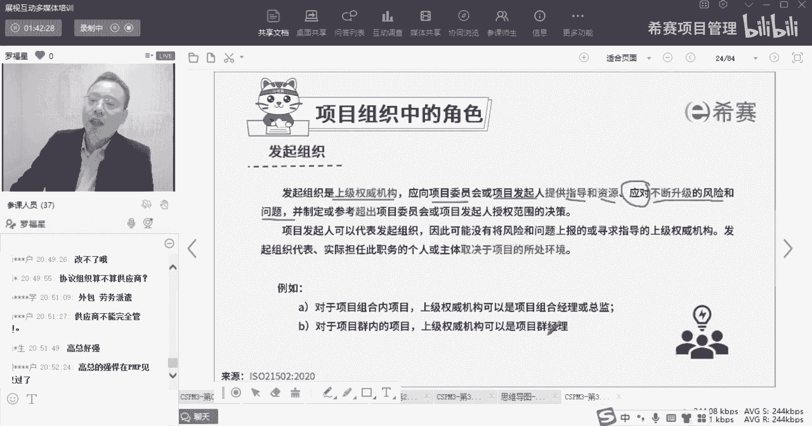

升级升到这个层面，再往上面，如果说是到那个发型，都觉得哎呀这个东西真的是感觉搞不下去了呀，唉这时候发起组织。

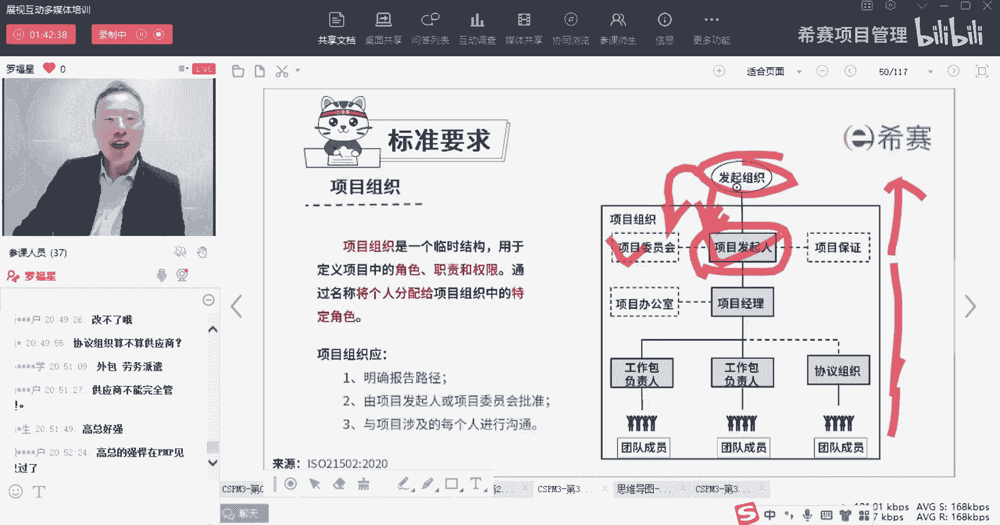

你应该是挺身而出来去处理这些个问题和风险，并制定或参参考，超出项目委员会或发行授权的范围的决策，什么意思呢，这个词我稍微解释一下，首先是制定这种超出项目的发起人。

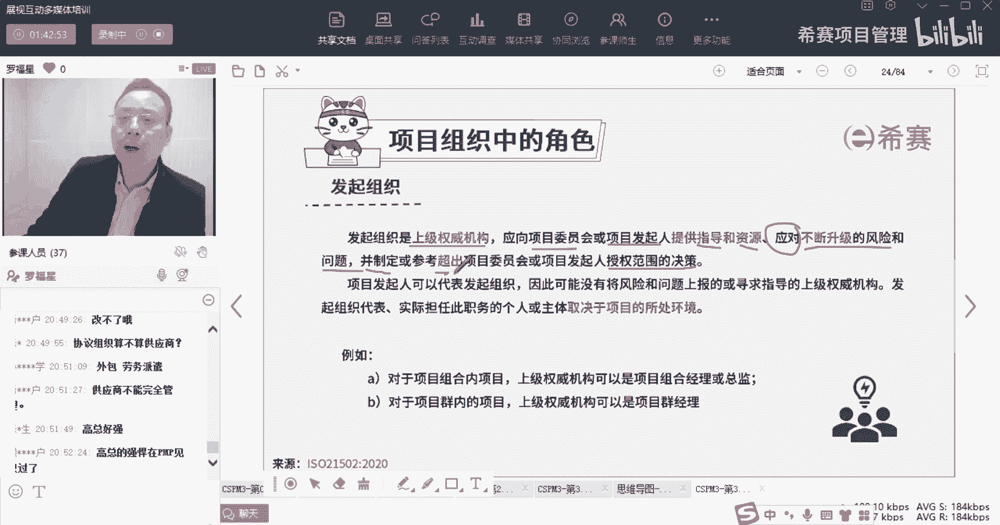

授权范围的决策，也就是说如果说某一件事情是他能搞得定的，是这个发型可以搞定的，你就让他去拍板做决定，但是如果说有一些东西，超出了它的权限范围以外，那么唉你老大，你来做决定永远都是有一个往上升级的概念啊。

一一定是有这个升级的这个制度，当你搞不定的，你就往上升级，当发起人搞不定，或者是主那个项目委员会他们搞不定的时候，顶顶上还有在更大的老大来去照着来去处理。

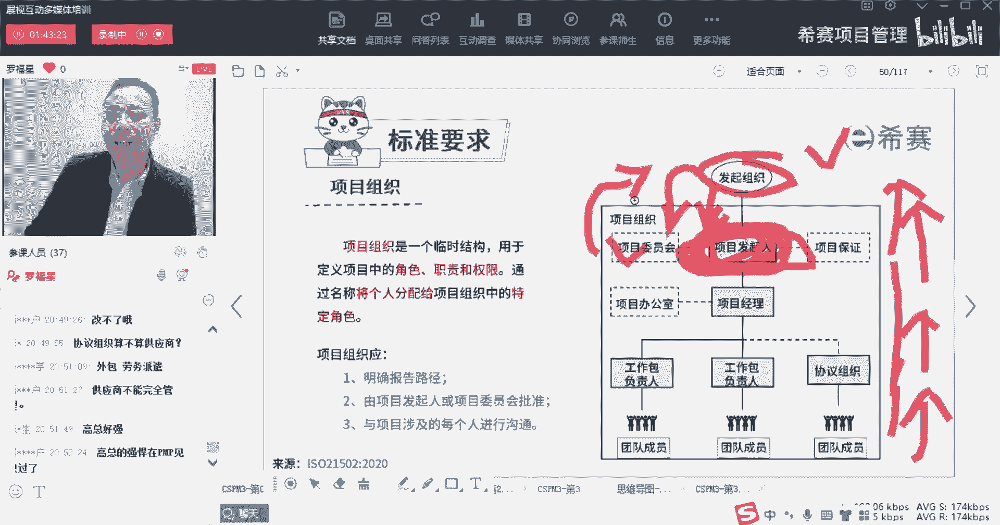

给的是这个意思啊，所以它是一个权威机构，是一个上级机构，他是能够给他给这些发行人们提供指导和资源，以及帮他去处理一种更大的风险，能够去处理这种他们搞不定的这种决策，超出角色。

他说项目的发起人呢可以代表发起组织，因此有可能有些东西你到了这个地方，其实也就是你穿了他的马甲，他把一件马甲给这个项目的发起人来穿，你就代表我，对不对，就是像那个皇帝派了个太监，不是呸，说错了啊。

皇帝派了一个大臣，然后拿了一把尚方宝剑，然后唱了一把，穿了一件黄马褂，诶，你就代表正而去干嘛干嘛，类似的意思，所以发行他说是有的时候是可以去代表，这个发起组织来做某些事情。

那么发起组织代表实际上说是担任职务和，主要是取决于你自己的经营环境不相同，但是很多时候都是充当这种什么决策呀，什么什么之类的，他说如果说是公那个项目组内的这些项目，公司内部的这种项目的话。

他说上级的权威部门，可以是像像叫组合经理或者组合的总监，如果是项目群内的项目，就是更大的，这就是啊这是项目组合类的项目，是更大的项目啊，如果是项目群类的项目呢，他说是项目群经理。

其实也就是一定是一个具有一定的话语权，就具有比较大的话语权的这个角色。

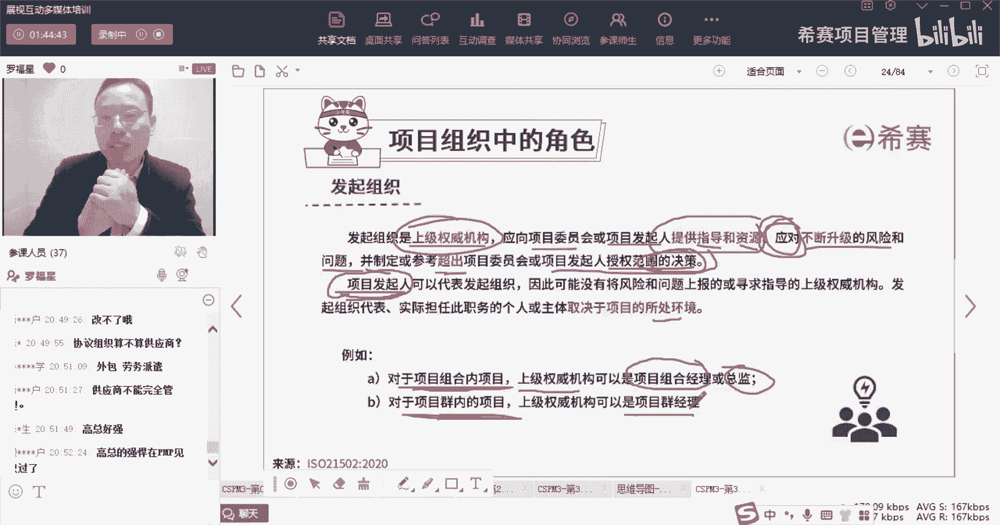

OK他对于某一些事情来去做决策，当你搞不定的时候，你有问题搞不定的时候，你是可以去找他的，他是可以给你给你，给你给你的项目发起人和那个项目委员会，来去指派资源，然后给你做指导的啊。

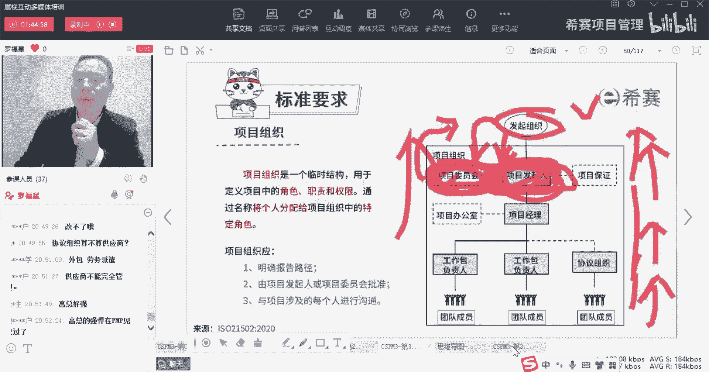

这是这样一个角色，然后第二个角色呢叫项目委员会，那项目委员会这个角色其实你可以理解，就是一群领导们，他也是一群领导。

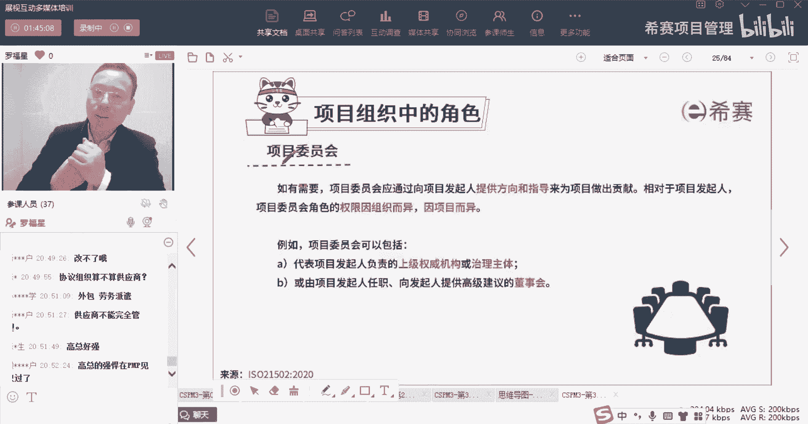

但是这一群领导，他比这个项目发起组织要更要低一点啊，但是它的这个价值和意义是什么呢，它是能够去对整个这个项目来提供支持和指导，就是对于这个项目来去，提供更多的这样一个组织和指导，这是项目委员会。

他来去对项目来提供指导，如果说没有项目委员会的话，那么可能就是项目发起人他自己对吧，那也有可能说如果一个东西它本身比较复杂，来专门去呃，但这个团队中遇到某些事情，项目经理搞不定的事情。

你需要去网上汇报的时候。

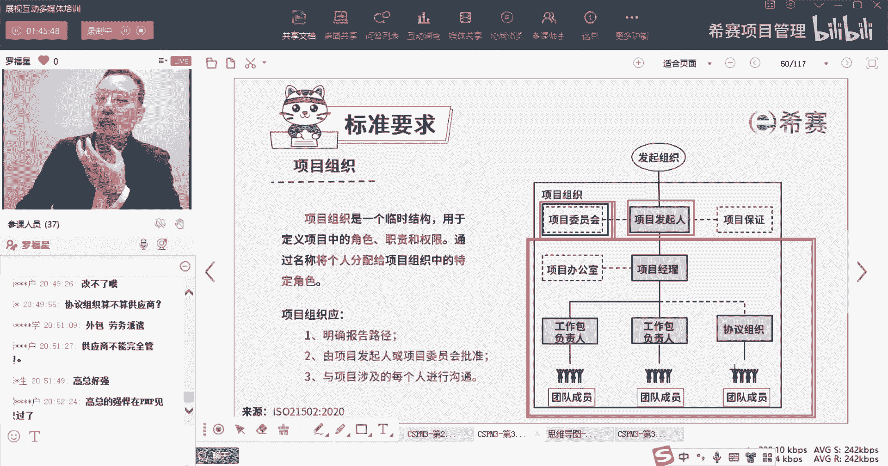

处理这些事情，那么这就是有这样一个叫项目委员会，他们来去处，所以你看他说如有需要的话呢，项目委员会，他说应该是通过项目发行来去给项目提供什么，提供方向和指导来为项目做出贡献。

所以他是为项目经理以及项目组，来提供方向和指导的，他说相对于项目发起人而言，项目委员会的角色，他的权限会因组织而定，可能会有不同，他说可能会说是有什么上级权威，组织部门呢是一个治理的主体。

我们在前面讲治理主体的时候，说过两个角色治理主体，一个呢是一个是项目的项目管理委员会，一个是项目的发起人对吧，所以这两个通常组织会把这个治理主体。

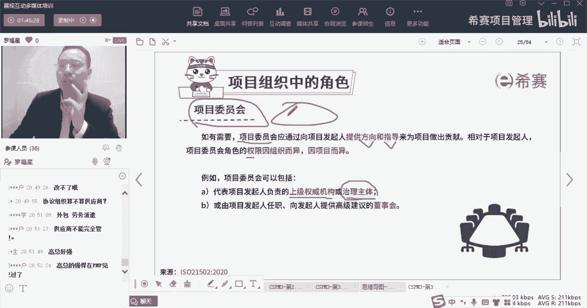

就安排这个项目委员会和发起人，其实也就是安排给这个项目委员会，他和项目发起人他安排安排给他们两个，他们就来负责去做这个项目的这个组织治理。

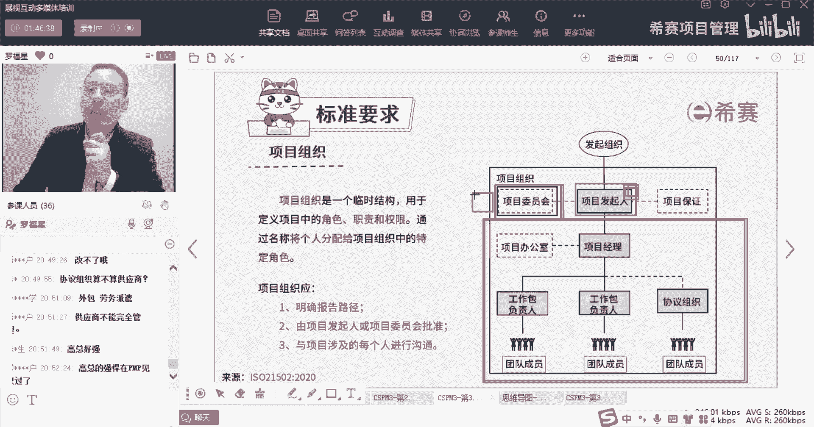

项目的治理的这些事情，以及能够去给到项目经理或者项目，来提供方向和指导，他说如果说后，他说那个项目委员会可以是包含了这些个治理，这些个怎么发行对吧，他说或者说是由项目发行人来去任职。

向发行人提供更高建议的这个领导，更高阶的领导也是董事会，可以是董事会，也可是项目项目发行这个层级的，下面那个什么什么都可以啊。

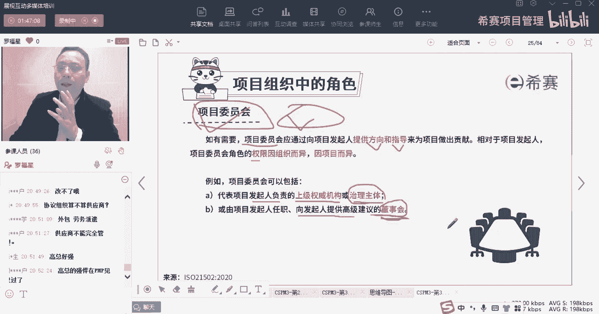

这是项目委员会这个角色来看个题目，好张总说怎么感觉像是现实中现实实践，实践中会选项目经理对吧，还真不是你要他讲的是什么前提条件，在项目委员会的会议上，他说对于一项重要的项目决策。

项目经理和职能经理部门的经理产生了分歧，也就是我们经常会说项目是一个矩阵型，矩阵型矩阵型，就说诶这个举这一个职能部门，诶这个职能部门这里有个职能部门，同时呢我这里有个项目组，他可能会对吧。

有这么一个项目组，那么张三李四王五等等这些呢，他是既属于他自己的职能经理去管理他，同时又属于项目经理去管理，同时项目经理和职能经理，对这个项目都有一定的话语权，那么一件事情上面。

这个项目经理和这个相关职能部门的职能经理，他们之间产生了分歧的时候，该怎么办呢，是项目经理说了算吗，当然不会，是职能经理说了算吗，当然也不会，那么谁来说了算呢，回到这张图嗯。

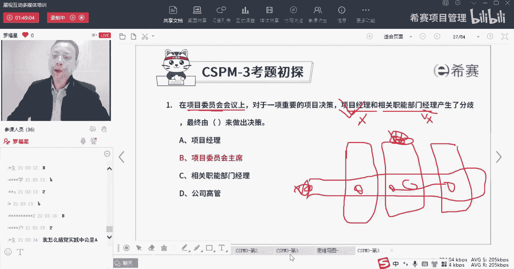

项目委员会或者是项目发起人，他是负责去对这个项目来去提供指导支持啊。

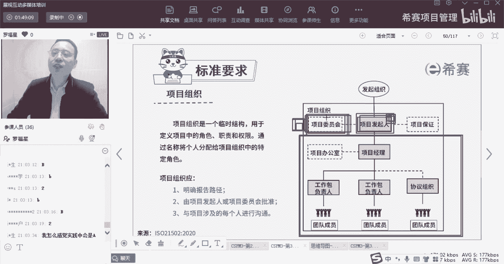

当然还有一个词叫决策，当然角色这个词呢。

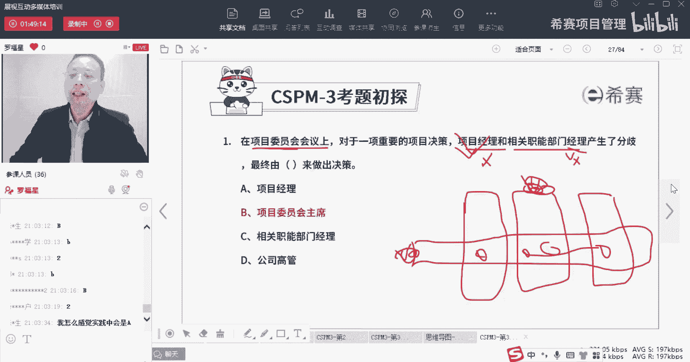

其实今天做PPT的时候没有看到，后面其实有这样一句话，他说项目委员会应该会要监控，项目的进展和发展，以及会通过会议的形式来去协助战略的决策，消除障碍以及解决问题，就还会有这些内容。

所以应该是属于叫项目委员会。

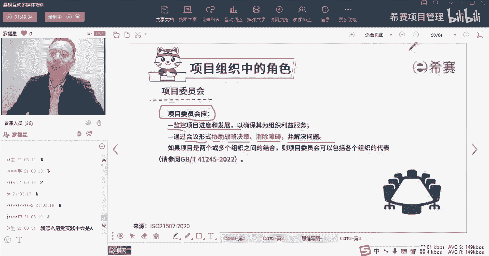

他来干啊，应该是项目委员会来干，项目委员会啊，他这个给了叫项目委员会的举行举行，OK因为A和C目前就说A和C在争吵，但A和C在吵架的时候肯定不能选A，也肯定不能选C，就项目经理，你和另一个职能部门老大。

你们之间有一个事情没有去达到共识的时候，你肯定不能让项目经理说了算，你也不能让那个职能经理说了算。

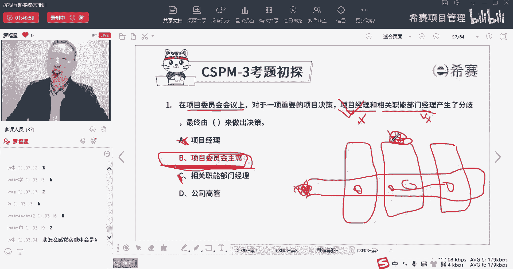

你让一个更高的领导者，谁是更高的领导者呢，哎我们往这里来翻的话，你就知道哦，原来项目委员会，它是可以给这个项目来去做出什么贡献，做出提供方向和指导。

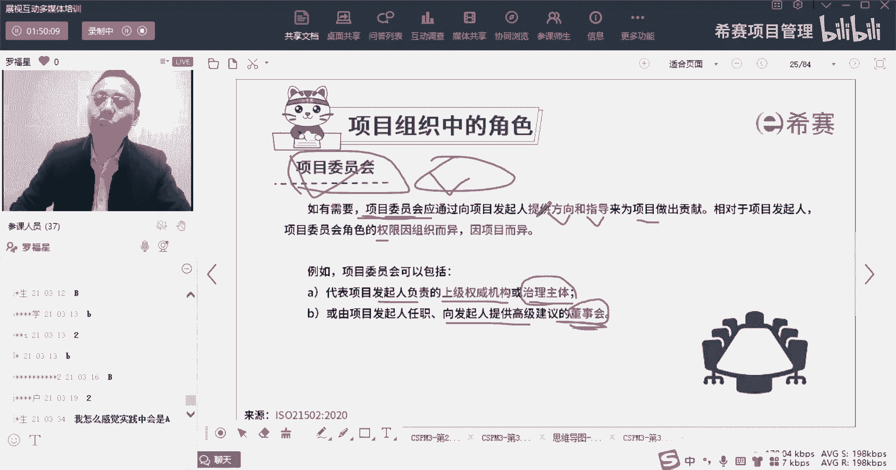

以及可以去帮这个项目来去提供这些个什么，协助战略决策，然后以及说去监控项目进展，消除消除这些障碍。

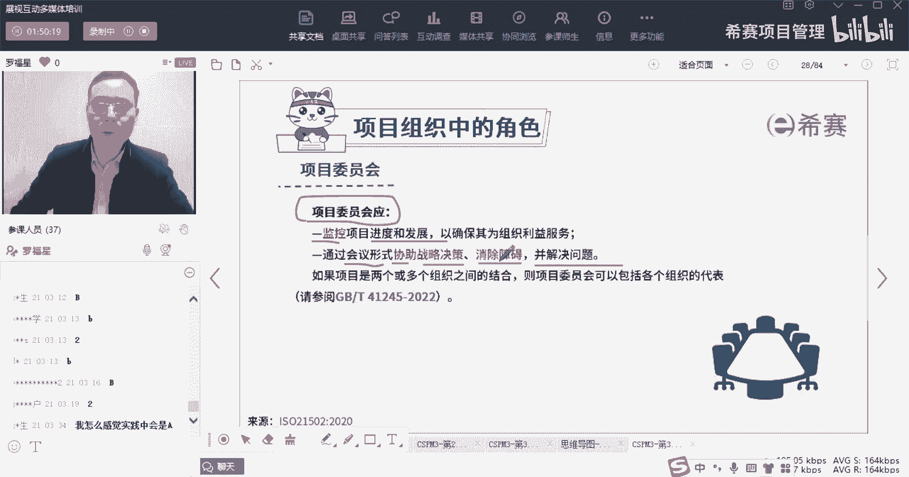

做这些事情的人，所以呢答案是选这个呃OK吗，张总张总OK吗，但也可能有同学会说啊，其实我就是选了一个公司高管就可以了嘛，但是他会有一个前提条件是什么呢，前提条件是在这个题干中，第一句话他就特别讲到了。

说是在项目委员会会议上，那么也就是来到这个场景。

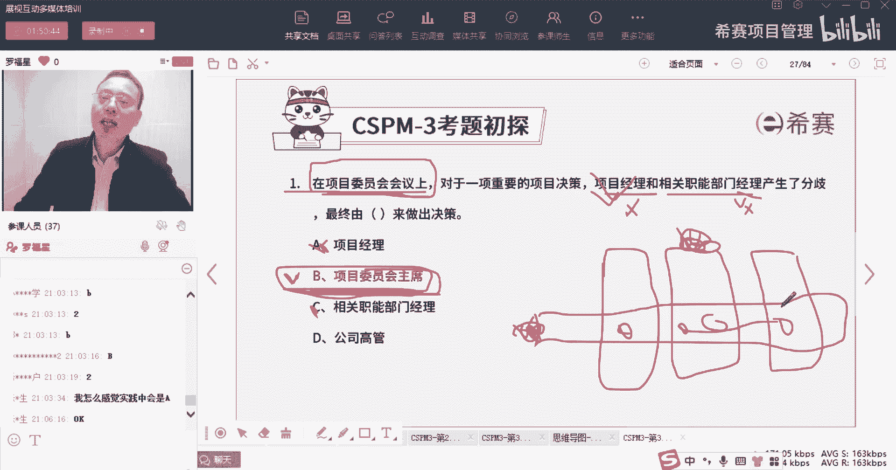

来到这个场景是说通过他这个项目委员会，他会通过这种会议的形式，来去协助做一些决策呀，协助去处理这个占，当然消除站这个词也稍微解释一下，可能有同学可能都都快不记得了，消除障碍呢。

我们在偏僻的心就是比较靠新的版本，就是去年和今年学偏僻的同学，你应该是知道的，说敏捷教练有个重要的这个事情，就是辅助团队来去消除障碍或清除障碍，也就是团队成员可能会经常又要干工作的事情，又要去参加开会。

要搞这个，要搞那个什么什么之类的，就很多东西被打扰对吧，那么消除，这就是帮他去清除掉各种障碍性的事情，对他是一个服务型领导或者叫仆人式领导，你们说的很对啊，所以呢这里的这个项目委员会，他在更高的层面。

他去办项目经理来去清除掉这些东西，对他充当那老母亲，我们说项目项目经理或者是那个敏敏捷教练，他是帮团队来去清除障碍，来做团队的老母鸡，而现在你作为一个管理那个那个项目委员会。

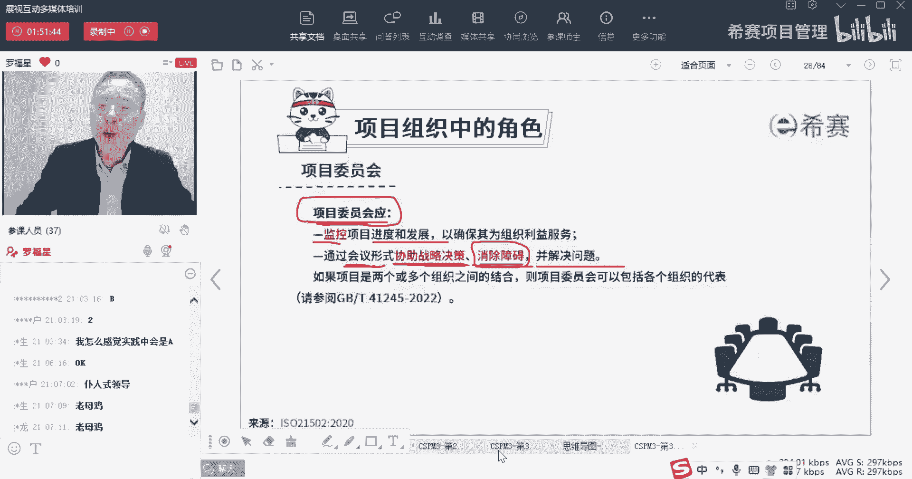

你是来做项目经理的老母鸡，你来帮项目经理去清除障碍，你来帮他去搞定那些事情，是一个意思啊，也就是说也就是说我把这个先删掉，也就是说你作为项目经理，你是要帮团队来搞定那些乱七八糟的事情，让他安安心心干活。

但是呢站在你自己这个层面，你也你也会遇到一些干扰，你你也会遇到一些别的干扰的时候呢，你的领导，你的上一层领导，他又来做你的老母鸡，他来保护你，他来帮你去清除这些障碍，是这个意思，我说清楚了吗。

兄弟们有一点点拗口，但是应该应该懂这个意思啊，就是你作为项目经理，你去办你的下面的兄弟们。

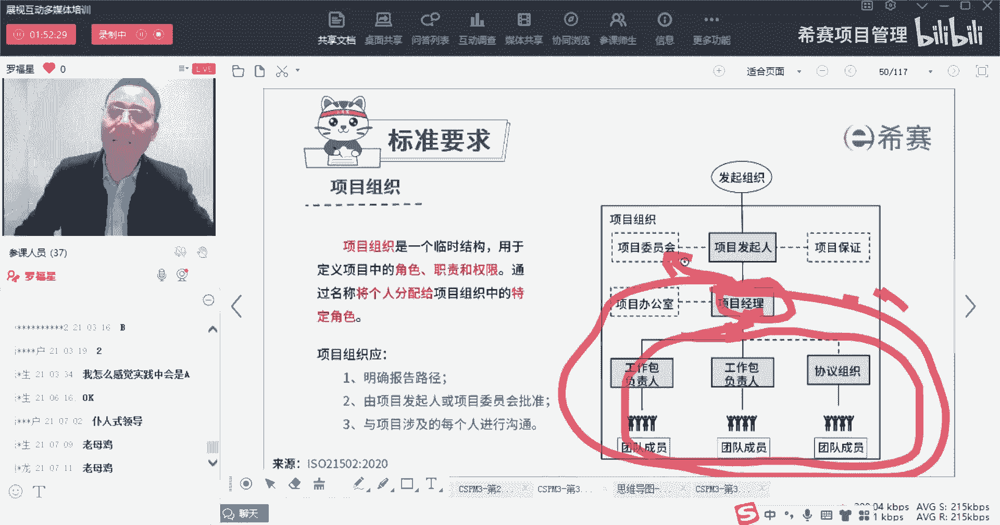

他来去帮助你们，就这个意思，OK好，这是你要去清除障碍，他说如果是两个或多个组织之间的，这样一个结合，那么项目委员会呢，他就是可以包含多个组织的代表来去参加啊，这个就嗯你就知道说是能涵盖多个项目了。

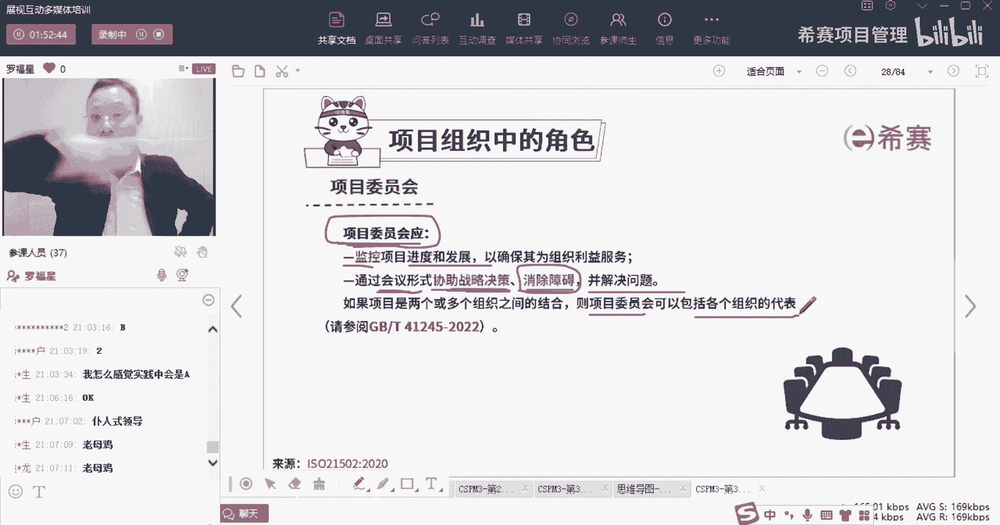

涵盖多个项目啊，然后再接下来看下一个角色，叫项目的发起人。

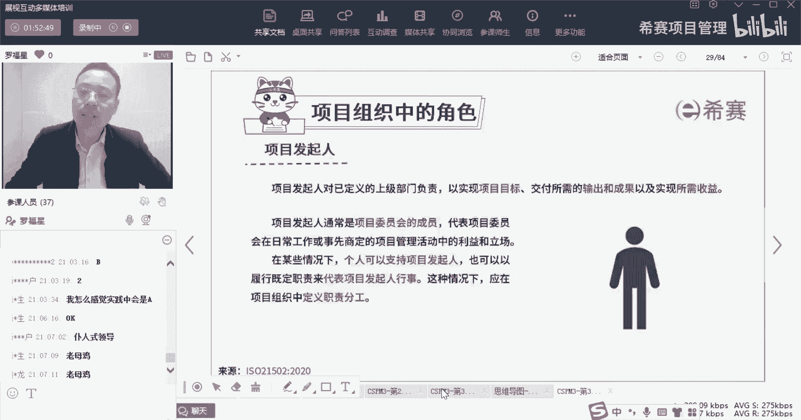

那就是这个角色，项目发起人这个角色，他这个发起人呢跟我们在偏僻中说的发起人的。

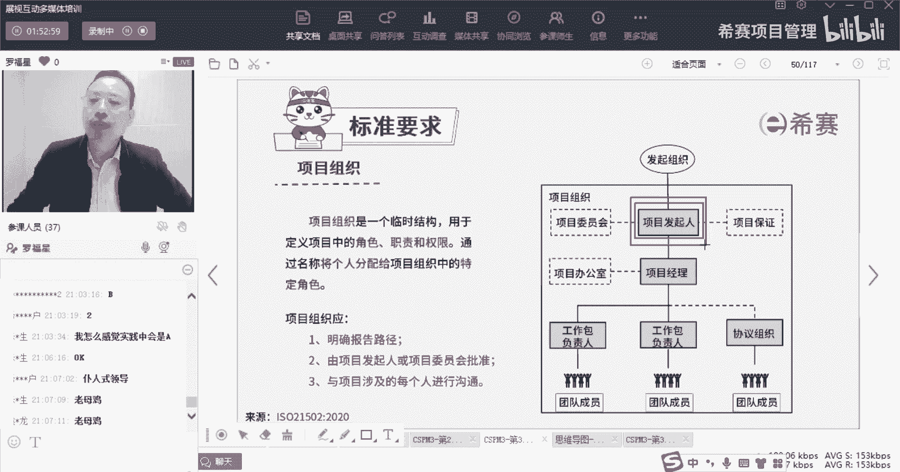

不完全是一回事，稍微有一点点区别区别，他说项目的发行是对已定义的上级部门负责，什么叫以对对上级部门负责。

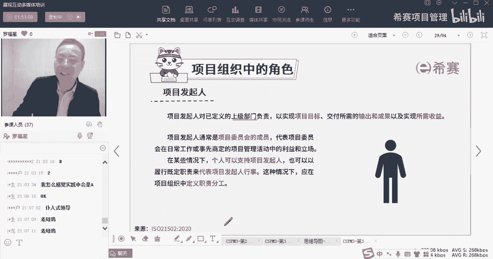

也就是说你的老大发起组织，他来给你提供资源，提供指导，你要去给他提负责，什么意思，他说我们要不就做那个项目吧，你作为一个发起人，你要负责把这个项目给搞好，搞的时候呢，当然你会委派项目经理去搞啊。

不是你自己亲自搞，但是你要确保这个东西搞好，所以你要去给你的领导负责，你要对你的领导负责对吧，你的领导安排一个事情，你要对这个事情负责，你要对领导负责。

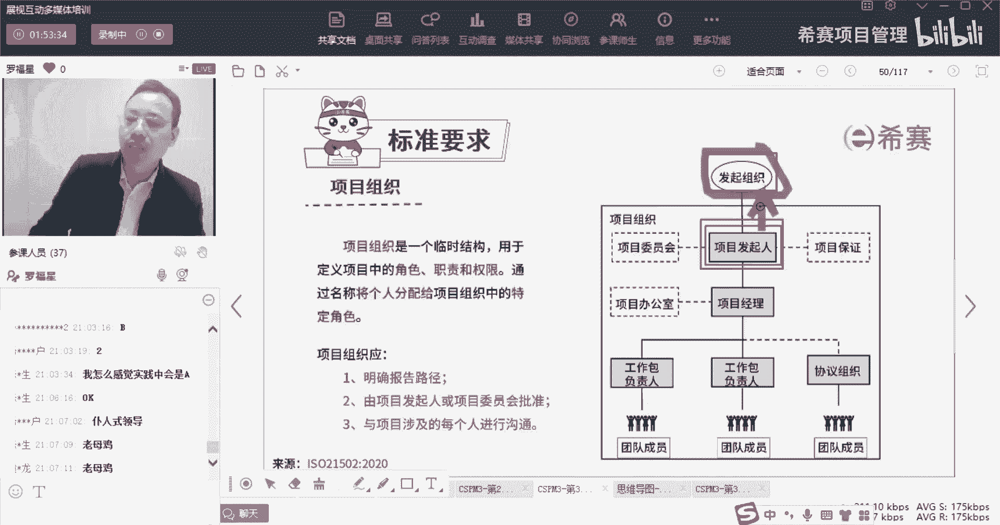

把它做好，这是第一句话，OK所以是项目发起人，他对于已经定了这个上级部门来负责啊，他要干什么，要实现项目的目标，要交付所需要这些输出和成果，以辅助来去实现所需要的收益。

所以我们说这个发起组织，它是这样一个投资的角度，哎我有这笔钱，我要去做这个项目，因为他可以去创造更大的价值和利益，那谁来帮他去创造这个价值和利益呢，发起来去做，只是说发起人不是真正亲自去做发钱。

他把他安排给项目经理，项目经理把他哎呦啊。

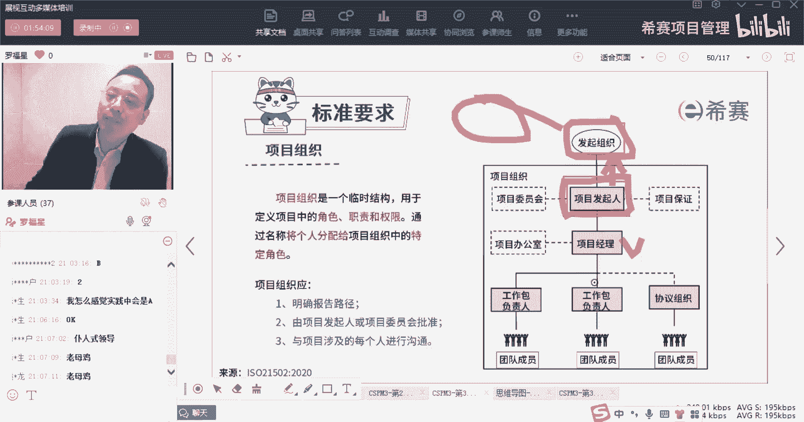

分分包给各个工作包的负责人的这种方式对吧，所以这句话本身有毛病没有啊，离离应该没毛病吧，理解应该是可以理解的，对不对，就虽然不是你自己亲自去实现目标，也不是你亲自去产生这个什么什么成果，实现收益。

但是呢你是要对你的老大负责，老大给你安排这个事情，你要去为他负责，这个没毛病啊，项目发行通常是项目委员会的成员。

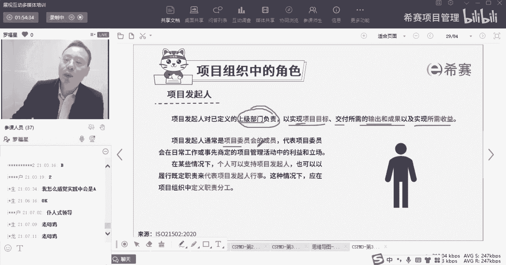

所以你看通常项目发行，就是这个项目委员会中的之一啊之一。

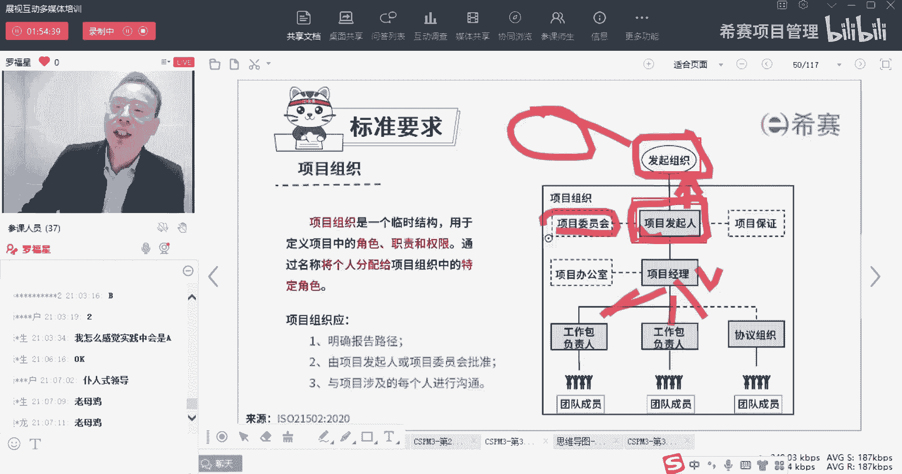

同时呢，他说是代表项目委员会，在日常工作和事先商定的这些项目活动中的，这些利益和立场。

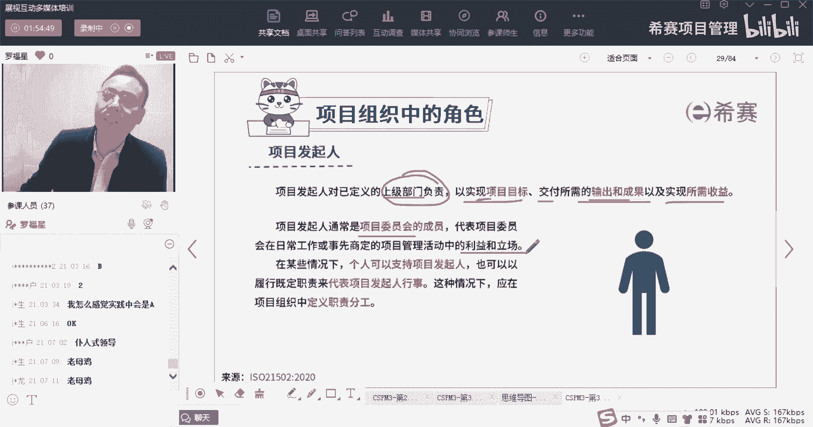

也就是说我们这里有一个代表团对吧，我们这里有个有个有个委员会，一个指导委员会，他要去对我们整个项目进行指导，可是你不可能说每一次都把各位领导们一起薅，过来来去提供支持和帮助，那怎么办呢。

哎专门有一个角色，他负责各种日常的工作，就是叫发行，当然他也不是要负责日常工作，就是负责日常性的这种那种那种那种管理啊，指导啊性的工作，就是呃那种啊常态化的这种事情，但是如果有一些东西他搞不定的时候呢。

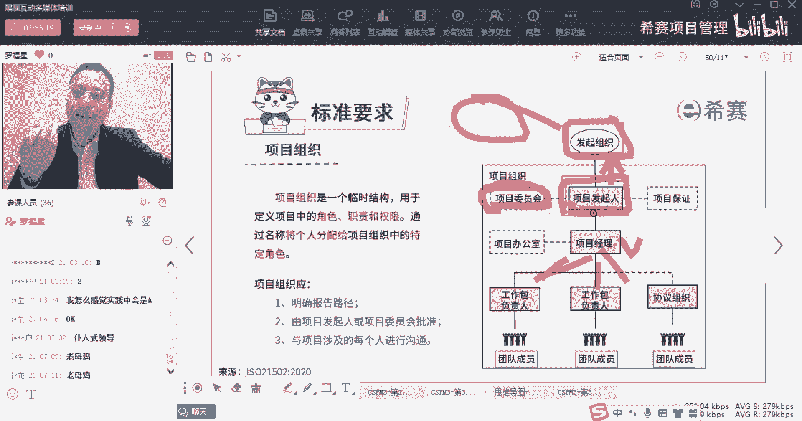

他可以把大家都召集过来，召唤过来啊，是这样的一个情况，所以你是能代表代表了项目委员会的角色，来去行使日常的这种呃那种那种指导性的工作，兼容性的工作，在某些情况下，一个人他可以去支持项目的发起人啊。

也可以去履行什么既定代表发行去行事，这个词，其实也就是说，我们可以某一个人去充当这个角色，OK充当这个角色，但是呢你一定要有清晰的分工啊，谁去负责干这个事情，谁做这个发起人可以是一个人。

当然也可以是一个小团队，就可以是一个人，也可以是一个小团队啊，这是项目的发起人。

那项目发行他的职责，他说是包括但不限于什么，第一个说是项目发行，应该要去承认和拥护商业论证，那么也就是说前期大佬们那个发起组织，他们做了商业论证，你觉得这个项目是值得搞的，那我们的发起人就说啊。

好值得搞对吧，并且呢一定是按照这个路径来，因为本身商业论证它会是从多个维度，从资源啊，技术啊啊法律呀，然后经济呀呃呃商务啊，呃那个什么等等等维度啊，我们一定是做的东西。

是跟公司的那个战略目标是相匹配相一致，并且呢他说发起人是对于项目治理负责，他是治治理的主体，我们说项目治理的主体有两个。

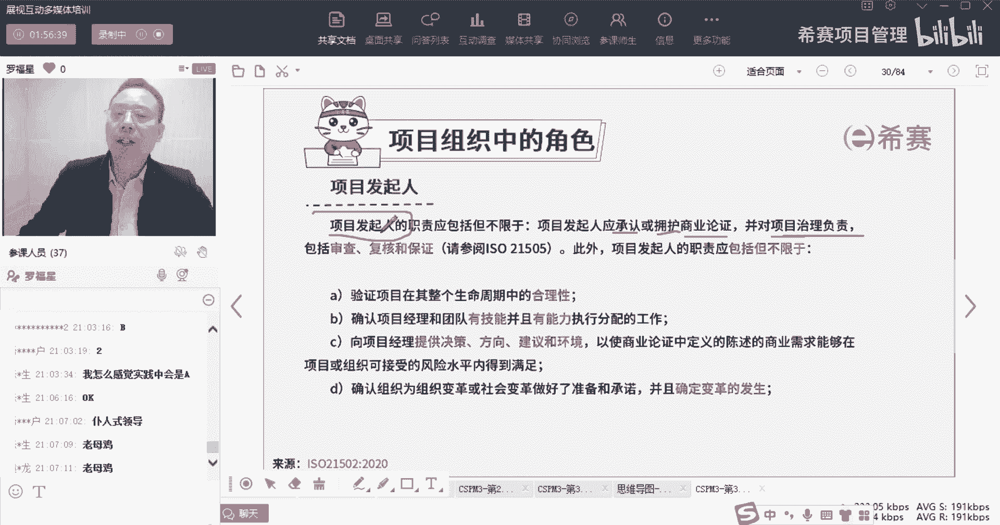

一个呢是这个叫项目委员会，还有一个呢就是项目发起人啊，这两个是治理的主体。

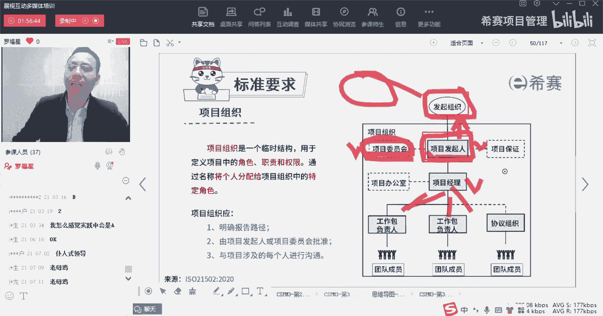

同时他要去对项目治理进行审查复核保证，所以整个这些大的框架大的东西谁来做的，其实是项目发起人来去做的，OK逻辑还是某些逻辑啊，生活中永远的是老大，他不亲自做事情，他可以去安排小弟去做，小弟做的东西。

老大签个字就表示是老大做的对吧，也会有这种情况，他说此外呢下面的发行还有一些别的职责，一个是验证项目在整个视频中就能合理性，这是干什么，这不就是持续进行商业论证，对不对，来拥护他的商业论证。

持续进行商业论证，来确定这个项目是依然值得去做的啊，这是第一条，第二条，确认项目经理和团队有技能，有能力能够执行这些分配的工作，也就是说你底下有小弟对吧。

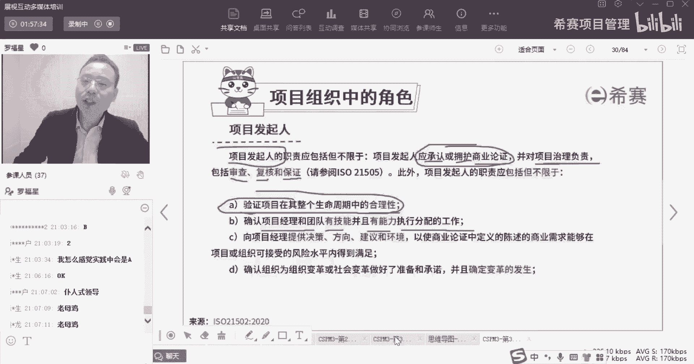

你底下有项目经理啊，还有各种小弟们，你要确保这些小弟们是有实力，可以去完成我交代的事情，我交代的事情也是我的领导，交代一个我的啊对吧，就是我的领导交代给我的事情，我在交代给你的时候，你应该是可以搞定的。

你可以搞定，你下面的人员可以搞定，有这个实力。

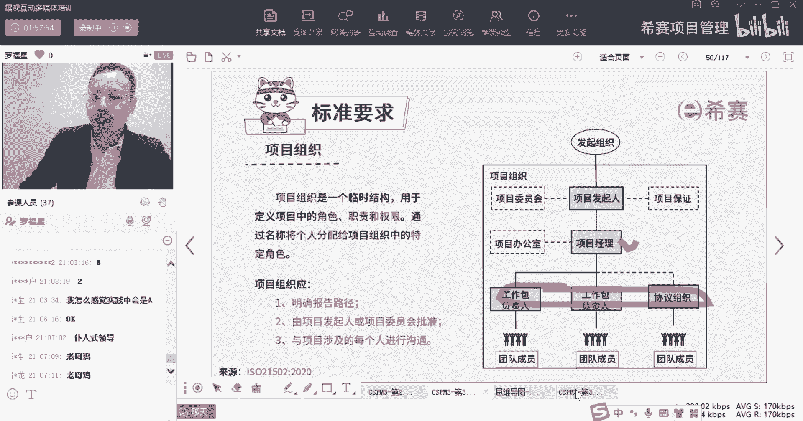

这是第二条，所以他要去确认项目经理和团队是有技能，有能力能够去落实，第三条，向项目经理提供决策方向。

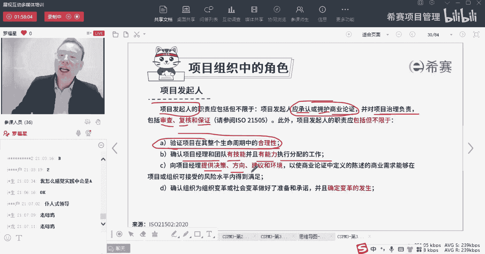

建议环境诶，你有没有发现，我们开始在说项目委员会的时候也说了，同样是提供方向啊，指导啊之类的对吧，那么现在的发起人也是提供方向指导，其实因为发起人他是属于项目委员会中的一员，并且是项目委员会。

在这个项目上，单独的这个一个一个委派的一个角色。

所以他他们他们是一脉相承，这是很正常的啊，所以他是能够给项目来提供决策，提供方向，提供建议，来提供各种环境的啊，嗯并且呢还有什么什么风险承受水平啊，商业认证的这些需求啊之类的，最后一个关于变革。

他说确定组织是为了组织啊，确认组织为组织变革或社会变革，做好了准备和承诺，并是确定变革的发生。

其实也就是说，当领导决定要去上一个大的事情的时候，我要确保这一切就绪，OK我要确保一切就绪了，关于变革的事情也是就绪了。

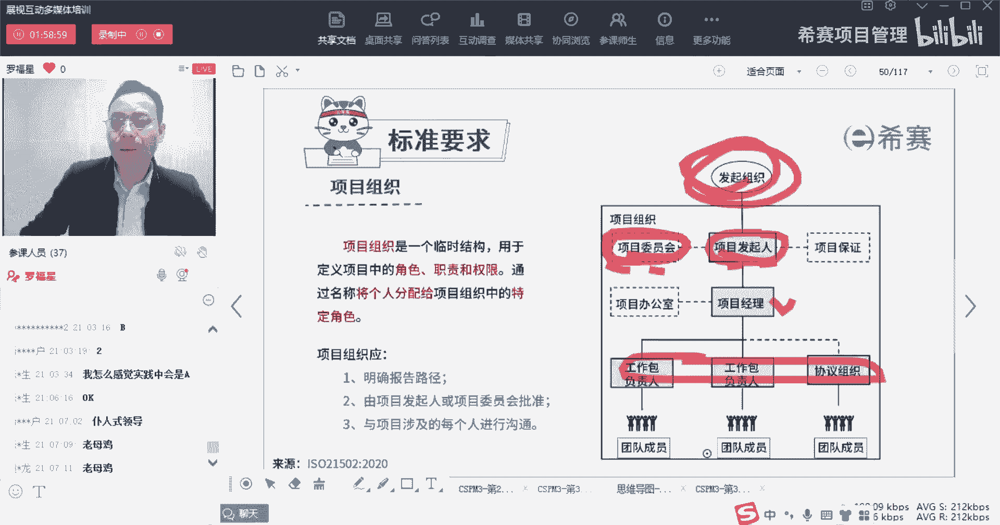

就是发起人他要干的事情，我们想法来回顾一下啊，验证项目是值得做的，确保我们团队和项目经理是牛逼的，以及能够为项目经理来提供支持和帮助，还有就是对于那个老板安排的，这种跟组织变革相关的东西。

我们确保是已经准备好了。

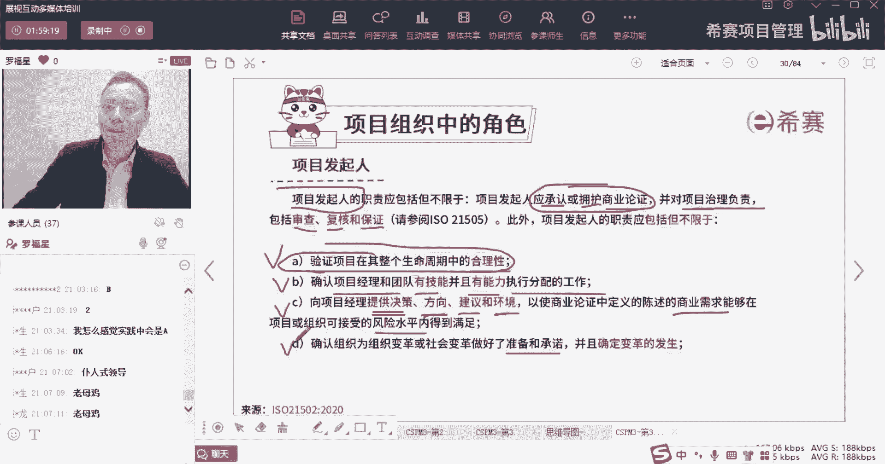

接下来有个题目来看一看，先看第一道题目，考试没有这种填空题，考试是选择题，好张总第一个第一个已经回答出来了，兄弟们好，西餐用户有高中对吧，还有小总，北总，亮总郑总，还有一某某某二同学在项目。

在项目中负责，验证项目的整个生命周期的合理性，确认项目经理和团队，他是有技能，并且是有能力来去执行分配工作的，这个角色是谁呢，就叫项目的发起人啊，这是我的发型，OK所以你们都选对了好，第二个题目。

第二题目已经有同学在抢答啊，牛逼啊，这个就牛逼了，描述错误的，关于发起人的职责，描述错误的，那么顺便来告诉我一下最后一个选项，他可能是谁的事情啊，对答案是选最后一个，那么他可能是谁的事情，来来来来来。

凭你的，凭你的那些学过的，以前学过的知识，不是这门课程学的啊，是以前学的哇，这种牛逼啦，可以可以可以啊，对通常来讲的话，实组织的方法和过程标准化，一般是PMO干的事情啊，是PMO干的事情。

我所以你们看觉得这还真的是不错，哎呀这一集还是很开心的一件事情啊，给你们上课就没那么累，来我们看一下这个题目的答案，在项目中，负责验证项目在整个生命周期中的合理性。

确保项目经理和团队有技能有能力去执行工作，那是谁呢，这个角色是叫项目的发起人，项目发起的决策和职责，错误的是最后一项，第一项说是验证项目的整个生命周期的合理性，第二项是确认项目经理和团队是有能力。

有技能可以去做事情，第三项是向项目经理来提供决策方向，建议环境等等，还有第四项呢，其实说的是确保我们所治理啊什么的，都已经准备好了，而这个使用标准的，这些个是使用项目方法和标准，和和项目过程标准化。

它是PMO啊，是PMO这样的事情你们还确实是很强的啊。

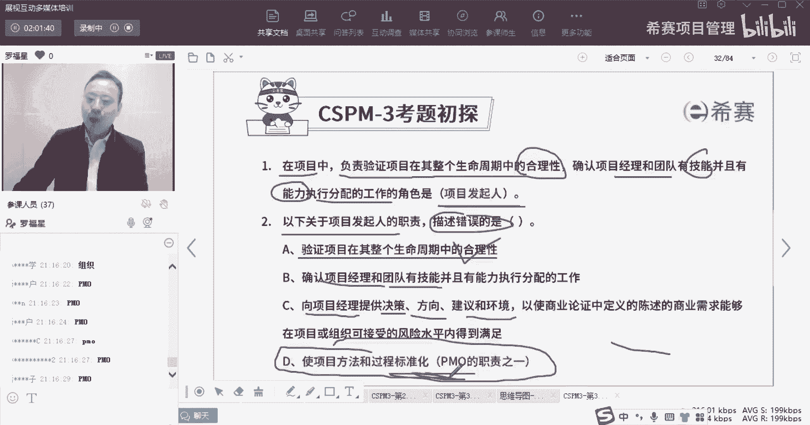

所以你看就是这四条。

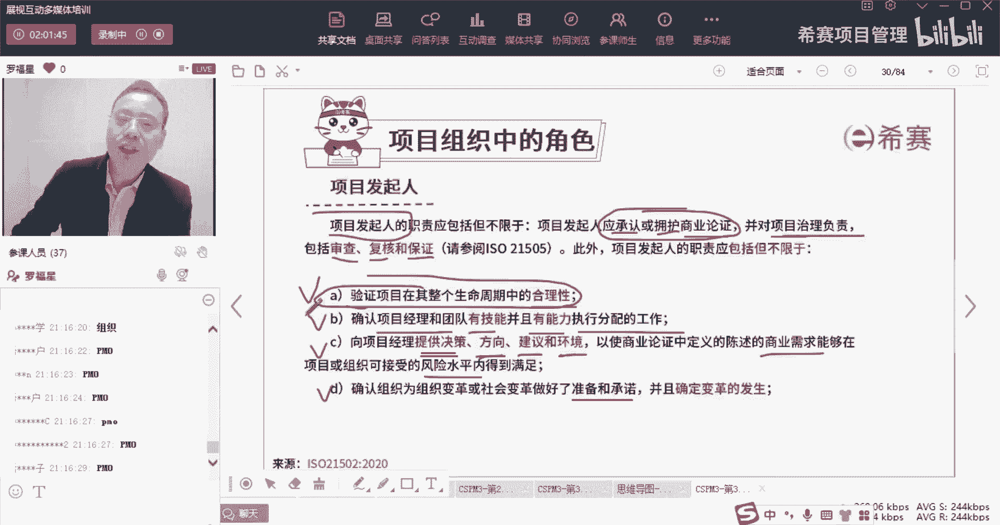