# 【收藏】CSPM-3中级项目管理认证考试直播课精讲视频合集（零基础入门系统教程）！ - P28：CSPM长空3-17八大过程组之项目前活动 - 希赛项目管理 - BV16p42197SH

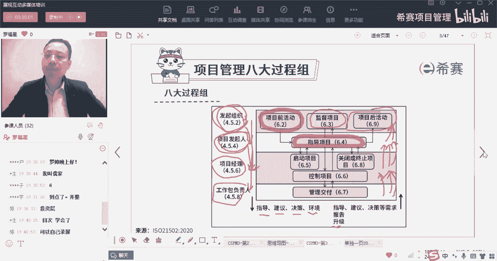

首先是第一个过程组叫项目前活动，我们一起来看一下啊，我们一起来看一下，先看的是第一个叫项目前活动，6。2，这个6。2是什么意思呢，这个6。2它是指的说，我们那个ISO21502，这本书的第6。2节啊。

兄弟们，他是IOR1502这本书的第6。2节，你可以直接从那里面去翻到啊，呃应该是我们的是不是给你们印了这本书，印了没有，我一直没搞清楚到底给你们发的是哪一本，哪一本标准。

是不是印了印了这本ISOR650啊，就是项目管理的标准，项目管理标准那本书一本薄薄的，也是比较薄的一本书啊。

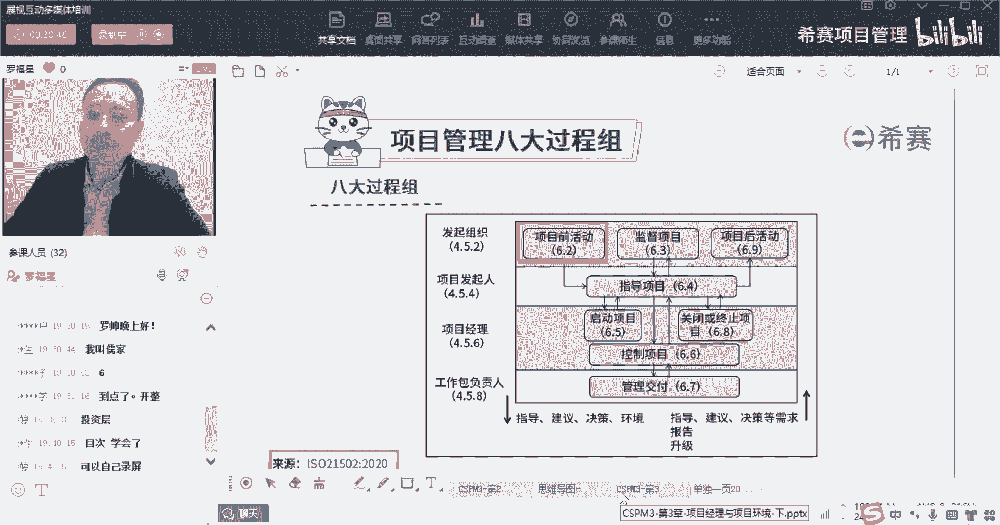

好那么首先呢我们先来看的是关于项目前活动，项目前活动它会分到这样几个板块来进行，一个是它的目的是什么，然后他要去评估什么东西，以及他的论证和他的一些标准，当然他这些其实它只是为了方便去做一个展现。

所以就把它分到了这几个板块，它讲的是什么意思，我们一段一段来看啊，因为这些内容它本身都是相对比较简单的，所以我们只能说是尽量把这东西细细的讲清楚，辅助你更好的去记，比起你下一次单独看的时候。

你会留一点印象，首先第一个项目前活动他要干的，目前目的是发起组织，他要验证这个项目是值得启动的，所以项目前活动是谁干的事情，是谁干的事情。

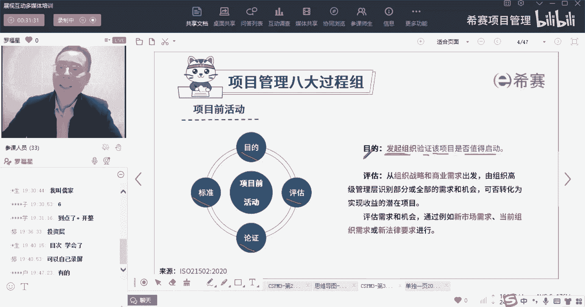

是发起组织干的事情，也就是说这个项目前活动是由发起组织，他来负责的啊，由发起组织他来去负责这个关于项目前活动，而这个项目前活动，其实也就是一些准备性的活动，来确定或确保这个项目是值得的。

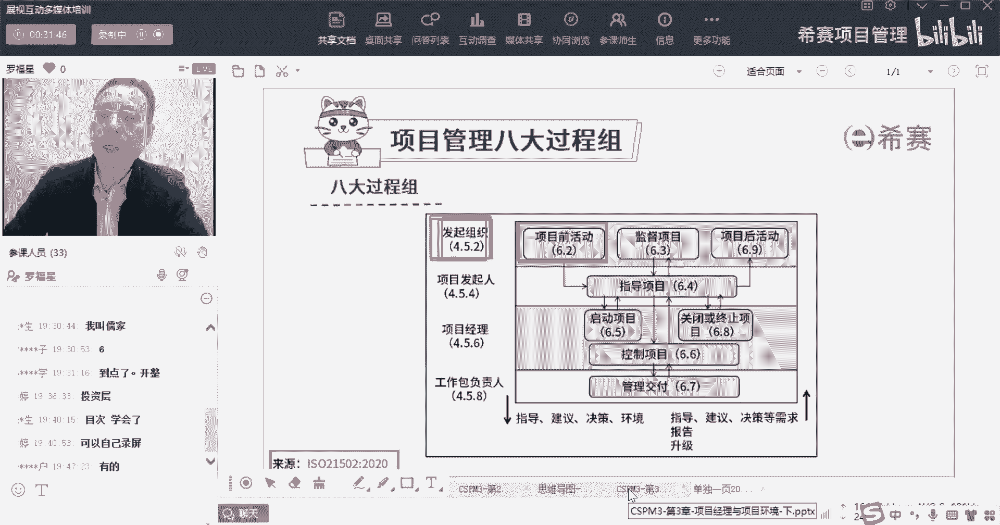

来验证这个项目是值得被启动的，值得做的啊，这是他的一个项目前活动，项目前活动的目的，然后他的评估它的评估什么东西呢，他说是从组织的战略和商业需求出发，有组织的高层级的管理者。

来去识别部分或全部的这些需求和机会，所以是我们从这一个战略和需求出发，来去识别出一些需求和机会，是否可以转化为实现收益的一些潜在项目，也就是说你去探寻一些可能的机会，下列车是这样的。

去探寻一些可能的机会，那探寻机会的方式又有很多对吧，我们如果有，那就是NPP的小伙伴还在吗，我们在讲NPP的时候有讲过，说是比方说问题驱动的方式，来去获得一些新的机会，就是你看到大家遇到什么问题和挑战。

比方说大家那个每一天在写字楼里面，他要去，中午要去吃饭，要下楼，然后去餐厅去等餐，太浪费时间了，那么就有了外卖的这样一个需求，对不对，他不愿意下楼，他他他发时间了以后，就可能就有了外卖的需求。

那我们去到一个地方，我们要打车，发现在路边上打车很困难，所以就有了滴滴打车这样一个东西，你在你在家里面，你就可以点好打车，然后再下楼，刚刚好，时间对吧，那还有像比方说我们要去住酒店。

但是酒店呢有的时候又人满为患，并且还有一些人他家里面又有空闲的这些地方，他刚好可以去出租出来，所以刚好带有需求的时候，可能就有这一个叫LBNB的方式，所以这是一种问题驱动的方式，来得到一种新的项目。

那还有一种方式呢呃叫做竞品驱动，就是我看一看我的竞争对手啊，你如果知道我在说什么，你可以帮我把这四个字敲一下，问题驱动的方式去获得一些新的机会啊，找到一些新的需求和机会，还有一种是竞品驱动，竞品驱动。

也就是说我看一看我的竞争对手他在干什么，我的竞争对手他在干什么东西，那我就反他再做一个一模一样的东西对吧，比方说你们的你们的这个行业中，某一个竞争对手，他正在从事某一个什么什么什么项目，并做得如火如荼。

那如果你想要去分一杯羹，你要怎么办，那你也做做一个一模一样的东西，甚至做一个比他还好一点的东西，对不对，就是竞品驱动的方式来去做项目来去做事情啊，这是比较好理解的，那么还有一种呢叫方法驱动。

方法驱动的方式来去获得一些新的需求和机会，什么叫方法驱动，就是我用到大量的这种新产品，创意的方式和方法用到，比方说像头脑风暴呀，焦点小组会议呀，然后访谈啊。

然后像camper skip sker是一个词啊，叫做替代呀，调整啊，修改呀，排列呀之类的这种各种方法驱动，我稍微简单练一下啊，稍微稍微跟你说一下，比方说我们说头脑风暴的方式，来去获得一些新的机会。

就是我们大家一起坐在一起去讨论一个事情。

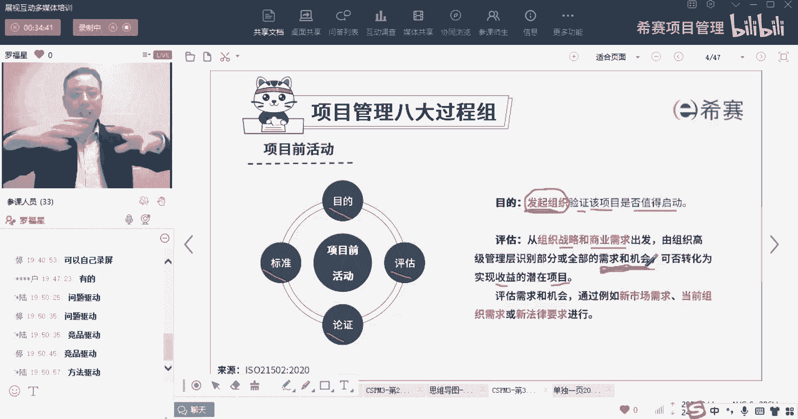

使劲讨论，去头脑风暴去大量想想很多这种点对吧，都是可以的，那scamper的方式，我们说是替代，什么叫替代呢，比方说我们早上去刷牙的时候，我们都是用牙膏牙刷去刷诶，那我如果说想。

我还有什么东西可以去替代我的牙膏和牙刷，来刷牙呢，兄弟们有什么东西可以替代没有啊，那就想现在新的机会，有人就想嗯，那我可以用牙线对吧，我用牙线来搞一搞啊，我可以用那个口香糖，用口香糖来搞一搞，用漱口水。

用漱口水来搞一搞，用树枝，树枝来搞一搞，或者用沙子用沙子来去洗牙齿，洗牙齿，或者用苹果，用苹果去咬苹果的方式来清洁口腔，好像都可以，对不对，诶，就是替代的方式，你当前正在用的某个东西。

还可以拿什么别的东西去替代它呢，唉这是一种帮你去获得一种新机会的方式，那还有一种呢是比方说是叫组合，组合是什么意思，组合它可能是不产生新的东西，但它把两个东西把它合到一起来，或者把三个东西合到一起来。

比方说我举个简单例子啊，你小的时候用的铅笔，你会发现正常正常来讲，一支铅笔就是一支铅笔，它的屁股后面没有橡皮擦对吧，那橡皮就是一个橡皮，它前面没有铅笔，但是有人把它做了一个组合以后，一支铅笔。

它的屁股后面带了一个小橡皮，你写铅笔的时候，你还可以顺便用那个橡皮去擦它，哎这就是一个新的品种，一个新的品种，那比方说我们晚上出门的时候，我们可能需要打一个手电筒，那我们要去跟远方的亲戚打电话的时候。

我们需要去专门在家里面装一部电话啊，我们想要听收音机的时候呢，专门需要买一个收音机，那现在我们有一种方式把这个手电筒，电话收音机合几为一，还包括我们要去拍照片的话呢，我们需要去专门买一个相机。

现在把它合到一起，合成合成一个什么啊，兄弟们合成一个什么啊，有声音的mail刷新一下，要是没声音的话，刷新一下，现在把它把我买这四种东西，把它合到一起，合成一个什么玩意儿出来，组合组合成一个组合成手机。

是不是你的手机又可以打电话，又可以听收音机，又可以做手电筒，同时呢它还可以用来去呃，呃什么拍照片等等，这是一种组合的方式来做事情，它还有一种方式叫做消减消减，简单说一下啊。

我们不去特别展开交警的方式是什么意思，比方说你的一个手机上面有那么多按钮对吧，像你还记不记得以前的手机好多好多个按钮，太多了，太复杂，太麻烦，通通把它去掉对吧，把那些把那些个内功能给去掉，去掉以后诶。

你会发现你现在手机只有几个按钮，只有一个什么开机的按钮，关就是开机的按钮，关机按钮是一个声音大，声音小的按钮是一个，其他就没有了，全部都是手那个触控面板的这种方式来做东西，这是一种消除或消解的方式。

诶都是就有很多种方法，你把这种方法学好以后，本身就能够帮你获得很多的新的机会好，所以这是方法驱动的方式，那除此以外，还有一种方式来去获得一种新的需求和机会，叫什么呢，叫技术驱动，技术驱动。

就是现在这个时代有什么新的技术，那这个新的技术，我们是否能够很好地去利用起来，比方说诶发现语音识别技术已经很成熟，那既然语音识别技术很成熟，可以用来干什么呀，兄弟们，你可以说小爱小爱。

小爱同学给我唱一首国歌对吧，或者说是hi siri唱国歌，类似这种方式，我们可以通过这种，通过这种语音的方式来去召唤我们的东西，包括你们开学的时候，导航是不是经常说小德小德去公司哎，类似这样一种方式。

我们可以去召唤这个导航，用通过语音识别的方式对吧，有了这个新的技术，它就可以做一个新的功能出来，还包括说我们可以通过比方说呃，像手机里面的这个输入法，我要去跟别人去说一段长长的文字。

但是呢我又不愿意敲这个字，敲起来敲太麻烦了，那我们可以怎么办呢，我们可以去就是点到那个语音识别，然后开始叭叭叭说说一大堆，然后把它转变成文字的方式，所以你会发现一个新的技术，它产生以后。

它会导致有很多的应用的场景，有很多应用的场景，兄弟们，那还比方说像现在的这样一个呃，大家知道你们要是出国，你们有出国过吗，我也没出没有，我没出去过啊，假如说你有一天要去出国，你觉得你英语又没有那么溜。

那你就会需要去请一个翻译对吧，但是现在因为有了这个语音识别技术以后，你都不需要格外的去写一个翻译，你在那个叫什么公司啊，科大讯飞对吧，你在科大讯飞去买一支翻译笔，翻译笔。

那你你只要是你的普通话不是那么的差，你把它讲出来，它能够识别出你讲的是什么意思，然后马上通过那个那个语音库，来去找到它对应的那个外语，或者老外说一句外语，然后然后他听到了以后。

把它转换成我们能听懂的中文的方式都很方便，这是一种技术驱动，比方说像区块链技术啊，啊像这样一个什么3D打印技术啊，啊像这样一个什么全息影像呢，呃那个VR呀，AR呀等种新的技术。

他都可以发现有很多新的机会，现在目前我们可能有那种什么啊，VR技术大部分是用来去玩游戏对吧，但是也有一些是用在某些工作场合中，比方说你要去装修的时候，你就用那种虚拟现实技术来去看一下，诶。

我这个房子里面装了一个什么沙发，特别漂亮，装那种东西，刚刚好能看到这种视觉效果，所以这个这也是一种方式啊，所以不管是问题驱动也好，竞品驱动也好，方法驱动也好，技术驱动也好等等，各种方式和手段。

都可以帮我们获得一些新的机会，但是我们的企项目前活动呢，是既要去找到一些新的机会，同时呢我们还要去判断这个新的机会，他真的是个很好的机会吗，诶它能够帮我们获得对应的潜在收益吗。

但是这个潜在的收益它又有个什么点呢，收益我们说是有有形的收益和无形的收益，就是它能够让你创造钱钱钱对吧，能够创造价值，创造钱钱，这是一种收益，那还有无形的收益，就是民生啊，地位啊，声望啊什么之类的对吧。

包括哎我们要去占有一个一席之地，就像今天我在发，我特意发了一条朋友圈，你们的助教老师黄蓉老师，还有助教老师芷若老师，他们都是在10月份的时候参加了CPM的考试，今天才十，他们是10月28号考试的。

今天是11月23号就已经是出成绩了，兄弟们就已经是拿到他的那个，就是有了电子版证书了，太牛了太快了，这个速度真的是要点个赞，特别牛，那为什么马上就要把这个东西发出来，我只是想要告诉大家啊。

这个事情我们也是第一波，我们是第一波就在搞这个事情的。

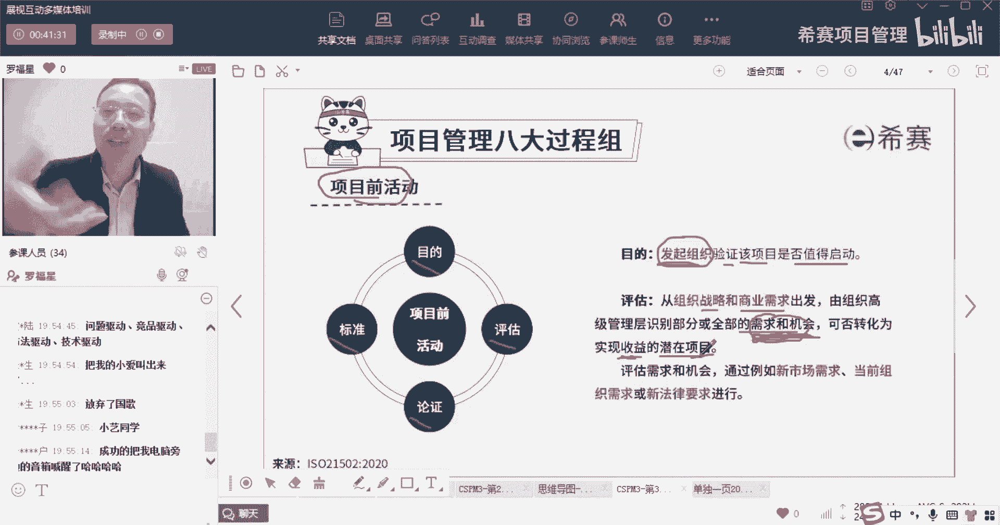

我们在抢占，也是在去抢占先机，现在我们不是最最早的啊，但是我们是第一波强安先进对，同时呢也是在给你们鼓舞士气，告诉你们这个事情其实有搞头，这是一方面，还有一方面是也想要去吸引更多的同学。

对这东西有兴趣的赶紧过来对吧，所以我还把你们今天在群里面聊天的那个记录，然后打了个马赛克以后发到各个原来的群里面，告诉他们说卷完都在这个班级群，所以大一点我们一点都不担心，大家不愿意不学习的这个事情。

因为有很多班级群真的是你很头疼死了，他妈的就不学习不学习，很很让人生气啊，但是这个班我相信没问题，因为你们都是最积极主动的一波，你们是属于什么呃，那个学过NPDP的同学，我们知道有一个叫跨越鸿沟的模型。

在跨越鸿沟的模型中呢，它会有一个叫创新者，创新者就是这个东西还是一个比较新的东西，但是你觉得这个东西是个新的东西，你愿意去尝试新的东西，那么这一拨人往往是最有热情的，是相对来讲比较有热情的啊。

或是早期的接受者都是比较有热情的，所以这个班级我虽然是第一个班，但是我真的是不担心你们，我相信你们都会认真学啊，相信你相信你们会认真，胡总说啥都没学过，是啥情况，啥也没学过，是什么意思。

你是说NPD啥也没学过，还是说还是啥啊，NPD没学过，正常啊，因为那个毕竟那个科目还没有那么大众，没有偏偏那么大众，只有110的人学了NPDP。

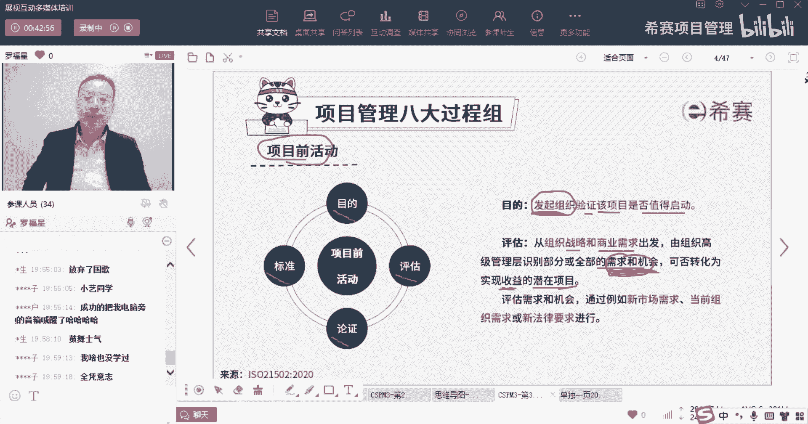

但是很多时候就说我相信来到这个课堂的同学，应该都是相对比较，就已经算是比较积极主动的愿意去学的，尤其是第一个班就投一个班，一定都是这样的啊，所以我对你们充满信心，你们要加油啊，你也不能辜负罗老师的期望。

好，这是关于我们在项目前活动中，先简单解释一下关于他的目的，以及它的这样一个评估，评估里面就说是评估发现一些新的机会呀，以及去能够发现它能够去实现这一个呃，叫实现它的这个收益，好好看一下。

陆总说都快都快四张了，还在继续卷，怕什么对，就是要有这个士气啊，特别牛特别牛，特别好评估评估需求和机会，通过例如什么新的市场需求，当前的组织需求或者是法律要求来进行，什么意思呢，就是这个东西有搞头吗。

那我们看一下这个市场上面有需求吗，大家都很热切的期盼着什么什么东西，那么说明这个东西极度有市场，但是如果说发现市场上已经是红海，已经是红海，那你就必须要去换一种方式，你用原有的方式。

你就只能是在红海里面去厮杀，你要把它换成别的形式，然后争取搞一个南海出来对吧，还有就是我们组织有需求吗，也是我们公司有需求吗，就我们公司本来就是某某某业务的开张，某某业务的一个需求。

所以我们可以去做做新的东西，还有一种是法律的需求，就是国家或社会它的法律有没有需求，比方说每一次但凡颁布一个新的法律，或者什么十三五规划呀，有新的一些这样动向的时候，都有很多新的机会对吧。

那么你就看国家有什么新的需求，法律有什么新的需求，我们就开展一个新的东西好。

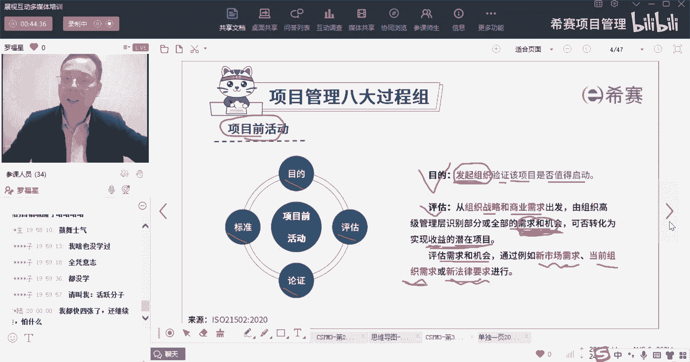

这是关于他的评估，这一点好，来看一个题目。

在目前活动它的目的是什么哇，这个题目好难啊，他说是验证该项目项目前活动设施发起组织。

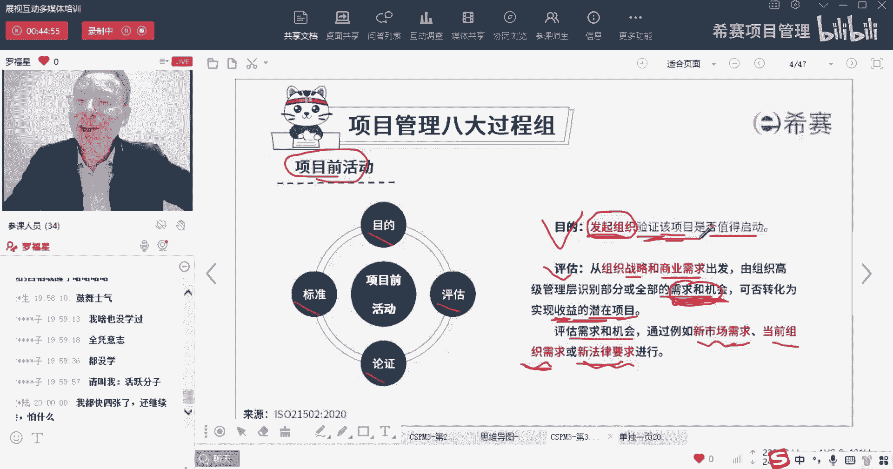

项目结合的是发起组织，来验证该项目是否值得投资，所以请注意哦，是谁来去搞啊，谁是主体啊，发起组织才是主体啊，对小总说的很对，是发起组织啊，是发起组织，他才是这个项目的主体，OK所以身体那个项目前活动。

它的目的是发起组织，来验证该项目是否值得启动，是否值得投资。

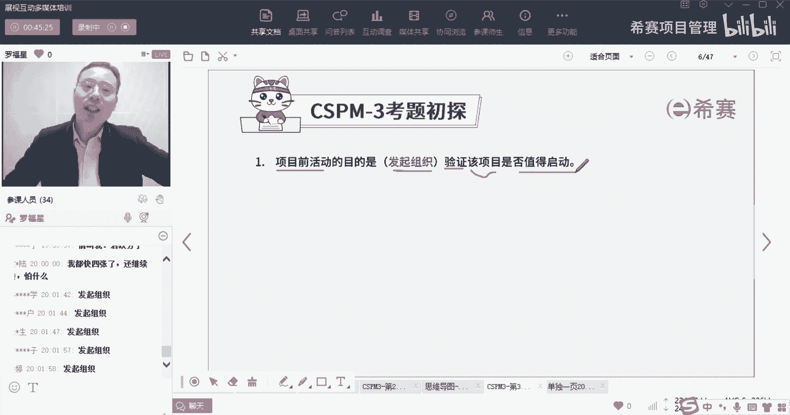

是发起组织好，接下来呢我们再继续看关于论证，他说我们要对项目的目标收益，合理性投资来进行论证，并详细的记录，这不就是商业论证的吗，对不对，这就是这才是在做商业论证，也就是说项目前活动。

我们提前做一些准备性的事情，我们需要去论证很多方面论证，比方说这东西能不能做成对吧，我们在上一次课还讲过一个一滴血的项目，你有印象吗，讲过一滴血的项目啊，就是现在这个项目看上去很好，但你发现做不成哎。

这就是问题，做不成就是有问题，所以你发现他的目标能达到吗，这些收益能达到吗，投资是划算的吗等等，你要综合考虑，还有说需求和机会会进行优先级排序啊，那我再问一个问题。

我们为什么要进行某一些东西的优先级排序，原因是什么，我好像在这个班问过啊，那就自问自答一下啊，通常我们之所以要对某些东西进行优先级排序，是因为我们的资源是有限的，你利用有限的资源去做事情的时候。

你一定会去做最重要的东西，对不对，对刘总说的很对啊，就资源有限啊，所以我们一定会拿这个有限的资源去做，最重要的东西，是的就是张总说的这个意思，在这种情况下呢，我们去挑选的项目。

我们需要启动项目一定是发现是最划算的，最有用的，最能够扩大我的什么什么东西的对吧，通常情况下他说我们会跟以下方面去进行关联，第一个是组织的战略，商业计划，就是我们的东西应该是跟公司的战略是相匹配。

相一致是match的啊，是跟公司战略目标是相一致的，相匹配的好，第二个更高层级的项目群或项目组合的需要，也就是说有可能我们要向着这个新的机会，新的项目它是隶属于项目群中的之一。

或者它可能是隶属于项目组合当中的之一，它刚好跟我们这个项目群相匹配，或者跟我们某个项目组合相匹配，而这也是可以的，第三个是有可能我们做的东西是，刚好客户有需要，生活中咱们如果去做项目的话。

你会发现大部分时候是第几种，大部分时候是第三种对吧，就是你的某一个甲方爸爸，他刚好需要做一个什么什么项目，他愿意有一笔资金，你刚好说哎呀，没问题，这个东西我们可以做来吧，给我们做吧，这种方式对吧。

就客户有需要，所以我们通常会去判定这东西，论证这东西值不值得去做，要看跟公司战略目标是不是相一致，是不是隶属于或符合项目群，项目组合，还有或者是看是不是符合客户的某种需求，那么我们的论证。

你看论证的目的是，获得组织对于所选项目进行投资的承诺和授权，啥意思，就是我们做完这一个项目前，活动论证完了以后，那么公司说诶如果通过了就会砸钱，如果没有通过，那么对不起，我们再选下一个，就这个意思啊。

所以论证的目的是来获得组织，他对于所选项目进行投资的这个承诺，以及他的同时了解它的局限性，风险和假设，也就是我们在进行商业论证的时候，还要考虑到风险的可行性对吧，还要考虑到各种局限性，所有的局限性。

所有的约束条件，它都是对我们造成一些这种限制的啊，都是一些限制，还包括所谓的假设，假设是什么，假设我们是假设它为真，就是有很多默默认的前提条件，但是如果那个前提条件达不到的话，这个事情就搞不成器。

就是如果那个假设条件达不到，那个东西就搞不成，我给你举个简单的我生活中遇到过的例子啊，我在十几年以前，那时候在做项目的时候呢，我们很流行的做一种，就是在祭祀行业中，有一个把那个土地模块来进行。

相当于说是匹配，相当于说是monitor，是是是监督的监控的方式，看到的变化，看是不是从草地变成了农业用地啊，或者变成了什么森林呢，变成了那个什么啊，建筑用地压制的，那么这里面有个前提条件是什么呢。

前提假设就是说假设我能够先识别出这块地，我能够图像识别技术非常牛，我能够识别出这是一块农田，这是一块房屋，这是一块工厂，我先能够识别了以后，识别完了以后标注出来，然后再去做这个算法就很容易了。

可是当时的那个技术真的是发现识别不了，当时我在在那个行业中工作的时候，那时候是一直到我离开那时候都实现不了的，OK当然最近这些年的话，那个图像识别技术变得越来越牛，越来越牛又不一样了对吧。

现在你们打卡是不是都是用人脸识别的，这种方式去打卡，像我们进到这个楼里面的，都是用人脸识别的方式，它又又变了一些调整了，那有一些假设条件他有可能是达不到的。

所以我们在做论证的时候，要综合考虑很多因素好，最后一个呢，他说项目前，项目前活动的一个标准是说要做一些定性的，有一些定性的标准，就说是做定性的研究的标准，有一些定量的标准。

我觉得其实他应该是先写定性再写定量，但是它教材是先写定量再定性啊，什么叫定性，什么叫定量，我们稍微解释一下，定性是什么意思呢，定性是指诶我可能有这种东西，有这种需求，有这要求会有这样一个东西。

有没有在这个维度是定性而定量呢，它也是有多少有百分之几十几点几，对这个东西就是量化的，量化的标准，定性定量，他说应该是有定性的标准，有定量的标准，有一些财务指标，所以通过这里你会发现可能定性定量的标准。

它有可能是非财务指标，那这个非财务指标可能就是诶，我的战略是不是相匹配相一致，我的资源是不是可以搞定，我的能力是不是可以搞定，我的什么东西可以搞定，那是这样的一种方式啊，好还有一些财务指标。

那么财务指标呢就是你经常听说的，包括像什么投资回收期，投资回报率，然后净现值嗯，那个那个内部收益率等这些东西啊，这是财务指标，你一定有一套标准，你有了这个标准，你才能真正的去评估，去论证。

才能够决定这个东西行还是不行，对吧好，那么非财务系统评估，与组织的战略目标是相一致，这是一定需要有的，还有可持续性以及社会和环境的影响，可持续性，这个呢现在最新的这个社会反而会越来越流行。

尤其是老外那一套会很流行，我们国内呢，其实慢慢也在有意识的去做这个东西，你知道那有个叫再生行业，再生行业，就是把那种废品重新去回收利用的行业，其实也是很很重要的，那如果说我们在设计某款产品的时候。

我们在研发生产某款产品的时候，我们就能够做到他最后报废了以后的东西，有一部分是可以再回收利用的，那这是一个很好的事情，它甚至可以达到一个叫什么叫城市矿产，城市矿呢就是我这个城市虽然没有这种矿。

可是我可以通过回收利用的方式，来得到这种资源，它就可以减少对某些矿产的开发，它可以让我们这个地球存活更久的时间啊，同时还有考虑到社会的影响，环境影响，关于社会的影响，说是人与人与人之间的影响。

环境的影响通常说的是地理环境，说的是物质的环境的影响，不同的单位，不同的组合管理不同群部的项目，他们之间的标准可能会略有不同，取决于他自己的特定的环境。

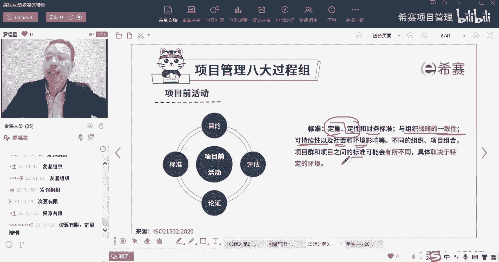

就是这样一个项，目，前活动讲了这些东西以后，你你大概大概有一点点明白它的意思吗，你看他说在授权启动项目之前，我们应该要先确定项目的发起人，项目经理，他们的最初始的一个角色和职责。

以及做一个最初的这个治理的安排，然后去判定这个组织，他说判定组织是不是具备有整个项目的启动，资金和资源，以及会认为它是能够有势，能够把那个剩下的资金和资源可以争取到。

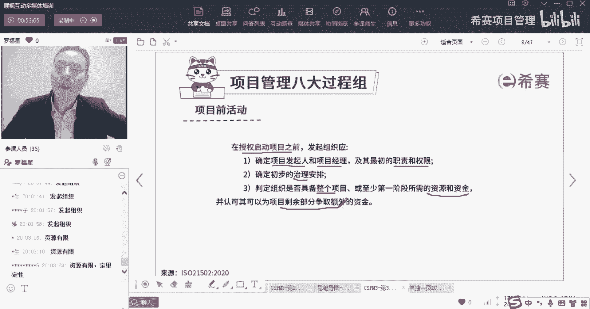

所以你会发现起，那个那个那个启动项目前的活动，他真的是在做大量的准备性的工作，它来去判定，首先第一个是我们有没有好的项目可以去做，第二是这些项目这些好的创意，好的项目，他是不是真的可以去做啊。

有没有机会可以去赚到钱，如果他真的可以赚到钱的话，我们能不能把它做成，我们有没有对应的资源，我们有没有对应的资金，有没有对应的实力，有没有时间去完成它，它能不能覆盖住我们这些东西，对吧等等。

这是项目前的活动，是谁来负责做的吗，发起组织发起组织是一个高层啊，是一个上级的部门。

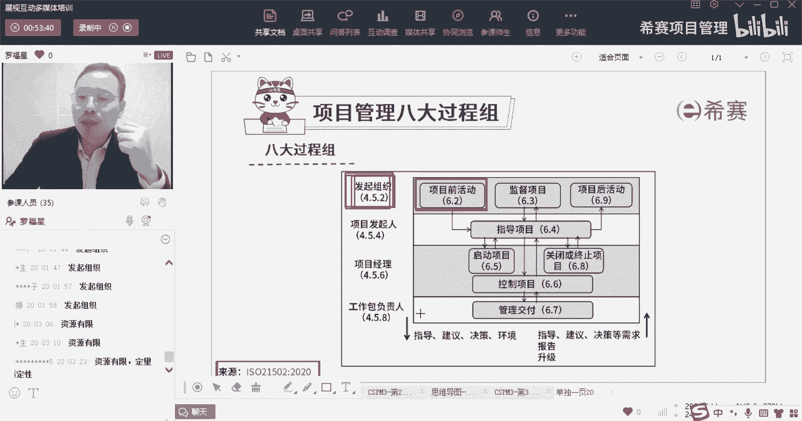