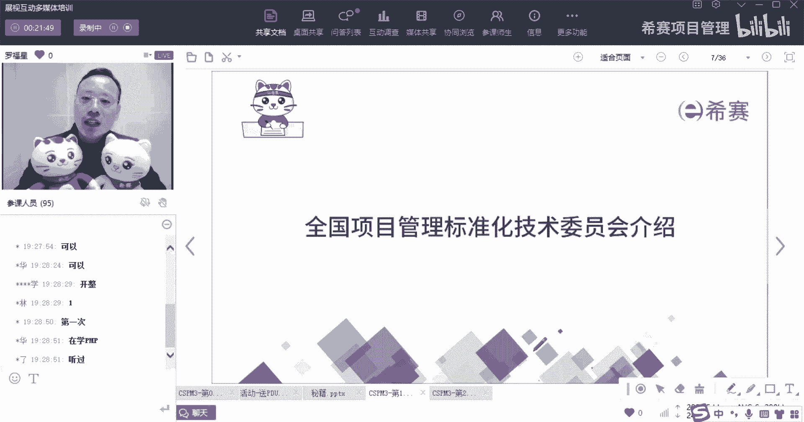
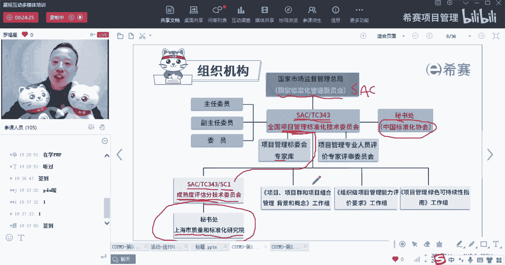
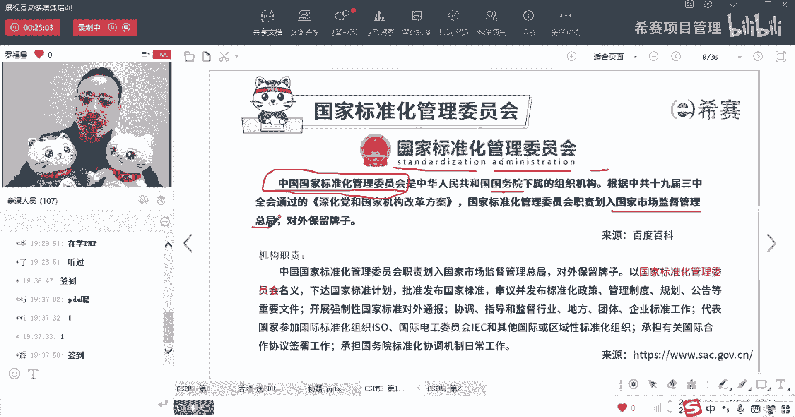
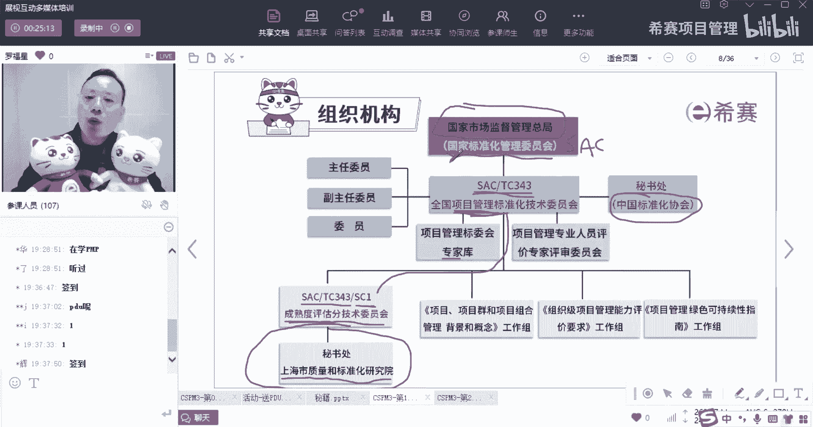
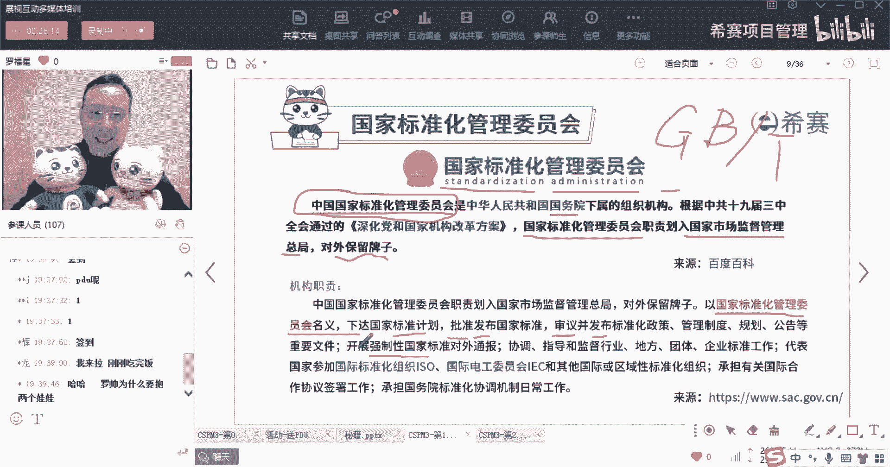
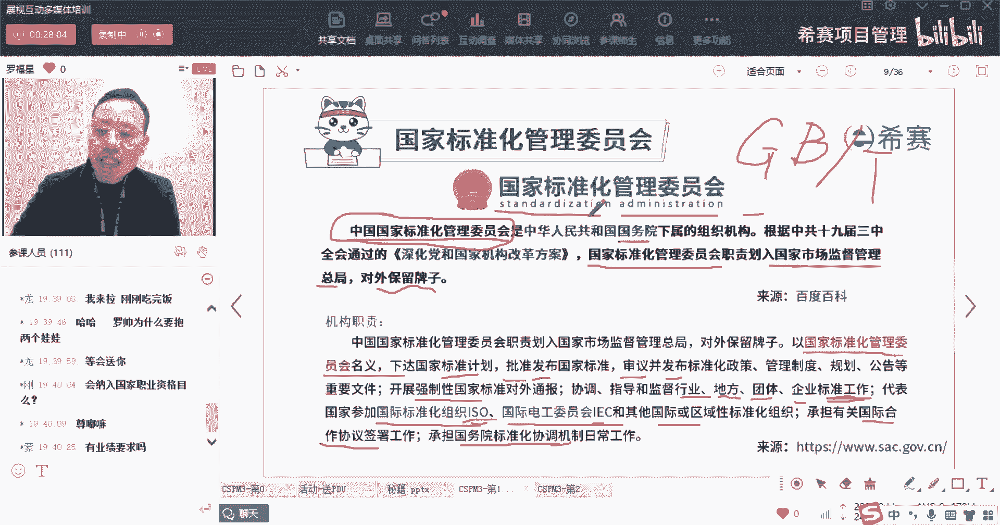
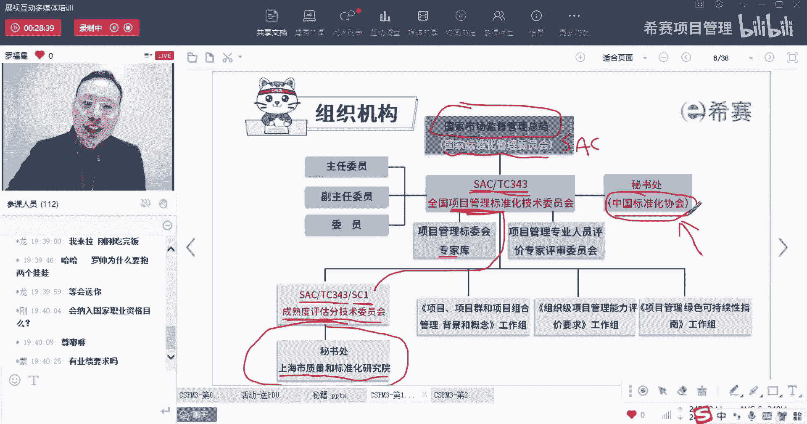

# 【收藏】CSPM-3中级项目管理认证考试直播课精讲视频合集（零基础入门系统教程）！ - P2：CSPM长空1-2国标委介绍SAC - 希赛项目管理 - BV16p42197SH

那整个项标尾呢它的这个结构是这样的，我在这张图中又加了一个小小的内容，大家可以看到吗，在你们的讲义，就是你们手上其实是拿到了基本讲义对吧，就是整个你们的手上应该是有两本，有一本讲义加上一本小册子。

对不对呃，然后呢还有两套试卷，就是这两套试卷，然后再加上你的这一本书叫什么啊，就是项目管理专业人员能力评价要求，你应该手上一共是有这样的六本书，那我把这个图稍微又加了一个小点，我们来从上往下来过一遍啊。

首先第一个咱们的这个cs p m呢，它是由中国标准化协会来主推的，那这个中国标准化协会，它是为什么能够去主推呢，其实是受到政府的安排，那么政府首先从下面开始说起，有一个叫国家标准化管理委员会。

那国家标准化管理委员会它也叫SAC，那国家标准化管理委员会呢，它的下面会有很多个具体的技术委员会，会有这些，比方说建房子的技术委员会啊，可能会有生物制药的技术委员会呀，可能会有航空航天的技术委员会等等。

其中呢在最近这一年，就成立了一个叫项目管理的标准化技术委员会，那这个项目管理的标准化技术委员会，它是属于国家标准化管理委员会，底下的第343号，所以叫SAC下面的TC343，这个也是要记得。

这个也是要记得，OK啊，Tc343，叫全国项目管理的标准化技术委员会啊，然后呢它的这底下就会有这些像项目管理的呃，标委会的专家库呀，还有像项目管理专家人员的这个评价委员会啊，底下会有一个专门的关于。

因为现在这个项目管理委员会呢，它里面很多东西都是铜材，国外的，那同在国外的东西里面，它就有专门成立了，另外一个小的一个技术委员会，叫做成熟度评估分技术委员会，那么这个成熟度评估分技术委员会呢。

他会讲的是说它的那个它的名称叫做叫做，S a c t c33，下面的一个叫sc one s c1，那这个成熟度评估的分技术委员会，上海市质量和标准化研究院，而是这样的一个单位，等会也会有题目会考到你好。

然后整个这个这些个内容中。

首先第一个叫国家标准化技术委员会，它的名字叫SAC叫standization administration of，叫中国国家标准化管理委员会，那这个中国国家标准化管理委员会呢，然后就改革方案通过以后。

这个中国国家标准化管理委员会，就已经是分数到了，叫国家市场监督管理总局底下。

所以它被划入到国家市场监督管理总局，也就是你会看到下面会有一个名字，叫国家市场监督管理总局，所以现在目前国家标准化管理委员会。

它是隶属于国家市场监督管理总局，同时呢它是对外保留着牌子，什么叫对外保留牌子呢，就是国家有什么重要的这些国标呀，啊一些行行业标准啊等等的时候，那么就是依然由国家标准化管理委员会，来去发布。

所以你看它是会以国家标准化管理委员会，的名义来去下达这些国家的标准计划呀，去批准和发布这些国家标准，去审议和发布这些标准化的政策管理制度，规划以及公告等这些文件啊，并且他会去开展一些。

他说开展强制性的国家标准对外开放诶，这个叫强制性的国家标准，你会发现我们的国标有两种，一种呢是国标对吧，还有一种呢是叫国标推就是推荐指标，所以一个是强制性的标准，一个是推荐性的标准。

那么开展强制性的国家标准，而它也是属于国家标准化管理委员会，它下面的这个对我为什么要抱着她呢。

累不累啊，然后还有呢就是他会去，你看协调指导和监督这些行标，OK行业标准，然后呢还有说地方的标准，还有团体的标准，还有企业的标准这些，你只要后面的这些你只要稍微了解一下，就了解一下，然后呢。

他是他说还有就是国家标准化管理委员会，他会说代表国家去参加ISO，就是国际标准化组织的一些活动，以及参加这些个叫IEC，叫国际电工委员会，这也是国际标准啊，就是国际标准上面有三个最大的国际标准。

那这三个其中ISO和IEC呢是比较知名的，还有一些其他的一些国际标准，所以他要去代表我们国家去参加国际标准的，这个啊标准化组织，然后以及承担有关国际合作的这一协议签署，协调机制的日常工作。

所以这是一个国家的机构啊，它是一个国家机构，它会呃来去所有的这些标准的制定的，标准呢下达呀，标准的这一签发呀，标准的批准啊，标准的这些更改呀，以及去强制的标准的这个监督呀，执行啊，行业标准，团体标准。

社会标准，企业标准等等，这些标准都是参考其他来进行，包括参与这些国际的这些标准，组织的这种会议啊，标准的制定呢，都是跟这个国际标准化管理委员会有关系，然后呢，同时它目前已经是。

隶属于国家市场监督管理总局，对吧啊，然后有同学说，这个会纳入到国家职业资格目录吗，目前呢是在力推。

就是我们在参加这个CPM的这个，司职培训的时候，但是也是问了这个问题，然后中国标准化协会的副秘书长，他是全程在我们做师资培训的那四天，全程都在跟随，然后同时回答这个问题，就是说他们在一直在很努力的去推。

所以目前有少部分的地方，他已经是好像是说是电信行业还是什么行业，会更加的去认这样一个CSPM这个标准，而不会去用那个叫什么，就是国外的一些标准，所以他其实会是有一个过程啊，有一个过程啊。

