# 【收藏】CSPM-3中级项目管理认证考试直播课精讲视频合集（零基础入门系统教程）！ - P32：CSPM长空3-21八大过程组之启动项目 - 希赛项目管理 - BV16p42197SH

大家晚上好，欢迎来到西塞网专业的职业教育平台，我是罗福星。

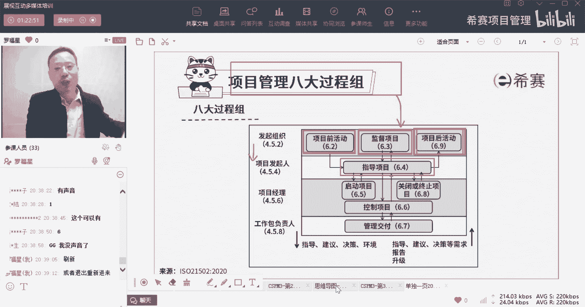

那今天晚上我们一起来分享的是，cs pm3集的内容中，第三章叫项目经理角色定位与项目的受控环境。

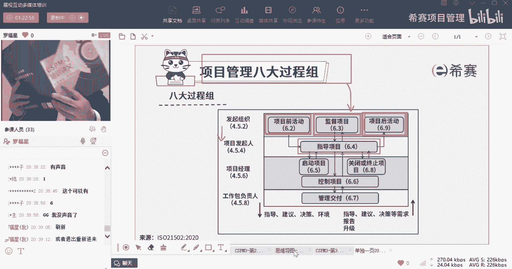

呃，今天晚上一起来讲到的是，关于项目管理的八大过程组，那这个八大过程组他跟你学过prince课程的话呢，它跟prince里面的七流程非常的相近，非常的相似，我们会把这些人按照这样一种方式来进行。

一个是那个发起组织，它相当于是一个投资者或投资成，一个是项目发起人，他相当于说是这样一个呃，那个叫什么，然后呢这个项目经理呢是管理层，然后这个项目的工作包负责人是交付层，它是按照这样的四成来去对待。

我们开始已经是讲过了，关于项目前活动，项目前活动呢其实主要就是我们在做项目之前，由发起组织来去确定有没有好的这些机会，我们说可以通过问题驱动，竞品驱动方法，驱动。

技术驱动等方式来得到一些新的想法和创意好，然后再接下来就是我们要去论证或验证，这些想法和创意，他真的是值得做的，它真的能够为我们产生收益，产生价值，真的确定这个项目是值得做。

这是由发起组织他来去搞的事情，接下来下一个呢是监督项目，而这个监督项目我们刚才已经看到了，它其实焦点就是持续进行商业论证，它是持续进行商业论证，对吧好，第三个说项目后活动，项目后活动呢。

它特指的是说当项目已经做完以后，交付以后，应该是交由运营的团队，或者运维的团队来去负责，那他是要去确保我们的价值是得到了，确保目标是达成了，确保收益是产生的，就是项目后活动它所需要去干的事情。

接下来我们看到的是在发起人这个层面上，他们看到一个叫指导项目，那他的这个指导项目其实是去定标准，定规范，并要求你要去给项目经理提供指导，它是基于在那个项目委员会的支撑之下，来去给项目经理来做指导。

接下来就来到项目经理这个角色，项目经理这个角色中会有一个叫启动项目。

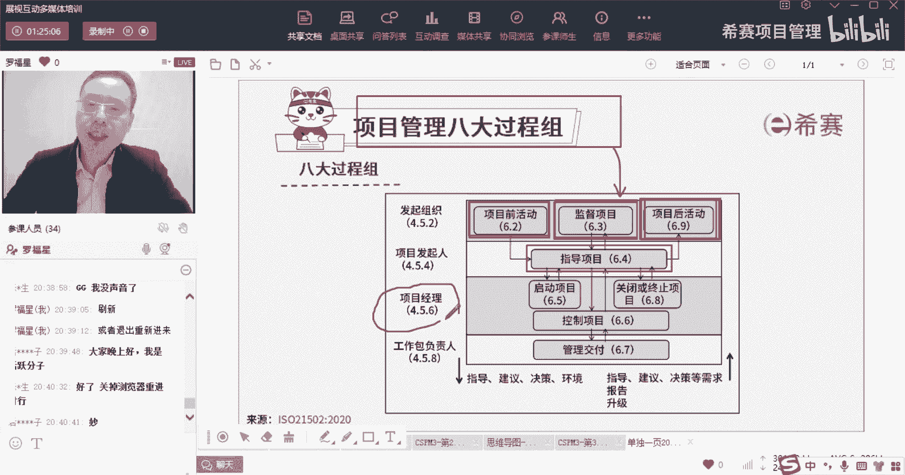

我们一起来看一下启动项目它是干什么哇，这个就多了对吧，你看他说是要它的目的是计划项目，定义项目的组织动员项目团队，定义项目治理以及定义项目管理，确定相关方以及验证项目的合理性，所以你会发现诶。

怎么他又搞了一些领导能干的事情，但是在这里有一个点你需要了解，通常情况下，其实很多时候很多事情虽然是领导们在干，但是具体落实的事情都是小弟们亲自去负责，也就是说你作为一个项目经理。

但是项目经理他已经不完全算小弟了啊，项目经理底下还有小弟对吧，但是你在大佬大佬面前，在大领导面前，你依然是小弟，那么你依然要去帮他按电梯，按楼层，然后帮他去挡住门，对不对，你依然要干这个事情啊。

那么对于这个项目的一些治理的治这些管理呀，定方针啊，定什么东西呀，而项目的合理性啊，这些东西你你其实要亲自去替他做，他只是最后去拍板做决定，或最后只是拿你的这个成果来去来去盖个章，或者干什么之类的。

你负责去具体落实很多事情，所以你要做的事情还有好多，你看你要去计划一下这个项目上的事情，你要去定义我们这个项目组织就是谁呀，谁呀谁呀谁呀，谁负责干什么干什么干什么，他的角色只是他的权利，嗯对吧啊。

你你要去动物园项目团队，你要去组建团队，然后管理团队动员团队，你要去定义好项目的治理，治理这个事情虽然说是大领导们干的，但是我们就只说定义组织这个板块来讲，它其实就也是属于治理中的一部分。

还有就是确定各路神仙，各路相关方以及验证这个项目的合理性，这个验证合理性呢，它其实就是属于我们在前面一个叫监督啊。

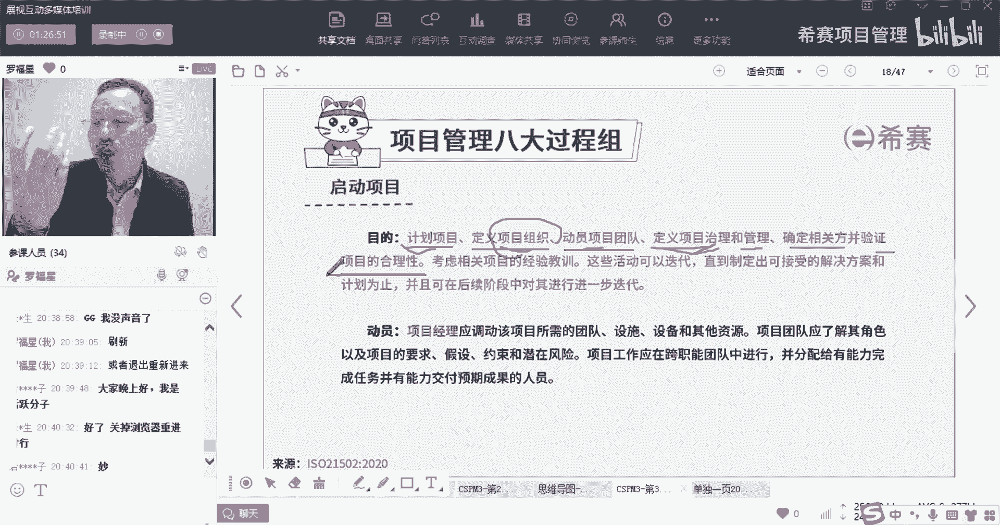

其其实就相当于是监督的时候干的事情，监督的时候也是在验证项目的合理性对吧，而现在呢启动这个时候也是，哎真的是替领导来去做一部分的这种确认。

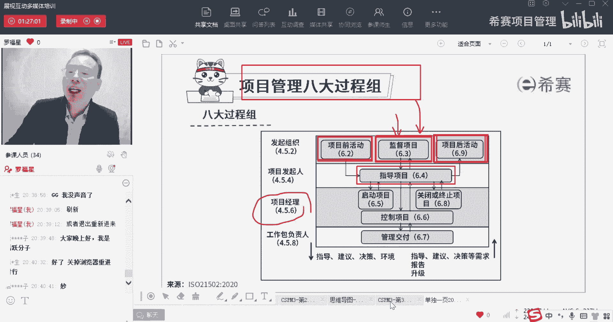

来确定这个项目是值得做的，他说考并且考虑相关项目的这些经验教训，也是给予经验和教训来去往前冲，这些活动可以是迭代的，直到制定出可以接受的解决方案，或者是计划为止，并且在后续的过程中可以进一步的去迭代。

所以呢，其实也就是说我们真正去启动项目的时候啊，以前在偏僻的课程中，他说的是由那个发起人来去启动这个项目对吧，发起人来去做这个东西，但是它里面具体的很多活，都是你项目经理亲自参与去负责做的。

负责去落实的好，第二个他是动员动员什么，项目经理应该要调动团队的这个积极性，那调动团队所需要的这些团，调动这个项目所需要的团队设施，设备以及各种资源，所以你要你要去集结资源，要去获取资源，要去得到资源。

并且如果对人的话呢，我们要去打造一个团队，项目，项目团队应该要了解其角色以及项目的要求，也是角色职责啊，假设条件制约因素，风险等等，项目工作应该在跨职能团队中进行，他为什么要去讲这个词呢。

像现在其实很流行的是说每一个项目，它可能不是靠某一拨人就可以搞定的，他需要靠多拨人一起去联合来，去进行所谓的跨职能团队，就说某一个职能部门专门负责做研发，某一个职能部门专门负责做设计。

某一个职能部门专门负责做这个结构架构，某一个职能部门专门负责做测试，做那个做营销呃，做销售啊，做行政做什么这个，那我们这个事情可能有多个职能部门，合到一起来，共同去完成好，并分配有能力完成任务。

以及有能力交付预期成果的人员。

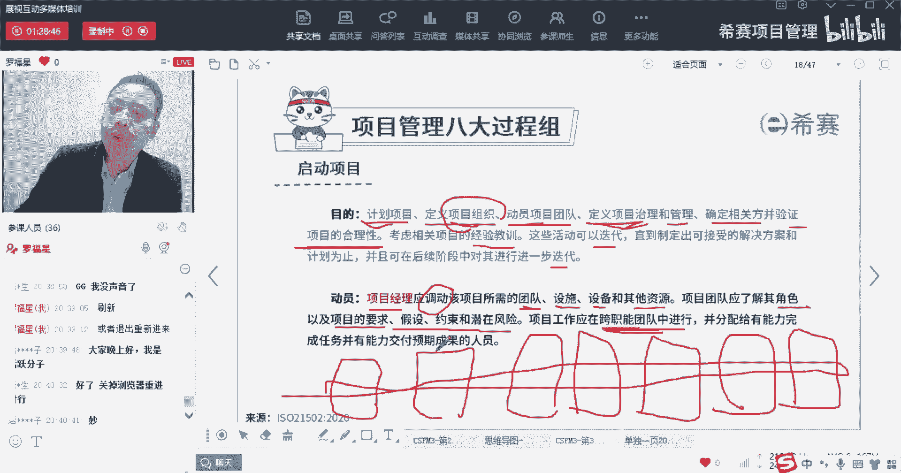

也就是说你要去挑选合适人员，你挑选的人员是能够做成这个事情的。

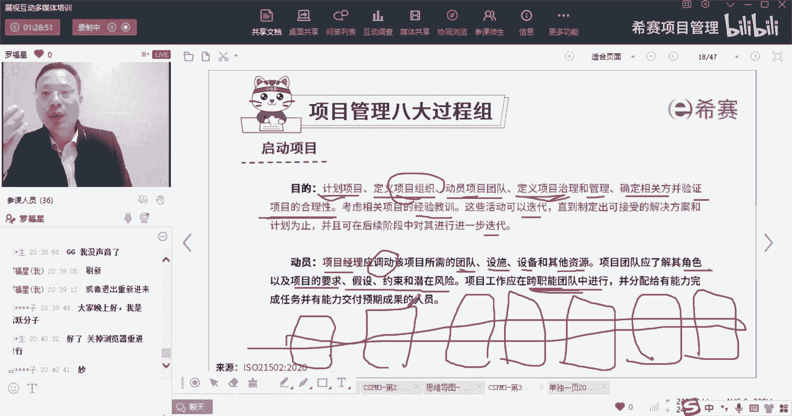

所以你要去得到各种资源，包括人包括设施设备材料以及其他资源，并且呢这些人这些资源，他应该是真的是能够让你做成这个项目。

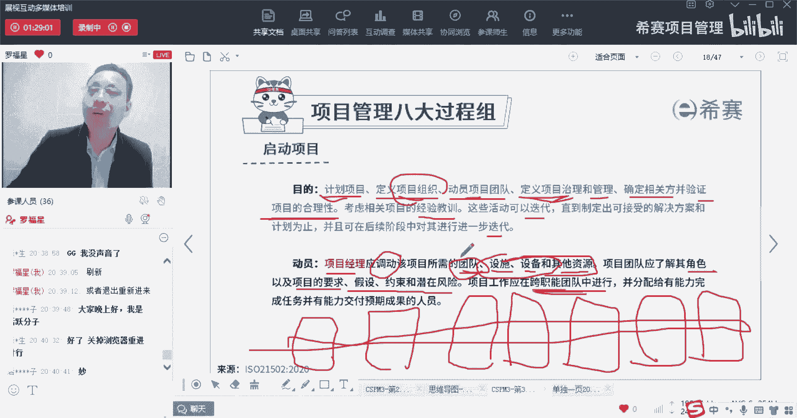

这是启动的第一个，第二个，你在做启动的时候，他用的什么方法，他说是定义治理，治理我们就是搭框架对吧，好管理的框架控制措施，其实也就是大领导们干的那些事情，你要去辅助他去干。

并与要完成工作以及预期复杂程度相匹配相称，其实也就是我们这个治理方式，这个框架方式，如果你做的事情本身是一个很简单的事情，你就不要搞得那么那么洋洋洒洒一大堆，如果这个事情本身很复杂。

那你可能你的治理框架也可能会更复杂，所以它都是由一个叫match相匹配，项目经理应该与项目发起人去协商的情况下，来确定启动指导监督控制关闭项目的方式。

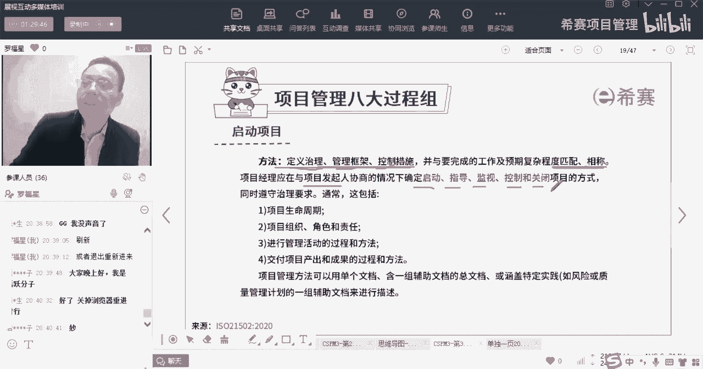

也就是说你们两个是你要去跟他汇报，你要去对他负责，然后他要去管理管控，你你要去向他去汇报，那么这些个节点这些启动的时候啊。

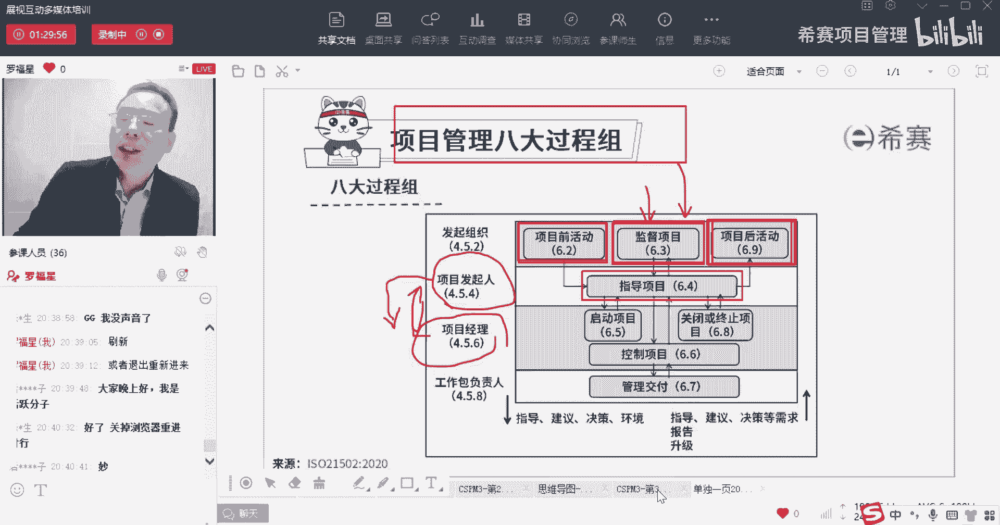

监督的指导监督啊什么的，各个环节都什么时候，用什么样的一种方式来去操作，来去进行，你们最好是协商达成共识才行啊，同时要遵守治理的要求，在满足治理的情况下，它这里面就包括生命周期，我们说用预测型。

用迭代型，用增量型哎，这都是属于治理的这个范畴啊，以及要遵循是说组织的角色职责啊，这些的也都是要去提前，就是按照这个要求来去进行，以及进行管理活动的过程和方法，那么这个过程和方法呢。

其实也就是说我们在怎么样去推进这个事情，会用到什么样的工具和方式，然后怎么样一种汇报的方式，这都是提前约定好的，这也都是属于治理的范围，还有最后一个就是交付产出和成果的，过程和方法。

也是做事情产生结果的过程方法，做事情的过程方法，这些都是属于治理的要求，那我们在做事情的时候，其实这些东西都要提前给约定好，项目管理方法可以用单个文件，可以用一些辅助性的文档的总文档。

或者是涵盖带特什么什么的，这些什么实践的一堆的文档来去进行哇，这里面其实讲的，也就是说是我们真正去启动项目的时候。

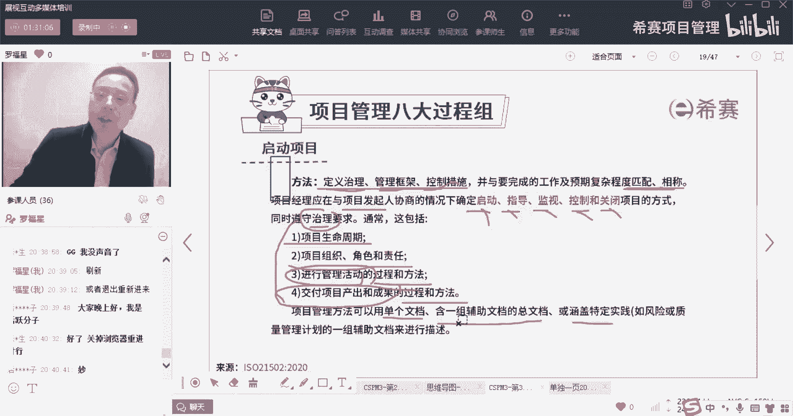

到底用到哪些东西来去做，你要跟大领导，跟那个发起人是相匹配相一致，去达成共识来去开展这些事情，开展的时候要去跟我们的治理，治理框架是保持一致，这里面就讲了这些治理框架。

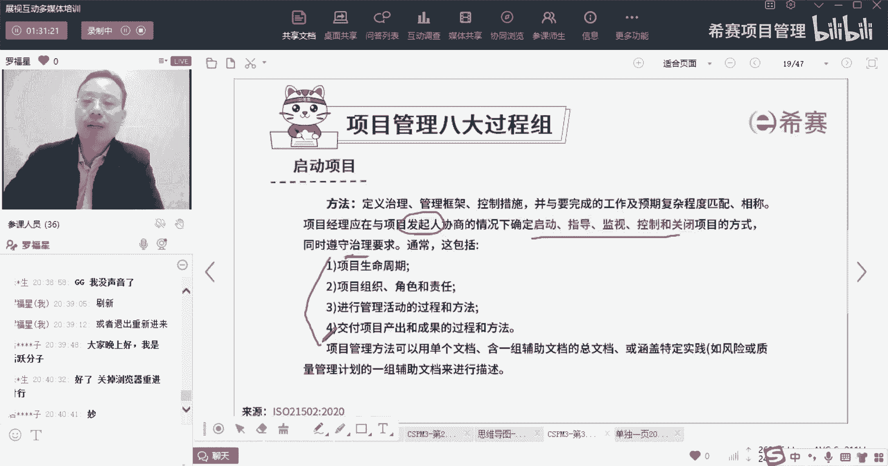

这是启动的第二条，第三条说在启动的过程中。

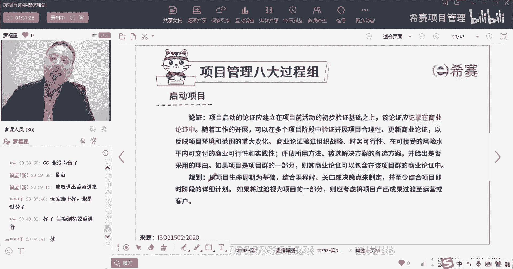

我们还有论证，其实我们在最最开始在项目前活动就在论证，我们在监督项目也在论证，而这个启动呢还在论证他论证什么。

他说项目启动的论证，应该是建立在项目前活动初步验证的基础上，也就是说项目前活动的时候，我们其实已经论证过了，而在这个时候呢，我们真正开始做的时候，我们还要再一次进行更深入的论证，那么事实上呢。

很多时候就是这两方的论证应该是同时进行的。

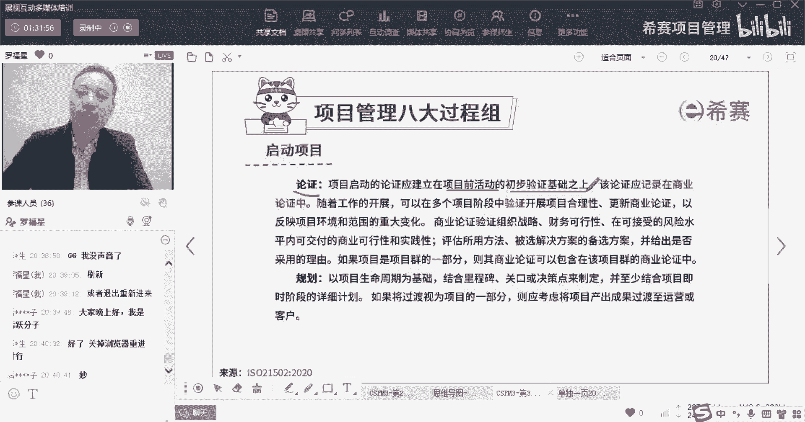

也就是你是他的小弟，OK你作为项目经理，你作为项目经理，你是其实在这个地方，你是一个小弟，你作为一个小弟，那么领导们他们在论证某些东西的时候，你要辅助做一些事情啊，你要辅助去一起同步去做这些事情。

同步去做这些事情，所以他们在做一些项目前活动，在做一些论证的时候，你其实也在论证嗯，就是关于经济的可行性啊，关于法律的可行性呢，关于技术的可行性呢，关于资源的可行性呢，领导们他不可能搞得那么细节。

知道那么具体，那么这些细节和具体的事情谁来搞呢，你你作为项目经理，你是领导的马仔，你来负责做事情。

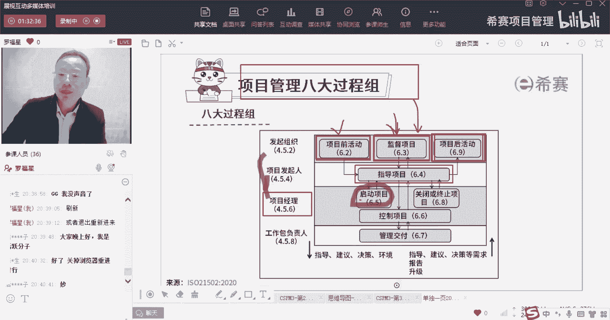

所以这是在项目前活动的这个，初步论证的基础上，你来进行论证，论证的东西记录在商业论证中，或者项目论证或业务论证中，随着工作的开展，可以在多个项目阶段中去验证，并开展合理性更新，商业论证。

其实也就是说商业论证具有可持续验证的过程，我们可能每一个阶段，都要对于商业论证来进行验证，来去看这个项目它是否依然值得去做，如果依然值得继续砸钱，继续做，如果不值得及时叫停，及时止损。

所以他讲的就是这么一个意思，他说通过这种方式，通过持续论证，来反映项目环境和范围的重大变化，如果说下面的环境和范围有重大变化的时候，那么有可能这个项目，其实就是该要叫停的时候了。

你们自己有没有做过那种项目，这个项目就完全变得面目全非，然后新一班新一波领导上上了以后，然后对这个项目的要求，跟原来内部领导的其实就完全不一致，他也许是不管不管不看不顾了，也许是替代很多新的要求。

都有可能导致这个事情其实就很难开展，就会变得很麻烦，对吧啊，欧总说正在经历中对，所以当有这种事情发生的时候，其实我们是要重新进行商业论证，重新进行验证的商业验证，商业论证来去验证组织的战略。

财务的可行性，可接受的风险水平内的这些交付商业的交付，商业的可行性，还有实践性评估，用了什么方法被选中，解决方法的这些备选的方案，以及给出是否采用的理由是什么，如果项目是群里面的一部分。

那么他要跟那个项目群的相应论证，是保持一致啊，这些话其实也就是还是来来回，把那个商业论证展开来讲，就是你的财务可行性啊，技术可行性呢，资源可行性呢啊，风险可行性的社会可行性呢等等。

从多个维度来去判断来去考量，这东西是值得做的，是可以做的，并且如果这个项目，它是属于项目群里面的一部分，或者是项目组合里面的一部分，那咱们这个项目的商业论证，它应该是包含在整个项目群的商业论证中。

或者包含在整个项目组合的商业论证中，讲的是这么回事，好这里还有一个词叫规划，以项目生命周期为基础，来结合里程碑关口决策点来去制定一个规划，并至少要结合项目及时阶段的详细计划，如果将过渡视为项目的一部分。

那么应该要将项目产物的成果过渡至运营英语，到客户，什么意思呢，这句话不知道你读了没读完，就感觉好像有点读不通对吧，你仔细去看，其实他是这个意思，就是我们去做一个项目的计划，我们要初步的去做一个项目计划。

以项目生命周期为基础来去做计划，这个计划中要综合考虑到这些什么里程碑节点，你什么叫里程碑，就是重要的时间节点对吧，比方说诶我们啊已经戴上红领巾了，这是我人生的一个里程碑节点，我带上团徽了。

是一个里程碑节点啊，这是一个里程碑节点，我大学毕业了，这是一个里程碑节点，我找到女朋友了，脱单了，这是一个里程碑节点，我结婚了，这是已经已婚人士，又是一个里程碑节点。

那么咱们在做项目的时候也有很多里程碑对吧，他说要去结合这些里程碑以及关口，关口这个词，我们前面已经解释过关口就是关卡对吧，一个阶段中间就会有一个关卡，又一个阶段中间有一个关卡，又一个阶段对吧。

关卡这个关卡其实就是决策点啊，好，它是结合里程碑和关卡来去制定，制定一个项目计划，而项目计划呢，他说并至少结合项目及时阶段的详细信息，这什么意思，这不就是你之前所学过的，一个叫滚动式规划的意思吗。

兄弟们，滚动式规划的意思就是你把最近要做的事情对，其实那个小小学小小小董小董说的就是对的啊，其实就是当前的最新的阶段，此时此刻正在做的事情，此时此刻马上要做的东西，我们应该是要有一个相对比较详细的规划。

未来远期的呢我可以暂时先不管它，但是我当下要做的事情，我要做一个详细的计划，所以这句话就是治疗结合项目及时阶段，就是此时阶段的这个东西，并且呢按照滚动式规划的方式来去开展的话，对那个西餐用户。

这位这位小伙伴给的很很好啊，就是渐进明细的这种方式来做事情，同时它后面这一句又是什么呢，他说我们在做这个计划的时候啊，如果把过渡阶段也是作为项目的一部分，因为我们说是做完项目，还要把它移交给运营团队。

对不对，他如果说把中间的这个移交这一段，也当做项目的一部分，那么也要把这个移交这个部分也给考虑进来，所以要考虑将项目产出成果过渡到运营或客户，这一段，也都是作为你的规划里的一部分。

都是这个项目中的一部分。

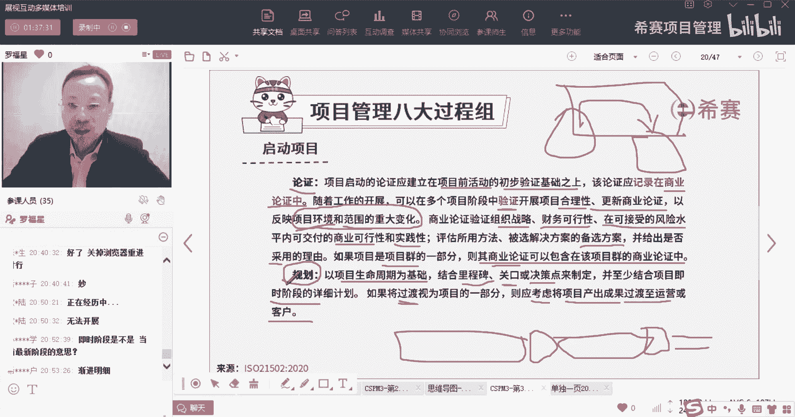

就是启动，那么整个启动公主，其实你会发现，他其实还是相当于领导在干的事情，只是说领导要干的这些事情呢，谁来负责去替他捉刀呢，谁来去替他做做他的枪手呢，项目经理，项目经理，你做一个小马仔。

你去替领导做枪手。

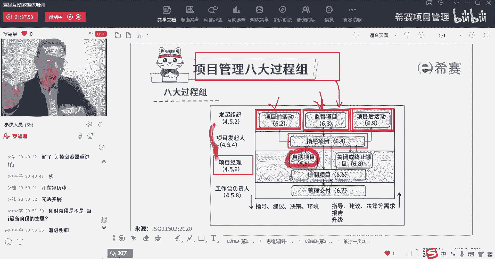