# 【收藏】CSPM-3中级项目管理认证考试直播课精讲视频合集（零基础入门系统教程）！ - P33：CSPM长空3-22八大过程组之控制项目 - 希赛项目管理 - BV16p42197SH

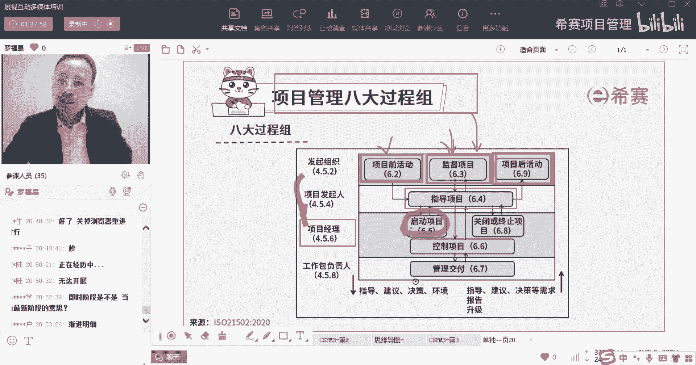

接下来下一个过程叫控制项目，控制项目也就是来到这一个过程，来到6。6控制项目，那控制项目它是要干什么事情，你看控制项目，首先他已经明确告亮出是谁的事情，是谁的活，是项目经理的活。

项目经理以项目管理计划作为基础来去兼，是项目的绩效去测量和衡量项目的绩效，在设计开发活动可交付成果的时候，去得到一些详细信息，并且根据这些什么什么需要，来去反映一些全变啊变更，所以它是什么意思。

其实也就是说是掌控这个项目的进展情况，如有如确实有需要，我们可以去走变更流程来做一些调整，就这个意思就是确保这个东西正常在进行，进行的过程中，如果确实有需要，我们也是可以去做一些调整，做一些变更。

做一些调整，OK这是控制项目，同时他给了一个叫渐进式的论证，什么叫渐进式论证，随着项目工作的开展，在项目多个阶段中进一步的开展，对项目的论证，在每一个关口或决策点，以确保项目继续进去之前。

与项目的发起人来协商更新商业论证，以反映项目的情况，所以这里面其实也就是还是在讲这个点，就是说我们在控制过程中，同时呢也要去给领导一些一些子弹，你要去给领导一些子弹，告诉领导，这个项目目前是OK的。

进展非常好的，OK一般就是这么一个意思，所以领导他如何才能够知道。

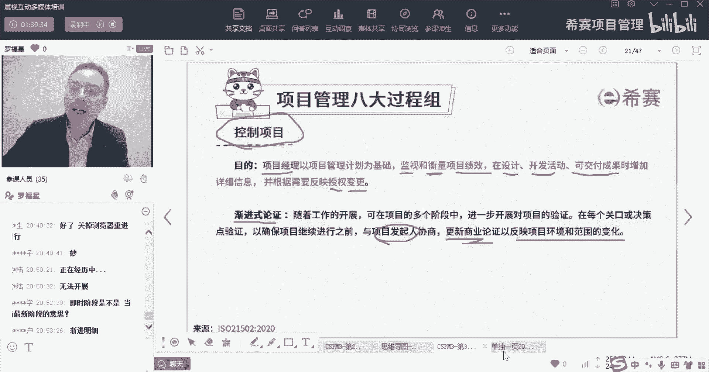

这个项目是值不值得去做呢，应该是由你去给他提供素材，你作为项目经理，你要去提供素材，你通过监控的方式让哦像个健健康情况非常好，但是如期在进行，他的这个目标应该也能够达成。

然后整个项目呢那大家也都是士气非常高昂，你把这些项目输送给他，你不是每个月要发阅读报告吗，对吧，你把阅读报告发给他的时候，哎他就拿着这个东西，他就能够知道哦，项目还不错，继续往里面砸钱。

如果你的阅读报告里面发现有问题，他说啊不行，这个项目就要去干掉了，正是因为这种原因，所以导致很多项目经理会有个什么习惯呢，叫报喜不报忧，就是项目经理，为什么大部分项目经理都是报喜不报忧，因为你一旦说啊。

这个项目不行，这个项目怎么能这么艰难啊，怎么搞啊，领导可能就说啊，那就不要做了，那就那就叫停对吧，就就有可能会停掉，还要把你给骂一顿，把你给批一顿，那为了能够不被挨骂，通常大部分时候呢我们都会说啊。

这个项目非常好，可以继续往里面砸钱，可以继续做。

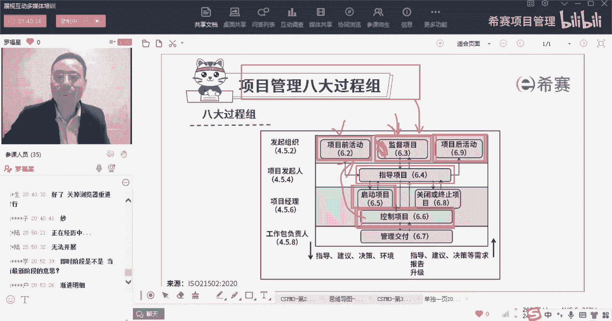

只要他没来看，你都一直说好，诶，经常有这种情况，会有这种情况的发生。

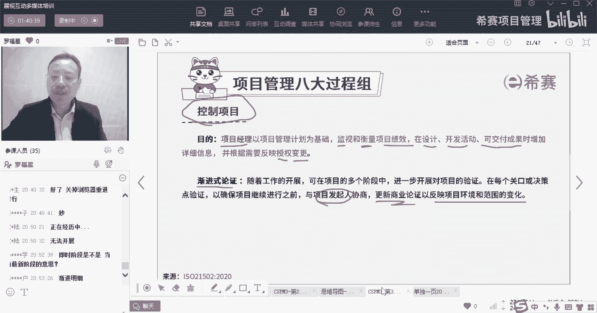

这12位认识一下控制过程的这个渐进式，那么整个在控制过程中还会有一个叫管理绩效。

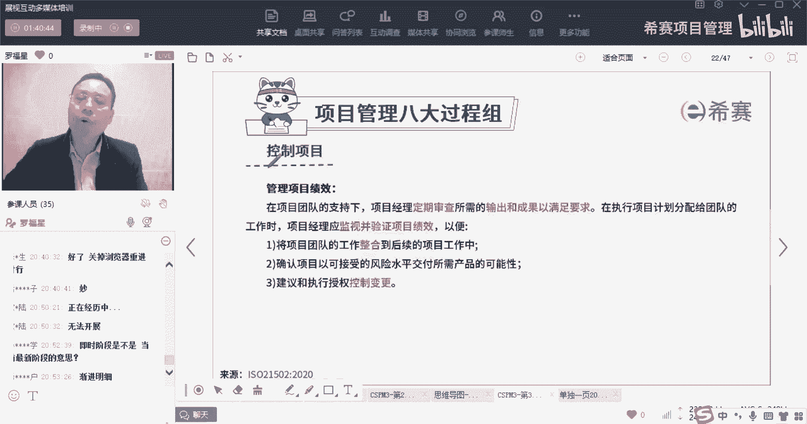

我们看一下都有什么管理绩效，以及去收集这些精英。

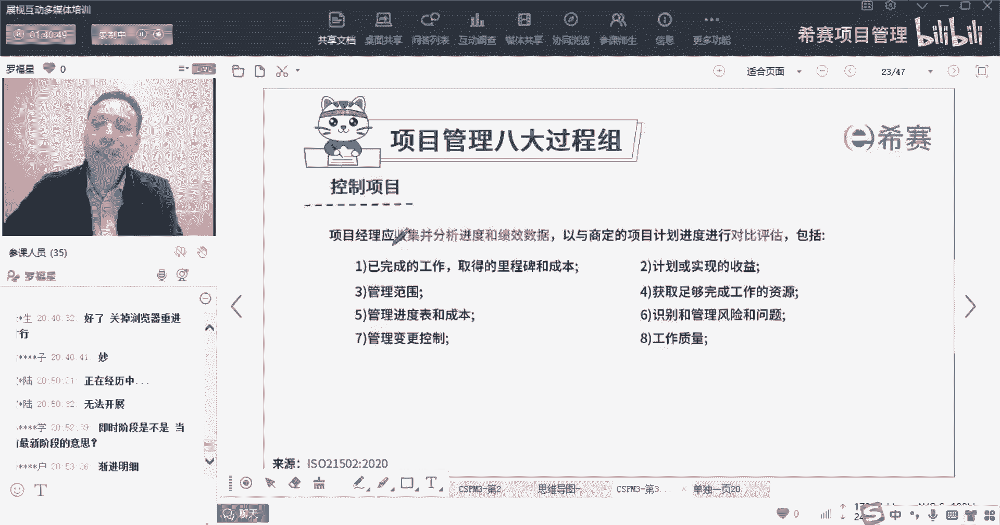

收集这些什么属性的数据做比对，然后以正面做比对又讲的比较多啊。

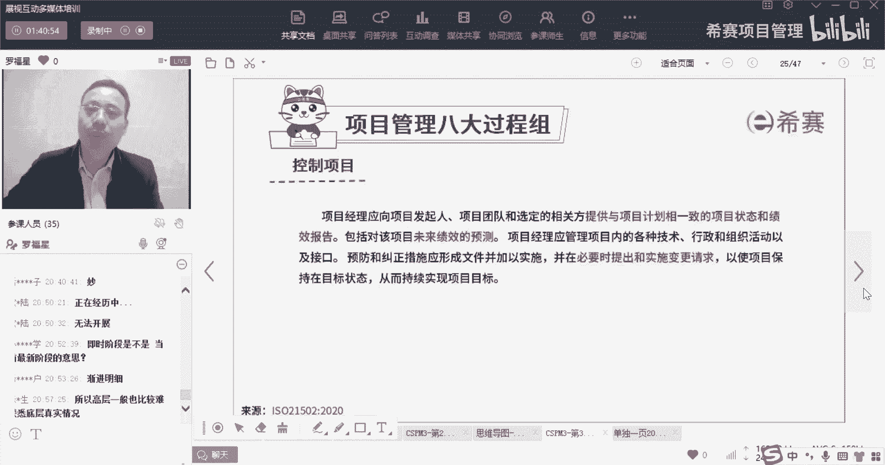

以及包括说进行绩效报告等事情，还有还有说是管理收尾哇。

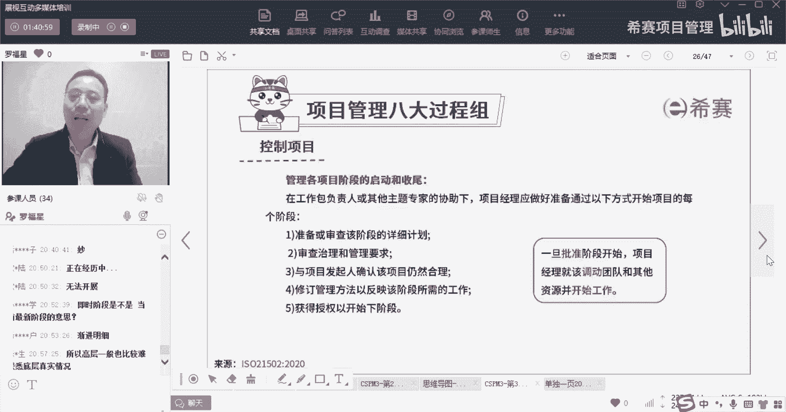

控制的还挺多的啊，我们来看一下。

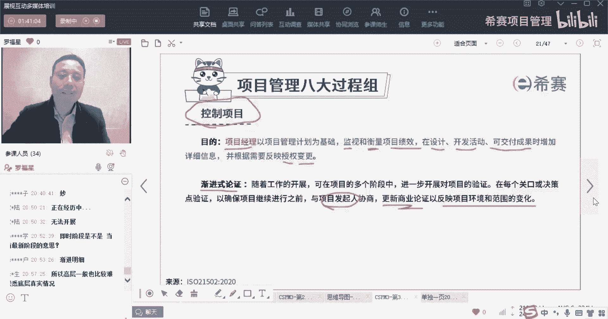

对张总，你说的很对啊，是的，他其实有的时候并不太清楚底下的真实情况，尤其是像有一些人很会说的时候，很会汇报，他总是能够把这东西搞得像花一样的时候，他真的是可以去蒙蔽蒙蔽大家，对你你呃最近还在听一本书。

就是樊登讲书里面讲的一本书，叫什么叫气长安，去长安那本书里面讲到说是那个那个嗯唐明皇，唐明皇，他那么相信那个安禄山，他觉得安禄山一定不会反谁在说安禄山的坏话，我就把他送到安禄山的手下去。

哎其实就是这么一个道理，他都说那个安禄山B不会反，他说我我我这么带他，他肯定不会犯，那是那是这个意思，你你哎呀就是怎么讲呢，就是有的时候人容易产生一种幻觉，觉得自己英明神武，自己做的角色特别好。

大家都在配合，我都是一个笑脸相迎，这个事情都开展了，如沐春风，都会有这种情况对吧，所以有的时候真的是其实也很难，就像你们说的人说，如果领导下来，底下人就开始配合你演出对吧，就开始做准备，做PPT。

又开始做做包装啊，也会有这种情形，也会有这种情形，但是呢有人说过说什么，不要假装很努力，结果不会陪你演戏，最终的最终其实还是会还是会捅出窟窿来的好。

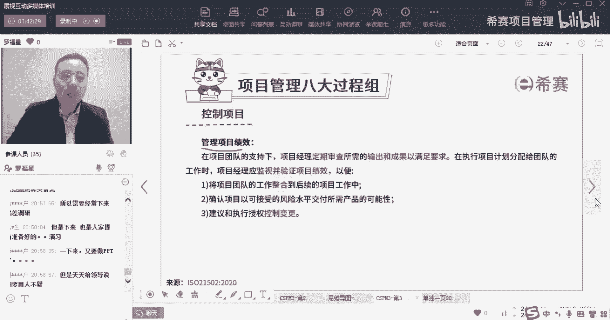

我们再继续往下面看啊，那么控制首先呃控制项目中，他就是会你需要去知道这个项目的一些情况，然后去给领导去汇报对吧。

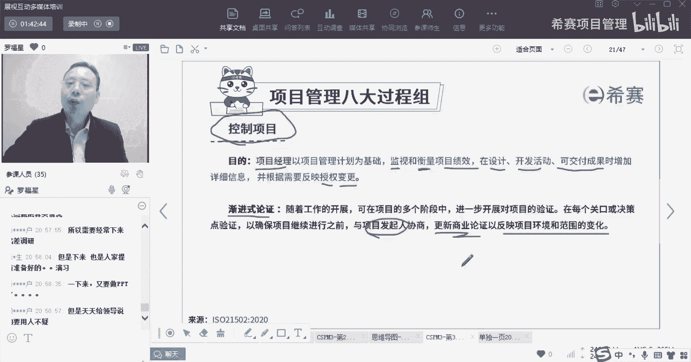

那么这里有一个叫管理项目的绩效，你作为项目经理，你要管理项目绩效，他讲的是什么意思呢，在项目团队的支持下，项目一定要定期去审查所需的这些输出啊，成果呀，看看是不是满足要求好。

在执行项目计划分配给团队的工作的时候呢，项目经理还要去监视并去验证项目的绩效，从而能够去把这些东西，把这些团队工作整合到后续的工作里面来啊，确认项目以可接受的风险水平来去交付，所需要的产品的可能性。

以及建议执行和授权这些变更啊，这句话简单来解释，也就是说我们要定期去审查这个项目，进行那个那个那个成果情况，你自己先过关，你过关了以后，领导才能过关，或者客户才能过关，你要是都不能过关。

那么领导是不会过关的，客户也是不会过关的，还有呢就是如果有必要的话，我们是可以去走变更请求来去做事情，目前所有东西它都是在我的风险可控，水平之内去完成的。

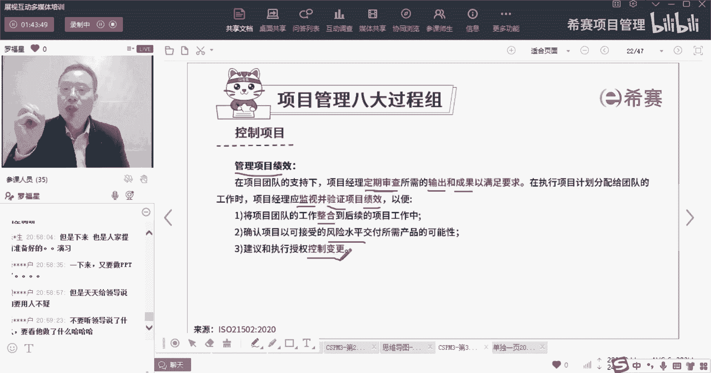

OK诶这是去执行这个项目的绩效，去管理项目的绩效，还有一个说是项目经理应该要去收集这些，如何去执行绩效，你要去收集这些绩效数据，并分析这些进度和绩效数据，绩效这个词我之前在别的课程中有讲过，绩效这个词。

我们说KPIKPIP是吗，叫performance，performance叫绩效对吧，performance它的还有一个翻译，我们用一个简单的小的时候学过的英语。

就是你在初中高中的时候学英语的翻译叫什么，performance的翻译叫表现，对不对，表现情况诶，你的表现非常好，表现的非常棒，所以这个绩效其实也是表现啊，那么所以这个表现情况怎么样呢。

就是进度有没有进展啊，啊成本有没有超支啊，然后那个那个那个资源有没有怎么怎么样呢，类似这样一个情况，他说与商店的这些计划来进行比对来去评估，包括已经完成的工作，已经达到里程碑节点。

然后计划要完成的这些东西啊，要实现这个收益，然后我们的范围，我们的资源，我们这些进度表，我们的成本，我们的风险问题还有变更，控制工作质量，其实也就是说我们要去收集大量的信息，并且呢要拿这些大量的信息。

来跟你的规划做比对，跟你那个跟你计划做比对，这就是什么，这不就是我们在之前偏僻中取得了一个，监督与控制对吧，监控过程组监控监控，他就是拿实际执行的结果，和你所计划的这些东西来进行比对。

一比对以后你会发现什么有偏差，那么就需要去做偏差分析，对不对，要做偏差分析，同时呢我们还要知道像这样一个片子，它未来会变得越来越好还是越来越差，我们还要做趋势的分析，做趋势分析。

同时我们为什么会产生这个偏差，以及为什么会变得越来越糟糕或者越来越好，我们还要做根本原因分析，要做根本原因分析，对不对，偏差分析趋势分析，根本原因分析，而这都是你在做监督控制。

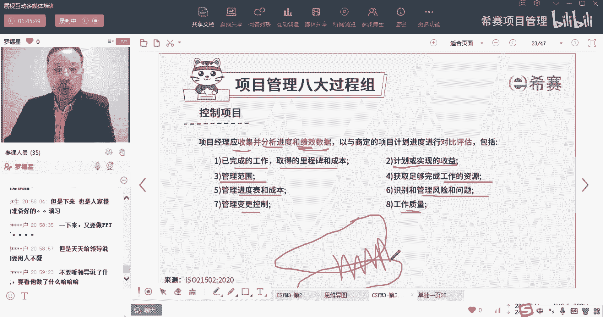

你在做控制的时候需要去干的事情，好好后面还有一些别的啊，管理项目的这些什么，他说管理项目输出到发起组织或者客户的过渡，那如果说把过渡也是包含在项目中的话，这个部分也是要的啊。

并且为社会的组织变革来做好准备，就是如果说我们这个项目中的目标中之一，就是做变革，变革是什么概念呢，原有的方式已经不管用，不实用，我才会考虑到变革对吧，那么如果有必要的话，我们要变革的话。

要去把这个变革的东西都提前准备，好好作进度报告，保持信息和文件的完整和可用性，管理这些什么采购的部分，就有一些东西，如果不是我亲自做的，我可能去采购这些零部件，哪采购的一些组成部分呢。

那么这个采购也要去管理好，以及总结新汲取的经验和教训，所以你会发现这些监控，其实就是你之前所看到的是一模一样的啊，是一模一样的，它稍微多加一点什么什么过渡啊，组织啊其实是一回事。

如果说把过渡作为我们项目里面的一部分。

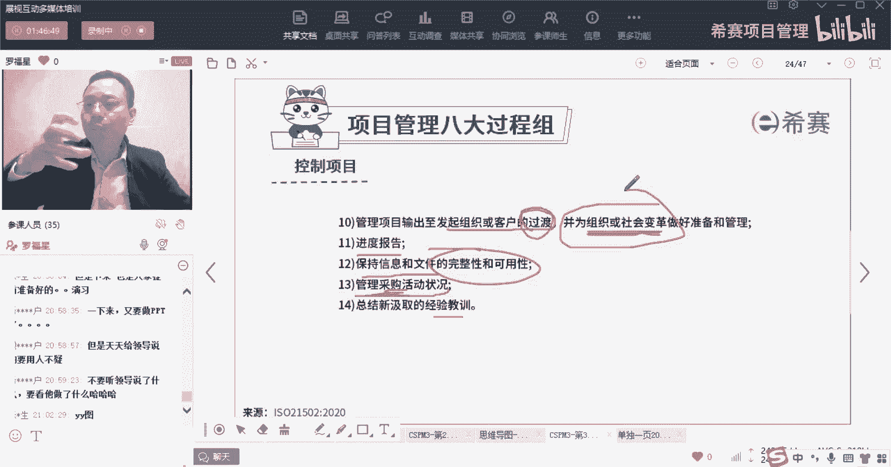

它就是隶属于其中，然后整个控制项目经理要向发起人，向团队以及选定的相关方，来提供与计划相一致的这种状态和绩效报告，也就是说你要去分发出这个绩效报告，是不是你要去分发出这个绩效报告。

同时你会发现这个状态和绩效报告是什么，是跟你的计划相一致的，我这不就是说，一般情况下应该都是说进展的还蛮好的，还挺好的对吧，老板一问，你说嗯还不错，还挺好的，就这个意思，同时呢还要对未来进行预测。

这不就是趋势分析吗，包括对未来进行预测，现在的相一致，其实就是进行这个偏差分析啊，这个未来绩效预测就是做趋势分析，项目经理应该要去管理项目类的这各种技术，行政和组织活动以及接口。

也就是说各种事情都都归你管啊，预防和纠正那种什么啊，预防和纠正措施应该要形成一些文件以再实施，也就是说关于这种预防措施也好，纠正措施也好，有变更走流程也好，你都要需要有一个有一个铭文来去确定。

有一个流程按照流程去落实，而不是水性和随意的方式，在必要的时候要去提出变更请求，去实施变更请求，按照有变更走流程的方式来进行，通过这种方式，以确保项目的状态是一直在你的可控状态之内，才可以持续进行。

所以整个监控其实也就是，拿了一个实际执行的情况，和你所规划的情况进行偏差分析，进行趋势分析，进行根本原因分析，然后进行汇报。

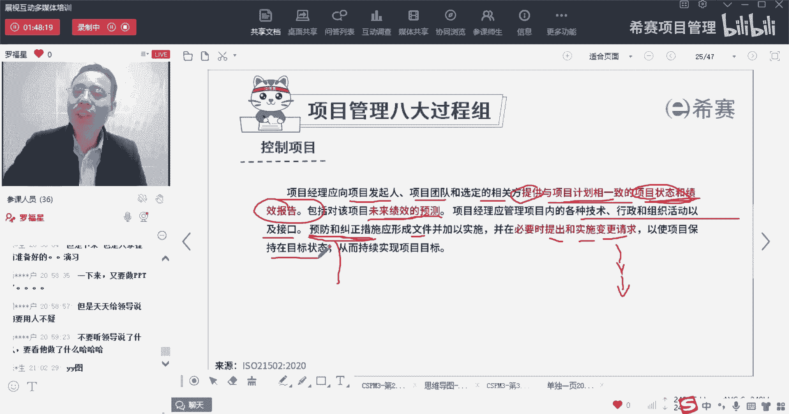

进行报告，以及是必要的时候呢，唉来去有变更，走流程好，这是控制阶段，它它它是同时控制阶段中，还有一个叫这个控制阶段中管理各个阶段。

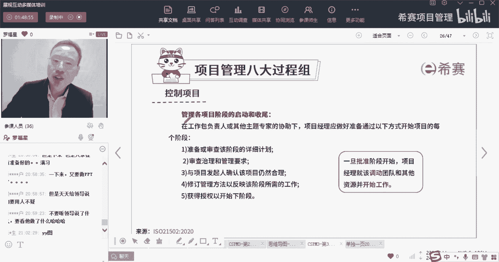

它的那个启动和收尾，其实也就是说我们这个东西，如果说是如果说A看快要结束的话，我们要对那个快要结束做好准备，你做好准备以后，再进到下一个叫关闭和终止项目对吧，也就是说你要做好准备。

那么这个做好准备的部分，也是属于控制项目这个这个阶段。

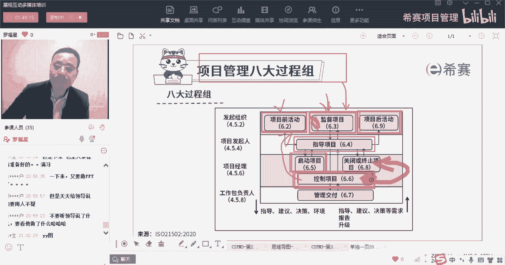

或者是这个过程中，他讲的是怎么回事，他说在工作包负责人。

或者是其他的那个主题专家的协助下，这也是底下的人去支持，对不对。

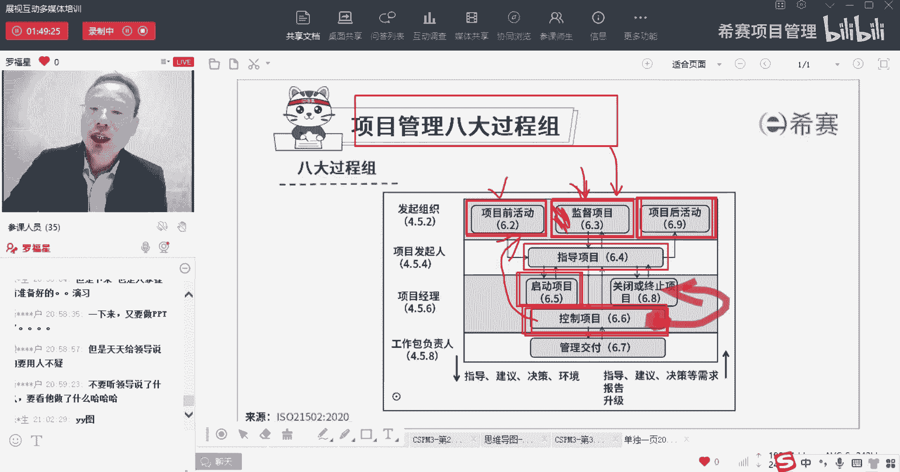

底下的人去支持去执行啊，在他们这个协助之下，你应该要去做好准备，通过以下的方式来去开展项目的每一个阶段，其实尤其是下一个阶段，那么这一个阶段的结束呢，你要去准备好阶段的一个审查报告啊。

然后就去呃审查这个管理的要求与发行，去确认这个项目是合理的，修订这些管理方法，反映这个阶段的一些工作，授权下一个阶段开始，所以其实都是在做某一个阶段的结束，一旦批准阶段结束，一段一段批准阶段开始以后呢。

项目经理就应该调动他的团队和各种资源，去开始工作。

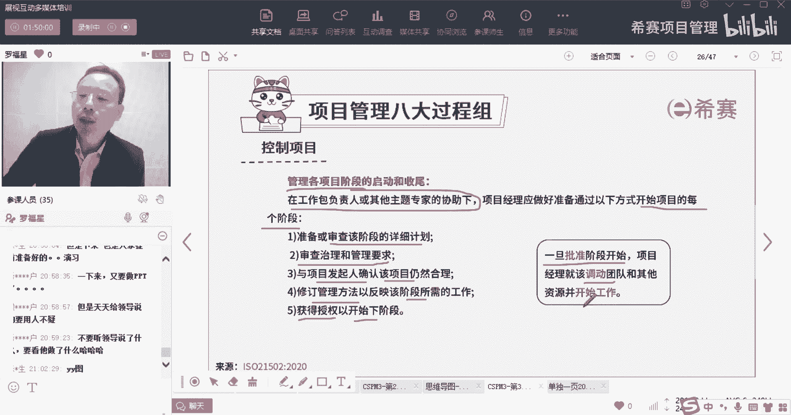

所以也就是说我们在做事情的时候，只要启动了以后，这个就开始做起来，那么如果你要去结束这个阶段呢，你要先做做好准备了，类似这个意思啊。

做好准备了，这是项目经理干的第二个事情叫控制项目，那接下来我们有一道题目来看一下。

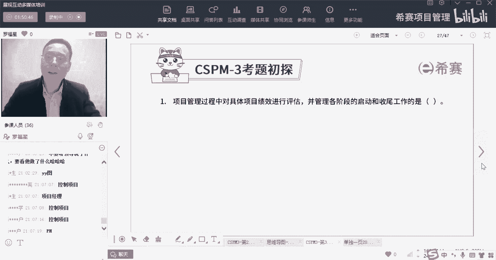

其实这个题目呢感觉两个选项都可以，是不是感觉好像选项目经理也可以，选那个控制项目也可以，是不是啊啊我我没有给选项，因为我是把这个题目把它拔高了一点，拔拔了一点难度啊，上了一点点难度，因为这样的话。

你你到时候真正在考试的时候变得更容易，OK啊，他的选项里面肯定就不会有这两个啊，不会有项目经理和那个什么控制项目，这两个东西他可能就是项目经理发起人嗯，还有那个什么交付经理等等。

把这几个东西来去做选择的话呢，你就选项目经理，他就是在项目管理过程中，对于具体的项目绩效进行评估，对于管理和各个阶段的活动，启动和收尾工作的管理，社会工作者是谁呢，是项目经理好。

那么如果他说的是说哪一个，哪一个过程组来负责去做这个事情，他的选项如果说选的是控制项目启动项目，然后是那个嗯，比方说是啊，还有监督项目收尾项目什么什么之类的，那么这个呢就选控制项目。

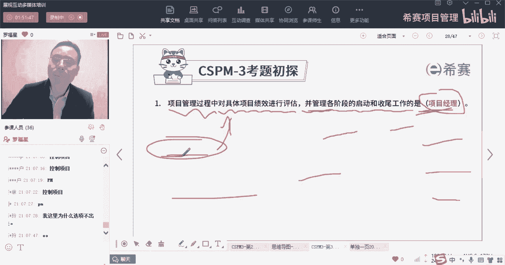

所以你要看他怎么选啊，它事实上呢这这个项目经理以及控制项目，都是刚好是应对了这一句话，都是应对这一句话好。

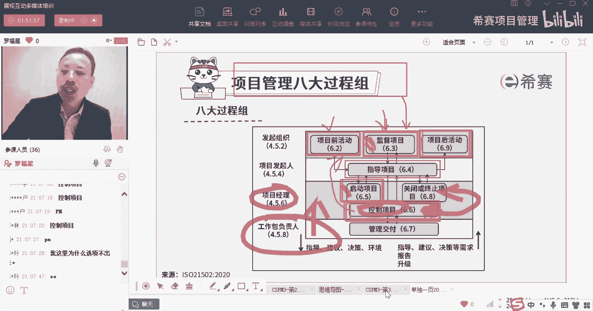

我们再往下面走，控制项目，他说项目经理应该通过，包括但是不限于以下内容，来去确认每个项目的完成。

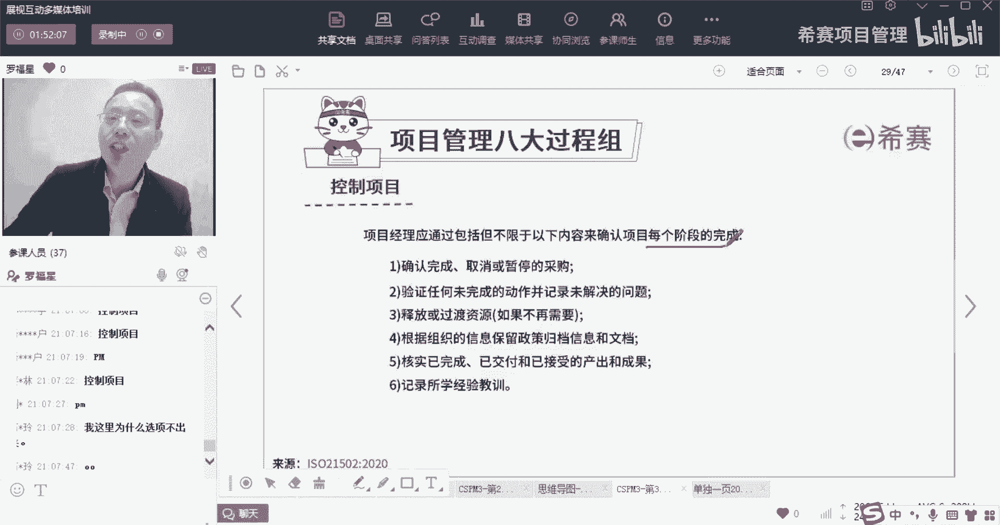

也就是我们要对完成来去做一个准备性的工作，对于后面这个收尾关闭或种项目的这个东西。

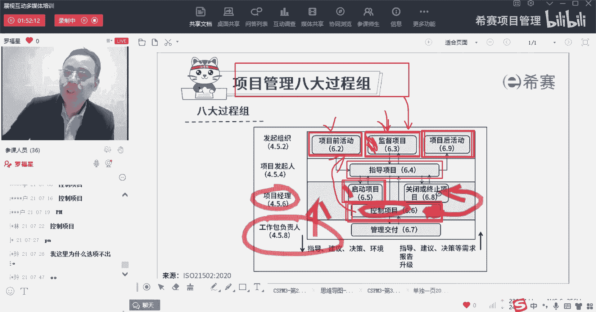

来做一个准备性的工作，干什么，确认完成了啊，采购确认，取消采购或暂停采购验证，任何没有完成动作记录，原因记录没有解决的这些问题，然后释放掉对应的资源，然后以及根据下面的这种情况去保留各种什么，什么文档。

核实已经完成的，已经交付了，已经接受了这种产出记录经验教训啊，这些点其实你会发现这好像是什么。

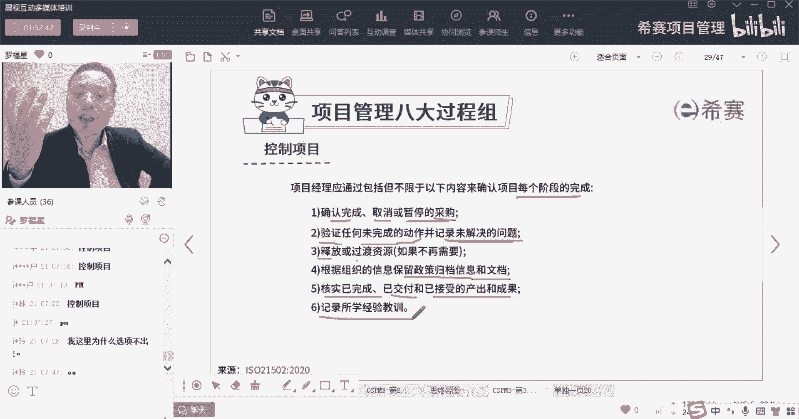

好像是我们在结束项目或阶段的时候，所学的东西对吧，所以你你感觉到它像什么呢，他就说是为后面为最终要做那些个收尾的时候，做了各种准备工作对吧，做了各种准备工作呃，小小小小小。

某学同学说是对光的包的收尾来理解，其实这个还不是这个就说他本意是什么呢。

它的本意应该是说为后面的这个东西做准备，为后面的关闭和停止项目来去做准备。

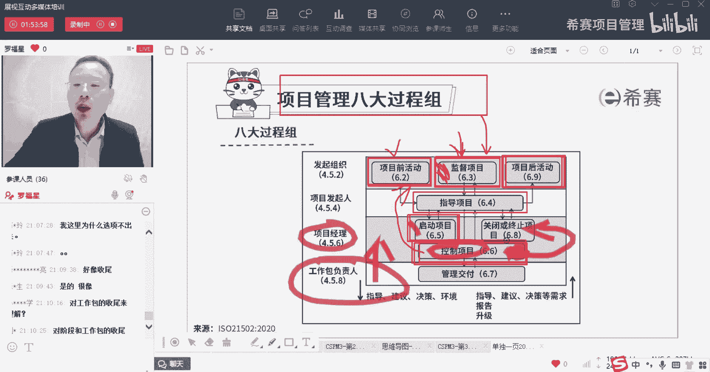

应该是这个意思，我们到时候再看了以后，我再给你做确认的信息好不好，看了再做确认信息，这个看起来很像是收尾的意思在里面好。

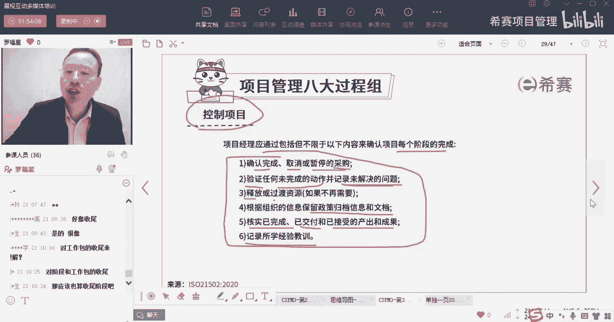

同时他说控制项目中，管理每一个工作包的启动进度和收尾，哎这一句它就是完整的，他就说管理关于工作包的启动进度和收尾，你要去通过各种方式来去监督工作包什么呢，它是每一个工作包在什么什么情况下啊。

去试能够去完成，把它进行整合，然后去验证去批准，然后说工作包的这些东西，他说是确保这些计划和工作包之间的计划，他们之间应该是满足某种要求的，工作包的负责人，你要给他去分配啊。

你要给每个工作包分配对应的工作人员，分配这个工作包的负责人要去启动这些工作包，要去验证这个工作的进展情况，就是这个工作包的进展情况，是在风险之内来进行的，要解决它的风险问题，解决他的问题，解决它的变更。

以及这些工作包应该是质量满足要求的，还有就是确认完成交付成果的交接，以及工作包的关闭，所以也就是说关于工作包本身，你从分配工作任务，然后去落实，去执行，去跟进，到最后的完成。

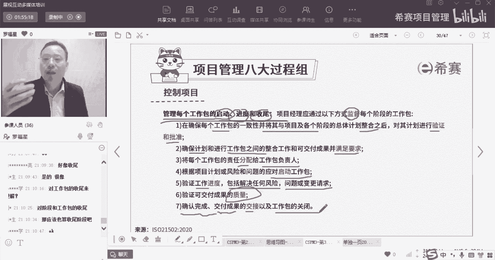