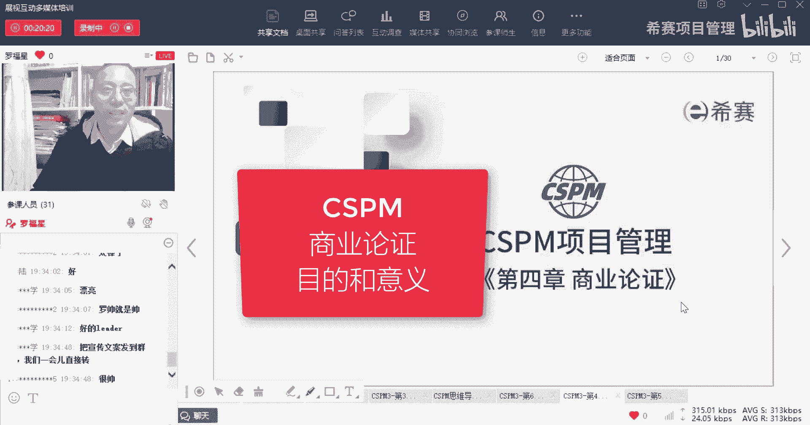
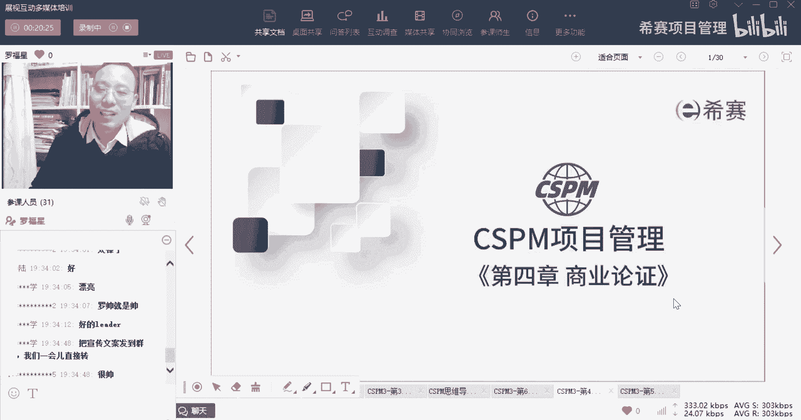
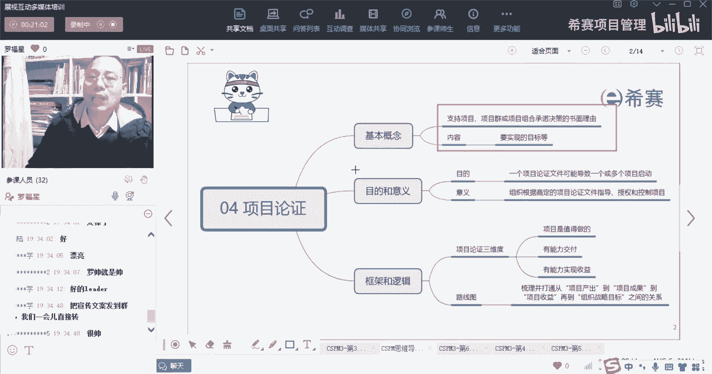
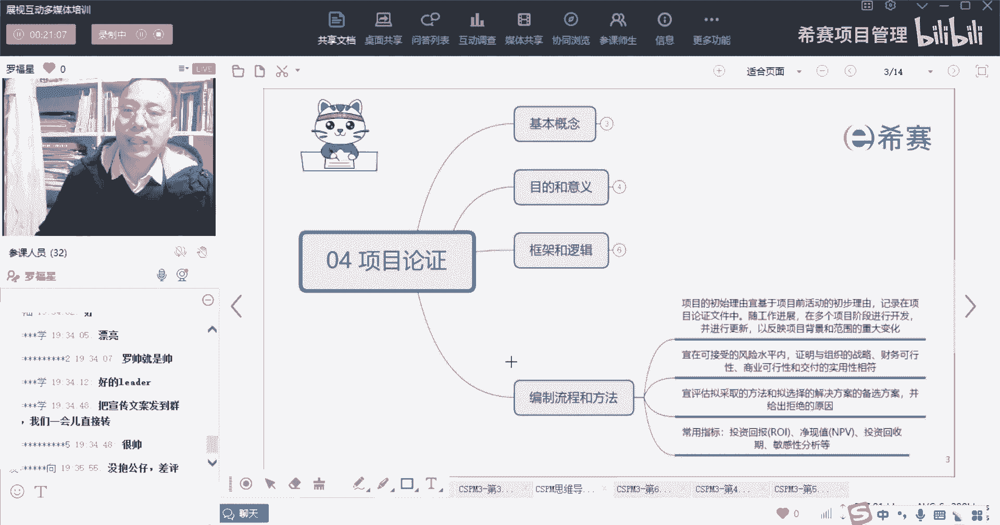
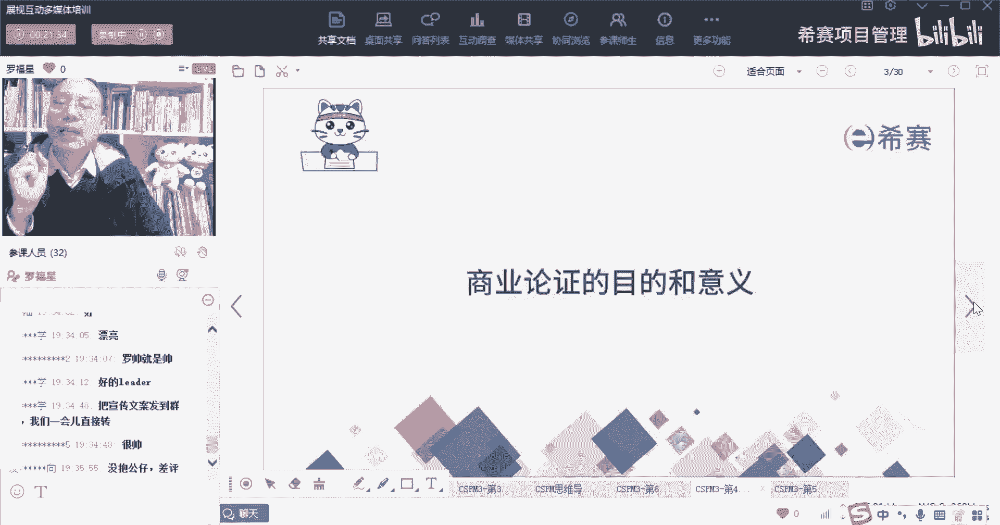
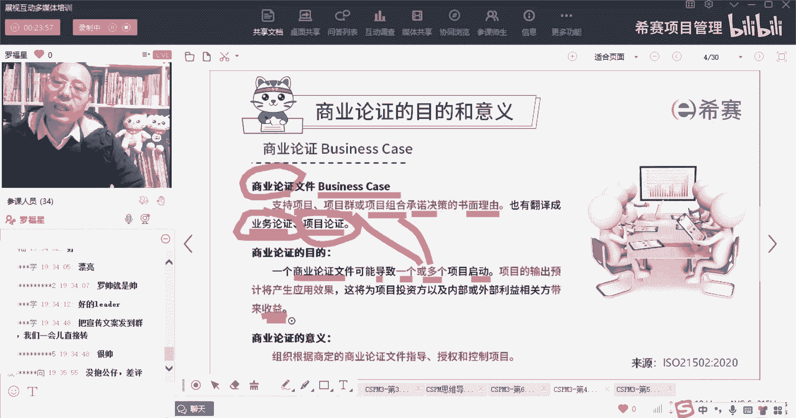
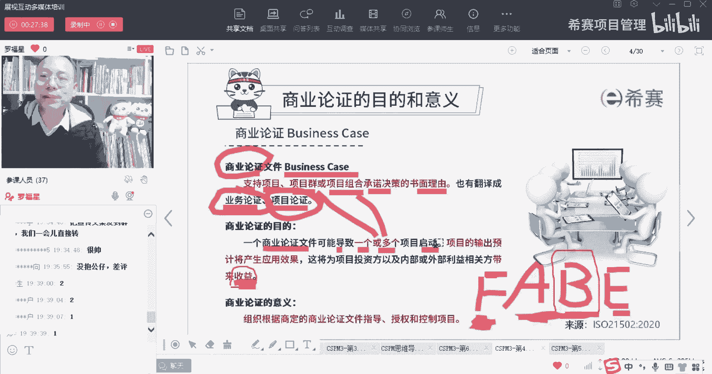

# 【收藏】CSPM-3中级项目管理认证考试直播课精讲视频合集（零基础入门系统教程）！ - P36：CSPM长空4-1商业论证的意义和目的 - 希赛项目管理 - BV16p42197SH

大家晚上好，欢迎来到西塞网专业的职业教育平台，我是罗福星，那今天晚上我们一起来分享的是第四章。

项目商业论证，整个关于商业论证呢，其实这个东西啊，你看你基本上就是能够搞得定会讲的，有四个内容，一个是关于商业论证，它的概念，当然商业论证呢也会把它翻译成叫业务论证，或者叫项目论证。

就是业务论证或项目论证说是同一个词，那么它的基本概念是什么，以及它的内容主要干什么，接下来就是它的目的和意义。

然后是它的建框架和逻辑，还有就是他的这些个编制项目。

论证的流程和方法，那首先我们一起来看到的是关于商业论证。

它的目的和意义，什么是商业论证呢，其实商业论证它其实就是也叫业务论证，或者呢叫项目论证，它其实就是论证这个项目是值得做的，我们去论证这个东西是值得做，我可以去往里面去花钱。

所以它的官方的定义说是支持这个项目，项目群或是项目组合的这种承诺，决策的一个理由便是一个书面的理由，也就是我有一个理由来去做这个项目，来去支持这个项目，这是商业论证，所以他是去支持这个项目。

项目群或项目组合的一个呃，承诺决策的这一个理由，OK他翻译的不相同，有的时候叫业务论证，有的时候呢叫项目论证，它其实的英文就是叫business case，business case呃。

其实有人说最好的翻译应该是选，第二个叫业务论证，因为这个business它不一定是关于商业方面的，也可以说是说这个东西本身，它能够为我们带来什么样的价值和意义，那也有可能并不一定会是产生价值和意义。

但是就是觉得我要去开展什么事情，想要去做什么事情，所以他也可以叫业务论证，但我们在这个科目中，目前啊，我只是说，目前目前他把那个翻译的叫做项目论证，所以你要知道这三个词说的是同一个意思。

你以后看到了以后，他说的都是同一个意思，那商业论证或者业务论证它的目的是什么呢，他说一个商业论证文件，它可以导致一个或多个项目的启动，也就是说我的你的某一份商业论证，它能够同时论证了多件事情。

这多件事情可能是有相关的，也就是说它有可能会是一个叫项目群，或者是一个项目组合，那么一个项目群的话，它里面本身就包含多个小的项目，如果说是一个项目组合的话，他们就本本身就包含很多个子的项目。

所以一份商业论证文件，它可以去指导一个或多个项目的启动啊，你要记得啊，会考会考你的啊，然后呢项目的输出，他预计会产生应用的这些个效果，而这些效果他说这个将能够为项目投资方。

以及一些其他的一些利益相关方来带来收益，带来收益，带来收益叫什么呢，叫benefit，Benefit，你们可能听过一个词叫FAB。

是不是FAB讲的是什么呢，就是说我们去购买一个东西，我为什么去购买它呢，一方面是说这个东西，它本身有什么样的一些feature，feature说的是它的特质特性，它本身有什么样的future。

第一个词feature，然后呢关它光有这个特性，其实还不足以去影响我，想要让我去购买，所以还有第二个词叫A叫advantage，advantage说的是优势，你的这个产品有什么样的优势。

你的这个产品它对比别的产品而言，你有什么样的优势，这样的话可能就会让我更心动，但是你光有这个优势，其实也不一定会让我嗯就心动，比方说你说这里有一辆那个什么劳斯莱斯哇，他简直是太棒了，行吧行吧对吧。

它的引擎啊，他的这个后面的声音啊，他这个真皮沙发，确实比起别的车子真的是有很大的优势，但是我会购买吗，唉我其实也不一定会购买，为什么，因为我没有那么多钱，我也没有这个需要，那还有一个是什么呢。

真正会促使人购买的是一个叫benefit，就是能够给他带来这样一个价值和收益，到底能给他带什么，带来什么，比方说如果我真的是要经常要去谈业务，天天要去出去呃，跟一些重要的一些领导啊，或者是一些是个官员。

哪一些什么样的人去谈业务的话，那也许我需要一辆劳斯莱斯来取给我加持，是不是哎那个时候他就有需要了，所以有的时候你会发现一个东西它能否卖给谁，其实不光是说它有什么样的功能和特性。

也不是说它有什么优势和特点，而是说它真的能够为这个受众，带来什么样的好处，OK这才是能够促使他想要去购买的原因，当然了，我们一般一个产品你想要去卖给别人，除了说能够给他带来好处。

还有一个东西会去促进他购买，是什么呢，叫E还有一个E叫evidence证据，就是你有什么样的一些证据来证明真的，这个东西有好处，比方说你说这个劳斯莱斯有多么好，哎你发现王健林他也在看劳斯莱斯啊。

打个比方啊，我瞎说的啊，啊马云也在看劳斯莱斯，然后什么马化腾也在看莱斯劳斯莱斯，雷军也在开劳斯莱斯等等哦，你发现啊他们都在开，那你也需要有一辆，这样的话，你跟他们去在乌镇下面去做论坛啊。

去华山论剑的时候呀，你可以有那么一丝丝的机会，跟他之间是一个对等的这个关系，哎，所以就是他会通过一些比方说你要买一个牙膏，为什么要买这个牙膏啊，因为这个牙膏很好，它很好，在哪里啊。

唉它可以让你清洁口腔呢，还可以帮你去清除口臭啊，它还可以去帮你怎么怎么样对吧，还有一些这种feature有这样一个好处，但是它有什么不同，别的别的牙刷都有，别的牙膏都有这个特点。

关键是你的这个牙膏比别的东西不相同的地方，是它可以持续12小时，可以清洁口腔诶，这是你的一个优势，但是这还不是最重要，最重要是什么呢，最重要就是，你真正能够促使别人去购买某个东西。

一定是因为它能够给别人带来什么样的收，益和价值，那同样的我们一个老板，他之所以愿意去投资来做某一个项目，也是因为这个项目能够为这个企业带来，什么样的一些benefit带来一些收益，理解这个意思。

所以你要知道啊。

我们之所以有这个商业论证，也是因为在商业论证中就能够去论证，这个东西，真的是可以为这个内部的一些利益相关方，外部的利益相关方，尤其是这些金主爸爸们来带来一些benefit，带来一些收益。

OK这是商业论证，所以商业论证它是一个商业论证，可以可以导致一个项目的启动，或多个项目的启动，并且呢它一定是能够产生对应的一些效果，能够为某一些群体带来某些收益，还有就是商业论证它的意思是什么。

他说商业论证，你看组织，它会根据已经商量好的这个商业论证的文件，来去指导项目，来去授权项目，来去控制项目，所以商业论证，它也会是作为我们项目的一个治理的来源，是作为项目治理的一个来源。

OK这是都是在讲商业论证，其实在做商业论证的时候，我们的这个项目已经开始了，还是没有开始，兄弟们开始了敲个一没有开始敲一个啊，我们在做这个商业论证的时候，对还没有开始啊，兄弟们还没有开始。

因为他是要去论证这个项目值得做，他是去启动这个项目，所以这个项目这个时候还没有启动，还没开始的时候，咱们先去做这个商业论证，对他对特别棒啊，这是谁啊，西餐用户同学。

就是项目前活动的时候干的事情是还没有搞到。

