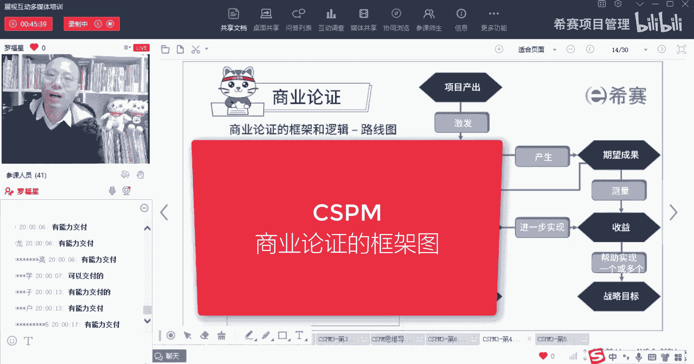

# 【收藏】CSPM-3中级项目管理认证考试直播课精讲视频合集（零基础入门系统教程）！ - P40：CSPM长空4-5商业论证的框架图 - 希赛项目管理 - BV16p42197SH

接下来我们来看一个商业论证的框架。

那整个商业论证框架它讲的是怎么回事呢，如果说你学过prince的话呢，你对这张图就比较熟，就比较有感觉，没有学过没关系，罗老师给你简单用，用那种通俗易懂的方式来给你解释。

这个图的意思就是我们通常去做项目呀，我们其实一定是有所图，对不对，我一定是会觉得说这个东西我做了以后呢，它能够给我产生什么东西，产生什么东西对吧，但它其实是有过程的，它的过程是这样的。

我们来看这样一张流程图，这个图叫流程图，流程图做的是做事情，第一步是什么，然后到下一步是什么，再到下一步是什么，定下一步下一步，OK这是流程步骤，流程首先呢会是我们这个项目有一些产出。

这个产出什么叫output，O u t output，Output，就是你能够做出一些什么什么东西来，有这个output，但是你会是基于什么理由才开展这个项目的，你一定会是基于社会有需要。

或者可能会是客户商业市场有需要，也可能会是因为公司企业有需要，当然也可能是这个项目要去更新，有需要等等一些原因才会去开展对吧，那么你最后做出了这个东西，它一定就会导致我们的这个情形。

情形发生一些些的调整和改变，这个调整和改变，他用了一个词叫商业变革或者业务变革，商业变革，业务变革这个地方其实用叫业务变革，可能会更好，但是因为我们的讲义，因为我们的官方给的讲义。

上面用的是用的这个商业变革，所以我没没去改它，业务变革是什么意思呢，变革其实他用了一个词叫change，change这个词它可大可小小的话呢，就是做一点点小小的变更，它也是change。

大大的一个是一个一个社会的变革，它也是一个change，那么这个业务的变革或商业变革，它讲的是什么回事呢，就是我之前可能没有这个东西，比方说你要去做一个ERP系统，我之前没有这个ERP系统。

你现在呢要做这样一个ERP系统对吧，那么这种方式嗯也是可以的，那么事实上呢我们会去做这样一个事情的话，首先第一个就是这个做的结果，他可能就会产生一些新的东西，比方说之前你是没有这样一个系统。

你现在做了一个系统出来，一定会导致我们发生一些变化，对不对，所以呢他就说像我们的产出本身，会激发一些业务变革，或者说计划一些所谓的叫商业变革，但这个变革你不要把它想的很大啊。

不要想着说我一定是搞一个惊天动地才叫变革，它其实就是一个词叫圈，你就是改变就是发生一些变化啊，那么这些变化呢，就有可能会产生一些你所期望的成果，就是能够去交付一些东西，比方说就是你修了一条路。

那路修完了以后呢，你就能够去开去通车，就可以去跑车，那么这个通车跑车这东西你可以，你就可以去测量，发现它能够帮大家节省多少时间哦，发现原来从城市的这一端跑到另一端，通常情况下呢是需要三个小时。

但是因为我们修了一条这样的一个，环城高速公路以后呢，可能会只要45分钟就可以搞完，所以我们会对于这个期望的这个成果，这个结果这个成果呢他用了一个词叫outcome，o u t com outcome好。

会产生一些outcome以后呢，我们还会去测量，看它到底能不能给带来带来什么样的收益，带来什么收益呢，比方说能够为每一个人节省两个小时的时间，这就是一个很大的一个收益，对不对，这是一个benefit。

这是一个b benefit，我就不挑了个字啊，Benefit，但是你说有没有可能，我们产生这条高速公路能够通车，然后能够能够顺利跑起来，有没有可能会有一些副作用，有没有可能有一些副作用啊，兄弟们。

这就导致空气更加浑浊，更加的这个地方更加的脏，更加肮脏，有没有可能，所以他有可能会导致扬尘啊，可能会导致噪声啊等等，是不是可能会有这样一些结果，那么这个结果会不会有些负收益，负收益是什么唉。

可能健康会受到影响啊，啊呼吸道的疾病啊，然后那个那个睡眠的衰衰减的等等，都有可能会有这种可能性啊，don也有可能某一些结果本身，它也可能会而产生这些收益也是有可能的。

或者收益呢也可能会产生这些负面的结果，都是有可能的，而事实上我们如果说产生收益，你会你会发现这个收益，它是不是就是你最开始所设定的收益，对不对，他是不是就是你最开始设定的收益，所以这些收益。

他就是帮助我们的企业去实现了这个目标，实现了我们的战略，目标战略呢叫strategy，战略呢其实说的是首先讲战略的时候，我们一定会先说一个大的词叫愿景，vision愿景，你有一个大的愿景以后。

你再有个战略目标去达到这个愿景，我5年之内要怎么样，我3年之内怎么样，我一年之内怎么样，我一个大的愿景以后，我有一个战略对吧，那么这些战略目标诶，你有战略目标，你基于战略目标，你就会去做项目。

做一个项目，两个项目，十个项目，八个项目，你会做这些项目，那么做这个项目的话，你会发现如果这个项目的产出，他最后得到这个成果，真正的产生收益的话，他是不是就能够更好的去辅助，我们这个战略目标的实现。

所以它能够帮助我们去实现，一个或多个战略目标，OK所以这张图大概是这么一回事，我们来稍微重新来给你捋一下啊，稍微捋一下，就是咱们做项目的时候会有一些项目的产出，而这些产出呢它会导致发生一些变一些变化。

你不要你觉得变革这个词如果太严肃的话，你想说一些变化啊，有一些变动，有些变化，这是业务的变化，比方说突然之间就多了一个楼，突然间多了一条路，突然之间就多了一个系统对吧，有些变化的产生。

而这些变化的产生呢，会导致一些你所期望的结果，比方说能够方便大家去发信息，收信息，发病了就跑的更快什么等等，而这些好处呢，这些成果呢他如果经过测量发现可测量的哎，就形成了一个所谓的收益。

真正能够产生多少收益是可以量化的，可以去测量的，但它也有可能会引发一些不好的事情发生，有些副作用，一些坏事情发生，那些坏作用呢可能会导致有负收益，所以你会发现哦，原来做项目它的收益呢有正向的收益。

还有负收益，有收益和负收益，同时呢项目收益它其实是在帮助我们的企业，去实现我们一个一个的战略目标，当然可以是实现一个战略目标，也可以是实现多个战略目标，OK那么这就是关于商业论证。

它的这个那个那个路线图，那么这个路线图他说当我们已经论证了，项目是在具备有一些投资理由的这个情况下，我们还要去思考的是我们怎么样去做，才能够实现项目的预期收益，那我们怎么样才能够实现预期收益呢。

哦原来是有步骤的，首先我们是要有一个产出，有一些output，然后有这些产出以后呢，哎我们会把它形成一个项目的成果，有一些outcome，而这些成果呢能够去为我们产生，一些对应的收益。

一些benefit，然而这些benefit能够为我们实现，这些组织的战略目标，叫object object战略目标，所以有这样一句话，他说我们需要去梳理并打通，从项目的产出到项目的成果，再到项目的收益。

再到组织战略目标，也就是从产出到到到到这个成果，到到成果，然后再到收益，然后再到战略目标啊。

有这样一个路径啊。