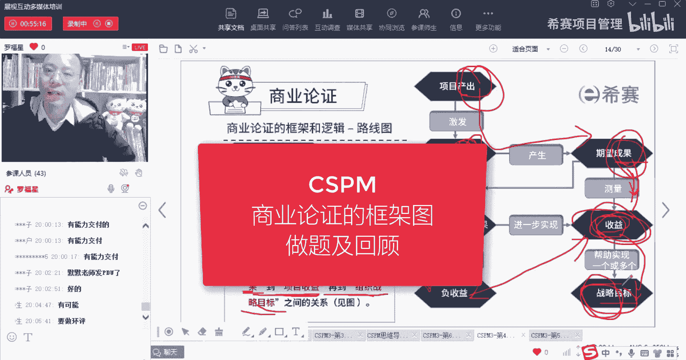

# 【收藏】CSPM-3中级项目管理认证考试直播课精讲视频合集（零基础入门系统教程）！ - P41：CSPM长空4-6商业论证的框架图做题及回顾 - 希赛项目管理 - BV16p42197SH

好我们来看题目，高总这个速度这么快，还有一串数字的一种，还有这种，OK所以呢他会讲到的是一个什么点呢，他说是商业论证的路线图，从这里面可以看到说，项目需要去梳理并打通从项目的产出，大项目的成果。

大项目的收益，然后再到实现组织的战略目标之间的关系，OK从梳理并打通项目产出到成果到收益，到实现组织战略目标的关系，那么这里这几个词你要稍微稍微留意一下哦，当然你不一定要记它，你稍微留意哦。

所以有产出叫output，你输出的东西呢啊，它成为一个成果，成为一个有用的东西，然后呢这东西能够量化的去衡量它的价值啊，这是收益，它最终会产生我们这个叫战略的目标。

给了一个词叫object object，好，我们来看一下，所以首先商业论证它是从三个维度来进行，一个是项目值得做，我们有能力去做，并且呢这东西是最终能够实现收益，能够产生收益啊。

还有就是项目路线图是要梳理并打通，从项目的产出到项目的成果到项目的收益。

