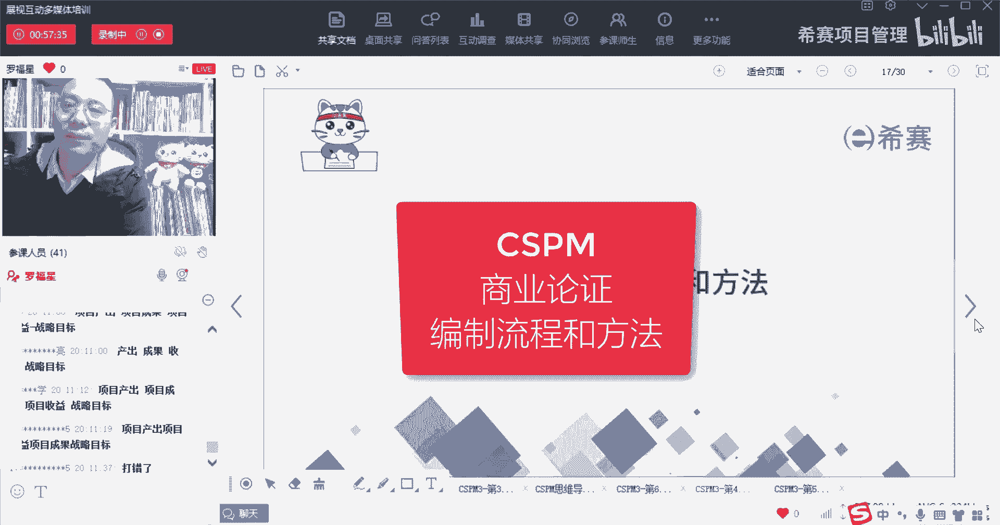
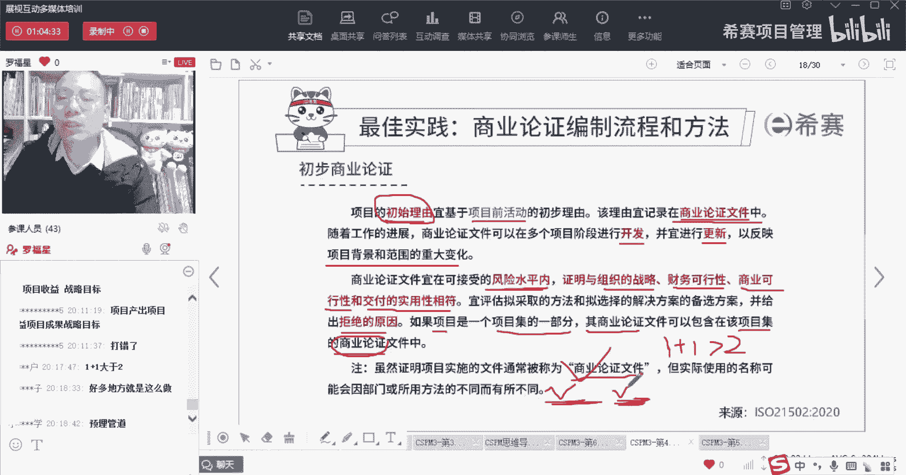

# 【收藏】CSPM-3中级项目管理认证考试直播课精讲视频合集（零基础入门系统教程）！ - P42：CSPM长空4-7初步商业论证 - 希赛项目管理 - BV16p42197SH

商业论证它的编制流程和方法，首先呢商业论证并不是一开始就写的那么清，晰和具体，他一开始有可能是一个非常粗略的，所以他说有一个很初始的说项目，他说项目的项目的初始理由，我们有一个初始理由。

而这个初始理由呢，应该要写到商业论证的文件中，而这个初始流从哪里来呢，在项目前活动中间其实就列了这些初始理由，也就是说诶我觉得有个什么东西很不错呀，它能够带来什么呀，这个时候都是一种还八字没一撇的时候。

你闭着眼睛去想出来那些东西，那么那些个理由，它也是我们的这个商业论证的初始的雏形，就是刚开始的形状，刚开始的这个雏形，OK那我们必须要把它记下来，所以说他说项目的初始流。

是应该是基于这个项目的项目前活动的初始流，然后呢，这个理由呢，也要把它写到这个商业论证的文件中，并且随着项目的推进，他应该要在多个项目的各个阶段来进行开发。

开发这个词它其实应该是用一个词叫development development，这个开放它不是coding development，其实是有这个development。

从同时还会有一种叫发展的概念在里面，有发展，就是说就我开始就这么大，我现在变得这么多，变了这么多，唉这是在也是在一个发展的过程中，一个开发的过程，他说并且呢要进行适当的更新。

来反映项目的背景情况和范围情况的一些变化，也就是可能项目的背景啊，范围啊，还有一些信息啊，我越来越清晰，所以呢这个时候包括它的收益啊，它的各种情形呢我越来越清晰，所以我的这个商业论证呢。

从最开始的一个初始理由，变成一个非常明确的理由，便是接受过论证的理由，好这个词你讲讲起来可能你还觉得没感觉，我更换一个词来表达，就是你们在做可研的时候，是不是有一种叫初步可行性研究。

和详细可行性研究有没有，尤其是如果学过软考的同学，就学过软考的同学，你应应该是对这个有有感觉的啊，就是先做初步的可行性研究，粗略的初步的，也就是说这个论证呢我稍微论证一下，稍微论证一下啊。

然后呢如果发现他搞值得搞，我们将再做详细的可行性研究，深度的去搞一下，明白吗，是这个意思，所以他其实是在不断的去，也是有一个一个一个迭代的过程，OK那么整个商业论证文件。

他说应该是在可接受的风险水平之内，请注意要会考的啊，在可接受的风险水平之内来去论证论证什么，他需要去论证，跟组织的战略目标是相匹配相一致呃，并且是有财务可行性，是能够去做出。

能够产生产生这个这个这个价值，然后呢还是说是商业的可行性，而也有可交付的实用性都相符合，其实也就是说我们这这这个项目，它既跟公司的战略目标是相匹配相一致，是match的，并且呢我们有这个财务的可行性。

我们是能够赚到钱的，还有呢就说是啊，比方说它有没有什么风险，风险方面是可行的呀，技术技术方面是可行的呀，交付交付方面也是可行的，这东西有用的等等O，在我对应的这个风险水平之内。

能够证明这东西是真的值得做，这样的话呢，我们这个项目最终也就值得做，并且我们在做这个商业论证的时候，有没有可能发现某一个项目我觉得特别好，但是一论证以后发现不合适不值得，有没有这种可能性，当然有的嘛。

就像你就像比方说诶，你在年轻的时候，你去交女朋友的时候，或者交男朋友的时候，唉，你想要跟他去走，走向未来，但是你后来慢慢的发现诶，好像他不值得不合适对吧，那么就有这种情况对吧。

所以如果说当你发现某个东西它不合适的时候，你要给出一个拒绝的理由，OK不OK的东西，我们是要去给出一个不合适的理由，就是为什么不合适呢，比方说有可能是法律有风险，有可能是技术有风险。

有可能会是财务有风险，有可能会是有些社会风险啊等等之类的对吧，所以他说是以评估采取的方法，和你选择的这种解决方案和备选方案，并给出一些具体的理由，就说哪个东西我我我我我搞他哪个东西我不搞。

他一定是有原因的，表示这个信息好，然后呢，还有一个是说是，如果我们的项目是属于项目集里面的一部分，或者如果我们这个项目是属于项目的那个组合，里面的一个部分，那么我们的这个项目项目的商业论证文件。

他说可以包含在项目集的商业论证中，诶，所以你会发现这一句话它其实反过来再告诉你，原来某一份商业论证文件，它可以去支持一个或多个项目的启动，就在这里，如果说我的这个问这份商业论证，是一份项目集的商业论证。

它也可以同时搞多个项目呀，项目集是什么概念，还记得吗，项目解锁的是有多个项目，他们会联合在一起来管理，我为什么要联合在一起管理呢，是因为如果我把它合到一起管理以后呀，它能够产生更大的价值。

它能够用更低的成本，能够更加的划算，也就是所谓的叫1+1大于二，就像我们举一个很简单的例子啊，就比方说你要去在那个路边上去买很多管线啊，什么之类的，你如果说在路边上买一根电缆啊，你把地刨开刨开。

然后再埋一根电缆，然后再把那把那个地给埋起来，把那个修平，你过一段时间你会发现诶需要买一个那个电视，有线，买个有线，你又把那个地刨开，你又去买个有线，买了以后你把它再搞平搞平，然后再搞好啊。

你后面又发现你还要买一个那个网络线，你又把那个地刨开，你又去买一个网络线，那你其实事实上呢你每埋一根线，你都需要去刨一次地，然后再把它合拢来对吧，还需要耽误大家时间，还需要换人工，还需要花财力物力。

但如果说我们把它做成一种项目集的概念，我们把它放在一起来搞，我这一次抛开抛开了以后呢，把那种什么电缆也放进去，然后把这个有线电视有线也放进去，把网络网络光纤也放进去，诶我把这些东西都放进去。

甚至什么污水处理管道什么之类的，我都一次性把它搞好了以后，我再把它合到一起来，他是不是比那种开始说的那种方式，要减少大量的金钱，节省大量的人工，是不是这些所谓的项目集的概念，OK这是项目集的概念。

那么项目集如果说，那么也就是说，一个项目集里面其实会包含多个东西，那么它就可能会启动多个项目啊，你就记住了，同时这里给了一个注释说，虽然证明项目实施的这个文件，可以叫做商业论证。

但是有的时候呢我们也会把它叫做，根据不同的原因叫不同的名字，比方说是叫业务论证文件，比方说叫项目论证文件，所以你在考试的时候看到什么商业论证啊，业务论证，项目论证啊。

一个意思啊。