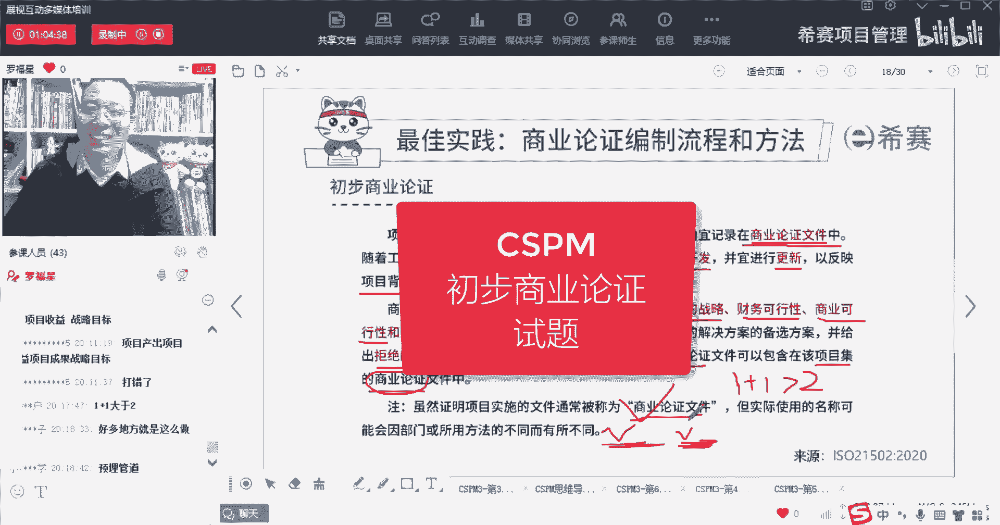
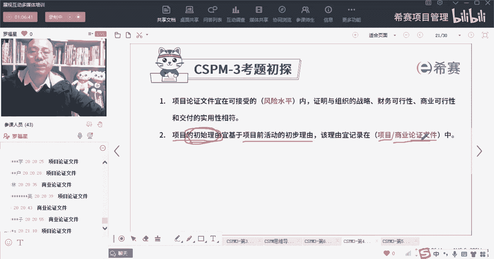

# 【收藏】CSPM-3中级项目管理认证考试直播课精讲视频合集（零基础入门系统教程）！ - P43：CSPM长空4-8初步商业论证的做题 - 希赛项目管理 - BV16p42197SH

记住了吗，我们要开始搞事业了，来先搞第一个题目哇，小总小总，你这个牛逼了哦，还有那个呃吴某某伟同学也很牛逼啊，然后高总张总，还有一同学，亮总郑总，可以啊，你们都很很牛逼啊。

他说商业论证文件是在可接受什么之类呢，是在可接受的风险水平之内，是在可接受的风险水平之内，兄弟们，项目论证文件或者商业论证文件，是在可接受的风险水平力，来去证明他与公司战略与财务可行性呢，商业可行性呢。

还有交付的实用性呢等等，是相匹配，相符合，match是相match的，是这个意思啊，第二个题目呢，他说是项目的初始理由，应该是要跟公司的项目前活动的，初始理由是相一致的。

是基于这个项目前活动的初始理由来去做，咱们这个项目的初始理由，并且这个项目的初始理由，他也要记录在什么文件里面呢，它也要记录在商业论证里面，或者是项目论证里面，所以初始理由也要记录在里面。

他只他就在告诉你一个启示，就是原来这个商业论证文件是会不断去更新，不断去更新的，刚开始的时候可能是一个很粗略的，是一个初步的可言，到后面到一个详细的可言好。

