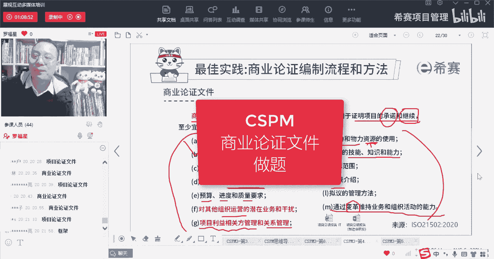
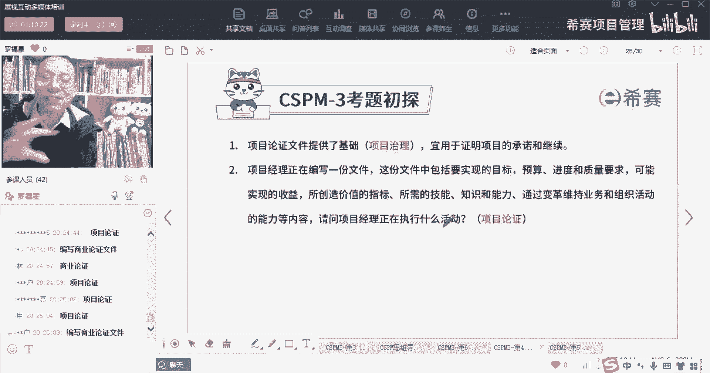
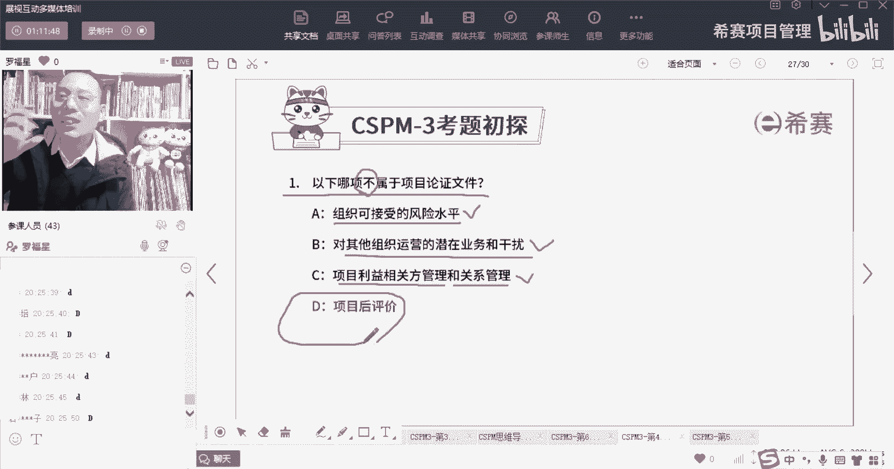

# 【收藏】CSPM-3中级项目管理认证考试直播课精讲视频合集（零基础入门系统教程）！ - P45：CSPM长空4-10商业论证文件做题 - 希赛项目管理 - BV16p42197SH

我们来看两个题目啊，第一个题目，好一种给了最快也给了啊，还有那个高中是吧，另外一个也是一开头的哦，蔡总张总亮总郑总，可以啊，你们懂项目的商业论证文件，它是提供了一个基础的项目治理。

也就是本身我们治理框架，商业论证，它就是一个最最基础的治理框架，它就能够告诉我们这个事情大概方向，在什么框架之内去做这个事情，对不对，好，他说，并且呢它是用来去证明这个项目的承诺和继续。

所以继续也是值得继续往下进行好，我们再看第二个，第二个呢有点长啊，项目经理正在编写一份文件啊，这份文件呢包含了一些要实现的目标是什么，项目的预算啊，进度啊，质量的要求是什么，可能会实现的收益有什么。

以及可能会产生的这些价值，它对应的一些指标，有些什么指标来去衡量它价值啊，以及这些所需要一些什么样的技能知识和能力，包括通过变革来维持业务和组织活动的，这种能力等等。

那么请问你项目经理正在执行的是什么活动，你们都说的很对啊，就是商业论证或项目论证或业务论证啊，商业论证，项目论证，业务论证这两个词反正混着用没有错啊。

就是这个意思好，我们再来看一个题目，哎，它里面有一个词叫不属于你，一定不能搞错了，兄弟们，他说以下哪一项它不属于项目的商业论证文件，诶，这里有一项说是组织的可接受的风险水平，刚好有一句对吧。

我还念了一下，然后对于其他组织的一些运营的，一些潜在的业务和干扰，我我还特意给你稍微翻译了，下回就是其实对于别的这种业务的这种影响，是不是好，还有第三句说是项目的利益相关方的管理，以及关系的管理。

我也念了一下啊，有而这个项目后评价呢，它不是属于业务论证，事实上业务论证他其实说的是说，我们在做这个东西的过程中所需要去关注的，而项目后评价，其实说是在整个产品，生命周期的最后投向市场以后。

我们来进行后评价，而通过后评价，能够确保这个项目它真正产生的价值，和你最初期待的价值是不是相匹配相一致。

