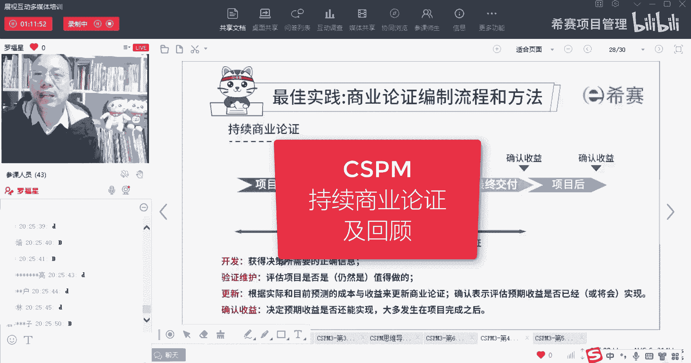
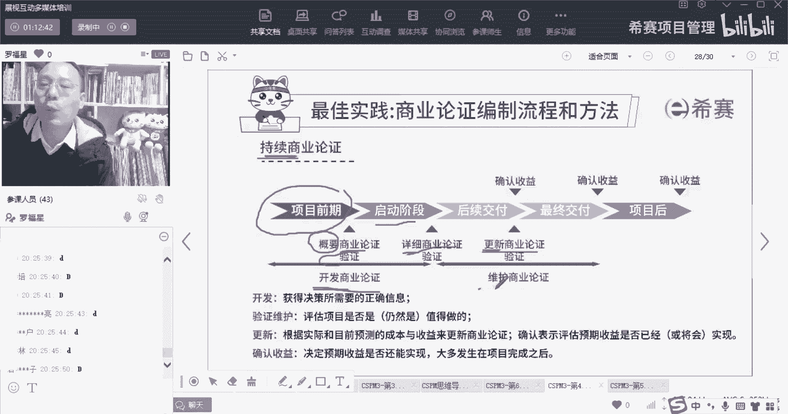
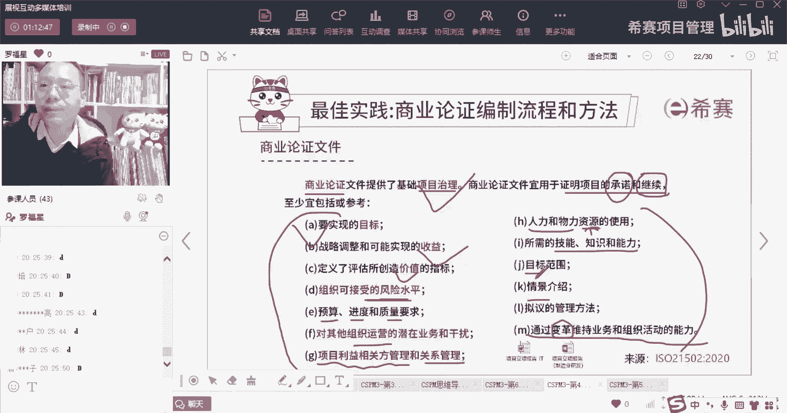
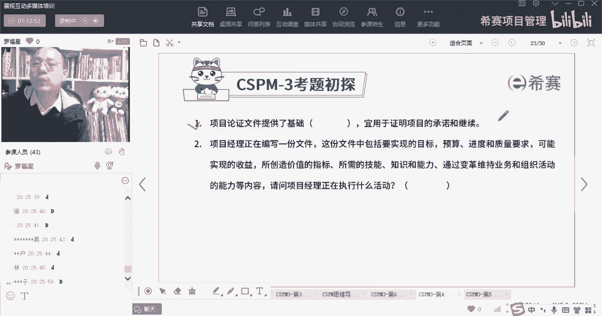
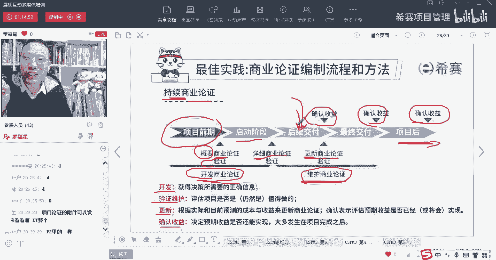
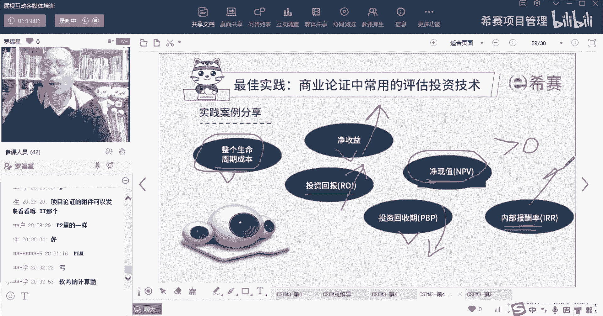
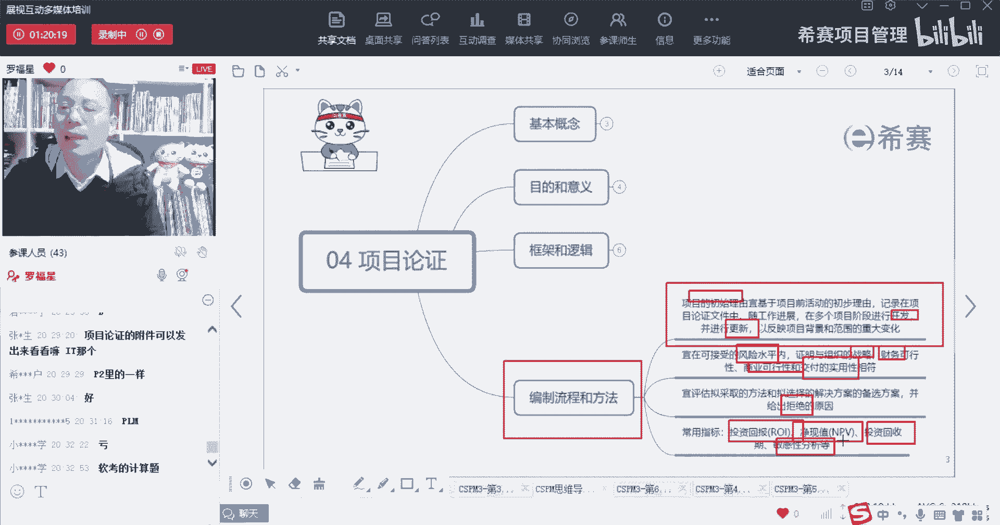

# 【收藏】CSPM-3中级项目管理认证考试直播课精讲视频合集（零基础入门系统教程）！ - P46：CSPM长空4-11持续商业论证 - 希赛项目管理 - BV16p42197SH

好这里给大家多加了一页，加了一页，什么呢，就是关于商业论证呢，它其实是一个持续的过程，什么叫持续的过程中，就是在项目前期的时候，我们就有一个粗略的商业论证，这里给了一个词叫概要啊。

概要性的就概括性的在项目才刚开始的时候，就有一个比较概括性的这个商业论证好，然后在项目启动阶段的时候再战，或者说是那个那个其实也算是一个项目前期啊，在启动阶段他就有一个非常详细的商业论证。

OK有详细的商业论证来去验证，这个项目值得做好，到后期的过程中，我们还要继续更新商业论证啊，这个更新商业论证，其实更新商业论证，验证也是要持续的进行商业论证，这里给了两个词，你不用把它背下来。

这个考试不会考它，这一页考试不会考你，一个是我们需要去做开发商业论证，一个是要维护商业论证是什么意思呢。

也就是在前面有这样一句话。

要有一个项目的承诺，以及他的继续，就说我们要，我们最开始觉得这个项目为什么值得做呢。

是因为我们去开发了商业论证，发现这个项目是值得做的，那为什么过程中我们发现的项目依然值得做呢，是因为我们会去维护这商业论证，我们会持续验证它的商业论证，发现这项目依然是值得做的，但是请注意哦。

这个项目的商业论证，他觉得这个项目值得做，是因为觉得这个项目它能够产生收益对吧，可是这个收益它在什么时候产生呢，有可能是项目交付的时候会产生一些些收益，也可能是最终交付最终成果的时候产生的收益。

但是还有绝大部分情况下，在什么时候产生收益，是项目已经交付很久以后，我们投入运营很长很长时间以后才会产生收益，兄弟们，就像你说，如果你开发了一款那个呃什么呃手机app。

那个手机app它要投入运营若干时间，一年两年诶，才发现那个收益真的是达到了达到你的理解，一个预期目标O我们前面去开发这个商业论证，然后去验证维护商业论证，更新商业论证，确认收益，这些过程中。

其实都是在持续的进行商业论证的过程，因为我们还有一个词叫什么呢，叫及时止损，及时止损，就是如果说我在刚开局的时候绝了，这个项目是值得做的，可是我做到一半以后，我发现这个项目他不值得做了。

我发现他是别人在骗我，那么这种情况下呢，你就要及时止损对吧，你不能说你已经被别人搞了2万块钱，他说我这个2万块钱被锁死在这个系统中，你还要再出5万块钱才可以解锁这2万块钱，这时候你其实你理智去分析的话。

你大概就是不能再投钱，因为你再投钱呢，你可能会连这个5万块钱也都是肉包子打狗，可是有可能会有一种什么情况呢，有可能会就是我们的心里面会有一种，就是因为沉没成本导致自己不舍得，不不不不那啥。

所以呢就有可能会想要继续往里面砸钱，想把那个钱给捞回来，哎我用更多，用5万块钱把那2万块钱给吸出来，但事实上你会中了敌人的轨迹。

中了敌人的圈套，我们在做商业论证的时候，其实会分成两大类，一类是种非财务的分析，那还有一种是财务的分析，非财务分析我就给你举个简单例子，比方说诶他跟公司战略目标是不是相匹配呀。

啊给我们的这个技术开发的能力有没有啊，然后我们有没有对应的资源可以去完成啊，哎这都是非财务的分析，除了财务，除了非财务分析以外呢，还有一些财务分析的指标，那这里就有一些简单的财务分析指标啊。

比方说会有整个所谓的整个生命周期的成本，就是就是叫什么叫全生命周期成本，所谓的全生命周期成本是项目从开始到结束，所历经一系列阶段中，我在前期去规划呀，去设计啊，去去开发呀，去干去做它呀等等。

会产生这些结果，以及包括可能他后面在研发了以后，后面投入的运营和使用，在投入运营和使用的过程中，还会再产生产生成本，那么这是这是我们需要去考虑的一个因素，在做商业论证的时候需要考虑的。

然后呢有个叫净收益，就是你最终你的收益，你的收益除掉你的这个成本收益，除了成本啊，这是你所谓的一个净收益，同时呢还会有投资回收期，什么叫投资回收期呢，投资回收期就是我多长时间能够回本呢。

我是3年五年还是几年时间能回本，回本的时间叫投资回收期，就是刚刚好到了一个时间点的话呢，我的这个投入和产出刚好是达到，共达到了一个点，就是达到一个盈亏平衡点，这是我的所谓投资回收期，那还有个叫投资回报。

投资回报率就是我这个投了1000万进去，它能够给我回报多少呢，尤其是到以后正常运行的以后，每一年能够有回报多少呢，唉你会有一个投资的回报，除此以外还有一个词叫净现值，净现值是什么概念。

稍微我们只是稍微说一下，考试应该不会考这东西，净现值它指的是说我们的钱是越来越不值钱的，因为通货膨胀其实还是比较厉害吧，钱越来越不值钱，那你今年投了1000万，假如说明年没有回本获利没有回本。

到第3年诶，那1000万刚好回来了，那么是不是是不是表示第3年的时候，我回了1000万，就表示我的这个成本就完全覆盖住了呢，不是因为你今年这1000万更值钱，你第3年以后的那1000万呢。

没有现在此时此刻的1000万这么值钱，所以我们要怎么算它呢，我们要把未来的这个1000万把它折算到现在，把它折算过来，怎么折算呢，这就是有一个专门的一个折算方式，每一年专门有个责任，有个计算公式。

那么把每一年前把它折算到今天，把未来每一年前折算到今天，这样折算的东西在求和，那么这个球的和呢，它就是净现值，这个净现值呢有个要求，它应该是要大于零，如果这个进线是刚刚好等于零，说明你就没有赚也没有亏。

就是浪费了时间和精力，没有赚也没有亏，如果它大于零，说明你赚钱了，如果你小于零，说明你亏钱了啊，所以这个东西呢你要知道一下，那投资回报率肯定是越高越好，投资回收期肯定是越短越好啊。

越早早早就把钱给收回来对吧，免得夜长梦多，所以投资回收期是越短越好，那净收益当然也是越大越好了，那么还有个叫内部报酬率，内部报酬率是什么概念呢，稍微说一下啊，你听懂了，最好你没听懂也没有也不要紧。

反正考试应该不会考，他就是比方说净现值中，我们有一种方式去算，你不管你未来有多少钱，我只要折的够狠，都可以把它折到刚刚好等于零，就是折折到刚刚好，跟我的投资是一样多，也就是那个那个老板打算盘。

他可以打的很精，就不管你未来能够赚多少钱，我都可以把它直到刚刚好，那么在这种情况下，如果把未来所赚到的钱折到现在，折到刚刚好跟我的投资是一模一样多的时候，那么那个时候有个折现率。

那个折现率呢就叫内部报酬率，而这个内部报酬率的理论，理论上来讲是越大越好。

它要大于通货膨胀呢，大于银行的银行的利率啊等等才合适啊，这是关于这一章节，我们来去再回顾一下这个思维导图啊，呃在编制流程和方法里面，你看到首先他说是项目初始应该是放到里面来。

然后呢便携式随着项目的进展呢，这个东西要持续的去开发，然后持续的去更新，来包含所有的重要内容，并且呢我们的这个项目啊，它应该在一个可接受的风险水平之类来进行，还有他要证明跟公司的战略啊，财务可行性啊。

商业的可行性啊，交付的实用性呢都要是相匹配相符合，相相互一致，我们要去采取一种评估的方法，来去选择下面的一些东西，并要有一些东西要给出一些拒绝的理由，如果不合适的话，我们要有一些拒绝的理由。

好一些常见指标来去做这个论证，包括投资回报率啊，投资回收期啊，经验值呀，然后什么还有敏感性分析呀啊。

内部收益率啊等等这些内容好，那么这就是我们在第四章，商业论证或者业务论证或者项目论证的内容，就先到这里。

