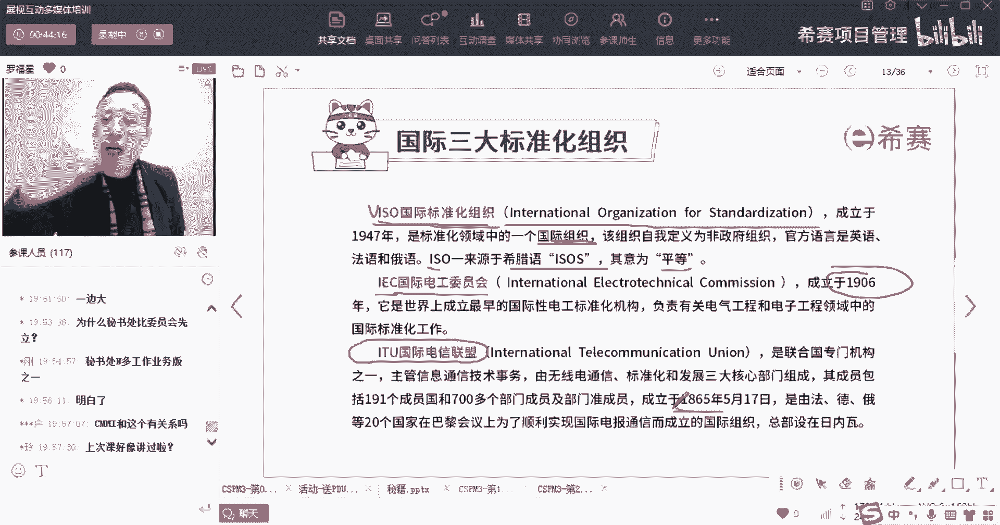
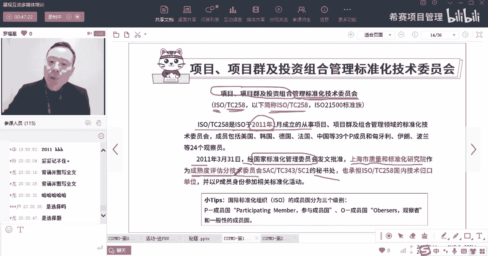
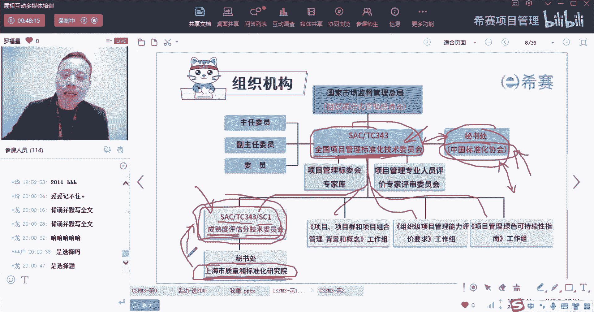
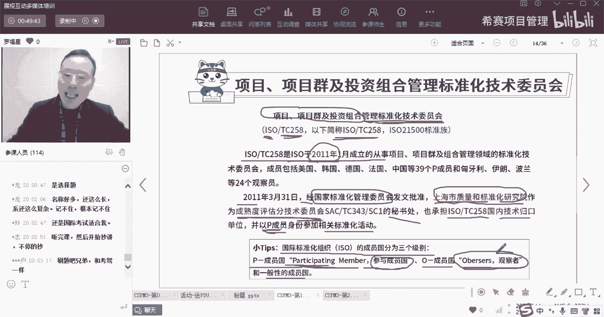

# 【收藏】CSPM-3中级项目管理认证考试直播课精讲视频合集（零基础入门系统教程）！ - P5：CSPM长空1-5国际三大标准化组织ISO、IEC、ITU - 希赛项目管理 - BV16p42197SH

认识一下那个国际标准化组织啊，为什么要宣传这个国际标准化组织呢，因为咱们的这本教材，因为咱们这个21502这本教材呢，它其实是同才的ISO国际标准，所以先来认识一下什么叫国际标准化组织。

ISO国际标准化组织叫international organization，For stomization，叫国际标准化组织，它不是隶属于中国呀，英国呀，美国呀，法国，它不属于任何一个国家。

它是一个全球性的组织，它是一个国际性的组织，并且他的这个ISO他说是取自于希腊字母的，什么ISOS叫平等，他会做很多这种标准，那么这些个标准呢也是全球可以共用，除了有这个组织以外。

另外还有一个组织叫IEC，IEC我们也稍微见过一眼对吧，叫国际电工委员会，那这个组织成立的更久，那是1906年，还有一个叫ITU叫国际电信联盟，国际电信联盟成立的更久，是1865年啊等等。

就是有很多这种国际标准化组织。

那这个国际标准化组织底下，他会专门有个叫项目管理的标准化技术委员会，你看这里有个叫项目项目群，以及投资组合管理的标准化技术委员会，它就属于ISO底下的一个叫TCR58，所以他叫做ISO底下的TCL58。

你可以理解为是在ISO底下，会有很多很多乱七八糟的各种标准，其中关于项目项目群和投资组合的管理标准，他专门成立一个叫TCL58，这样一个标准化技术委员会，然后这个呢它的简称叫ISOTCL58。

诶这个考试也会考啊，兄弟这个考试也会考，是的上次开学典时候也讲了这些东西，然后现在我们是按照考试的这种方式来进行，就重新你每一个要考的点，我都会跟你说啊，所以你要记得我们国家内部的那个叫TC343。

老外的这个呢叫IOTCL58啊，然后这个TCL58是什么时候成立的呢，哎在2011年的时候成立的，他在2011年的时候成立的，并且在这一年的时候，你看我们国家，经过国家标准化管理委员会的批准。

上海市质量和标准化研究院，它会作为一个叫成熟度评估，这个好绕口啊，所以这里有一个叫上海市，质量和标准化研究院啊，这个机构，它会作为一个叫成熟度评估分技术委员会。

这个成熟度评估分技术委员会将来呢在这里，也就是说，在这个全国项目管理的标准化技术委员会底下，它这里有很多个小的组织啊，有很多角色组织，有很多组织，其中有一个叫做成熟度评估分技术委员会。

那这个成熟的评估分技术委员会，那它就是SACTC33，应该下面叫s c one，叫上海市质量和标准化研究院，那同样的上海市质量和标准化研究院，他也不是专门为这一个事情而成立的一个机构。

他是找欧洲就已经成立了，他已经成立了很多很多很多年了，他这个类似于说这个像中国标准化协会，也是成立了很多年了，只是说在2011年的时候，国家专门去成立，这应该叫成熟度评估技术委员会的。

这个时候实行的时候呢。

是这个意思啊，啊所有题目都是选择题，都是选择题，这个上海市质量和标准化委员会，他会说是作为一个IOTCL58的，一个国内技术归口单位，也就是这些东西，它是作为我们国家要跟国际接轨，要跟国际去对接。

那谁来去对接呢，由上海市质量标准化研究院，他来去负责对接，他来做这个事情呢，我们国家的内部的一个一个接口，OK好，并且呢，我们是以P成员国的身份，来参加相关标准的活动，那什么叫P成员国呢。

这是ISO底下他自己一个分类方式，就是国际标准化组织ISO，他的成员国分了三个级别，一个叫participate member，叫参与成员国，也许你是可以去参与一些事情的，然后另外呢还有呢叫欧成员国。

那么欧成员国呢他甚至都不能叫成员国，它就叫观察员，Officer，officer叫观察者，然后除此以外还有一个叫一般性的成员国，他的那个投票是这样一个规则，就说所有的参与成员的都可以去投票。

那么这个观察者呢，他一般是也没有什么资格去投票的，在什么时候才会被引起重视，就是他反对的时候啊，他说反对什么东西的时候啊，我才去重视它啊。

