# 【收藏】CSPM-3中级项目管理认证考试直播课精讲视频合集（零基础入门系统教程）！ - P7：CSPM长空1-7CSPM考试时间、题型题量及论述样题 - 希赛项目管理 - BV16p42197SH

然后考试时间，如果说1~4级考试时间都是三个小时，那这个时间足够了啊，100道单项选择题加上两道论述题，然后到了四级就是60道单项选题，加上三道论述题，然后五级呢就是写报告，然后加面试。

然后你们可能会好奇，说是论述题长什么样子，对不对，好奇吗，好奇论述题长什么样子吗。

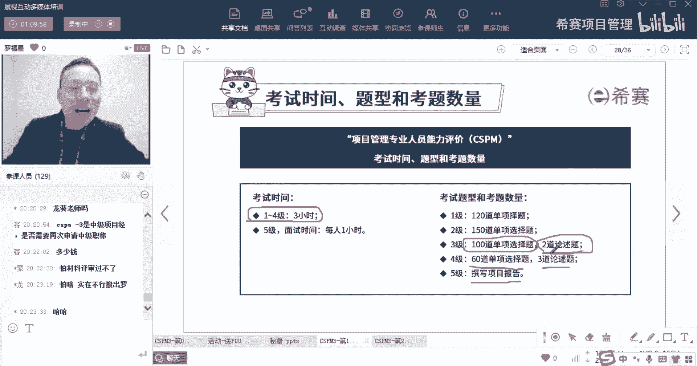

这就是考试考过的一道论述题，他说你在某一个企业，然后从事某某工项目管理工作已经有很多年，你见证了一个企业的职能型组织，发展成为一个注重项目管理的这个组织，你承担过很多个重要的项目经理。

积累了很丰富的经验，最近晋升为高级项目经理好，如今企业面临着激烈的市场竞争，老板急需要实现快速的这个战略规划，并通过不断的实施新的变革项目，来建立新的一个竞争优势，保持行业的领先地位。

最近由于你经验很丰富啊，所以呢老板认为你作为一个新项目的发起人，要求你去指导一位初级的项目经理，负责的这些新项目，这是您第一次作为项目发行，在项目管理过程中的这个指导项目，那么进入到项目之前。

老板找你谈话，想要去询问一些关键点，你应该如何回答老板的问题，老板问了两个问题，第一个问题他说是你在项目管理过程中，指导项目的目的是什么，OK你去知道项目的目的是什么。

第二个是在项目管理委员会的支持或监督上，作为发起人，你要你的主要工作有什么，那么这种东西呢有一个逻辑啊，一个简单的思路，首先第一个就是它的考试有40分，这一道题目就占了20分，这道题目占了20分。

既然知道题目讲了20分，他只有两问，大概有可能就是前面有十分，后面有十分，那既然有十分的话，我们一般答题怎么答呢，首先是一条一条的答，一条一条答，他很有可能就是有五个点，你如果能够答出五个点。

那么一个点两分，五个点就是十分，所以你至少达6~7条的样子，能够覆盖其中的五条得分，OK所以你这边可能得个达个6~7条的样子，你这边可能答个6~7条的样子，并且是一条一条的去答一个横线上面只拿一条。

你不要写成一段，兄弟们，因为你如果写成一段呢，别人没有那个时间和精力去看他，你但是你写成一条一条的，别人一看诶，这条A打个勾，这条A打个勾，这条A打个勾，那如果你是参加过软考。

你就知道软考里面有一个案例分析题对吧，他的答题思路也是这个思路也是按点得分的，就是你大概去评估一下，可能这个问题能够能够给到几个点，那大概率可能十分的话就是五点左右，那么如果是五点的话呢。

你就达到6~7条左右，能够把这五点给盖尽量盖住对吧，你同样的下面也是一样的，就是就是这个逻辑啊啊原总是说刚考完。

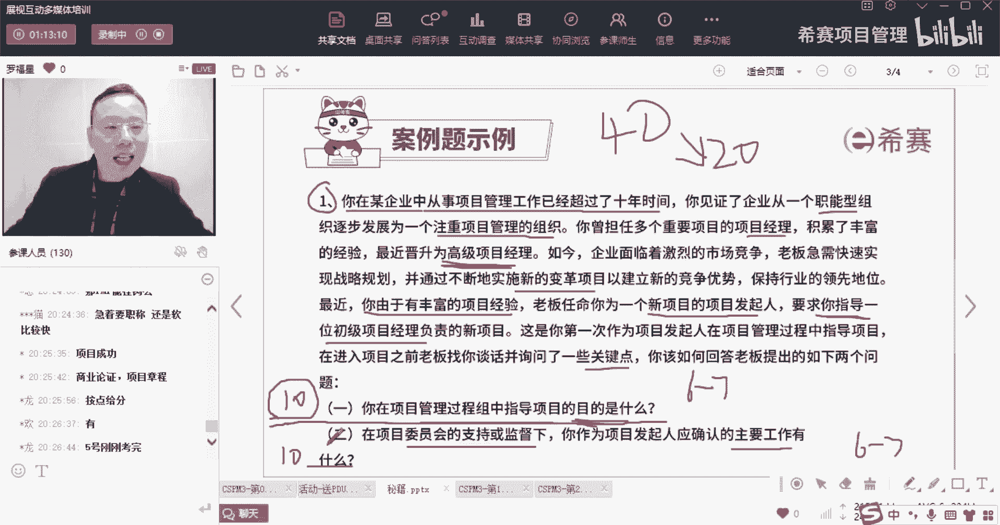

蒋总也是说有有考过对吧好，这是他的这个考试的题型和题量。

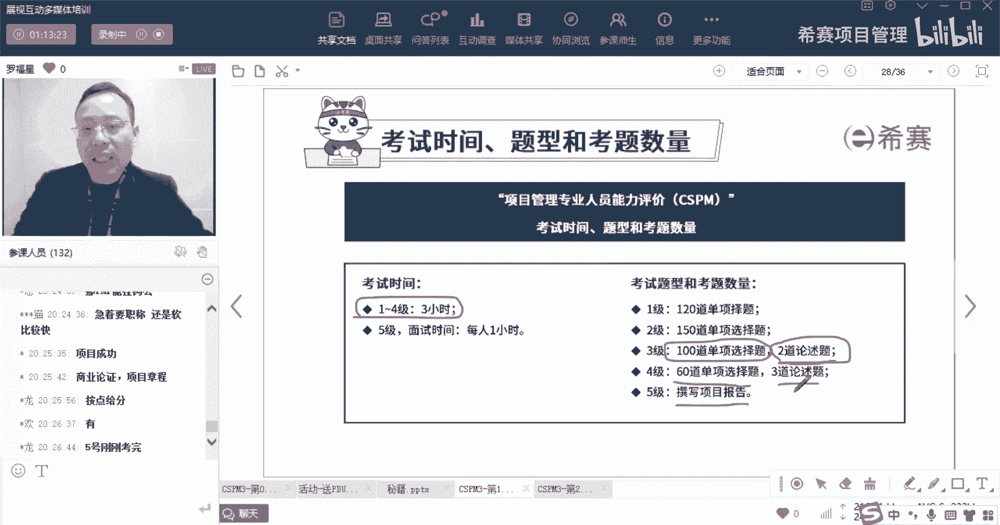

其实相对还是比较比较友好的啊，然后你要提交的材料呢也比较明确，有一个叫项目管理专业人员等级评价申请表，这是销售会发给你的一个申请表，然后是身份证呢学历或学位的证书啊，他的复印件啊啊。

然后呢是你如果说有一些什么职称证书，那你就是你别的一切职称证书。

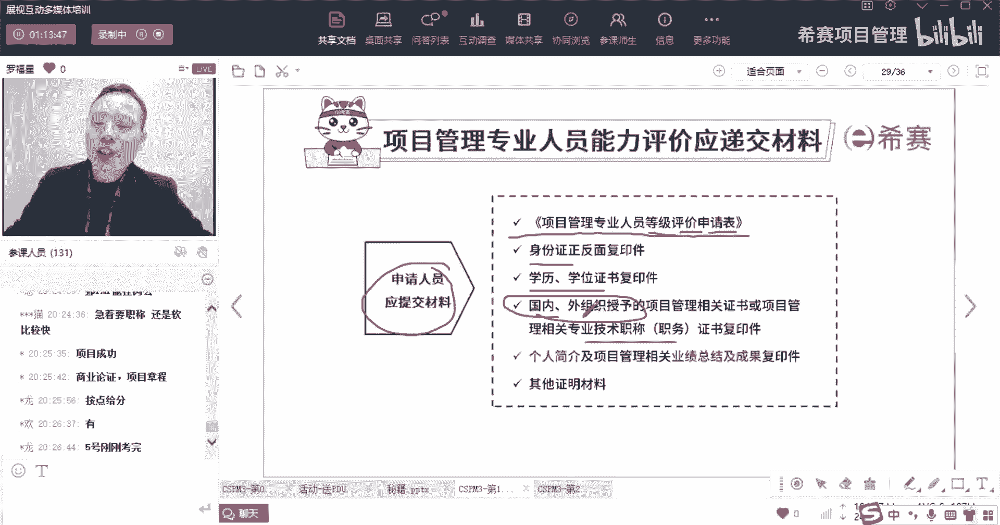

什么别的职称证书呢，比方说诶，你如果得到了一个华为的这些项目，管理专家的这个认证，或是你得到偏僻的这个认证PGMP的认证，或者你得到这个叫国际项目管理协会。

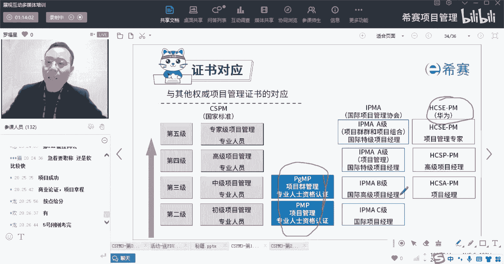

他的这些项目管理认证啊，你如果得到过别的认证。

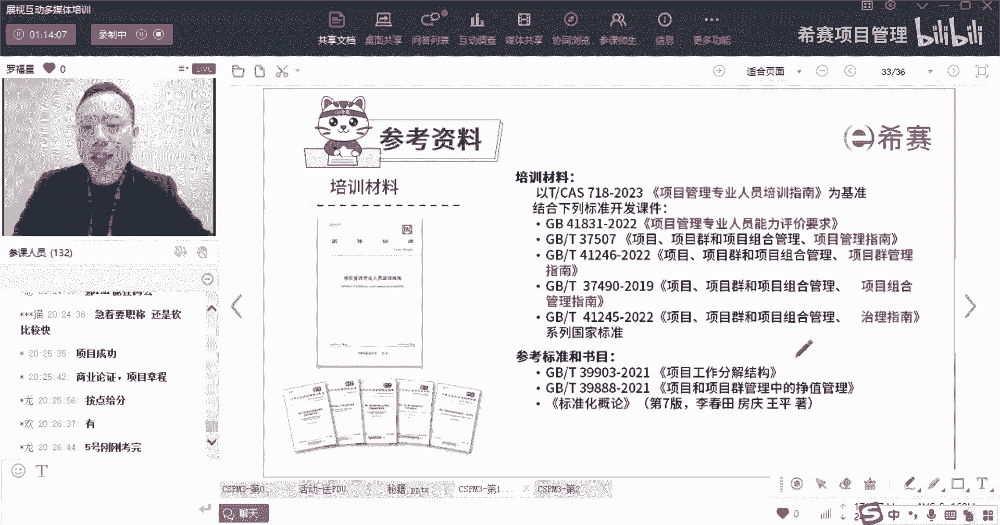

那么你把这个认证对应的也要去带上啊，还有就是自己的个人简介好。

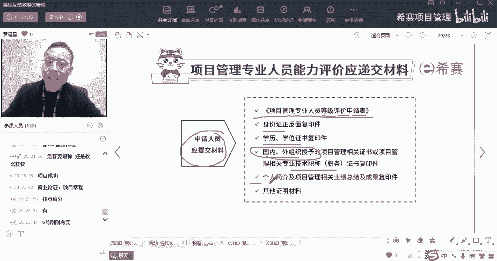

这是你要替递交的材料，那么你就是递交这个材料，再加上这个考试啊。

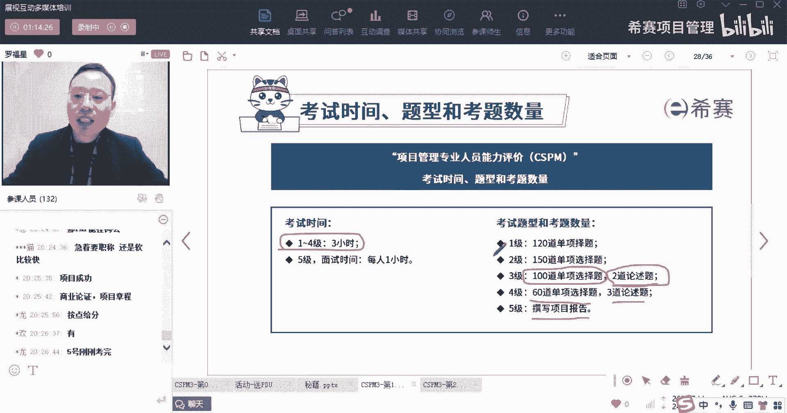

考试的题型题量也就在这里了，然后呢你最后会得到证书，证书它长什么样子，就长这个样子啊，证书就是长成这个样子，它是由那个中国标准化协会来给你盖章的啊，这里会盖一个叫中国标准化协会章，这上面会写上你的名字。

这里贴的是你的照片啊，这是项目管理专业人员能力等及证书。

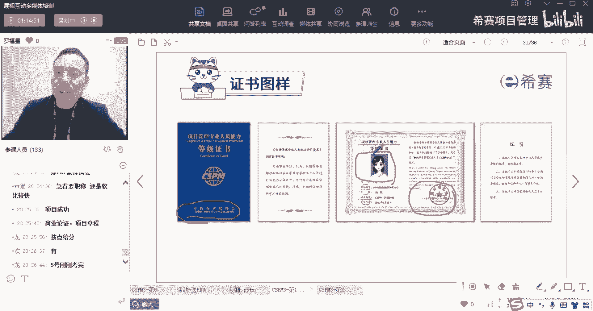

里面会有一级二级，三级四级五级建议大家直接是考三级啊，就是我们现在正在考的就是三级，那也有同学已经是拿到了二级的证书了，有不少同学，然后这个三级呢就是1月27号，就等你来考啊，等你来考。

OK那整个这个证书是由谁来维护呢，由向平板就是项目管理评价委会就向平板。

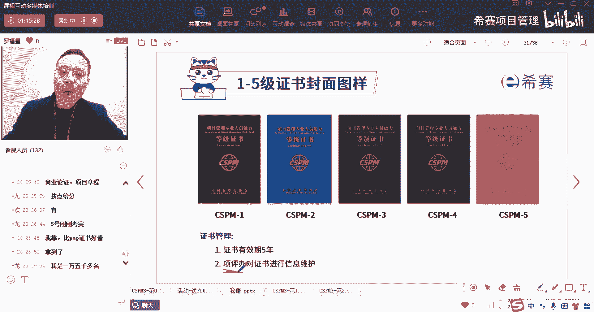

然后整个它的认证是由一级二级，三级四级五级，他考察焦点一个是专业知识要考察，一个是能力素质考察，还一个是实践经验也要考察。

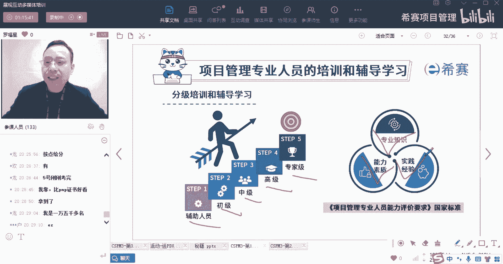