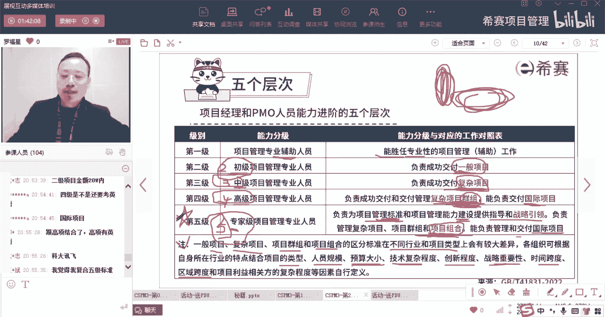
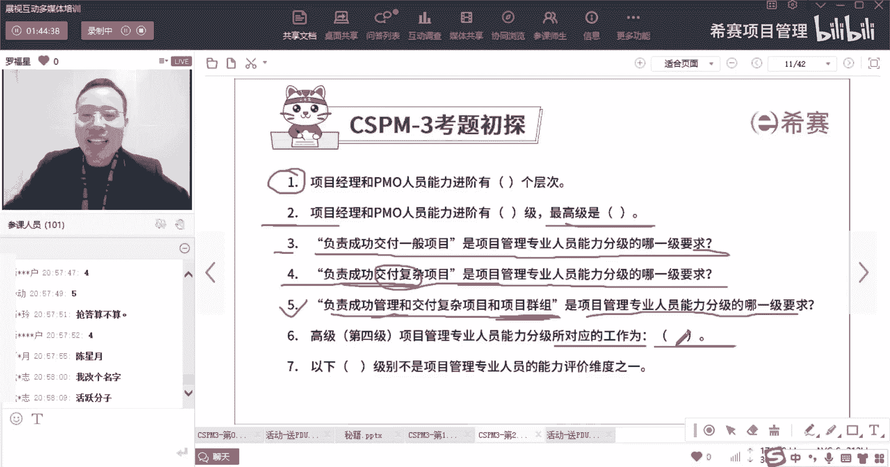
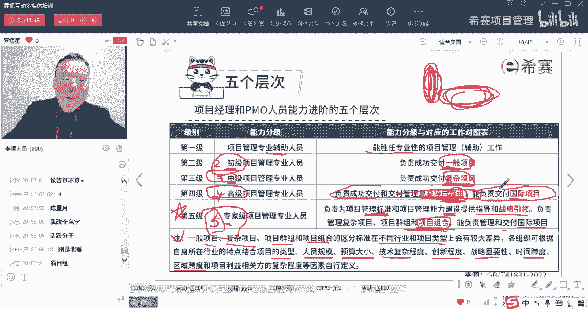
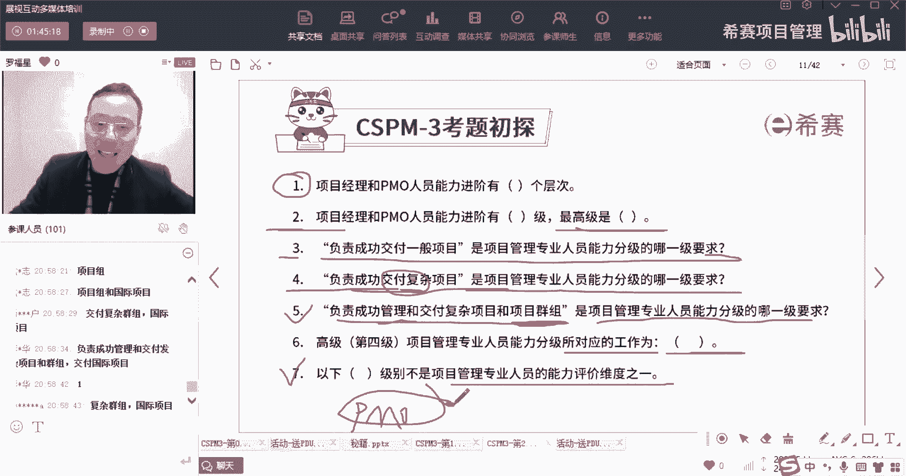
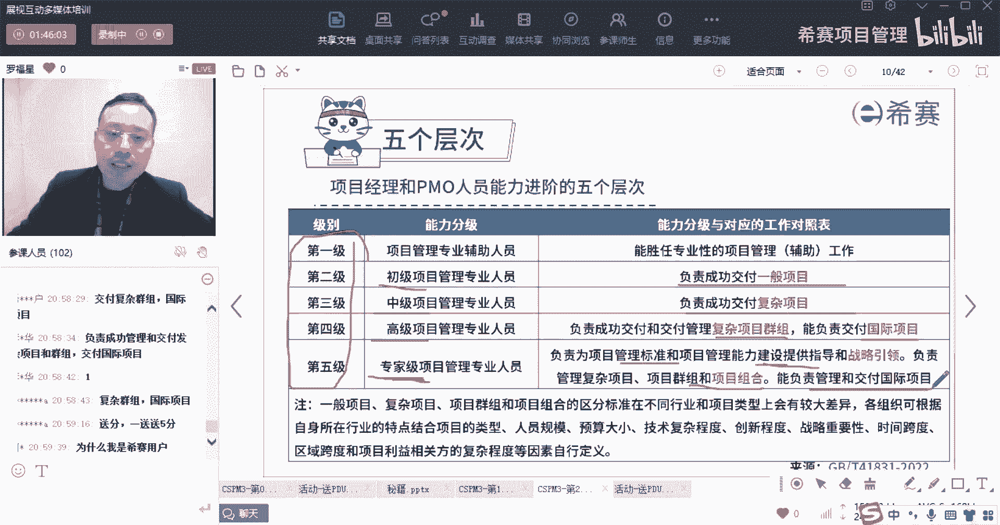

# 【收藏】CSPM-3中级项目管理认证考试直播课精讲视频合集（零基础入门系统教程）！ - P9：CSPM长空2-2项目经理和PMO人员能力进阶的五个层次 - 希赛项目管理 - BV16p42197SH

那他这个五个层级就是整个项目经理也好，PO的人员也好，他的能力进阶呢会分到了五个层级，那么这五个层级分别是什么意思，来认真看一下，标红色的是会考的啊，标红色是会考的，首先是关于辅助及项目管理。

你回答我一个问题好不好，你认真回答我一个问题，我就会给你发困的小礼物咯，马上就有问题了，你你你注意啊，好并且你要注意，标红色都是都是考试会考的题目，首先第一个是辅助机，辅助机他要干什么呢。

他说是能够胜任专业性的项目管理，辅助工作，能够胜任专业性的项目管理服务工作，那么也就是说我们在做的事情的时候，比方说我专门需要去收集需求哎，那你帮忙去收集需求诶，你费你对于收集需求啊，整理需求啊。

分析需求做得非常好，那也是很好的啊，那我们专门需要去做质量管理，那么你对质量管理做的非常好，这都是很OK的，所以是某一些专业性质的这些个工作，你可以做的分享非常好，这就是属于叫项目管理专业辅助人员好。

第二个呢是初级项目管理专业人员，初级项目管理专业人员呢，他说是能够负责成成功的去交付一一般的项目，一般的项目什么叫一般的项目，就是难度不是很大的项目，就是还算比较正常的项目，是这个意思啊。

就是一般般的难度不是很大的项目，这就是属于初级项目管理专业人员，也就是二级人员好，咱们现在考的是三级，我们考的是三级，三级对应的是什么呢，对应的是说能够去交付，这能够成功的交付复杂的项目。

什么叫复杂的项目，就是比起一般的项目来讲，它的背景可能更复杂，它的这个环境可能更复杂，它的那种内容本身可能会有更多的变更，可能会有更多的调整，可能会更复杂，OK甚至你可以把它理解为说是项目集的概念。

有一个项目集合的这个意思在里面的，就是很很很大的大的这种比较复杂你的项目了，OK这是第三集，复杂的项目好到了第四集啊，这是第三集啊，好到第四级到第四级叫高级项目管理专业人员，那么高级项目管理专业人员。

他说能力分级与对应的工作对应，表示我们来说是能够负责成功的交付和交付，管理这些复杂项目群主，所以你看到群主这个词，你看到群主这个词，你就往四级去靠了啊，能够交付复杂的项目。

群主也许是项目群项目及的这种概念啊，还有能够去负责交付这种国国际项目，所以是负责项目群组以及国际项目，它就算是对应了到了四级，然后再往下面来走，项目复杂度与项目的金额，肯定也会有一定的关系。

就是如果说你的金额越大的话，肯定那个项目一般来讲是更复杂，这个复杂其实从两个维度来看哦，考虑啊，一个维度是说复杂程度，一个视为繁杂的程度，就是有可能是很本身就难度很大，难度很大，也叫很复杂对吧。

还有一个是很繁琐，很繁琐，我们叫繁杂，但是我们也会把它叫做复杂，就很繁琐，实际上难度是不难，但是搞来搞去，搞来搞去很多事情那种也算是也算是负担项目，它就不能算是一般项目了，因为他太过于繁杂，太过于繁琐。

他也不能算一般项目，是这个意思啊，好我们再看第四，第五个层级叫专家级，专家级的项目管理专业人员呢，他说是负责为项目管理的标标准，和项目能力的建设来提供指导指导和战略引导，所以他是干什么，他是去建标准。

OK他能够去负责建标准，他说负责去管理这种复杂的项目，项目群组以及项目组合，而组合这个词大家有印象吗，我们一般说组合的时候，我们有给一个信息叫挑选项目对吧，我们去选择项目，去挑选项目。

也就是当你有十个项目可供挑选的时候，你会挑选哪一个呢，呃你会优先选谁，而不选谁，这是做项目组合所需要去关心的事情好，同时呢，他说还有能够去负责管理和交付国际性的项目，所以这里面会有一个什么重要的信息呢。

是能够去负责做标准的建设和制定，OK能够做标准这建设制定，所以谁来去建标准，五级人员负责去建标准，五级人员负责去建标准，所以我们再来简单回顾一下二级人员，他呢负责交付一般的项目，三级人员。

中级人员他负责去成功交付复杂的项目，然后四级人员，高级人员他是负责去交付那种复杂群主，项目群组，然后到了五级，五级人员呢，专家级别他是负责去交付这种什么项目组合，国际项目，以及说能够去建标准。

建国际标准好，然后这里有一个有一个信息，他说一般情况下关于项目呀，复杂项目呀，项目群组呀，项目组合呀，他们的区分标准，不同的行业和项目类型它会有差别，你们每一个自己根据自己的行业的特点。

结合项目的类型呢，人员呢预算了，哎，这就是刚刚王总说的，王总说那个这个复杂程度跟项目金额有关系吗，有关系啊，就跟预算有关系啊，跟预算的大小啊，跟技术的复杂程度呀，跟创新的程度呀，战略重要性啊。

时间的跨度等等啊，都有关系啊，跟这些都有关系，所以就是每一个公司，每一个团队他会自己跟自己其实稍略有差别，对不对，略有差别，王总那必须的，那必须是第五集啊，你这就算是行业前辈行业前辈大哥啊。

好那么接下来哈哈，有几个题目，开始是谁说要得到得到我的小礼物的，给你一个机会，我们先看第一个题目，第一个题目闭着眼睛来，第一个题目闭着眼睛，谁谁是第一个哇，这个简直是好，那个小某某班同学是小饼干同学吗。

叫什么名字，小饼干可以把小，小某干同学可以把名字调一下啊，看第一个题目，就算是你你你得到了好，接下来第二个叫五言风，OK好，第二个第二个第二个的后面一句是什么，哦那西餐用户叫什么名字。

西餐用户正好给你一个机会，那个西餐用户同学给你一个机会，把名字赶紧敲一下啊，对它叫专家级，就是它一共有五集，并且能叫专家级，是不是那个其他用户同学，你赶紧把名字抄完啊，好第三个，他说成功交付一般项目。

他是项目管理专业人员能力分级的哪一集，哪一集，OK这是二级，对不对，二级这个又是谁的谁谁最最快得到的呀，看一下啊，这是M开头的M同学，M同学把名字敲一下啊，因为我们现在都看不到你们的名字。

你们要把名字敲一下啊，所以这属于二级，对不对好，接下来是成功交付复杂的项目，复杂的项目是项目管理，专业人员能力分级的哪一集啊，第四个题目，复杂的，好这是属于三三，又是一个叫西餐用户。

同学我就不知道你叫什么名字了，这个名字没办法啊，M是潘小龙，OK然后再来到下面第五个，第五个说是负责成功交付和负责成功管理，和交付复杂项目和项目群组，项目群主，项目群主。

OK就是押押乐同学押韵叫什么名字，赶紧把名字强一下啊，他是项目管理专业人员能力分级的第四级，对不对，第四级也就是高级好高级，啊叫陈心悦诚心悦诶，怎么感觉这名字很熟嘞，是不是已经是好久以前的同学了。

是好久以前的同学是吗，然后高级第四级项目管理专业人员能力分级，对应的工作是什么啊，你看他对应的工作是什么，这个就很尴尬了，这个对应的工作那就很长很长对吧。

那么这个就是它对应的工作诶，他这边给到的是成功的去交付复杂的群主呀，以及交付国际的项目呀之类的。

对不对好，然后再往下面看最后一个题目，以下哪一级别，它不是属于项目管理专业人员能力评价的维度，哪一个不是呢，它里面有一个叫什么什么PMO级别，我们知道它只有五个级别，一个叫辅助级别，一个叫初级项目管理。

一个叫中级，一个叫高级，一个叫专家对吧，就辅助初中高专家这五个，然后除了这五个以外，别的一些778的一些名字就是干扰项啊。

是这样的，所以你会发现就这么一小小的一页，他考这么多题目，真的是我们再来回忆回忆一下啊，所以他首先考了第一共是有五个级别对吧，一共是有五个级别，然后第二集呢，第二集是交付成功交付一般的项目。

然后第三集呢就是中级叫成功交付复杂的项目，然后第四集呢是高级，它就是成功交付复杂的群主项目，群主哎以及哎，还能够交付一些国际项目，第五集专家级别，它是能够去成功交付这种项目组合，能够去制定标准。

制定一些国家标准，然后对国际标准建设能力建设提供指导和战略，然后交成功交付国际性的项目啊。

