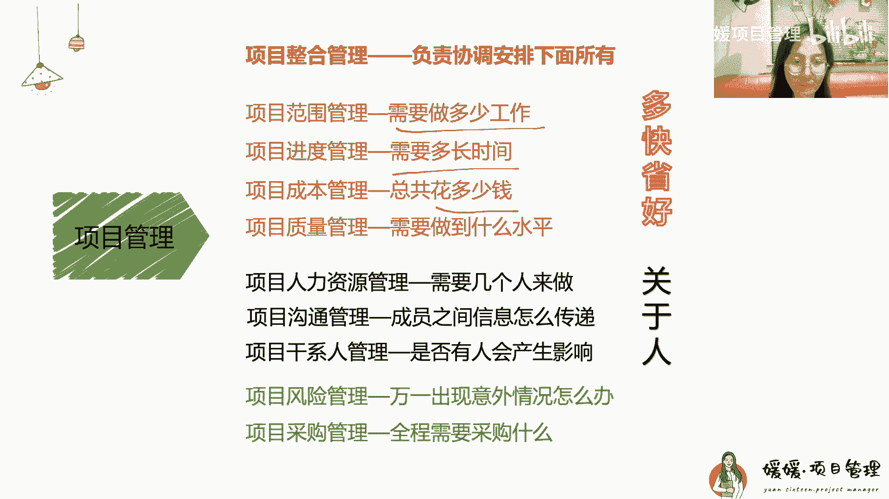

# 【新学员必看】2024年5月软考中级课程学习说明介绍（非常重要，学前必看！） - P1 - 媛媛项目管理 - BV1Qy421B72S

哈喽大家晚上好啊，我们是八点准时开始，Hello，大家晚上好啊，那我们还有一分钟哈，我们一会儿就要开始了，就是来开始今天我们的这个系统集成，项目管理工程师啊，这个培训给大家介绍一下我们的这个考试。

Hello，大家晚上好，OK那大家呢呃一些疑问呢，您可以先留言，然后一会儿呢，我会再给大家系统地介绍了之后呢，然后会给大家呢就是呃说一下大家的这个疑问，我再来给大家解答好吧，那现在呢就是大家有什么疑问。

都可以写在这个弹幕上都能看到啊，然后最后我会给大家来进行一个解答啊，那现在呢时间开始了，我们呢就开始来给大家的正式的一个介绍啊，首先呢这节课呢是我们不涉及任何的知识点，是一个我们在开始培训之前呢。

给大家呢介绍了一个算是一个呃思路啊，告诉大家我们接下来应该怎么学，以及对考试的一些分析，一些介绍啊，那么首先呢大家都知道，我们学的是一个系统集成，项目管理工程师的这样的一个培训是吧。

我再跟大家介绍一下我自己啊，首先呢我是呃一个管理学硕士，那我在一个呃500强企业，做过项目经理和内训师，那我在2019年的时候呢，其实在公司内部呢给我们的新人啊，培训过系统集成。

项目管理工程师的这样的一个考试，那培训之后呢，其实大家反响还比较好，还比较大家的通过率也比较高，然后在2021年的时候，我就开了这个淘宝店啊，大家可以在淘宝上搜圆圆学姐啊。

或者是呢我这个店铺名呢叫圆圆项目管理，那就开了这个淘宝店，那么现在呢其实也都辅导了好多学员了啊，给我几千名学员了，那其实我自己呢在这么多年呢也做过啊，也考过这个PMPCP高级和中级的证书，我都考过。

那其实呢就是经过了这么长时间的一个学习啊，包括这些理论知识的学习，和我工作上所经历到的一些项目经理啊，就是项目管理上的一些知识啊，所以呢我是把它们的有效地结合在一起啊，给大家呢做了一个培训。

就是做的这种一个中级的培训，相当于呢是有一些我们的这个书本上的知识，也会学习一些案例，让大家更好的理解啊，这是我们课程的一个特点，那么在此呢，我之前还做过深圳趁早读书会的一些运营官啊，就是一些社群运营。

所以其实我们这个群里呀包括一些打卡呀啊，大家一起呀，你追我赶的学习呀，同样的一个计划呀，那可能都是之前我去做运营的时候啊，学到了一些经验，所以很多小伙伴都说，我们的学习群是他所经过的啊。

就是所见过的这个氛围最好的一个群啊，那么这个呢，所以呢是我的一些个人的一些特点，和过往的经历，然后然后呢我就做了这个课程，包括这个学习群啊，希望呢是大家能够用我的这个过往的一些，经验呢能够帮助大家。

那今天呢我们先主要给大家介绍的呢，就是我们的这个考试啊，首先大家知道我们考的是一个系统集成，项目管理工程师，对不对，全国计算机和软件专业技术资格考试啊，那这个呢也简称为软考啊，咱们一般就说就是软考啊。

那大家可以看一下这个表，那这个表呢，其实啊我们的这个系统集成项目管理工程师啊，系统集成项目管理工程师，它呢是归属在信息系统类目下的啊，这个呢知道就行了，那他呢属于的是这个中级资格，而是软考中级。

那么像跟系统集成项目管理工程师啊，考试内容一致差不多的啊，有70%是一样的，就是这个信息系统项目管理工程师啊，信项信息系统项目管理师，所以有很多人呢是先考系统集成，然后再去考信息系统。

就是你学完中级就有很多的基础了，有70%是一样的，你再去考高级也就非常简单啊，这是高级，大家知道一下就行，那么我们这个软考啊，它是由国家人力资源和社会保障服务保障部。

你可以看一下考试合格者颁发的这个证书啊，两个部门啊，就大家都说两张啊，两个章有两，最后呢会要盖两个章，所以呢它是这两个部门啊所认可的一个证书，那么这个考试呢也纳入了一个全国的啊。

专业技术人员职业资格证书的一个统一规划啊，而且全国是统一大纲，统一试题，统一标准和统一证书，全国都是统一考的，这个证书在全国范围内有效啊，而且呢没有什么有效期是终身有效的啊，跟pm p还不一样。

偏批只有3年是吧，我们这个证书是终身有效的，说明你只要考过了啊，不管后面是改教材了还是怎么样，你就算是你已经改有考过了，只要你就会有这个证书，这个时候一直有效啊，而且呢这个报考人员是不受学历。

资历年龄的限制的啊，大家只要满18岁就可可以，所以其实我这个学员里呢有大学的啊，大学生啊，也有呢一些呢是参加工作了，然后为了使那个评中级职称的是吧，那么所以呢大家呢就说我能不能考啊，这个没关系啊。

你只要满18岁就可以考试，嗯那么我们说考到这个证书啊，主要是为了什么呢啊，小伙伴们就说诶，我主要是为了要这个以考代评是吧，因为呢这个软考证书啊，它又是一个职业资格考试证书，也是一个职称考试证书啊。

所以呢它是以考代评，只要考过了对应的这个职称考试，就是刚才我们所说的这个上面啊，你只要考过了这个，它呢就可以去评对应的这样的一个职称啊，评对应的职称，所以呢这个呢是我们考软考。

中级或者考软考证书它的一个作用啊，像一般在面试或是投标中，可能会用到这个证书对吧，像我一般呢可能是在投标中用的比较多啊，像面试中呢应该也会有一些作用，像我们这边呢是一般软考。

高级会跟PMP的级别会更高一点啊，所以这两年考软考的人特别多啊，越来越多，那除此之外呢，大部分啊尤其是广东考这个证书呢，主要是为了入户积分啊，像我们上那个去年啊11月底考完，11月份考完。

那些小伙伴现在都已经办完这个入户了，都拿到新的身份证了啊，所以入户积分呢也是大家考这个证书中，一个比较就是通用的一个作用是吧，有好多人都是用来入户的，那么除此之外呢啊我们可以享受啊。

是因为这是个国家证书，他们给我们国家给我们一个福利，就是说能够享受3600块钱的一个额度的，这样一个税费减免就说明会减3600额度，就你这3600额度交了多少税，他会给你对应的退回来啊。

所以呢我有同学就是或者是一些同事，他们就简税是300块钱，当然这个是要跟你看你交了多少为主啊，那么像山东和四川呢，专门针对这种证书有一个补贴，中级补贴1500，高级补贴的是2000年。

初级贴了是1000啊，这个大家可以在小红书上看一下，目前了解到只有山东和四川省，是有这个证书补贴的，所以大家看考这个证书还是很有用的，对不对，那么再有一个呢，就是说我们的这个啊软考证书啊。

它呢其实很多的内容啊，几乎项目管理的部分全都是同一PMP的啊，那么我觉得考系统集成项目管理工程师，考软考是一个非常经济实惠，让我们去学习到项目管理知识的，因为你知道PPMP是很贵的是吧，考试3900。

辅导费都两三千，那么国家推出的这个软考呢，相对来说，它所有的项目管理的部分都同于PMP啊，那么所有的这些项目管理的知识呢，我觉得对每个人工作和生活都是非常有帮助的，万事皆项目啊，你学习了这些知识呢。

能够帮助你有一个系统的去怎么样去做事啊，怎么样去高效地做事啊，便于我们日常的一些工作的交流啊，所以呢我觉得这个考这个证书这三点好处啊，我觉得都是非常有用的，那么跟大家介绍一下，我们这个考试一共考几门啊。

我们一共就是考两门儿嗯，首先哈第一门叫综合知识，考题都是什么样子呢，就是这种啊，这是一个2022年的一个考题，你可以看一下它其实都是什么呀，选择题啊，都是单选啊，都是单选四选一，那么这个呢。

就是我们所说的这样的一个综合知识啊，上午题啊，我们之前是分为上午，现在是叫第一门，它一共75个选择题，就这种选择题一共75个，一道题是一分啊，那么你45分及以上还是及格，考试时间一共120分钟啊。

时间是非常非常充裕的啊，考这个考试时间是非常充裕的，那么大家可以看一下你那个真题啊，如果大家已经打印的话，去或者是搜到的话，你手中有真题可以看一下，其实啊在以前的这些，尤其是纸质的这些卷子里啊。

我们这个考题的分布，你会能够发现出来一些规律啊，一些规律，首先呢你可以发现他这个考题中的，23题到70题，其实全都是项目管理的这五大过程组，十大知识领域的这些知识啊，大概有40~45题啊。

就是有很就大概40~45题，都是项目管理的一个知识体系啊，你可以发现这一部分的占比是非常非常高的，对吧，这部分占比几乎占了整个考试的6%，70啊，占比是非常高的，所以呢我们也这部分也是非常好拿分的啊。

这部分也是非常好拿分的，那么所以我们其实啊在课程开始前，就让大家先去学习这一部分的知识，项目管理的知识体系啊，这部分你学好了，而且是非常好理解的，而且你学好了，其实你就能够把它跟你的工作生活啊。

结合在一起，就不容易忘，在考试的时候呢，一般小伙伴们都能够达到一个，85%的正确率，甚至有的小伙伴都能90%以及以上啊，所以这部分大家一定是学习的重点啊，项目管理知识体系它有40~45题呀是吧。

一共才75道题，一大半以上啊，所以这部分一定是大家学习的重点，而且这部分呢是我们的1~1，第一节课到第七节课，其实我们都是在学这一部分啊，都是在学这一部分，那除此之外呢。

第二高的呢就是我们大家可以看到1~3章，教材，1~3章也是考试中呢，一般是前23道题里啊，会有15~18题都是IT技术相关知识，那IT技术相关知识都考什么呢，它呢主要考的是我们一些什么大学生啊。

学的一些计算机原理呀，软件工程啊，啊，像这些的一些理论知识，那大家知道这种理论知识啊，其实呢更多的是需要我们去背一背的啊，我们呢把这部分呢放在这个整个课程的后面啊，放在这个学完项目管理之后。

再来学这个it技术知识，放在考前的一个月，让大家来这种抓紧背，因为这部分呢是一种即时记忆的东西，你要说计算机这些原理让你去理解，其实是很难很难，而且很难去理解，那有的小伙伴也会说。

哎呀那我没有这个基础啊，啊我是不是不好学呀，其实啊啊差不多啊，我之前也有几个学员，他们就是搞计算机的，而且学这个东西，他说好多东西他都不知道啊，都是要去临时再去学，可能他知道的也就能有个三五分啊。

这是最多了，所以这部分呢大家呢不要是怕，我们在考前一个月的时候，要对这一部分去一些背啊，一些评出那个从出题力，出题题的这个频率非常高的地方，我们要去好好的去背一背，把IT这部分的分呢就能背多少。

咱们就拿多少啊，因为这一部分呢它那个知识点非常的分散啊，很难去抓住规律，你很难能够说，在这一部分能拿到一个90%的正确率，非常非常难，我们一般能够拿到一个60%，就差不多了啊。

所以it技术的相关知识是这样的，我们放在第八节课去学，那么像后面的这些新一代信息技术啊，这些呢关于一些相关的一些政策是吧，最新的政策，那这种呢我们看到文件呢会跟大家在群里，在临考前啊给大家分享一下。

但这一部分呢其实你要去能拿到这三分啊，两分的其实犹如大海捞针，因为十四五政策而非常多，那如果看到呢会给大家发，让大家背一背啊，那么平时呢大家可以关心一下，最近的一些时事是吧。

嗯那最后呢我们还有五道英文题啊，五道英文题，以前在纸质卷子中呢是最后的五道题，这五道题呢可能是基础知识，也可能是项目管理的知识，它不一定它全是英文啊，也是四选一，那有的时候呢英文题有时候非常简单。

有的时候非常复杂啊，就可能大学六级你通过的同学去看这英文题，都嗯觉得有点费劲，因为他有的时候会有非常多的术语啊，所以这部分呢，大家呢也不要特别的就是去纠结啊，我觉得那如果你是本来英文基础就很好的同学。

那你这个英文题在考前呢，你可以再去啊看一看一些重点关键词汇，但如果你本身就连一些很基本的英文单词，比如说什么流行啊，Popular，然后或者是说manager啊，这些你都不知道的话。

那我觉得你这个两个月两三个月去补英文啊，恶补上来还是挺难的，因为英文它是个慢功夫，而是慢功夫，那除此之外呢一点点的法律法规，我们都会在结合项目管理知识体系中啊，会给大家讲到啊，会带大家讲到。

所以我们整个考试啊，第一门考试综合知识选择题呢，题型就是这样分布的啊，大家呢如果感兴趣呢，啊课后呢你再去拿真题先去看一看啊，可以先去了解一下，那这是第一门的考试啊，咱再说说第二门的考试。

第二门考试呢就是问答题啊，问答题就是像这种诶啊，让你去简述一下这个创建工作分解结构的过程，或者是说写出常用的表示形式啊，或者是说你去看看这个人做的项目经理，做到哪里对，哪里不对。

那这些呢啊都是我们所说的这个一个大题啊，这是一个问答题，那么像这种问答题呢，一共是有四道题啊，总分是75分，45分为及格，这个是老师来判卷的啊，老师来判卷的，考试时间也是120分钟。

嗯那么在这些大题中呢，其实更多的呀有同学就说哎这个案例我不会呀，哎怎么说，我觉得它更多的是来自于我们平时学习的，这些基础啊，你平时做一些基础要打好啊，大家可以看到我们给大家发的这个。

每一个章节的这个课后习题，是每章节课后习题上都会有，给大家一些填空题啊，考试中虽然不考填空题，但是它其实就是一些问答题，问答题考的其实跟填空是一样的对吧，那么在课后习题中呢，大家也要去写一写啊。

没事要写一写，那么在我们的这个案例题中啊，有三个这种问答题，还有一个是什么呢，是计算题啊，那么计算题呢，大概一般都是18分到20分不等啊，计算题是18分到20分不等，计算题可以说它是案例中。

我觉得是非常好拿分的一个呃题型，因为你算出来了之后，二就是二，五就是五啊，你不会有任何的一些什么不一样对吧，你像你的这个回答简答题呢，你可能有这种方式说，可能用那种方式说每个人的表达方式不一样啊。

但是计算题数字只要写出来了，是对就是对是错就是错，对不对，所以呢因为啊我们的这个计算题，大家一般呢尽量都是能达到100%的，这个就是一个满分啊，你能拿一个20分，其他的这部分呢。

因为一些表达不可能会给你满分的啊，因为你这种表达这就跟作文一样，有点像作文，就你回答一个事情是吧，那么这部分呢，我们一般呢能够拿个70%啊，这这些呢其实我们就通过下午考试，都能拿个50多分。

就已经足够通过考试了啊，所以计算题这一部分，到时候我们在第三课和第四课的时候，大家一定要认真学，包括我们在第二轮复习的时候，也会给大家再拿一个计算题专题啊，计算题其实你只要做对了，你会发现非常简单。

那有同学呢就说哎呀我这个数学不好啊，我这个数学可不好了，什么高数啊，函数啊都不会啊，你放心，咱们在这个软考中级中的这个数学题呀，它就是一些什么题呢，就是一些小学的加减乘除啊。

它更多的呢是考验你的是这个逻辑，是应该这个数加这个数，还是应该这个数减这个数啊，更多的是让你知道这个逻辑一般都是加法啊，一个减法最多会有个除法啊，那么它更多的是你再怎么样去取数。

怎么样去这个数学之间的一个运算，一个这种逻辑并不需要是说让你去算什么函数，微积分这些啊，这肯定是没有的嗯，所以呢大家在后续做题的时候，你只要有这个逻辑知道啊，应该为什么用这个数加这个数啊。

你再去做其他的计算题就没什么问题了，好吧，我们到时候也会给大家啊B做计算题呀，啊然后我们这个课后习题呀，各种类型让大家练到啊，所以这个时候呢大家呢就是呃放心啊，后续呢跟着我们的课程一起走啊。

把每个章节该做计算题的时候做计算题，该起案例的时候要案例啊，像这种题，我们其实每节课的课后习题都会留给大家，就是练到啊，大家没事就练习写一写，你一开始写得不好很正常，那你没学呢，你怎么可能你第一节课学。

然后就写得特别好，对不对，所以呢就一开始写的不好没关系，但是一定要去练一练，写一写，慢慢慢慢我们才会写得越来越好对吧，我们呢也会在后续的课程中呢给大家增加一些，就是大家呢写一道题，大家一起来写。

写完之后呢，我们来阅卷是吧，看看诶别的小伙伴是怎么表达的，这个小伙伴是怎么写的，增加一些你来想怎么样写问答的一些思路啊，思路嗯给大家一些思路，那因为呢我们考试在2023年11月份啊，改革了变成了机考啊。

变成了机考，所以呢考试形式呢也调整了时间调整了，现在我们这综合知识呢刚才跟大家说，就是考试时间是120分钟啊，而且案例呢是120分钟，但这两科以前在笔试的时候是一个上午，一个下午啊。

中间会给大家休息时间，现在没有了，现在因为是机考了，所以我们是连续考的啊，连续考一共考240分钟啊，那你选择题啊，比如说你答75道题做完了啊，你可以提前30分钟交卷。

也就是说你可以只做90分钟的选择题多余，那然后你就可以点交卷，多余的那30分钟就会给到案例分析啊，案例分析就可以编成150分钟，反正他们俩加起来还是240分钟啊，那么他们目前呢是可以这样调整的啊。

调整的上午的我没记错的话，应该是九点开始考啊，然后呢可以考这四个小时，那么我们这两科啊就一一起，他们俩是上午的交完卷了，开始考，下午的啊，连续考，但是不会让你看到分数啊，上午的即使你交了卷。

但是也会等最后一起出分啊，不会是说机器一提交了，你就会出分啊，不一样，那么我们大家也要知道，我们这个考试呢是每科满分是75分，两门科目必须一次同时通过，都要大于等于45分啊，等于45分也行。

才能取得这个证书啊，成绩不保留啊，成绩不保留，必须一次性同时通通过啊，同时通过，那这个呢是我们在今年机考之后，进行了一些改革啊，进行改革，我们今年也会是这样的，也会是这样的嗯，那我们这一期的考试啊。

时间呢国家已经下发了这个政策了啊，就是我们今年的25号到28号，那么为什么是25号到28号了呢，是因为啊计算机是吧，他呢可能就是因为计算机用不过来了啊，那么大家开始分配，因为但以前是笔试嘛。

只要有教室就行，现在必须要机房才能考试啊，一般呢我们都会给大家安排在R5和R6啊，像我们上半年的啊，去年年底的那次考试呢，大家几乎都是啊第二周的周六周天，那实在安排不完了，有的同学就提前了一周。

这次不提前了啊，只是这次是先是周六周日，然后是周一周二啊，连着考了四天啊，你可能会分配在25号上午，或者25号下午，或者26号上午或者26号下午啊，也可能会有少部分同学啊，一般都会集中在周六周日啊。

少部分同学实在机房安排不过来了，会安排在27的上午和27的下午，或者二八上午，二八下午啊，那么像有同学说哎呀，那我如果要是一下安排在周一周二，我请不了假怎么办呢，像我呃看上上半年的同学呢。

就是如果你不是在2526考试的时候，他考前会让你，比如说你来不了了，你可以申请一个退费啊，你觉得周一周二你来不了，你可以申请一个退费啊，但是这一次呢不确定，要看最后临近考试的那个时间安排。

如果有一些变动的话，我们可以告诉大家啊，但大部分还是应该是主要安排在25，26的嗯上嗯，上一次考试只有全国只有三个城市，北京深圳和东莞没有在这两天啊，没有在这两天都安排在其他日期了。

嗯那再一个呢跟大家说哈，大考试报名的时候，我们应该是3月中旬啊，各省份开始报名，开放报名的时候，这个网站上啊，大家可以关注一下这个网站，报名网站就会出现一个，2024年上半年软考的这样的一个网址。

一个一个这个栏啊，有了那个之后，你再去进入对应的省份去报名啊，现在因为还有一个多月呢，所以它这个上面还都没更新啊，所以呢大家呢知道一下，我们应该是在3月中下旬开放报名，等开放报名的时候呢。

我们群里都会第一时间通知大家啊，那么大家可以留意一下我们的这个群通知啊，留意一下我们这个群通知啊，到时候报名的时候一定要第一时间报名，因为有的时候就五天还要审核，还要交费啊，一定不要拖延啊。

那么我们的开课呢，就是今天咱们算是正式开课了啊，正式开课嗯，那我们在接下来的学习中呢，其实啊我是觉得跟大家呢你就准备这四项啊，首先你一定要记得报名考试啊，我跟你讲的再好，你学的再好，你忘记报名考试了。

说明都没用了，对不对，所以到时候3月中旬的时候，大家一定要记得报名考试啊，广东省交费是146元啊，这个现在是机考了，就涨了一点点，是146元，那大家呢可以呢，到时候呢还需要交一张。

电子版的白底证件照片啊，你现在有时间，你可以提前准备好，你可以自己拿手机拍，或者是你去照相馆拍都行啊，你不要求他们要求是几寸的，因为它会给你一个小软件，你要通过他那个软件啊，一个小插件呢。

去生成一个对应的这个尺寸的照片啊，就所有那样的照片，都会通过那个小软件压缩一下，就都变成统一的尺寸了啊，所以呢大家呢也可以有时间准备一下，你的这个白底证件照片，那我要跟大家说啊。

大家在这段期间一定要准备一本考试书籍啊，以及我们说的这个课程讲义啊，咱先说书籍啊，那个书籍啊有同学就不想买，或是说哎呀我不想看太厚了是吧，但是我是建议大家一定要看教材的。

虽然有同学啊只看了一些课程的这些讲义啊，他就不买书了哦，他呢也通过了，但是这种啊还是风险比较高的，我们稳妥起见，我还是建议大家要看教材的，包括我们上一期啊，有个同学考了个就是第一科考了个72分。

他就说他其实所有的教材他都看过啊，听完课了之后，他都会去看教材，所以教材是用来查缺补漏的，把一些细节的知识点可能要补上啊，如果你说你想买些什么资料辅导资料，我觉得都不用，你就买教材就行了啊。

另外呢我们群里其实有一本电子书啊，大家也可以下在手机上，没事就看看，比如说你坐地铁或者查什么资料的时候，你拿书不方便，你可以先下一本电子书，平时呢在家里呢看纸质书啊，我建议是这样的一个搭配啊。

那么如果你说你真的是不喜欢看纸质书，就特别习惯，平时也看电子书的话，那你不买也没有关系啊，那么拼多多啊，淘宝啊，这些都有卖纸质书的，都有卖纸质书的，但是这里要跟大家说一个注意事项啊。

我们现在你买的书要买第二版的啊，要买第二版的，因为我们的是2024年5月考试，是第二版教材，2024年5月考试是第二版教材啊，只有在下半年11月份才是第三版教材，现在第二版第三版都有卖的啊。

我我第三版也买到了，都有卖的，所以你现在不要买错啊，你现在用的还是第二版啊，是第二版啊，所以大家要注意一下嗯，那也要跟大家呢这里再提醒一下，说也是因为教材要改版了吗，我看了下第三版啊。

第三版的前七章都是一些什么软件工程，数字中国啊，然后计算机原理这些就这些信息化的东西，我觉得有点多了啊，就增加了很多，所以建议大家呢还是要这一次尽快都通过啊，不然下次如果换教材了。

你还有可能这些信息化的东西就要背的，就会可能会有点多啊，所以我会建议大家呢一定啊一定呢是在这次，如果你能有时间啊，然后有精力的话，一定要这次通过一下好吧，咱们这次就努努力好吗。

嗯那么呃建议大家呢还要去准备一下的呢，打印的这个纸质资料呢，就是我们所说的这个课程讲义啊，跟学姐的课程是完全配套的啊，这个讲义建议大家呢是在听精讲课的时候，配合着我的这个课程讲义一起来听。

会有更好的吸收效果啊，大家一起去打印一下，那么除此之外呢，还有这个课后习题和历年真题啊，我们的课后习题都是跟我们的每一节的精讲课，是匹配的啊，都是匹配的，那么大家呢听完精讲课之后，记得要去做课后习题啊。

你就会发现它都是匹配的，帮助你更好的吸收本节的这个知识点啊，以及这个历年真题啊，我们应该给大家的是从2021年的，一直到2023年的啊，因为2023年有一共有七套卷子是吧，因为一共非常多的这些真题啊。

让大家在考前的时候去做题啊，找这种规律啊，那找这种感觉，所以大家也要去打印这个真题啊，那么除此之外呢你可以打印一些啊，这个你自行选择，但是呢比如说一些什么思维导图啊，必备知识点呀啊输入输出啊。

这些你可以自行选择啊，那整个全套的这些打印呢，你可以联系下辅导员，我们有推荐的打印社啊，全套打印是32块钱啊，也是非常的有用啊，是非常的经济实惠，所以呢也是建议大家呢有需要的话，就去一定要去打印一下啊。

这些资料啊，打印这些资料，然后就开始学习嗯，那么在备考的过程中啊，这段期间大家呢就是经常要怎么样呢，如何备考呢，就是我们有时间课前进行一些预习啊，预习先听一听啊，脑海中有一些印象。

然后呢上课的时候咱们就认真听课啊，你呢通过我们的这个啊，大家应该都已经兑换了对吧，就是你呢啊联系辅导员进行一个课程的兑换，您可以通过微信公众号，微信小程序啊，手机app都可以哈，电脑也都能看。

那么这些呢你通过哪种方式都行，最推荐的，我们还是通过建议大家通过这个手机app啊，然后呢你接着下载视频缓存啊，这样呢你没有信号的时候是吧，出门在外免流量的时候可以随时观看，也不会卡顿啊。

清晰度和流畅度也会更高啊，那么你这种有时间就要多看视频啊，多看视频嗯，那这个呢是我们说听课的事儿啊，那么除此之外呢，大家上课的时候一定要认真听，把这些视频都听清楚了，对不对。

课后我们就可以来进行一些复习啊，我们所有的资料啊，其实在这里呢就是在这个小额通里，你可以看到都是有这种纸质资料，有电子资料放在这边的啊，那么同时呢我们也会你愿意自己下载，自己去找复印社打印。

或者说你家里就有打印机，那你都可以自己进行打印啊，如果你家里没有打印机呢，可以找辅导员，我们推荐的打印设，他打印的呢就比较快，比较方便啊，因为我们合作很久了，那么啊这些呢是我们说你去上课去做题。

那么大家再怎么去听这些课啊，怎么呢，这些课程都放在这里了，对不对，我们大家可以看到第一课，第二课辅导员都已经给我们写好，这个上课直播的时间了，那么如果你想看过往的，就你学的进度比其他同学快。

你想看过往的视频，你可以往下拉啊，是有一个课前预习的一个合集，你可以在那个里面看，那我们整个的课程啊是有一个进度的啊，是有个进度的，首先今天呢，我们就是给大家进行了一些课程介绍对吧。

我们今天给大家进行一些课程介绍，那么从明天开始啊，就是我们学习的第一周，那么大家呢先去学习，你可以看这个课程表就能看出来啊，你可以先去学习项目管理知识和项目立项管理，对吧，看这一节的这个录播精讲课。

你可以在你任何任何这一周啊，任何时间自行选时间，然后你来听这一节的一个录播课啊，这个录播精讲课啊都是我已经听过好几遍，然后已经调整过，觉得OK没有问题，能够一定是那个帮助大家很好的吸收啊。

保证一个非常高的课程质量，那么让大家来听啊，这一节课大概要两个小时半啊，两个半小时就会大嗯，时间会稍微长一点，所以呢同学呢你可以插着听，比如说啊我这一周嘛我听这一节课对吧，我们这周一到周五听。

这一周一到周日啊，我听这一节课，我可以拆着听，每天只听半个小时，或是每天就挑挑两天听一个小时啊，下次再听那一个半小时都可以啊，你自行选时间，而且第一遍如果没听懂也是很正常的，你可以再听一遍啊，再听一遍。

这个也是可以的，所以大家啊要在这一周的时间呢，你自行选时间，把第一节课的精讲课听完啊，听完听完之后，大家呢就去做我们给大家说的这个课后习题啊，就去找我们这个课后习题，我们也是跟精讲课配套的这些课后习题。

课后习题是最基础的，这个章节最基础的知识点啊，然后呢你把这些题做完之后，可以核对我们的这个答案啊，我们答案都写得非常的详细，你可以看一下，看完这个答案之后呢，我建议大家呀完成了这个这个写完之后啊。

你核对完答案，你就知道哪里做对，哪里做错了吗，建议大家呢在我们这个小额通打卡上啊，建议大家呢写一下你这个写作业的一些感受，一些感想啊，让我呢就会去知道诶，你这一章学的哪里欠缺啊，哪里不明白是吧啊。

哪里呢就是你你混沌啊，或者是哪里有问题，那么我会给你进行一些留言啊，以及我们在周日直播的时候，会给大家进行一些答疑啊，所以呢建议大家呢一定要去写完去交作业，交完作业之后呢。

你也总结一下你的这个学习的思路啊，以及你这个学习的过程有没有什么问题啊，那我呢看到了之后，一定会第一时间给大家解答啊，所以大家呢写完之后可以去交作业，那么交完作业之后呢，你如果有时间的话。

还可以去看看我们的这些思维导图啊，输输出表啊啊，再看看教材去查缺补漏，把这一章的知识点呢啊再给它完善一下对吧，那如果你还有时间的话呢，也建议大家去做一做，我们这个小程序上的这个题啊。

大家可以搜学姐中级题库，就能够看到我们的这个上面这个题啊，这个上面呢啊有一些章节习题，你可以点这个章节习题进来啊，看17年到23年，所有的历年真题，我们都按章节给大家分好了。

你就去做对应章节的这些题就可以了啊，适合你查缺补漏，有什么不明白的，你可以先看上面的学姐答疑的解析，如果还是不明白，因为我那个解析上都写了一些教材书来自哪里，讲义来自来自讲义的哪里啊。

如果你还是不明白的话，那你呢也就是可以就是在群里问学姐啊，这个我们都会给大家呢，就是在群里跟大家呢进行一个解答啊解答，那么周末呢我们会整理一下，对着我们本周啊，大家学习的课程的一些疑问比较多的地方啊。

谁的问题比较好啊，啊，我们周末会对本周的课程进行一个串讲答疑啊，帮助大家把这一周的知识点再巩固一下啊，大家都没问题了，我们就开始进行下一周的这样的一个，课程的学习啊，课程的学习。

大家明白我们这个课程的模式了吗，我们是一周啊，大家集体的去看第一课啊，集体看第一课，那么看第一课的精讲课，这一周从明天开始到呃，下个周天啊，大家集体去看这节课，看完这节课呢。

你就去做我们所打印出来的这个作业啊，就做去做这个作业，这个作业你做完了之后呢，你就自己来进行一些判卷啊，你看我们那个答案，然后你去判卷，然后你总结一下，然后你呢在小额同上可以给我们打卡啊打卡。

然后呢我有时间了，就会统一给大家进行一个批阅啊，那么如果你写得比较好的话，我们也会每周选一名同学哈，或者是两名送一个精美礼物啊，看你如果你分享的非常的好的话，你会给你送一些精美的礼品啊。

那么他做完这些题，这个题只是大家会做着做，会发现那是这一章中最基本的题啊，如果你这一章最基本的题，正确率都达不到八九十%的话，我会建议你呢，再把这一节课的精讲课再听一遍啊，如果你这一节课基础掌握的不错。

你就可以再去怎么样去看看思维导图啊，去刷刷这个小程序上的题啊啊都可以，然后如果这些呢还有什么疑问的啊，你可以随时呢我们在群里沟通，也可以，周周天呢接龙下来，我们在周天会给大家对这一章的内容。

进行一个总结，以及一个比如说常见的大家一些难点啊，容易错点呀啊给大家再进行一个总结分析，好吧，嗯这是我们所说的我们的学的步骤啊，嗯那么就是明天大家开始去听这个精讲课啊。

这个精讲课呢是我进行了一些就是调整啊，那也是呢在呃比如说前段时间没有课的时候呢，进行了一些录制的啊，那么所以呢大家呢要这个选时间呢，把我们这些录播精讲课先听一下啊，都是我上个月吧。

应该是上个月我特意给大家录制出来的啊，嗯好，那这个就是我们刚才跟大家介绍的一个，学习步骤啊，明天就可以开始听课了啊，明天就开始听课了，嗯那么其实任何的学习呢就这三个步骤嘛对吧，先听课啊，听完课。

然后大家记得做课后习题，有时间去打卡，最后呢大家呢再有时间的话呢，就是去做题呀，看答看教材呀啊做小程序的题呀，然后最后要参与这个答疑啊，大家明白我们这个学习的步骤吗，大家明白这个学习步骤吗。

有什么疑问吗，嗯你要是有什么不明白的，随时问我好吧，嗯我们尽量让大家保证在同一个进度啊，因为一个人学习实在是太孤单了，很难坚持啊，我们尽量让大家保持是同样的进度，然后答疑的时候呢。

大家也都一起来答疑是吧，嗯那我们是保持着这样的一个规律啊，一个步骤，那么最后呢跟大家说几点学习的注意事项哈，这个呢其实我就是想跟大家强调一下啊，就是我们在这个学习上一定是要去理解啊，要去理解。

其实项目管理来源于工作，也来源于生活啊，都是一些专家去总结出来的，那么我认为为什么呢，因为我们的考试是没有原题的啊，这个呢虽然它是机考了，但是它是跟我们那些驾校考试是不一样的，驾校考试有题库。

这个考试是没有题库的，几乎是不会见到原题的啊，所以大家一定是要不能死记硬背，一定要是怎么样理解这个知识点啊，你要知道诶，这道题他考的是教材中的哪个部分啊，包括我们大家给大家去看。

小程序上我们的那些解析都会写，说这是来自于哪个知识点啊，所以大家见到的题呢都是真题啊，都是来自于历史的老题真题了，所以你呢再次考试的时候，你不能是说去背这些已经做过的题，哎你说我这题我记得好。

上次就这题我选B不一定啊，它可能会改了一个字或改了一个词啊，你不要去看背题，要去理解这些知识点啊，知道每道题它考的是什么是吧，那为什么选择这个啊，那你要知道它背后考的是什么好吧。

所以这是大家一定要注意啊，每每期都有同学说哎我就记得这题选B，然后他就说哎，就觉得好像考试我就记得这题选B，不要这样去做题啊，不要这样去做题，一定要去理解知识点，那么我们大家再去做啊，刚才跟大家说。

听完课去做课后习题的时候啊，如果你做这个扣习题，正确率都没达到90%，我不就是八九十吧，我不建议你啊再往下进行了，如果你一一节课啊，这节课的都不理解，你就开始追着进度往下节课学习啊。

我觉得你有点囫囵吞枣，明白我意思吗，就什么都学不精啊，什么可能都没学好，所以我会建议大家呢啊你一节课啊要掌握好，掌握清楚了之后，然后再去学下一节课啊，给大家留一周的时间，你去学习一般是足够的。

一般是足够的啊，所以建议大家啊，这个正确率要尽量保证在90以上啊，尽量保证在八九十，填空题也要会写啊，要会写，那么正确率保证之后呢才可以啊，愿意呢，你可以在其他小程序上刷题，如果你这些基础的题都不会。

就不要去小程序上看了，好吧啊，那么大家呢也得一定呢在考前，就是你这些内容都学完啊，要去复习，一定要去构建自己的知识地图，你看我们的这个思维导图是吧，我们是我们梳理的，你自己也可以去梳理梳理。

构建自己的这个知识地图啊，把这个知识体系多挪就转变成自己的啊，那然后再一个呢，最后考前大家可以去做历年真题好，现在你先去做太多的历年真题也没有必要，因为你还这些知识点都不会呢，把所有的知识点都学完了。

考前啊给大家留一个多月开始做这些真题啊，做这些纸质版的这些真题，找自己的弱项啊，而且一定要经常地分析自己的错题，查缺补漏，因为让大家打卡写总结是为什么，就是希望大家能够养成一个分析的这个习惯啊。

看你到底是马虎了，还是你真的对哪个地方不理解啊，所以这一部分呢是建议大家是这样的嗯，这是我跟大家说的几个注意事项啊，那么还有一点呢想跟大家强调呢，就是我们所说的这样的一个嗯，社群的一个规则哈。

那么咱们经常在群里呀一起来探讨问题是吧，这个是非常好的啊，但是大家呢也希望大家如果你有问题的话，尽量详细描述一下啊，这样的你你如果只说过不懂，我们都不知道如何下手，你可以尽量的是说你在哪一个步骤不懂啊。

这样学姐和辅导员就能知道诶，你的问题出发在哪里，那如果你说你整个章节都不懂，那我只能是说让你再去看一下精讲课是吧，如果你说你只是卡在某个点，那我可以再给你讲一下，那如果你说你整个章节都不懂。

你说我只能是按住你再看一遍精讲课啊，你要详细的描述你自己卡点，你说出来你的卡点我们才能够给你解决，对不对，嗯然后呢为了保证群里小伙伴们的学习状态啊，咱们不允许发太多的一些负能量的文字啊。

比如说唉呀什么难受啊，或者是怎么样，如果你非要发单独给我们发，不要在群里给大家传播这种负能量的，负能量的这个文字啊，咱们群是个正能量的啊，因为大家都是要去通过考试的，都是要去通过考试的，对不对。

咱们呢就努力这两三个月是不是就通一次，通过考试以后就省心了，是不是，要不你这次考不过，下次还要再复习，不更累嘛，对不对，所以啊我们要保证小伙伴的学习状态，咱们群里发尽量发发正能量的，不让发父母能量的啊。

除非你如果真的有任何事情，可以私信我和辅导员啊，那么再有一点啊，只是说建议啊，大家知道一个费曼学习法嘛，其实就是啊我们群里如果有人问问题，欢迎其他小伙伴们来给他解答啊，把你学到的讲给别人听啊。

那如果你能把你的这个知识点啊，就是你学到的这个点，然后给别人讲解诶，他都能听懂了，那说明你对这个知识点掌握的是非常好的啊，那么你也不要怕说错，因为我会每天啊，我这几乎是几个小时。

就会把群里的消息都会过一遍，如果你说错了，我肯定会艾特你，然后去跟你，就是说诶你这个东西理解的不对，应该怎么怎么样理解啊，所以这个呢大家不要怕在群里，欢迎大家在群里多多发言，不要怕说错啊，不要怕说错。

多多发言，那么如果小伙伴们回答的比较好，考前可以找学姐啊，那么这种非常优秀的小伙伴，免费给你进行一个一对一的这样的一个辅导，好吧嗯，那最后呢还有一点说的就是，我们这个课件其实已经是打磨过很多次了啊。

用了非常多的案例，只要你认真听课，完成课后这个作业和真题啊，大概吧，我觉得每天至少一个小时应该就是足够了啊，如果你觉得说哎我这是非常笨，那你可能一个半小时每天啊要坚持啊，那么我们已经讲过多次内容。

你本身又不听课，又不做作业，然后你就说你没学会，那这种其实我们也没有办法，对不对，那我们给大家这样的一个课程啊，给大家这样的一个辅导，可以说是有人说我们是保姆级的辅导了，又让你打卡，又让你交作业。

还要给你答疑，对不对，那如果你自己又不学，自己不愿意学，那你说我们也没有办法，对不对啊，所以呢啊我跟大家就是说，大家一定要就是这段时间咱们就认真学，就这三个步骤啊，先听课，听课完了做习题打卡。

然后呢去做一些小程序的题，看教材，参与我们的这个答疑啊，参与答疑，其实第一轮如果学的好的话，你第二轮的话再去复习会非常的轻松啊，非常的轻松，嗯所以呢大家在接下来的这个学习之旅吧，呃我觉得大家要明确目标。

咱就是为了通过考试是吧啊，分越肯定是越高越好，咱们就要把这些知识点都掌握了，那么同时呢软考呢它本身啊也是一个通过率，其实算是比较高的一个考试啊，在2021年吧，我有个同有个同学给我发2021年的一个呃。

南京江苏的年鉴啊，所有中级软考中级考试中，系统集成项目管理师的通过率，那一年好像达到了46%点几是最高的，而是最高的，所以呢大家要摆正心态，你现在学的这个系统集成项目管理工程师，他通过率还是比较高的啊。

可能还因为为什么有同学说46还算高啊，因为有很多人报完名之后，两个月之后就不去考试了啊，所以他就拉低了这个通过率啊，所以呢大家呢就是摆正心态啊，你不要把它想得特别害怕，你只要努力。

只要学习肯定可以考过的啊，群里有很多什么初中毕业的啊，然后呢就是年纪大的啊，是宝妈呀什么的，这些很多啊都可通过考试了，你要相信别人能做到的，你也可以好吧，嗯那最后呢我们这个群啊，大家一起可以共同进步啊。

咱们有了目标，有了好的心态，咱们一起来共同努力，那我和辅导员，我们其实这几个月的最主要目标呢，就是帮助大家理解所有的这些知识点啊，然后呢帮助大家呢有什么疑问，我们一定会尽快给大家解答。

那么这就是我们呢这两三个月的一个任务啊，那每周天呢我也会准时的啊，在这边呢就是跟大家进行一个答疑，直播答疑呀，把大家不明白的地方啊，或者我看到一些好题呀，然后分享给大家啊。

这是我们一起共同进步的这样的一个啊，一个状态，对吧，那今天的内容呢，其实主要就是给大家分享这些啊，主要是包括了我们这些啊课程的这个介绍啊，怎么学习呀，啊要买哪些资料啊，什么时候报名啊。

啊考试形式是什么样的呀，主要是这些内容啊，不包含任何知识点，但是也会建议大家在考前先把这些东西呢，咱都知道啊，那也建议大家呢有时间呢，把这个呃群昵称呢改一下，比如说你是呃圆圆，比如说我是深圳的啊。

我就改一下，因为可能后续在报名的时候啊，会想起来的话，就会艾特你一下，因为后续报名的时候，比如说呃要艾特你啊，谁谁谁谁，你是什么杭州的，或者是浙江，你可以写省份啊，然后呢告诉你赶紧报名。

因为他马上就要截止了啊，如果我们就是看得到的话，一定会想起来给大家去艾特提醒一下，但是因为群里人比较多，大家要自己留意一下我们这个群通知，所以大家呢可以写一下这种，你的一个名字和你的地区哈啊。

以及你是为了评职称还是入户啊，这个目的啊，明确一下你的目的，那后续呢可能同地区的小伙伴也可以交流起来，也会比较方便，好吧嗯那这些呢就是我今天想要跟大家分享的，就是说我们的这个考试上的一些内容。

看大家有没有什么问题好吗啊，然后有问题的话呢会给大家进行一个解答嗯，有同学问我说呃周日直播答疑多长时间好，那这个呢其实呃一般呢可能会呃一个多小时啊，但是会不会到两个小时也不一定。

重点是看大家对于这一章的内容，有没有哪些疑问，如果疑问比较多的话呢，我们就会时间长一点，如果大家疑问比较少的话呢，可能就会提前一点是吧，重点呢是把大家呢这个疑问都给他解答了啊，是这个意思啊，这就是我们。

所以这个课程呢，肯定是看大家的这个疑问的多少，那你想大家如果还有疑问的，我不能说诶课程结束吧是吧，不能是说唉强行的把课程结束，因为我们本来就是小班授课啊，尽量会照顾到每个学员。

如果你参加直播课有疑问的话，我们都会啊，就是那个呃尽量给大家每个问题都照顾到啊，有同学说入户是什么意思，就是入户口啊，就比如说嗯，像他们想要入深圳的或入广州的户口，然后给小孩上学之类的。

所以他们要入户嘛啊就是入这个户口，入当地户口有加分啊啊有同学说报名的话，考试城市有限制吗，没有限制啊，但是像有一点啊，大家注意啊，就是我们在比如说那个有的省份啊，比如说什么呃清新疆诶，不是新疆。

是是西藏的某个地方，还有青海的某个地方以及陕西啊，就是某几个地方这些比较偏僻的地方啊，它呢是这个分数线是35分及以下啊，35分及以上啊，跟我们大部分的这些城市，45分及以上是不一样的啊。

所以你呢不能报那种分数线太低的那些证书，考下来可能在我们这个广东深圳是用不了的啊，但是如果你是在什么呃，辽宁啊啊然后呢就这一些正常的省份啊，不是那种分数线偏低的，就除了那几个很偏僻的地方。

分数线呢是单独命分数线的，其他的地方呢，其实我们都是45分及以上是可以的啊，嗯所以你没有固定的城市的话，你就报一个啊，你觉得你5月中下旬会在哪个地方，你就在哪个地方考就可以了，好吧嗯。

嗯有同学说群里能发红包吗，可以呀，你要是想发红包，可以发是吧，嗯有同学说重庆有没有啊，呃你是说重庆有没有什么，重庆有没有限制吗啊了解到是没有的啊，重庆是都是45分及以上啊。

嗯有同学问说考过了可以入户深圳吗，还是需要这个中级职称和别的条件啊，这个好像还跟你的年龄有关系吧，呃因为关于入户的这些办理呢，是我们有单独的一个群，然后会有一些小伙伴们在群里交流啊。

这个呢我可以到时候嗯，我记得是45岁及以下吧，然后你考中级职称啊，就可以，具体的你可以问一下辅导员啊，因为他对这个入户呢比我了解，我可能是更多的是对这些知识点啊，对知识点看大家还有什么疑问吗。

重庆也是45分及以上，对只有一些非常非常偏僻的城市啊，呃才是那个35分及以上，重庆也是45分啊，45分及以上，看大家对这个考试还有没有什么疑问啊，以及对这个上课，对机考的这个选择题每次都是现出的新题。

是的就是目前都是会每次的考试都是现出的啊，你想想我们5月中旬就报名了，然后我3月中旬就报名了，5月底才考试，这两个多月的时间都是老师出题的时间啊，不会是说从题库中随机抽取，这个没有一个呃什么题库啊。

要把所有的题都刷到啊，这个没有这样一个题库啊，考试成绩是直接一个总分，还是每一门单独列出来啊，是啊每一门都会单独列出来的，嗯总分通过没有用，必须是要单分啊，每科及呃，每科就是都是要大于等于45分。

才可以通过啊，会单独给分的嗯，内蒙应该也是45分及以上啊，我一会儿可以把那个哪些特殊，就非常偏僻的几个城市啊，是四三十五，分析少，我一会可以给大家发一下，考完试马上出成绩吗，不是啊。

考完试要等40天之后出成绩，然后呢出成绩之后呢，不到一个月就会发电子证书，然后再等一个多月会发那个呃纸质证书，嗯一个机房里考试的学员拿到的题是一样吗，一个时间点的学员考试都是一样的啊。

比如说你们都是分的25号上午，你们的题就是一样的，但是你们和25号下午，同一个机房的人就不一样对，但是顺序可能会不同，但是题是一样的啊，比如说你25号上午的，就是全国所有25号上午的题都是一样的。

考试成绩是交卷就出分吗，不是刚才跟大家讲到了考试了之后啊，要等40天之后一起出分，跟大家说一下，为什么分这个机考呢，就是因为有一年作弊太多了啊，然后呢嗯还有什么透题啊什么之类的啊。

然后呢所以大家也千万就是现在推出这种机考，卷子也变多了啊，然后每个人的顺序不一样，就是为了避免大家去作弊去抄袭，所以呢大家还是要在平时的学习中呢，认真去学习啊，现在呢去通过那种什么啊保过呀之类的啊。

肯定不会啊，肯定不会啊，就是嗯不可能会有这种了，因为每个人的题都不一样了是吧，套题那么多，他给你偷哪道题啊，你都不自己都不敢保证你是哪一套题，是不是嗯你到底是哪一天考试，是考前提前一周啊。

考前提前一周大概提前五天吧，就考前那周的周一，你才能够达到达到你的这个准考证，你才知道你是几号考，所以呢就是大家要知道我们这个呃，大概是提前五天才能看到准考证，你才知道哪天考，知道吧。

所以就嗯不太可能是什么给你一些什么操作啊，没有给你太多操作时间啊，所以呢大家呢还是要平时好好学习，好好学习之后呢，然后呢通过这个考试嗯，对大家那个顺序机考的话不用带笔是吧，但是你做计算题的话。

你不要代笔吗，你做计算题，比如说你要演算的话，你可以拿个草稿纸自己写一写，但是如果你是说在电脑里填的话，你这些肯定是不用带笔是吧，笔是写不了，你就自己拿个笔自己进一些，也算你用电脑算还是不好算吧。

而且是通过机考之后是可以用计算器的，机考的话是有计算，有计算器的啊，就加减乘除，这些是有的，到时候临考前哈，嗯大概是一个月吧，就这个上面啊会有这个模拟平台，大家可以上去去练一练啊，上学去练一练啊。

现在呢不用着急，还没开放呢，嗯他那个是单独，你到时候可以感兴趣，先去下载一下这个练习平台啊，他那个电脑上里是有一些软件，就是这个平台里带的软件都可以用，但是你只要退出了这个页面，就做视为作弊啊。

你不能去退出这个页面，然后去到电脑里其他的网站啊或者之类的，那是不能啊，所以就是他这个练习平台是会带个软件，会带计算器的，嗯好看大家还有什么问题吗啊，如果没有问题的话呢，大家呢就可以呃下课了。

那么记得明天呢，大家就要开始学习第一课的内容了啊，就要学习第一课的内容了，第一课的内容呢我觉得相对来说呢是呃，你要说多吧，很难吧，好像也没有，但是呢知识点还是挺多的啊，它不是很难，但是知识点还是挺多的。

所以呢明天大家呢就要开始啊选找时间，自行找时间去听这个第一课的精讲课啊，听这个第一节课的这个精讲录播课，那么同时呢你在学习过程中，第一课有什么问题都可以发到群里啊，建议我们这一周呢。

就是群里只讨论第一课的内容啊，建议营造这个氛围，大家都能听得懂，我们其实是不建议大家，就是嗯挑出我们这个顺序，然后去问其他的啊，我们是建议大家都统一一个步伐，都学第一课的，那么最后呢大家一起这样的。

大家沟通的效率会比较高啊，沟通效率比较高，然后周天的时候也能给大家一起来做一些直播，答疑是吧，咱们都沟通这一节课的啊，你第一节课如果你觉得你精讲课啊，然后呢是看的已经很好了。

然后呢你这个课后习题也做完了是吧，那你可以再去做做小程序上的题啊，去做做小程序上的题，搜学姐中医题库啊，就能够看到了，嗯有同学说报完名就能看到考试时间位置吗，不能啊，刚才我跟大家说过了，只有考前啊。

五天就考前的那周，周一你才能够去下载这个准考证啊，才能够看到你的那个位时间和位置啊，报完名是看不到的，嗯平台也是要考前，可能大概一个月吧啊现在你去刷也没有用，因为你知识点还都不会呢。

你去刷那个平台也没什么用，他那个平台好像只有一套题吧，就让你演示一下而已啊，跟你考试时只是演示一下，这个机考怎么操作而已，这个题目是不需要去借鉴的，嗯可以啊，你精讲后的课后作业，你用电脑打字也行啊。

你用笔写也行，单独你怎么样写都行啊，但是你一定要是去写啊，只要是你写你我们不局限于你的形式啊，只要这知识点你会了都是可以的，嗯看大家还有什么疑问吗，看大家还有什么疑问吗，嗯对好记性不如烂笔头啊。

不管是你选择题还是填空题，一定要在我们平时第一课开始啊，就要开始写啊，就要写，你只有不断的写，不断的写，然后你再去总结，才能够写得越来越好，对不对嗯，看大家还有疑问吗，如果没有疑问的话啊。

大家呢可以就是休息了，然后一定记得明天要去听一听，我们的这个精讲课，明天要开始听精讲课啊，嗯写完作业自己进行一些批阅和总结啊，这是非常非常重要的一步，好吧嗯，对做完作业之后自己对答案进行一个批阅啊。

自己先去批阅一下，然后呢你批阅完之后呢，你就传上来，我可以给你看一看，你先总结一下，自行总结一下，然后我们也会我和辅导员都会看一看，看大家第一课哪里掌握的不足啊，你哪个地方有问题呀，啊。

然后我们周天的时候会给大家让大家接龙一下，你这一章感觉哪里呃比较吃力啊，哪里没太理解的，我们会再给大家讲一遍啊，一定要讲到你明白为止，然后才能去学习下一周的内容，对吧嗯，好看大家还有什么问题吗。

答案解析是吗，你看那个题的最后啊，你做题做到最后，我们有个二维码，你就能看到了，看大家还有什么疑问，哦每一面的右下角就有二维码啊，你只要看到那个资料就知道了嗯，嗯大家在学习过程中呢。

如果有任何问题都可以联系学姐和辅导员啊，我们看到大家的疑问，一定会第一时间回答，那如果大家呢就是有什么你的知识点，能够给别人讲解的，也会建议大家呢啊给别人讲一讲，我们都会过一下，你这个讲的对不对啊。

欢迎这种积极踊跃的小伙伴，然后呢以教促学啊，以教促学，有，同学说有什么好的被知识点方法嘛，感觉要背的东西好多啊，哦那我还是觉得啊，这个东西就是一定要是去理解啊，要是要是要理解。

就是你其实我们整个讲的这个是呃五大过程组，十大知识领域，它其实就是在教我们啊这个东西应该怎么做啊，要怎么做，那你可以去结合一些，就是你工作或者生活，唉你想想你是不是也是这么做的啊，就是嗯。

你想想你工作和生活是不是也是这么做的呢，啊那你如果能够把这些东西结合起来，就是啊这个东西应该这么做啊，那个那一步骤应该那个那么做啊，你这种呢其实更好的能够去理解啊，去更好的理解嗯，跟大家说。

可能第一节课啊只是一些零散的知识，你到了后面就比如说范围，它就是需要做多少工作，进度就需要多长时间啊，你在后续的学习过程中就可以就是理解上啊，那么比如说就是成本就是花多少钱，那你想想你自己去做。

比如说你自己去逛超市或自己去旅行，你要花多少钱，是不是也是这种方式先做计划啊，这个可能在后面你会更理解到啊，所以我还是会建议大家，更多的是要以理解的角度去想，你自己做一件事情，做一个工作啊。

做一个项目的时候是不是也是这么做的，通过一些你自己的案例结合上来啊，会帮助你更好地理解，其实在整个项目管理过程中，我们更多的我觉得并不应该是去抓细节，而是应该你先去抓这些所有的知识领域的。

这个思路和这些一个总体的一个理念啊，然后你再去补这些小的一些细节呀，分支啊这种啊，所以一定还是要去理解一下，先别着急背啊，先去把这个东西点理解下来，好吧嗯，那行吧。

那嗯后续呢也会多多的跟大家呢再去分享啊，讨论啊啊这些的一些知识点，那今天呢如果大家没有什么问题的话呢，我们的课程就到这边了，那明天呢大家一定要记得去看我们的这个，精讲课好吧，一定要去看精讲课啊。

你可以是明天只看半个小时啊，或者是你有时间就看一个小时，你自行来调整啊。

录播呢就是有这点好处，大家你想今天看多长时间就看多长时间啊，然后你下一次看多长时间也都可以，那所以这个呢就是我们所说的这样的一个，录播课的好处啊，那你看完之后呢要记得去做题。

做完题之后有关于任何的疑问啊，都可以，在周天的时候我会再给大家进行一个直播答疑，或者呢是你发到群里跟小伙伴们一起来讨论啊，都是可以的，那我们这就是我们今天呢这节课的所有的内容，好吧。

大家如果后续有疑问的话呢，也可以在群里再跟我们沟通啊，或者再联系一下辅导员嗯，那今天的内容就是这些，拜拜一拜拜星星啊。

