# 【新版PMP培训课程】2024PMP付费课程视频完整版免费观看，零基础通关项目管理考试！ - P13：2.2 组织过程资产 - 慧翔天地 - BV1Hu4y1a7hA

那你看2。2组织过程资产组织过程。

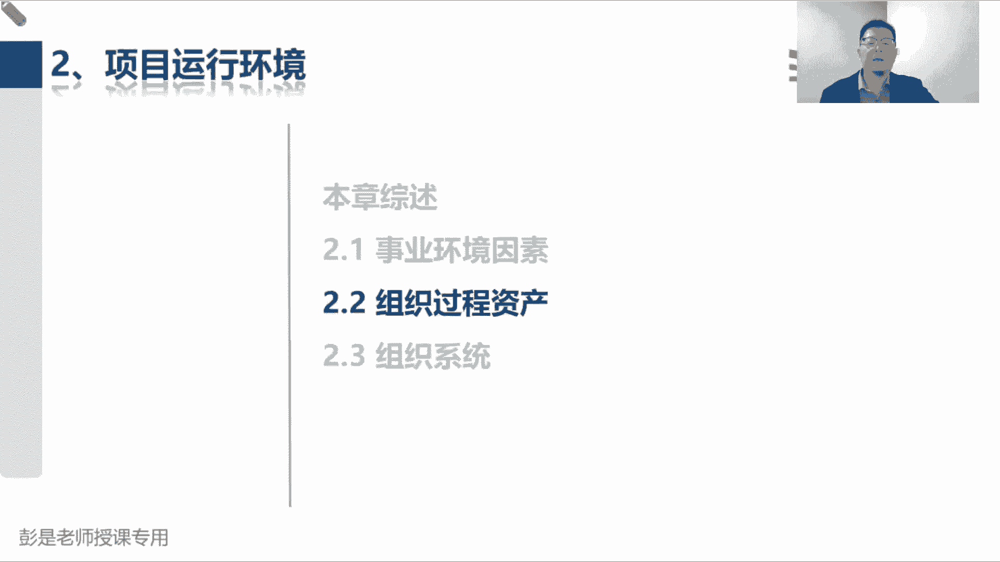

资产是执行组织特有的并使用的计划过程，政策程序，支持股这些单词需要解释吗，这些单词需要解释吗，不同餐厅你的流程是不是不一样，有的餐厅啊是先交钱后吃饭，有的餐厅是先吃饭后交钱。

有的自助餐厅交完钱想怎么吃就怎么吃，有的餐厅啊，这只能吃这么多呀，大家的政策流程程序标准规范不一样的对吧，有些苍蝇馆啊，里面有什么头发啊，蟑螂啊，土豆丝啊，没关系，剪出去不耽误吃，吃不死人的。

那有的餐厅呢就需要高大上了，讲究这些东西啊，这些都叫过程政策程序标准规范，这是我们企业，根据企业的自身情况制定的东西啊，所以它叫企业的特产嗯，好最后再记第二个知识点，这个玩意儿既然是既然是既然是这句话。

这个东西既然存在于组织内部，是咱自家的东西，所以在整个项目期间，我们可以对组织过程资产，进行必要的更新和增补，既然是咱自己家定的东西，想改随时改，这也很好理解吧，知道了这个大方向之后。

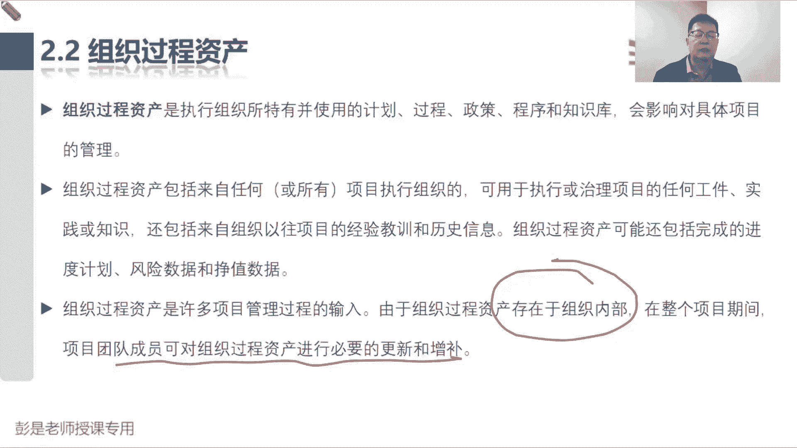

再看它具体包括什么内容，具体的内容和那个事业环境因素一模一样的啊，不要背不要背不要背，理解就可以了，组织过程资产分为两大类，过程政策程序，然后第二块就是知识库，那第一类资产更新通常不是项目工作的一部分。

而是PO或者是其他部门只能去完成，这句话变成人话，就是说呀你要想改你企业的流程，是咱自己说改就改了吗，还是说我们要发起申请对吧，你请假的流程，报销的流程，出差审批的流程，合同审批的流程，盖章的流程。

付款的流程，我们只最多最多最多就要发起申请啊对吧，所以它不是我们项目工作的一部分，不是我们份内的事情，我们申请对它进行更新，那谁来执行这个操作呢，所以通常是职能部门，就是相关部门，谁有权谁去改。

反正我们改不了，我们只能申请修改，那第二大类就是各种各样的知识库，这玩意儿就无所谓了，所以在整个项目期间，我们可以根据项目的情况，随时对它做更新，随它随时会对它做修改，这玩意儿通常不一定要限制。

要约束他啊，搞定这个知识点啊，如果还不好理解呢，你就看一看你的公司的OA系统，包括你的钉钉里面这些这些流程，这个流程你想改，你能改吗，你改不了，对不对，你只能走流程，发起一个修改的申请。

说老老大这个流程走不下去了，老大这个流程有bug，老大这个流程需要改进的发起申请，有相关的部门执行这个操作，好。

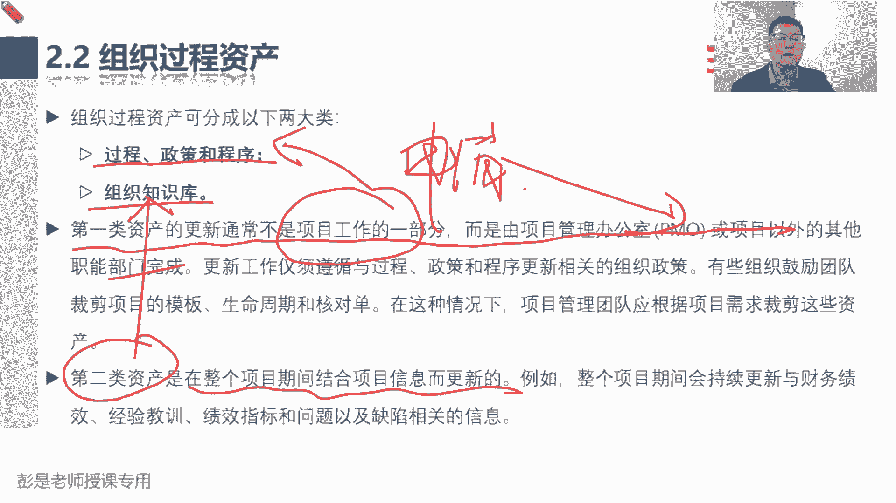

这就是组织过程，资产这两大块内容啊，然后再往下书上列出了一大堆具体的组织过程，资产在我们启动规划执行监控收尾的时候，都有什么玩意儿，这些玩意儿基本上都不需要大家去背，基本上不需要大家去背啊。

背下来也没啥用，所以这段内容呢大家就是看一遍，知道都有啥东西就够了，但是最后还要总结一个知识点。

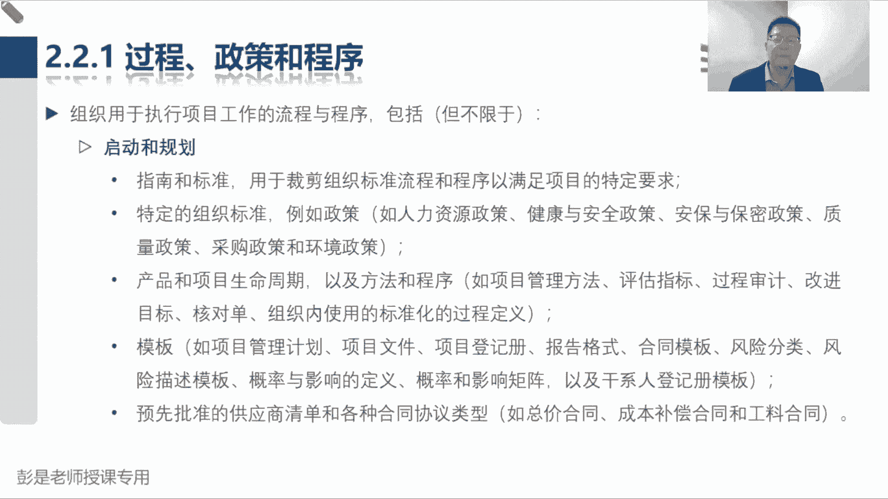

还要总结一个知识点啊，倒车倒车倒车倒车就回到这张图。

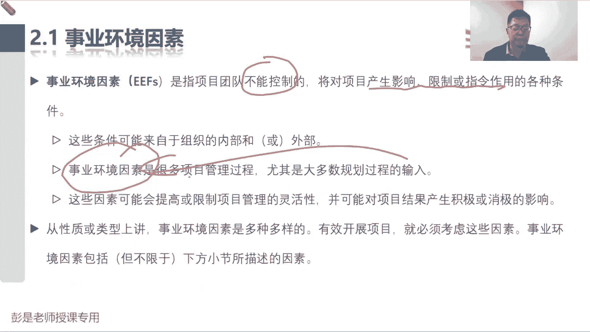

说组织过程资产是咱企业自家有的这些东西啊，是我们企业的，特产特有的东西，事业环境因素呢，通常对我们的工作形成限制和约束，那接下来带出来的这个知识点，组织过程，资产。

有没有可能也对我们的工作形成限制和约束呢，企业的一些什么政策，有没有可能也是一些强制性的规定呢，这也很正常吧，所以接下来这个话题，这个案例可能听起来就虐心了啊，鉴于今年的经济形势。

我们公司呢决定决定了制定这样一个政策，说今年呢在招新员工啊，今年才招新员工，985211本科生不要，我们只要硕士研究生，只要说是研究生或者博士研究生，唉这就是人事方面的政策。

他也会对我们的工作形成限制和约束，所以这种情况下，组织过程资产就变成了事业环境因素，这还能听懂吧对吧，就像大家公司里面，你出差有没有限制啊，能不能可能玩命造啊对吧，出差哎呀。

住五星级酒店干嘛坐飞机头等舱，头等舱啊，五星级酒店来个总统套房，包一天包一个月啊，不能这么造吧，出差有没有出差的制度，这个制度会不会，会不会对我们能够形成限制和约束吧，会呀对不对。

员工可能要做二等座对吧，经济舱，然后什么总监主管可能做一些商务舱，商务座对吧，老板老板，那你肯定头等舱啊，哎就这东西，所以概念是概念，但实际工作中他俩不不代表着非黑即白吧，不代表着说组织过程。

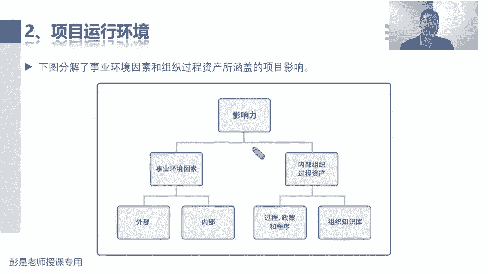

资产就不会对工作形成限制和约束，好知道这下竹青旅啊。

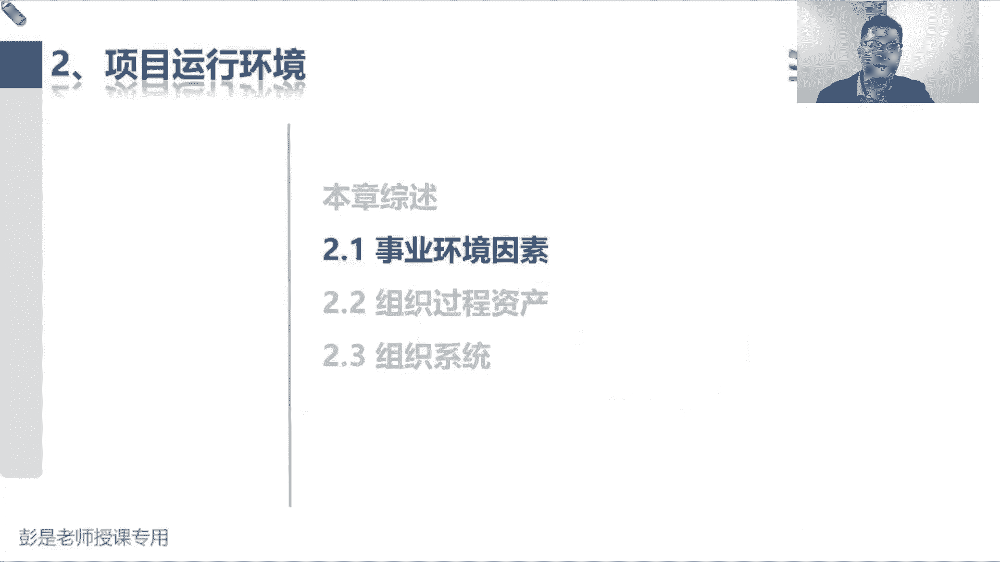

太惨了啊。

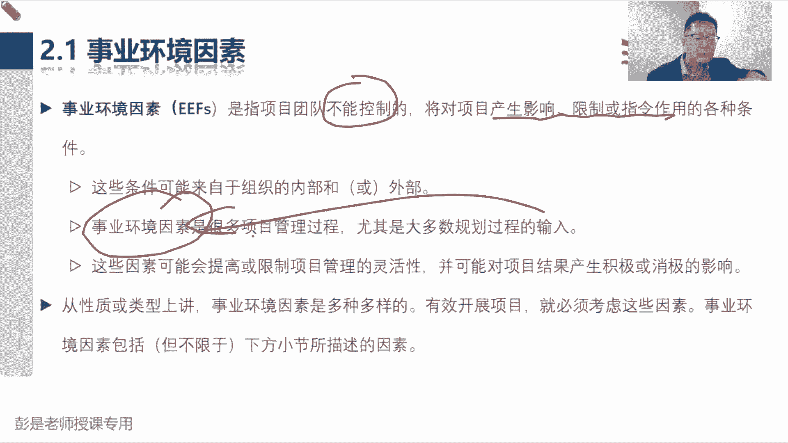

好，所以在前进前进前进。

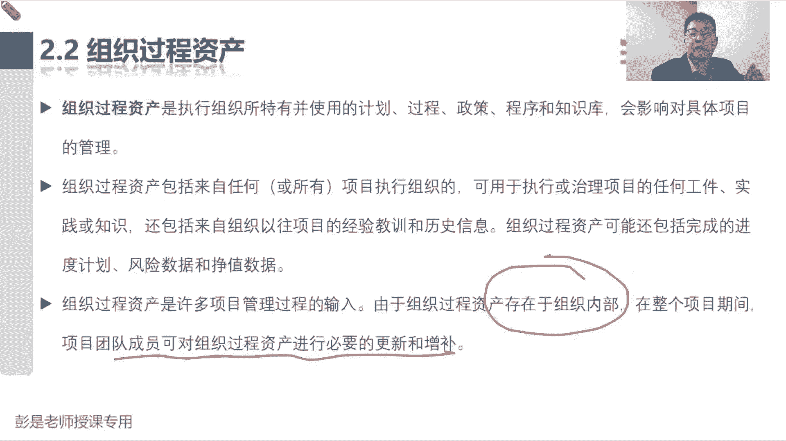

所以像企业的什么人力资源政策呀，什么健康和安全政策呀，什么安保和保密政策呀，包括什么环境啊，财务政策呀，采购政策呀，这些东西通常只能这么说啊，通常有可能会对我们我们的工作，形成限制和约束啊。

但是呢它又是我们企业的组织过程资产，那根据项目的实际情况，我们可以去申请对吧，打破这个规则呀，这是有可能的吧，我就我就功高盖主，我就觉得我比老板厉害，那我就申请老板啊，我出差就要住，就要坐头等舱。

你不让我坐头等舱，我就离职唉，这种情况下就有可能会改变我们的政策啊，随便讲个场景去理解这个意思就够了啊。

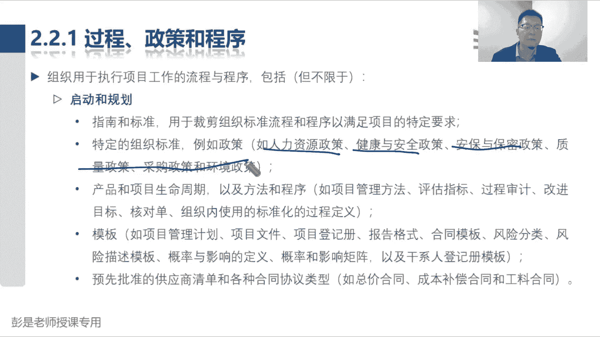

好后面这一大堆全都不需要去背了，都是理解为主，包括什么财务程序，财务政策也会影响我们的。

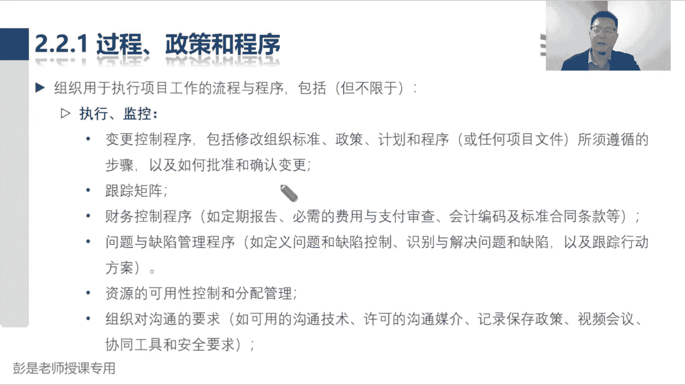

但通常通常通常不一定啊，好第二大块呢就是组织的知识库，组织知识库到底有什么东西呢，这玩意也不需要大家记住，记住也没用啊，从下往上能看懂就可以，什么以往项目的档案，纯粹的字面意思。

测量指标的数据库字面意思，然后问题和缺陷管理数据库字面意思，历史信息，经验教训知识库，字面意思，财务数据库，就是你一个人一天多少钱这种东西啊，只有这个玩意儿，可能大家不一定工作中会接触到。

所以呢需要单独讲一讲，这叫配置管理的知识库，配置管理，配置管理就记这两个字就够了，就是版本，就是版本管理，什么叫版本管理呢，什么叫版本管理，知道大家工作中有没有遇到过这样的困扰啊，写文档，写资料。

敲代码，画图纸可能就不断的不断的不断的可能会改吧，哎老板说第一稿告诉你，这这这这不太好，咱就改了，改了第二稿之后，老板又说，这这这这不太好，我们再改，这就是不断的迭代吧，老板又说，这这这这不太好。

我们再改，最后老板说还还不如第一稿，那这种情况下，我们是不是应该，把所有的所有的版本都给他存下来，就这个道理吧，给他把所有的版本都存下来，这就是版本管理，所以像你的文档啊，资料啊，图纸啊，敲的代码啊。

编译后的程序啊对吧，什么样的服务器配什么样的软件，这都需要讲究讲究吧，这个这个这个专业知识忘掉啊，不理解，忘掉它，什么手机装什么操作系统，这好理解吧，什么手机装什么操作系统，这也有，这也有讲究吧。

不能随便来啊，买个苹果手机出厂的时候，里面装的安卓操作系统，这也不好，对不对，这不是自己打自己脸吗，买的什么版本的手机，给你装什么版本的操作系统，这也有讲究吧，哎这都叫配置管理。

所以它非常广义的一个玩意儿啊，便于大家省事。

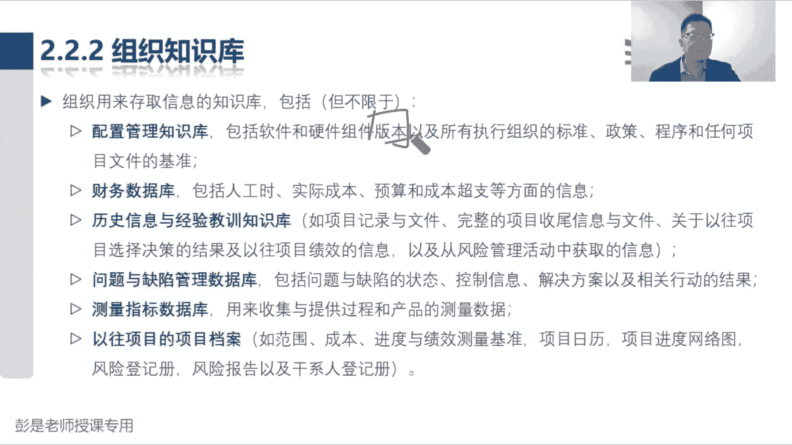