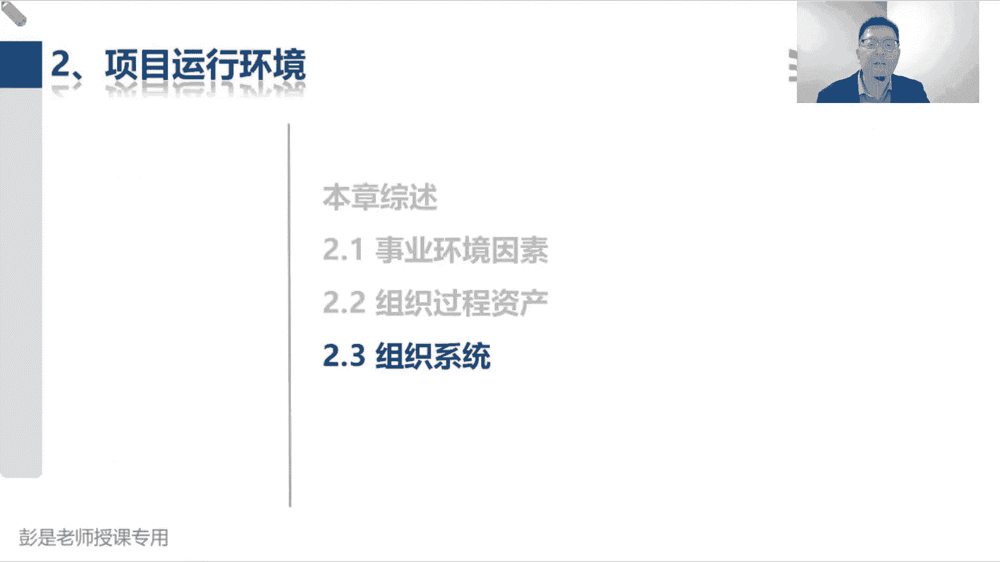
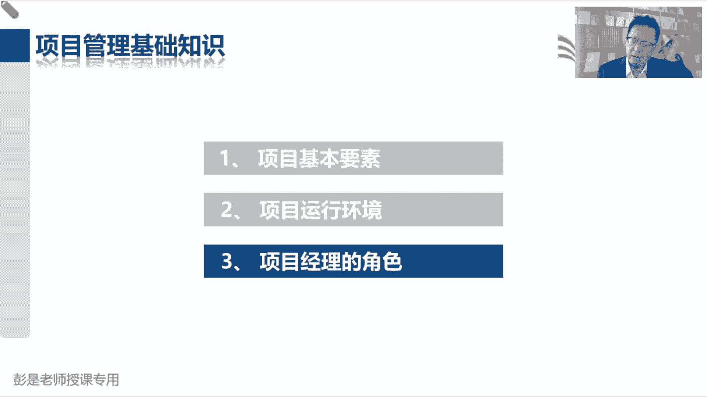

# 【新版PMP培训课程】2024PMP付费课程视频完整版免费观看，零基础通关项目管理考试！ - P14：2.3 组织系统 - 慧翔天地 - BV1Hu4y1a7hA

好2。3组织系统，组织系统这段文字啊也不好玩，超抽象抽象，咳咳，这段文字呢其实可以不看，其实可以不看的啊，我先给你讲大道理，咱先讲大道理，听完大道理再去看后面这堆破破烂的文字，可能大家理解起来会更方便。

所以接下来哇老师下线了，小玩笑啊，这是这叫画板，这叫画板，屏幕黑了，正常的啊，正常的正常的，不要慌不要慌，这是我写字的地方好，接下来这个大道理是什么呢，我们开公司第一第一，第一第一小段课程讲的内容啊。

开公司我们定目标，愿景使命价值观，然后做企业的战略规划之后呢，我们就知道项目是啥都有啥项目，我们就知道我们公司需要运营啥对吧，做牛肉面和做麻辣烫运营的工作不太一样，不太一样啊，然后又去发现呢。

我们公司啊有些事情存在着依赖关系，所以有了项目及金融管理方法，最后呢再以分析，为了确保我们能够实现战略目标，把符合战略的东西放到一个圈圈里，统一管理来排排序，合理的分配人财物。

所以有了项目组合管理这些方法，这一大堆就是知道了我们要做的事儿，那下一步要想什么了事，搞清楚了，接下来就开始搞人了吧，事搞清楚了就开始找人吧，我们需要什么样的人呢对吧，需不需要总经理呀。

需不需要董事会呀，需不需要什么各种欧啊，CEOCTOCIO什么COOCO各种O啊，嗨公司有多少个部门呐，配多少个人呐，配多少人呢，要不要有什么员工小组，主管经理总监，这叫定什么呢，定组织架构。

定组织架构吧，哎我们有保安一部，保安二部，保安三部，我们三个保安轮班，保证做到7×24小时的企业安全，我们有厨师，有厨师部，厨师布置，如果人太多，还可以再往下细分的，我们有人搞面点，有人搞凉菜。

有人搞热菜，有人搞酒水，饮料嘛，一直给推，我们还有服务部，还有什么收银部，唉，定组织架构，那组织架构定好了之后，是不是该出那一大堆东西了，大家干活，大家干活，不能各扫门前雪压，我们是个集体啊。

干活就需要流程，政策程序标准规范制度规章，就连游戏吧，那流程的目的，政策的目的是让大家知，让大家知道我们这个活到底怎么干，让大家知道客户下了订单之后，服务员负责干什么事，厨师负责干什么事对吧。

上菜员负责干什么事，洗菜的人负责做什么事情，收银员负责做什么事情，所以大家负责什么，就约等于权力的分配了，说清楚大家的工作的职权职责，这个玩意就叫治理，所以治理治理治理约等于权力的游戏。

说清楚我们企业怎么运转，规章政策程序标准规范，说清楚大家的架构，上下级关系，汇报关系啊对吧，你们几个厨师啊，向厨师长做汇报啊，厨师长好像总经理总经理都汇报啊，以此类推了吧，这个东西就叫组织治理。

所以它约等于权力的分配，约等于权力的分配啊，掌握到这个大道理，再看刚才树上这一大段好玩的文字。

好刚才知道了什么叫组织治理，那对项目来说也如此，项目经理啊，下面有我们的核心成员管理团队，再往下呢有我们的员工，那也要画层级，这个团队这个小组负责做什么事情啊，咳咳这个小组负责做什么事情。

以此类推了这个操作就叫项目治理，所以项目运行时，需要应对组织结构和治理框架带来的制约因素，告诉我们职责中责职权怎么分配，让我们知道我们的地位到底是什么，权力有多大，这就是组织治理和项目治理。

它重要的作用，这段知道这个结论就可以了，所以后面这一段就在说，治理是指组织各个层面，有组织的或有结构的安排，这么做的目的旨在确定和影响组织成员的行为，因为大家一旦确定了全，抱歉啊，各位同学稍等一分钟。

321好了，大家的权责一旦明确，一旦明确，我们就知道企业怎么运转了，就知道我们大家各司其职，应该怎么把这个订单给他消化完，结束完就这个东西啊，好谢谢啊，我已经吃了。

上午同学建议的什么银黄颗粒能管四个小时，五个小时好，所以后边这段文字全都不要背，并且呢想看就看，不想看可以不看了，治理是组织内行使，巴拉巴什么规则，政策程序标准规范流程制度，就这东西说清楚。

大家的全责后面都可以不看了啊，都可以不看了，因为写的超抽象，不好玩，也不搞，那就直接找到这张表，直接找到这张表，涉及到这个知识点，需要大家掌握的这张表啊，咳咳告诉我们这么几个术语，第一行单独记。

有一点点印象就可以了，因为后面讲到敏捷的时候，还会再说的叫系统型或简单型，它的特点是什么呢，人员并肩工作，什么叫人员并肩工作呢，就是大家都是兄弟，没有上下级平起平坐，平起平坐，所以它通常适用于什么呢。

创业型的组织嗯，创业的时候啊，咱都是什么合伙人，都是合伙人啊，大家都是好兄弟啊对吧，然后我们都是同级别的人员，平起平坐，通常适用于这样的场景，知道这两个结论就够了啊。

然后再往下再往下就涉及到这么五个单词，叫职能型组织结构，弱矩阵组织结构均衡也称之为平衡组织结构，强矩阵组织结构和项目导向型项目型组织结构，这五种组织结构大家需要掌握到什么程度呢，再看我给大家画个图。

智能型，然后矩阵型，矩阵型又分三种，弱矩阵，平衡矩阵和强矩阵，再往上呢就叫项目型，这五种组织结构，项目经理在里面的区别是什么呢，就是权力从小到大，能掌握的资源从少到多，权力越大，掌握的资源就越多呀。

那在职能型和弱矩阵前两种组织结构之中，通常啊是职能经理说了算，在弱矩阵和职能型这两种组织结构之中，通常是职能经理负责项目中的课程的这一部分，他说了算，项目经理呢通常通常通常就是打配合。

更像叫联络员和协调员，我们没有决策权，没有决策权啊，说了不算的，没有决策权的，我们就没有办法承担最终责任，所以咱就是个就是配合人家干活的这么一个人，还没权利，所以呢即小于号。

我们在项目上的权利小于职能经理，平衡矩阵呢就是等于号，项目经理和职能经理双方联合掌握，混合掌握项目的预算，谁手里有了钱就说明有了权，手里有了权就掌握了钱呢，所以划等号，项目经理和职能经理旗鼓相当。

平起平坐强矩阵，项目经理单独掌握项目的预算，所以在项目上的权利，项目经理大于职能经理，咱一个人说了算了，最后项目型的特点是什么呢，就是项目经理呀，直接管理职能部门，把职能部门就归到项目组里面去了。

诶这是这五种组织结构类型，需要大家掌握的，小于号等于号大于号，还有最后的只管，并且在前四种组织结构之中，说我们这个项目组啊，一旦散伙，大家是回到各自的职能部门的，就是记各回各家，各找各妈，各回各家。

各找各妈，对不对，那项目型这种组织结构让大家看一看，你身边什么修地铁修路，这个项目团队，一旦一旦这个项目结束，这些工人去哪儿呢，没地儿去对吧，尤其是这些施工的人员吧，没地方去呀，他没有公司。

没有部门可以回啊，他就无家可归了，除非去一个新项目，除非前往一个新项目，这是项目型组织结构和前四种组织结构的区别，就记到这个结论基本上差不多了，好根据这个中心思想啊，咱再回到教材上去看这张表。

这张表啊，它里面所有的内容也不需要大家去背下来，就记刚才那个结论没，在职能型组织结构，职能型组织结构之中，项目经理啊基本上没啥全，基本上没啥全吧，我们也基本上没啥资源，谁说了算呢，智能经理说了算。

然后呢，在弱矩阵组织结构之中，我们的什么决策权资源可用性都少得可怜的，仍然是职能经理说了算，所以呢这两种组织结构，我们在项目上的权利小于小于职能经理，然后平衡矩阵，均衡矩阵就是等于。

因为双方混合掌握项目的预算，然后强矩阵项目经理单独掌握项目的预算，项目型的就是我们直接管理的职能部门嗯，就记到这样一个结论，记住那几个大于号，小于号等于号就OK了，权力就决定了我们掌握资源的多少。

权力就决定了谁管钱，这能听懂吧，权力就决定了谁管钱对吧，在我们家可能我媳妇管钱，那人家手里面就大权在握，我说了不算的好，这是这集中组织结构类型以及对应的知识点，然后那个混合型啊，可以可以不看什么虚拟亚。

可以不看PMO，可以不看，后面会单独讲的哈，等会儿啊，马上下课了，各位亲坚持一下，后面什么235啊都可以不看了，236，咱下次上课讲pm其实就一小段，很快就讲完了，这三种类型，下节课再讲吧。

今天时间不早了，不太耽误大家的时间了，下课也不着急，慢慢的温水煮青蛙呀，今天第一次上课不易不易，拖堂太久好，各位同学听课的一天，辛苦了辛苦了，然后今天课后作业的任务是什么呢，其实那个练习题想做就做。

不想做也不着急啊，因为我们第一部分还没讲完，但是一定要做的事情是什么呢，在结合到今天的课程回顾，已经讲完的内容去看教材，看教材，看书非常非常重要啊，看的越多，概念越熟悉。

越多的速度和效率才越会越来越高啊，题会有的会有的，但是现在不着急刷题了，因为大家知识点没讲完，你现在去刷题的话，可能所以信心受挫，好多题没讲到的，不需要看第六版教材啊，看通关宝典就可以了。

所以今天给大家留的课后作业，就是下次上课之前看书看书，回顾已讲完的知识点，这叫复习，除了复习，还可以考虑做预习预习，预习预习就是预习整合管理，预习范围管理，班主任会在微信群里面给大家发通知的。

听班主任的通知就可以了哈，看回放等于看书了哎，性质不一样的，看纸质的书和看电脑屏幕效果不一样，最好最好最好看纸质版，好没带通关宝典的，没带通关宝典的同学啊，建议先看第六版，直接看第七版就把你干蒙了。

建议先看第六版，今天讲的内容大部分都是第六版的，前三章内容，好各位同学听课，辛苦了辛苦了，稍后关注一下微信，班主任微信微信群里班主任发的通知啊，然后做题什么模拟考试综合练习，这些题没题，班等通知。

班主任让做啥就做啥，班班主任让干啥就干啥，班主任不说做题，咱就先不用做，不着急做，没有说咋办，问班主任私信班主任的，班主任会告诉你的，好，各位同学听课，辛苦了辛苦了，下次上课再见，下次上课几号啊。

我也我也记不住啊，拜拜拜拜拜拜，转战微信群，转战微信群啊，预期内容班主任会发通知的，会发通知的，早上好，早上好，早上好，早上好，早上好，各位同学，我们在等15秒，即将开始今天上午的课程。

用电脑不能显示画面的不行，用电脑登录手机微信，那用电脑登录电脑版的微信，然后在微信聊天界面里面打开这个链接，试一试呗，好早上好，早上好，还有五秒钟即将开始今天上午的课程了，大家早上好，54321。

好各位同学大家早上好，咱们正式开始今天上午的课程，上节课讲到了235组织架构，组织架构这段文字啊，快速回顾一下上节课说了什么知识点啊，是说在有的有的企业里边，项目经理可能需要很小的权利。

在某些情况下需要给项目经理很大的权利，哎所以呢就有了组织结构类型，根据项目的规模和复杂程度来分析，应该给项目经理多大的权利，那通常呢在职能型组织结构之中，项目经理基本上没啥权，好一点的叫弱矩阵组织结构。

项目经理呢可能有了一定的协调权，但总之无论是职能型还是肉矩阵，项目经理在项目上的权利基本上等于零，因为这两种组织结构啊，都是职能经理分别负责各自在项目中的一部分，职能经理说了算，项目经理更像是联络员。

协调员，只有从平衡矩阵开始，项目经理在项目上的权利，和职能经理旗鼓相当诶，双方混合掌握项目的预算就是等于号了，然后还有一种组织结构呢叫强矩阵，在强矩阵组织结构之中，项目经理单独掌握项目的预算。

所以呢咱在项目上的权利就大于职能经理，最后呢就是项目型，项目型呢是项目经理直接带着一大堆职能部门，咱们直接管理着职能经理，这是咱们的组织结构类型，然后2。3。6来了一个新的单词叫PMO，项目管理办公室。

它的定义读一遍就可以了啊，项目管理办公室是对和项目相关的治理过程，进行标准化，并促进资源方法论，什么工具基础，什么叫共享的一个组织，总之人家的主要工作是项目管理，去想办法，想办法。

让我们项目管理的过程更加标准化，更加的规范化，这是人家的主要工作重心，所以人家人家叫项目管理办公室啊，除此之外，树立什么资源啊，工具啊，技术共享诶，这种资源的共享，什么技术的共享，就是在项目之间。

可以在多个项目之间去帮助我们去进行，这样这方面工作的这方面事情的协调，这是人家的主要两个工作，第一重要的工作工作重心是项目管理，第二个是项目之间，项目之间的什么技术共享啊，资源共享啊。

甚至项目之间的协调啊，还可以找PO给我们提供相应的支持，那一定要记住的知识点就是PO常见的三种类型，他说PO有几种不同的类型，他们对项目的控制和影响程度各不相同，例如知识性PO知识型。

PO担当顾问的角色，向项目管理提向项目提供模板，最佳实践培训以及什么信息经验教训，这看不懂啊，再往下看，控制型，控制型PO不仅提供项目支持，而且呢通过各种手段要求项目服从，就是说呀项目经理管项目。

需要听PO给出的这种标准化的方法，需要参考PMO给出的标准过程，政策程序规范，听人家的，按照人家的要求去干活，那指定型的特点是指令行直接管理和控制项目，所以对一些企业成立了指定型的PO之后。

它通常把项目，它里面有一大堆的专业的项目经理啊，PO的项目经理直接管理企业，大多数的项目，有一些小型的项目可能就交给职能部门去完成，但大部分的项目可能就是DMO里面的项目经理，直接管理，唉。

这就是支持型控制型，止运行权力从小到大这样一个变化的过程，所以这三种类型啊大家完全可以带入场景，就简单粗暴理解一下对吧，我们公司我们公司没有PO从0~1，我们要成立一个项目管理办公室，这种情况下。

我们成立的办公室啊，可能没有啥底气，咱就支持行，我们给公司各个项目提供支持服务，包括模板啊，培训啊，什么过程啊，方法呀，诶人家爱听不听，咱没有底气啊，没有权利要求人家服从规定的，然后随着工作的开展。

慢慢的慢慢的咱接触的项目多了，咱经验丰富了，我们就可以给出相关的标准，政策程序规范，让人家听我们的，让人家按照我们的要求去开展项目的管理工作，然后在做大了以后呢，我们这招招一大堆专职的项目经理。

直接管理大多数的项目，小项目可能交给职能部门自己完成，这就变成了指定型，所以他就是权力从小到大这样一个变化的过程，记住这三种类型就可以了，嗯好后面这段文字888咱就不念了啊，这段看看看一遍。

知道咋回事就行了，再往下，为了保证项目符合组织的业务目标，包括提出建议，领导知识传递终止项目，根据需要采取其他行动，还是另一套东西吧，给我们提出合理化的建议和见解，然后呢在某些情况下可能做决策。

然后呢领导知识传递啊，就是做好我们知识的知识的知识的沉淀，总结积累，甚至包括公共知识的交界这种东西啊，好这都看就可以了，没什么需要记得，然后再往下PO的一个主要职能，是通过各种方式向项目经理提供支持。

这些方式包括但不限于，这段文字就是在刚才的基础之上又做了个细化，对吧，他工作重心肯定是项目管理的方法，第二块工作内容呢，就是项目之间就记这两个词就可以了，所以你看它识别和制定项目管理的方法。

最佳实践和标准指导辅导培训和监督，这不还是方法论嘛，对不对，通过对项目审计，通过对项目审计监督，对项目管理标准，政策程序和模板的遵守程度，这个单词先标一下，因为未来咱们会学到呃，质量审计，采购审计。

风险审计可能会有各种各样的审计这样的单词，那审计最重要的作用啊，就是就是合规性，检查我们的项目管理标准，政策程序和模板的遵守程度，就是看看咱合规不合规对吧，所以你可以有各种各样的审计，审计一个过程。

审计一个我们实际中实际工作中的过程，去看看这个实际的过程，它是不是符合相关的标准政策，程序规范来检查这个东西的合规性，就这玩意儿，所以大家也听到了什么财务审计对吧，质量审计大家在工作中可能会接触到。

如果工作中接触不到呢，你会你会看到新闻新闻啊，什么中央审计组到处巡视，对不对，看看这个企业，还有你们从日常日常工作里面合规不合规啊，有没有违反什么八项规定啊，有没有违反中央中央这些国家体系相关的标准。

政策程序规范的事情呢，这就是审计的最重要的作用，检查合规性，发现一些什么差距，缺陷和不足，再看看有没有什么最佳实践，然后呢，以便于对我们的实际过程进行不断的改进，确保它符合要求。

这个单词可能会从从现在开始啊，我们会看到很多遍了，好再往下制定和管理项目的政策，巴拉巴不电了，对什么什么全部项目的共享资源进行管理，对跨项目的沟通进行协调，这都是在说项目之间的事情，项目之间的事情。

所以项目管理的边界一定要清楚啊，再回顾一下上节课讲的这几个单词，说需求评估，商业论证，效益管理计划的制定，这事跟咱没关系，这事通常是发起人最高，作为一个项目经理呢，咱的主要工作是完成任务，实现目标。

得到期望的成果，所以项目中间过程项目经理负责，然后项目结束以后，运营这事跟咱没关系，我们可能会参与到运营之中去，验证有没有实现目标效益，但运营不包括在项目范围之内，那PO能干什么事情呢。

就是两个项目之间的协调，两个项目之间的协调，不管是什么东西的协调，不管是协调什么事情，嘿，这已经超出了项目经理的权力范围，这个事可以找PO给我们提供相关的支持，相关的指导，所以这一大段文字很重要。

但其实总结就可以了哈，第一就是项目管理的方法，第二个就是项目之间的事情，它可以帮助我们去协调，去促进好，所以做了这一小段这个小知识点和练习题，看看这道题选什么，啊哈，有同学，选B和选D的同学三思啊。

选C的同学三思啊，这种题完全用，完全不知道知识点的情况下排除都可以吧，对话说，某组织内的办公室政治，曾对之前的项目造成负面影响，为防止办公室政治影响当前项目，项目经理开始时应该怎么做呢。

就是以前办公室政治，什么叫办公室政治呢，就是权力斗争这种事情对吧，私结营党，拉帮结派这种事情对项目产生过影响，那现在怎么做呢，A上高级管理层寻求帮助，B推荐一个具有实际能力的新项目经理，处理办公室政治。

这肯定不行吧对吧，找了一个人搞了一个事情，办公室政治，这个事我们有没有权利去处理这个事情呢，不可能不现实，对不对，所以B肯定不行啊，C聘请一名第三方的项目经理，来避免组织内的政治，我干活。

这活可能有问题，我再招一个别人干，这也不现实吧，怎么可能让别人取代我呢，哎就像MC同学说的啊，然后让干系，因为项目选择合适的项目经理排除掉了，所以最后最合适的选项就是A。

因为这个事已经超出了我们的权力边界，对不对，咱管不了了，管不了了，可以找具有更大权力的人去寻求帮助和支持，比如说发起人，比如说PO，比如说项目及经理，项目组合经理或者甚至是合适的高级管理层。

所以这道题建议的答案就是A，一定要用全力去判断这个事情，我们能不能做出这个主啊，能不能做这个决策好，再往下看看，这道题，选C吧，还选B的同学，慎重啊慎重啊，说一个建筑的项目经理。

发现他所在项目所在地附近，正在新建一条新的水管线，公司政策要求，在他的团队继续完成这个项目之前，必须先填写一份有关城市环境变化的表格，看好这是什么情况的例子呢，公司政策，这是个什么鬼，公司政策要求。

必须填写一份有关城市环境变化大表格诶，他对我们的工作形成了限制，对我们的工作形成了限制，形成了约束，所以呢他就是一个事业环境因素，那这种题啊，如果加选项的话，如果我加选项啊，我加一个E选项。

组织过程资产，选什么呢，这种情况下，公司的过程政策和程序，它又属于他，他是组织过程资产，然后必须先做一个什么什么环评的表格，他又是对项目形成了制约，优先选哪个呢，这个公司的政策，公司的政策呀，标准啊。

过程啊，文档啊，历史资料啊，模板啊，他确实是组织过程资产，但是呢这个组织过程资产，又对我项目形成了约束，又同时是事业环境因素，优先选哪个呢，可以仔细想一想，稍稍的啊，那这种情况下。

其实考试不太会出这么纠结的题啊，这种情况下你更看更更侧重于看它的哪个属性，第一个属性是我们公司特有的，第二个属性会对我们的工作形成约束，更关注的是限制吧，哎所以这种情况下仍然建议选事业环境因素。

仍然建议选C啊，如果是多选就不用纠结了，多选就可以全都选上了吧，他既是组织过程资产，又是事业环境因素，就永远找一个相对来说最合适的选项，仅此而已啊，好再看看这道题，刚才带着他带着各位同学复习了一下哈。

说什么什么弱取阵，组织结构只能行组织结构，咱做不了主啊，咱说不了算了算，职能经理负责项目，既然是职能经理负责项目对吧，谁有权谁背锅呀，谁有权谁背锅巴，哎这场HQT同学说的啊，咱争取争取不考虑实际情况。

一定是权责要对等，考试的时候一定是这个出发点啊，权责要对等，有权利我就背锅，没权利我就不背锅，所以哪个说法不成立，弱矩阵的组织结构之中，成员向职能经理报告，这是对的，咱并不直接直接负责资源，这是对的。

职能经理负责呀，职能经理做出的决策可能会影响你的项目，对了，人家的权力比咱大，所以呢D选项不成立，我不对项目的成败负责，因为没啥权利，没权利咱就不背锅，对不对，承担不了这个责任呢，咱争取争取所有的题。

所有的场景权责是对等的啊，好再看看这道题，这道题相对来说比较简单吧，只要读懂题目，知道啥意思就可以了哈，54321，恭喜大家答对了，所在项目实施的过程中，在你不知情的情况下，两个成员被职能经理。

调往另外一个开始的项目上去了，给咱项目实施带来了很大的麻烦，然后所在的组织结构类型市场，就卑微哈开总结的非常到位了啊，就是卑微，咱都咱的人家都没必要通知咱，人家都没必要通知咱。

所以呢就显得咱没有很大的权利，换了人，你不知道代表你无权哈，就这个道理，然后有些同学问啊，D选项是什么鬼呢，紧密型矩阵的没有这种组织结构类型，没有这种组织结构类型啊，这是一个忽悠忽悠人的单词编出来的。

以前PMI老师出题的时候，非常非常喜欢编一些不存在的术语，忽悠人呢，然后那个紧密型矩阵的，它实际上指的未来我们搞团建的时候，它指的一种方法叫集中办公，它实际上指的是指的是大家在同一个地方干活，集中办公。

在同一个地方开展工作，就像那个打仗的时候，那个指挥部对吧，所有的核心成员我们都在同一个房间里诶，他指的是那个那个建设团队的方法，它不是组织结构类型啊，比较有迷惑性啊，好再看这道题。

在下列哪一种组织结构之中，项目成员在收尾的时候最忧心忡忡嗯，选出答案要稍稍问一下自己啊，为什么，为什么对吧，这地方施工这地方施工，我来了，然后呢，我来帮你打地基，搬砖头，然后施工结束了就就没地儿去了吧。

哎去除非去一个新项目，除非去一个新项目，项目结束，团队散伙，大家无家可归，所以在这个阶段，大家会感到很担心，能想到这个知识点，OK了啊，好再往下我们看这道题，项目管理办公室。

对项目结果负有直接或间接的责任，以下哪一项不是PO的主要职责，千万不要看错啊，问的是不是，选ABC的同学三思啊，慎重啊，不要中招啊，问的是哪一个，不是PO的职责，PO3种类型，支持型，控制型，指令型。

对不对，权力从小到大呀，除此之外呢，除此之外啊，人家还可以做项目之间的，一些事情项目之间的沟通，项目之间的共享资源，项目之间的什么共享技术之间这种协调啊，哎所以A选项给项目提供行政支持服务。

这是PO的职责，所以他不是答案B选项，指导培训指导和辅导项目经理，这是PO的职责，所以呢他不是答案对不对，不管是支持型，指令型控制型，它主要工作就是项目管理的方法，包括方法的沉淀，总结积累。

包括方法的制定出我们相关的标准，政策程序规范，包括把这些方法也可以标准政策程序规范，给项目经理提供支持，提供培训，C项目之间的人员协调，这是pm的职责，所以啊他不是答案。

最后呢D制定项目干系人之间的沟通计划，这一看通过我们那个边界就可以判断出来，就想着四个圈带一个方块，这玩意一看就是项目边界之内的事情，对不对，项目边界之内的事情了，那肯定是项目经理去主要负责这个事情了。

所以答案是D，好再看看这道题，max同学，关键词找错了，马克思同学关键词换一个，直接管理唉，直接管项目，直接管项目，这种呢就叫指定型，对不对，然后支持型给我们提供行政支持服务。

控制行要求项目经理服从他的管理规定啊，没有D没有D这种pm好，这道题，恭喜大部分同学答对了，正确的答案就是A说让找一个描述错误的选项，那A选项说的不对，知识型没有办法通过手段要求项目服从规定。

那BCD在这种这道题里边啊，B选项C选项D选项就是正确的正确的说法哈，既然是正确的说法，未来就像这样的题啊，大家复习的时候，那就把BCD仔细看一看，因为它是知识点，对不对，控制型通过手段要求服从规定。

这是对的，指令行直接管理项目，这是对的，然后呢权利从从大到小，从高到低就是指令型，控制型，支持型，看看这道题呢，控制型咳咳，控制形式说我出标准，你们按照我们这个标准去干活，但是我直接不直接在项目实力行。

是下面有专业职责，项目经理直接管项目，好54321，这道题比较简单啊，说丹尼尔是一个工厂建设项目的项目经理，最近加入了一个组织，然后呢，没有并没有完全了解这个组织的文化和结构，为了管理他的项目，干系人。

必须更好地了解他们，以下哪一个可以为丹尼尔提供一些，有关干系人参与先前项目的历史信息，所以呢就选，第一把就是第一个吧，关于这个组织过程资产的，基本上也就考到这种程度啊。

就是说如果就给大家大概再总结一下啊，如果说现在我现在想说，哎我现在要考虑考虑啊，怎么让问题少发声，少出现，我们就以史为鉴，参考我们的组织过程资产，看看前辈们踩过的坑，那如果现在吧我遇到问题呀。

总结经验教训，更新到组织过程资产，现在我遇到问题，总结经验教训，更新到组织过程资产，这么做的目的是什么呢，是为了防止未来，对不对，前人栽树，后人乘凉了，是为了以后啊，防止以后的人在踩同样的坑。

这就是组织过程资产，包括我们的经验教训，知识库这些东西，它最重要的一个价值，好看看这道题，恭喜大家答对了对吧，说巴拉巴拉吧，前面都是不念了啊，这个项目完成的时候，你要解散团队。

使他们能够参与到另外一个项目之中，哎那就是典型的项目型，对不对，如果项目结束的时候解散团队，大家回到各自的职能部门，这就是强矩阵对吧，他俩的本质区别就是这个这个东西好。

这就是关于第二章的第二第二第二小段，项目运行环境，事业环境因素，组织过程，资产涉及到组织结构类型，一大堆知识点，然后再加一个PO，那接下来各位同学啊。

