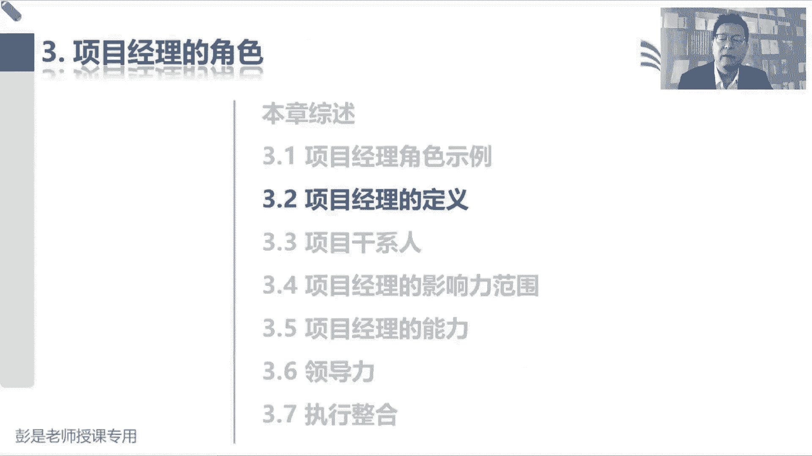
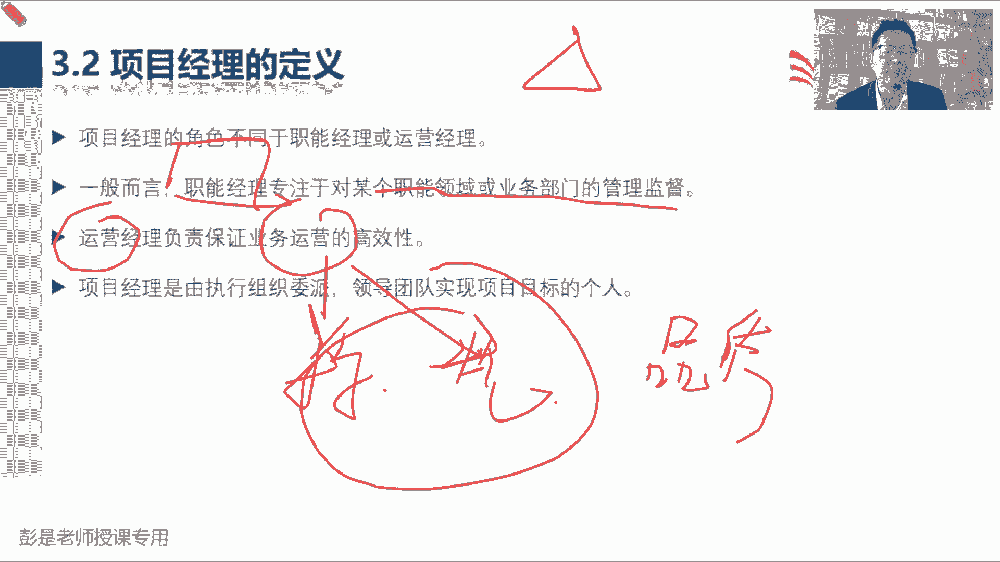
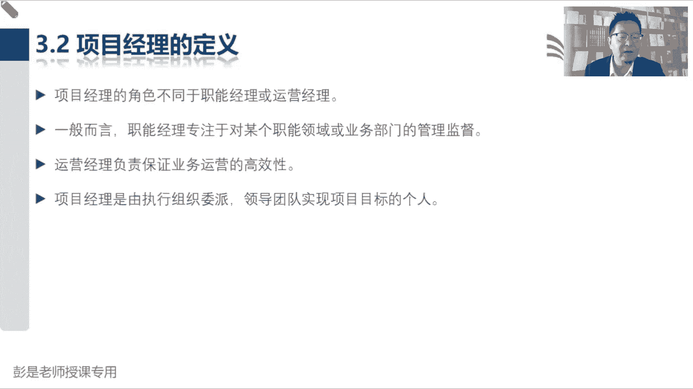

# 【新版PMP培训课程】2024PMP付费课程视频完整版免费观看，零基础通关项目管理考试！ - P16：3.2 项目经理的定义 - 慧翔天地 - BV1Hu4y1a7hA

然后3。2项目经理的定义。

这段字超少，就这么三个角色，这三个角色，并且呢我们在前面已经给大家铺垫过了，所以看一遍就够了，你也没啥可练的说，职能经理专注于某个职能领域的管理和监督，职能经理就是大家公司里面的财务hr。

采购销售市场营销哎，就是各个职能部门的管理者，这是各个职能部门的管理者对吧，对报到我们餐厅里面，餐厅我们的牛肉面馆就是我们的厨师长，我们的前台经理，大堂经理顶班，就这些人呐对吧，什么财务经理。

库存经理哎，他他主要是来自于各个职能部门，运营经理负责保证业务运营的高效性，就是我们的首席运营官对吧，什么COO这种东西啊，确保我们餐厅餐厅每个人来吃饭的时候，我们有人有人给人家点菜，有人给人家上菜。

有人给人家做菜，有人给人家擦桌子，有人给人家收钱，诶确保我们运营运营追求的是过程的标准化，规范化，运营追求的是标准化和规范化，为什么呢，就是啊标准规范，标准规范这个东西存在的最大的价值，最大的意义是啥。

大家可以想一想，十秒钟时间，标准化规范化最大的，最大的意义是什么呢，哎高同学说，同质化可持续减少风险，持续性，一致性，这几个观点是对的啊，标准化规范化的作用是，便于我们持续的稳定的产出相同品质的产品。

服务或成果，便于我们持续的持续的稳定的产出，相同品质的产品服务或成果，相同品质相同品质它可以干嘛呢，弥补能力上的不足，对不对，想一想前面有没有说过，就想想麦当劳吧，麦当劳为什么标准化规范化呢。

为什么可复制性强呢，他不需要我们的这些员工有很很卓越的厨艺，因为他的所有的生产的顺序，都是标准化的作业哈，哎我不会做饭，但是呢你按照人家的标准化的程序，12345就可以把美味的汉堡做出来了。

还追求的是我们生产过程的这个品质啊，好听一听这个道理啊，研发部门的经理是属于职能经理，还是项目经理的，研发部门的经理，他肯定是职能经理，只不过在某些情况下，他去管项目，他去负责项目，就变成了项目经理。

所以项目经理是角色，对不对，是角色呀，我们有一个项目需要有一个人去管理啊，任何人都有可能承担某个项目，担任某个项目的项目经理吧，好小张同学收到了一个开心的话题啊。

