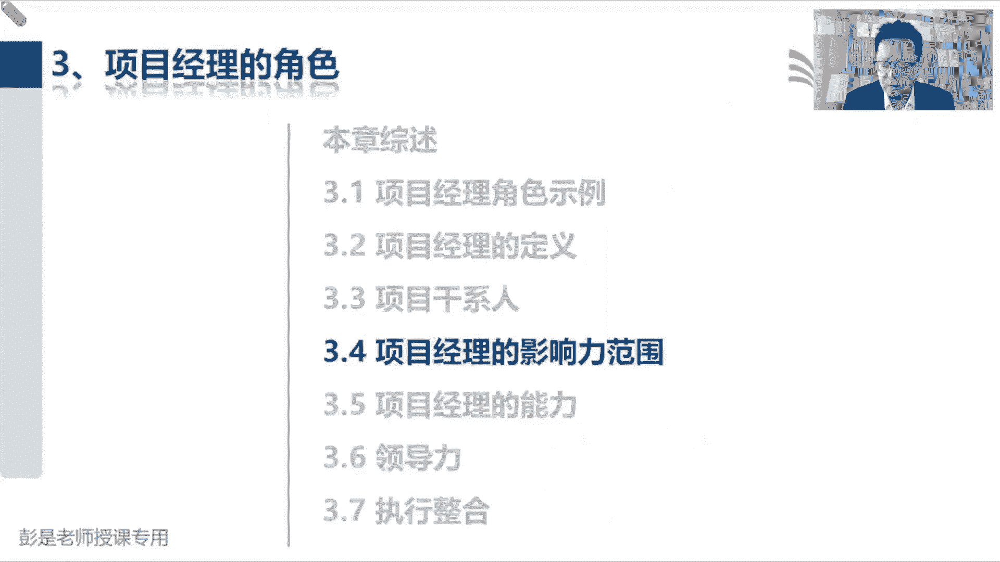
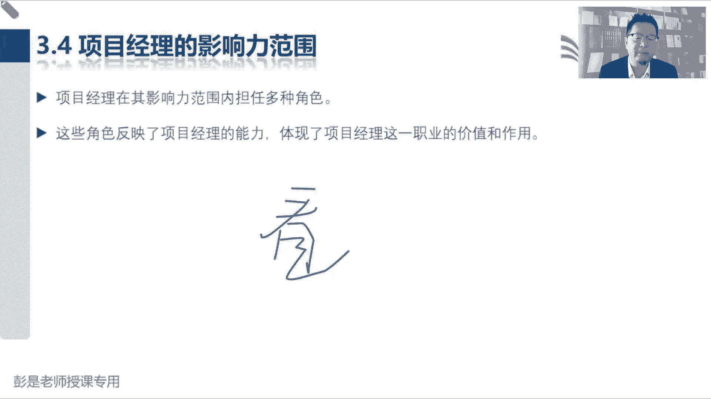
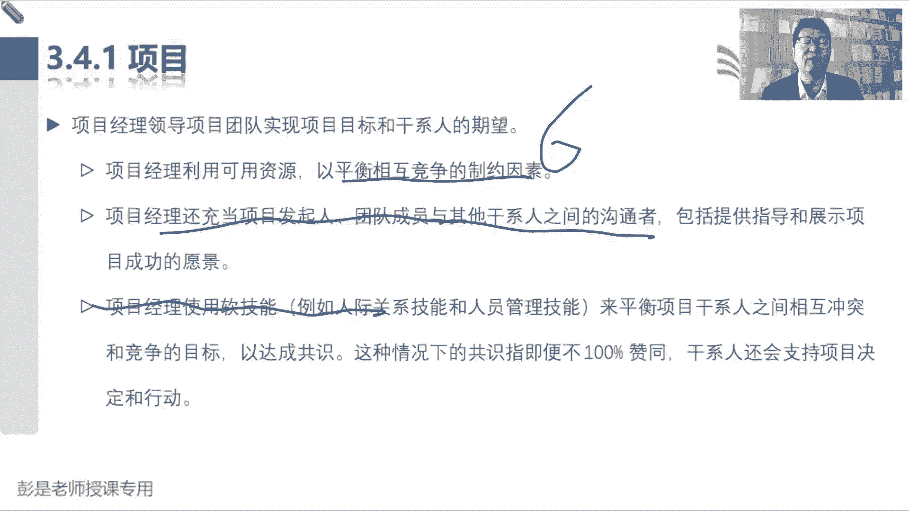
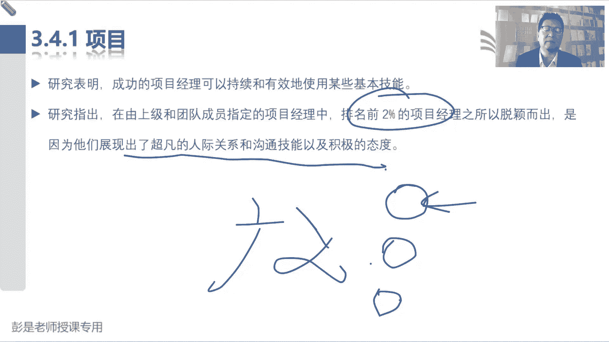
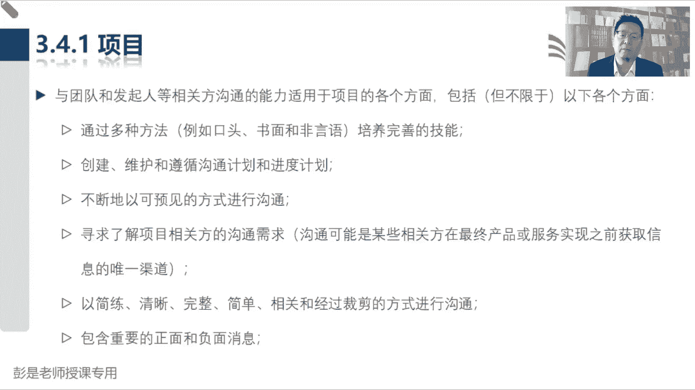
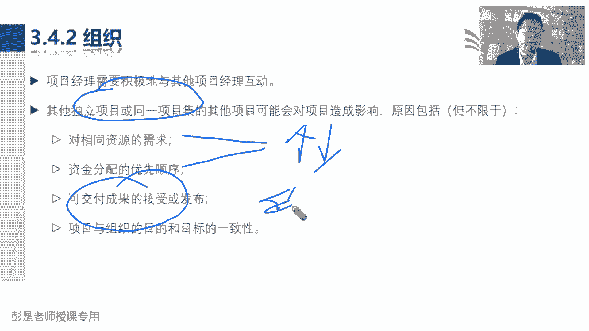
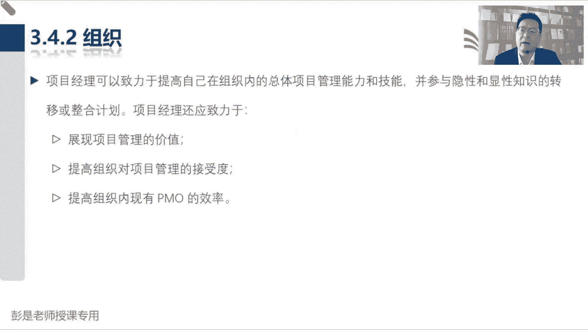
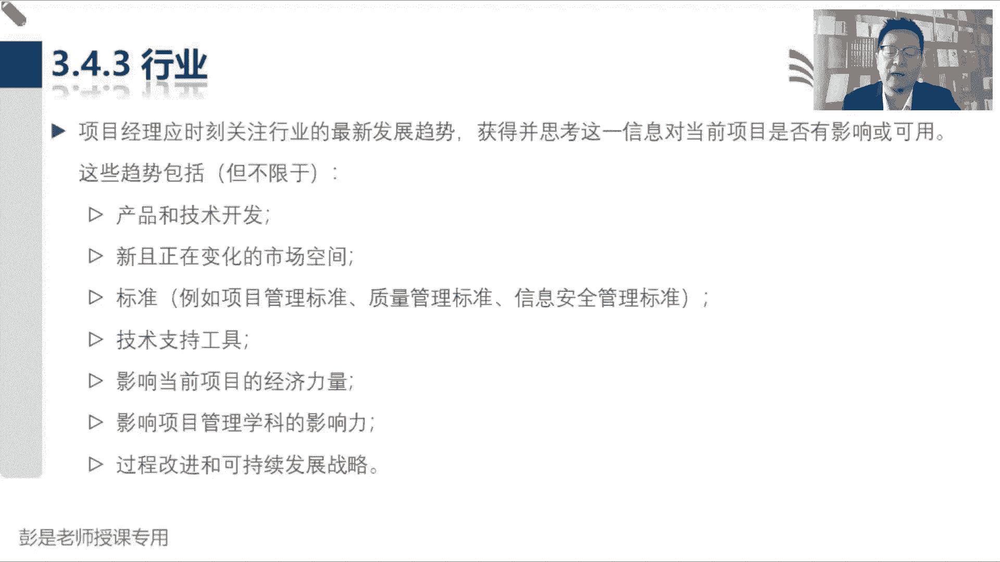
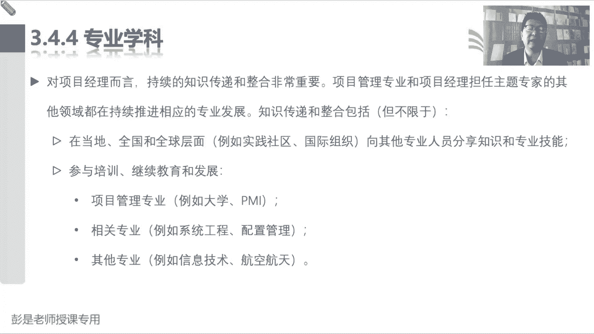
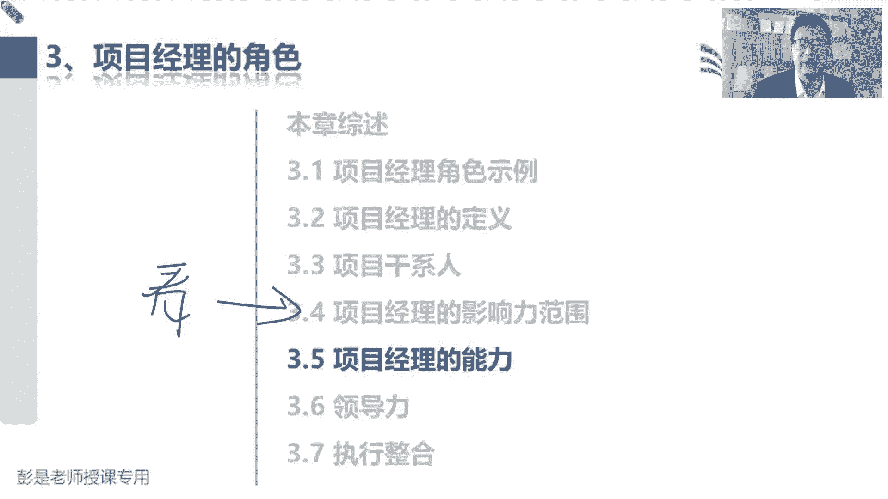

# 【新版PMP培训课程】2024PMP付费课程视频完整版免费观看，零基础通关项目管理考试！ - P18：3.4 项目经理的影响力范围 - 慧翔天地 - BV1Hu4y1a7hA

那3。4项目经理的影响力范围。

这段文字呢基本上也是大家看一遍就可以了，没有啥新的稀奇古怪的，重要的知识点，基本上以看为主。

能不念的咱就不念了啊，都是纯粹的字面意思了对吧，我们利用可用资源平衡相互竞争的制约因素，六大制约因素范围进度成本质量，资源和风险，然后呢我们是沟通的桥梁，对不对，然后呢还有使用软技能来让大家心心对吧。

心平气和干活。

这些都不念了，然后巴拉巴拉说项目经理的组织协调沟通啊，主要的工作就是沟通了，说顶尖的项目经理啊，顶尖的项目经理，咳咳就是软技能软技能卓越出色优秀，然后呢主要工作就是在沟通。

说项目经理内部团队也是相关方嘛，当然是啦，项目经理会不会影响项目呢，有没有收到项目的影响呢，对不对，所以干洗的，干洗的概念一定是非常非常非常广义的，不要再一个一个来确认了，说老师啊，张三是不是项目经理。

老师李四是不是项目经理，对大家结合刚才那个三个概念，你去想思考这个事情，项目经理受不受到项目的影响，能不能够影响项目呢，那他是不是项目经理呢，哎是不是该系人呢，肯定是啊。

不要一个一个去问了啊，嗯好再往下说，巴拉巴拉沟通。

这都不念了，看一遍就可以了，然后什么什么合并渠道这都不念了啊。

这都看一遍，看一遍看一遍就可以了，说我们还需要积极的和其他项目经理互动，和其他独立的项目，可能巴拉巴对相同资源的需求，资金分配的优先顺序，可交付成果的接受或发布，项目和组织的目的和一致性。

这段文字啊能想到能想到什么呢，项目之间项目之间的冲突啊，对不对，什么资源需求，资金分配，这玩意涉及到排序呀，还涉及到项目组合，项目组合管理了吧，或者是两个项目之间，它的成果存在着某种关联关系，依赖关系。

能想到项目集就可以了哈。

这段文字看一遍就可以了，然后巴拉巴拉巴拉不念了啊。

后面都没啥可重点关注的，大家基本上甚至都可以不看了，甚至都可以不看了啊。

好什么专业学科纯粹的这么一次啊，这是我们既要有管理上的通用知识，还要有当前当前所在行业，当前所在行业的专业知识吧。

这也不念了，然后跨领域纯粹是这个意思了啊。

这就是3。4，基本上这段这段内容，大家基本上就是今天下完课看一遍就可以了，看的目的是更好的熟悉我们听过的这些术语，更好的去理解，更好的更好的去去去叫什么，熟悉适应这种这种写字的方式。

这种写写写文章的方式啊。

