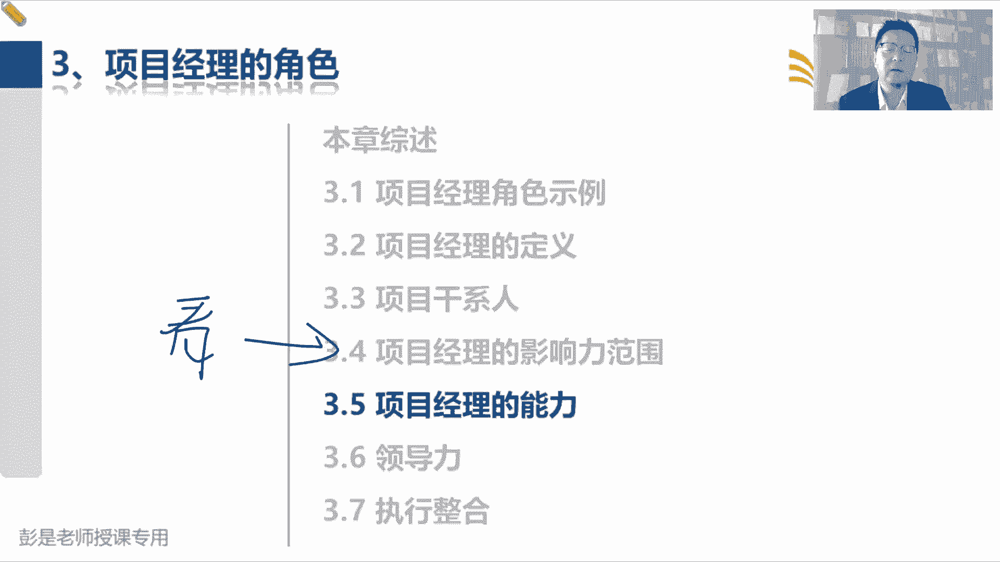
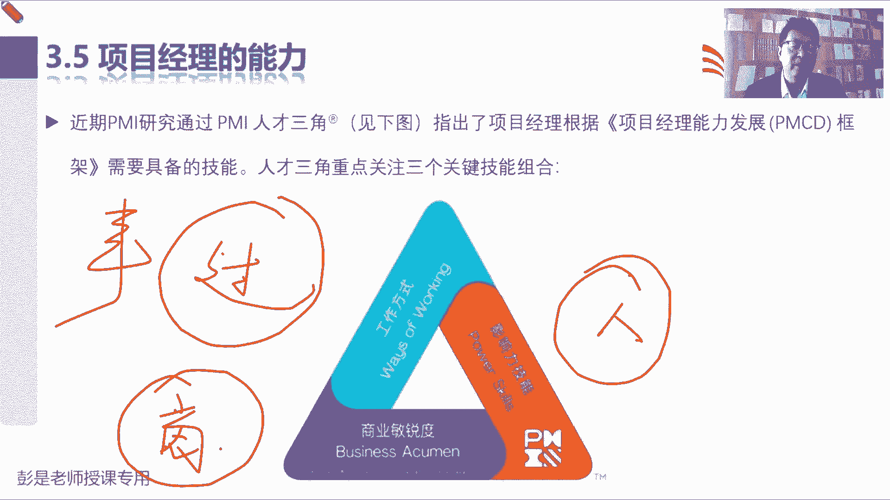
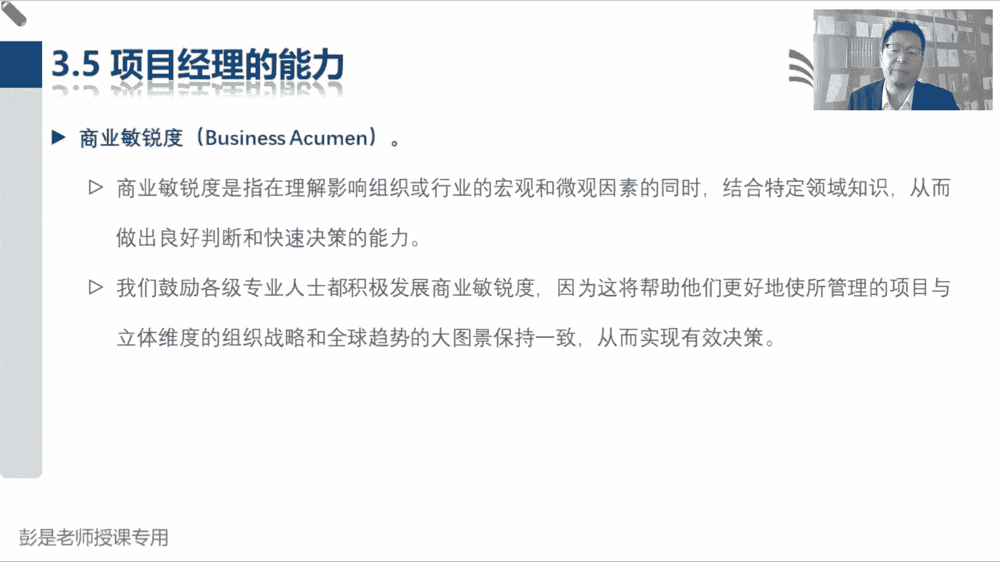
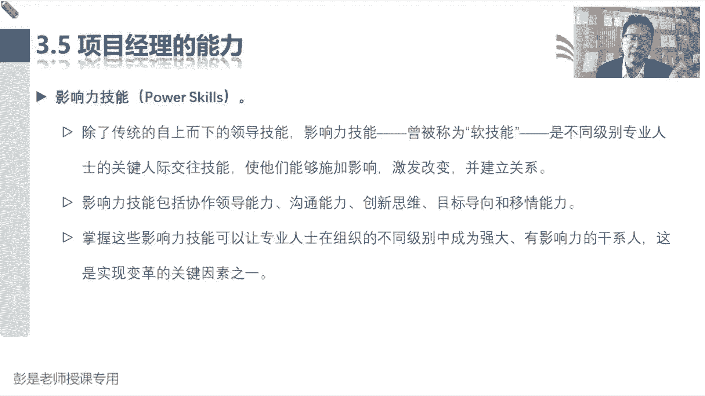
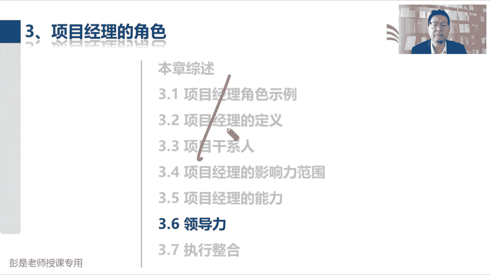

# 【新版PMP培训课程】2024PMP付费课程视频完整版免费观看，零基础通关项目管理考试！ - P19：3.5 项目经理的能力 - 慧翔天地 - BV1Hu4y1a7hA

那3。5项目经理的能力。

这段文字呢咱讲完大家都可以重大利好，休息一下了，所以呢专心听专心听，专心听，说一下，近期PMIPMI通过研究了，给出了一个pm的人才三角，这是项目经理能力发展框架，这是评价项目经理能力的高与低。

有这么一套东西，那人才三角重点关注三个关键技能的组合，第一个呢叫工作方式，第二个呢叫影响力技能，第三个叫商业敏锐度，大家只要大概能猜出来这三个单词放在这，想说什么意思，想表达什么意思就可以了。

嗯第一个叫工作方式，怎么能想到咱咱考试的时候，通过哪三个领域，来评价我们对知识的掌握情况呢，过程，人员和商业，环境吧对，咱们通过考试以后会咱们180道题，会从这三个领域评价，我们对知识的掌握情况。

就叫过程人员商业环境，其中过程占到大概40%左右，人员呢占占到百分大概40%左右，商业环境大概占比8%，所以PIPI这个人才三角就是在说，暂时在说啊，像我经理啊，我们的核心技能就这么三大块。

第一能不能能不能主打一个灵活灵活地，根据项目的情况，才采用合适的匹配的这种工作方式，该预测的旧预测，该敏捷的旧敏捷，该混合的旧混合，第二块呢这是做好事吧，照顾好事啊，第二块核心技能呢就是带好人。

能不能晓之以理，动之以情，让我们的成员呐，让我们的成员呐对吧，大家都有主人翁意识，有主观主观能动性对吧，大家都是阳光的，积极的，充满正能量的，然后呢我们的什么客户啊，用户啊。

就是刚才大家见过的那一大堆单词客户，用户供应商，然后领导项目集，项目经理，项目组合经理，职能经理，运营经理，其他项目的项目经理，总之所有的人呐，最好最好都愿意跟着你一起往前冲啊，愿意支持我们的项目工作。

那这主要靠软技能，这是影响力技能，第三个呢第三个呢商业敏锐度，商业敏锐度就在说呀，作为一个项目经理呀，我们管好事照顾好人呐，管好事照顾好人，又不能没有大局观，对不对，不能不能低着头走路，还要抬头看方向。

所以呢我们能不能听懂啊，什么叫需求评估，什么叫商业论证，什么叫效益管理计划，为什么要做商业论证，为什么要做效益计划呢，对不对，效益计划里边有什么核心内容呢，然后那些常见的什么什么财务指标。

什么回收期净现值，效益成本比这些东西又代表什么含义呢，对不对，我们了不了解行业呀，企业呀全球的什么什么政策呀，趋势啊，还这是商业环境这些相关的知识点，我们要掌握这样的，便于我们给发起人，给我们的企业。

给我们的老板提出我们合理化的建议和见解，所以呢就变成了变成了一个一个后面知识点，就变成了教材里面各种各样的这些见过的，没见过的知识点啊，就从这三个维度去评。

去评价我们对知识的掌握情况，所以工作方式从现在开始，书上这段文字呢大家基本上啊看一遍就可以了，这段文字不需要大家记住啊，不需要大家去背，因为重要的知识点一定是打散打散单独说的，没有顺序没有顺序啊，好。

所以工作方式巴拉巴拉说，主要主打主打一个就是灵活掌握多样性，创造性的方法来完成任何工作，该预测的就预测，该敏捷的就敏测，敏捷啊灵活。

所以后面这段文字不念了，商业敏锐度就是我们不能闭门造车，还要看行情，看环境，看趋势，看态势，所以呢宏观微观，宏观微观，结合特定的知识领域，巴拉拉做出良好的发光角色，这也不念了。

它里面具体的重要的知识一定会单独讲的，然后影响力技能就是带好人对吧，管好事，照顾好人的，所以想办法让大家有主观能动性，对方愿意跟着我们一起往前冲啊，哎这就是影响力。

这段文字巴拉巴拉也就不念了，这就是3。5项目经理的能力，这个人才三角包括哪三个东西需要大家记住，但具体的具体的那一大段大段文字内容，不需要记啊，咳咳好，卡掉了不卡呀，那接下来各位同学，咱重大利好又来了。

现在是9。56，咱休息8分钟，时间休息到10。04，没错吧。

