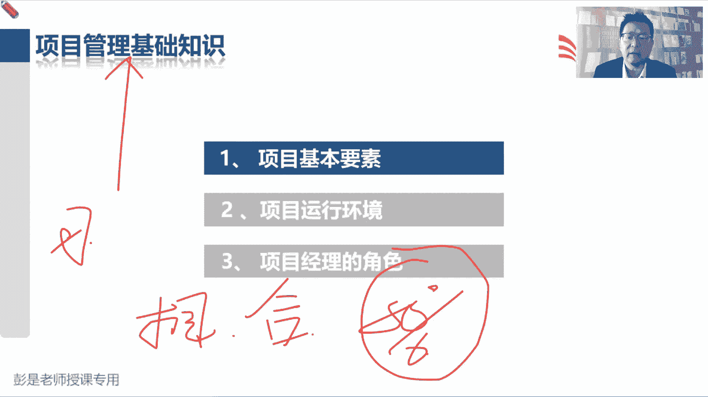

# 【新版PMP培训课程】2024PMP付费课程视频完整版免费观看，零基础通关项目管理考试！ - P21：3.7 执行整合 - 慧翔天地 - BV1Hu4y1a7hA

3。7执行整合，执行整合也是超重要的事情，超重要的事情啊，但是这段文字呢其实没啥可练的，没啥需要大家去背的，因为我们马上就要讲项目整合管理对吧，什么叫整合呢，想一想刚才我们听过的那个场景乐队啊。

乐队啊对吧，有人拉琴，有人敲鼓，有人有人弹琴，有人吹号，唉我们需要整合吧，让大家能够有效地去写作，那对项目来说呀，除了这些，除了这些专业技能对吧，实际上乐队这种专业技能啊，我们还要考虑什么呢。

范围进度成本质量成功标准多快好少，除此之外还要考虑到资源风险，因为牵一发动全身六大制约因素，除此之外，我们学到相关方之后，就知道我们还要了解相关方，了解大家的需求，大家的期望想办法想办法对吧。

把相关方对项目产生的这种负面的影响力，降到最小，消极的影响力，把它降到最小，积极的影响力，让它最大，让大家都开心都满意，另外呢还要搞你好沟通，项目经理，项目经理主要工作是协调，是协作，是整合。

但是呢主要靠沟通去落地啊，对不对，通过良好的沟通，可以有效地刺激大家进行更好的协作，进行更好的协同，最后呢再加上一个采购管理，因为不是所有的工作都是我们自己去完成，可能需要进行一些采购工作。

就有了九个知识领域，这个知识领域啊我们也要整合呀，因为牵一发动全身啊，牵一发动全身吧，我们要有一个整体性的思维方式，去有大局观，去整理考虑整理，考虑全盘考虑通盘考虑这个事情吧，哎所以这个东西超重要。

但基本上基本上后面现在教材上这段文字，大家基本上看一遍就可以了啊，好做做做做这一章最后的随堂练习，看看这道题，排除法呀，通过项目边界去判断哪选C的同学，不要着急往下看，题目问哪一个不是项目经理的职责。

所以呢最后的答案就是D为项目提供赞助对吧，提供我们完成工作所需要的资源和资金，这是发起人他的职责，剩下ABC都是我们这个圈圈里面的事情啊，所以我们要对对这些事情负责的，我们要对这些事情负责了。

就是中间这里面所有的东西都是单管啊，好看看这道题，这么多人选D啊，为什么不选B呢，说你在管理一个项目，要构建一个新的会计系统，另一个部门的会计很喜欢目前的系统，拒绝接受，拒绝接受这个新系统的培训。

处理这种情况的最佳做法是什么，A拒绝和他合作，因为泰坦共识B诉诸于这个会计的部门经理，让他要求这个会计接受培训对吧，找他老板，找他领导，找他领导，让领导下命令，C得到一个特许，使这个会计不必接受培训。

与他合作，了解他担心的问题，并尽可能采取措施缓解这些问题，而不影响你的项目，告老师哈，老师张三欺负我老师，李四欺负我老师张三，张三上课说话，哎，这显得我们自己没本事吧，然后呢另外一个角度。

这是在考虑让对方，对方的管理者用全力向对方去施加影响，唉这样的这样的行为啊，通常不建议，通常不建议哈，所以呢我们要想办法积极主动解决问题，并且想办法想办法，让这个玩意儿对我们的产生的影响最小啊。

所以最合适的选项就是D发挥你的领导力，利用你的影响力，然后让他让他让他让他愿意支持这个项目啊，通常选亮的选项，所以B这种选项不管是在现在练习，还是在未来考试的过程中，看到B类似这样的选项，通常要慎重说。

出了问题找他领导，出了问题，找他老板，出了问题，找他的经理，还有这样的选项通常不可取，它显得我们自己没本事，显得我们只知道用权力去发命令，这就没没没本事吧，哎这样的选项通常不选好这道题吗，是哒哒。

刚讲完，记得录号，最近加入了一个组织担任项目经理，你已经注意到啊，团队是自组织的，不需要您进行太多的监督，因此你允许团队自己做出决定，并设定自己的目标，这种领导力风格就是C恭喜大家答对了啊。

方人形方人形，然后变革型就是说改革创新，交易型的就是你可以帮助大家设定目标，大家达到目标就会获得回报，魅力型的就是热情洋溢，好这道题，以下哪一个不是项目的改写人，这种题大家第一次做一定会纠结的。

第一次做一定会纠结的啊，就牢牢记住现在屏幕上打出来的这十个字，永远找一个相对来说最合适的选项，仅此而已，这道题给出的答案不一定等于真理，我们永远是在众多选项之中，众多选项之中找出一个相对来说最合适的。

什么叫相对呢，就是目前我们有四个选项，目前我们有四个选项啊，在这四个选项里找出一个相对来说，相对说和其他选项相比较，相对来说最合适的选项，仅此而已啊，所以这道题问以下哪一个不是项目的干系人。

那我们就找一个可能性最大的还是最小的呢，找一个可能性最小的，仅此而已啊对吧，题目问不是啊，所以要找可能性最小的，可能性最小的，但这道题的答案不等于真理，品一品，这句话这道题的答案不等于真理，对不对。

好以下哪一个不是项目的干系人，找一个可能性最小的，负责构建项目的项目经理，能够直接影响项目对吧，这肯定是干系人的参与，项目团队的成员都干活的人了，这肯定是干，肯定是你的干系人呐，使用最终产品的客户。

这肯定是干洗的，所以相对于ABC而言，D选项可能性最小，答案就是D，答案就是D啊，但记住答案不等于真理啊，答案不等于真理，因为从标准的定义上来说，D选项是不是项目的干系人呢，是对不对，他受到项目影响。

受到项目影响，有可能反过来采取措施，对我们的项目产生干扰和影响啊，从概念上来说，它是干洗，我们现在只是永远找一个相对来说，最合适的选项，仅此而已，仅此而已，仅此而已啊，所以考试的时候。

一定是抱着抱着这种排序的思维，十分轻重缓急，人分369等，排序思维贯穿始终，贯穿始终的，好，这道题，诶没错吧，诚实职业道德啊，说你发现人家什么对方提供的发票，发票面额少了1万2500美元。

然后呢怎么办呢，批准不行，批准不行，原样不行，最合适的选项就是B了对吧，发现人家弄错了对吧，比如说想场景啊，人家多找你钱了，多找你钱了对吧，应该找十块钱，结果找了20怎么办呢，坦诚诚实，嘿好，这道题呢。

承包商供应商，同一个意思啊，阅读效率太低了，那就加速看，刚来呀，刚来马上，这一小段课程结束了，该讲项目的整合管理了，该讲项目的十大知识领域里面的整合管理，这道题就需要读明白题，再说啥，答案就出来了。

说一个项目经理的一个项目经理，管理的项目遇到了麻烦，因为项目经理的一个成员表现不好，致使呢项目经理啊，错过了一个向干系人承诺的重要日期，项目经理发现这个成员很清楚这个问题，但是没有告诉我项目经理。

因为大家都很害怕项目经理的坏脾气，然后怎么避免这种情况呢，哎最后一总结，项目经理脾气坏，项目经理脾气坏，所以呢学习没用对吧，学PMG没用的，越学脾气越坏呀，评测已经知道了结果了对吧，已经知道脾气坏了。

而不是说不知道项目经理脾气好，脾气坏，所以B排除掉C改善个人技能，提高我们的软技能啊，对不对，控制要控制住，控制住自我控制啊，情商啊，控制住自己的情绪，控制住自己的坏脾气啊，C是对的。

B管理干系人的期望，不能选，对不对，好所以比较合适的就是C了啊，这种题考试的时候也不太会考，因为像这样的软技能的题啊，基本上如果考的话，就像这道题一样，只要看懂题，答案就出来了，谜底就在谜面上。

它比较容易猜，比较容易猜的啊，比较容易大家去判断的，所以这种题的占比不会特别多，好再看这道题，和刚才那道题异曲同工，永远找一个相对来说最合适的选项，哪个项目干系人的定义最准确的，项目的资金，资金经理。

项目经理的经理，职能经理，所有会影响项目的人员对吧，相对来说ABC都片面了，只有D对吧，相对来说相对来说它定义的范围更广义，所以呢答案就是D，好看看这道题，职业道德吧，好恭喜大家。

道德水准已经达到了一个新的台阶，找到了一个新的境界啊，所以说行贿这样的行为，就坚决坚定不移地说NO就可以了。

所以答案是C，这就是关于第一部分，关于第一部分啊，项目管理的基础，职业道德的题一定要脱离现实，一定要脱离现实啊。

为啥不选B啊，B是在说什么呀，没停播，还在继续呢，等会看看B选项，说调查该国地区是否有行贿的习惯，这次这个单词一爆出来肯定不道德，不管在任何一个国家和地区，行贿，这个单词肯定是不道德的，都不需要调查。

不需要调查啊，对不对，调查一下该国家是不是有杀人放火的习惯，调查一下这个国家，是不是有什么性别歧视的习惯，这都不要不要调查，没什么可调查的，这些单词一旦抛出来就不道德，哎这就是第一部分啊，等我再换回去。

所以第一部分第一部分，这部分内容给大家主要在讲，项目管理的基本要素，生命周期这段划分啊，这些东西啊，知识领域啊，什么什么什么制约因素啊，什么项目，什么是运营啊，项目运行环境呢主要讲事业环境因素。

组织过程资产，然后呢要讲到了项目经理的权利，权利呢就沾到组织架构，组织架构只能行矩阵型对吧，项目型，然后又收到了一个PO，最后呢说项目经理到底干什么事呢，还像什么乐队指挥呀，什么叫管理呀。

什么叫领导力呀，嘿不断的不断的发挥我们这些东西去去想办法，让团队完成任务，实现目标，这三部分内容就讲完了，项目管理的基础知识就搞定，搞定了之后啊，接下来我们就开始讲讲什么呢，十个知识领域整合范围。

进度成本就是传统项目的这种管理方法，讲完了传统项目管理方法呢，再讲敏捷，就是多变环境下的项目管理，讲完了传统和敏捷，再学第七版，按照这个顺序啊，所以今天下课之后呢，各位同学就可以开始复习。

复习完了第一部分基本概念之后呢，就可以去做一做课后练习题，课后练习题啊，大家做这种题的过程中啊，有一个最大的技巧是什么呢，叫不叫劲，记住啊，永远是找一个相对来说相对来说最合适的选项，仅此而已，不叫金刚。

不追求所有的题目，你都百分之百把它搞定，掌握到80%左右就差不多了，然后对于不理解的题呢，再去看看教材，再去回去复听课程，不断的去巩固它就可以了，哎这就是关于章节练习题，后面还会给大家说到的啊。

这个解题的思路。

