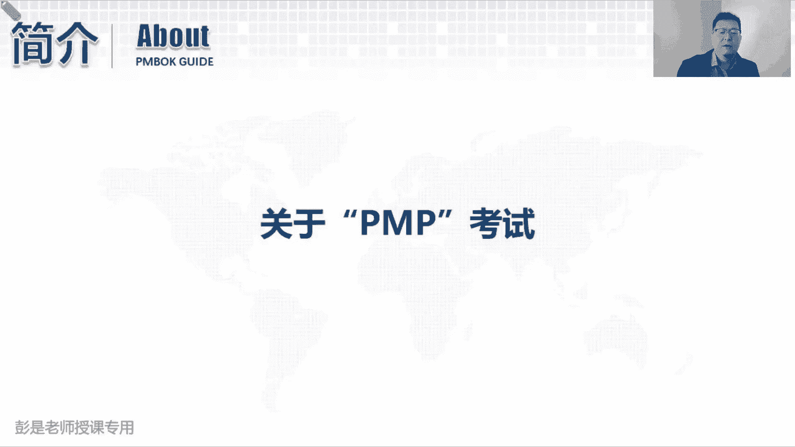
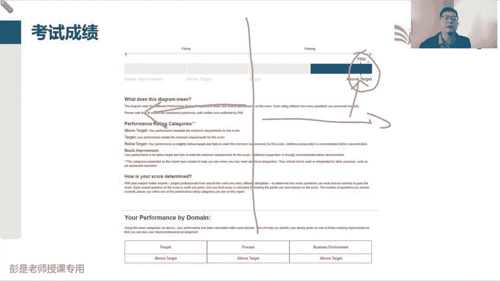
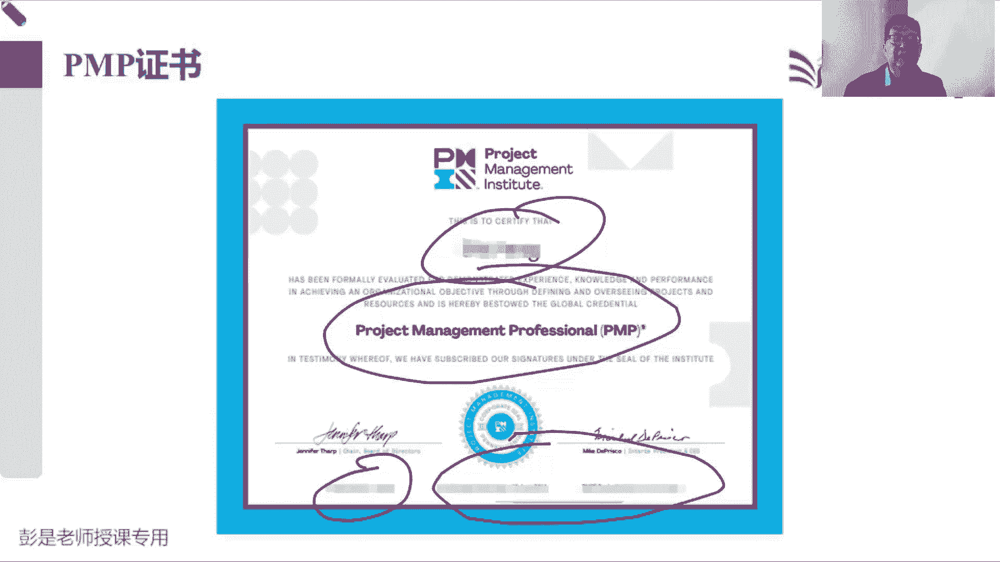
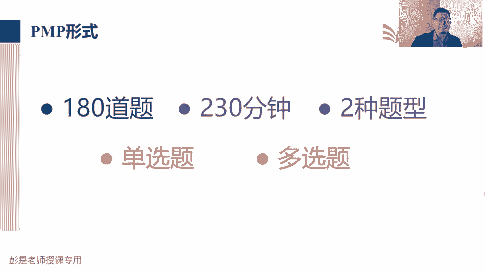
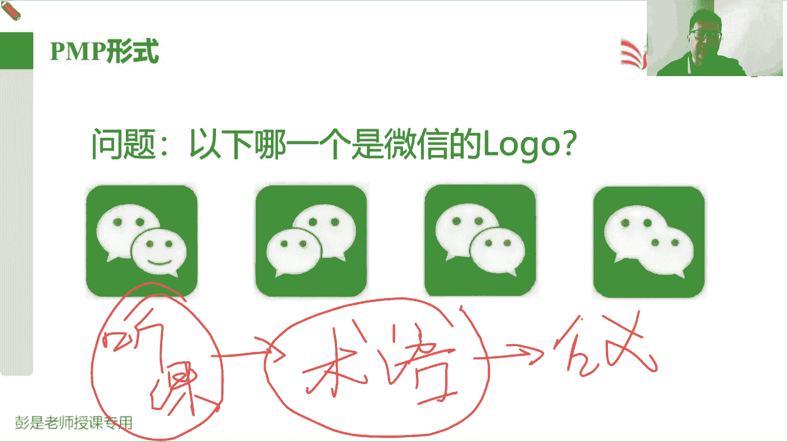

# 【新版PMP培训课程】2024PMP付费课程视频完整版免费观看，零基础通关项目管理考试！ - P4：考试介绍 - 慧翔天地 - BV1Hu4y1a7hA

那正儿八经的需要大家专心听听的，这一小段来了，关于考试，说这个玩意儿火。

这玩意儿有含金量，这玩意儿难，那难到什么程度呢，咱们这个考试啊，从这三个领域来评价我们的技能的专业程度，也就是对知识的掌握情况，叫人员过程和业务环境，人员呢就是管好人，管好我们的团队成员。

然后呢管理好相关方，让大家都支持我们的工作过程呢，就是能不能灵活地根据我们学习的储备的知识，去分析这事应该怎么管，传统的项目怎么管，多变的项目怎么管，那就是敏捷诶，那第三个就是业务环境。

指的是那个大局观的事情，就是商业环境，我们有没有知识储备呢，知不知道什么叫商业论证啊，知不知道怎么算钱呢，知不知道效益怎么，这总算项目的效益呢，唉这些东西从这三个领域评价，我们的知识的掌握程度。

然后这三个领域领域的占比，人员占42%左右，过程占50%，然后商业环境占8%，再往下，后面这句话就超重要了啊，需要注意的是，就标加加粗的这段，在考试中，一半的内容将体现项目管理中的预测法。

预测法就是五大过程组，十大知识领域，49个管理过程，传统的基于过程的项目管理方法，另一半将体现敏捷方法或者是混合方法，敏捷方法呢就是未来我们需要掌握的SRAM啊，看板的ACB这种这套东西啊。

就是在这种多变的环境下，到底应该怎么管项目，它的游戏规则不一样，管理方法不一样，所以一半50%的题考预测，50%的题考敏捷或混合，这里的混合指的是什么呢，混合指的是又有预测，又有敏捷。

相当于敏捷和预测共性的一些知识点，好知道了，这考试评价我们评价我们这三个玩意儿了。

然后这就是考试的成绩单，最下边就是关于这三个领域，我们的水平到底是什么样的，这个水平分成四档，叫NBTAN那就是需要改进，需要提高，说白了就是掌握的不好，B呢就是低于预期，低于目标，低于预期。

below target t呢就是符合预期，达到目标了，A那就是高于预期，超过了目标，所以成绩最好的同学的证书成绩单，就像现在这个这个这个图片上，展示的就是三个A，成绩最好的同学就是三个A。

具体的分数他是不公开的，他的评分标准也是不公开的，但是大家不用担心，它的评分标准也经过了国际标准化组织的认证，他这个算法他这个模型是公平的，是公平的，是科学的，是经过了大量心理学调查。

心理学研究的得到的，得到的这样一套比较完善的评分标准啊，所以他虽然不公布分布，不公布这个及格线，不公布具体的分数，但是呢他的评价标准是非常非常科学的，然后三个领域最高的是3A，最低的就是三个N。

想考3N其实挺难的，想搞三人其实挺难的，就是每一道题都巧妙的避开了正确的答案，其实是有难度的，有难度的啊，好那三个领域得到三个评分，这只是三个领域的评分，最后是否会通过考试，还取决于上面，取决于上面啊。

要看整体情况，整体情况啊，就中间画一条线，这就是我们的及格线，如果你的整体评价在这条线的左边，那就很遗憾，很遗憾你没有通过考试，如果最终的成绩啊在这条线的右边，哎就恭喜您，您顺利通过考试取得了P证书。

所以呢最后这个小的小的小的，这叫什么，就跟那个指针似的，这玩意儿越靠右，说明你的成绩越高，越靠左，说明越成绩越不理想，这就是考试的成绩单。

那一旦一旦通过考试出了成绩之后，就可以下载电子版的证书了，这个是按证书的一个释义，中间是姓名，下面是证书的名称，pp项目管理专业人士资格认证，然后左下角右下角老板签字，下面是证书编号和有效期。

唉这就是大家通过考试拿到证书，可以晒两张图，成绩好的同学想点赞多一点，你就晒一晒成绩单加证书，成绩不好的同学，那就可能只能晒证书了对吧，成绩不好的那个成绩单就不要晒了啊。

那整个考试的过程中，怎么评价我们呢，一共有180道题，180道选择题，目前国内没有什么连线题，没有填空题，没有热点题，在海外考试的同学，你可能会涉及到连线题，填空题，热点题，其实呢他也都是选择题。

连线题啊，就是连连看连线题就是连连看，让你把它连起来，它把它连起来，它把它连起来，它然后填空题呢也是选择题，给你个空，ABCD填哪个不需要大家敲字打，所以其实啊变来变去啊，还都是选择题。

变来变去都是选择题啊，题型上连线题，热点题也基本上不会出很多，基本上一道题，两道题，三道题到头了，大部分的题都是单选，大部分的题都是单选好，整个考试一共180道题，考试的时长，考试的时间是230分钟。

大概四个小时，一共目前国内是两种题型，单选和多选，单选题呢大概160道左右，多选题呢大概十道题左右，海外考试的同学，你可能有一些两三道题，是两三道题这样的这样的什么填空题啊，热点题啊。

你把它当做选择题做一模一样的对吧，当做选择题，做法跟选择题一样的，所以不要担心，不要焦虑，不要惶恐好180道题，230分钟，单选题，多选题，多选题一定会明确告诉你选几个选项对吧，从众多选项之中选两个。

选三个，基本上也就如此了，这这么多年没看过选四个的哈，那重要的话术就来了，考试中途有休息吗，海外考试的同学是有休息的，国内也有啊，国内有，因为海外考试是应该基本上大部分是上机考，在电脑上考。

所以呢他基本上一个小时左右就会问你，你是否需要休息一次，休息10分钟是可以休息的，国内考试证随时休息，想休息，举手举手，然后申请去外面走一走啊，洗洗个脸啊，抽根烟啊，喝点水啊都可以的啊，好专心听。

非常非常重要的小段话术，接着来了，180道题，230分钟，然后咱国内考试啊，国内考试还需要做一个事儿啊，叫图答题卡，涂答题卡，这是大家中考高考图的那个答题卡呀，左边是什么个人信息，姓名考号啊。

右边是第一题，ABCD画四个圈，让你用一个2B铅笔往上涂啊，和他那个中考高考那个答题卡是一模一样的，然后里面一共有一百八一百八十道题，然后你去图圆圈图方块，那大多数情况下，大部分人涂卡时间。

基本上需要20到30分钟左右，一个空大概图十秒，一个空大概图十秒，就这样粗暴的算一算，大多数人正常情况下，涂卡时间大概20到30分钟左右，所以真正我们有效的考试时间。

有效的做题的时间基本上就是200分钟，200分钟回答完180道题，那就相当于一分钟一道题，每道题呢大概有100多个字，你有题干告诉你一个项目的情况，然后给A呀，B呀，C呀，D呀，给出你几个选项。

每个选项呢十几20个字，所以整道题下来大概100多个字，需要我们在一分钟之内看明白题再说啥，看明白选项在说啥，然后根据我们掌握的知识去思考，相对来说哪一个选项更合适，所以他考的是什么呢。

时间非常非常紧啊，其实考的就是项目经理的快速决策能力，快速决策能力啊，是不是你有足够的经验，是不是你有足够的知识储备，能够在能够在一分钟之内，大概了解一下项目的情况，快速给出一个相对来说比较合理的。

这样一个建议，从众多选项之中找到它诶，考的是项目经理的快速决策能力，那这个快速决策，快速决策，这就来源于什么呢，就靠大家的功底了，看看大家这个功底啊，来源于日常的训练了，看看大家这个功力啊到底强不强。

所以大家想场景去理解这个玩意儿，就像什么拳击手啊，运动员啊，在赛场上啊，对方全都来了，你有没有时间去想啊，有没有时间去思考啊对吧，敌人说我来抽出一个左勾拳，稍等我想一想，我是白鹤亮翅，黑虎掏心啊。

我是防守啊还是进攻啊，根本就没时间想，根本就没时间讲啊，打的就是你快速反应能力啊，看看你能不能快速的快速的根据人家的拳头，拳头的出拳的态势判断一下，预测一下这事儿应该怎么办，考的是这种快速决策能力吧。

哎所以考的是我们的程序化肌肉，程序化记忆记忆记忆肌肉记忆，所以这种快速决策的能力怎么练怎么练呢，没有好的办法，拳击手怎么练呢，没有好的办法，来源于日常大量的积累和沉淀，所以从今天开始，今天第一天上课啊。

从今天开始，我们希望大家就坚持不断的坚持，不断的学，该听课听课，该看书看书，该做题做题，按照我们的学习计划，12345，把它坚持执行下去，坚持的落落实下去就可以了，否则沉淀不够，积累也不够，储备不足。

很可能到了考场上就掉链子，这是基本上大概率事件啊，大部分同学说通通不过考试的同学啊，主要的原因就两个，一个是心理的问题，可能心态崩了对吧，或者是慌啊，焦虑啊，不安惶恐啊，可能会影响我们在赛场。

在考场上的发挥，想想运动员对吧，平常训练的好好的，一到正式比赛啊，掉链子，可能心理上有问题对吧，焦虑不安惶恐会影响我们的发挥，第二个呢就是平常不练，没有知识积累，没有储备。

然后侥幸心理抱着侥幸心理去考试，就很可能概率就下去了，所以这是考试的这么一个情况，考的是快速决策能力，它来源于我们大量的储备，这个储备没有好的办法，只有通过日常的训练，把这些专业术语搞明白，不需要背。

不需要被理解为主为理解，去理解它的底层思维方式，理解他的价值观，为什么有49管理过程呢，为什么有五大过程组呢，为什么有这么多管理过程输入输出工具呢，敏捷里面为什么有玩法不一样了呢。

去理解它背后的这个大大道理啊，掌握了这个道才是考试的王者，好拐弯拐回来啊，所以180分钟，180道题，230分钟，那对大家来说，对大家来说，说角色能力我想好想提升啊，除了课程教材还有什么书可以看吗。

课程教材的书清，你只要能看完就已经非常了不起了，这本教材至少至少看三遍题，后面会说到的，说海外同时考外参加考试的时候，可以选中文的，可以选中文的，中文翻译啊，是有人工的，他翻译水平都是后面会说啊。

都是不太好不太好，咱国内考试的地区是考试是中英文双语，英文题目在上面下面有配中文的翻译，考试出题的时间怎么算呢，你高考你高考一样啊，不可能给你暂停吧。

出去就出去了，好再往下了啊，所以看看这张图是什么玩意儿，为了便于大家更好的理解咱那个考试的形式，看看这张图是啥东西啊，哎看看手机图标啊。

这个东西是微信啊，微信啊，考试的时候就变成了这样，问一下哪一个是微信的logo，所以大多数人关于这种考试啊，就不适应就不适应啊，要仔细想一想了，要认真的细节决定成败啊对吧，微信好像没有那个嘴巴呀。

微信那个小脸好像在右边呢，微信好像有一条边线的，考的是各位同学的火眼金睛，火眼金睛，火眼金睛，那怎么做到，怎么做到快速的决策呢，这是非常非常重要的一个事情啊，这是专业术语的理解。

对教材里面涉及到了大量的专业术语，你要记住它，然后理解到位了，才能够快速的读懂，快速的读懂考题的内容，能听明白吧，如果专业术语不理解，掌握不到位题，再说啥都看不懂，你怎么做决策的，和预习课。

预习课程内容一样啊，如果今天未来我们讲的课，和预习的课程内容不一样，这才糟糕呢，是不是是这个意思吧，你们就烦了，你们就该砸死我了，上次说这个知识点是这样的，下次说这个知识点是这样的。

怎么可能不一样不一样，最后还打搅好，听话听音，接下来这段话非常非常非常重要，怎么做到快速决策，来源于大量的积累，积累什么呢，对专业术语的理解，能快速的知道什么叫需求文件，什么叫关键路径法。

什么叫产品待办事项，什么叫com，什么叫com教练，什么叫PO诶，这些术语代表着什么含义，要能够根据这些这些术语的含义，去看明白题目到底在说啥，看明白选项到底在说啥，题目搞明白了，选项搞明白了。

决策的能力就上去了，否则就看不懂，否则就难以决策，所以这个场景啊就对报道，比如刚才我吃药，你打开那个药品使用说明书看不懂啊，亲对吧，这个要什么禁忌呀，这还好歹能看懂，后面一大堆专业术语，根本就看不懂。

为什么呢，没有知识储备，没有知识知识储备吧，没有这个积累，哎这个术语每一个单词看起来字都认识，但是什么意思看不明白，看不明白这个药到底什么时候吃，怎么吃哎可能就难以决策了，所以需要需要积累，需要沉淀。

需要储备，那这些术语没有好的办法，听课看书，听课看书啊，相辅相成啊，只听课不看书，不行，只看书，不听课也不行，说老师啊，那我做题行不行呢，不行，很遗憾，这个考试和那个大家考那个交通法规，完全不一样啊。

考科目一考交规基本上都听什么课呀，不听就把那五六百道题做一做做一做，刷一刷，考试90分根本就不是梦，对不对，我考前一天半天就刷，刷了一遍，两遍就过了，就这么简单，PMP考试可没有这样的技巧啊。

PMP考试你刷题刷题，刷到最后啊，知识点是啥，根本就不知道，就像盲人摸象这道题告诉你大象是个鼻子，这道题告诉你大象有个腿，这道题告诉你，大象可能五个腿哎，做了半天知识点是啥，根本就不知道。

所以听课看书做题，这三套东西缺一不可对吧。

