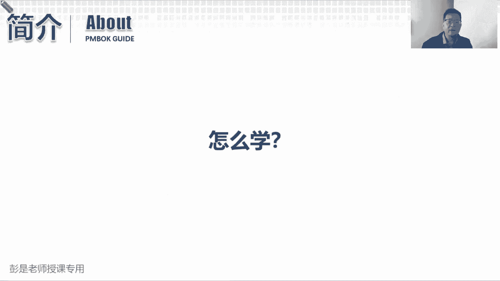

# 【新版PMP培训课程】2024PMP付费课程视频完整版免费观看，零基础通关项目管理考试！ - P5：如何学习 - 慧翔天地 - BV1Hu4y1a7hA

好继续往下了，那到底怎么学呢，PMI官方推荐的教材，PMI官方推荐的教材啊，说还有什么书可以推荐的吗，这个这些教材啊，建议大家考试以后再去看吧，备考过程中不要看了，品牌官方推荐的一共有十本教材。

咱们官方教材，第一本就叫项目管理知识体系指南第七版，然后呢，第二个就是敏捷实践指南ACP。

第三个呢什么敏捷转型指南的项目管理过程，项目管理工具箱啊，什么计划进度，控制方法就5年了，一共有十份证来推荐给我们，这十本书说实话我都看不完的太多了，现在是23年10101月，你把这本书看完了。

可能地球都爆炸了，根本看不完，又臭又长又臭又长啊，所以大家不用看这么多，不用看这么多啊，因为我们未来所有题目涉及到的知识点，都从这十本教材里面展现出来，所以呢看通关宝典其实就够了，听课听课。

听课课上都会给大家讲到的，都会给大家覆盖到的，然后呢该听课听课，该做题做题，我们的练习题啊，模拟考试题啊，综合练题啊，包括未来的冲刺的什么每日练习啊，重要的考点，重要的知识点全都给大家无死角覆盖到了。

只要做题掌握了这个思维方式，掌握了这个道理，通过考试不是梦对吧，咱干的就这个活儿啊，然后这张图就不念了，总之听老师的话不念了啊，吹牛逼的吹牛逼的这段不念了，课程的目标。

希望大家能够掌握项目管理的相关知识，然后呢我的学习，我的主要工作就是，帮助大家减少学习的复杂性和困惑，帮助大家在备考的过程中答疑解惑，降低复杂性啊，所以不知道，我也不知道怎么传达给其他不听课的同学啊。

如果各位同学听了课，就可以解决你很多很多的困惑，比你自己看书效率来得高得多，然后呢希望大家能够提升所学知识的应用能力，咱不仅仅是为了备考，还希望大家能够活学活用，举一反三，所以课上会结合大量的大量的。

大家很好理解的这种这种生活化的案例啊，这个呢也希望大家希望大家能够相互理解，相互包容啊，因为如果我们讲正儿八经的项目案例，其他行业的同学可能听不懂，想一想，我讲一个工程的案例，其他行业的同学说，老师啊。

我也不懂修路搭桥盖房子啊，听不懂，那我讲一个软件开发的案例，其他行业的同学也听不懂，我给你讲一个医药行业的案例，其他同学听不懂啊，所以呢只能讲接地气的方法了吧，接地气的案例就是什么jm tr开个餐厅。

开个麻辣烫，弄个烤串，弄个牛肉面诶，这种生活化的案例，能够帮助大家更好的更好的理解，这个复杂的知识体系，能够做到，希望大家听完了这种案例之后呢，能够做到活学活用，理解为主，举一反三。

不断地不断地在工作中去应用这些知识，真的有效啊，可以帮助我们提高工作的效率，提高工作的质量，那最终的目的是希望大家能够顺利的通过考试，一次通过考试拿到这个证书，然后呢，总之能力提升了。

证书有了可以提高大家在职场上的竞争力，希望达到这样一个良好的结果，而不仅仅是说老师我要死记硬背，然后去考试拿到证书，这其实意义不大，意义不大啊，死记硬背的东西，过几个月基本上忘得差不多了好，那怎么学。

就是这个小杯子，嗯这个小杯子是什么玩意呢，这个小杯子就叫空杯心态，孔明心态，他有个典故，咱一分钟把它搞定，这个典故是什么呢，有个有个有个老和尚，有个老和尚啊，说佛法非常高明，然后呢有人就去向他请教佛法。

结果这个施主啊到了老和尚面前，到了老和尚面前啊，他来请教佛法，他反而啊不提问，反而呢不听老和尚说，他先说他就在那叨叨叨叨叨叨，就像老师现在讲课一样，叨叨叨叨叨叨，不停的诉说自己对这个世界的理解。

不停地诉说自己对这个世界的看法，价值观，道德观，世界观，结果到老和尚看这个施主在这叨叨叨，老和尚没事干，就给他开始倒水倒茶，这个茶倒满了之后呢，老和尚没停继续倒诶，这个失主叨叨叨叨叨叨。

突然发现河水已经满了，老和尚还在倒水，就问了大师，水已经满了，不要再倒了，当时就说了，施主啊，施主您来向我请教佛法，您现在呀就像装满了水的茶杯一样，你听不进去，我讲的东西啊，你都不给我机会讲了，亲。

嘿所以呢您先忘掉您的认知，您先听听我的看法，我的观点就这个意思，那学习学习这个空杯心态就非常非常非常重要，因为大家基本上啊说的难听的话啊，大家基本上目前目前目前在工作中，一个萝卜一个坑。

你能接触的东西非常非常非常有局限性，这是井底之蛙，就是井底之蛙对吧，大家日常工作中啊，就干这点事儿啊，我们的见识我们的见识是有局限性的，那现在我们学的这套东西是什么呢，学的这套东西叫通用的执行标准。

项目管理知识体系指南，然后大家是在实际工作中，第一我们要考虑每个行业有每个行业的特点，盖房子的，搭桥修路的和搞软件的，搞医药的，搞导弹的，每个行业有每个行业的特点对吧，什么环保啊，工程啊，制造啊。

那我们要根据行业的特点去思考，这事儿应该怎么管，那第二个呢我们还要考虑每个企业的情况，因为不同的企业，你的政策流程标准制度规范又不一样，每个企业的内部环境，包括你人员的素质能力水平都不一样啊。

所以我们的方法还要根据企业的特点来分析，来做调整，最后呢每个项目又有每个项目的情况，在北京盖个住宅小区，在天津盖个住宅小区，在上海开个住宅小区，在二线三线四线，在县城，在在稻田里盖个小区诶。

每个项目又有每个项目的特点，所以呢我们还要结合每个项目的独特性，去对我们的方法做调整，最后呢每个人的情况也不一样，同样是项目经理张三和李四，他俩的教育背景啊，专业知识啊，工作经验呢。

诶它的沉淀积累水平又不同，所以它的它的管理方法又又做了进一步的调整，所以实际上我们目前大家在工作中，用的这些方法，用的这些思维方式，它非常非常非常有局限性，它不一定适用于其他项目，不一定适用于其他人。

不一定适用于其他企业，不一定适用于其他行业，所以很多同学可能会感受到说花了一家企业诶，这个办事的风格，办事的方法和我们之前不一样，甚至跨行业之后，跨行业之后没有这个专业知识难以适应了诶。

就是因为工作有局限性，那考试来说，我们学的是通用的通用的项目管理标准的，所以考试过程中，学习过程中，听课的过程中，看书的过程中就要忘掉忘掉忘掉前四个玩意儿，忘掉我们工作中的最佳实践。

忘掉我们工作中沉淀积累总结下来的这些经验，因为这套东西它不一定具有通用性，不一定具有通用性啊，所以学习过程中，听课过程中，做题过程中，千万千万千万不要想当然，千万不要有侥幸心理。

千万不要形成思维上的惯性，一定要去分析我们应该掌握的知识是什么，根据我们掌握的知识去推理诶，应该找到哪一个选项作为答案，就是空杯心态了，好那整个学习过程现在报名不讲了啊，咱们课前要做预习的。

今天上课不需要预习啊，下次上课需要预习了，然后呢这是正式授课不断的循环，在循环的过程中，需要大家听完课以后做每节课的，每节课课，课后练习题，然后后面呢就是模拟考试，全面复习，考研冲刺。

总之你们的学长曾经说过这样一句话呀，说要再笨的同学呀，只要按照我们的学习计划，咳咳再问的同学，按照我们的学习计划，最后实际执行，通过考试不是梦。

好这就是第一小堂课程，所以第一小课堂课程啊，说了半天，废话特别多，中心思想是什么呢，这考试火，这考试难，这考试有含金量，这考试没这么容易，那我们需要不断的去学，需要我们付出了一定的时间。

大量的时间去学习，去积累，去沉淀，才能够更顺利的，更顺利地更可能的去通过这个考试啊，那学习这种反人类的事情，学习这种让人家不快乐的事情不快乐啊，这种反人类的事情没有好的办法，他就两个字坚持。

咳咳只要各位同学像今天早起一样，能够坚持坚持坚持下去，通过考试不是梦，好，这就是第一小段课程，给大家说一下我们这个考试的背景，然后考试的题型，考试的这个好，说到这个难点在哪啊。

然后接下来我们准备第二小段课程。

每一章都有练习的道，那第二小段课程上课之前啊，咱给大家缓口气去准备教材，教材就是大家手里拿到的那个叫通关宝典，拿这本书就行了，没有教材的同学呢，就看PMBOK第六版，加PCP这两本教材就可以了。

教材通关宝典，通关宝典，这是大家手里拿到的，如果手里面目前没有通关宝典的同学也不要慌，今天第一天上课讲的会非常非常非常慢，所以没有教材呀，也可以专心听就够了，会会保证你能听得懂的，听得懂的啊。

那咱休息8分钟时间，现在10。02。

