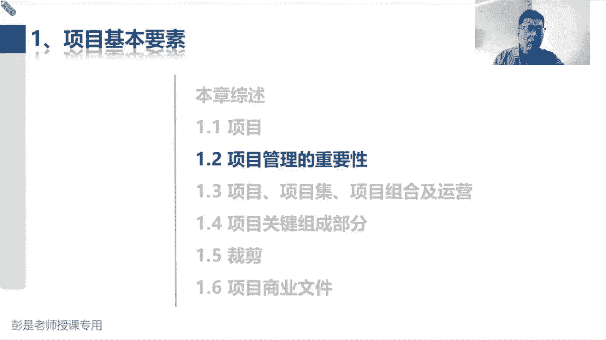
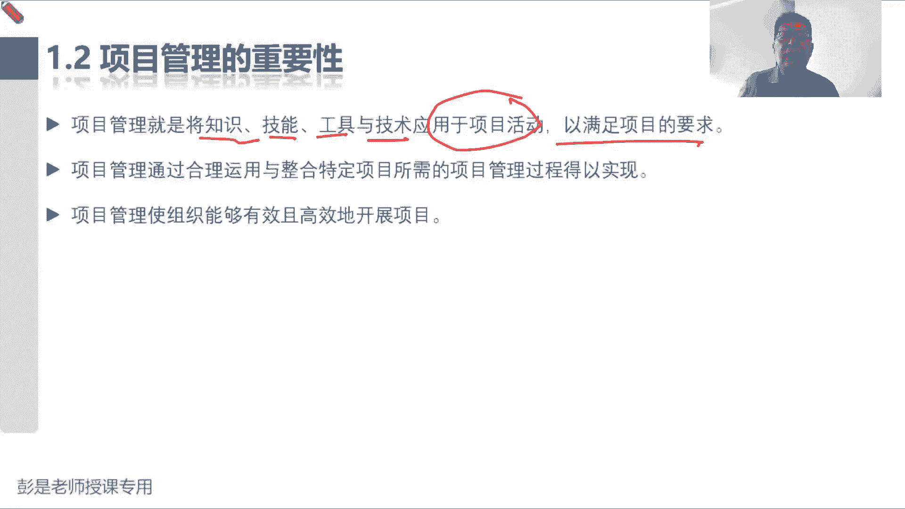
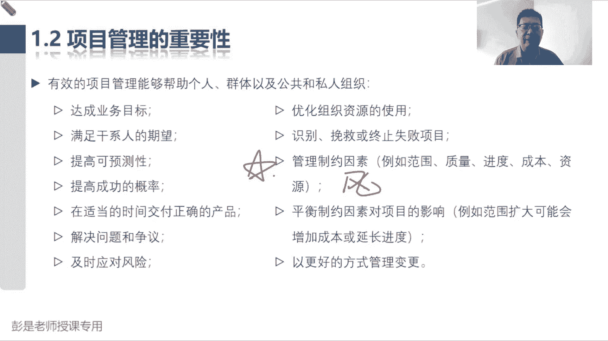
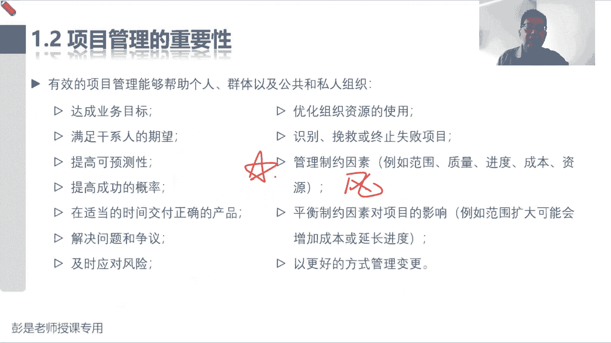
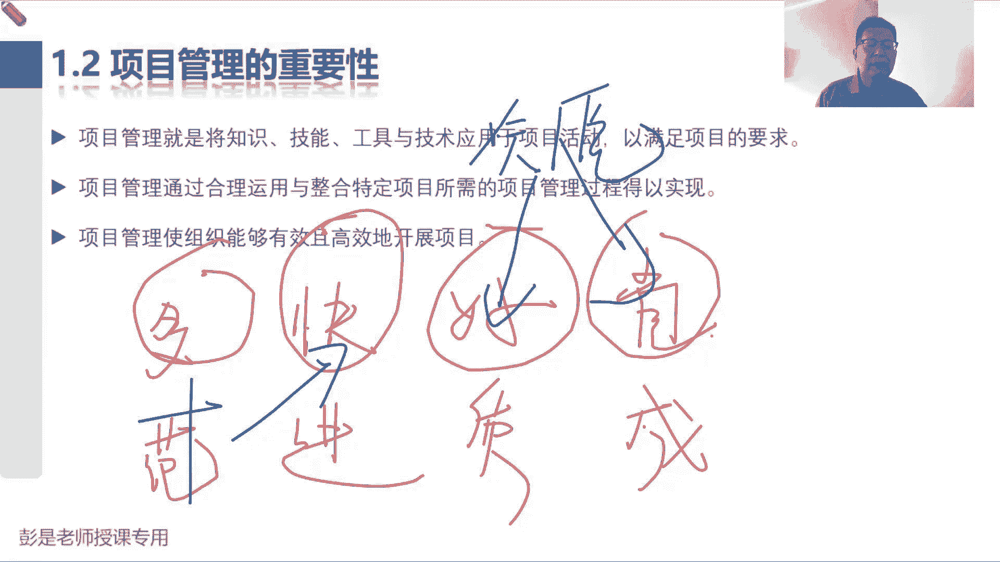
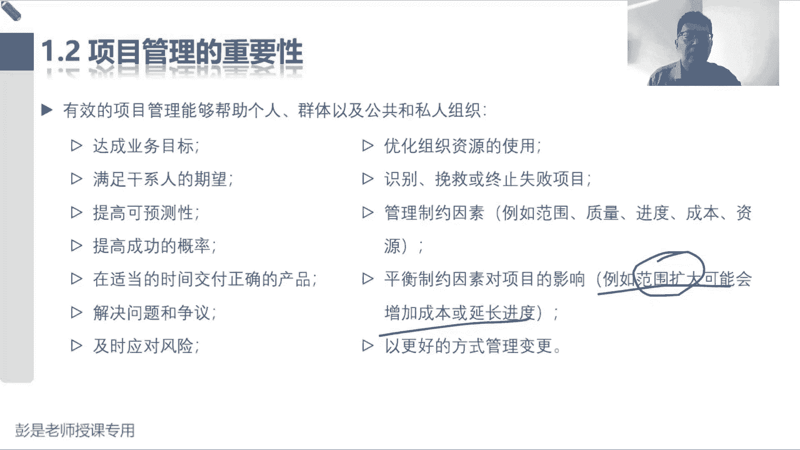
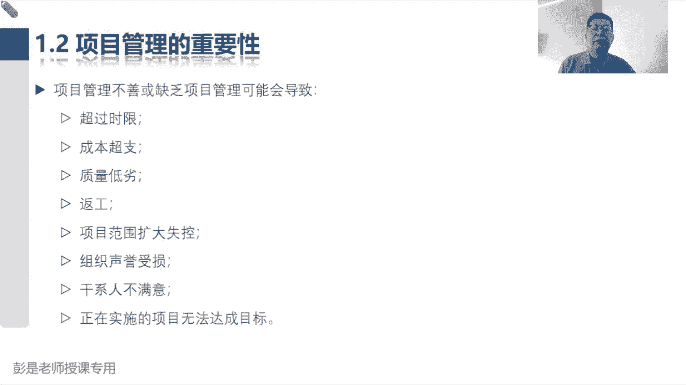
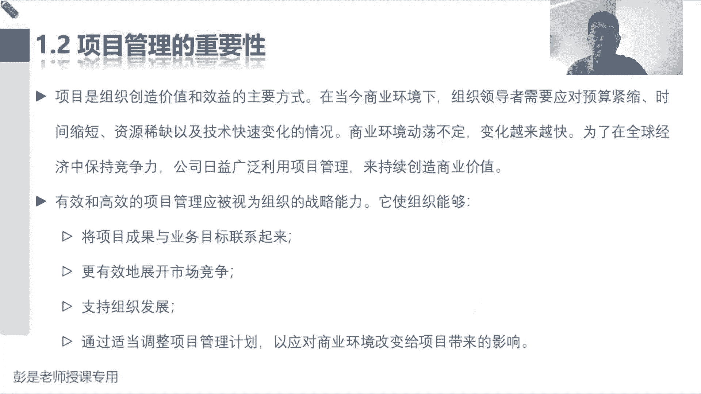
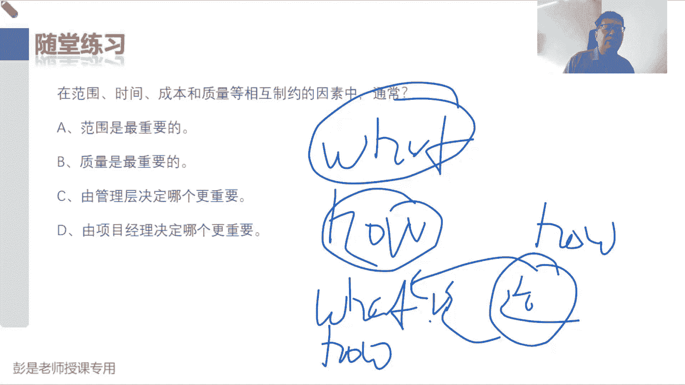
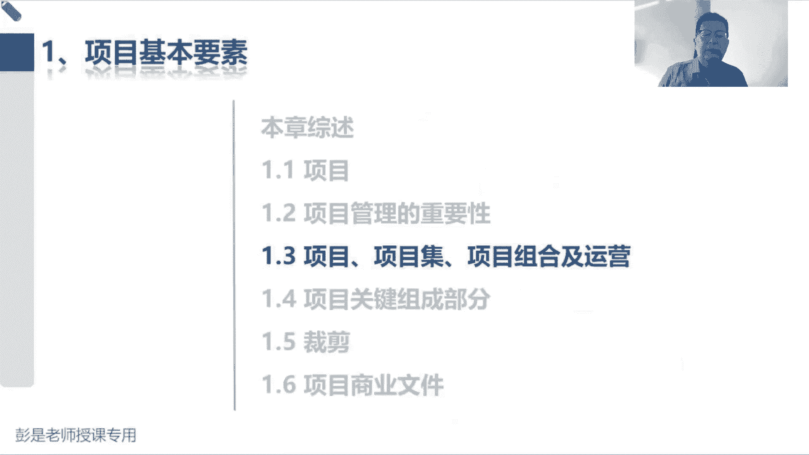

# 【新版PMP培训课程】2024PMP付费课程视频完整版免费观看，零基础通关项目管理考试！ - P7：1.2 项目管理的重要性 - 慧翔天地 - BV1Hu4y1a7hA

然后1。2项目管理的重要性，这段课程啊大家基本上就听为主，听为主啊，没有什么需要背的东西，那什么是项目管理，标准的定义，就是将知识技能，工具技术应用于项目活动来满足项目的要求，就是把咱的一身本领。

你在工作中总结出来的这些什么经验的诀窍啊，技巧啊，方法啊，工具啊，本事啊，用到工作中完成任务，实现目标，得到期望的成果，这就称之为管理。

听一听可以了啊，那有效的项目管理能够帮助我们个人，群体和公共和私人组织全都是好事，这都不用背，甚至大家想看就看，不想看可以不看了，标个三角，后面复习的时候扫一眼就可以了，达成目标，满足该行人的期望。

提高可预测性，提高概率，然后正确的时间正进行交付，基本上都是字面意思吧，解决问题，然后应对风险，优化资源，识别什么乱挽挽救，终止失败项目好藏了，第一个需要大家掌握的小小的知识点，管理制约因素。

例如范围质量进度成本，资源再加一个风险就齐活了，范围质量进度成本资源，这这这这大道东西啊，怎么理解。

怎么理解，看PPT，看PPT啊，我就在随便找一个空白的地方，给大家说这个大道理了，那通常啊我们评价一个事情成功不成功，有这么四个指标，有什么四个要素啊，评价一个事儿干的成功不成功，就是多长时间。

花了多少钱，干了什么活，达到什么样的质量的准和要求，所以通常会说多哎没错，快，好，就是那个京东都开好省了多指的是什么呢，范围，多指的是范围在后三个因素相同的情况下，后三个因素相同的情况下对吧，越多越好。

比如说咱这个餐厅对吧，大家A餐厅B餐厅炒一个菜都是10分钟，质量都一样，钱都一样，那谁家菜量大，我们就选谁家，这是范围，所以通常希望范围越多越好，快呢指的就是进度，在其他三个因素相同的情况下。

谁家做菜越快越好，好，指的是质量，在其他三个因素相同的情况下，谁家的菜品对吧，不用地沟油啊，然后不用添加剂呀，不用什么，不用什么苏丹红啊，嘿然后没有什么小虫子，没有什么头发，质量越高越好。

最后省呢就是成本，在其他三个指标相同的情况下，谁家的菜越便宜越好，所以通常我们去多快好省，通过这四个因素去评价，这个项目到底成功不成功对吧，多长时间就是快干了什么活，泛美花了多少钱。

成本达到什么样的质量标准和要求，来评价我们管理的管理工作到底到位不到位，这就是评价项目成功的四个常见的标准。

叫多快好省，那搞定了搞定了这个成功的标准之后啊。

搞定了这个成功的标准之后，再想一个知识点啊，那如果我们想增加范围，想增加范围，多干点事儿，让我们的产品有更多的功能，这都是增加范围，如果我们想增加范围，是不是就通常需要更多的时间呢。

炒一个菜炒两个菜时间不一样，对不对，炒一个菜炒两个菜时间不一样了，所以范围的变化可能会引起进度的变化，那我们如果还要追求进度，还要追求进度啊，说炒炒两个菜啊，还要按时炒，按时完成。

那我们可能会投入更多的资源，两个厨师呗对吧，张张厨师张菜厨师炒菜10分钟，李四厨师炒菜10分钟，诶，他俩同时炒也能够按时完成，那增加了增加了资源，保工期，增加了资源又会引起成本的变化。

两个人干活成本就高了，对不对，增加了资源又会引起成本的变化，那另外呢增加了资源，两个人干活，万一张三炒菜好，李四炒菜不好啊，有可能带来质量的问题，所以最终我们就会发现范围，进度成本质量多快好省。

这四个玩意儿。

再加上资源，再加上风险，他们之间存在着这种相互的制约关系，就把它称之为制约因素，牵一发动全身了，如果我们想改变范围，可能需要对质量啊，进度啊，成本啊，资源啊做出相应的调整，就有可能带来一些新的风险。

那就以此类推，如果我们想节省成本，节省成本，那我们可能减少资源，牺牲质量，看范围啊又可能带来风险，以此类推，所以就通常称之为六大制约因素，范围进度成本质量，资源和风险，也就是我们十个知识领域里面的六个。

然后呢未来再加上相关方沟通采购，这个共同构成了九个知识领域，最后再盖个帽子得到了整合，就变成了十个知识领域，所以这段要知道什么叫制约因素，六大制约因素，六大制约因素通常牵一发动全身。

所以后面书上给了这样一个例子，我们要找到一个平衡点，平衡制约因素对项目的影响，例如范围扩大可能会增加成本或者是延长进度，好知道这个知识点啊。

那项目管理不善，可能会导致巴拉巴这段文字都不一样了。

大家看一遍就可以了，其实都可以不看了，好后面这一段，后面那段其实后面大家复习的时候可以不看，啊啊啊，听一遍就完事儿了，说项目是组织创造价值和效益的主要方式，在当今的商业环境下，我们需要应对预算紧缺。

时间紧缺，资源稀缺，以以及记住快速变化的情况，商业环境动荡不定，变化越来越快，为了保持竞争力，我们希望通过项目来创造价值，这段文字就是上午讲的说商业环境发生变化，可能出现影响企业的因素。

受到其受到影响之后呢，我们可能通过项目的形式帮助我们做产品服务，独特的产品服务或成果来进行应对，应对之后呢，我们再通过运营去实现这个商业价值，然后在运营的过程中再去看一看，商业环境是否会发生变化。

知道这个大道理，这段文字基本上可以，后面复习的时候都可以不看了啊。

好再往下做到了这一小段，这一小段真的超简单，在范围，时间成本质量等相互制约因素中，通常什么东西更重要的，有选A的，有选B的，有选C的，选D到底选哪个呢，公布答案了啊，54321买定离手，正确的答案是C。

领导定啊，这都不用想啊，领导说啥是啥呀，项目经理不一定有这个决策权的，我们没有办法来决定这个项目的目标，项目经理没有办法来决定项目的目标啊对吧，多快好省了，咱定不了啊，那范围是最重要的吗。

不一定质量是最重要的吗，不一定看情况，看情况一定是分析分析，我们领导对这个项目的期望是啥，因为大家想一想你工作里面的场景啊，你公司里面有没有这样的项目，哪怕是哪怕是赔钱也做啊，哪怕是赔钱也做吧。

哎可能这种情况下成本就没有这么重要，成本没有这么重要了吧，唉那有的项目是不是可以考虑牺牲质量呢，有的项目是不是可以考虑牺牲质量了，可以吧，就像各位同学，今天中午吃饭时间紧，任务重来不及了。

就一共一个半小时了，还想休息一下，还凑合吃一口，凑合吃一口啊，把质量做出牺牲，可以的吧，那有的项目啊来不及来不及，能不能砍范围呢，也有可能啊，也有可能吧，有的项目呢可能时间上时间上还没有办法。

可丁可卯啊，适当的把这个时间放长，适当的把项目的时间放长，所以一定是管理层根据企业的情况去分析，我们这个项目范围，进度成本质量资源风险，我们要着重看重于哪几方面，然后牺牲哪几方面，因为此事古难全。

不可能实现，多快好省，不可能时间都还好找啊，好项目经理没有这个决策权，项目经理没有这个决策权啊，等到学到后面制定项目章程，整合力量你就更清楚了，项目经理决不决定不了我们做什么事。

项目经理能决定的是什么呢，就是怎么做，好，永远是领导定what，下层决定好对吧，董事会决定公司的发展方向定what，然后呢，我们董事会加上我们去各个各个高层，来决定企业的战略规划决定后。

然后把再把号转化转化成what，因为一旦敲定了战略计划，我们就知道要做什么项目，我们就知道要运营什么东西了，又有了what和又有了what，有了这个what呢，作为项目经理，我们去思考这事儿怎么干。

就有了号，作为运营经理，他去思考我们这个公司怎么运作，诶就有他的号，以此类推，A不断的是从战略到战术，战略到战术，这样不断地不断地不断地传承。

