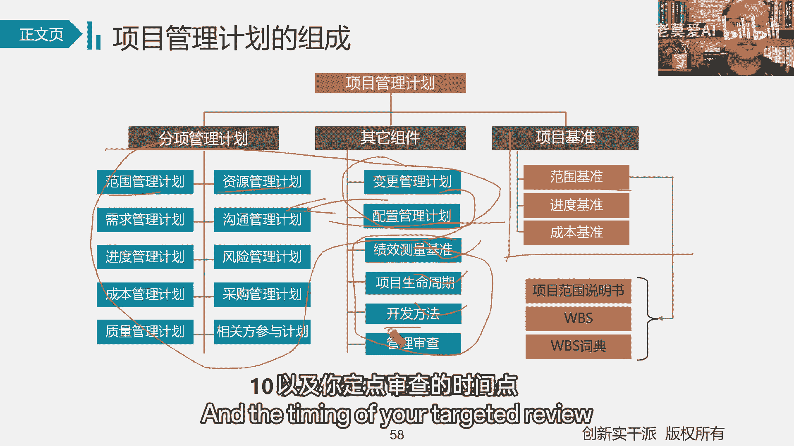

# 【最好的PMP课程】PMBOK6精华讲解1-4 - P1 - 老莫爱AI - BV1Gz421B7HH

人员可什么可能是主要的核心人员啊，核心人员可能就进了三个五个十个核心人员，那你要做项目还有N多需要更多的，他们进来的目的是什么，他们进来的目的就是帮助你辅助人一起干什么，一起做计划的呀。

因为做计划我们仍在做嘛，具体做执行还能才能上更多的人嘛，所以这时候计划一旦做完了，这个时候干什么才开会，就意味着什么准备上人了，这个时候就大家一起来了，所以我给大家说一下啊，你们ABC3个人。

你们的任务是什么，DEF你们四个人的任务是什么，记得把这事忘能说清。

好吧啊，这是时间好，这里我们要对比这样两个会议，这两个会议在考试的时候，有可能都会翻译成什么叫启动会议，叫启动会，大家注意一下，启动会之后呢，我们要注意两个，那考试时候反正是因为也有英文嘛。

我们注意看下英文，Ination meeting，可以kick off meeting，他的翻译也注意一下，注意啊，INTEB项目启动会议，看启动阶段结束后，它的核心是什么。

我们项目的核心就是在制定项目章程章程之后，我们开启动会吗，它的核心一方面是颁布启动章程，二方面就是就章程内容的具体信息，给大家做一个什么跟干相关的干系人，做一个什么一致性的一个什么一个互动。

让大家知晓这是干嘛，第一个启动会议，那这个启动会议呢，是我们是需要把我们项目计划里面的具体内容，传递给我们相对应的什么团队成员单位成员。

所以这里要注意啊，考试的时候要注意一下，他们有时候都翻译成启动会，那得注意他们两个之间的一个加基本区域好，那项目管理计划，我们说简单来说把项目管理计划分成什么，分成三部分，一部分计划叫管理计划。

12个管理计划把他们列举来12管理计划啊，一部分叫对，这个叫什么，这个叫管理计划，这个叫技术计划，因为这个是具体要达成的，我们说范围基准叫范围基准计划，这就是我们工作中经常说的，范围到底是干什么的。

范围干什么的，其实把它做起来就是什么叫范围基准计划，这是技术人员到时候做完之后要达成的，那进度基准计划，就是技术人员到时候做完之后，要按照这个时间达成的成本基准计划，技术人员做完之后按照成本什么达成了。

达成这么多成本的，比如说预算给你批准一个东西只有20万，那你做超了，那就是做超了，这一对比发现你做超了，那就是做超了，给你时间十天，你到时代也没做出来，这就有啊有一个对比的空间，但是管理计划不一样。

管理计划都是告诉你怎么管这些事情的，怎么管理范围，计划告诉你怎么把范围定义出来，怎么管计划范围范围要是也怎么控制计划，资源计划，就像我们讲了人力资源计划怎么管人力资源，怎么给人力资源培训。

我怎么招募资源，我怎么分配资源，那家伙辞职了，我怎么释放资源，怎么遣散资源，怎么鼓励他，怎么激励他，就类似于这样的一些点，这里面都没有具体的东西，也就说里面没范围，资源里面没资源，需求里面没需求。

进度里面没进度，而范围在那里，范围在这里，进度在里，成本在这里变更管理计划里面有变更吗，没有配置，管理计划里有配置吗，也没有，所以一定在这里把这两个计划，当然还有第三个叫叫叫其他绩效测量基准。

到时候用正直的时候，我们就才有绩效测量准，不用正直，没有项目生命周期呢，我们上次不是刚说过吗，你要选择不同的项目生命周期，预测型还是适应型开发方法，你五种开发方法选择哪一种，以及你定点审查的时间点。

说好就行了啊，这是我们项目的一个什么项目管理的一个计划，和项目管理的一个计划，刚才都给大家说过了啊，刚才刚才给大家说过了好了，那接下来我们聊聊基准基准，Bassline，有的叫什么叫基限。

极限到底是个什么东西，我们先不说了，也就说我们的计划被批准了，这就什么成为基准了，所以我们重点是要干什么，它只知道它的作用，它的作用是什么，用来做做什么就用来做比较的，原来是比较好了。

我们那很多人没见过，以前农村家里大家盖房子，那些匠人在怎么做，现在都是水泥房，现在都直接上那个混凝土了，没见过这样，小时候我们在家玩的时候，不是看那个泥瓦匠师傅盖房了，盖房就这样，那怎办。

这架一块石头啊，这架一块砖头，两个端口之间呢掉线啊，这不是掉了一个铅锤，这也掉一块铅锤，或者就掉一块砖，主要是有重量，这中间不是绷着一根线，就把这根线绷直了吗，把这根线绷直了吗，对吧，那这样一来。

以一头一一尾，中间所有的砖以它为什么为基线，所以这条线本身这不就很直吗，这一面墙修起来它不就很直吗，他不就很强吗，所以我们基线的核心是什么，就是用来对比的，这就是极限，它的核心什么用来做比较。

用来做对比的，看你到底有没有偏差，所以我们讲范围基准，进度基准和成本基准，有人说没有质量基准吗，注意给我们还真没有质量基准，但并不是不质量这个事儿不重要，而是质量这个很重要，注意我们说基准这个东西。

它两牙是干什么，是用来做对比的，那对比的它只是用我们的高层轴管，我们的干线能把它进行什么，进行审批之后，用来做什么对比，你就像这根线一样，这根线它真正取决于谁啊，取决于两个工匠师傅。

你在这儿我把这个线就拉成这个样子，但是如果你看你在这，我这个线一拉是不是这个样子，我只能确保我这一面墙是很直的，但那边要斜的程度我就不知道了，明白了吧，所以它是可以干什么，它是可以变更的，明白了。

那它就可以变更，但是质量有人说质量也可以变更啊，好了这个事儿我们另另当别论，但是质量这个事是一个底线的，什么底线，注意我们叫国家有国标，行业有行标，就质量的最底线就是它了，你只在他知识上只能干什么。

不能少，质量标准就只能加，你不能烧呀，你不能说哎让我比国家标准低一点，那不行，你们两个人约定的质量标准，只能比别人Y高准吗，只能高不能低，你只能高不能低，所以我说那个基准你能不能自己定义，可以自己定义。

但是你能不能你能不能无下限的修改不行，但是这个不一样范围进度成本。

你能不能无限限流，只要你们两个商量好了，想怎么改就怎么改，但质量不一样啊，这一段特别注意好，那接下来我们就干什么执行了吗，注意啊，执行我们叫什么指导与管理项目工作，他是不是两个词啊，那用什么指导呢。

用什么管理呢，用什么指导我们刚才做的计划叫什么，叫范围基准计划，进度基准计划，成本基准计划，这是我们真正的技术团队需要干活时候，你需要遵从的，所以我们拿这点东西什么指导你，那怎么管理项目相关的工作呢。

那不就是我们的质量管理计划，资源管理计划，风险管理计划，感谢的管理计划，因为这都属于项目的工作。

这都是执行这一块啊，这是啊执行这一块好吧啊，执行这个过程上呢，中间我们不是还用到一个什么，有一个叫什么PSI，叫什么信息管理系统，信息管理系统是个啥东西，总之你知道它是用来管信息的就行了。

它是一个大系统，做什么，用来管信息，负责信息的收集短路导入完之后怎么样更新，怎么样修改，怎么样的传递给相关的干系人，他就负责什么，负责这些东西，他就负责这些东西，他把这些东西负责好了。

他这个基金管理系统就就搞定了，他也负责干，所以你问他是电子的也行啊，文档的也行啊，无所谓好吧。

只要他一个这么一个点就行了，好了好，那在执行过程中呢，我们还有一个单叫什么，就是什么神在什么时间做什么事，你得按什么，按计划来按计划，一方面按计划了，你做的时候依据计划，但是我能不能让你做。

用什么用工作授权系统，授权系统是吧，确保商业的工作有正确的组织，在正确的时间以正确的顺序来做，按正确顺序来做，正确顺序来啊，所以我到时候到点了，你该做的时候给你一个什么。

给你一个基本的授权，简单来做就行，好吧好，这里我们聊了出来第一个叫什么叫可交付成果，所以我们知道一个基本点叫啥，一个基本点，我们的可交流成果是在执行阶段产生的，听见了。

所以这里把可交付成果路线就说白了就说明了，你看指导与管理项目工作出现可交付成果，这叫一个什么，更多叫一个毛坯的可交付成果，我把把他只是负责干什么造出来，再到8。3实施质量控制，叫什么叫核实的可交付成果。

这叫我们自己内部验收，自己内部的，再加到5。5，确认范围，确认范围叫确认了验收的可交付成果，再到什么，再到4。7结束项目或阶段，我们叫什么，那个时候叫什么，叫移交的可交付成果啊，叫医疗可没有。

所以最终的产品的移交嘛，移交什么，要移交的可交换成果，所以产自于这里，质量控制来自于这里，质量控制实际上是什么，就是质量检验，质量检验来自于这里，最终的实质验收来自于5。5，确认范围，最终的形式。

验收形式的移交源自于4。7，这项目后阶段好，那接下来进入在执行过程中的执行和监控阶段，我们都有一个不可能的叫变更，什么叫变更呢，变化进行更新嘛，你按字面意思来理解吗，有发生变化了。

我要更新相关的东西叫什么，这叫变更，这叫变更，所以我们把它叫什么叫变更请求，因为你不能直接变嘛，只能叫什么叫请求，那一般针对我们的四种基本的措施啊，我们要预防措施，纠正措施，缺陷补救以及更新。

更新是针对文件和计划的，这个是用来更新的，我们就不说，关键是其他三块，关键是关，关键是其他三块一问是什么，我们叫事前预防，事中纠正事或什么事后补救，但事后补救只能这么回事，事前预防。

事中纠正，事后的什么事后补救啊，这是四种基本的一个什么缺陷的类型，好4。4管理项目知识注意虽然放在执行阶段，但是你得知道它的核心是什么，要复制什么组织过程，资产的更新，他虽然放在执行过程中。

但是你得知道他是在什么时候说的，他是在全过程的整体的知识领域都要干什么，都需要过做这个动作，我们那会儿说了，收尾的时候做一个整体的，但是在过程中间都需要做。

是在四连不在三连，它只是放在这里而已啊，所以这里我们更加关注的是显性知识和隐性值，引进的什么半隐性知识，像我们说重复利用现有知识生成新知识，那现有知识怎么来的，就是我们组织现有的什么组织过程资产。

那新知识呢就是你这个项目做完之后，新的项目的什么组织过程资产啊，所以经验教训组织过程资产就这么来的啊。

所以知识管理我们是信息管理，前面有工作绩效数据，工作绩效信息和工作绩效什么工作绩效报告，所以信息是管理什么，管理显性知识的是我们可以知道的，那从事对应的什么知识，是什么知识就管理什么隐性知识。

而隐性知识更多的管理是靠什么，大家建立什么融合的氛围，更好的去什么分解式知识而来的，分享这个知识而来的，更多是做这些事情而来的一个那个知识点。

好将顾下面的工作内容，那么这里的核心啊，每次说越往后面讲，也就是说你看啊，我们讲这个49个过程，讲实物矩阵的，我们就说了，我们的规划占了多少，占了24个，所以我们核心讲什么，核心就讲规划，核心讲。

所以一旦落到执行。

落到监控，落到收尾，没东西讲了，为什么在这个时候，我们更多的只是要知道他的职能东西。

管理职能，它的作用在哪里，他具体要做什么就完事了，那好组到监控，监控不就是两个词组成吗，一个叫监督，一个叫控制啊，那监督是什么，监督就是计划在这你从执行过程中。

数据到实际数据，在这把他们两个放在一起干什么，做对比呀，对比之后不就是什么有偏差了吗。

这叫什么，这叫监督呀，这叫监督呀，发现偏差了，这叫监督呀，所以所属计划又有实际，把它们俩放在一起干什么，放在一放在一起做什么，做对比，做对比算什么方向偏差，这叫什么监督，这叫监督，那么偏差有两种呀。

一种是OK的，但你零件值之内的OK的，我们不用管它了，那一种是不OK的，那我们干什么不OK的，你也有两种方式，第一种方式认知不管，但是这不是我们项目管理做的方式，还有第二种叫什么，采取措施。

把它进行什么纠正回来嘛，像我们干的事过程中的纠正叫什么叫纠偏嘛。

结果的N阶叫什么叫叫缺陷补救嘛，所以这个时候把他拉回来叫什么，就叫控制就要控制，所以我们核心点你得知道在监控这里，核心点点左手计划有实际把它放在一起干什么，做对比，方向偏差偏差在规范围内，我们不管它。

不用管它，超过了，我们就要采取措施，对他进行什么进行控制。

这就是我们讲的什么讲的控制，这就是监控，所以这个时候到底是调计划还是调结果。

调过程，那才是另外一种，好吧好控制的时候，这里有一个团体叫什么叫CCB，前面我们不是刚学的团队，叫什么叫PMO吗，项目管理办公室，这里我们学个团队叫什么CCDPMO，他是一个正式的项目。

管理什么项目的企业的一个职能部门，但这个CDB呢就不是CDB，它是一个什么，它是一个什么，它是正式的什么，父母呃，正是一个组织，但是它并不是一个固定的组织啊，我我们得知道它的核心是什么。

它的核心是为了关注批准，关注跟变更相关的什么，所有的事情接受变更，批准变更，绝对变更各各综合方，它的核心是干这个，所以呢那是基于我们这次变更到底对谁有影响，谁就可以来参加什么，来参加比对比。

所以他是一个固定政治的团体，但是它并不是一个什么。

并不是一个固定的含义，大家得知道这回事，所以按照变更，如果真有变更，我们按照流程走好吧，我们把它分成三段，我们先来讲中间那一段啊，有了变更请求之后，我们先要评估它的影响，再交方案，再再批准再更新。

再按计划再更新，计划好了，那我先讲中间这一段的核心，回到我们第三章讲的万能公式，一个变更请求，他是个问题吗，不是它是什么，它就是发生了一个条件嘛，所以我们干什么，我们要评估它的影响呀，对我们没影响。

那不啥都不是吗，对我们有影响，我们来看对呀，那到底要不变，你到时候要找领导去批准，领导喜欢做什么填空选择题吗，所以你得有相关的应对方案，让领导去挑呀，所以批准了，接下来我们是不是要按照方案去执行了。

注意我们在我们在这个计划里面一直在讲，我们按计划实行，所以我们更新所有东西都是按计划执行，这是我们变更整理过程，按计划执行，所以按计划变更完了，你得按照沟通管理计划相关的文件。

相关的计划发送到相关的地方，所以才有执行的方，才有执行的方好，这是我们讲三段，那第一段的核心是什么，第一段的核心就是说变更这个事，这我们学的都是预测行吗，如果能不变就尽量不变，如果你要变。

就尽可能多问两句，为啥要变呢，原因是啥呢，看我能不能采取预防措施，在前期就让你把这把变更咱甭变了好吧，再蒙变好。

这是变更的基本流程好了，那配置活动和变更基本的点，他们两个的区别在哪里，因为很多人没听过配置，配置，听得最多的应该还是软件业的，听得最多，你听听的最多，我们听的最多的还是变更管理，活动还是变更管理。

那他们两个之间有什么实质性的差别呢，配置关注的是产品，我们前面也讲嘛，产品的特征，产品的范围是什么，就是产品的特征和功能，它不关注什么，关注产品变更观是什么，变更的是项目相关的什么。

为实现这个产品特征相关的什么工作，也就是说变更关注什么，关注的是工作配置，关注什么，关注的产品我们叫什么叫产品的配置，是不是这样叫叫产品的配置变更呢，编制的工作几个意思呢，比如举个例子吧。

我现在喝水这个杯子，假设这个杯子跟杯盖，这是它的什么两个配置，那杯子杯盖是它的两个配置，所以它的标准呀，它的杯子有多大，以及它的颜色嗯，以他这个这个杯盖是不是都说好了，要用的不锈钢的材质。

这些东西都说好了，这叫什么，这叫配置，所以当你收到杯子之后，你发现CUS304的材质，棕黑色的，还有杯盖，还有中间有个滤网，这不就整体的配置完成了，这不就是配置管理活动吗，那好了。

那接下来我要干一个什么事，我说我这拿拿一个把，不过瘾，我想给这边再来一个把，跟小孩奶瓶一样，这是不是发生什么配置，是不是发生变更了，这叫什么配置变了，所以你用配置管理计划管理配置变了。

这叫产品配置是不是变了，好接下来我们再来说啊，变更的时候变更，我们说你管理的项目，刚开始说我们说第一个版本是不是有一个嘴的，一一个半的时候，那生产办的过程中，我发现用一个工艺不行。

我想变更成另外一个工艺，这叫什么，这叫变更嘛，你怎么样把它完成了相关的工作，这叫什么，这叫变更，这叫变更，就完事了就完事了好了，那接下来配置的时候，我说变成两个bu了，这是不是配置变了，配置变了。

是产品变了，所以你首先对你的对应影响就是什么，就是你变更这类相关的工作变了，因为你工作范围是不是变了，所以你由于工作范围变了，所以你的工作你要发起什么发起变更，所以你要发起变更啊，所以我们来讲是什么。

我们这个配置啊，配置要是有的时候发生变化，会会影响变更发生变化，但是变更往往不会影响配置，因为你最终的结果是要生产出满足配置的产品，所以你变更是为了更好的生产出，满足配置的产品。

所以变更往往一般不会影响什么，影响什么影响配置，这是培养培养好。

讲到这里之后呢，我们就进入我们这个第三个啊，讲到我们最后一个就是我们结束项目或阶段，结入项目，过阶段就是为什么要接触项目或阶段呢，我们有始有终嘛，要正式的收尾，他不同意运营啊，一直往下去，那不行。

那我们U19中就要正式的结束项目，一方面把我们的成绩可交付成果正式移交了，现在把我们这个项目做完了。

另外面总结我们的经验教训，我们下一个项目什么啊，做个项目项目的作用，我们按流程来收尾就行了，所以我们正常收尾就收尾挺好的，如果不能正常收尾呢，注意我们又在干什么，一定要搞清楚基本的状况。

为什么就是要总结相关的经验教训。

为下一个项目，作为下个项目，所所以这就是我们基本上收尾，这里收尾，这里基本上流程我们就不说，但是核心点你一定要掌握，一方面是为了我们整体的这个叫什么整体的，我们正式的把客户相关的产品代表。

我们这个时候移交给客户，要我们后置成业务运营代表，我们这个产品什么项目可要化成果，正式做完了就是对外，关键是队内你要记住经验教训啊，组织资产更新呀，历史文档呀，进工会呀，得对内。

得把这件事该做的事得干什么，得做好，总结相关的经验教训，这是我们的核心，好吧好了，那讲到这里之后呢，我们今天晚上的课程啊，也就讲到这里，也就也就正式的收尾了好吧，也就正式收尾好吧哦。

那今天晚上我们就讲了第一章到第四章啊，讲了第一次，第第一章到到第四章，它的一个基本的更新好吧，那今天晚上好吧，就到这里好，那各位再见，没关系，大家如果这个时候还有刚才听的过程中，有不太疑惑的地方。

你现在就在这个评论区打出来，我再等一会儿好吧，没关系，你打出来如果没有太多疑惑的地方，那大大就可以下线了好吧，不等2分钟啊，如果同学没有其他点在我们就可以下线了好吧，大家也早点休息啊。

那晚上本身听着就比较本身听着就比较枯燥啊，没事大概就可以下下线了，好吧好那行，那啊今天晚上就这样好，咱们下次再见。

