# 【最好的PMP课程】PMBOK6精华讲解2-1 - P1 - 老莫爱AI - BV1Vf421q77E

大家晚上好，新进来的同学呢，先可以调整一下自己的这个声音。

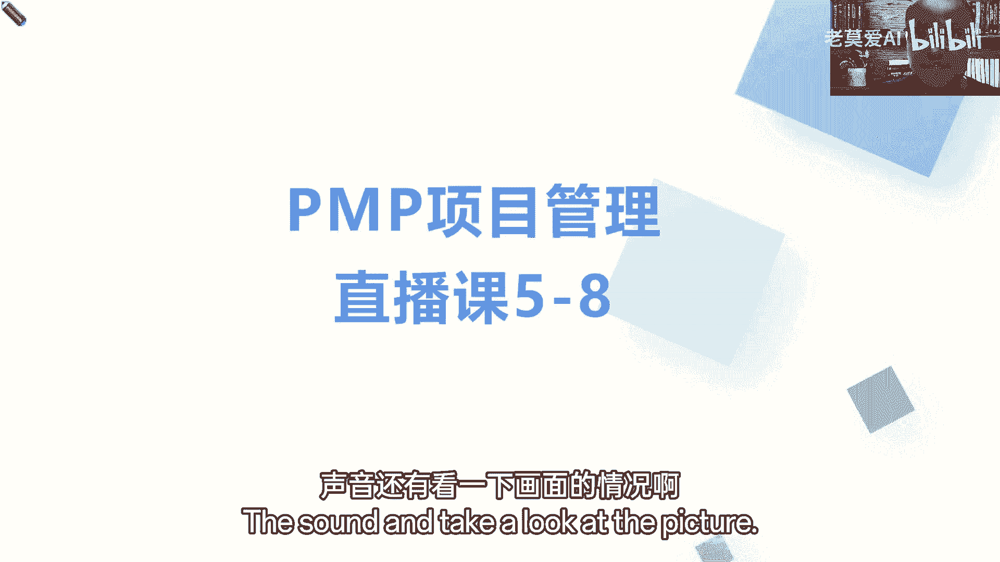

还有看一下画面的情况哦，好大家晚上好，现在时间来到了晚上的八点，我们就正式开始，今天晚上呢我们的重点就是讲一下，第5~8章啊，今天晚上重点我们就5~8章，第五章范围，第六章进度。

第七章成本以及第七第八章的整体的质量，那我们在上一节课我们就聊过这个事儿，就说接下来我们讲的讲的讲的这些东西呢，上节课我们虽然说讲了两块，一个是1~3章，一个是讲了四章，从整体上来分的话。

我们都知道这个1~3章呢，从本质上它就我们说的什么，它属于总的基础中的基础，第四章呢整合管理，它就是什么东西，它就类似于我们整体上你学完整合管理，把项目吧，整体上你就做了一遍，做了一遍。

其实我们当我们学第六章的时候，很多人啊在之前最早的时候，认为什么认为这个项目管理是什么，项目管理就是进度管理，就时间管理，那为什么说从现在我们学完项目管理，我们在前面，第四章我们又说的是项目管理是什么。

说项说项目管理究其本质，我们管的是什么，其实管的是整合管理，管的是整合管理，因为说不仅有时间，还有我们底下说的什么九大知识领域，因为我一直强调什么，强调九大知识领域，党根说就说我们虽然是十大。

但是九大是知识，第十大，更多是我们在做的过程中需要干的活，我们需要做的是什么，做的是整合的这么一个活，做的是什么，现在我们学过了，那我们就知道，那为什么，其实很多人在理解的时候。

为什么会把它理解成为我们做项目管理，通通都是在做时间管理，通通都是做什么叫做进度管理的，因为我们几乎所有的东西都围绕着什么，围绕着时间这一个纬度往前进行推进的，围绕着时间力度往下进行推进。

那么接下来我们学完了范围，进度，成本质量以及其他知识领域之后，你会发现它就是围绕着围绕着这个整体的，什么时间分领域领域来做的，所以我们前面讲整合，那我们现在再聊一下这个基本的点，基本的点。

比如说这是我们讲的一个什么时间的，一个基本维度，这是我们讲的一个时间的基本维度，那我们做项目怎么做呢，简单来说是什么，就是由什么人动用什么资源，在什么时间或者还有什么叫说什么地方之类的，那我们就不说了。

好不好，有什么人动用什么资源，在什么时间去做什么事，把事儿做成我们应有的样子，中间花了多少钱，不就是这样吗，前面这不叫什么，就是我们怎么做的，叫什么，这不是我们的资源吗，接下来你做什么事。

是不是就我们教授讲的范围吗，什么时间去做，这不是我们的时间，我们的进度吗，做成什么样子，不就是我们的什么质量吗，那花了多少钱，这不就是我们讲的什么讲的成本吗，这不就从基本上讲，我们12345讲了五块。

其实基本上就完了，只是这中间还有一个什么，还有一个我们是不是其实还有三个，一个是风险，一个是什么，一个是沟通，一个是干系人，但求从做事的角度来说，是不是我们这不是把事做完了。

做完之后我们是不是你得考虑风险，正常情况怎么做，接下来不是考虑风险吗，这不是考虑风险吗，好，那为什么沟通和干行程这一块我们把它拎出来，但是就说他更多人的方面，但是他更多是人的方，人的角度就是对外打交道。

人的角度一块是沟通，一块是干系的，所以把它加起来，这不就八块吗，八块还有一块什么采购，采购是专门针对什么资源的嘛，专门针对资源嘛，所以呢你看起来实际救济本质就只有这一块嘛，就只有这一块。

那在这一块在时间这个维度，我们整整个的范围，什么时间做什么事，整个的资源，我什么时间需要什么资源去做什么事，整合的成本我什么时间我需要多少钱，那当然质量就不用说了，质量是内嵌的一系列。

内在满足程度的一个基本要求，所以你在做范围的时候，他他就说什么时间，你做的这个事，这个事儿做成的质量如何对吧，都是指正，而风险呢它有没有在时间维度上，实际上它是跟着你做事。

实际上也是在时间维度什么进行分配的，一方面是外在客观的时间维度，对风险的一个感应，另外一方面是内在的，根据你做事不停的做，可能会出现不同的风险，他的一个时间维度，按时间维度，那采购呢。

那什么时间我需要什么资源，这不就是你什么时间，你该采购就是去采购了吗，你该采购就是去采购，那接下来我们讲沟通干系呢，我们更多我们是处理要处理人为的这什么关系，那一方面它是围绕着它。

更多也是围绕着时间来的，但是在我们说整体上来讲，从做事角度来讲，他只是我们做事的一个什么润滑剂，所以我们为什么说很多人说管项目管理，我就是在管旧的进度呢，也就是说只是说管项目管理。

我们是从时间的维度去管理相关的事，跟人管理相关的什么风险，仅此而已，所以我们第四章不是说了什么，我们讲的是什么审核管理，所以我们做项目做什么，做的是政，那好了，那接下来我们讲九大知识领域。

一整合整合到底是什么东西，叫整合什么东西，有哪些东西为你为，为你来一起来整合的，现在我们基本思路都做完了，今天我们讲的范围，进度成本质量，这是我们一般讲的什么，我们一般讲的项目管理的四大基本目标。

四大基本目标，第一个我们一般称为什么成为成果性目标，就是范围，你这个范围我们做完了，你要产出什么样的一个成果啊，一般叫成果性目标，第二个叫什么叫约束性目标，约束性目标时间你什么时间做，那是另外一个年龄。

关键是客户什么时间要这叫什么，这叫约束性目标，第二个你什么时间需要多少钱，这是一方面，这是你做的过程中，但是客户会给你一个什么总体的一个框架，预算哎，关键预算，这是我们在成本的范围范围的优质量。

第三个我们叫什么叫质量标准，也叫我们的质量目标，你必须达成的这么一个什么质量，约束的这么一个什么啊，约束目标，那必须达成这么一个月准目标好了，有了范围进度成本质量这几个基本目标之后，接下来干什么。

接下来就是我们下次课需要讲的，你要组织相关资源去达成你这个目标，那不就是内在资源，外在什么外在采购吗，在采购好，把这些都干完了，中间我们还涉及到风险，就是这么样的一回事，好，今天晚上我们重点看一下的。

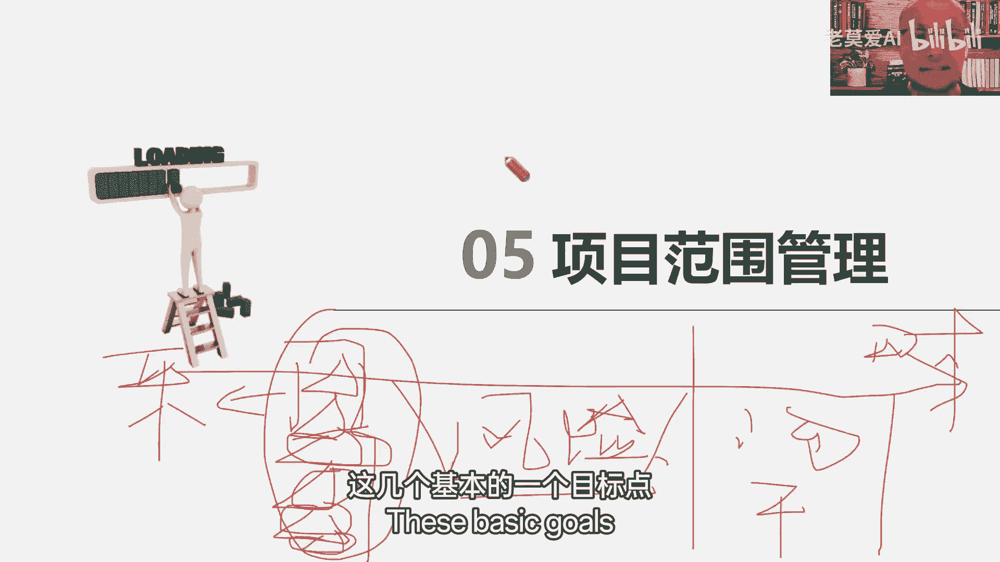

这几个基本的一个目标的好，首先我们聊聊整合的一个基本点，我们的一个要从做事的角度，从做事的角度，我为什么一定要把这个分清了，结合我们做项目的实际，我们做项目的实际。

很多时候我们就是从做事的角度来看怎么做啊，来看怎么做好，那现在聊完聊，我们聊聊范范围这块不是一共有5。6吗，六章就5。1，规划范围管理，5。2数据需求5。3这个定义范围，5。4出现WBS以及5。5。

确认范围以及5。6控制这个范围，那很多人在前面就犯错了，我这个咱先讲两个计划，第一个计划就是规划范围管理，范围化，范围管理，不输出的是一个什么需求管理计划对吧，跟一个范围管理计划好了。

这个时候我需要讲的重点，就是要去做什么做对比，跟什么做比对比，跟我们的范围基准计划对比，所以这个时候就像我们那会儿就说了，这个在4。2我们就说了，在我们的整体计划里面，一部分是负责管理的。

一部分是负责什么，负责技术，负责具体要干出来这个样子，现在我们有时候把它叫什么，叫实质性计划，把负责管理这块更多是什么方式，方法流程程序，看里面有没有具体的需要实施的需要。

我们技术业务层面需要具体实施的一些内容呢，没有，它更多是从管理角度，我们如何把管理的事能够做好，换句话说，如果按照我们整体思路来说，也就是说依据5。1的需求管理计划，我们来指导我们做5。2。

如何收集需求，依据5。1的范围管理计划，指导我们如何定义范围，如何创建WBS，以及如何确认范围，以及如何什么控制范围，这是两个计划它们之间的一个差别，所以呢在实际工作中可能是实际工作。

我们现在就就理论而谈，理论来说，在考试的阶段，我们能做什么，我们能更新，能改的一般只有实际计划，某某管理计划一般不改，为什么，因为当你真正出事，当你不会干的时候，你是需要去改它吗，不是你是需要去查阅它。

你是需要去什么去审阅它，那你说他能不能改呢，能啊，那你可能把这个事做完之后，你再去盖他呀，你可以说在做这个事的时候，你说这个事这个方法不对呀，我们经常在实际中不是不就遇到这样的状况吗，我这个范围变更了。

老板没说让我怎么变，结果我一变，客户骂我了，那这个事儿到底该怎么办呢，我查范围管理计划，看范围，看范围这一块，我到底应该怎么办呢，范围管理计划说如果你需要变更，那你就严格的按照变更管理。

这句话里面的流程来啊，那你严格的流程，但这块客户催的急，你没办法按照客户流程来，你就在想这个范围管理计划里面写的，这都是啥东西嘛，没办法执行吗，好了没办法执行归没办法执行，但是当时当下你要解决这个问题。

不外乎两个点，第一个严格按照计划来执行，但是你也说了，这个东西没办法执行，那你只有走到第二个点怎么办，你想改变，但是你想你你你这个时候想改变，你赶紧做什么了，你是就事而改变，最多是老板签签绿单。

千万百万千绿单，就是你跟现在的计划不一样，那千绿单开绿灯，你赶紧去做，把事儿做完再说，那赶紧回头干什么，回头再来更新你的什么文物管理计划，这样的一个基本的点好，这是第一个。

我说的是两个管理计划的这么一个，管理计划和基准计划，它们之间的差别，这第一个第二个我想再聊聊这个什么，5。2数据需求，很多学员在这个过程中就会出现异议，什么叫异议了，我们在前面，因为我我们很多人做项目。

在范围这一块对他的一个理解啊，我们现在学完PMP，我们都知道范围是什么，项目是临时性的工作范围，就是我临时性工作到底有什么，也就是说我的工作到底有什么，那产品范围是什么。

产品范围是我们需要具备的相关的特征，和需要具备的相关的功能，项目范围是我怎么把这个做出来，而应对相关的什么相关的工作，那实际上在实际工作中呢，起着很多的这个这个叫什么。

很多这些人没有做过收集需求的基本的动作，为什么呢，因为特别是像很多制造业的或者硬件业的，当你们拿到这个技术说明书的时候，当客户给你一份合同，给你一份技术说明书的时候，这个时候你已经发现一个什么点。

你会发现客户要什么东西，成果说清楚了，要什么技术标准，技术标准给你也说清楚了，好像你没有什么特别需要收集做什么，做需求收集的地方，那这个呢当然这种方法当然固然很好，但是呢其实在很多时候情况下。

比如说我们软件的很多行业啊，或者说我们有很多合同签的，很多行业在项目章程制定的时候呢，大的范围里面只有合同里面那些什么，那些基本的范围，但那些小的基本的细节，你在具体做具体事的时候，你还得把它干什么。

还得把它具体进吗，进一步的细化，再进一步的进行一个基本的细化，你比如说举个典型的例子，就前两天我刚到成都去给他们上，给他们上做做内训，上课中间他们是做，那么他们做那对国外做那个叫什么，用转换接设备的。

那好了，他们有标准设备没没有，但是难道有了标准设备，他们就能够直接用吗，不能他们告诉我那些就不能用，为什么呢，因为你看他们把设备卖到美国跟卖到中东，那是不一样的，你比如说美国跟中东两家公司。

同时找他们公司买东西，说我想要你们，你们公司这个热热能源转化的基本的处理器啊，那你买就好了，不是那么回事嘛，那重点是什么，我这个热处理器是标准的，没问题，但是你比如说一台330万啊。

要一台处理器签合同的时候，肯定大体应该是这样说的嘛，你要给我配一台这处理器，要保障热处理器在我这能干什么，能工作吗，但是其实从我们大的角度来说，A热处理器其实什么实际上都差不多的。

或者说它适用的范围都是都是差不多的，得你把合同给你签，那你能拿着这样直接去交付吗，不行那为什么你得到客户现场，还得去收集客户具体的相关的，具体细化的一些需求，你这种力用到什么样的环境下，你看美国跟中东。

他们两个用的温度就不一样，那温度就不一样，你在调的时候，可能在非包设计的时候以及调整的时候，可能就有一些不一样的地方，那这个就影响很大的，这个影响很大，你看都是一个热处理器，但中间还是差好多的。

所以我们要收集需求，你就在前面把这个东西就弄好，况且你比如说咱们在海做软件的朋友，和我们很多做软件的朋友，做软件的朋友往往拿到一个客户订单，客户订单光跟你说，我这个要解决什么样的一个问题。

或我要具备什么样的功能，要满足一个什么样的系统，好家伙把这个单签了，签完这个单之后，我大体怎么做的，12345做的投标之后，投标完之后一单150万，前两天在山东就是这样，他们投完标之后。

投完标之后发现150万，等真正往下做的时候，发现他愣了，然后发现他愣愣着干啥呢，就是在在收集客户具体的需求的时候，发现这个需求大体的需求当然没有意义，但是客户会反馈出些什么，跟他补助配合的一些什么。

小的一些基本的一些需求，况且对方客户又是国企，所以就很麻烦，但是如果说你投标又没中呃，或者你又没办法去具体的收集一些详细的需求，所以这就很麻烦，所以收集需求这一块我们指的是什么，一般情况下。

我们在智能章程之前，在做具体事之前，只有一个大体的一个需求，或者说我们认为他是什么，关键的需求和主要的需求，但是你在5。2数据需求阶段，其实你是做两个事情，一个是需求的具体的细化跟落地。

一个是结合着主要的观念需求，如何把这些MANA的需求给他干什么，给它更加完善，他做的是这么个事，所以很多人说数据需求不是先收集完了吗，我们又不是专业的需求数据救援，很多公司也有需求需求分析工程师嘛。

啊我们又不是专业需求人员，让我们去干，那不是那么回事啊，你需要把关键的把主要的区划进行细化，进行落地啊，看你们镇里实施的情况怎么样，第二个就是给他配套的相啊，相关的需求你也得把它拿到啊，你不做。

到时候你把这些东西，你把这关键的技术到时候交过去之后，对方客户又说这不行，那不合适，你到时候这个这个项目不行，这个项目也不行，好吧，这是我说的这这这这这需求这一块啊，需求这一块好。

我们其他的就一步一步一个一个看啊。

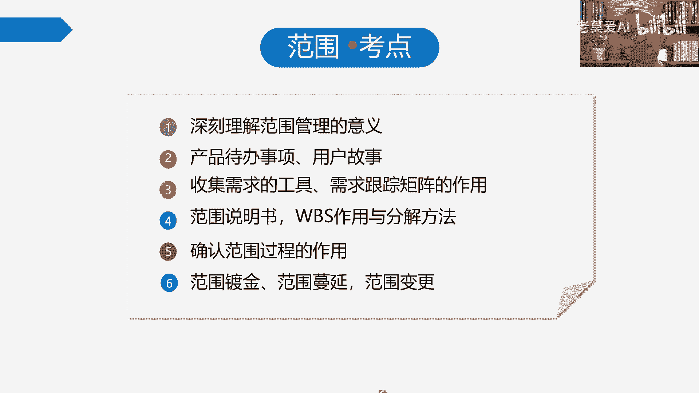

好那首先我们还是聊聊范围的基本概念，注意我们现在学完GMP的，我们就得知道知道一个什么东西，知道我们现在聊的这些基本的点讲到范围啊，因为在没做这个，没做PMP之谈，我们很多人对项目范围的理解就是什么。

他可能理解成我们项目一个什么产出物的，一个集合产出物理，那现在我们得知道我们的产出物叫什么，我们的产出物一般叫可交付成果哎，一般就叫可交付成果，但是现在产出物归产出物，它并不是我们什么。

并不是我们项目的范围，所以我们得理解清楚范围是吧，那范围我们把它分成两块，一块叫产品范围，一块叫项目范围，查询范围，更多关注什么，更多关注什么，某项产品服务，也就是说我们最终的产出物啊。

它所要具备的任何基本的功能，那基本特征和基本的功能，所以在这个时候，你也得知道产品到底是什么东西，产品这东西它就是一个什么一个载体，也就是说客户要的是产品吗，客户要的根本就不是产品。

就跟我们我们也是客户嘛，那我们要的你要产品干什么，你要的根本就是就不是产品，你要的是产品这个载体后面能够给你带来什么，能够它所拥有的特征，或者它所用的功能，能够带给你的基本的一个什么一个价值而已。

怎么就跟我们经常喝水一样，这个水杯你要这个水杯有啥用啊，这个载体有啥用，没有用啊，一毛钱用都没有，你要的是它能够盛水的这个功能，那很多女孩子她把照片还打在水杯上，那那那那那这样她要的是这样一个水杯上。

能够刻画我照片，让我天天看到自己美美的，这么一个什么特征和这么一个功能，那个载体有什么用呢，载体一毛钱用都没有，咱得有用没有用，它更多是展成建了一个基本好，这是我们讲产品，那接下来我们重点谈范围。

范围本身我们就说了项目的范围就是什么，项目范围，项目就是临时性的工作，所以项目的范围，就是说你这个临时性工作到底有多大，所以那我们只做哪些事，只做为了交付，我们这些刚才谈的相关的特性功能产品。

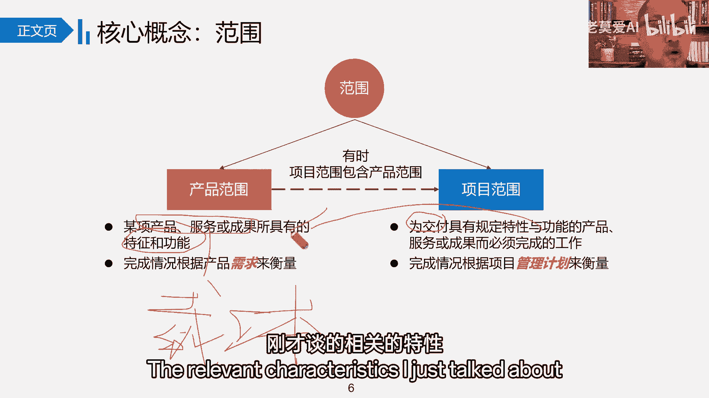

而我们必须完成的项目相关的工作相关，你看他们两个的衡量需求有这样，产品范围是按需求来衡量的，也就说我们产品范围前面还有个什么产品，还有一个需求，产品，还有一个需求，下面还有需求好了，聊聊需求吧。

需求这一块很简单的，比如说口渴了，口渴了需求，这是我们的需求，请问你的产品范围有哪些呢，很多人就想，那口渴了不就是水吗，很多人说饮料，很多人咖啡啊，很多人说，那什么蜜雪冰城，什么奶茶好了，这是什么。

我们谈的这么多都是都是具体的产品了，都已经水奶咖啡饮料，蜜雪冰城，这已经都是具体的产品了，那为了满足这个需求，为了跟客户之间进行明确，我们一定要有什么具体的产品的方案给到他们。

具体产品产品的方案方方案给到它，所以我们说我们的产品仅仅是一个什么，是个载体，客户要的不是载体，他要的是解决方案，那他他要的是怎么样解决，他口渴了吗，所以口渴了，我们这个产品必须要有什么。

比如说我们对这个玩意不懂啊，不懂多，我们就直接说吧，我们这个东西必须要什么，有一个结渴的功能，对不对，必须要有个解渴，那什么东西能解渴，能达到解渴这个功能呢，我们一般说液体的东西。

它能够达到解渴的这样的一些基本的功能，对它能够达到解渴的这样一些基本功能，所以你基于当下的环境，你给客户推荐，到时候推荐水，推荐咖啡，推荐这个茶还是推还是推荐其他的饮料，那是你推荐对吧。

那你比如说你推荐咖啡，你到星巴克里，你想喝一杯咖啡推荐，那接下来我们的项目范围是什么，我们项目范围就是把这个咖啡造出来，这就是我们什么我们项目的范围好吧，这就是我们项目范围，我们造咖啡的这个过程。

就是我们在什么完成项目的这么一个过程。

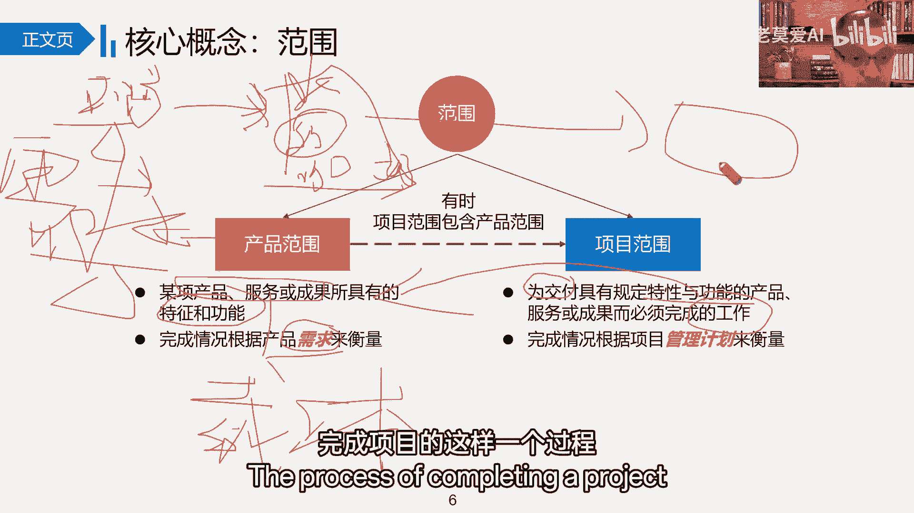

关于下面这个好吧好，那我们继续，首先把这个基本的点把它把把把它拎出来好了，那接下来我们跟他跟着我们讲范围这个需求，这个需求是在什么需求列表里面，已经在在这么项目范围说明书呢。

但是这里我们讲一个核心基本概念，这里用在什么，用在敏捷上，我们叫什么叫产品待办事项，他记住什么就是需求啊，记住是需求啊，记录需求。

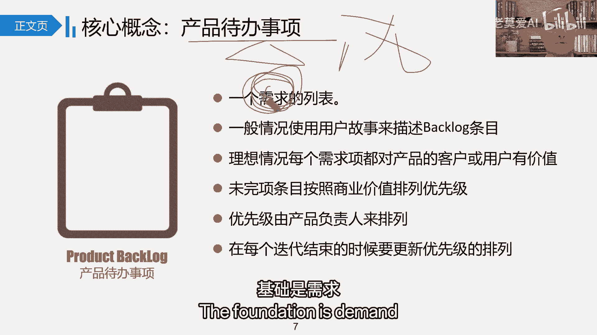

刚才我们就说了，刚才我们讲到这里的时候，正常情况下你把需求表示出来了，接下来你是不是得给他一个基本的，这个解决方案，这给客户一个基本解决方案，那有了解决方案，也方便帮你去实施底下的一个什么。

底下的一个解决方案，什么比较明确，但这种情况呢一般有具体的解决方案，一般更多就是什么，你既然有具体解决方案了，你知道该做什么呢，更多是用在什么，用在预测型生命周期上。

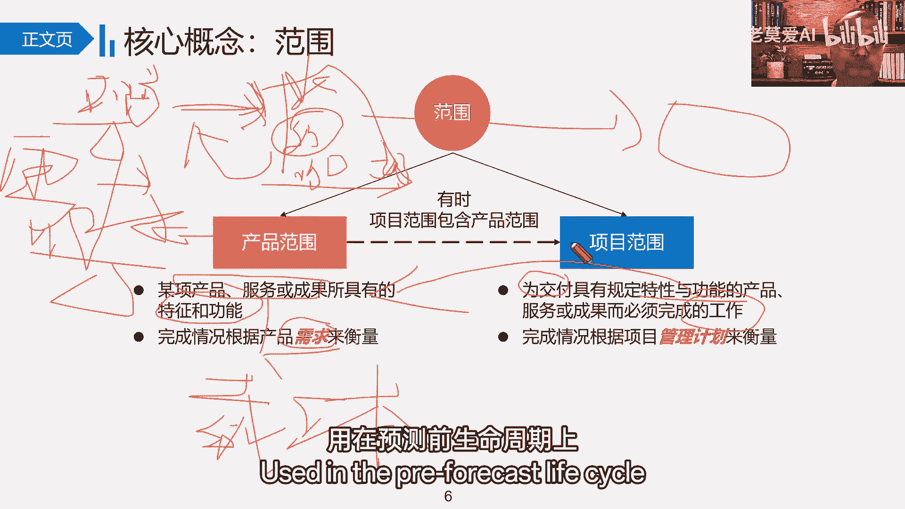

但是呢我们敏捷讲的什么，我们敏捷讲的本身有的时候需求比较模糊，对啊需求比较模糊，况且怎么做也有时候也比较模糊，做成什么样子推向市场，市场一定能够适应吗，也不太知道，换句话说他也比较模糊。

那这个时候我们都不知道怎么办了，在需求里面我们叫什么啊，在敏捷上面要么叫产品代码列表，叫适应性成本周期嘛对吧，那这个时候我们只是简单的把需求提出来，不做什么东西啊，不做具体的跟你的方案推荐。

以及不做具体的一个相关的什么一个对应，那什么时候做呢，比如说在每年里面，我们说PO，PO代表客户来整理这些相关的什么产品，代办事项，真正到需要做的时候，我们的研发团队，我们的team。

我们的develop team，Develop team，这个研发团队啊，他负责研发好了，这个时候他研发中具，至于给到什么样的解决方案呢。

就不一定了，因为那个时候当时我们只是基于方案。

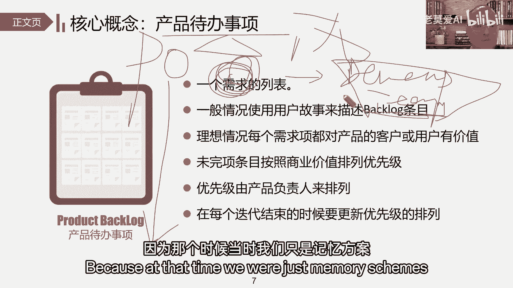

先给他一个什么，能给个解决方案，要我们在敏捷里面要干什么，又及时的一个什么反馈，简单来说，比如说我们刚才说口渴这个案例，你刚才说你口渴，你口渴了，客户说我有个需求，我口很可爱。

你现在怎么解决我口渴这个问题好了，现在研发团内碍于时间的口渴了，要有液体好水质这方面的水给你，结果你是不是又瞬间把水给客户了，谁给客户之后，是不是就可以瞬间拿到客户的什么客户的反馈。

客户说解渴的效果非常好，但是能不能喝的时候有点味道，是不是好一点呢，哦我们再来研发给客户一款什么一款饮料，又有水的解渴，又有饮料，他说这个这个这个饮料含糖量太高了，又不能提神。

那能不能给点能提升的东西好了，在这个基础上又讲过什么加工成咖啡了，到第三章的反馈就给他什么，给他一个基本的咖啡了，所以就是这样一个基本呢它就应该来的，所以我们的需求在需求列表里，而在敏捷里面。

我们只是把它叫什么叫产品代办事项啊，叫叫叫产品代办事项，这里有个什么产品代办代表，那为什么叫代办呢，因为每年里面我们重点关注什么，关注时间和在某一段时间之内，我们做出做多少事情，结合我们这个时间点。

结合我们做出的这个速率，只要我们做出这个基本的速率，我们来看它它到底能做成什么样好吧，所以我们要代办。

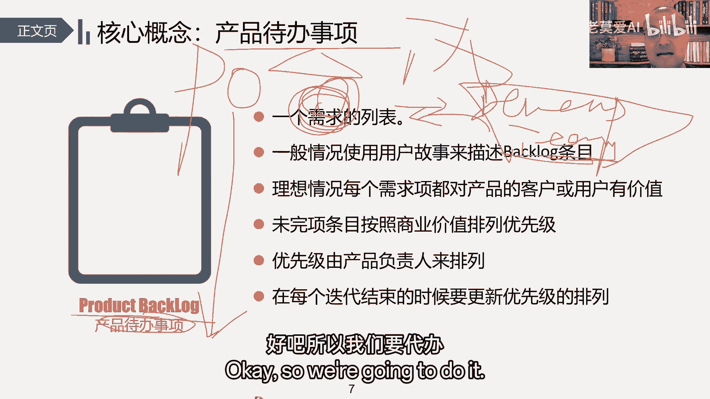

也不见得你提的这个需求啊，我都能给你办，因为是二时间有限，那这里是一些数据收集的。

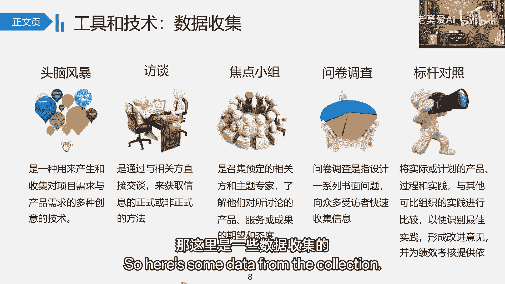

我们谈到的一些基本的一些工具，注意啊，现在对工具的理解什么样的，就是工具，所有的工具在我们用的过程中都是什么，都是一模一样的用法，基本上都是一模一样的用法，当然有些细节的差异，但是如果说就考试而言呃。

就考试而言，我们得知道工具的一个基本的特点，以及它能干什么事了，通道风暴我们要数量，不要质量，大家在一起，你说我我说访谈可以一对一访谈可以多对多。

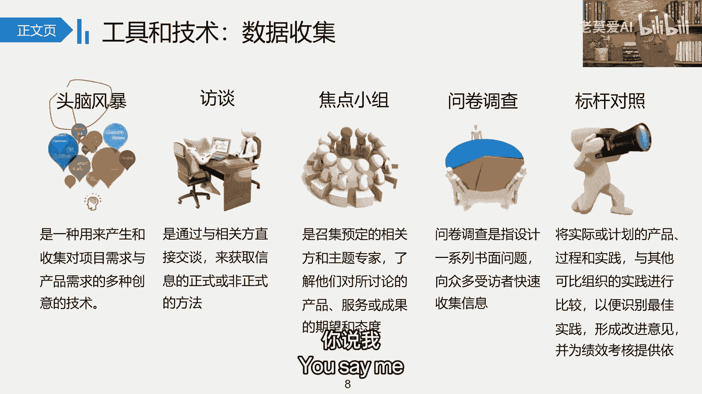

访谈就是通过谈话拿出来东西就完了。

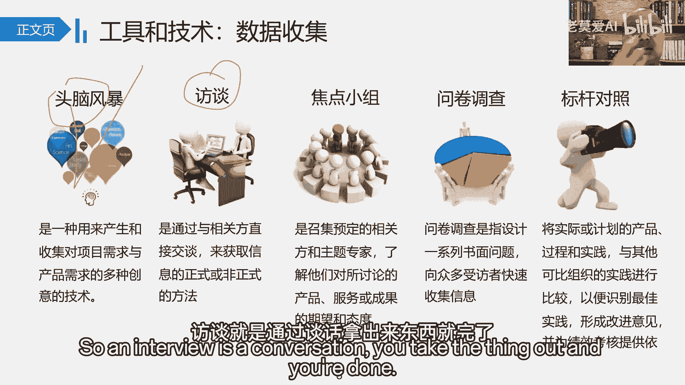

焦点小组叫什么叫焦点的小组，围绕某一个具体的焦点问题，我们来谈这么个事儿。

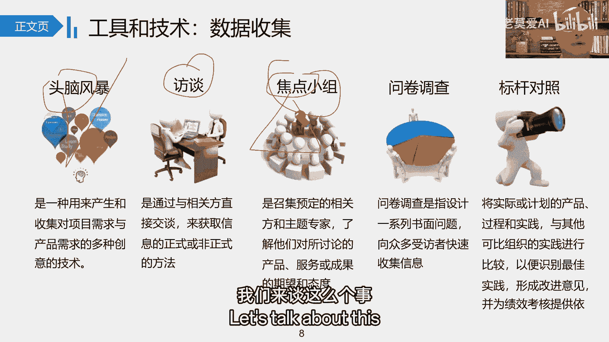

焦点小组嘛也叫焦点，主题小组都可以是吧，问卷调查大家见的比较多了。

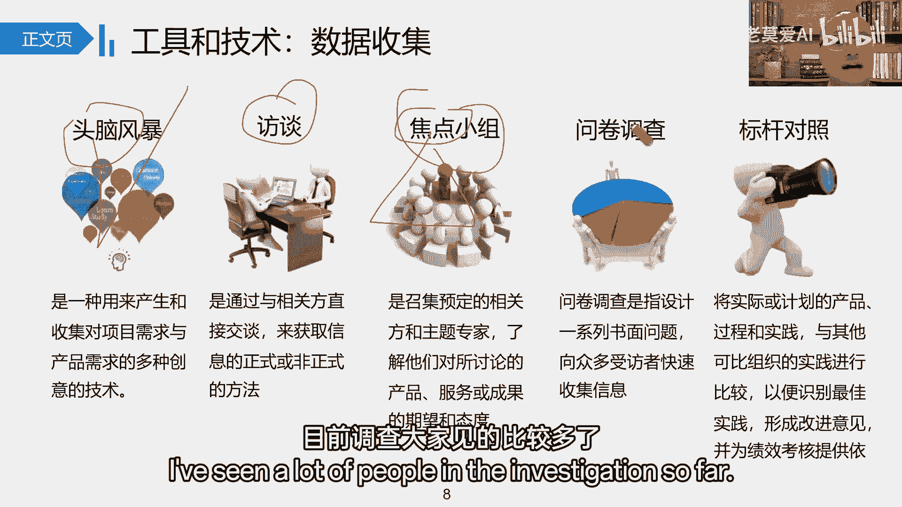

给你发一张问卷，更多是打勾打勾打勾打勾打勾打，勾完之后方便我知道你打这个勾的意思，就做一个基本的统计，统计之后方便我什么分析，对标杆对照就是两个嘛，一个找到标杆，一个做什么做对照嘛。

所以这个标杆呢你认为只要做得好的，都是我们的什么，都是我们的标杆，对照呢就我瞅着它，我看一下，我找到我的什么最佳时间找到我们的，所以说它具体在哪里用，怎么用，其实这里并没有一个明确的指示。

因为在书上各个阶段可能都会涉及到你，比如说数数据需求的时候，你也可以用标杆对照别人做什么，我做什么，这就是什么。

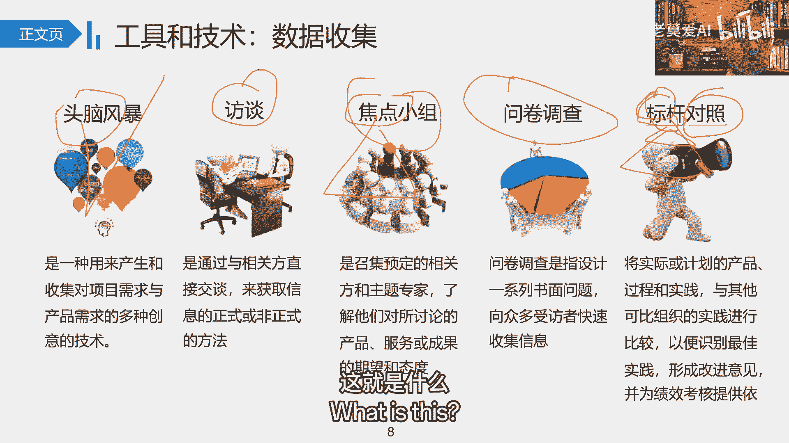

这就是数据需求，那质量那一块呢，你做质量的时候，你不知道这个质量标准怎么做。

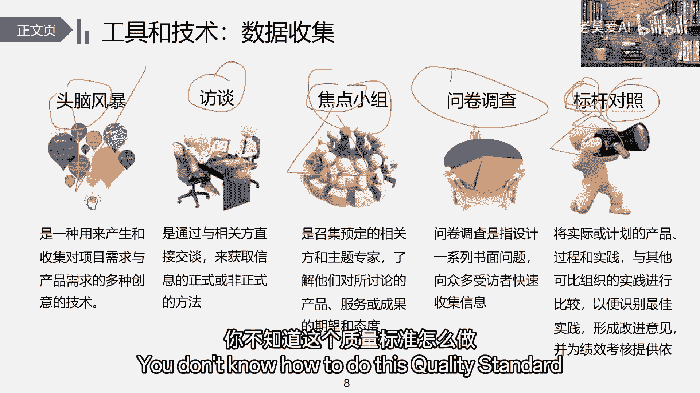

你也可以用标杆对照别人做成什么样子，我做成什么样子都是一样，大家更多关注。

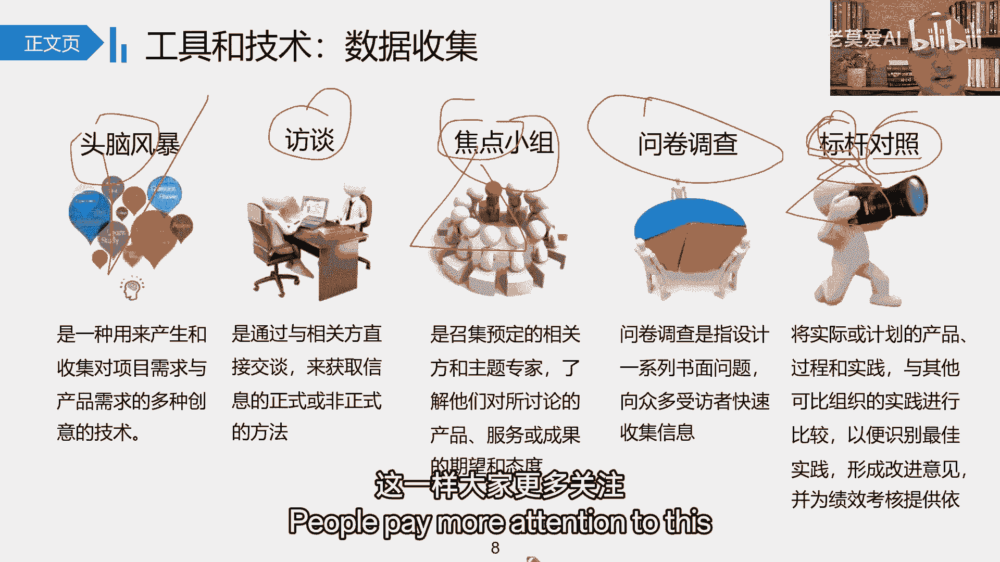

只是需要他得知道它的一个基本点，对它的一个基本点在哪里就好，那在我们这个在我们这个叫什么，在我们整体的工具里面有三大基本类型，一个叫数据收集，一个叫数据分析，一个叫数据什么最终的表现。

那数据收集我刚才说了，用那么多就三大类基本工具嘛，它的逻辑就这样，第一个我先把数据收集来，第二个把数据进行什么进行分析，第三个再把数据什么表现出来。

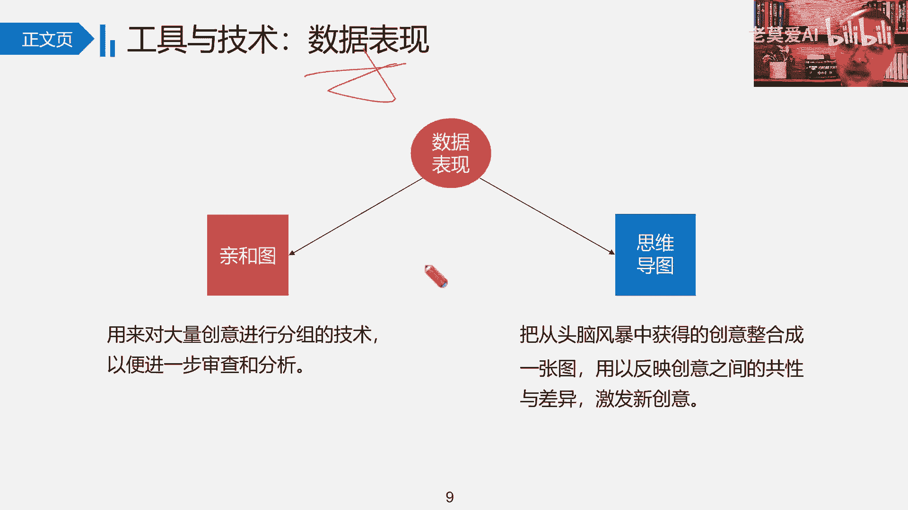