# 【最好的PMP课程】PMBOK6精华讲解3-2 - P1 - 老莫爱AI - BV1oH4y1F7Ty

他这讲的更多在哪里更多，他在什么叫紧密身上，到解密身上，他的核心目的就是什么，大家在一起叫什么，这叫紧密，大家在意这叫什么，这叫紧密，所以大家集中时集中办公，大家在意这叫什么，这叫解密，是这个意思啊。

是所谓解密矩阵，什么不是矩阵，而集中办公核心点是什么，集中办公核心点是，能够提升我们的什么工作效率，因为大家在一起其实沟通效率高了。

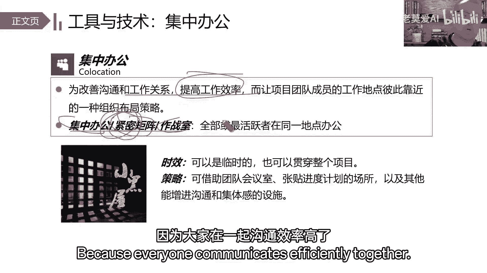

你即便你要你要你要处理一个什么事，就像我们后面说学冲突一样，你要处理一个什么事，导致即便起了冲突，我们也能迅速把它干什么。

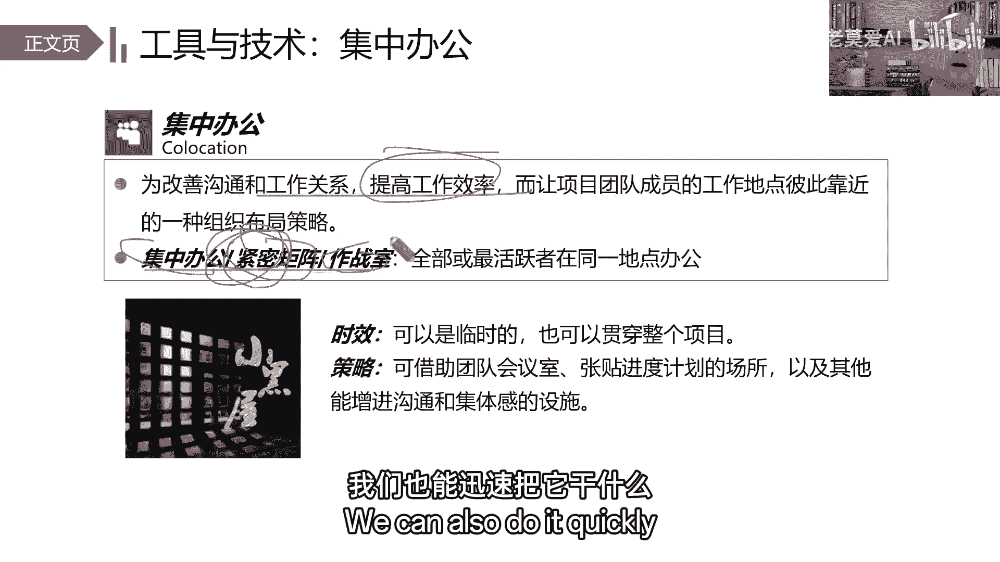

迅速把它解决掉，那方便我们干什么，方便我们对它做出一个直接的处理啊，提升我们的管理管理效率啊，提升我们的工作效率好啊，人际关系技能这一块就比较多了，我们前面讲项目经理也说过，影响力呀，谈判呀，激励呀。

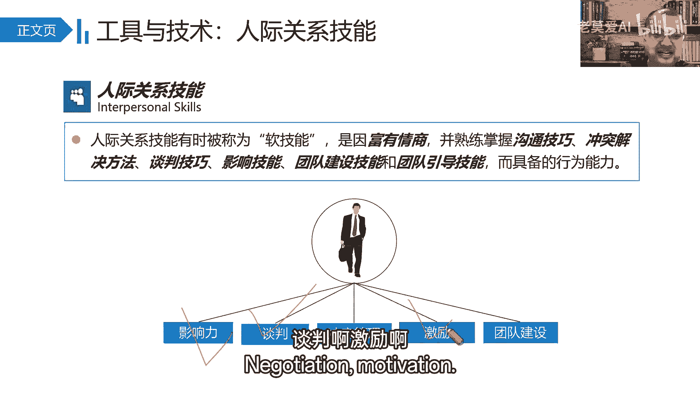

团建呀，还有相关的什么人跟人之间什么冲突建设，这些都是我们需要干什对涉及到的，那好我们来讲，我们来聊聊聊聊激励，我们来聊聊聊激励，聊聊激励，那我们在指导团队，有项目经理啊。

在指导团队带领团队往前冲的这么一个过程中，我们要善于发现团队在哪些方面，可能会出现一的什么一定一个状况，这个时候就需要我们干什么，需要我们出来运用不同的领导的能力去安利它。

其中最主要的一个领导论就涉及到我们了，我们按激励别人的能力，那为什么激励别的呢，可能在中间啊有一个不同的呃，有有它出现了一些压抑的点，那我们可能需要激利润，那激励别的时候，我们得知道什么。

知道什么时候能激励，或者说激励的时候要注意哪些基本的点，比如说我们讲领导风格，不同的领导风格，那我们要采用不同的什么主导型的，安慰型的，指导型的，在什么时间段，我们有不同的什么领导风格。

起到达到激励的一个目的，我们的彼得原理，这是我们项目的三大三大基本原理，风险的莫非原理，还有进度的什么帕累托学生脱学生综合，从炎症就我们人力资源的什么彼得原理，往往人呢从自身角度都想升到更高的位置。

但是他不考虑什么，不考虑能力，你把一个做技术的拉去做管理，他就一定做得好了，不见得就这这原理好，马斯洛原理什么就是马斯洛的一个金字塔吧，底层满足了我们才能什么往上层记住，所以你要激励他。

光从上层激励几次，底层都没满足，你怎么激励他，麦克利兰的成就动机理论，他需要期望理论，需要成就还是需要什么呀，他需要什么，我们就从动机角度什么对他什么才能起到什么，起到一个激励的点。

已经麦克格雷的什么XY理论，认为X都是不好的，Y都是好的对吧，那你进去的时候怎么把它从X转向YZ它呢，赫兹伯格的双因素理论，说什么基本的保健因素和什么基本的激励因素。

你在激励人要在什么激励层面对它进行激励，而不只是从么保健层面对它激励，没有太多意义，没有它的意义是吧，克洛普的整体的这个这么一个期望理论，我的需要，我的期望，你怎么帮我打通什么典型的投其所好。

谁说亚当斯的公平理论啊。

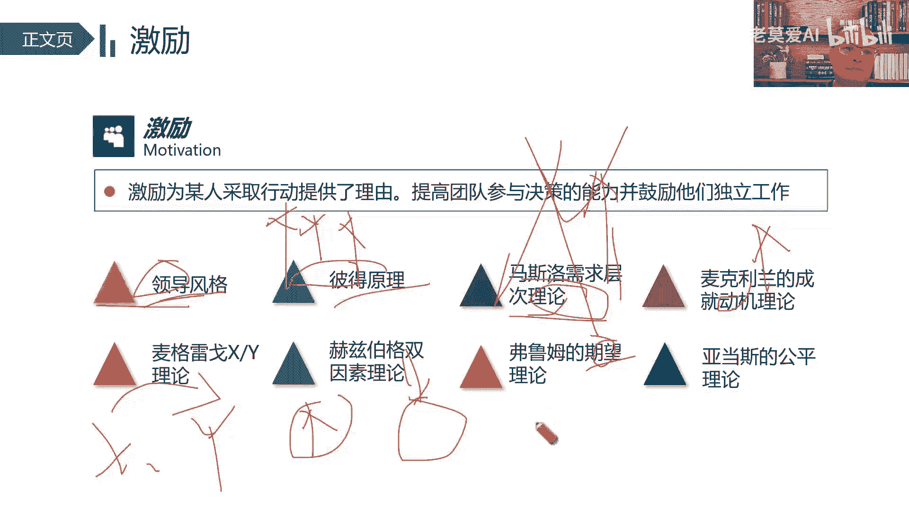

做什么是公平，还说什么是不公平的，那你从公平角度怎么样来激励他，这是你也需要考虑的，这是我们讲的基本的一个激励啊，所以我们需要做什么，做团建，这个团建大家一定要把它拎出来，拎出来在哪里。

就说这个团建跟我们平常讲的，我们天天去做团建一样啊，我们天天去做团建，什么不一样啊，所以我们这核心里面通过举办各种活动，强化内在的关系，打造我们的一个基本的一个活动，我们来做的这么一个什么团建。

我们可以说建设团队它是一个过程啊，他是一个我们讲的管理团队，9。4这这一过程，但是团队建设它是一个基本的工具和技术，他更多的是偏向于我们经常讲的，这个周末我们团建一下，出去聚个餐，这个周末我们团建一下。

出去唱个歌，类似于这样，但是在项目管理这个理论，就在PMI的这个理念里，他更多关注什么，更多关注是比如说5分钟的一程，5分钟的课程，非工作场合举办的一些基本的一些活动啊，我们更多关注什么。

更多关注的是这一块的事情，就是说我们把这团建已经不止不拘泥于说形式，在行为上我们一定要做成多多么厉害的形式，而在于说什么嘛，我们更加关注什么，我们时常开会5分钟，主要能起到让我们团队啊缩短时间。

提升能力，以调节我们之间什么关系这么一个效果。

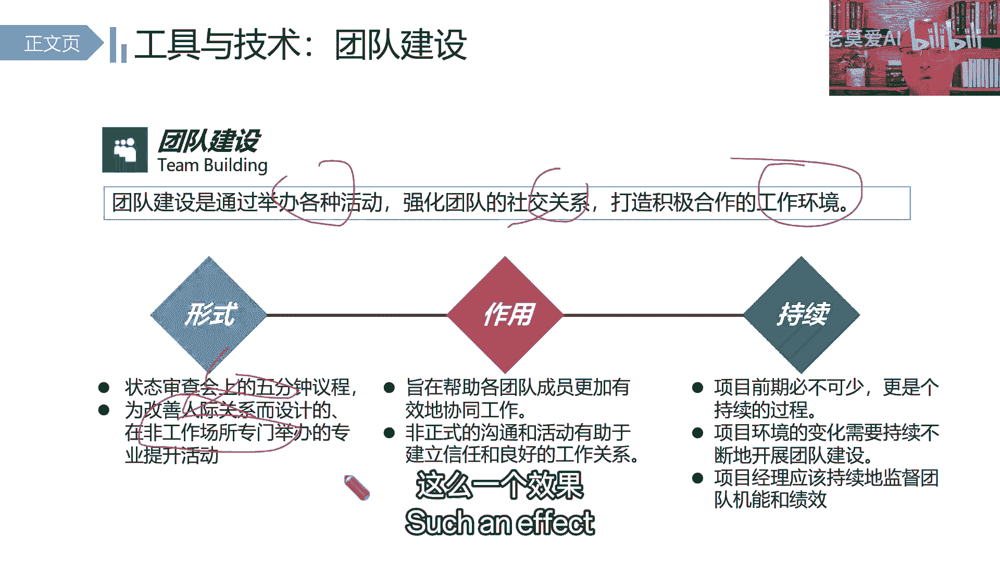

他就大达到我们一个团建的一个目的，来达到我们团队的一个目的，最终我们还做做好个人和团队的一个。

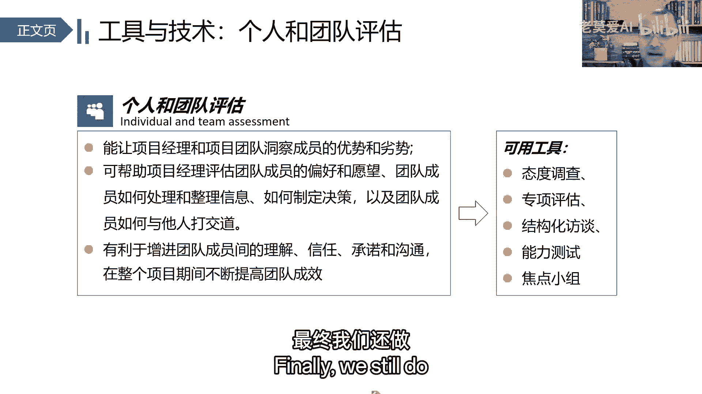

基本的一个评估啊，培训这里就更不用讲了，他没有什么特别的，但是我们要说的是个什么，你要做好培训，它的核心点是什么，核心点说，那你要基于什么，核心点是基于我们我们这叫什么，是基于我们的项目的呗。

资源管理计划来的，那里面要把什么时候培训什么说清楚啊。

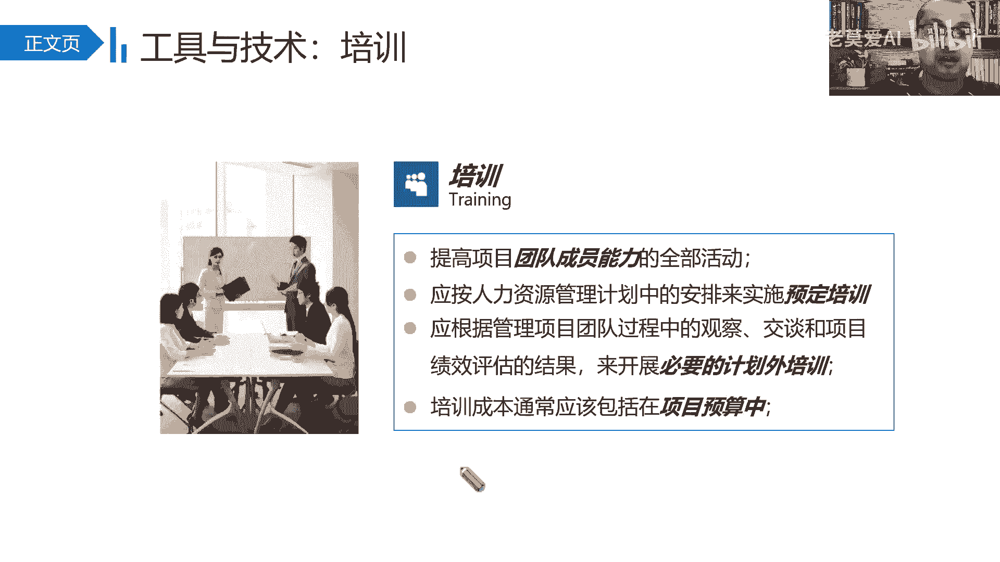

所以我们要提升我们团队技能啊，做相关的好，最终输出什么，我们团队绩效的一个评价，也就是建设团队最终输出我们什么，团队绩效评价，个人技能怎么样，团队技能怎么样，这是从技能角度来出发的。

接下来改说从团队角度，如果技能出发了，技能是个异类软实力，我们团队的什么合作力相对相对好了，所以我们的凝聚力就很强了，凝聚力由一旦很强，所以我们离职率相对嘛应该是比较低的。

所以他是什么一环套一环应该是这样过来的，它的相对性相对的，离地环套一环应该是这样过的。

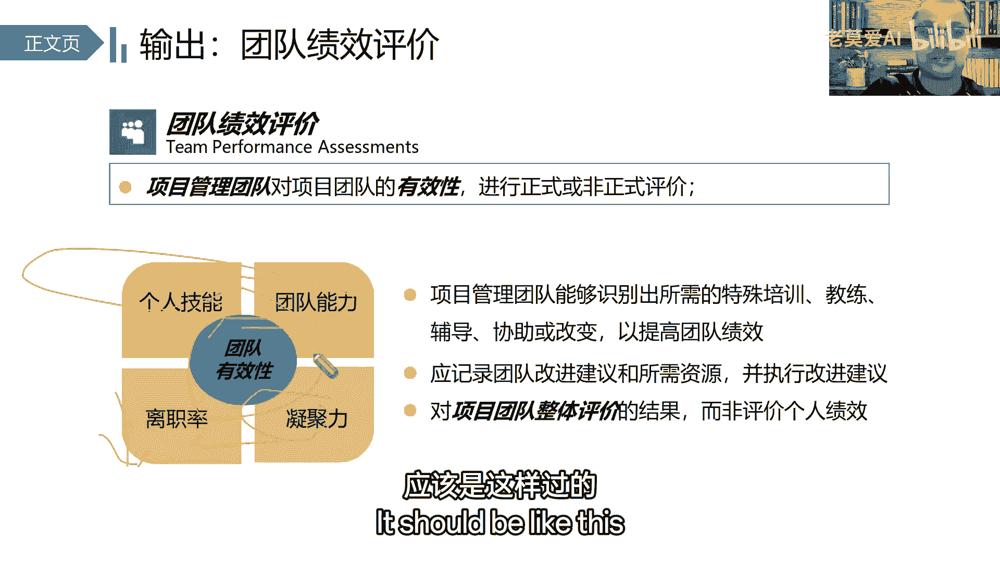

它是这样一个按基本的道理而言，这是我们建筑团队所输出的一个，团队绩效的一个好，接下来呢那就是什么，9。4建设团队，接下来9。5管理团队，管理团队，管理团队，这对我们来讲是一个什么点，对我们来讲一个点。

就我们到时候怎么样把这个把这个叫什么，把团队管理好，管理好之后，但是我们说管理团队，9。5管理团队我要再说一下，9。5管理团队他虽然放在什么，放在执行的这么一个什么部分，但是它实质的内容是什么。

实际上内容是我们从管理职能角度，你应该把它看成什么，看成监控的内容，为什么要看到监控的内容呢，因为我们讲职能不一样，如果你是执行，你只负责重点是干，加上你最多是什么自检，但是如果是监控这个职能呢。

更多观众是怎么样，你你如何能一手计划，一手实际把它放在一起，发现什么，发现偏差，如果是OK的，又OK不，如果是不OK的，我们及时的什么及时处理偏差，这个是我们现在要想想要做的一个点。

同样的在人这块也是这样的，通过了团队建设，刚才提升了我们的技能，提升了我们相关的什么软实力，提到什么程度呢，我们在资源管理计划里有啊，我们需要培训提升到什么程度，但是你做事的过程中真的有能达到那程度吗。

不能，所以我们通过管理团队就是干什么做监控性的，你做好了，你你你你这个计划做了一部分程度，直接做题方程，他们两个到底有没有按照标准来，按照标准来万事大吉，如果没按照呢，我们就需要干什么提升能力了。

所以从团建的角度来说是什么，是我们对项目所有人员整体能力所有的提升，但是从冲都不表示什么冲冲的，从管理团队角度讲是什么，是我们为了更我们讲什么，教会了更好的优化绩效，因为原则上来讲，就像我刚才说的。

从建设团队角度来讲，我们已经把我们团队建设的能力，提升到我们一个什么，其实呢我们刚才说的这个叫什么，这个叫我们按计划达到了一个基本的标准，现在的管理层面看你有没有达到这个标准啊，达到了万事大吉。

能力符合要求，达不到呢，那我再想想办法把它解决掉就完了，这中间呢最主要的就是我们讲的什么冲突，中间会出现一个冲突，主要是不一致进行冲突啊，那这冲突的五种是个基本的一个解决方案，撤退回避就是不干活。

不管他对吧，合作解决矫正它，这两种是刚好是对比，刚好是对不对，接下来呢强迫命令，这是没有办法，因为在某些特别的情况下，我们要行使我们的输赢的一个权利，必须要选择支持一方。

比如说我们在考题的时候说现在时间比较紧，任务比较重，那我们就一定决定支持A方，问你现在应该怎么办，问问移动决定支持A方啊，问你现在他选择哪一种，他有选择什么选择，强化并论好缓和和包容和妥协调解。

那妥协和调解就至少让一步，双方各让一步，有时候可能会造成双收，但是这个问题解决没有解决了，但是缓和和包容只是针对什么，只是针对当下的和谐气氛而言的问题解决了吗，未定不见得一定会得到解决啊。

不见得一定会得到解决好。

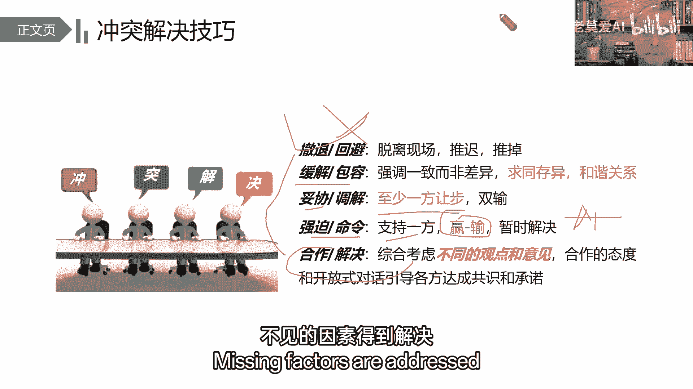

这是我们讲五种几个基本的一个关系是吧，你看我们当然在任何时候，在任何，如果可以的话，我们首选当然是合作，为什么合作已经解决了问题，解决问题，那么从解决冲突紧迫上来，如果特别紧迫，选择什么，选择强迫。

为什么呢，因为时间比较紧，任务比较重，我先拿一个东西，我先先做了再说嗯，因为我们做任何其他的几种方案都需要什么，都需要实践，涉及冲动人员相的权利，如果你没权利，那就不能选择什么强迫。

所以强迫一定针对什么，你有权利，我们才能强迫，还有涉及到什么，涉及到关系性，我们现在缓和和包容，是不是能够帮助我们维持好相关的关系啊，我只想讲相关的关系，最好的解决方案。

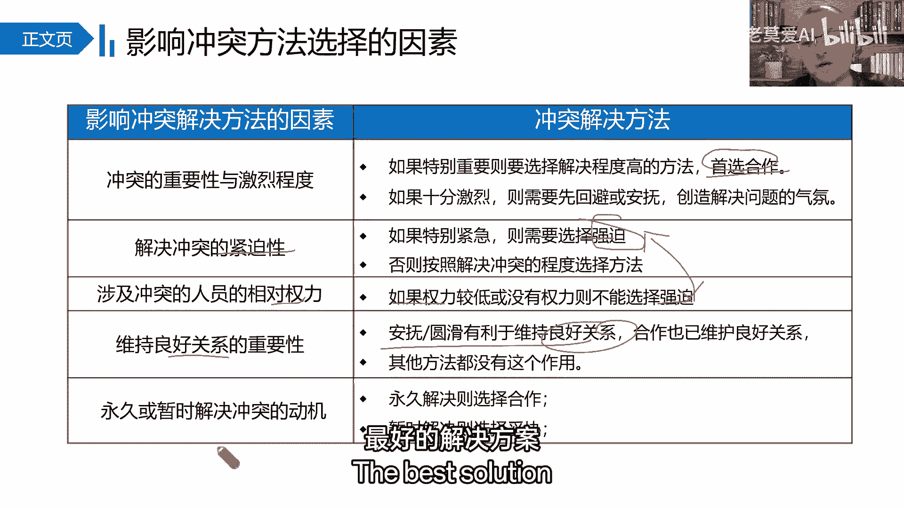

你永远是合作，暂时的解决是什么，是妥协，虽然会造成什么双输的局面。

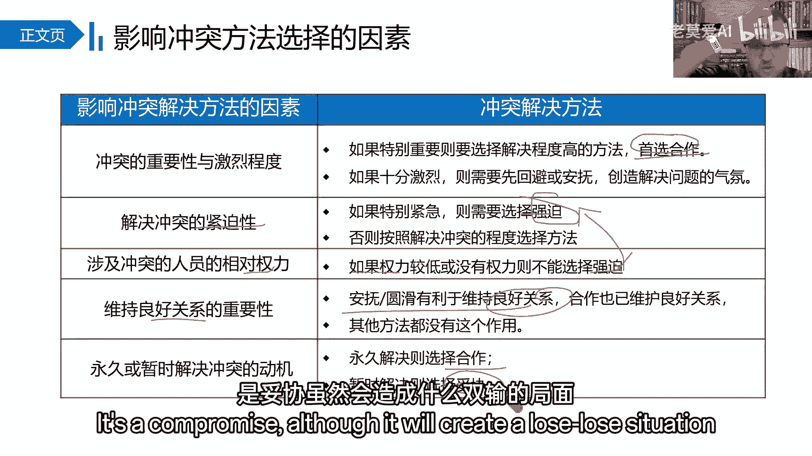

但是可能暂时得到什么得到解决好了，情商这一块，我们这个也不用讲太多哈，还要对我们的情绪商数，不管是我们对自己的情绪认知，还是对外的一种什么情绪管理啊，这个都是我们称为什么情商这一块。

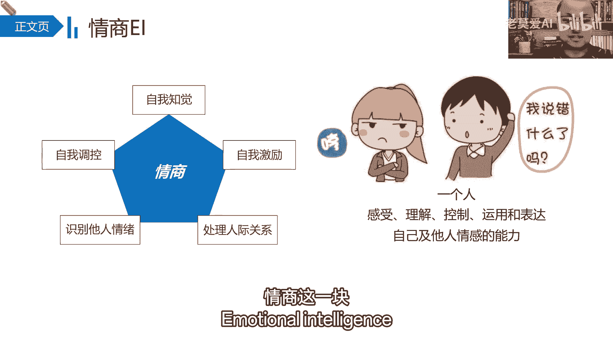

我们都可以把它称为情商这块好了，刚才我们讲管理团队，其实是我们人为的资源的管理。

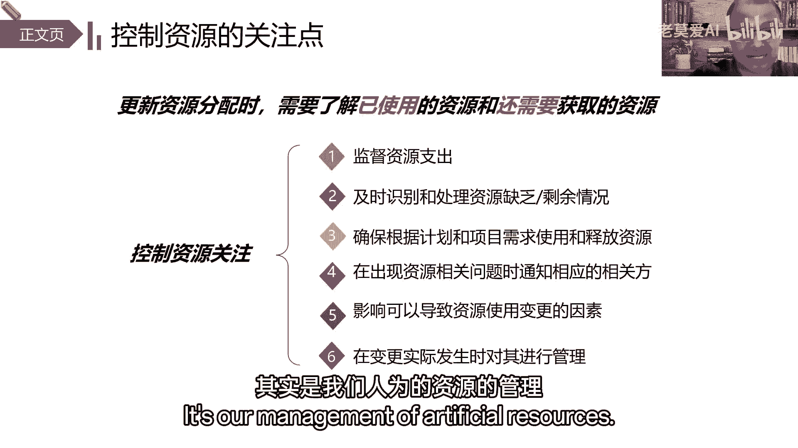

那实际上我们控制资源这块这块，倒没有什么好讲的，为什么你就按照整体的我们监控资源来说。

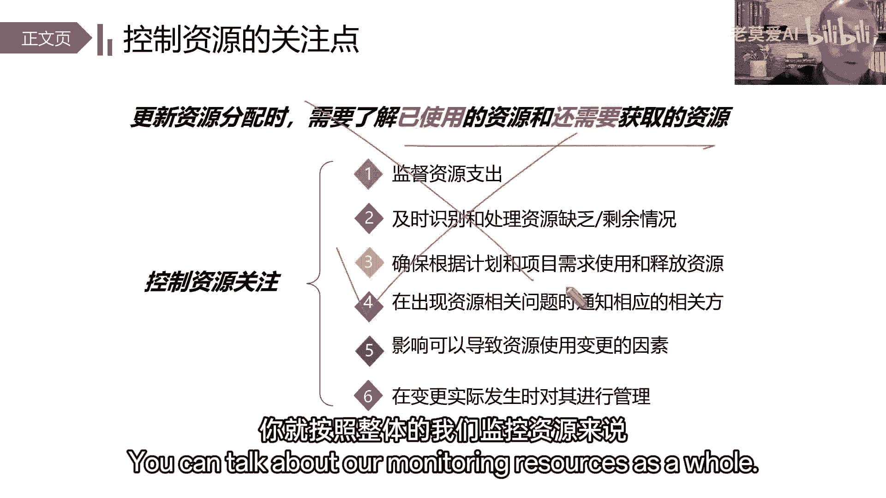

一手是计划，例如实际两个放在一起做什么做对比，周六有出现什么出现偏差，那我们做衡量了偏差，如果是AK的，那万事打击什么用，管了偏差，如果是NG的怎么办，不好的怎么办，我们可能需要做什么。

做我们相关的什么控制措施，所以前面这一系列都是什么。

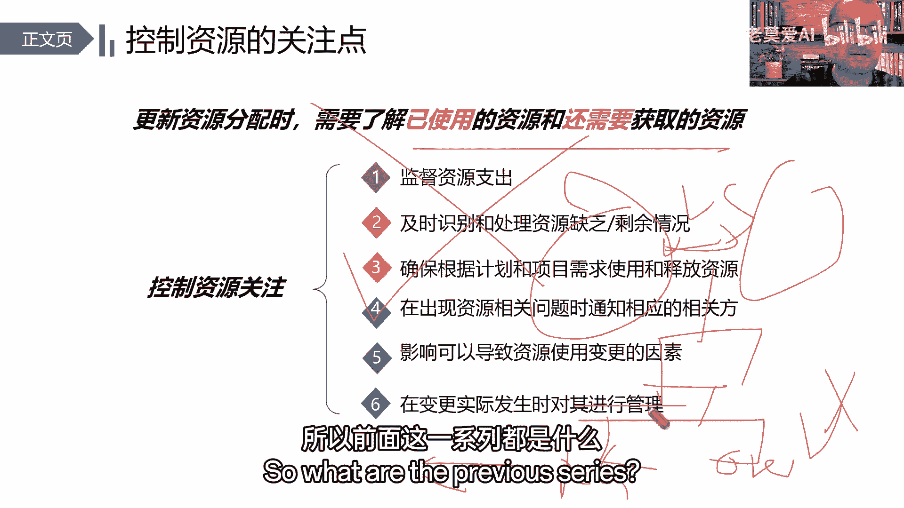

都属于监督那种做控制措施，就是把他拉回什么，拉回我们偏差的这么一个这么一个基本点，在这了啊，拜拜好吧，讲到这，我们就基本上把资源这一块带着大家的，大概理了一下这块啊，基本一点好，接下来我们聊聊沟通。

首先沟通我们跟谁沟通，跟我们干行人沟通，那沟通沟通个啥东西，那就把所有东西放在什么，我们在什么时间，你需要跟什么人，你什么频率，什么渠道，以什么方法，以什么格式跟他做，为什么沟通，所以沟通这一块哦。

核心的目的就是为了确保正确的人，在合适的时间做到输入了正确的信息，证明什么合适，什么渠道啊，什么方法，那个什么另当别论，但是这里我们要强调的是什么，就是在整本PMI里面，对不怎么在p m book里面。

我们强调的沟通是什么，我们都叫什么，都叫正式沟通，我们都叫什么，都把它叫正式沟通，对外政策，而不是说我们正常大家说话聊天，这种什么这种非正式沟通，我们更加关注什么，更加关注正式沟通，那就说政治沟通。

它解决的问题是什么，政治沟通他解决问题是我们什么，我们一个什么规则性的问题，它需要解释我们什么相关的规则性的，相关的问题，非正式沟通呢，实际上非正式沟通，咱非要说在项目上来讲什么比较重要。

就是我们讲的非正式沟通比较重要，有的人说学完了感觉很重要，感觉很多，但是更多的项目是什么重要，第一个沟通很重要，怎么跟识别干全能沟通，干预沟通的第二个风险很重要，我怎么跟风险，第三个就涉及到。

我们到时候怎么样控制我们的进度，这个很重要啊，那我们这里学的沟通更多是什么，我们本质来讲它就是什么，他这种信息的一个什么一个传啊，信息的一个传递好了，那我们讲沟通，我们在这里讲之前呢。

我们就先把沟通跟我们干线人管理这块，进行一个简单的一个基本的一个衔接好了，沟通我们不是什么呢，规划沟通嘛，规划沟通做什么，做沟通管理计划嘛，在做什么，在做管理，沟通在做什么，在做监督沟通嘛。

好了讲到这之后呢，我再说另外一个点，为什么我们这里叫监督，你注意要只要跟人打交道的都属于监督，因为在其实他属于控制，但是在美国人的这个古老外这个眼里，他觉得什么人是不能被控制，所以只要是沟通。

那时候跟人沟通，你不能控制，只能监督，所以我们还得9。5，9。999。5，把管理沟通放在什么，放在执行过程中，为什么，因为人是不能被控制的，也不能被监督的，才这个意思，接下来我们讲13章。

说不是说的什么，要叫什么管理干系人参与，监督干起人参与，并没有说控制干预人参与，因为你控制不了好吧，所以我们讲沟通的本质是什么，沟通的本质是信息的交换，那我们第十章讲项目沟通管理。

讲什么就讲如何做好信息的交换，信息拿什么交换信息，就拿某一个什么距离的载体来交换，这个载体是什么，我们的每周的周报啊，每日每日的日志，每周的周报，项目的进度报告，项目的什么例外报告项目的问题报告。

这不就是什么是差一些，什么什么信息的载体而已啊，信息的载体而已，那这样一个机会基本难，所以我们讲沟通这一块关注什么，关注的是载体的正确性，我们关注的其载体信息的什么正确性，那好了，我们说管理规划。

沟通做什么，我们现在不言而喻，就是做沟通计划嘛，沟通计划做什么，我们说了，前面我们讲4。2的时候，我们就讲计划，一个叫范围计划，进度计划跟成本计划，这是三大基准计划。

接下来我们认为它是我们过程中又需要执行的，我们说其他的计划都是什么，都是某某管理计划，都是讲我们什么管理没有实质内容，但是沟通管理计划他是一个什么双重的身份，第一个它里面会教你怎么沟通。

第二个也会告诉你你在什么时间应该跟什么人，以什么方式，以什么评理，什么格式跟这个人进行什么进行沟通，也说的很清楚，就这样一个一个一个一个基本点，可是这些信息你从哪里来呢。

就是通过前面什么叫分析干性人需求，你要干性人的需求，做好什么，做好相关的分析啊，如果你不分析干性的追求，那你拿了什么，怎么拿到干性的沟通需求了，好了，分析需求，我们再把这个需求作为沟通，作为沟通需求。

我们干什么去收集信息，整理信息，最后把信息做什么传递，所以监督工程干什么，监督工程就是监督你实际执行的这个点，有没有按照计划来，有没有按照计划做好这个意思，这是什么监督沟通。

所以我们从头到尾这里讲的什么，这里讲的只是针对什么，针对信息而言，那么它跟肝经这块联系在哪里，它联系在于什么，我们的前面识别干写呢，是要分析干线的沟通需求，也就是说第一步。

我们从这里先拿到了干型的什么干性需求，这是我们讲的什么，第一步，那干净有什么需求，你就干什么，你就要给什么需求啊，那这是你沟通必要做的，你领导说你两个月给我汇报一次啊，那你两个月就汇报一次啊。

那这是这是你必须要满足干性的地方，好这是我们讲的第一步，叫你现在你能够识别干净的需求，那你就识别干性的需求，你如果能够识别干事，你就识别干线需求，并且想办法去什么去满足人，干系人对沟通的什么。

对沟通的需求好，这是我们讲的什么，讲的第一步，那好我们再来聊聊第二步，聊聊第二第二步什么，我们在分析感性之后，是不是要规划干性人管理呀，在规划干型的管理核心在包括几个方面，第一个我们得确定干协的什么。

干净的什么，现在参与度以及我们期望他的一个什么参与度，这第一个，第二个为了让他达到这个参与度，我们的应对策略是什么，就这个吧，第三个就是中间有哪些需要通过沟通，去满足他的策略，这里又是什么又设的沟通。

所以一方面在前面识别干系人的时候，我们知道干细人对沟通的什么需求在哪里，这是一方面，第二方面我们沟通需求来自哪里，就来自于我们认为我我们认为哦，注意是我们认为我们应该给他发送的信息。

你比如说简单来说咱们很多人做项目，做项目做到最后呢，那不知道之后老板只是知道一个结果，当然他没有这个意，他他也没有这个需求，也全部知道你分析他的需求时候分析需求，他你觉得老板没有这个沟通需求啊。

没有这个说每周非要给他汇报一次，这个沟通需求，但是你后面慢慢慢慢做多了，你发现什么，有的有经验的项目经理会做这么一件事情，什么一件事情，他绝对不用每周给老板报报告一次，但是他觉得至少两周或者一个月。

他应该给老板什么说一次，那怎么说呢，叫什么，这叫规划干系人参与部分相关什么，怎么样提升肝性对我们的什么满意度，怎么样降低肝性对我们的什么一个抵制度，所以这个叫什么，我们做的就在这个过程，我们怎么办呢。

那我们认为怎么样能够满足他，你可以给他发送相关的什么信息，比如说我们说老板，我认为两周给他汇报一次，那我们怎么办，这不是他的沟通需求，老板没这个需求，但是我觉得为了搞定拿把，为了拿下老板。

我觉得应该还是两周去给他汇报一次，很好，两张给他汇吧，那怎么办，这是不是也是成为我们沟通计划的什么一个，第二个沟通需求的一个什么收入，所以我们的沟通计划有两层收入，第一个就是他说出来。

你分析出来他需要的什么沟通需求，基于我们的干型，他想要的我们给他就好，想要啥，我们给他，这是第一部分，第二部分呢我们为了搞定他，认为他想要的，我们也给他，这是我们讲的第二部分好吧，这是我们讲的第二法。

所以一般沟通需求了源自于两方，这就是他干什么，他跟监督干行人这块的一个什么一个基本联系，那好了，我们来讲讲差别规划，干预人参与管理干系人，以及什么后面的监督干系人参与好，现在有差别，现在什么有差别。

我们的监督沟通重点在于沟通什么，监督信息传递的什么正确性，但是我们监督干型人监督什么，就监督我们干显人对这个信息，或者对现状的一个反馈，的一个什么反馈的一个满意程度，那好了。

比如说我们现在说另外一个事情，什么事情呢，按照工程管理计划，我给我的经理呢发送了一份资料，经理现在看到资料之后发火了，注意是经理发火了，他说你这个资料为什么，现他说你这个资料为什么现在才发给我啊。

问你现在是什么原因，注意任何时候任何时候，我们说只要干干性人发火了，也就是说干性的什么状态不对吗，其实呢我们做什么，我专门做分析分析不外乎两个吗，第一个我们有没有做对，第二个他有没有新增。

第一个我们有说的是什么意思，将来是吧，看前人说你为什么现在才给我，那就意味着什么，意味着甘先生以前的态度是什么，他需要你昨天甚至大前天给他，你没有给他，那是什么，那是你沟通管理计划里面做错了。

你就说这是你什么，你没做到位，这是你没做到位，所以这是当然我们也存在这一点嘛，一方面我们存在我们对干型需求额需求是什么，分析错误我们干什么，我们分析错了，所以我没有做到位，这个很正常。

这第一部分是我们主动的原因，第二部分就是什么，其实就是干性变动的原因，变变动人员他以前的需求是什么，以前的需求我想说是每周给他，每两周给他传一次，现在区域变成什么，它区间区域变成什么。

变成每一周都要给他传一次，所以实际上是什么，是他的需求变了，那我们怎么办，按流程来，我们到底在前面干什么，识别干写成分析感染性的沟通需求，分析感性需求，再走流程，规划感情人参与管理。

该进程再建造改进院参与，而我们沟通管理计划的沟通需求的来源，就这两方面，一方面是通过分析干预的需求来说来，一般是规划干预的时候是吧，规划干性人参与的时候，把我们干线人相关的什么组也给我们。

我们自己认为他应该需求的，或者我们认为这样做可以去满足他的相关需求，我们怎么办，我们就会来跟他沟通，是这样一个基本点，好吧啊，这是两者之间的一个什么联系好。

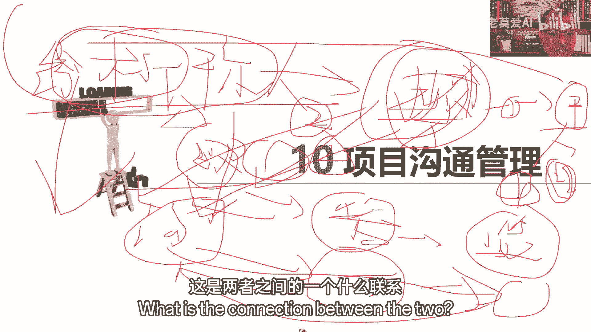

那我们来看一下波动这一块的，最基本的一个状况，你看沟通是什么什么，沟通本质是我们讲的什么信息的交换，好在这里呢，那我们就说一下相关的交换方法，书面口头啊，政治分成这个看一下就好，这看啊。

说书面的分类大家都经常都在用。

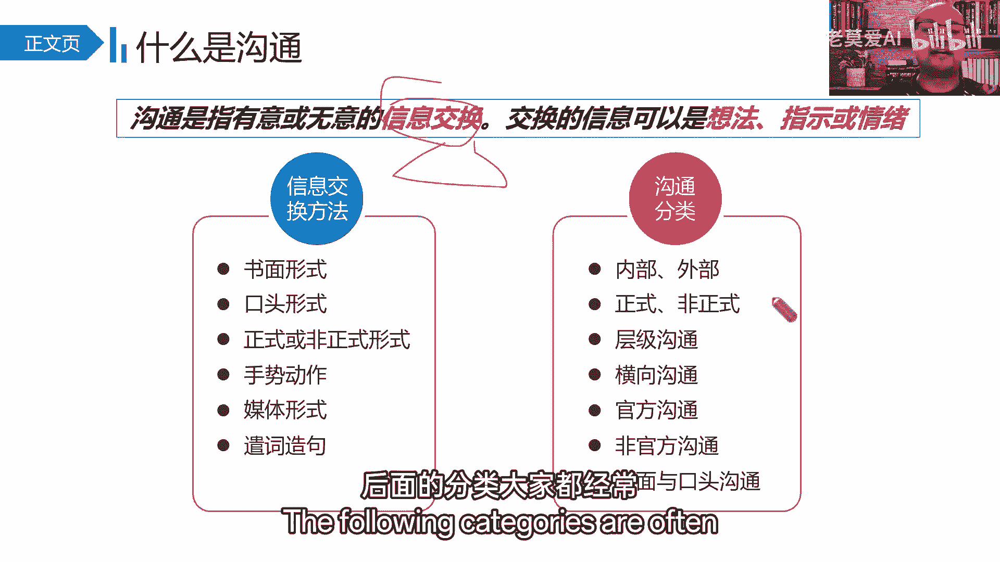

大家也知道这个就好，知道知道一下就好好，这是我们相关的什么5538和七法则嘛，这实际上是我们经常研究出来，一个他的一个什么，我们在沟通过程中，它的一个基本的法则，基本的法则在这里。

我们要知道很多人把理解成什么，理解成形式化，什么叫形式化，那5/5 50%都是靠肢体语言，38%靠语言语语气语调，7%才是我们真正内容的体现，但是你不要忘我们的核心目的，沟通问什么是为了信息，他的心的。

他的信息沟通的本质是什么，是信息的交流，信息的交换，那也就意味着什么，意味着你先得有确定合理的信息，才能说在合理信息这个大前提下，相关的55只是你用肢体动作表现出来。

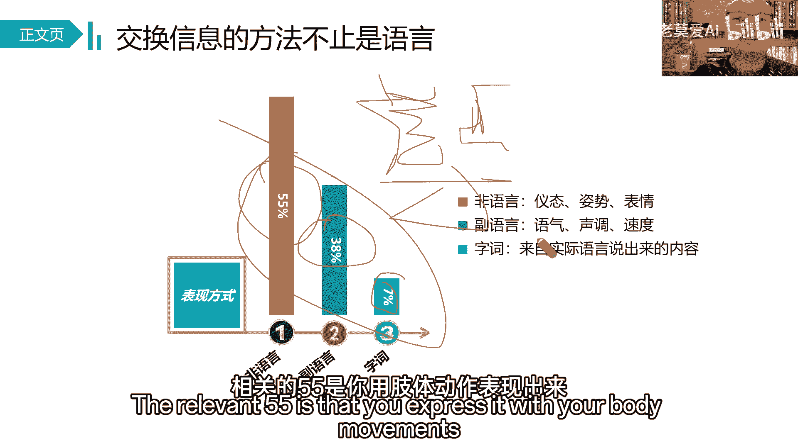

相关的38只是你用语气语调表现出来。

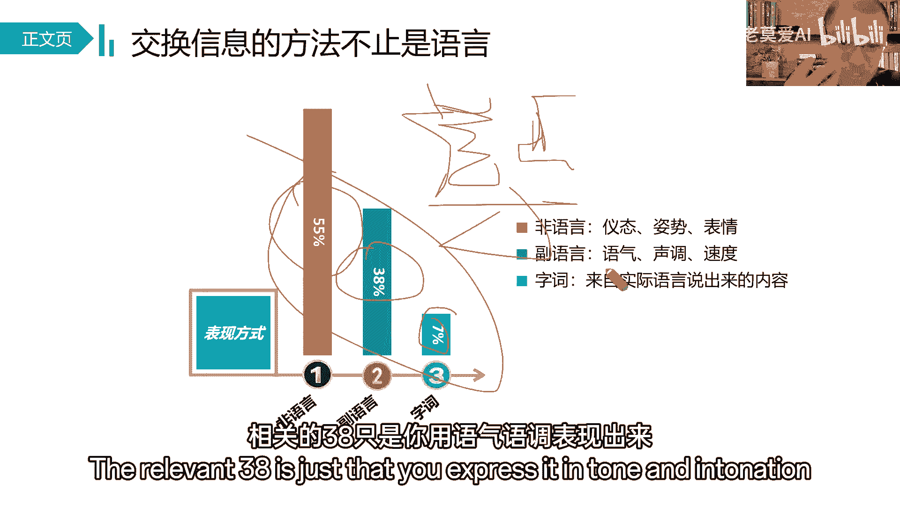

急好吧啊，就那而已，你不能光顾着肢体动作而治，这动作好吧，好在这里没有什么特别重要，但是有个点非常重要，特别注意一下哟，我们现在很多人把email不是叫做什么，叫做正式的书面的，正式的书面。

但是在以前的划分过程中啊，我们还是把它划分在什么非正式的书面，在这里我们要注意啊，考试如果真的出现email，你把它认为什么就是非正式的书面，好吧，非正式书面啊好吧。

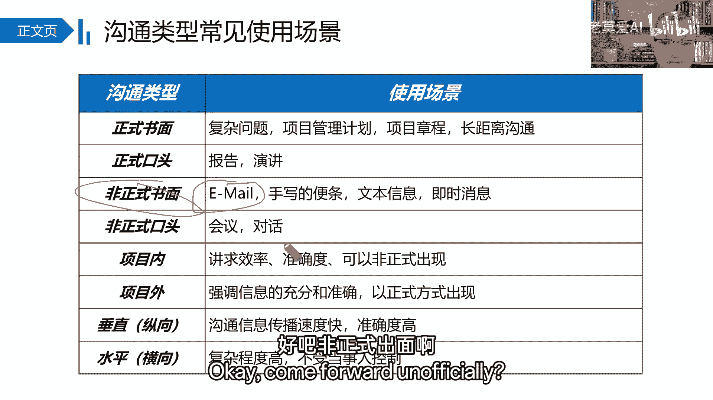

沟通中的一个5C的原则，就是五个五个单词的缩写，前取前面那个A，也就是说5C原则有助于我们进行什么，进行合理的沟通，你看你正确的语法和拼写，有助于我们沟通，为什么他对比嘛，对比你如果错误的或者有误解的。

这些语法和拼写简洁的表述，他指的是你如果说你简洁表述，我是不是效率更高，如果你多余的表述，我是效率低一点，如果你目的不清晰，肯定很麻烦，连贯的逻辑对应什么不连贯的逻辑。

以及可控的语句和对应什么不可控的语句，也就是说在这个5C的语言组织下，我们什么，我们相对就更能快地理解我们什么内容，达到我们信息交换的一个什么本质和目的，就是假如我们沟通的本质和目的。

就是信息进行什么啊，进行信息的交换好。

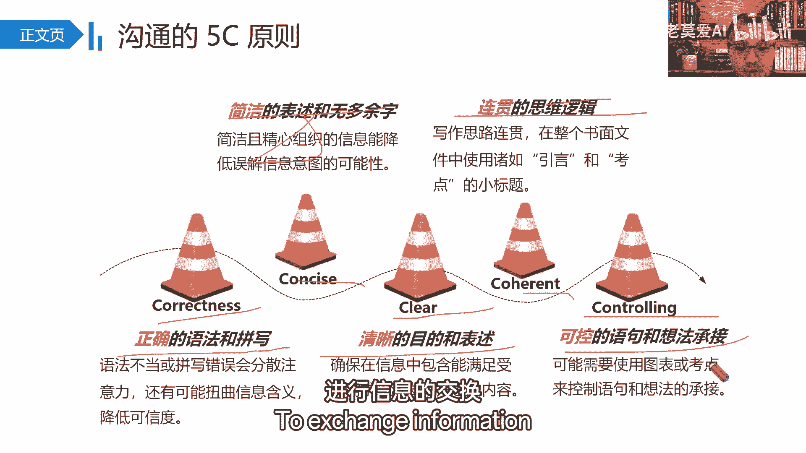

那在信息的过程中，我们还得考虑什么，还得考虑沟通相关的什么渠道，这就告诉我们什么沟通路径，也就是什么一个东西，资料拿到手了，你到底要跟多少人沟通，要跟谁沟通好，在这里我们需要注意什么。

这个算法我们现在算法都是什么，考试都是这种，都是这种都是全渠道沟通，两个人之间算一条什么算一条渠道，因为我对你只能算一条，算一条渠道，所以它的算法呢是二分之1N乘N减一。

这是我们典型的什么数学里面的排列的算法，排列的算法啊，组合的算法，你认为你跟我和我跟你这是算什么，算一条渠道啊，考试的时候注意这个算法很简单，主要注意什么，注意两个基本的落点在哪里。

第一个他给你搞文字游戏，有的人说我的项目团队增加了五人，跟增加到七人，这个什么这个是基本不一样的概念，增加了五人，就是在基础上再加五人，增加到七人，你现在团队一共有什么，一共有七人。

那你算的时候要注意一些，这第一个就是我们考文字游戏，第二个呢就是什么，他会给你讲考项目经理这个隐藏的文字游戏，说项目经理底下有五个人，那就说明加上项目经理一共几个人，一共六个人，那全渠道沟通就按六来算。

有的人告诉我，我整个项目团队有十个人，那就按什么按十个人来算对吧，就按十个人来算。

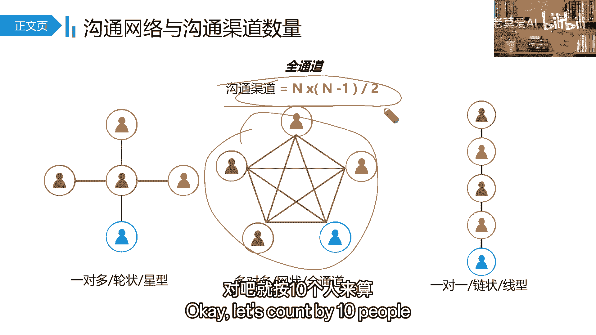

要注意一下这些基本的一个点就行了，你看提到项目有多少成员不再单独计算，项目经理，项目经理，有人咱们叫你要干什么，除了项目经理还包括什么。

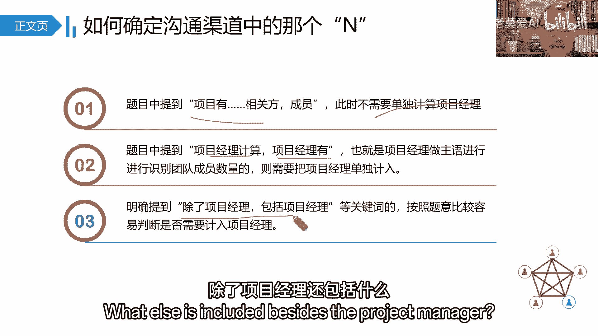

你要注意这些基本的语言就好，就看它包不包括注意下这个就好，好吧啊，好在考虑过程中，在沟通过程中还我们还得沟通什么，还得了解这样一个什么基本的一个沟通模型，沟通模型，那这基本沟通模型就体现了我们什么。

体现了，其实就体现了我们在后面讲的什么，三种基本的沟通方法，互动式推式和相关的什么和相关的拉屎，互动式推式和相关和相关的拉屎，这样预计一个基本点，那我们发送方编码之后，我们就传递对吧。

传递方接触方解码之后呢，他就收到了嘛，解码之后原则来讲，其实他可以叫完了完了，这叫整的什么P审，这叫典型的P审，那大家一般什么跟多搞成互动，是怎么还给对方说收到，但收到只能确保什么，只能确保语言收到。

不能确保什么，不能确保你理解，也不能确保就就确保你意识到到底怎么回事，那换了另外一种方法是什么，你知道知道什么，知道你把这个复述一遍之后，对内容作为什么确认和清晰了解之后，我们再做一做一个反馈。

这就叫什么典型的互动，如果不对，我们再来确认对了，我们再来循环对吧。

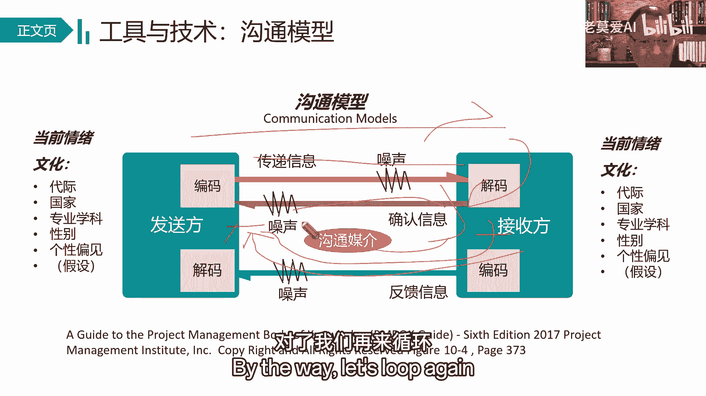

这就是典型的什么互动式啊，互动的技术我们就不聊，没什么太多的啊，这三种基本的形式我们那会都说了是吧，互动式这是最好的注意哦，它的实时哦，也就是说他有什么他有时间上的限制，有的人说邮件算不算互动式呢。

你非要说他也算，但是你看邮件，一般情况下我们把邮件发出去，是不是你今天晚上，或者说你今天下午才能给我处理，才能给我处理，那那那毕竟不是什么，那你看我们活动是什么会议电话，视频会议社交媒体和什么。

他点了什么即时信息，为什么要体现什么实时呢，就是在于说你一言我一语，这种什么及时的这种场面嘛，才能叫互动式，如果没有这种及时场面，它就不能叫互动式，有人问我说，微信微信到底算不算互动沟通呢。

到底算不算互通沟通，来你发了个消息，我今天看了，没时间回，或者我压根就没回，我明天给你回，后天给你回，这玩意能叫互动是吗，这咋互动呀，我们互动你指的什么，我们实时互动沟通，所以不管是会议还是视频。

有的人说，那我在那想一下，我不愿意说话，注意你在想一下，不愿意说话，也算我们互动时为什么，那那我就默认你现在对这个问题是什么，或者没有答案，或者你的答案现在有问题对，那你对我这个问题已经给出了答案。

你现在不愿意答案，或者说你现在没有答案，那我也知道结果了，这叫什么，这叫互动式推式呢，更多是从自己往外推，反正我发出去就行了，我发出去拉式呢更多是什么，从外面更多的东西往回拉，往回拉。

有用的东西我都给他干什么，有用我都给他拉回来，就这样一基本点啊，这样你好吧啊好。

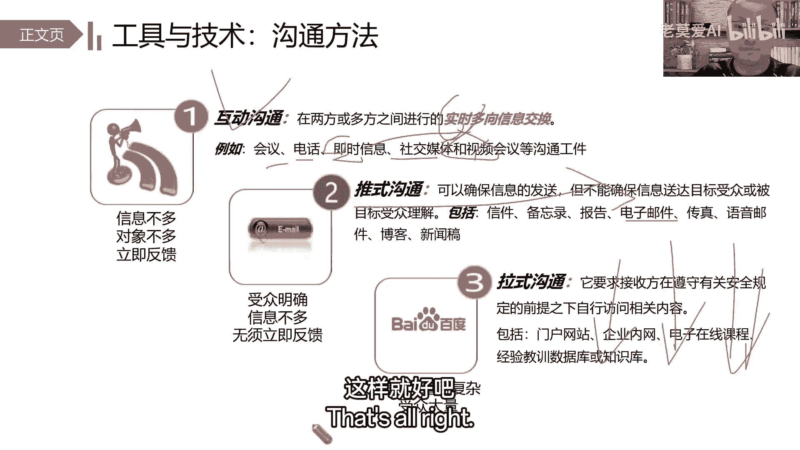

所以沟通管理计划内容它高，包括我们说了有两部分。

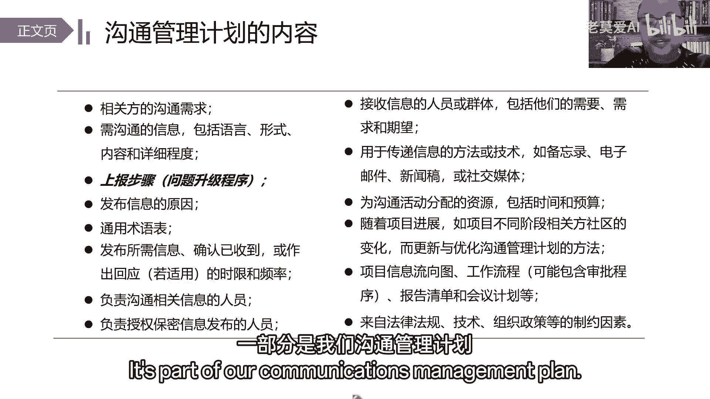