# 【最好的PMP课程】PMBOK6精华讲解3-4 - P1 - 老莫爱AI - BV1LZ421T78w

我们的应急计划是针对什么应应，应急应对策略而来的，弹回计划就是我们经常讲的叫plan b嘛，啊plan b你有plan b吗，措施呢指的什么意思，前期啥也没做，也没有特别的计划发生，怎么办。

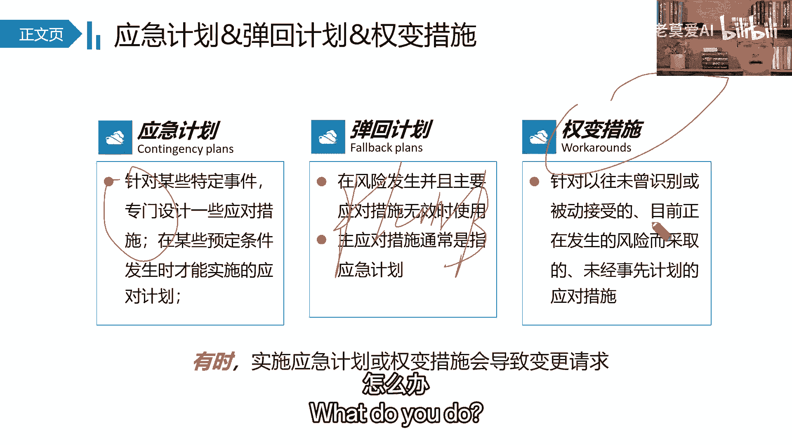

司马开导开导代码，就我们啊基于经验而来的一个基本点好了，这是我们我们刚才讲个体，这是我们整体整体里面，你看规避对开拓转移，对分享减轻对提高以及最终什么结束，很多人会问什么，为什么整体里面他没有上报嘞。

我们前面讲五种策略里面都有上报，在这里面为啥没上报嘞，注意整体风险给予的对象是什么，就是项目的结果而言呢，请问项目结果是不是我们考虑的重点，不是因为我们的最终目标是要产生项目，结果要产生项目。

至于项目结果产生之后，他能达到什么样的结果，那在风险角度，其实暂时不是我们考虑的内容，反正就是什么，应该是高层考虑的内容，所以你说你你说你上报给谁啊。

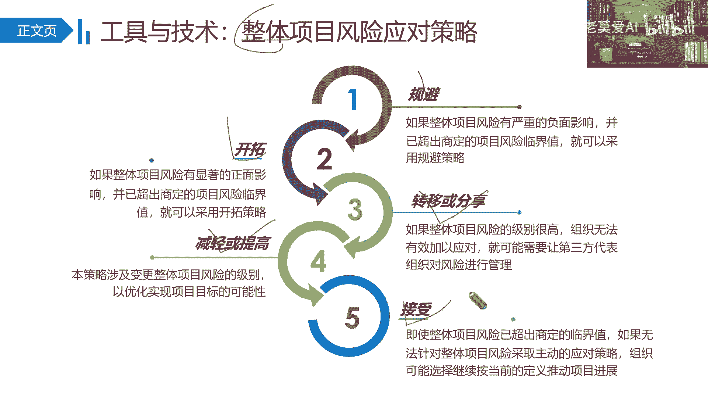

没有意义啊，好这是我们讲的风险应对的这个基本的流程，你看策略发生之后有如果有触发事件，我们是应急应对策略，我们相关的什么呃，经济策略，风险事件的发生了，如果没有呢，那我们还是按照正常的策略去应对它对吧。

我们应对它，如果应对无效，我们干什么，我们有弹回计划，有个弹回计划关闭，如果无效，有效的到此为止结束了，如果无效呢，那这个时候你没有第三套计划怎么办。

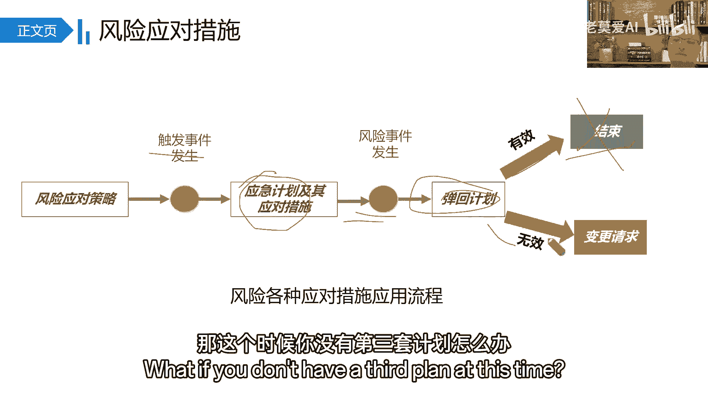

你没有对当计划干什么，相关什么全变措施变更请求，这个时候只能干什么，能就事论事，只能论就是论事，好吧啊，你们听只能就事论事好了，这些风险再把分级风险规划风险，你做制定相关的一一个基本的。

一个一个一一个策略啊。

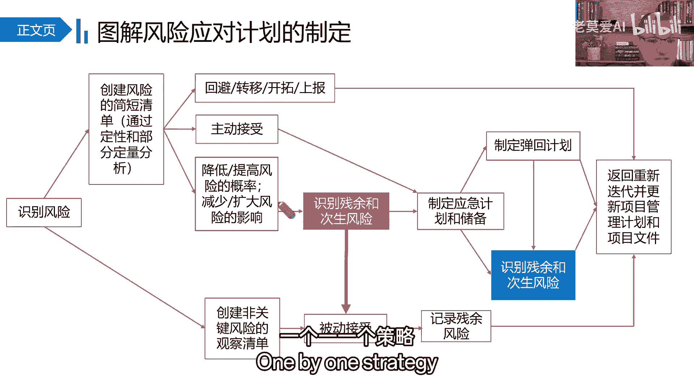

制定相关的一个基本策略，我们就就这样来把它做出来，如果发生了，我们再来一一来做来做好，这是我们讲风险，它相关的一些基本的对应的一些基本点，你看风险分成广义的和弦分，我们把它分成已知的风险和未知的风险。

已知的风险就是我们未知的风险，就是我们不知道的，那你们既然不知道你有办法应对没有，所以就全面措施，没有全面的措施，那或许有些风险虽然不知道，但或许他有一些相关的相关的指标来代表我们。

可能会发生这样的风险，那我们有什么应急应对策略啊，好我们重点关注一下什么，我们已知的风险，已知的风险直接与我们相关的什么，就几种应对策略，你看危险的应对策略，机会的应对策略，以及我们相关的什么。

这是有有信号，有信号，你用这就这直接了，有的没信号，直接用有信号的呢，我们更关注什么，关注信号，再加上他的一个什么一个应对策略，按这样的一个应对策略好谈，汇风险测试，风险和残余风险。

这是我们留下三个基本名词。

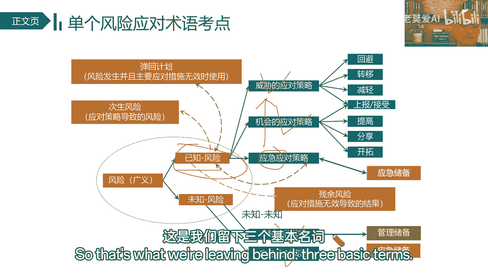

刚才解释过了，那核心的点跟我们讲是一样的，就这样一个一个基本点，在我们识别完之后，其实更多过程是什么，就在监督风险，这里就在监督风险啊，它不发生，万事大吉，它如果发生了，那么什么就要实施风险应对呀。

就要实施实施相关的风险，对可能实施整体变更过程，那尖端风险如果发生新风险怎么办，发生新风险，按照我们什么，按照我们整体流程，我们再走一遍就完事。

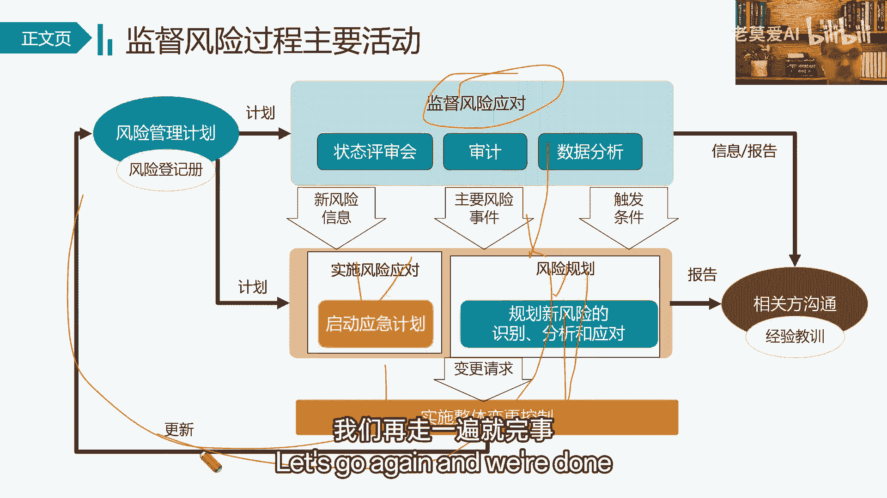

按照我们流整体流程，我们走遍就完事了，理解好吧，那在这里面我们经常会把问题跟风险放在一起，一起来讨论，一起来讨论好了，那我们讲了问题跟风险这两个里面，问题就是我们经常讲的事前思维和事后思维。

我们事前思维更多针对什么，更多就是针对什么风险思维，那事故思维更多针对什么，针对的就是问题的思维，更多针对就是问题的思维，那好了，在这里啊，书上的原话是这样写的，关于问题和风险。

就是消极的风险发生后可视为问题，什么叫可视为问题，也就是说到时候你可以按照问题处理的，什么方案套路去处理就没事了，就这个意思，还有一个叫什么叫问题。

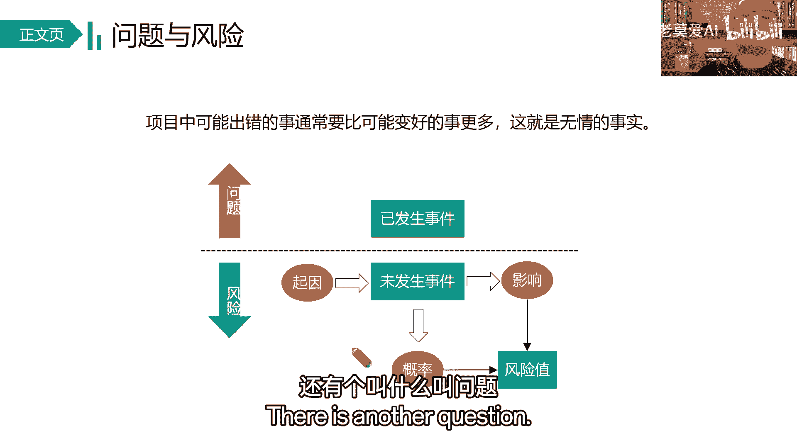

问题如果处理不好，可能会干什么，可能会引发风险，他来讲可能会引发风险，这是他们两个之间的什么之间的关系，按之间的关系，好吧啊好，这里呢我们谈到什么，第二个审计叫什么叫风险审计。

同样的跟前面的质量审计一样，我们一共有三大审计，质量审计，科研审计和什么和采购审计，好吧，那这个风险审计指的什么还是一样的，就是审核我们相关的什么，审核我们相关的过程管理一个什么有效性。

他并不关注具体的风险，每次想到审计，你就想到一个东西，什么东西，就是假设你们公司有个审计人员，他在各个项目上都能审计，那你就想凭什么他懂技术吗，肯定不可能，他即便懂，肯定不可能所有的项目都懂啊。

那怎么办，他凭什么能够审计，也就是他只关注我们，你风险管理过程的一个什么一个基本的有效性，他只关注这一块啊，但是看住你有没有严格按照这个过程来呀，他关注的是这一块。

他并不关注你这个风险具体有哪些内容组成，你这个风险到底做的情况怎么样，他并不关注这些。

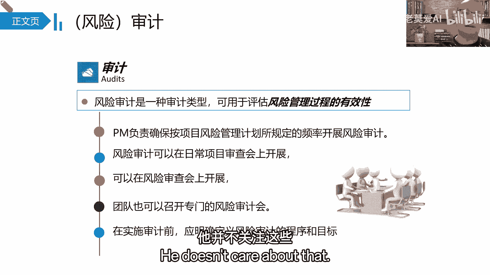

所以他一定是什么，一定是好的，关于中下来说，我们对审计啊要换一个观点，审计对我们来说什么啊，是好事，好吧啊，是好事，这样一个基本理论好了，那站在这里呢，我们来说，首先我们在任何时候都是处于风险监督业。

风险监督业，如果风险是不是发生，如果没发生，你发现什么风险，我们干什么，按照正常流程来应对就好了，如果发生了，那你就考虑嘛到底是已知的还是未知的，如果是已知的原则，哪样你已经记了什么风险登记策略。

那你查询风险登记策略有没有相关的措施，如果有，直接实施应对措施，就是提交时应变更请求，实行应对措施，如果没有，那用什么用，全面措施，你看你你准备怎么应对风险，把方案一提。

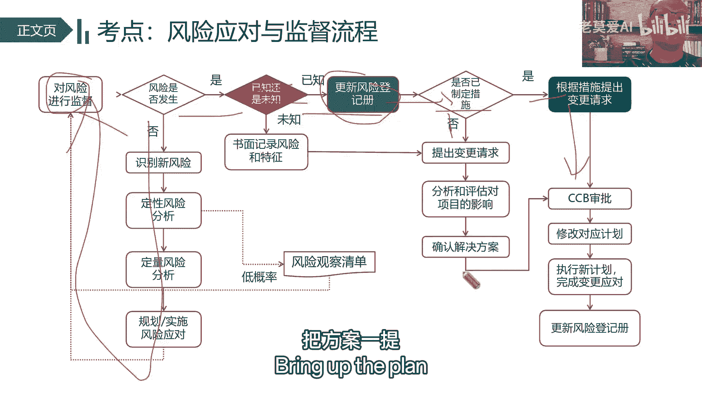

这样几个基本好了，讲到这里呢，我们就把风险给大家讲话告一段落，好吧好，那我们今天晚上去吧，把才给我讲完，剩下还有个第13章，我们就放在下，想着要跟大家在一起沟通一下，今天晚上讲不完了。

那好那我们来聊聊这个。

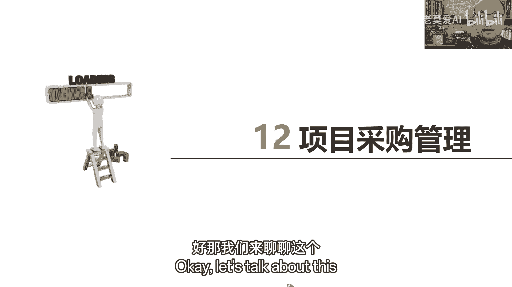

聊聊这个项目的采购这块好了，首先我们先知道采购在这里面，首先你得知道采购是干啥的，采购对我们来讲，对我们项目来讲，它的核心目的就是我们获取资源的什么，一个工具，一个方法，一个途径，一个工具，一个方法。

一个途径，也就这样来来讲就好，所以呢那对我们的采购，我们需要了解什么，我们需要了解跟我们采购相关的重点在哪在哪，就是我们相关的什么合同，这是我们一个比较重要的一个点，还有就是我们相关的什么，这个叫什么。

现在书上的采购大家看完都知道讲的什么，实际上涨的是招投标，所以呢我们按照它它的走，也就是不管招投标的流程，但是招标的几个重要的什么重要的节点，我们知道就好，我们要知道招投标的重要的几个节点就好好吧。

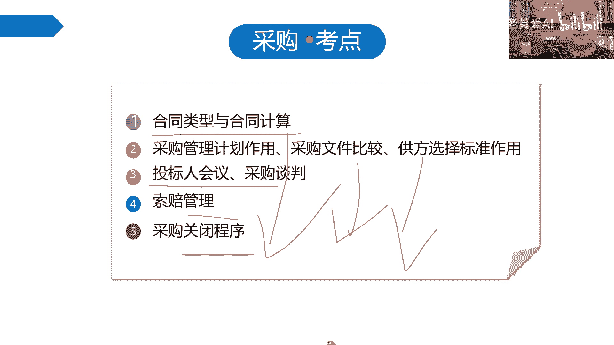

你看合同，合同就是什么，按前面我们讲的，他就是一个一个协议，他是一个什么协议，比较特殊的协议是具有一个法律意义上，它是一个具有法律意义上的一个，他是一个具有法律上一个什么一个协议。

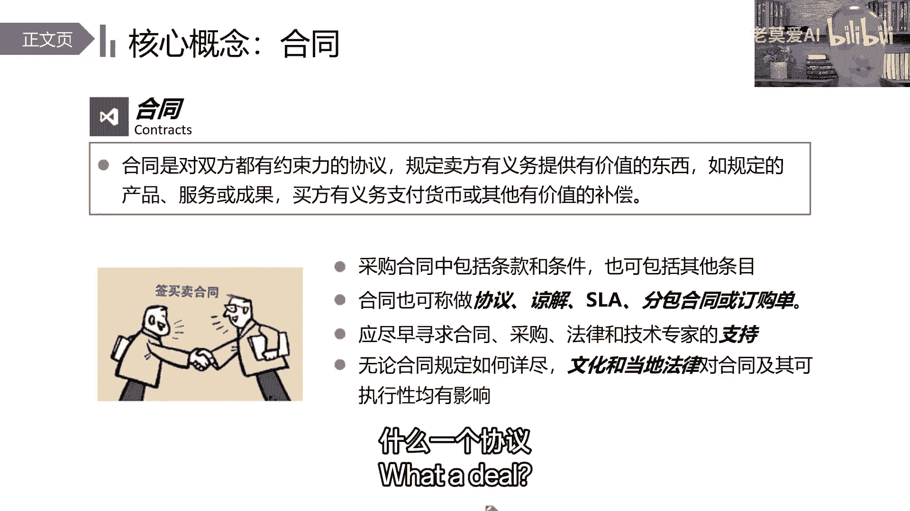

他这样一个基本点啊，所以对双方都有什么意义，好讲到这里，我顺便说另外一句话，我顺便说另外一条注意听，在这里我们要特别注意啊，考试的时候很多时候我们讲什么是吧，我们讲按计划办事，但是你按计划办事。

在采购这一块有点吃不消，为什么要吃不消，就是说你不是说吃不消了，应该说你得明确的知道你的计划是啥，你在你们家里在做项目的时候，你的计划可以某某管理计划，某某计划都可以，但是采购的时候它涉及到什么。

它涉及到两方的单位，那既然涉及到两方单位，我们卖方，我凭什么要基于你的采购计划，来做出我的事情来，不太合理吧，还不太合理，就这样的一个基本点，所以这样就不太合理，那不太合理怎么办，所以我们也讲计划。

不过这个时候我们讲的计划是什么，这个时候我们讲的计划，是我们双方都共同认可的一个计划，那这个计划是什么，这个计划就是我们的相关的什么合同啊，所以在采购里面如果提到这，如果提到双方都要依据的一个低本点。

大家注意一定要知道这是什么，这是我们讲的什么合同，你不能基于你们家的采购管理计划，或者基于你们家的什么所谓的采购，都W1个基本名单，我们来来说好吧，好采购的基本步骤，大家做一简单了解就行了。

大家最简单的从大的角度你得知道什么，从从前面我们要之后做完之后，我们得发招标嘛，就招标找人过来买标书是吧，买的时候买标注之后做什么，做投标，投标之前做什么，做标签会议，做完标签会议干什么，投标嘛。

投标完了之后，我们我们需要干什么，评标嘛，评标完之后最终做出合适的就能再签署合同，限制合同，但是我们在乎这一章不是讲了三个环节吗，规划采购管理，实施采购以及什么以及控制采购。

我们前面规划采购管理是在做什么，就只在做准备性的工作，实时采购干什么，就是招投标嘛，实施采购就是正式的干活了，而且干这个活就是实时采购，所以你看最终的实施采购的核心交付物是什么，签订合同就是签订合同。

那最终控制采购什么，控制采购才是我们正常讲的采购，就说你保质保量，保时间，给我把这个货物拉过来，我到点了给检查货物没问题，给你付钱，这是我们讲的什么，我们讲的这一块的一个采购的一个基本环节。

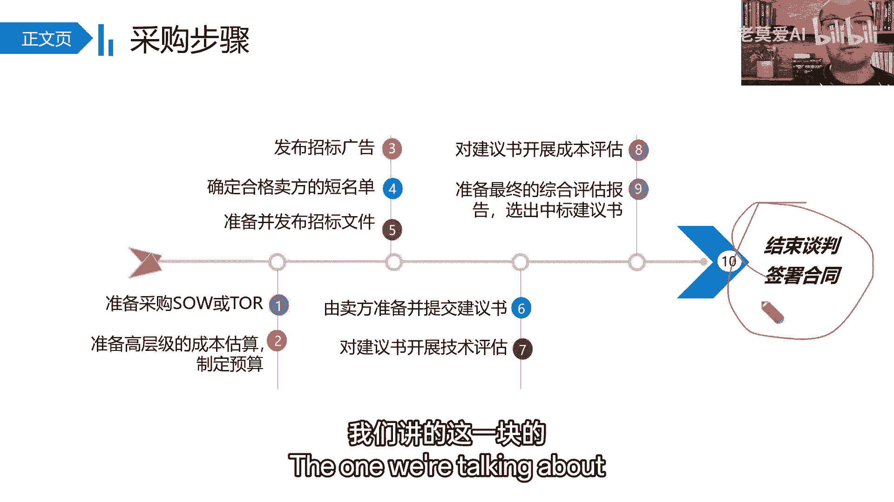

好吧啊，才有一基一个基本环节，所以当然这里重点呢，我们还是要讲一讲这个叫叫什么重点呢，还是讲一讲我们的一个基本的，几种的基本的合同好了，我们的合同呢我们把它分成什么，分成三种，但实际上实际上是两种。

一种叫成本加补偿合同，我们的合同，我们的东西我们挣的钱拿哪部分组成两部分嘛，一部分是你的成本，一部分是你的什么是你的利润吗，不外乎这两方面组成吗，那成本加补偿合同就是什么成本加利润，合同补偿就补偿利润。

什么补偿是你的利润，那么总价合同跟单价合同，工料合同有时也叫什么，也叫单价合同，也要单价，所以单价定总数量不定，也什么也叫单价合同，这个时候单价定下来，我基于单价，我买数量，那你数量要是够多。

数量要是定下来，不就是基于单价，这不就是单价吗，单价乘以总量，这不就是可以得出一个总数吗，这是什么，这是单价总量不知道而已，问你多少量哦，我不知道咧，量是个问号，所以它都是由单价而来。

可是这个单价谁定的，我们卖方定的，所以成本透明不不知道，利润透明我不知道，所以我们把解法它简简单分成什么两类，一定要投们成本加利润类合同，那好了，我们先讲成本加利润合同，成本加利润合同就是成本实报实销。

我给你一部分钱，当什么，当利润这种合同，你一听什么稳赚不赔吗，为什么大不了就是少赚一点嘛，你只要把成本不让我亏就行了，我利润大不了少赚点甚至不赚，但是我做到什么，我做到不赔钱嘛，是不是这么一个点啊。

所以他叫什么成本加固定费用就指的什么，你这个费用十百%分之十几啊，都给你提前说好了，制作你的什么利润成本加激励费用是吧，基于一定的成本，这设定于的价格花超了，你贪一点，节约了，我再给你分一点利润。

在原有利润基础上再给你分一点利润，成本价减了一份，这是什么，这是一个主观奖励的原则，有则有有，有则有之，无则无则加勉，内容是吧，有则就是好事没有，那那你继续拿你，那就好事对吗。

所以呢别人凭什么对于我们卖方来说，他当然喜欢这种合同，为什么我看讲了不挣钱吗，不挣钱，但是我不会亏钱，但对买方来说为什么就不合适，因为你不知道成本多少，万一成本花了很多了，所以对我们买方来说就不太合适。

所以那不太合适，为什么买方还愿意用这种合同呢，因为你不用这个合同，没人给你做，所以一般用在什么情况，一般用在一般用在这情况下，特别着急，对方给你报个价，你也不知道，抱着你可能也坏掉进圈套里。

他报的太多了，或者报的不太准，那你怎么办算了，你还是按你正常成本做吧，我给你一定的利润就好，算不清楚，特别急，第二个就是难度特别大，没人算得清楚，一个是从时间上算不清楚一个人是什么，是没人算得清楚。

没人算得清楚，那这个时候没人算得清楚，会出什么情况，既然我都算不清楚，我给你做这个，我说风险太大，我不做啊啊我不做，那这个怎么办，你要找我来做好，你做我给你弄多少钱，用多少费用，我给你来做。

就好来我给我来做就好好吧啊，就这意思了好，那接下来我们看一下另外两个，就是成本不透明的合同，单价合同，我们打出租车，我们买桶装水，买一个一个的产品，这不就要什么就要单价合同，卖方那边成本多少。

不知道利润多少啊，你也不知道这样啊，那为什么要用总价呢，其实单价一点一点算，要是数量明确，要就要就数量不明确的情况，我们就用什么用，单价也比较少，要把你算个几百万，这这这到时候成太麻烦了，1。

1点说太麻烦怎么办，我们就用量多的时候，我们用总价用总，那平面用总结了单价固定凭什么用总价，这个量也要干什么，也要差不多，固定的时候也要差不多能够固定的时候，如果你量定不下来，那我凭什么用总价。

因为你量都定不下来，单价虽然定了你量不下，没有意义啊，没有意义啊，所以为什么我们干在买方，为什么喜欢用这类合同，因为他觉得单价你给给我报个单价，我知道了我的量你也知道了，那你给我报个1000万。

我知道如果我接触这1000万，对我来讲就是我的什么，我的一个底线或者叫上限了，那我就不用不用搞利息了，就合适，那那就合适了就OK了，好这是买方比较，但是卖方他有时候就心虚呀，为什么。

因为我们所有的单价单价是你报的，量也是你估的，但量也是你估的，万一做的过程中成你要包含成本和利润，万一成本要是亏了，那你自己担在这好吧，所以这里有固定总价合同，就一口价。

你家激励费用当然允许你为了把这个事办成吧，允许你有一定的一个什么啊，浮动空间好吧，那总价的经济合同呢，这是什么，这是我们讲的什么特殊合同，有汇率呀，有外汇呀，特殊合同好。

这里我们还得注意这个也要总价下激励，这个叫成本加激励，它们之间的区别在哪里，都是激励合同，它们之间的区别是这里总价价机里有个什么，有个叫天花板价格，我一共出了多少钱，我出来，那我就不出了。

他们想激励合同呢，就是我们出多少钱，解约，团战多少钱一起，它们的区别在这啊，区别在这啊。

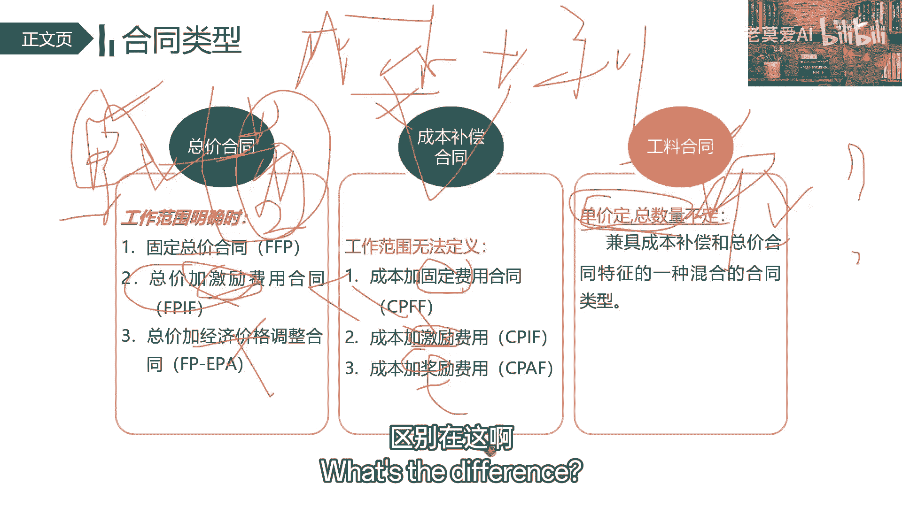

风险这块不是我刚才讲了吗，对于买方来说，为什么总价，这个是他对他来讲是一个什么低价钱，因为他只要把钱掏了，我就一定要拿到这些东西，那为什么成本给他风险比较高呢，因为这个对他来说他就不知道成本。

所以万一发烧了怎么办，那同样这个是什么，这个是倒着来的，这个道理，为什么成本类对它是低风险呢，因为我的立目标就是为了赚钱嘛，所以对我来讲没什么风险，因为成本与时保持交往，而这里呢为什么高风险。

因为万一我成本亏了，是不是我要单啊，是不是我单，所以呢工料合同其实就这样一话，这叫总价，这叫啊成本调整，这叫成本透明合同，所以工料合同在成本不透明合同中间啊。

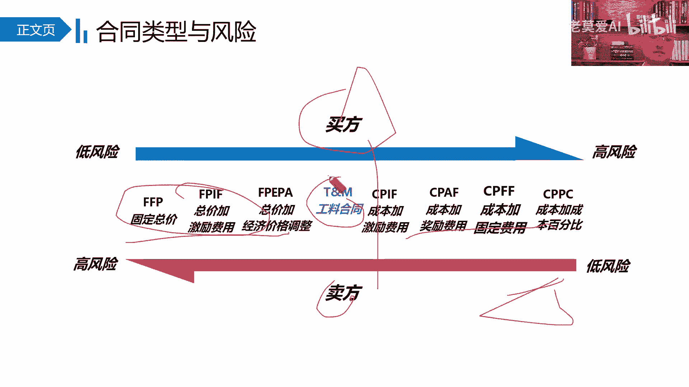

在这块，所以呢成本类合同它的什么，它的相对的范围变化的不明确。

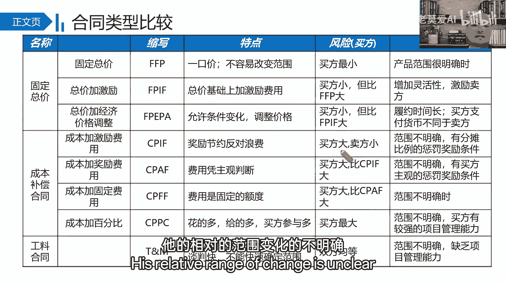

变化比较大的时候或者时间比较紧，时间比较紧，你弄不清楚范围或者后面不知道的，这个不一个是时间紧，我弄不来，二个是任务不清，我弄不了，那范围不明确，不就是弄不了吗，这不简单的弄不了。

所以总价合同相对什么范围比较明确的时候。

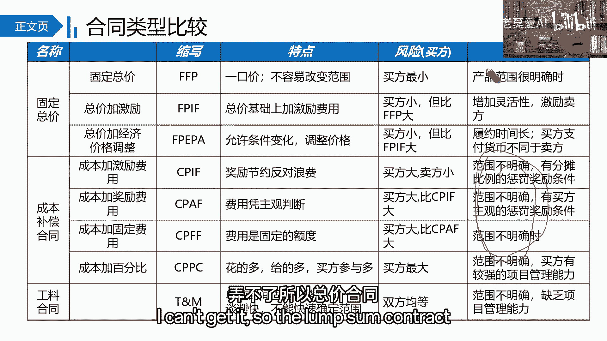

弄它啊，公告合同介于中间，介于中间都可以好，那合同的类型我们提前需要规划好，但是你到底要不要做，要不要做，我刚才说采购指数，我们一种什么采购指数，我们对外包的一种什么一种工具，一种方法。

所以你到底要不要外包，我们做什么，我们要做自制外购分析，到底你自己干还是自己外外卖外卖对吧，外购啊并不一定直接是买，有的时候出租也算什么啊。

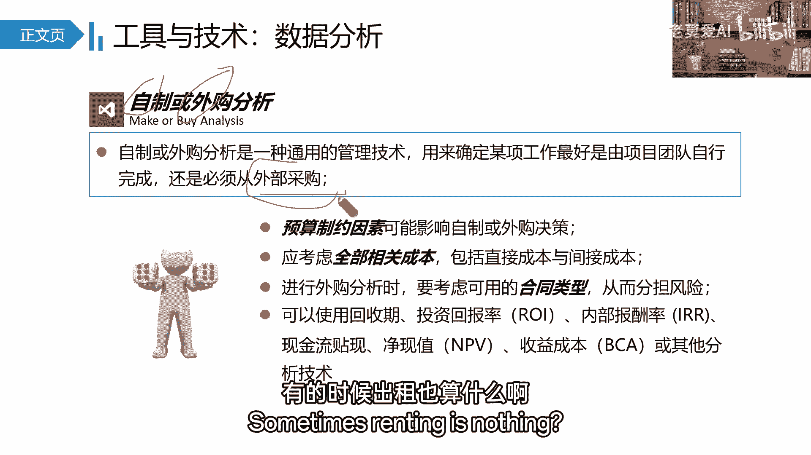

租租也算外购啊，你要做一估计是外购分析，得到结果就是什么得到结果，你到底是真的要买还是真的要要租好，最能说出这么几个集总体的文件，采购管理计划呀，采购策略呀，工作说明书和招标文件，有一些小的采购项目。

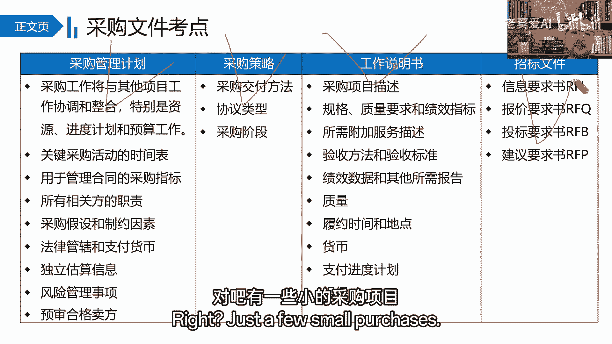

我可能他们都是一起的，但是大的一些项目可能把它分开，采购策略，你看怎么样交付，选用哪些协议，总价合同，工价合同，那怎么样交付，交二式交付，还是说你只是是精装修还是毛坯房，采购阶段第一阶段完成什么。

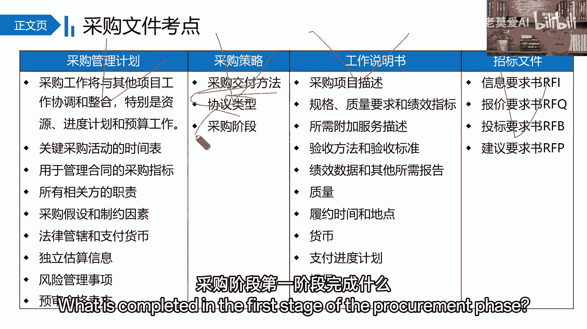

第二阶段完成什么，还有工作说明书啊，说清楚工作说明书，就最终它会成为什么，我们招标文件中的什么一环，所以我们很多人还信息要求说报价邀请书，投标邀请书啊，建议邀请书啊，很多人说。

邀请书跟我们正常讲的标书有什么区别，只是位置不一样，如果说我们用的东西是一个什么，是一个标准化的东西，你只是谈价格，这个时候我们更多它是什么，更多的是标注功能，把它叫成，但是我们有的时候很多东西不清楚。

又涉及到方案，所以很多叫什么叫信息要求书，或者叫什么叫报价邀请书啊，这种要求书类似于这样啊。

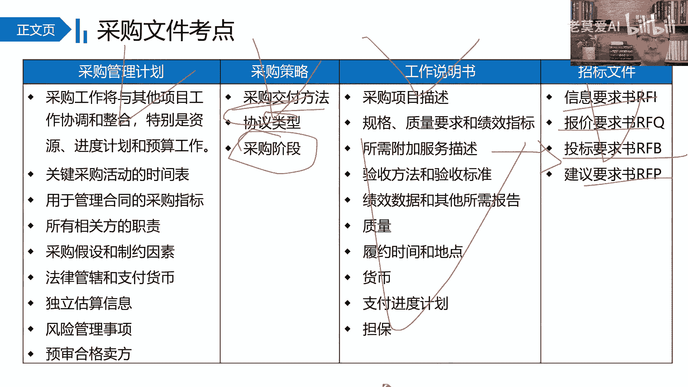

只是基于的点不一样而已，好吧，那我们投标之前呢，我们把标标准买，投标之前呢要做一个什么标前会议，为什么要做标签会议呢，不外乎两个点，第一个我们很多人把标书拿回去哎，读不懂或者说理解会出现什么会出现差异。

所以通过标签会议给你干什么，思想整合思想，这是第一部分，就是我站在甲方的角度，我给你们统一思想，整个思想我的意思是表达什么样的意思，这是第一个，第二个基于什么，基于我们在中间做的时候。

有需要补充的误解的地方，我们干什么需要补充解决这种误解，所以救济本质标前会议，就是甲方跟乙方在这里干什么，做一个达成共识，统一意见的一个什么，一个一个会议，给个会议做完之后呢，那你就回去。

你就回去写标书，这次写完标书了，你可不能说有些点你咋跟我写的不一样，可不能再说这话了。

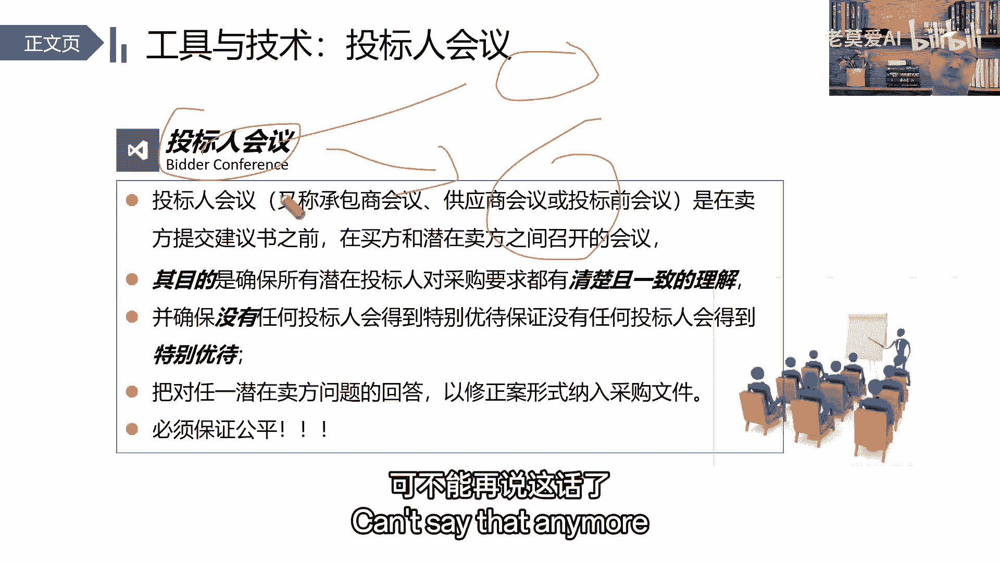

为什么，因为我已经给你们看了，分析过了，分析过了好，弄完之后，我们开始什么投标了，投标之后干什么，我们就需要评标，评标之后我们确定了某家中商之后。

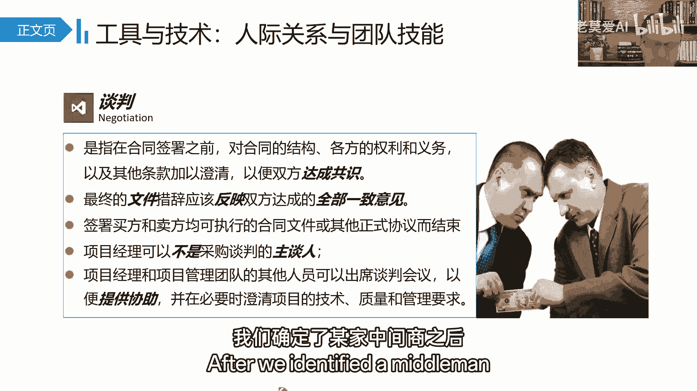

我们要开始跟他什么进行谈判，这里的谈判跟我们前面讲的谈判不一样。

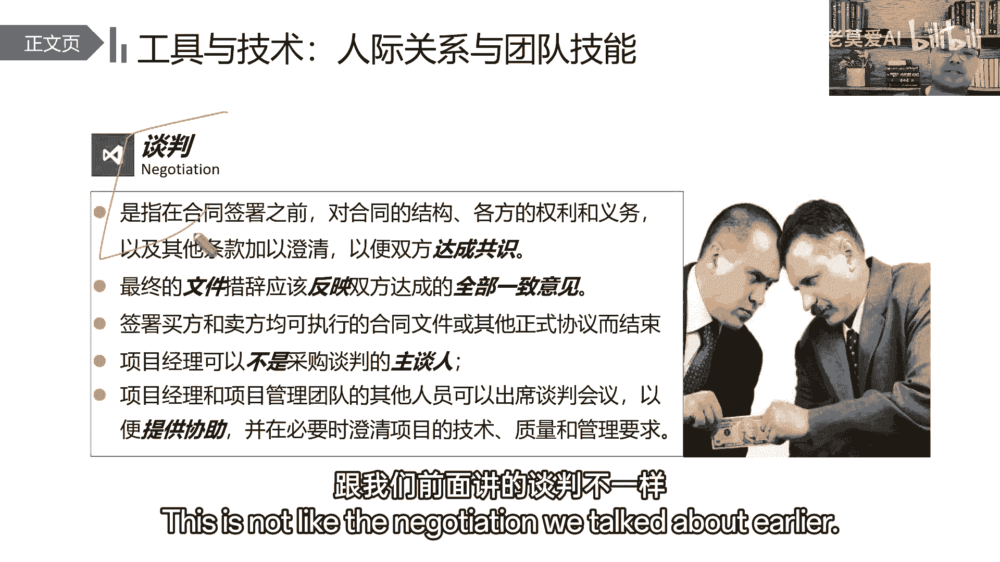

我们前面不是在讲资源那块，我们也讲过谈判，那个时候谈判针对什么，针对是我们说的是这个叫什么，针对我们说的什么，就是你怎么把人能给到我，但这里我们讲的谈判是什么，这里我们讲的谈判是。

因为有的人说我不是标注都中了吗，还谈什么判了，注意高收，里面我们一些实质性的内容是不能改的，比如说做做多少东西，多少钱，什么时间做类似于这样实质性东西，我们一般讲了什么，把它叫洋合同。

这些内容是不能改的，但是我们现在谈的一些，就是一些什么具体的细节结果，简单来说啊，我们说好了，我这里到时有三个人去你那里，你看你能不能办公室官方给协调一下，什么时间给我协调好。

类似于这样的一些基本的细节，不能对那些实质内容干什么，不可以再做什么具体的更改，要不然你就成为什么成为硬核。

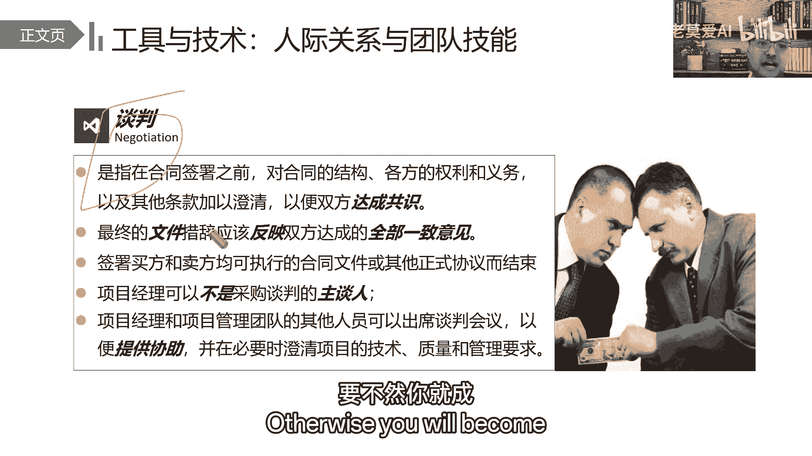

好吧好，这是我们招标的基本流程，通过发布招标广告，我们进行招标，接下来呢我们投标人过来买标书，回去写标书，在投标之前的边缘会议之后呢，我们做完了，你就开始投标了，投标完之后我们我们开始干嘛。

组织并增加进行什么评标评标，评标完之后我们干什么，选完之后选的那一家，我们进行细节性的谈判，采购谈判是什么落地的，一些基本的行政业务的什么啊。

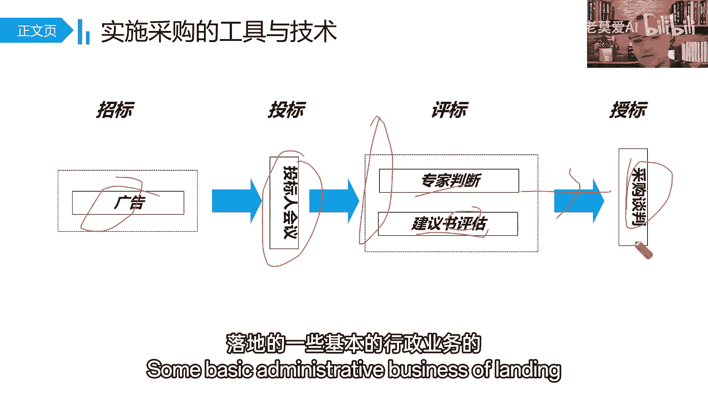

这些谈判好吧好，我们做这个这样一些基本动作好，那索赔管理属于控制采购过程，我们在做的过程中，我给你供货，你给我付钱过程中有一些不一致的地方，你让我供多了，你钱付少了，或者你没付了，没按期付了。

就那些争议的地方我们叫管了，叫什么叫索赔管理加速度方，所以呢你的酒杯既然住，双方怎么首选方法肯定是谈判首选啊，应该叫什么叫沟通首选谈判就是沟通嘛，在这个地方谈判就是沟通沟通首选方法，那谈判谈不拢怎么办。

那就按照合同了，谈判谈不拢，我们按照合同，合同也有替代争议解决方案，按照合同有的人说合同里面我也不想承担，那都是合同没签好或者其他的好，那既然没签好，或者其他的，我们就什么走法律诉讼或者走仲裁也说走。

也就是说走法律手段，他们之间先后顺序应该这样啊。

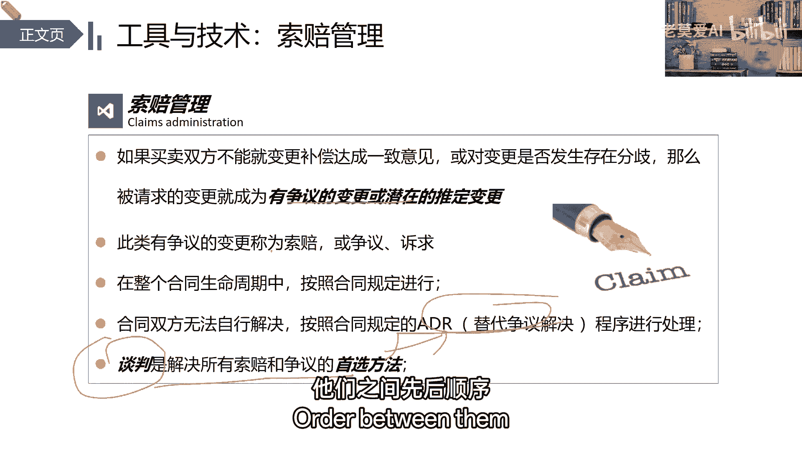

应该这样，所以你看，所以正常情况下我们按合同间办理，如果跟合同有出入了，我们先谈判，谈判完之后再基于合同，我们有提到争议解决方案，如果不行，注意在这里我们就寻求国家的帮助。

单点呢这个点呢其实为什么这样写的，原因在这里，是因为呃我们国家讲的是什么叫一裁到底，因为仲裁呢它毕竟不属于国家的法律机构，它是行业性质，它并不属于国家的法律机构，而诉讼是由什么国家法律规定的。

那就意味着什么，你可以选择仲裁啊，万一仲裁不满意或者其他的，你你们都商量好了，可以撤销仲裁，可以守诉讼，但是绝对不能说我诉讼完了，我再去走仲裁，这是不可使，这不但是究其本质。

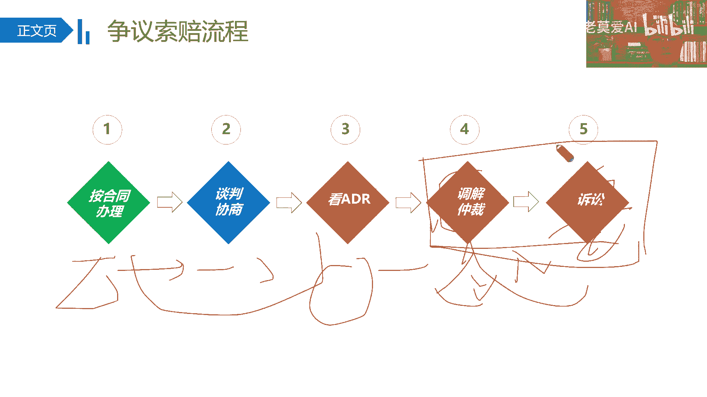

其实在正常的方案，商业社会啊，这种只能选择要么重，要么仲裁，要么诉讼，一个基本点啊，就这样一个基本点好了，这里其他两个就不说了，这个就没什么说的，关键是绩效审查，审查只是拿谁的审查公共商的。

这就是我们很多人，在咱们公司里不是有很多的这合格供应商吗，他们为什么要合作共商，一个是供的多，二一个我到他们厂里去看过，有没有这个基本能力，是不是说谎好，这里就提到我们第三大审计叫什么叫采购审计。

采购审计涉及到什么学到钱的。

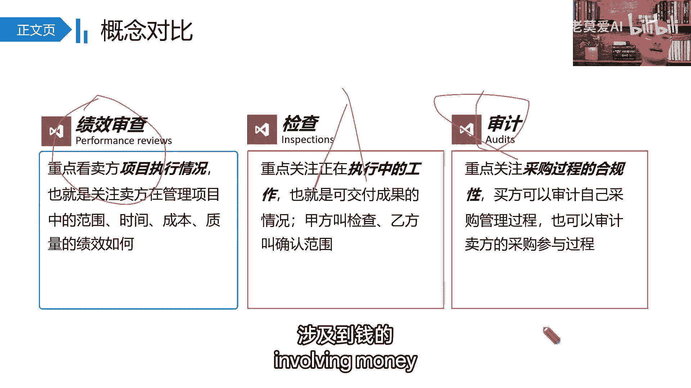

所以要特别注意啊，也要特别也是好事好吧也是好事，最终我们弄完了就把采购关闭了。

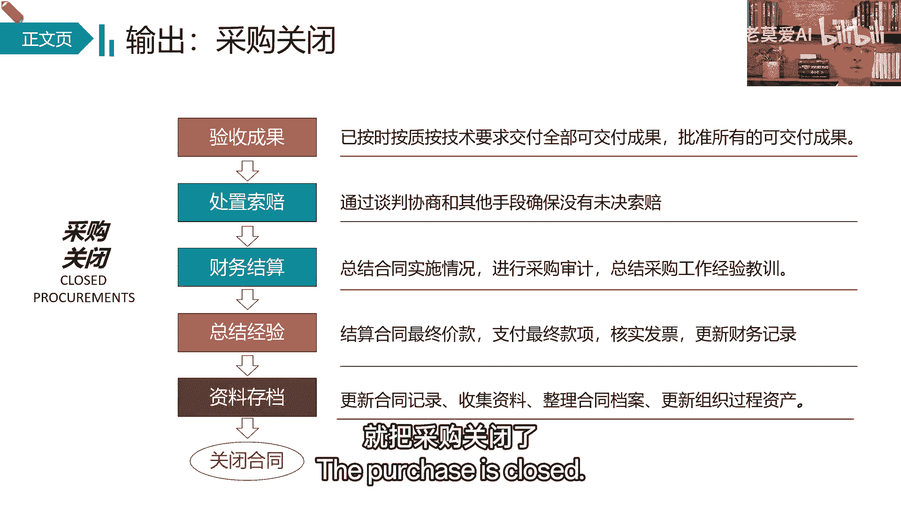

财务关闭，其实就是处理好我们跟第三方什么活动相关的，这个基基本条件，好吧好吧，那今天晚上就讲到这里吧，啊剩下的项目的干系人管理，项目的相关访问管理，我们就放到下周二跟一起讲。

那预告一下下周二的核心就是讲灯光方管理，以及我们把前面的1~13章，有些基本点给他拎出来，所以下周二讲的时候可能没有什么逻辑性，就没有按照我们基本的逻辑，可能就是讲的时候就丢了哪。

差不多我们就把它拎过去而已好吧，另外一而已好吧好，那今天晚上我们就讲到这里好，大家还有什么问题就及时打出来，我在等等，大家一分钟时间好吧好，这两次讲课的内容可以发一下吗，这内容还没有上传吗。

好我后面跟进一下好吧，那我后面跟进一下就好了啊，这个没有关系好吧，还有其他问题，及时打出其他问题内容，课件的事情，我后面跟进一下啊，好那如果没有问题，我们就先撤了好吧，我们下周二晚上见好。

