# 【最好的PMP课程】PMBOK6精华讲解4-1 - P1 - 老莫爱AI - BV1XE421c7cY

那我们今天晚上的主要任务，一方面是还有一次这个项目相关方管理，第13章这块没讲完，把这块讲完了之后，接下来我们的整体安排，就是说基本上就是1~13章，快速的再再带大家把一些基本的一个重点。

一些难点再往外理一理，过一过就好好吧好，那我们先结合先说一下项项目的官方管理，那现在学完了，我们得知道项目的相关方，我们很多的时候把它称为什么干系人，所以有的时候也叫干系人的管理，首先干系人他是人。

就要按我们的角度说，他是能受到我们项目的影响，或者能够影响我们项目的人，以及我们自认为他能够被我们项目组影响的，那些人，换句话说，就像我们很多人说的，我们干系人是什么人，就是我们所有的人。

我们都可以称他，为什么都可以称他为干系人，你看看呢，但是呢这个时候我们就涉及到什么，那为什么我们要说肝性人管理，因为要不然就像我们的客户，他会给我们，他会指导我们要做什么，我们做的最终目的是要打给他的。

要不然就像我们上下游的公务商，以及我们相关的职能部门，他是为了提报提供给我们资源的啊，所以我们更加关注的是什么数，我们项目所影响的那些人，以及能够影响我们项目的那些人，就是这么一回事，所以在实际过程中。

我们很多人注重的点也可能也在这，就说你要不然注重客户能够有影响我们项目，要不然注重什么能够受我们项目影响的，我们相关的用户啊，它的一些基本点在哪里好，这里有一个基本的点在哪里，就是基本的点。

首先我们得知道也就意味着什么，我们现在谈的是干写人，谈的是人，那么我们的这个什么，我们的团队算不算干系人呢，这里我们得知道我们的团队也算干系人，只是在第九章讲资源管理的时候，我们重点讲的什么。

讲的就是我们的团队管理，那换句话说，第13章今天我们讲项目的相关方管理，讲项目的干系人管理，它同样适合于我们管理，我们团队过程中的一些基本的失误好吧，所以我们基本的流程是吧，第一步我们就没有太多的规划。

第一步叫什么识别干系人，这个也不一样，识别干系人对规划干系人管理，管理干系人下来是什么，单独干系人参与好了，卷完之后，首先我们得知道，识别干系人实际上在做什么动作，第一个在做识别什么识别需求的动作。

识别感情的身份地位，认为他的一些基本需求，第二个要做什么，要做分析他相关的什么需求的一个动作，所以我们要做最少我们要做两个动作，第一个你得知道干性人是谁，第二个识别他相关的一些基本的需求。

并对它相关的技术做一个什么，做一个分析，那为什么要分析呢，那我们现在学完了就知道，为了我们后面更好的什么，找到相对应的策略来应对我们的肝细人，换句话说我们肝型人管理的核心目标。

就跟我们的这个风险管理目标是一致的，就是怎么样，我们风险管理目标怎么样，提升我们正面风险对我们的什么一个接受度，怎么样降低负面风险对我们的一个什么影响度，那同样的在肝细炎这一块也面临这样的状况。

那如何能够提高我们正面积极的干型人，对我们项目的一个什么支持程度，同时如果能降低我们那些负面的干型，对我们的什么一个抵制程度，这个才是我们的么一一个核心，那你怎么样，就算提高了肝性对我们的参与程度呢。

怎么就算降低了干预的对我们的抵制程度，用什么点，用什么位置来分析肝前的这个基本态度，用什么，我们叫什么叫参与度，我们讲参与度，这里我们不是讲了几个参与度，一共讲了五个。

不知道抵制中立支持和这个叫什么和领导，那这五种参与度里面对我们的影响是什么，五种参与度本身对我们来讲影响是什么，就是支持和这个叫什么，我们要做一个什么事，第一个就是我们有个C嘛，我得了解你当前的参与度。

还有个什么一个D，就是我我认为团队经过分析之后，我认为我期望你能够达到的什么达到的参与度，这里面首先第一个就是我们讲的知识和领导，他们之间有什么差别，所谓的知识领导简单来说啊不准确。

但是我们可以这样来理解，就方便我们理解就行了，所谓的支持和这个和和这个领导，他之间的基本的区别是什么，是基本的区别，就是说我们叫什么，我们叫被动的知识，叫什么主动的领导，那就意味着什么。

意味着被动的知识，当你去找他的时候，他全力以赴支持你，这叫什么，这叫被动的支持，那么主动的领导你不找他，他就愿意想着什么，牵着你的项目往前走，就这么一回事，所以呢那我们先评估我们当前的一个参与状态。

在对对，我们就先分析当年的相异状态，在评估我们接下来想的状态，这两个状态之间是不是有差别，差别之后我们需要干什么，我们可以，第一个我们采用一定什么策略来搞定它，把这个参与度往上提升一点。

第二个中间可能需要像我们第十章讲的，可能需要用到相关的什么沟通策略，那怎么样使沟通来符合相关的策略来达成，我们从当前参与度，提升到我们期望参与度的什么，这一个基本的过程。

所以我们讲规划干型人参与它中间的参与，干型人参与计划里不就重点涵盖了三方面吗，一方面就是我们干系人当年的参与度，以及我们期望他的参与度，第二方面为了让他达到他期望参与度，我们应对的策略是什么。

第三个有没有一些沟通的需求，不同的计划需要满足的，那管理这块没什么特别的，关键是又走到监督这一块，监督感谢参与好了，那监督干预参与我们讲的是什么，实际上在监督这里，我们一定要把一个核心什么PDC嘛。

那C的核心就是把P对D，应该说把D对P，也就是说把我们实际过程中干，形成一个整体的态度反馈的状况，跟我们按计划希望他应该达成一个基本状态，做什么，做一个对比，发现偏差，从而怎么来什么，怎么来应对偏差。

怎么了，那换句话说，这里我们到时候不是有个干性人，参与这个举证吗，干预参与矩阵，接下来我们不是通过什么，通过在监督干性人参与这一环，实际上也在更新，什么也在更新，干写人参与什么参与矩阵对当前的期望的。

以及你现在的也在期望你的参与度的一个，基本的一个什么一个状况而言，那基于你这个基本状况，我们而我们而来的如果不合适，我们要及时做出什么修正和反馈，这是我们整体的一个基本流程，这是我们整体我们上节课说了。

它的核心点是跟什么有关，它的核心点就是跟我们讲的什么，讲的沟通有关联，他的跟沟通的关联点到底在哪里呢，好了刚才我把这个干型人这块，他的整体的参与策略，我跟大家聊完了，那接下来我们聊一聊什么。

聊聊他跟沟通之间的参与度在哪，沟通三个方面嘛，好规划沟通做什么，做沟通管理计划，在管理沟通就做什么做，按道沟通管理计划去收集信息，整理信息，整理信息，发布信息，对最后信息要做呢，你怎么样归档归档信息。

类似于这一系列相关的什么，一系列这一系列相关的过程好，接下来是什么，接下来监督信息，监督沟通，那监督沟通的核心现在还是一样的，它主要监督你在执行过程中，有没有按照计划去执行，注意讲到这个点的时候。

注意啊，在我们做题的过程中，以及我们考试的过程中，我们默认第一个题目没说嘞，我们不加戏，这是第二个题目，我没说的，我们默认大家都是出于什么，都是树种积极主动的一种基本态度来办事的，就回到我们第一章。

刚开篇就讲的，大家这个项目经理一个什么职业道德责任，尊重公平诚实，就默认大家都是按照正常的规则来办事的，那种不正常的我们就不办了，所以那很多人说，那你这里监督他，那有没有可能送错了。

他是自己注意这故意不送错了，或者这个点我们不考虑，因为你要考虑这个点，这题目没办法做，我们只考虑什么，你真正执行过程中有没有按照计划，会不会执行错，所以等到什么只是监督你会不会执行错。

也就是说只是从这个什么，从本质上从客观上来观察你有没有犯错，仅此而已，不评论你主观事，如果你犯错了，如果信息传递错了，信息数据错了，信息渠道错了，信息频率错了，信息格式错了，我们只关注这些东西。

不参与主观的事情，那就是主观怎么办，主观的事情放在哪里，主观的事情放在人的，他毕竟是人的主观方面，我们放在什么，监督干系人参与监督，干型人参与好了，那我们先来说它们两个之间的联系。

第一个我们在识别干线的时候，我们不是要先识别它的相关的信息，以及识别它什么相关的需求，接下来分析，通过各方面进行分析，分析的目的就是为了以后更好的做好规划计划，那在需求里面本身有的干型会提出什么。

提出我有各种需求，比如说职能部门的经理，我们质量部门经理，他会告诉你，你能不能每周把你们看咱们项目的一个，基本进展给我发一份，他有多通需求，这样他就说好，也就是说有的明确的。

我们就可以把这沟通需求直接放在什么，沟通管理计划的需求分析这了，这第一个第二个就是什么，我们刚才说了，在规划干型人参与里面不就包含三个点吗，一个是当前一期望的状态，一个是我们搞定它的一些基本的策略。

第三个就是我们中间有很多需要去处理的地方，但这里还有一部分沟通需求，可能是他认为没有必要，但是我们为了干什么，为了把这个C状态提升到D状态，我们误认为他应该拿到的相关的信息。

所以注意这里是他自己主动需要的，这里可以简单理解成我们认为他需要一些信息，我们只能发给他，所以既然他需要的，所以信息的需求都在这，么我们规划沟通管理里面，在前面的输入最主要就是什么，就是信息的需求。

那这里我们就说的很清楚，信息的需求源自于两方面，一方面源自于识别干系人，他自己是我们识别到的需求，另一方面是什么，是因为可能他没有这个需求，但是我们认为我们这样做能够满足它，能够提升它的一个什么参与度。

所以这是我们认为给他的，所以这是需求的两方面，兄弟们，这是第一个联系，第二个联系，再回到我们讲的监督这一块，监督我刚才说了，监督沟通，他只监督你的信息传递的正确与否，也是他只关心什么，只关心正确与否。

其他的不关注，那有人说人有有人为因素，怎么人为因素全部在这里好了，那我们现在举一个比较简单的例子来说，举个简单的例子来说好了，现在比如说我们的识别一个需求，他需要一份什么项目的周报。

有个干系人A他需要一个项目周报，所以是不是把项目周报，先放在这个沟通需求里面，那我们认为干洗人A，同样我们认为干洗人A它不仅需要珠宝，还需要日保，还需要日保，所以他也放在沟通需求里面。

所以对肝先生A来说，他现在需求有两个，一个叫周报，一个叫日保，周报是他的需求，日报是我们认为应该给他的需求，所以干净生计划里面他不是有两块吗，一个叫周报，一个叫日报，所以我们管理沟通里面就干什么。

我们相关的人就收集相关的信息，写好日报，社区相关的信息，总结好周报，通过合适的渠道，通过合适路径，合适的报告，把它合适的时间传递给干型人A，这就是我们管理和干活，那监督沟通干什么，监督沟通就干一件事。

就看你有没有赶着时间，把我们的周报以及我们的日报，在合理的时间和以合理的格式，合理层次传递给什么，传递给干性人A这就是监督沟通的一个点，这就是监督沟通一个点，如果你没传递，他就认为你这沟通做的不合适。

波动有问题了，那我们及时的进行修正改进就完了，这就是我们讲的监督沟通，那什么时候就认为他错了，他需要的是周报跟日报，结果监督工程发现什么好家伙，传递给他的季度报告，不好意思，这事儿就不行，这个是错的。

这个干写是每周五上午需要你每周四传给他的，不好意思也不行，这钢琴是需要是纸纸质版，你给他传的什么，你给他传的什么电子版也不行，他需要的是一份，你要传什么，两份也不行，所以我们连读沟通。

只关注信息沟通的什么一个正确性，他只关注信息沟通的什么就行好了，那我们把信息沟通正确性谈完了，接下来我们来看监督干系人，我们看监督干写人，这类跟他的跟他基本的区别好了，首先第一个当他拿到。

当那个干系人A拿到这个项目的时候，这样我们同样把这个话再给他复述一遍，他要的是周报和日报，结果你给他发的是季度报告，这是什么，这这个时候他还没有看信息了，他就觉得你信息不正确，注意啊，这个是信息不正确。

所以这是什么，这属于沟通的问题，这跟肝闲人是什么是没有关系，这是第一个，这是第二个，甘行现在把报告打开看了，大家看了之后就有两种情况了，2。1是什么，他认为我看了周报跟日报发现的写的挺细。

我又不希望这么细，所以接下来我希望是持季报，每一季的报告给我报告一次就行，那这个时候是什么，是他把它看完了，基于周报和日报的信息的本身处于一个什么，做出一个沟通信，他自己沟通需求信息的一个什么一个改变。

注意这个时候是他个人的信息改变了，那我们怎么走呢，注意加人信息面，我们按流程走一遍就好，回过头去通过识别干净的信息，再把干净的沟通信息什么进行分析，这个时候他的信息什么信息发生变化了，所以信息发电话。

我们再来做沟通管理计划，再管理沟通，再检查好，这是第一种，他必须是他什么，他看完信息了才能做出反馈，最起码他要看信息才能做出反馈，这属于什么，属于监督干选之火，这是第一个，第二个动注意。

同样是他要看完信息，同样大家看完写，他看完信息了，发现什么呃，我之前用纸质版，我发现纸质版你们给我传过来的也就那么回事，没什么特别的，我以后还是算了，我用电子版说我算了，我用电子版，那这个是什么。

也是他的什么沟通需求发生了变化，所以我们干什么，还是按流程在前面识别干性的需求，在需求，这EIE他的沟通需求里面，记录变成什么纸质版的信息就完了嘛，所以按照流程再走一遍就好，所以这L的之间在考试时。

大家一定要把它分清，分清的核心在哪里，分镜的核心就在于说我们针对干性人这一块，我们的我们针对干性人这一块，我们的核心是什么，我们的核心是信息这一块，只关注信息的正确与否，不关心干系人对他的反馈不干净。

干净人对他反馈监督，干性人是关于人的信息的改变，不管是沟通信息的反馈，还是说沟通信息的一个，其他的一个处理都都可以，他不是说关注信息对不对，是他对信息做出什么做出一个反馈性的动作，这叫什么。

这叫监督干性，这两个一定要把它做什么做区分，那么好。

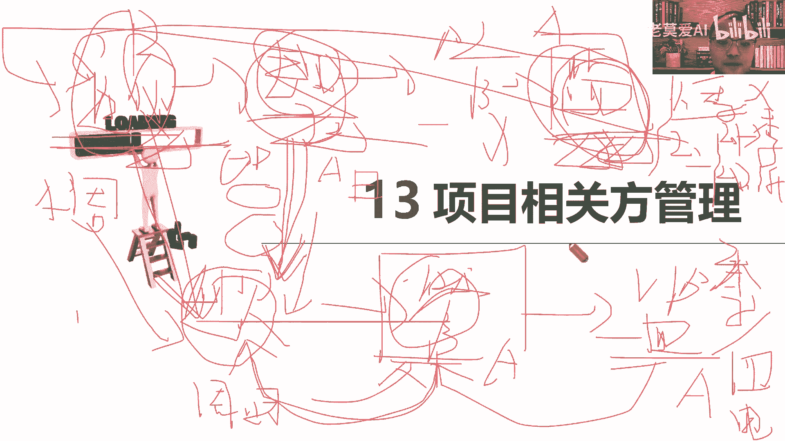

这是他们之间的联系好，接下来我们看一下他之间的一些，基本的一些要点好吧，基本的一些要点好，那干性人这一块我们都说了，核心点，我们得知道项目团队也属于我们的什么，也属于我们的干性人，这一点要特别的注意哈。

虽然我们在实际过程中，我们这样举个另外一个例子，就是在实际过程中，很多时候我们为什么我们现在做完项目，很多时候我们目标叫什么叫事成人爽，试乘就是赶着范围，赶着质量，赶着进度赶的成本，把这个事做完了。

这不是成了吗，人爽的核心，一方面对外界客户要爽，我们的上下游上下游供应商要爽，但更重要的是什么，我们的团队成员也要爽。

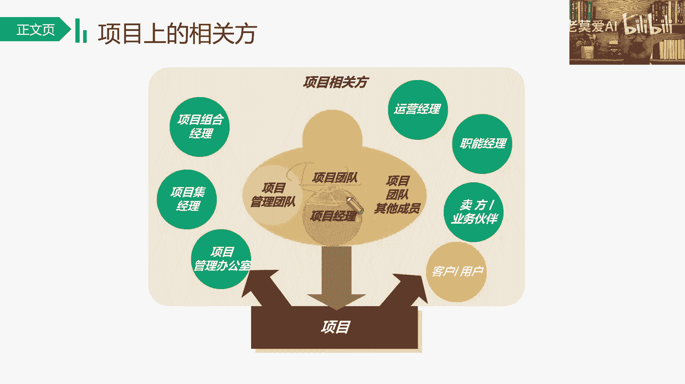

你不是你团队成员不爽了，下次人做项目不给你了，你这就不好弄了，不好弄啊，好这是几个我们相关的基本的给干系人，在大家现在都比较熟悉的发起人，所以讲到这，我现在要提出了，我们现在说另外一个观点，什么观点。

项目真正是谁的项目，真正是干代表着发起人的项目，真正并不是项目经理，项目经理只是受发行人委托来干什么，来管理项目执行的那什么，那个人该先人是谁的，项目是谁了，项目真正你可以发什么，以为感写人的发起人的。

所以你站在这个角度，那你就想了他发行的那刚才什么好项目是你的，你得提供资金做一步做，你可以说了算，章程超过了项目经理范围内，你说了算，变更的审批，接单末的评审做一步做，你说了算，既然东西是你的。

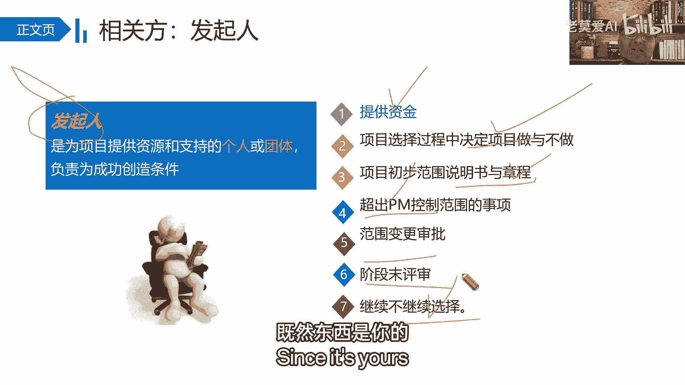

那你说了算，项目经理没那么大权利，就这个意思好吧，发起那核心点就来到这里，我们干系人关注的是什么，就是满意不满意，这些点就是我们的核心的目标，我们这次做肝型的这个呃。

管理者目标就是怎么样提升我们的肝性人，对我们的什么满意度，如何降低肝邪对我们的什么一个抵制度，这是我们的什么。

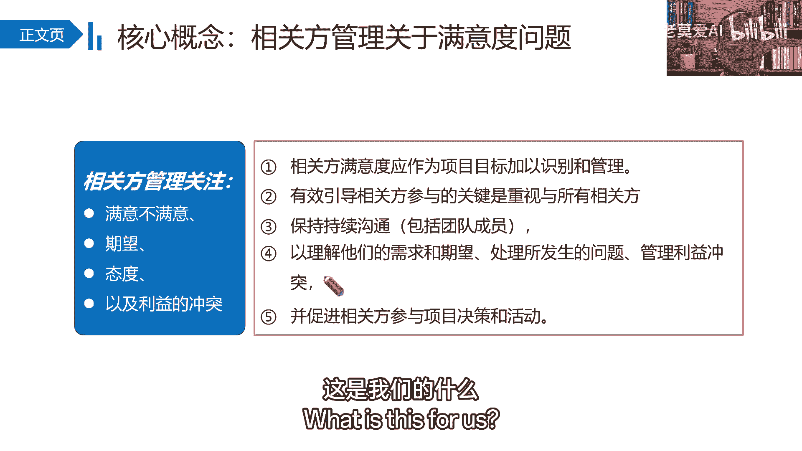

这是我们的一个核心，在这里还要注意什么，干系人它并不是一成不变的，它会一直在发生什么变化，说这个变化一就提到了，我们之前不是在学的过程是什么二维矩阵吗，我们不是学了三个矩阵吗。

二维矩阵还有什么立方体矩阵，以及我们什么凸显模型对肝型进行分析吗，那为什么对肝性能进行分析，方便我们后面制定什么分类了，方便我们制定什么，制定相对应的，这个叫什么相对应的策略来应对它。

所以我们得这里不是有一栏叫什么叫监督吗，为什么监督它呢，因为干净人可能会发生变化，所以你不要认为我们肝弦是一成不变的，当然一方面是人，还有一方面是什么，就是他的需求，他的态度，所以我们一定要关注什么。

监督干写内了。

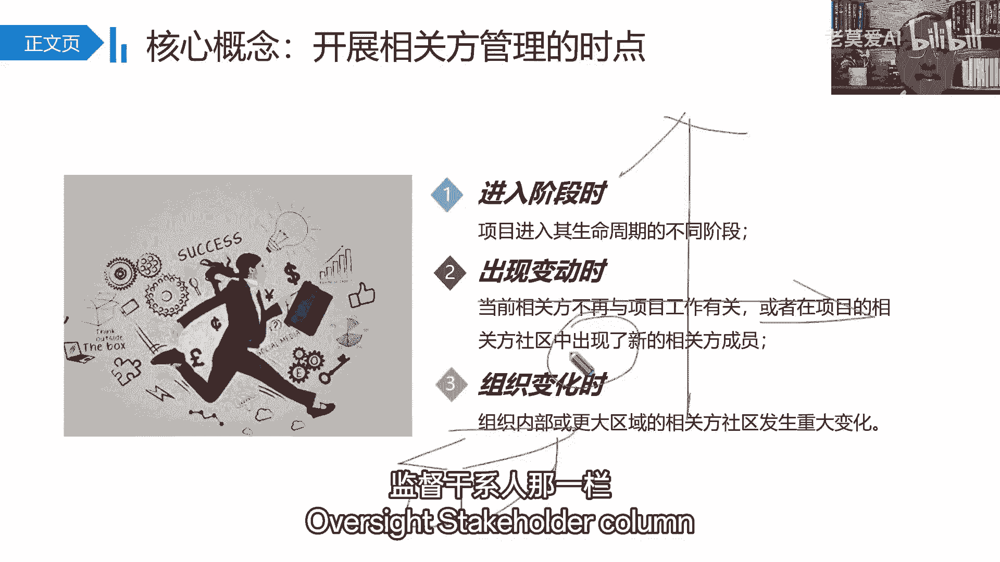

监督干写内，监督干写人内了，所以我们后面的一个基本趋势是吧，你要进的多识别，尽可能的什么全识别，有的人说这个就跟风险是一样，你刚开始识别的时候感觉比较累，它比较多，但是我们在生产过程中，我们在4。

7做项目收尾的时候，不是有丰富的组织过程资产吗，在下一个项目你能做一个什么，做一个参考，但是你不做，永远都是在什么有风险的过程，你做了第一个比较难，第二个可能行么，相对就比较简单了，比较简单了。

确保它能够什么合理的参与，中间有更好的什么风险的变，干性的变动可能会引发相关的风险，怎么样让干先人给我们提供更好的正面价值，怎么样降低它对我们负面价值的一个影响，最终我们达到什么事，成人爽的一个基本点。

怎么样达到一个双赢的这么一个基本点。

那好我们刚开始我们在这一点，一不就是我们什么识别相关方法，讲到这里之后，其实很多同学在这个，会不会有一个大的一个疑问，我们在49呗，什么49，就是实物矩阵里面讲49个过程的时候。

你看启动过程只有两个过程，一个是智能项目章程，一个是识别干系人，那很多人就在问了，说那你识别干系人，识别相关方到底是应该规划阶段来实施，还是在前面就应该识别，也是还是在启动阶段就要识别。

那这里面就有一个基本点了，也就是说首先我们认为从过程管理角度，应该是越往前越好，但是第一个干细胞会发生变化，它会变化，我们及时的不断的要持续识别，第二个刚开始识别的时候。

我们分不同的阶段要识别不同的干型，比如说启动阶段，就像咱们项目章程里面是一些什么，是一些主要的一些干细，那么基于这些主要的干系人，我们后面要做什么，要对这些主要干系人相关的什么需求进行分析。

进行对它进行需求，你比如说我们5。25。2干什么，收集需求，如果你前面没有识别的干型，请问你收集需求，你要去收集谁的需求，你要是属于谁的需求，只是说我们从学习的管理角度。

我们做过程是识别干系人在规划大的先识别它，分析它的需求，再做好相关的策略来应对，再管理，再监督，但从时间的角度来，从时间的维度来看，我们得说从时间的维度，我们得说在这个角度。

你想我们从前期我们就必须得识别，我们从前进，我们就必须得识别，如果我们前进我们不识别，那你后面你收集谁的，是谁的需求，这是一个事情，但是你前期识别的主要是一些重要的干细胞。

你比如说前期识别这些对我们项目，比如说客户，我们打了一些供应商，那么你在后期规划阶段，你可能需要什么，你的识别你的资源从哪里来，那识别这类相关的这样一些呃基本的一些资源，所以我们肝性的识别。

实际上是应该什么越早越好，只是说在时间阶段识别的不一样而已，它跟风险实际上是一样，所以我们要通过什么识别它，进而核心是要分析它们相关的什么相关的。

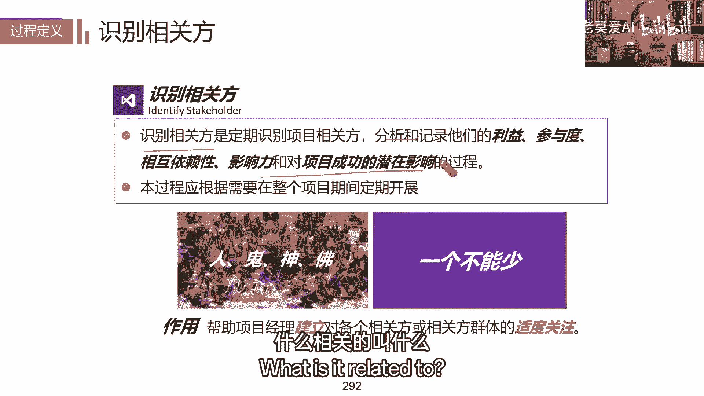

叫什么一些基本的需求，比如利啊，参与度影响度啊，这些基本的一个需求，基本一个需求，你看，所以首次展开的时候，因为你首次什么时候接触项目，项目章程的时候接触项目，所以你首次识别干系人。

应该就在这个什么这里对吧，这个时候老领导会给你说，你主要的干线人会有哪些，你会把它在项目章程里面会有一些体现，同时你开项目开启动会的时候，你也得说这个时候大体的感想，你这你总得知道这谁是客户。

也总得知道有谁配合你吧，你总得知道到时候大体上你应该去找谁嘛，所以它应该是一个什么重复开展的一个过程，所以我们注意什么，要早识别指标全部参与对吧，你做项目的过程中，咱们做项目过程中，第一次比较困难。

但是你要记住，第二次相对比较简单，为什么你会把相关的通用的干线人移过来。

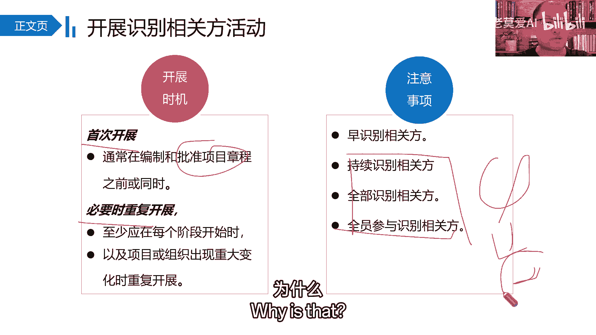

就完事，就比较简单好吧，那在这个过程中呢，我们本来说了，我们大家做什么，我们要做相关的什么感情，相关的什么分析，那干性人为什么要对它进行分析分类呢，基于什么而来的呀，基于什么而来的。

基于我们对它分类之后，方便我们后面智能相关的策略，对它什么来应对我们的干细胞，所以我们讲权利利益影响作用，这是我们讲的什么二维表格，这是我们从二维的角度，我们对它进行什么对接。

这是我们从二维的角度对它进行一个什么，进行一个基本的分类，贝拉进行，这是我们讲的，从二维的角度对他一个基本的分类，因为二维分成四类。

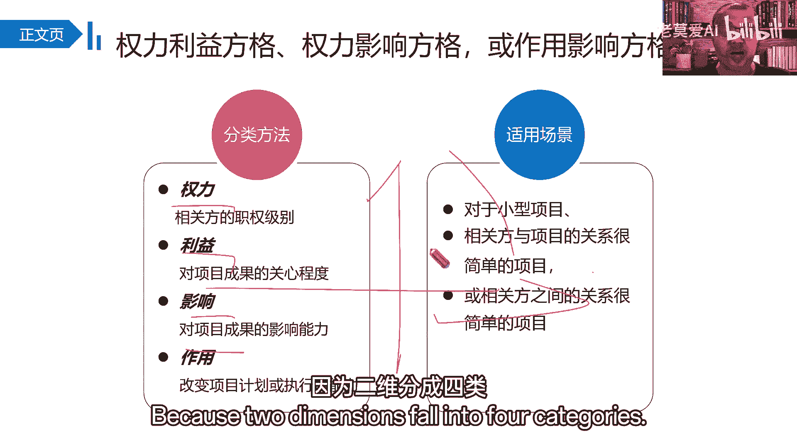

所以般小项目关系比较简单的，我们说你看分成这基本的一个什么，基本的一个四类啊，把它就分成我们我们基本的一个四类，要从权利的角度就比较高，利益比较高，发起人之类的重点管理权利比较高。

利益一般可能就跟发起人同级的，或者比我们权力大的一些什么领导主管，经济满意，权利比较低，但是利益相关度高的，可能是我们项目团队成员啊，跟我们项目息息相关的一些人，随时告知，还有一部分是什么。

跟我们项目没什么，你认为没什么太多关系的人监督，为什么监督呢，因为我们干系人可能会随时发生什么，随时发生变化好不会发生这样好。

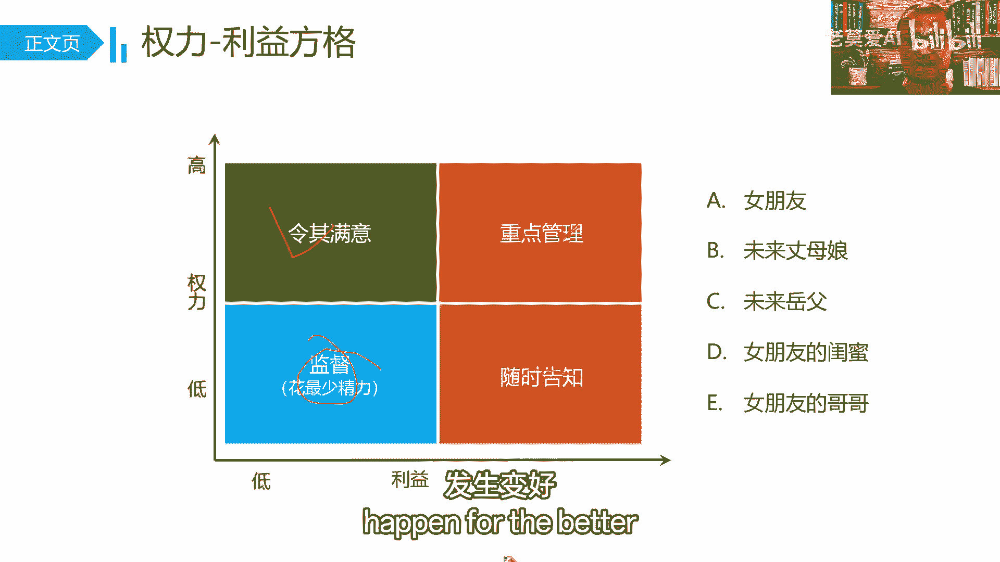

那我们刚才说了，二维角度当然是针对什么相对比较小的，比较简单的一些什么思路，那么三维就是一个典型的什么干型分析立方体，它就针对什么，它就针对一个什么相对比较复杂的一些，中型的一些项目。

它实际上是通过这个立方体，把干弦人从这三个维度，到时候你这中间再以裁剪，这不成为什么成为八个，是不是你可以理解成把它成为八个对吧，你可以把它称为八个方面的一个什么干系的，一个基本的分析，那刚才是四个。

这个是八个。

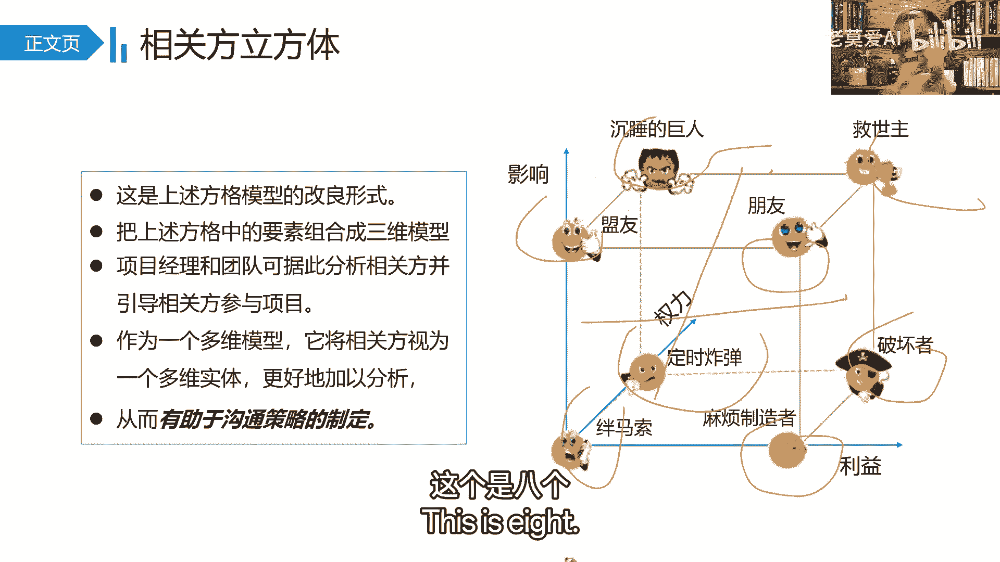

是不是分的相对什么相对更细一点，相对更小的，那接下来是什么，接下来就是我们讲的凸显模型，那凸显模型我们也是从权利紧迫性，合法性三个角度对它来分析，但是我们把它分成三类人，2123，这三类人拥有什么。

只拥有其中的某一种某一个维度的相关的点，那么456用两个维度的点，而只有七呢用什么运用三个维度的点，所以他一般用什么关系，复杂的社区得利用于这样一些点，那这个时候我们要做什么事，我们要应对的时候。

是不是简单来说我们要重点关注什么，重点关注7号，再关注456号，至于四六的相互顺序，其实就基于我们项目的实践来了，再关注什么，再关注123。

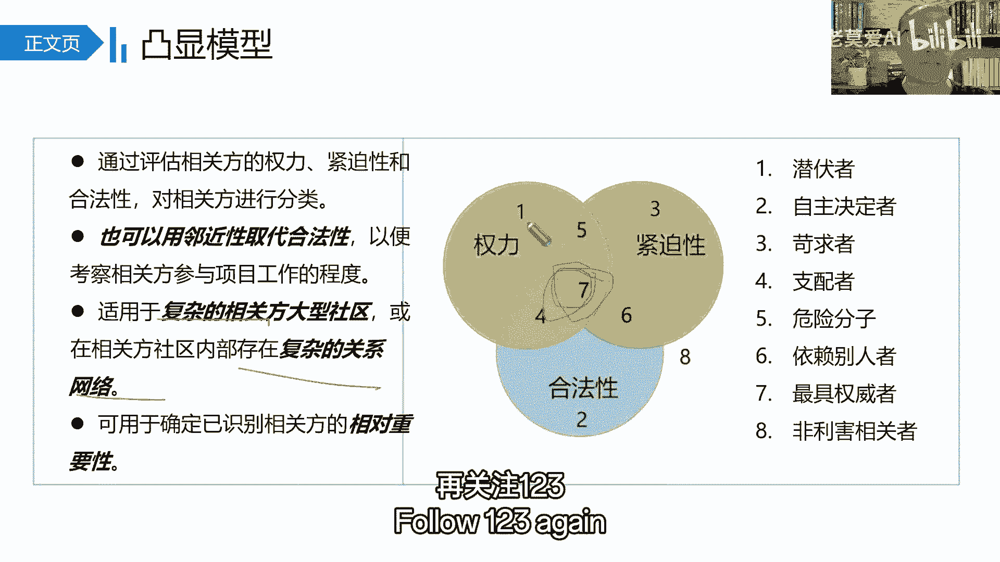