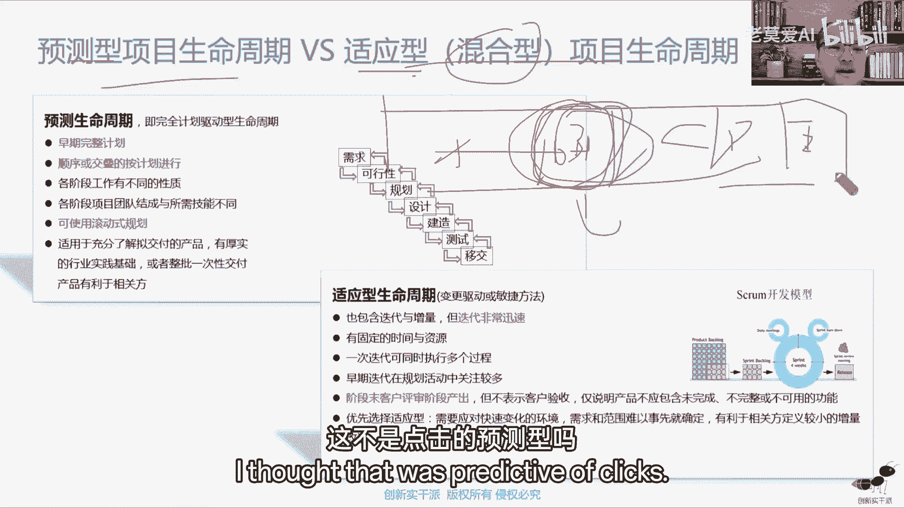

# 【最好的PMP课程】PMBOK6精华讲解4-2 - P1 - 老莫爱AI - BV1oW42197sC

基于我们项目的需求来，那做了这些简单的分类之后呢，我们也可以把干型按照什么，按照他对我们的影响的程度来分，向上就是我们的一些领管理层，向下我们我能管理到的那些人，或者他没没有权利。

这些人对向外当然是公司的内外。

以及横向我们项目同级项目经理，同级那些什么职能部门的人，把它分成这么一个几类，那不管怎么样，如果有必要，我们还需要对干性什么进行基本的一个排序，做一个优先级的排序，那为什么要做优先级的排序呢。

好了讲到优先级的排序，我们把它归类总结一下，从前面我们讲的最早是哪里有个优先级排序，叫什么叫项目组合，前面是不是我们讲项目组合的时候，它一个什么有个优先级的排序，做什么。

是基于我们项目有共同的资源做优先级排序，方便我们把这个资源，什么只用在我们很好的一个项目上，这是我们的一个核心啊，这是我们和好，那接下来我们在哪里还讲到优，还还讲了什么优先级排序嘞。

其实我们讲的什么帕累托图，在质量上讲的帕累托图，帕累托图，其实这个优先级是通过什么来体现呢，实际上通过数量的多少来体现的，它是通过数量多少来填，让我们把重点集中在什么，数量多的也可以理解它的优先级。

还有一个什么，就是我们讲的什么风险，风险我们叫什么，我们叫高优先级，中位优先级，低优先级，高中低这种优先级，那我们要做什么，做优先级的一个什么一个一一个分类，高优先级中优先低类低优先级还有什么。

我们现在讲干显示这做什么，做优先级的一个什么一个基本的分类，当然还有一个地方就是我们学敏捷的时候，敏捷里面有个产品代办列表事项，到时候我们做什么，做优先级的一个什么，一个从高至低的一个什么一个分类。

我们做的是这些，简单来说，我们有这五个优先级的一个基本点好了，既然谈到这五个优先级的基本点，那我们得明白，你得知道你为什么需要做优先级呢，核心的目的是为了什么，核心目的就是通过优先级找到那个最优先的。

我们先搞定它，因为我们的时间有限，项目组合是因为什么，是因为资源有限，其他的我们可以认为什么，都认为我们的时间有限，我们的精力有限，实际上也是资源有限，那这样说白了也是自限资源有限，在这个圈。

让我们花的精力。

更重要的关注我们内部分什么高优先级，那那些基本点是这样好，这是我们优先级的排序，最后我们输入干线登记册，相关方登记册，也就是说这里面记录了什么东西，简单来说你把你想记住的详细信息，最后把它丢在一边好。

那识别完之后，我们应该什么规划干型参与了，那规划干性参与的核心，我们刚才也说了对吧，我们的核心目的就是什么，前面我们规划做什么，做计划，做标准，做基准是吧，那好了，把这个同样的方式用到干型，这里是什么。

我们也得规划出干性人参与的一个什么基准，就是什么，这基本就是我们的D马赛，就是我们期望的一个参与标准，那你得知道实际的标准，你定标准是从实际采访期望定，所以我们期望在这实际的标准，在这这是参与度好。

这是我们干系人参与计划里面的第一块，你得知道这第二个就是什么，它们之间有差距，我们采用什么样的策略搞定它，第三个中间有哪些是遇到什么，用到相关需求的，因为我们认为需求这一块处理干性，它是一个核心嘛。

所以说我们干型人分成什么，分成这五类嘛，不知道抵制中立支持和领导，支持和领导，所以我们把知识和领导知道，这样就好，他都是正向，但是叫什么，一个叫被动知识，一个叫主动领导啊，不准确，但是可以方便大家理解。

就你看我们的核心是什么，你得知道肝性当下的状态，进而评估就制定计划，我们认为它应该达到状态好，接下来从C到D就是我们需要干活，来做这么一个基本点，所以怎么样呢，干型参与策略以及怎么样沟通策略。

这是我们的一个点，你看弥合当前的期望参与水平和差距，是监督干性人身上什么具体的工作怎么监督呢，它可能需要开展什么，开展必要的功能就在这好。

最能说出什么参与人的参与，相关方的管理计划，或者叫相关方的参与计划，你看怎么样调动个人的一个参与度，怎么参与程度，相关方的沟通需求，以以及一些基本的一些特定策略就搁这了，搁这那下来。

管理管理相关方参与那块。

并没有什么太多的一些基本点，那就是按照我们的思路去应对这个策略，管理相关方参参与就好对吧，那监督干型参与这一块，那就更没有什么特别谈的，它的核心就是跟我们沟通这块，一个什么一个区别。

刚才在开篇的时候给大家讲好吧，那我们这一块就讲到这里，这块就没有其他的一些基本点。

我们这块就就讲到这里好，那接下来的时间将来还有一个多小时的时间，我们干什么事，我们就很快的，接下来速度就相对快一点，我们就很快的把一些基本的重点难点给大家，整本书的一些重点难，带着大家再过一遍好。

这个时候你听的时候，就像我刚才说了，你应该比前面我们讲那个更轻松，为什么呢，这个时候我边讲你边做一个什么动作，你可以闭着眼睛，甚至可以躺着听，你可能听的时候，突然间感觉老师讲的哪个点觉不太对。

或者我讲的不对，或者你你听着感觉不对，我们到时候有探讨的空间，这个不重要，重要的是到时候你突然就感觉哎，要不你就听着我顺了一遍，我就带着大家顺一遍，要不你就听着中间那几个点讲的那么快。

突然间我没理解这个就是你接下来需要干什么，需要在注重点关注哪个点，其实大家说白了，现在这考试的形式呢也确实比较宏观，也确实比较开放，那就像我说的考试，咱们学这些东西在考试上怎么体现。

这是我们接下来需要做题，需要巩固的地方，但是基础的东西，大家一定要把它搞的什么相对非常熟，为什么你把这些不熟，到时候你在考试的时候，题目说啥你都读不懂，你没有那些基本的思路。

你就没有在他这个基本上做出一个什么。

做出一个发散的区间，做出一个什么扩展的区间，这个就非常麻烦的事，好吧好，那我们开始我们先先一起聊聊一下，好，我们先看看前面的一个基础，首先在这里我们讲了项目和运营。

那我们就说一件事情到底是项目还是做运营，并不取决于这个项目本身，并不取决这件事情本身，这取决于什么，取决于我们更加看重它的一个什么特点，项目是临时性，独特性，以及项目是我们说的什么临时性独特性。

以及相关的什么边界明细，那运营对应的什么临时性，对应的什么失嘛，持续性，那独特性对应的相关的什么重复性，标准化，这一一些基本点，他没有特别的间接明显，因为他之前的所有的点其实就做的应该什么。

应该叫差不多，那么所以现在我们学完项目管理，在我们的心目中，如果你现在在企业里面正在做一个研发项目，正在做一个提升项目，正在做一个改善项目好了，你可以把它做一个改善，没有问题。

但是因为你要更加关注他的什么临时性，独特性和渐进明细，也就是说你要有风险的思维，也就是更多，你要事先处理这种什么叫风险的思维，去处理这件事，这是我们把它当做项目一个什么核心。

那你认为他跟你做的之间的事情没什么区别，那你可以拿它当做运营来做，因为你不需要花更多的精力去关注他，只需要按部就班的来做就好了，按部就班的来做就好了，这是我们的核心。

你得知道他们两个之间的一个什么不同点，以及在对事情的时候，我们到底是怎么区分项目和运营的，也不能那么死板的，一定说他就是运营，或者特别坚定的认为他一定就是项目，没有那么回事。

主要取决于你更加关注他的什么，他们哪一块好吧，同时他们两个也都是我们站在公司角度，咱们战略达成的是什么，两个基本做事的方式和方法，所以他们有一些基本功能就能完成，要计划复制资源。

都是我们走的战略目标达成的肩基本的点，那当然他们两个之间也有相关的什么衔接点，比如项目做完了，你必须交付给运营，什么可能才能做你项目价值一个什么实现，那么项目的需求。

可能从公司运营的需求里面来的啊，讲一些基本的做一个基本的衔接动作等等，那好了，那我们从项目整体角度，我们来看一下项目组合，项目集以及我们项目，那么说了，在公司里面我们说项目有三种表示形式，有它的存在。

一定有三种，第一个就是我们的什么单项目，第二个我们叫从顶上的项目组和，第三个我们叫什么叫项目基，那你现在得明确的知道单项目我们现在理解了，那么考试不考项目，项目组合和项目和呃。

不不考项目组合的管理和项目集的管理，但是基本的内容你还得知道，也就是说，项目组合跟项目集的基本区别到底在哪里，项目组合我们那会儿刚说了，它的核心点是基于什么来，是基于我们项目的什么优先级顺序来的。

那优先级顺序顺序来的，所以他的项目跟项目之间一定有关系吗，不一定不见得是一定有关系，那么项目集则不然，他的项目和项目之间有什么，一定要有关系才在一起干什么，起到1+1大于二的一个结果，才叫什么。

才叫项目结，项目结，所以在书上说的很清楚，项目一定会属于某一个项目集，或者某一个项目组合，或者属于某一个项目的比较少，它一定属于某一个项目级或者项目组合。

除非你们公司就一个项目，那另当别论，那就是属于项目，那就属于单向啊，把它们之间的区别搞清楚就行了，把它们这样基本就这是典型的什么，那你比如说建迪士尼乐园相关的东西，这就是一个典型的什么项目组合。

迪士尼有什么产业，我们能知道什么，上海迪士尼，这是一个乐园，但是我们背后还有什么这么高铁侠，蜘蛛侠，米老鼠，唐老鸭，这叫什么索菲亚公主，索菲亚，类似这些影视剧，那它也属于，那他做了典型的项目组合。

项目跟项目之间一定有联系吗，不见得，但一定有什么先后顺序，但是基于这一款电话手表，他一定会什么联系，摄像头显示屏内在的一个芯片以及代表腕，还有什么防水功能，这是什么典型的一个项目集，项目集好吧。

都有了典型项目集好，那你看这里我们来讲AB3斗，并按这个优先资源分配顺序，这是点进的什么点进的项目组合嘛，因为你要按优先级分配顺序，这点进的什么项目组合，按优先级优先级好。

那介绍了基本介绍完基本的概念之后，我们就聊聊项目组合的一个知识体系，那我们说现在知识体系之间，我们先来做一个总，它是一个什么立体的知识体系，就是个三维的知识体系，那这个三维知识体系在我们管理项目中。

具体怎么来体现呢，我们得知道首先第一步项目按什么来管理，项目按阶段来管理，也就是说从时间维度，我们把项目划分成什么阶段好了，现在我们把PMP学完了，你就更得知道一个什么点，首先项目管理它不是时间管理。

项目管理也不是进度管理，进度管理跟时间管理只是其中的一个什么一环，这是第一个点，我们要知道这是第二个点，为什么实际中的工作我们就是管时间，实际中的我们我们就是管进度。

是因为我们所有的东西都要以时间这个维度，在时间这个维度上进行什么进行对比，进行切分，进行判定，进行检查，换句话说我们项目管理简单来说，你把它说白了就是什么人，在什么时间用什么设备，什么工具。

什么方法做什么东西，把它做成什么样子，花了多少钱就完了，那至于冒着风险跟干预沟通，那个是在项目整体的维度进行发生的，项目时间整体维度因为什么时间发生，不知道，那么做事就是这个样子，它是用什么发生不到。

我们说他是一个什么，它是一个整体的一个维度，所以我们现在得知道，首先我们做项目是按照什么按阶段进行管理的，按阶段管理管理，实际上就是我们讲的什么按时间进行管理，按时间久了，所以我们说项目，首先第一步。

我们把大的项目按时间维度划分成不同的阶段，不同的一个小的时间阶段，划分成一个不同的时间阶段，ABC划分成不同的阶段，我们在这个阶段里面就用管理，也就是说第一步画完了，第二步我们只管A阶段的事。

这个时候你考虑时间不就不考虑了，我们只考虑这个项目，从零天做了30天，我们怎么做，我们怎么做好，那你怎么管呢，就是启动规划执行监控和收尾，对管什么的，十大基本知识领域。

说到这就跟我们正常的项目套到一起了，那我们正常有人说我们正常的项目，我们为什么是启动规划执行监控和收尾，那是基于什么，首先第一步，我们不是不是按照时间把它划分好了，第二步我们只管A阶段的事。

那你得有个词儿管，从管理职能角度，虽然说启动规划执行监控和收尾，就像我们说的，他没有我们讲的，那么直接按照时间的相互顺序来，但是我们默认我们得基本上按照这样来管，你有一个统一的一个基本点啊。

所以我们讲的时候一般说什么启动阶段，规划阶段，执行阶段，监控阶段和社会阶段讲，是这样讲肝，但实际做的过程它有什么。

我们得知道它有不同的一个什么，整合的一个过程好，那管理这一个基本阶段，我们得知道重点的管理是规划，执行和监控，这是我们管理的三个关键阶段，启动是站在项目角度，它要有一个临时性，所以它有一个明确的启动。

你最起码得授权项目经理吧，你最起码得给项目证明吧，同时也得什么，你也得你说你这个项目到底要做什么，启动阶段你得告诉我最终的收尾做什么呢，一方面我们现在把项目做完了，来个有始有终好好收尾一下，这是第一个。

第二个呢更核心的东西是什么，我们讲项目生命周期，项目生命周期，我们讲丰富的组织过程，资产，我们讲丰富的经验教训从哪里来呢，你就要通过收尾这个过程，对它做一个什么总起的一个整合和整理嘛，所以我们虽然说4。

4管理知识，是基于我们什么整体的项目时间来的，但是更多的你得把这个做成一个整体的汇总，在哪里，汇总，就是在社会这里我们做成一个整体的汇总哎，在公司里形成什么丰富的组织工程的过程，资产完了。

在这个分公司里形成丰富的组织过程资产，在你在为下一个项目做好一个什么准备，下一个项目做了一个准备，所以项目的五大过程组，它的前期，那为什么中间那三个这种管理的基本吗，规划执行的监控管理的基本。

那核心呢启动跟收尾给大家说完了好吧。

启动跟收尾给大家说完，哪两个过程存在，彼此之间的一个基本的一个潜在循环，计划和监控嘛，做好计划，按计划去执行，监控什么就是监控你有没有按计划来执行，你没有按计划来执行。

我也想知道你变化计划跟执行它的目的是什么，是为了指导他的目的是为了什么。

指导好那十大知识领域，这个是我们就没有什么特别说的了是吧，在这里我们得知道这是什么，这更多是我们做事的一个什么目标，做什么，什么时间做多少成本做，做到什么样子，内在的这里什么谁来做内部的资源。

外部的采购，以及还要用到什么，以沟通为基础，跟干行人进行沟通嘛，这都是我们讲的顺的方面，那我们得在项目管理上，你可不能说不顺，这方面我们得考虑提前做什么，做预测到我们叫什么叫风险的一个试验。

这东西如何实现整体化的一个最优，这是现在我们学完PMP的，得知道我们讲的整合说的并不是1+1=2，而是什么，而是1+1=10，甚至1+1大于十，怎么样能让这些整合好，做出一个什么。

做出一个更好的动作出来，因为同样的东西，比如同样的项目，同样的项目什么时间成本，什么资源都给你，同样的人，为什么很多项目经理带出来很牛掰，很多项目在那里带出来就是不行，你不能怨天尤人，其实就是什么。

为什么我们经常讲项目经理的，他的整体的能力是比较综合的，你要换句话说，他的综合能力体现在哪里，就体现他的什么整合，体现他的整合能力，如何把这些不同的人把它整合在一起，达到一个共同的目标，目标能更好一点。

做成事，那不就完了，而这个怎么整合呢，说实话这个东西又成了什么，只可意会不可言传的东西，那就靠经验了，他没有什么特别的什么显性知识可以传达的，就像我们经常讲一样，好的项目经理都是什么优秀的沟通者。

可是适宜性的沟通者，沟通者放在我们过程中，只是说我们做信息的互动沟通有什么问题，谈判我们需要协调，其实就是做项目，中间出现了N多的琐碎的小事情，我们如果把它进行什么整合。

让他统一找一个管理就行，那生命周期，我们预测性生命周期和实验性生命周期，我们前面实际上讲了五种开发方法，对两种生命周期这里不要搞啊，这不要搞混了，开发方法指的是我们的生生命周期。

指的是我们项目的生命周期，比如项目我们分成ABCDEFG，分了这么多段，分成这么多的，那开发开发生命周期，开发方法指的是中间有一段可能涉及到什么，涉及到研发，也就一定涉及到什么，从0~1的过程。

这里用到的方法是五种预测型，迭代型，增量型，适应型以及什么以及混合型，但是我们讲生命周期，一般我们只讲三种，其实通常讲的是两种，一种叫预测型，一种叫混适应型，还有第三种叫什么叫混合型。

预测和适应加什么加混合，那也就是说，开发方法只是决定了这一阶段他用的什么方法，并不能决定整体的过程，也就是说，开发方法只是决定我们项目身份中间的什么，一个必要条件，但它不是什么，不是充分条件，简单来说。

举个简单的例子，比如说你这里用的是敏捷，但是我不好意思，我这里整体先把A做完再做B，那你B阶段做的时候用敏捷没关系啊，等你B做完了，我再做C啊，C完了做DD做完了再做E，这不典型的么预测型吗。

这不是典型的预测性吗，所以他的个体只能代表这一段。

不能代表什么，不能代表任好硬件跟软件，其实大部分硬件我们用的是什么硬件，我们用的是预测软件，一般用的是什么，用的是适应。

把它混放在一起，就是什么典型的混合嘛，那它核心的一个点其实从预测到敏捷，核心的一个点就是什么，我们讲的变更，我们一直讲的变更或者叫什么是讲的变更，我们对变更一种什么一种处理的态度，在预测性。

我们更加期望的前面什么都OK了，你到后面不至于变得太多，但是这种状况往往就说你不太可能，或者说你看着好像可能，那后面万一变了怎么办，我们要严防变更，利用什么，利用变更控制程序来做，那么敏捷型的。

为什么说我们希望它变更，因为我们在前期很多需求不明了，我们就是通过不断的变更，不断的做把这个需求明朗化，这第二个就是通过不断的做，把这更好的需求，更新的需求推向市场之后，让我们的相关的客户通过这种变更。

在市场上建立什么一定的竞争力，进而呢给我们客户提升他的一个稳定性，让它更稳定，它的核心点在这，所以他们两个之间的一个几个应该比好。

那接下来我们聊聊第第二章的一个基本的重点，第二章我们讲了组织过程资产和事业环境因素，大家做一个简单的区别就好了，组织过程资产当中我们能修改，所以他对我们一定是有用的，那世界环境因素，不好意思。

好的不好的不知道，但是我们必须要遵守，这里我们看一下我们核心的一个什么，五种常见的一个基本结构，大的就是三种职能型，矩阵型和项目型，小的就在矩阵型中把它分成这三种，我们先来看大的这三种就行了，职能型。

你每一个每一个部门按照自己的职能，职能过程来分，按照自自自己的职能的一个基本点来分，分了之后他的核心什么专业技术比较强，但是做的项目我们一般是什么跨职能的，这个东西它不好分，它不好进行沟通就很麻烦。

因为你没有指令，那好了，我们对比项目行，所有的人都给你了，你沟通好沟通了，但是你的专业能力提升就不好，以至于什么，以至于相对于你的呃，项目是临时的，有的有无家可归，就很忙吧。

所以基于他们两个不同的优缺点，我们做出一个补充，用什么用矩阵型，所谓的举例是什么，平时人属于你的还是职能型的，用的时候完项目的管理方式去管理就就为了，所以我们就经常叫什么叫花开两朵，各表一枝。

你往这边一想，这不就就就就两块吗，那矩阵型就没有问题吗，也有问题啊，因为矩阵型你说平时随你用的时候属于我，那你用的时候就数两个领导的领导，你不就乱了套了，所以我们就基于两个领导相互的权限。

我们做出一个什么大小的一个分类，领导职能经理权限大一点，我们叫弱矩阵，两个差不多平估矩阵，项目经理全程多一点，我们叫什么叫强矩阵，叫强矩阵，考试默认我们是平衡矩阵，如果题目没说，我们就默认平衡矩阵好吧。

默认平分矩阵，这个大家知道一下这样一个理解，这题我们就不看好，所以三种基本的PMO，我们刚才说只是讲了，项目经理通过不同的这个叫什么，通过不同的管理职能，管理的这个基本方式来管理项目的团队。

管理项目的职类，但是项目经理的核心是受受发行人的，是委派他来管理项目的，注意他是受发起人的委派来管理项目，那么谁真正站在企业的角度来管理项目，P m pm，他站在企业的角度来管理项目。

项目管理办公室管理吗，他站在企业的角度来管理项目，所以那他不外乎他要一身兼两职嘛，对上站在企业的角度，他是对企业负责，我得管理一项，对下如何更好的服务你项才是核心，所以首先它是知识性，你要什么。

我给你什么，对相关的呃文件共享，我给你什么，这叫什么，这叫我支持你，我全力支持你，这叫对象，控制型，能结合到我们什么对象，但是对象的前提是什么，我也得有支持性，也就控制型属于什么，属于支持倒控制型。

那最后一个呢，指令型实际上就是他直接管理了啊，感觉底下管理不行，他就直接管理了，那更多项目经理叫什么叫傀儡型，傀儡型好吧，那接下来我们看下第四章，是时稍等30秒，我拿个风扇太热了啊，让我拿个风扇好。

不好意思啊，刚开始进来的时候很凉快，不知道怎么搞的，越讲越很热，好，我们继续啊，耽误大家一点时间，不好意思好，我们继续好，接下来我们聊聊整合管理，那也就是说从现在来讲，你首先得知道站在我们的角度。

我们项目经理做什么，我们项目经理就做一件事情，叫什么叫整合，这叫整合管理，我们学第四章学完了之后，你就得知道我们不就干了这一件事吗，项目经理不就干了这件事，干了什么事，干了个整合管理这个事对吧。

那我们就说了，你把整合管理学完，不就是我们做项目的基本流程，第一步，制定项目章程，那制定项目章程干什么了，给项目经理授权项目临时性项目政治权权，第二个项目该正式做了，第三个，你让我做项目，可以啊。

你得把基本大体框架内容给到我呀，我们项目章程记住那些什么大概的框架内容，项目的目标，项目的主要可交付成果，项目的需求，项目主要干型，主要风险多少钱，多少时间，什么时候就算项目成功了。

什么时候就算项目不成功，也得这样一节点好了，那项目开始启动了，那就正式进入我们管理部分，管理部门不不外乎第一步，规划管理，我们做什么，做计划，第二部分，那你干执行了，注意在项目管理这块我们管理。

那我们说在执行这一块，我们说任何事情分成两条线，一条条技术线，一条叫管理线，那技术线属于技术业务线，他是负责什么执行初中解，所以我们从管理角度，你看我们叫什么叫指导与管理项目工作，知道你拿什么去指导吗。

知道拿我们刚才做的什么，拿着计划去指导我们技术的业务人员，去什么去做我们相关的东西，那管理项目工作呢，那有一些还是你看底下我们的管理质量管理，沟通管理风险，还有一些是我们从管理角度，我们要干的活好。

那那那那那进入到监控阶段，什么4。6监控项目工作，那监控项目工作学到这你就很清楚了，他的核心目的，他的做什么动作呢，他左手是什么计划，右手是实际把两个东西放在一起干什么，放在一起做对比，发现有没有偏差。

偏差在范围之内，我们可以接受，在范围之内，我们要做什么，我们要做出一定的一个什么改进的动作，就叫我们叫什么叫控制措施嘛嘛，我们把它叫控制措施，做控制措施叫做监控，最后我们4。7结束项目或阶段。

最后就收回建筑项目空间了，一方面，我们把可交付成果移交给我们下一个制程，另外一方面我们自己内部的重点是什么，组织过程，类似于这样的一些基本点类似，这不就是我们做项目的一个过程吗。

那那中间有个四点是管理项目知识，实际上干什么，就是搜集经验教训啊，数据进行教学，那他什么时候他是写在执行过程中，但是整体的覆盖面应该是什么，全体覆盖面都覆盖，还有一个什么4。7啊，4。

6实施整体变更控制过程，可以把它认为是一个监控项目工作，一个什么一个工具而已，在你监控项目工作过程中，你会发现通过控制时候可能会有变更，什么叫变更，是要变化，你需要更新，那不就是变更吗。

对我们四种基本的变更措施是吧，第一个就是什么文件的更新，第一个就是文件的更新，对于那些受控的文件更新，我们需要做什么，比如说我们基准计划，那你只要更新，你要干什么，一定要走变更，你不能说你该变就变。

不是那么回事，还有我们四种基本措施是吧，事前预防措施，事中纠正措施，以及事后的什么事后的补救措施，以及我们收获了不久，是这样的一个基本点，也就是说把项目都做用好，我们一起来看，那无章程不项目。

其实说这话的意思就是说什么，你要给下面一个什么一个明确的启动的标识，就证明我们这个项目正式启动了，你没有啥东西都没有，你直接进入规划，第一个我没有内容，第二个项目经理没有授权，他接下来发号施了。

谁听了第三个，你这项目不做一个证明，你不是说这个项目正式做了，讲到这里，顺便再说另外一句话，就是我们现在也一定得明确，立项和项目启动是两个概念，逆向简单来说，简单来说就叫确定项目。

确立这个项目我们要做你们公司立项，什么时候立的，不就是2023年年底的时候，12月都立好了吗，我们2024年准备启动五个项目，是不是这么说的，领导就说我们准备启动五个项目哎，启动五个项目，那叫什么。

那叫确立项目，也要是通过通过前期的商业论证，把这个项目什么立下来，结果第一个项目是什么，2024年1月份启动，第五个项目呢，2024年12月份启动，那启动那叫什么，你开干立项代表什么，从政策角度。

我批准你干，启动代表你真正的什么。

开干了，好吧好，这是我们讲项目章程，他这里面写的一些东西，因为是接下来我们后面宏观的东西，都是一些高大上，宏观的东西，对目标标准范围，时间进度都是一些宏观的，大体上运动不细，我们做计划的目的是什么。

我们做计划的目的就是基于它把它通过细化，做成我们真正计划能落地的方案。

这才叫什么才叫计划，那才叫计划好，计划好，那这个前期就是我们商业论证里面，前期最早的一个，我们这有两个商业文件，一个商业论证，一个效益管理计划，这要特别注意什么，商业论证我们只关注什么。

只关注经济可行性论证报告，取关经济考证了效益管理计划，现在学完了，我们有12大管理计划包，包括这个应该就要13大，因为这个不属于项目文件，它属于商业文件。

你得让他干什么。