# 【最好的PMP课程】PMBOK6精华讲解4-3 - P1 - 老莫爱AI - BV1ow4m1k732

怎么样管理目标效益的什么时间点，什么时间有哪些风险，怎么样管理它，管理它项目的开工会。

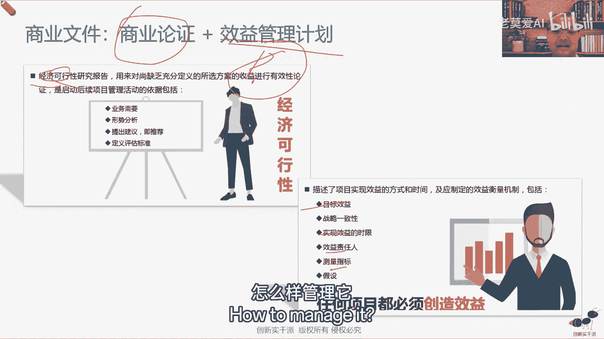

其实这里有两个会议叫什么，两个启动会，两个启动会，一个是两个启动会。

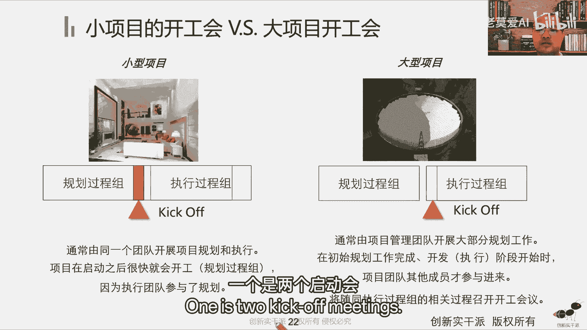

那这两个启动会也就是说把项目章程做完之后，原则上也有个启动会，只是书上没说，但是在考题的时候，会是否会碰到项目章程做完之后，原则上我们也有一个启动会，在实际工作中是有一个启动会。

启动会的核心你想想都知道，就是由发起人主导的，核心目的就是把这个项目做什么，给大家大体的说一遍，认识一下基本的干系人，让大家对这个东西达成什么，有一个认知，达成什么三共识。

这是我们启动会的一个什么一个核心，那接下来基于项目政策做完之后，我们做计划，计划做完之后，我们再做一个启动会，叫kk open meeting，那这个时候启动会启动什么，就是基于我们把计划做完了。

我们准备干活了，那你准备干活了，你得把这个计划给别人说清楚啊，阐述计划的过程阐述清楚了，你得让问别人要个承诺，这活你能不能干啊。

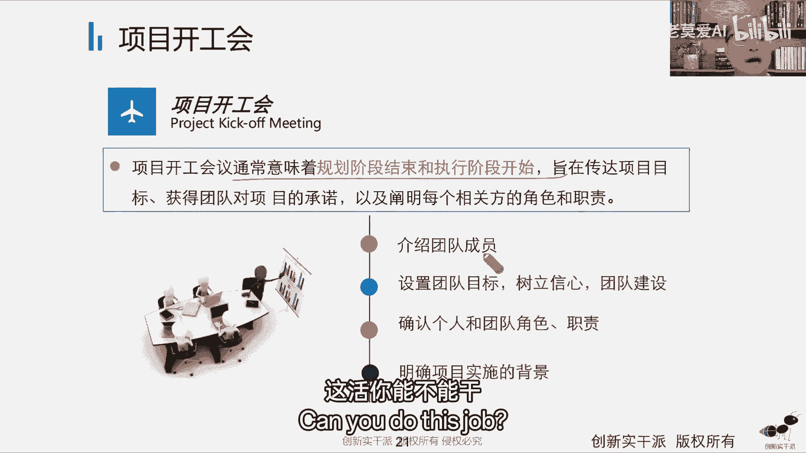

你能不能接啊，一个过程，团队成员确认信息啊，这个时候什么计划做完了，做这么一件事，那什么时候做小型项目，大家都在一起，所以边规划边启动边规划，编制大型项目规划过程一，一般进的是一些什么核心的管理人员。

也就是说刚开始进入一些核心的团队，他们负责做计划，做完计划之后呢，接下来执行的时候你得上儿嘛。

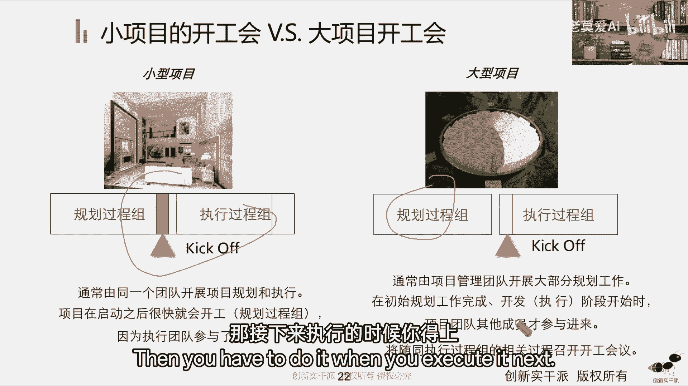

上任的时候人上了，我们在做什么统一的这个叫什么天文单位好吧，所以规划做完整，这不是两个之间的一个对比的一个区别吗，考试的时候注意，如果都翻译成启动会议，你注意看英文，这个是启动阶段时候干的，这个是什么。

计划阶段是干的，注意他们一个什么之间的区别，考试时都叫什么，都要启动为都要启动回好吧。

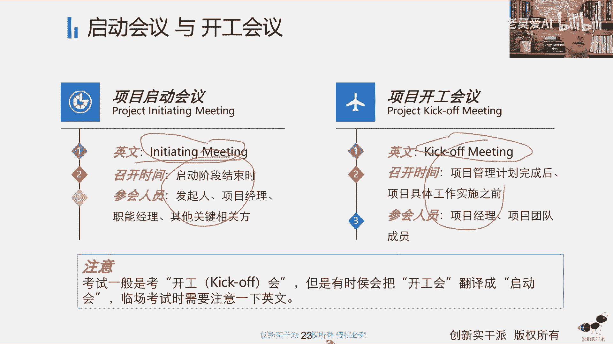

那我们的计划大体分成三部分，一部分就是这12大，这这12大管理计划，你现在我们都很熟悉了，管理计划里面没有具体内容，只是从管理角度，我如何管，用什么流程管，谁来管相关的职责和决策方法。

格式汇报方式现在都知道了吗，谁来管，这是管理计划，另外一什么，我们实体计划就是我们做的计划范围，基准里面记录我们做什么范围，时间基准里面记录我们应该什么时间做，成本计算里面代表我们什么时间应该花多少钱。

还有一个就是其他嘛，其他的就是看着弄嘛，你要用正值的时候计，要测量基准没正值，拉倒项目生命周期，就像我们说预测型还是敏捷型。

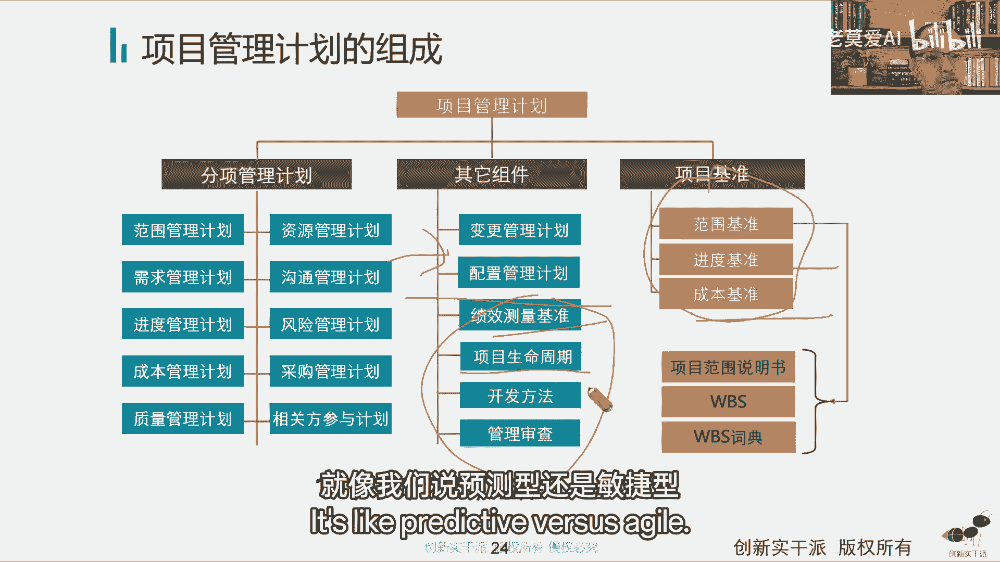

那你得说清楚还有什么开发方法，你的五种开发方法选择哪一种，以及什么是我们开会做审查，得知道这是我们讲的计划好基准我们就不说了，基础状态的核心，我们得把它作用什么做什么做对比就行了，它的核心目的做对比。

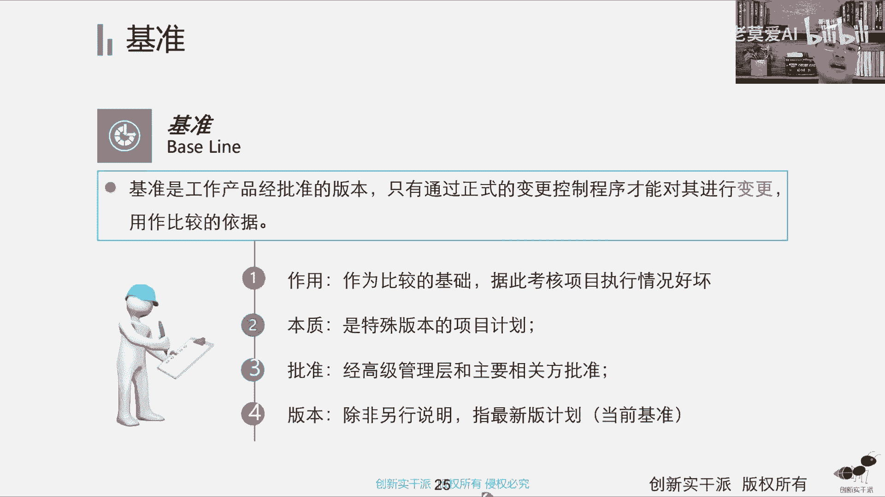

什么时候对比，监控项目工作的时候做什么，做对比好吧，管理知识，隐性知识和显性性知识，在这里我们得知道隐性知识叫知识管理，显性知识叫什么叫信息管理，为什么你想到这里，如果想不通，你就讲另外一个事。

工作绩效数据，工作绩效信息和工作绩效报告，工作绩效信息是基于工作绩效数据来的吧，那是你能摘取出来，你能提取出来叫什么叫信息，所以信息管理这个工具是什么，管理显性知识的，那知识管理这个工具管理什么。

管理隐性知识，我们都说你知识好高啊，请问你的知识是什么，拿出来给我看看，你说我物理知识很高，请问你把你物理知识拿出来给我看看，你说物理什么牛顿定律，拿出来个牛顿证理，你一旦拿出来，那叫什么。

那已经叫显性知识了，我们能学的是显性知识，我们能悟的叫什么。

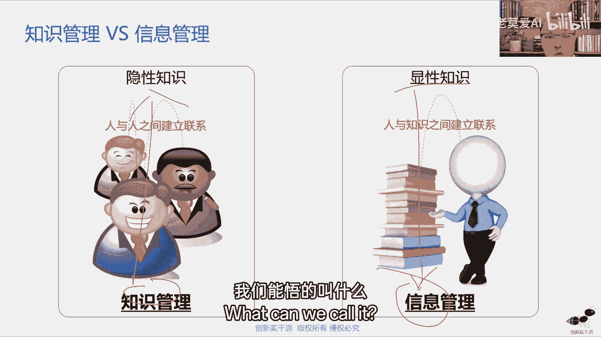

就叫隐性知识，好吧好，那这时候我们讲了四种变更，基本请求刚才说过了，文件的更新啊，事前预防，事中纠正以及事后的什么补救，最后的基本这是四种变更。

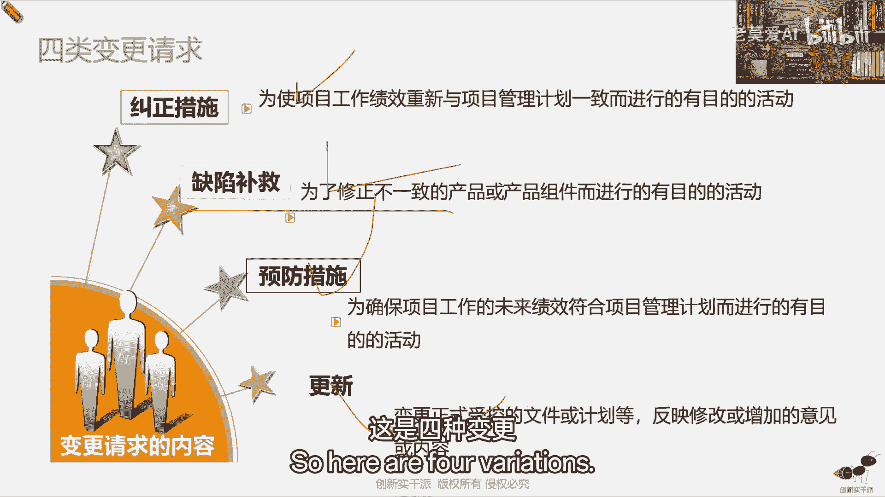

我们说为什么变更无处不在呢，或者说变更不可避免呢，因为我们唯一不变的就是什么，变我们做的所有都是基于现在对未来做出什么，做出预测，那既然你是预测的，那你能觉得它准吗，说简单一点。

所以这里又提出什么变更控制委员会，那这里我们要明白他是个正确的团体，但是他不是一个固定的团体，因为他的资格能力比什么，比我们项目经理高一级，它的核心目的就是为了处理所有的变更的。

所以这个时候我们变更涉及到了人员再进来，涉及不到了，你也就甭进来，就这个意思，就这里好，考试的时候，很多人说注意啊，很多人会说，有的人说我们前面学过了，不涉及基准给项目经理批，涉及基准给CCBP。

考试时又说，比如说你提交一个变更请求给变更控制委员会，很多人说这个是错的，注意这个不一定是错的，因为我们所有的东西，所有的流程，所有的权限在哪里，在变更管理计划里，我们讲的基本的是基于基准来说。

我们说项目经理批准基准基准以内的，这是我们普遍是这样认为，但是你们公司说你们项目经理无权所有的变更，交给CDB，那就交给CDB无所谓，明白了吧，所以考试的时候碰到这样的点，你先打问号。

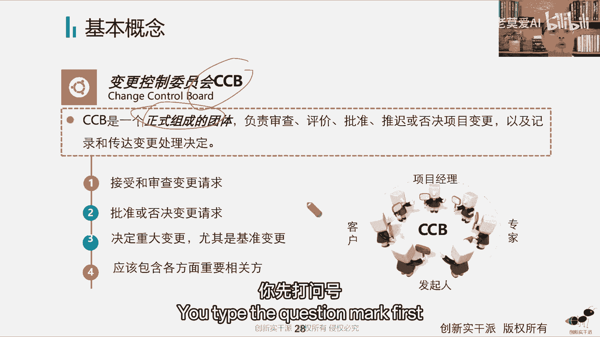

不能直接选错，好不好，变更的整体的流程，那从我们的角度来分析的不外乎也就包括三块，第一块就是我们前期对原因的分析，看能不能不变，或者说你为什么一定要变分析分析原因，为什么一定要变呀，把它说清楚。

这是第一个，第二个呢能进程走变更流程了啊，走变成切合变更，请求评估影响找个方案批准不批准，在更新相关的日志，更新相关的什么计划，第三个呢我们先把计划做一个什么，做一个沟通传递，因为我们干什么。

我们注意是按照计划来实施，所以我们实施按照什么，按照计划来实施，按照计划来试好，这个讲清楚了，但这里还有另外一个点给大家再强调一遍，考试的时候注意我们所有的东西的发生，它只是一个什么一个客观条件。

它既不是问题，也不是什么，也不是风险，所以你要学会这样一种思维，什么样的一种思维呢，当发生一个东西的时候，你要做什么，先评估他对你的什么影响，也就是说评估你的影响，对你有影响才是一个问题。

对你未来影响才是一个什么风险。

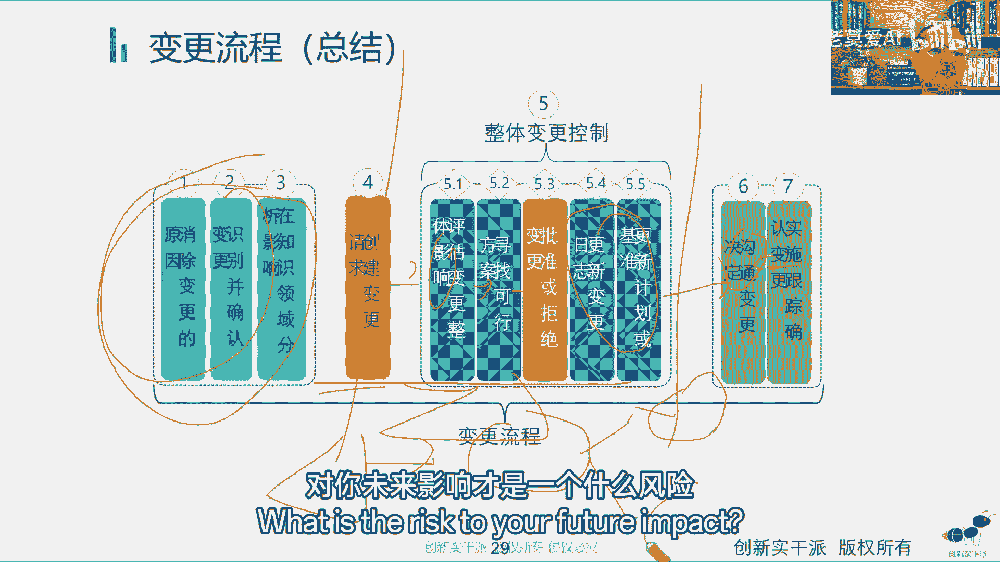

接下来基于他的这种什么方案，所以一定要把这个流程被叫列瓦属性好，这是我们讲的变更好，配置管理和变更管理，这个我们那会儿说了就不做重点了，这个时候如果假设你这个时候还没理解，那你就不理解了。

你把重点放在什么，放在变更管理就好了好，那换句话说我们讲的什么，你用词来记，注意项目工作的变更，是变更管理产品的变更，或者说可交付成果的变更是什么，是配置管理，简单这样来记就好了好吧，可交付成果的变更。

你用配置管理来做就好了，为达成可交付成果而进行的工作，这不就是项目吗，所以项目工作的变更是什么，变更管理，所以成果变了一定会变更管理，一定要启动配置管理，再启动变更管理。

但是工作变了一定会做配置不变化吗。

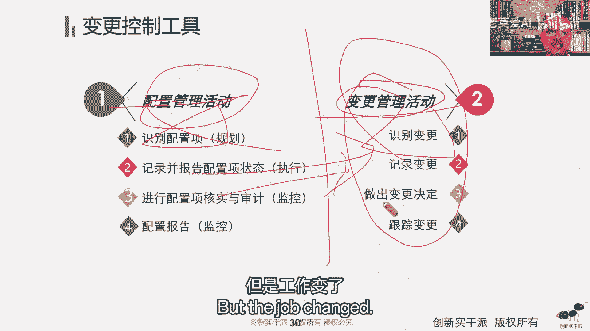

不行，影响的是面是好，最后走到4。7，我们结束项目或阶段，有我们这么一个什么基本的一个流程，那基本流程在这里，核心点我们就把它分成两五块，这样是比较简单，第一块就是什么，经过成果验收之后。

我们把这里什么把这里干什么，把这个成果交付出去，第二块就是对内，我们需要处理重点就是组织的过程，资产的报告知识收尾组织过程，资产相关的什么相关的这总结啊。

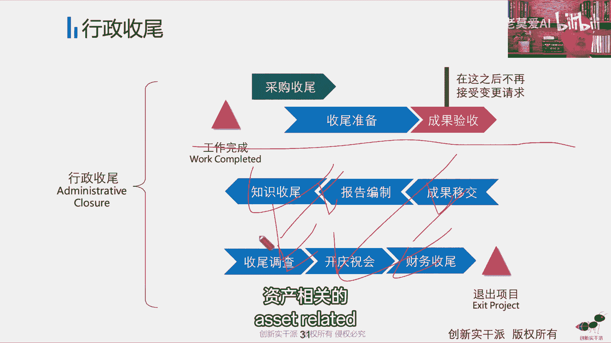

建安教训的相关的什么总结和收尾，一个什么核心。

这是我们的一个核心好了，这是我们讲的一个数位，那阶段数位跟这个项目收尾一样。

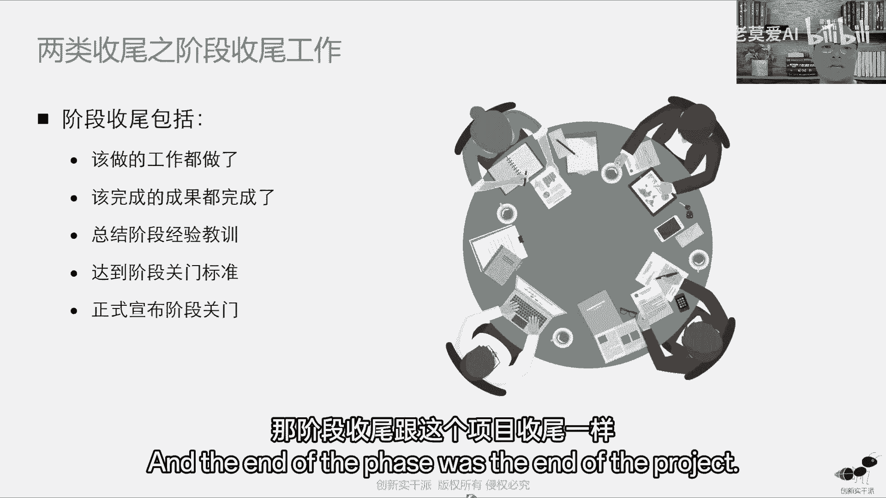

我们每一个阶段都可以做一个什么，做个小项目来处理，完事了好吧，就完事好，社会工作就包括这么多，但核心的东西注意不会考的这么细，我们得知道实际工作中你可以用的这么细，但是核心的东西我们得找大块。

把它分成两块情况，把这个呃可交付成果移交。

以及我们内部的相关什么组织过程，资产的相关的更新，这是我们的一个核心好接下来让我们聊聊范围，这是我们开始聊九大知识领域了，这是重的基础，第一个就是什么算了，你得知道做什么才知道什么时间能做。

才知道得花多少钱，你既做什么才知道把这个东西能做成什么样子，才知道用什么资源，用谁来做，做的过程中可能会存在哪些风险，不停的过程中可能会还能通过通过采购，这是我们讲的什么七大知识领域。

那另外两大沟通和干系人，那我们另当别论，当然也是以它为基础的，你不同范围干写成不一样，那干形成不一样，沟通的点就不一样，所以范围是什么，基础中的基础，但是范围第一个你我们得先明确一个什么。

我们得知道在这个过程中呢，我们学完了，你得知范围是个啥，我们讲项目的范围，项目本身就是相关的工作，那项目的范围指的是什么，就是我们工作的范围，所以我们不能理解是什么，把它理解是什么。

我们可交付成果的范围，不是这样，不是这样，但是我们现在不是讲了一个WBS吗，在这里我们又说了WBS那个时候分解工作包，它是可交付成果，我们得知道，我们在这里是以可交付成果的方式来代替了。

来代替了项目的范围，为什么，原因是基于我们后面做的具体的活动，那是什么相关的工作，那是由技术具体来做，从管理角度我没办法管到技术那么深，因为你根本不懂技术，我不是说不懂，就说因为我们从技术角度。

很多东西我们没办法分得那么深，因为从技术角度，我们确实没办法把它分的那么深，所以就很麻烦，我一会给你，我来讲课，所以我们没办法分的那么深处，我们就以可交付成果来代替我们项目，什么项目的范围。

那什么时候把它分的那么深呢，就到第六章，我们定义活动的时候，是不是把它就分的那么深，就可以把它分成分成具体的活动了，所以所以这两个WBS分解，我们得把它知道把分解成不一样，把它分解不一样好，这是第一个。

所以确定范围就是确定我们项目什么边界啊，并确认完边界之后，我们看第一步定义定定义范围，定义范围之后，我们定义范围的什么，主要是边界，边界完了之后，我们把这个范围进行什么，可交付成果的一个什么分解。

用可交付成果来代替我们范围，最终控制范围的时候，我们看什么，看你没有做多没有做少，那么前期什么还有一个数据需求，原则上讲数据需求这个应该单列，但是我们得知道我们所有的范围是从什么。

先是由客户需求到产品的范围，到产品的范围需求，再到我们项目的什么范围需求，而往回倒的时候，刚好相反，我们项目的工作都完成了，就完成了一个什么产品，我们可交付成果的需求满足。

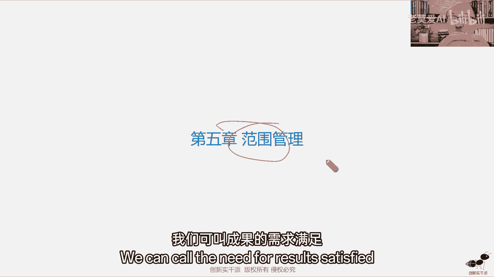

再看这个到底倒回去能不能满足客户的需求，有这样一个基本点，所以我们在这样一个一个项目，分成两块产品范围，项目，产品范围是我们具备的某些具体特征和功能，我们产品只是一个什么一个载体，我们用的是特征和功能。

那项目范围呢，为完成这个载体而进行相关的什么工作，那你工作到底多少，不同的人分解不同，所以我们用这个产品的可交付成果，来代表工作范围，这样就可以达成什么。

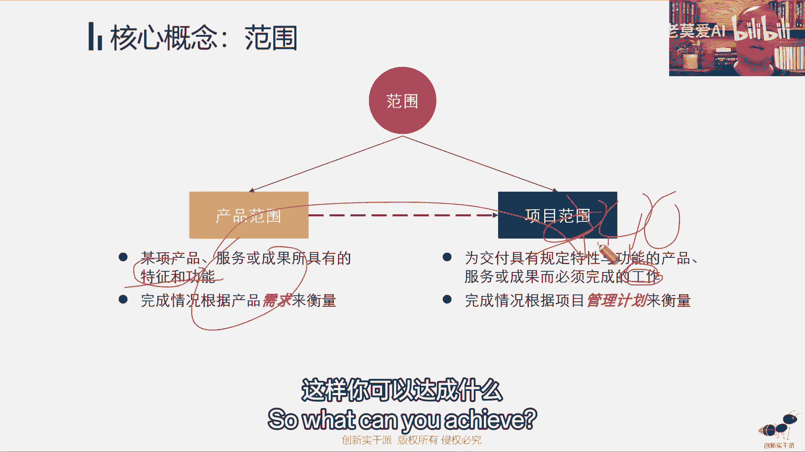

这样就可以达成统一了，就可以达成统一，好吧好，这是在敏捷里面，我们产品的范围，它最后记录我们在预测型里面产品的范围，说明书嘛，年龄要产品的产品代码列表。

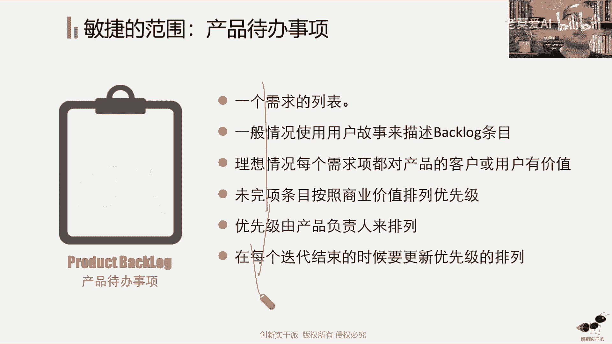

这就是我们讲的什么，优先级顺序的一个什么排列，到时候会排列优先级顺序排列，连接顺序好，那数据需求完之后，我们有两个需求统计的，一个叫需求文件，一个叫需求跟踪矩阵，需求文件记录了所有的需求。

而需求跟踪矩阵干什么，它又是花开两朵，两朵各表一支，也就是说左手是什么需求，右手是我做的需求，对应的什么需求。

从需求到产品的特征，功能到最终的产品的一个载体，也就是说对应的可交付成果是什么样的，它对应这么一个点好，那我们定义范围之后，就包括范围说明书，包括哪一步，包括哪，但更重要的是什么。

我们工作分解结构讲到这之后，就是我们管理上常用的一句话，叫什么叫复杂的事情，如何把它叫做什么，把它简单化，那复杂的是如何把它简单化，那如何把它简单化，基于什么，基于这样以大幅减小生命周期。

以大分拣小小的管理工作，分解结构也是以大分拣小，把它做成什么小的管理。

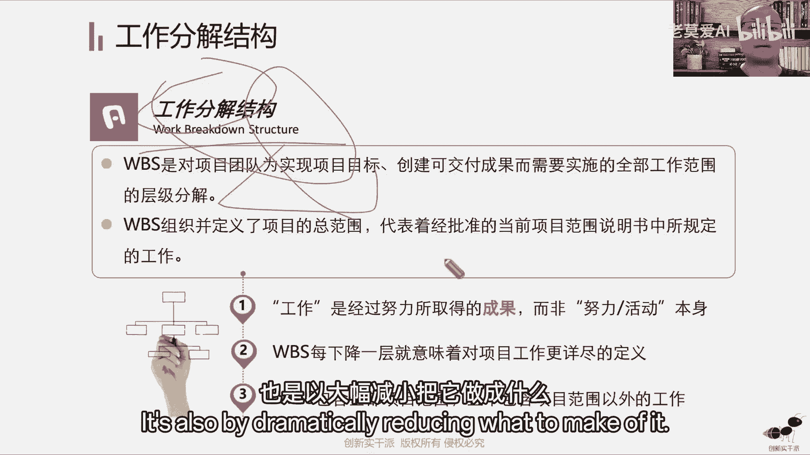

最终我们以成果来代表我们项目范围，好吧，这是简单的功能分解，结构和功能分解，那最终的范围说明书由三部分组成，第一部范围说明书，产品的范围，单范围描述以及主要可交付成果，以及我们验收标准。

也就是说我们在团的时候，一个是可交付成果，一个得有什么质量标准，第三个还有什么是我们不做的除外责任，再加上把它可交付成果做成一个什么分解，那这个可交付成果是可泛用说明书的一部分。

这个WBI词典主要是对他一个细化而已对吧，所以这两个本身就是范围说明书中，中间那个什么可交付成果那部分，把它进行什么分解，所以他们一个是粗的，一个是细的，整体叫什么叫范围基准计划范围基准计划好。

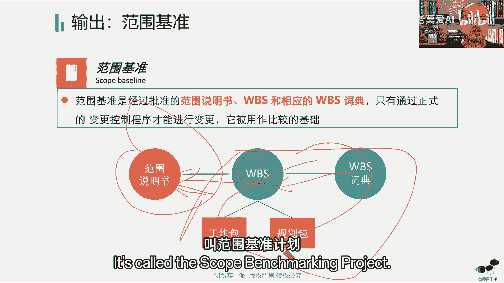

那接下来讲完了范围确定要做什么，我们接下来看什么进度管理，注意啊，我们现在还是在聊，一定得知道，我们现在是以时间这个维度作为整体的维度，帮忙我们做事，在什么时间点，我们有什么人，用什么资源做什么事。

把它做成什么样子，花了多少钱，或者需要还需要采购，这不是在某个点就可以做做这些事吗，但中间的风险是这样发生的，它不仅并不见得一定什么时间点吗，中间沟通也是这样发生的，感性人也是这样发生的。

看起来也是这样方，那好我们讲进度就是基于范围而来的，所以我们第一步不是定义定义这个叫什么，定义活动，就是把WBS工作包，分解成具体的什么技术活动，活动多了，我们为了保障效率，排列什么优先级顺序。

把它割成什么，把它做成什么网络图嘛，做成相关的融合网络图，那好这是一个网络图，网络图接下来干什么，估算时间，那估算时间是基于什么嘞，是基于基于叫什么，基于资源来的，所以我们估算资源，估算时间。

网络图代表了先后顺序，那时间呢代表它相互顺序持续的具体的时间，所以这个就代表了我们什么加上时间代表，网络图代表了先后顺序，加上时间代表了我们什么，具体的时间达不到我们项目的什么，总时间是这样来的。

最后我们的里程碑，甘蔗图以及时标，网络图只是三种不同的一个什么用染制工具好。

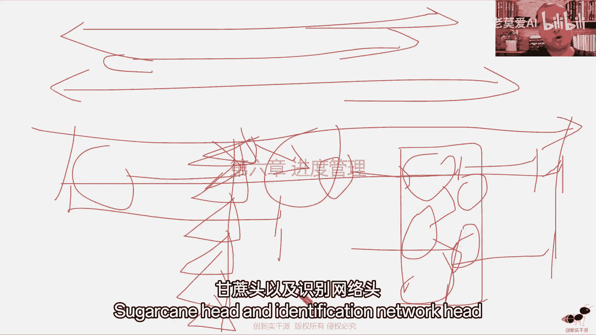

那么在敏捷里面，我们的整体的时间从哪里规划，注意敏捷里面，站在项目经理的角度，站在项目团队的角度，我们对项目时间的规划反倒不自主，什么叫不自主呢，因为我们项目每年里面讲规划讲的什么。

讲的是项目的时间和这个概念，讲了项目时间和，也就是说比如说两周，那这两周之内我就撅起屁股准备干活，那时间规划怎么规划，其实都是由上层规划好，比如上层先规划我们发布产品路线，什么时候发布第一版。

什么时候发布，第二版，什么时候发布第三版好，现在先做第一版，我估计需要N个迭代，那好了，接下来我们做什么，我们做的过程就是迭代一，我做什么，做哪些功能，迭代二，我做哪些功能，迭代三，我做哪些功能。

我们只负责严格的按照迭代来做就好了，反倒整体的进度，我们项目团队实际上是什么，是不做管控的，这个就是由上级做什么整体管控，但是我们基于底下，有的时候也要往上做一个什么，做一个整体的探讨，一个互动的过程。

再把整体的时间排出来。

但是你确实管控不了，管控不了啊，这就是我们讲的洋葱圈的一个基本的一个，规划的行为，好滚动式规划在进度里面我们经常讲是吧，滚动式规划，那滚动式规划，实际上就是我们前面的什么渐进明细，干到那个时候再说。

你就跟我们范围里面讲什么讲工作包一样是吧，现在能分解吗，不能分解，那不能分解，我走到那个时候再说，那就是滚到前面再说呗，啊是体现的核心还是什么。

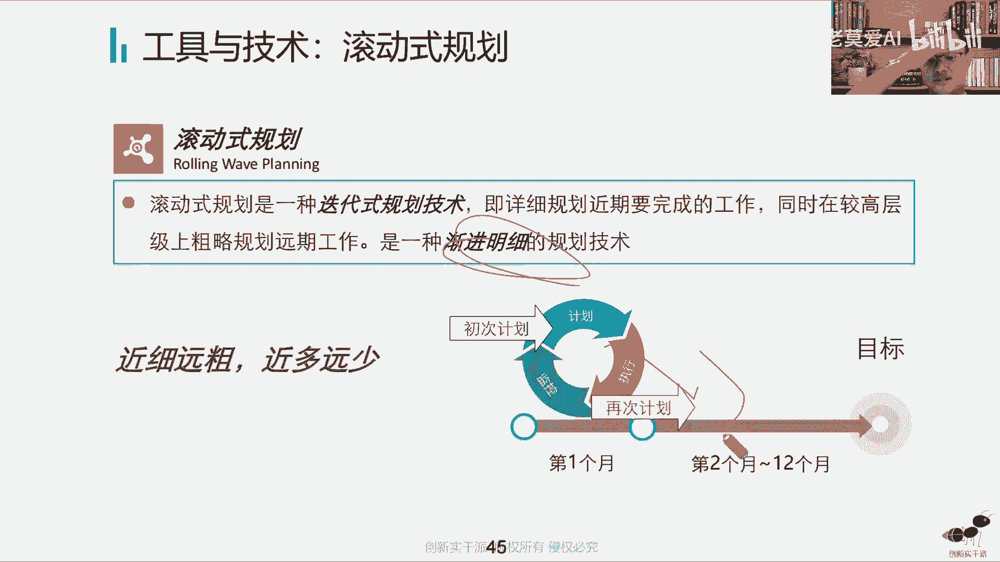

还是经济没写好吧，那刚才定义了活动之后，我们说排列活动之间的逻辑关系呢，我们有两种，第一种叫硬逻辑，一种叫软逻辑对吧，那但是最终表现是表现了，我们这四种基本的一个什么逻辑关系。

开始完成完成开始开始完成完成，我们最多用最常用的也是什么，前面完成了。

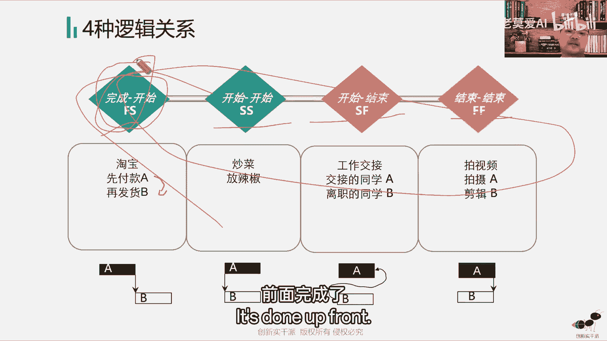

我们后面才能开始，我们什么后面才能开始，这是我们讲的什么逻辑关系，中间为了让逻辑关系可行性，有的时候还得加上什么提前量和什么和知乎量，提前量和支付量是在干什么，是在是在讲的是什么。

两个活动之间的一个时间的关系，两个活动之间本来没有间隔，把它间隔A两叫支付量，两个活动之间本来没有重叠。

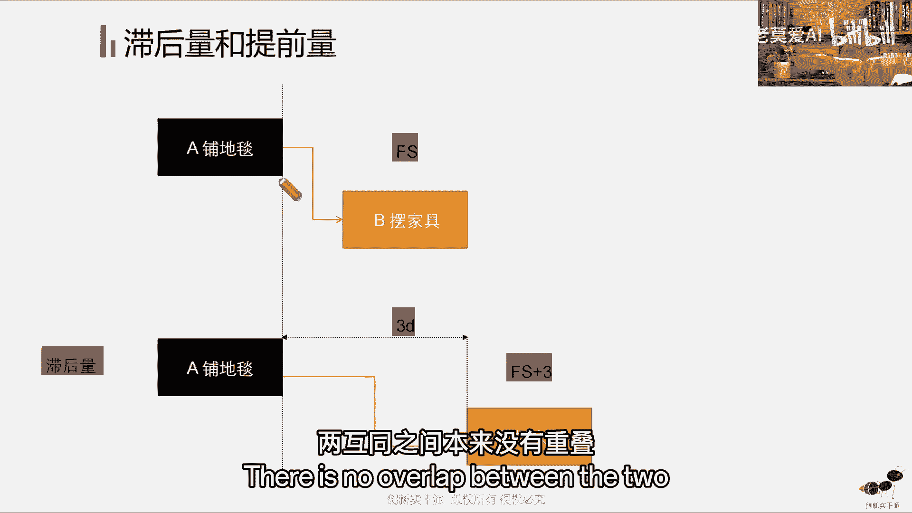

把它重叠，A两叫什么叫提前量，叫提前量，好最终输出什么，我们网络图，所以我们虽然看到时间上，我们讲第一步做什么，第二步做什么单线的环节，第二步体现在什么地方，体现在网络图上，逻辑关系了整体的环节。

第二步体现什么，就体现在整体的网络图加持续时间，按价值。

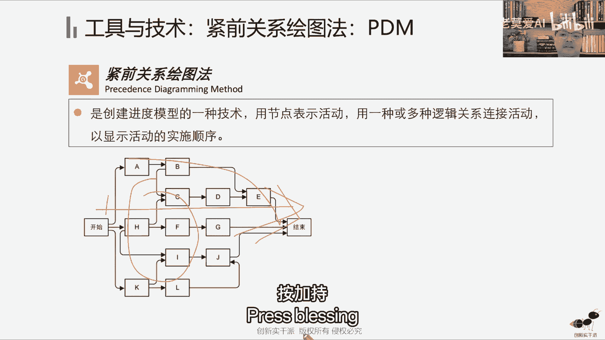

因为是从时间来的，那接下来我们估算时间，我们这有类比估算和什么和参数估算，那天我说了，他们两个的之间的区别，都是基于历史数据而来的，但是类比估算更多是从总体对整体对吧，那参数估算更多的。

一定要有一个什么相对应的参数，有一个相对应的模型来算出来，这个才叫什么，才叫参数估算好吧。

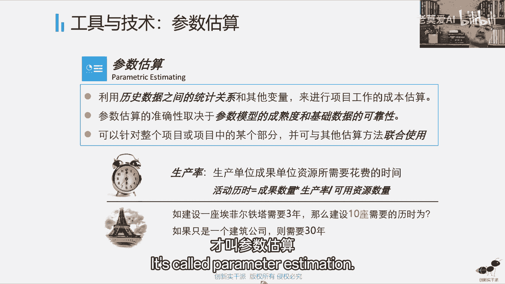

这个三点估算，这个是我们利用考考虑风险的时候，大家得知道有个加权就行了，就是141的一个整体的一个加权啊，到这里，所以我们算出来它是一个基本的分布。

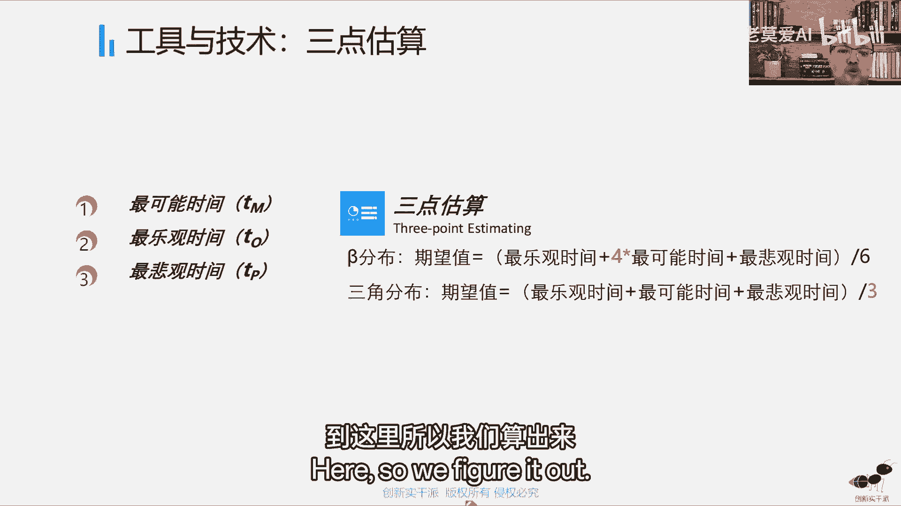

也就是说50%的给打成空间，那如果非要算，我们到时候还有个什么。

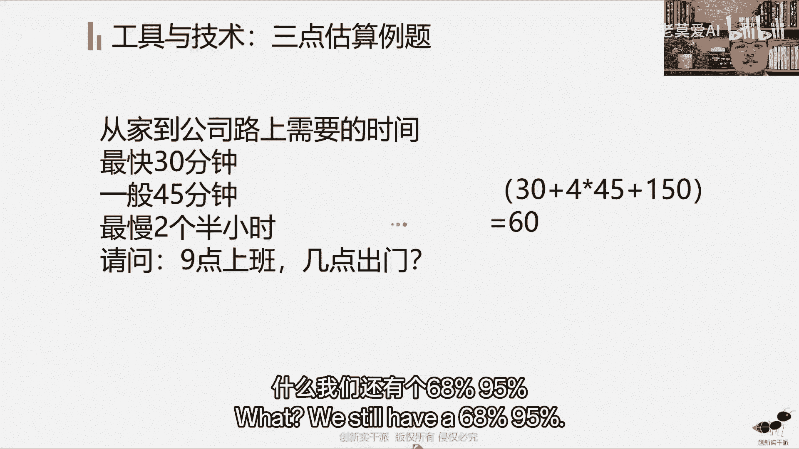

我们还有一个68%，95%，99%这样一个基本点，大家记的时候就是六十八九十五九十九，小数点不用记，如果考试真考到了，你看哪个比较接近就完了，你得知道后面有东西。

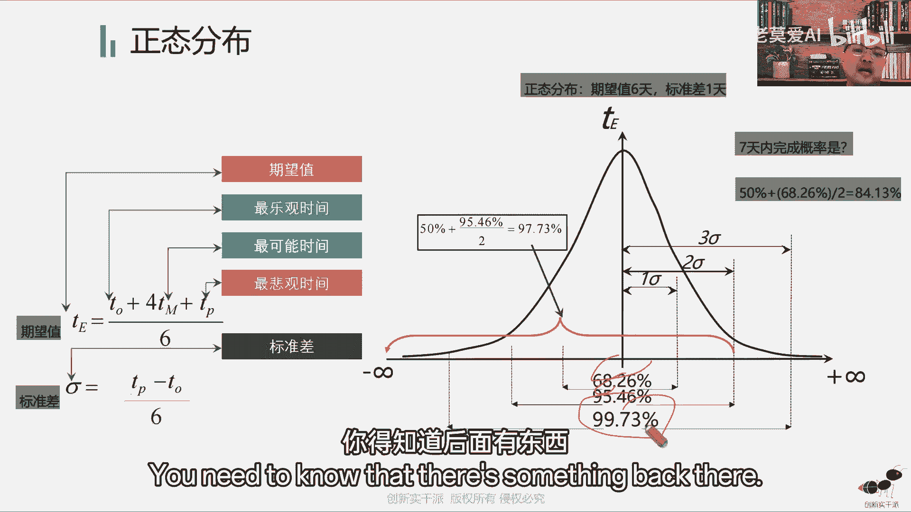

那你看哪个比较接近就完了啊，那个比较接近，我还有一种自下而上，这种最准确，但是也是什么也最复杂，也最烦，因为太多了，你得把底下的全部算完，再把他怎么一步一步往上进行，增加的一个过程啊，这过程好吧好。

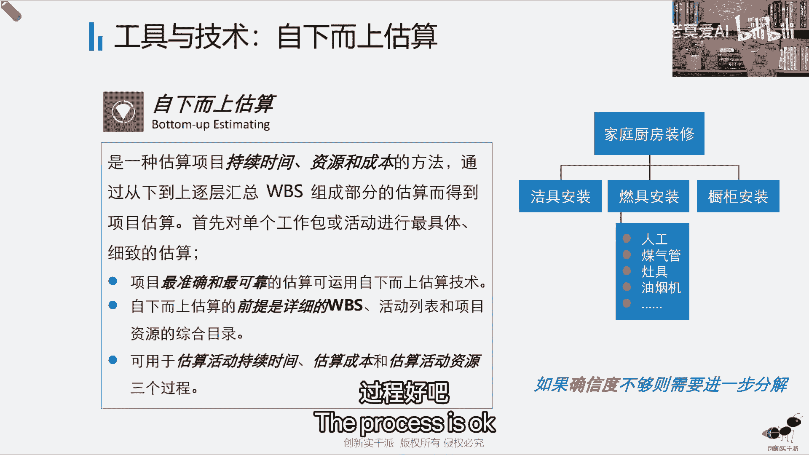

那做完了时间，谈完了网络图，接下来我们就开始进行分析某种网络图，进而通过前导后导推动我们项目的什么，整体的时间，也推出我们项目的每一个活动，什么最早开始时间以及最多什么最早完成时间。

这我们用的方法叫什么关键路径法，那关键路径嘛，那关键路径嘛核心是什么，从前往后我们推出什么顺推，我们顺推的方程中，我们找到我们项目什么最早完成时间，那基于最早完成时间，我们再逆推。

那逆推假设最早完成时间，就是我们的最早完成时间，我们的逆推得到我们每一个活动的什么，最晚开始时间和最晚结束时间，这样一来就得到了我们活动相关的什么，浮动时间，得到我们活动或活动的浮动时间好了。

很多人对关键路径法知道关键路径法，找到关键路径，我知道了那个很重要，因为你把它延迟了，就会延迟偶像，但很多人对浮动时间这块理解就不太透彻，那我为什么要浮动，浮动的核心是影响我们项目什么项目的灵活动。

你比如说总浮动时间，那我们说总浮动时间，关键路径上一般没有总浮动时间，那么次关键路上一般有总浮动时间，我们后面不是学了资源平滑了吗，那你学了资源平滑之后，翻过头来，我能不能让你非关键路径。

你如果关键路径这块急了出问题，因为我们毕竟计划是计划，如果关键路上现在出问题了，我们是先赶关键路径，还是先管非关键路径，肯定我先管关键路径，所以这个时候我通过资源平滑上，不通过费浮动时间。

我就给你关键路去帮忙，这叫什么，这叫这叫这这这这个叫什么，叫资源平滑嘛，这个资源平滑是那这不就完事吗，他就在自然浮动时间就能用，非关联网浮动时间就能用，这是第一个，第二个我们再来聊聊怎么那资源平衡。

假设我们现在一明，今天老王有两个工作要做，那请问现在有个工作必须要延迟，那必须要碰到第二天，你会选择放哪一个活动，放在第二天呢，我肯定想办法看能不能把非关键的那个路径上，那个活动往后面延迟。

而不是把关键路径活动往后面延迟，所以它的核心目的就是我们叫什么，我们叫非关键路径，要资源啊，怎么样把这个资源先紧着关键环路径上用，那还有一句话叫什么叫关键路径，要时间指的什么意思，我们后面时间延迟了。

我们需要赶工，需要进度压缩，你压缩重点在哪里，就在关键路径上，你不要老是压缩非关键路径，压都没用好吧。

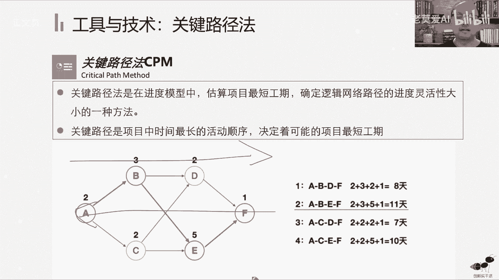

这是关键路径，好，总时差我们刚才不是也说了吗，不是也说了，这是一个办公室的项目。

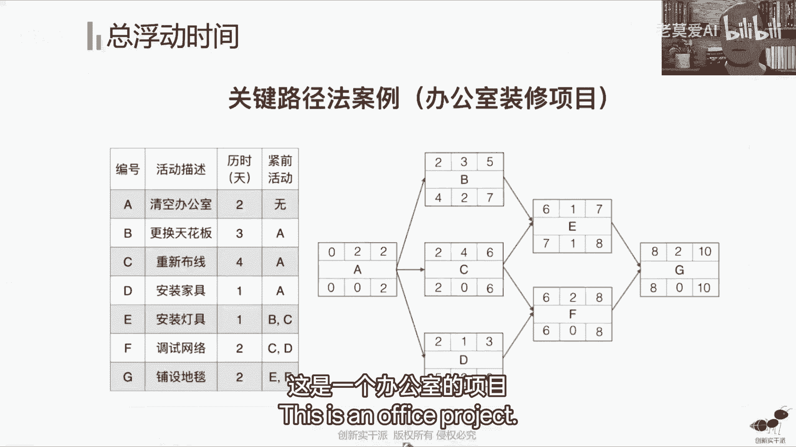

我们说好，自由时差跟总时差的用法也也一样，核心点一样，只是参考点不一样，总时的参考点就是我项目整体上不会延迟，但自由时差的参考点是什么，你不要延迟我后一个项目的完工时间，最早开始时间，你不完工。

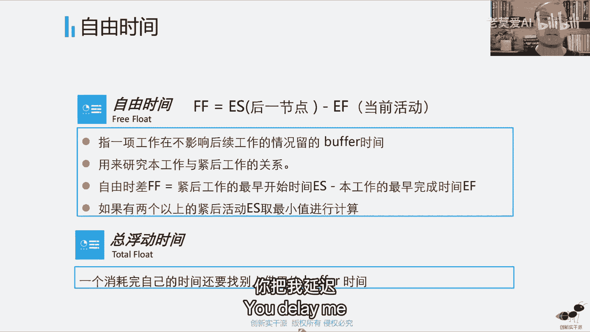

沿着我这，因为后一个项目的完成时间，有的时候是有必要的条件的，你比如说我们说两个项目，假设这个活动，你说这个活动原则上讲最早开始五，最晚开始是十，也就是说从第六天到第十天开始，是不是它都OK啊，都OK。

但是前面那个活动比如说有的用，但是不好意思，现在有个活动叫什么，原来他是这样，这是我们理论算出来的，客户这对C活动有个要求，什么要求，5号他客户要来现场看，因为他只观察C活动，只关注C活动。

那就意味着什么，那C活动P5号准时开始呀，必须准时开始呀，它就没有延迟空间啊，所以前面你就不要影响我们C活动，什么最早开始时间了，可能他有一些必要的一些条件在对要资源平衡，我们刚才说了。

把这个往后面移一填，可能会导致关键路径什么延长自然平滑。

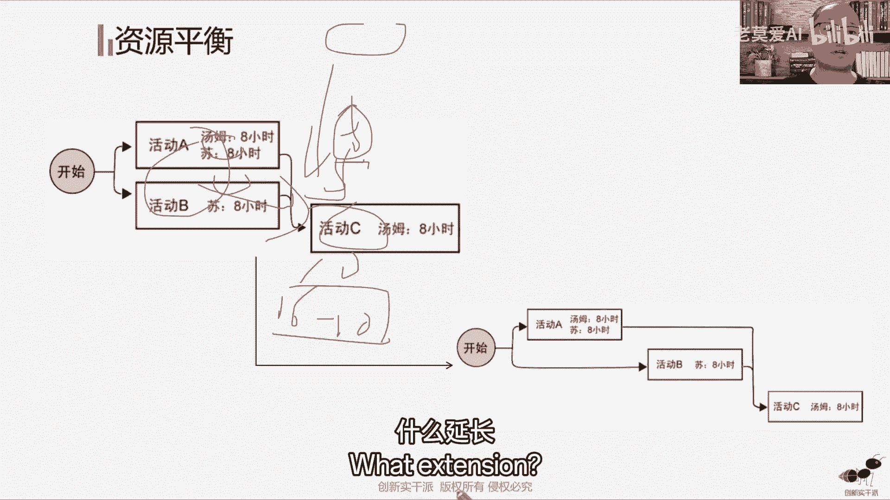

反正你看A和B在一起，谁先做谁后做无所谓，反正你最早开始时间和最晚开始时间，都跟C相关，C是关键路径，在关键路上完成就完事了啊。

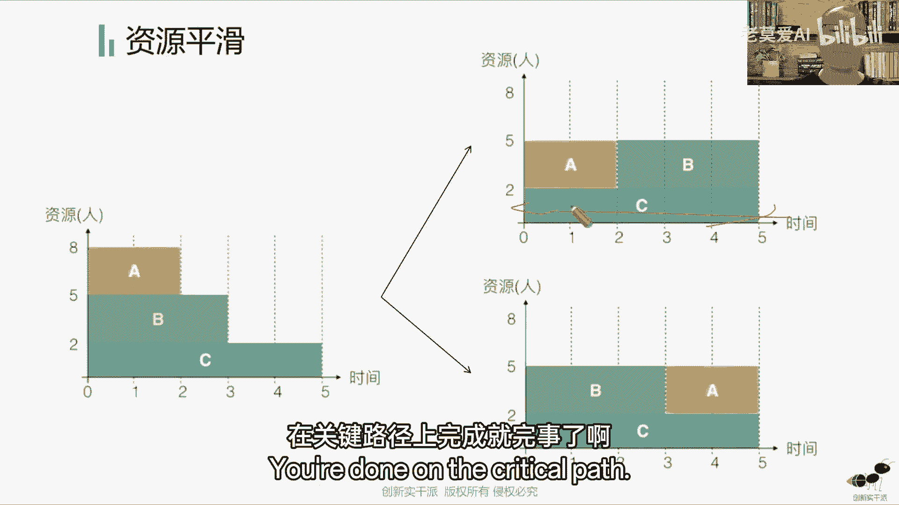

关键路上就完事，这个所以说资源平衡跟资源平滑，它的核心重点在哪里，他要用他的去帮忙呢，是只在浮动时间，他这样的一个核心，而资源平衡呢，那这个时候先平衡什么，如果可以，我肯定先把非关键路径五个项对一好。

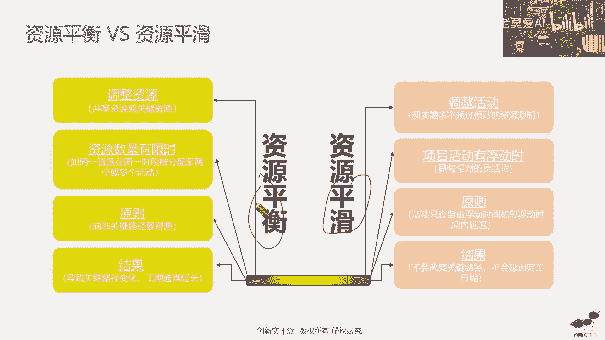

那我们就叫关键路径要要什么，要时间，那如果现在时间没了，我们要什么，通过赶工，通过快速跟进，我们要时间，那你赶工和快速跟进，你关跟进谁跟进，关键路径上的这些这样的一些点。

所以你注意看这两个它的感功的核心呢，感功的核心是把某一个具体的活动的时间，什么长，给它缩小了这么短，那么快速跟进，它不是把压缩活动时间，他是把活动跟活动之间的关系给它压缩一下，这不就是我们前面讲的。

一个是估算活动时间，一个是进度的什么网络图嘛。

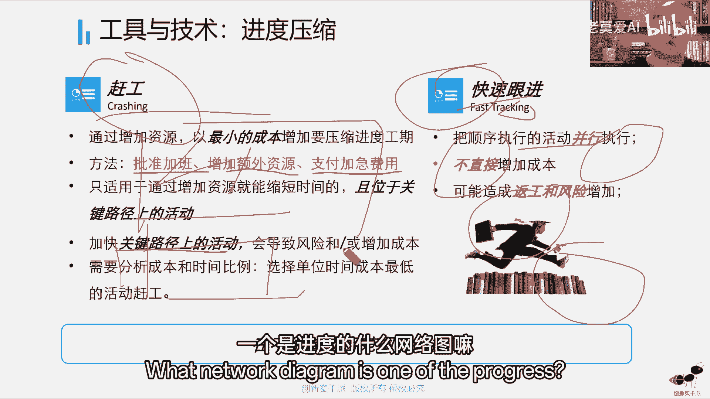

排列活动顺序，他就是从这两个角度进行什么进行压缩了，这是我们看快速跟进。

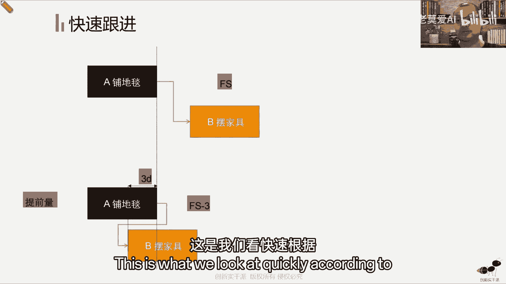

把它网络图进行压缩一下，跟压缩一下，这是一样的点，为什么在敏捷里面我们讲进度这块更多用，有一个同学叫迭代燃，其实什么还叫迭代，燃起头，那你听这两个词就差不多了，燃尽头就烧完了，跟蜡烛一样。

那烧完了一根蜡烛，那就换句话，假设你的工作就是一根蜡烛，蜡烛什么时候烧完，你工作也就完了，这不就这个意思吗，也就是说你的工作就这么多，250个故事点，所以我们预计是这样，到10月份到10月份就完成了。

这是我们的计划，那么这是我们的实际，当然这条虚线是我们预测出来，接下来干的一个实现的一个活啊，实际干的实现了一个基本活，那你到某一个点，你结合实际，你就一眼就能看出来我干了多少活，我还剩余多少活。

用它来代表什么，代表进度，那你看我这一看7月份理论上你要干到这，实际上你还剩余这么多，那你剩的比理论上多，那什么进度延误了，那同样的还有一个什么实际上叫迭代燃气，燃气都是什么，你一共做了功。

现在这种累计的我们学过成本，累计曲线。

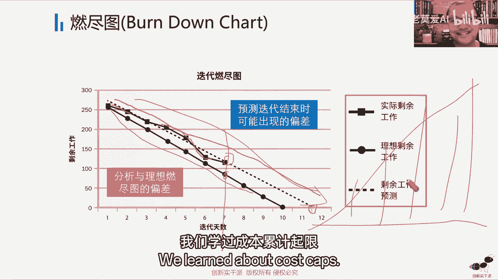

对这累计的就不陌生了是吧，一共干了多少工作，就这个意思好吧好，刚说成本就说成本好吧好，那我们聊聊成本这一块，聊到成本这块，其实很多人没管过成本，但是我们得知道成本的三部分，估算成本。

制定预算以及我们做成本计划好吧，估算成本的核心是什么，我们基于我们的当前的一个市面的价格，基于我们现在用的资源，我们把这个大概算一下，我们需要多少钱，所以它的核心是什么。

做估算的目的是为了接下来给制定预算做什么，做准备的，做准备的好吧，你把这个汇总起来，500万500万叫什么，500万叫叫估算成本，估算总成本，他你必须要有依据，这500万你怎么来，怎么算出500万。

这要有依据好，接下来领导一批，这叫什么，这才叫预算，预算是什么，预算是你能够用的钱，叫什么叫预算，换句话说，你估了500万，领导没批，这永远叫预算，但是领导批了你500万叫什么，就叫预算。

那好你估算了500万，领导批了480万，那500万就是估算480万就是什么预算啊，这好吧，你拿到这个预算之后，预算是你能用的钱，你拿到这个预算，它并不叫成本计划，它也不叫成本基准，我们讲成本进度。

后面看是一条线，那为什么是一条线，第一个你得往下分，你得往下分，分成什么呢，分成我们每个工作包，我需要多少钱，这是第一个，第二个像我们刚才的，你得往时间的纬度靠，因为我们这些成本的花。

它是以工作包的时间来花的，花成本的，因为以资源与工作包的时间，工作包这个范围又是以时间的维度来花钱的，所以你得知道每个月你得花多少钱，也就从时间的维度，什么时间我需要花多少钱，什么时间我需要花多少钱。

这叫什么，这叫成本计划，那同样的，我们课本上学的成本计划，是一条S型累积的曲线，为什么是条累积的曲线呢，后面学完正知你不就理解了吗，站在这个点上，我往前看一下，前面一共花了多少，是不是我能很好的理解到。

后面原则上每个月花多少钱，是不是我都这也是成本计划中间什么一部分，现在我们把它汇总汇总的好处是，我知道前面花了多少，我也知道后面我大概还需要花多少。

我们可以学政治管理，他的整理在这，所以看项目预算的总成，那不管怎么来说，都是基于什么估算盘，所以估算给预算做什么做参考，预算基于估算给你实际成本。

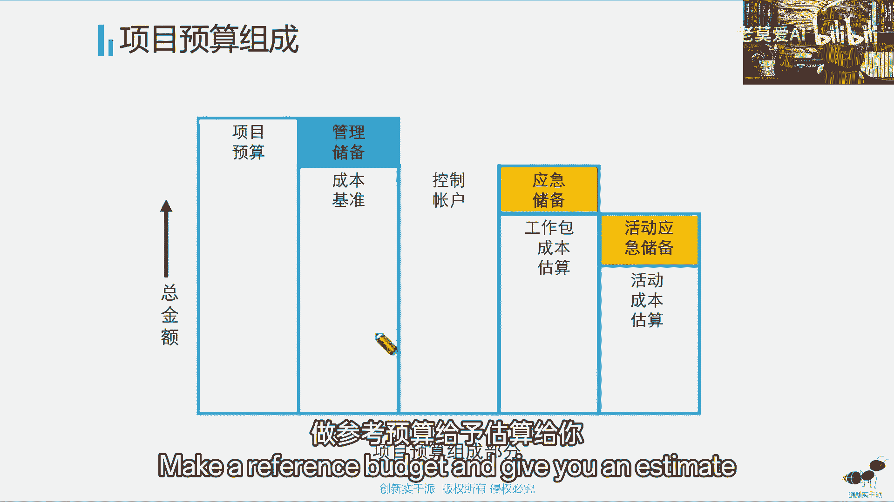

你能用的那块钱，你看预算是全部资金吗，包括批准全部资金，成本基准，要成本计算计划，实际划批准什么，按时间段分配，注意吧，所以你可以说1月2月三月四月，这也叫什么，这也是成本计划。

当然你也能不能把它加起来，这叫什么总成本计划都可以都可以好吧都可以。

那你看在这个过程中是不是，那你这样整体你拉起来这么一条线，这叫什么，这叫我们成本的总线，那你在某个点上来看，就能看到我一共花了多少钱。

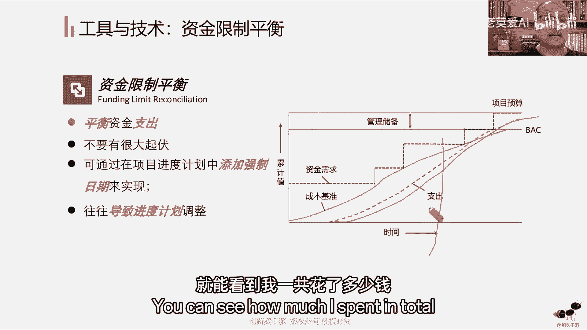

我还需要花多少钱，这有这么一个基本点来来做这么一件事情，好吧好，这里比较重要的一个就是我们政治管理，包括现在我们讲这块，现在考试考数据这一块，计算这一块相对来说就但是比较少的。

站在我们的角度考一个简单的偏差，分析绩效分析这个还是那有可能的，那你得理解他们之间的一个意思呀，TV计划价值更值这一完工运算，把这些基本理解完之后，接下来不就进入到我们吗。

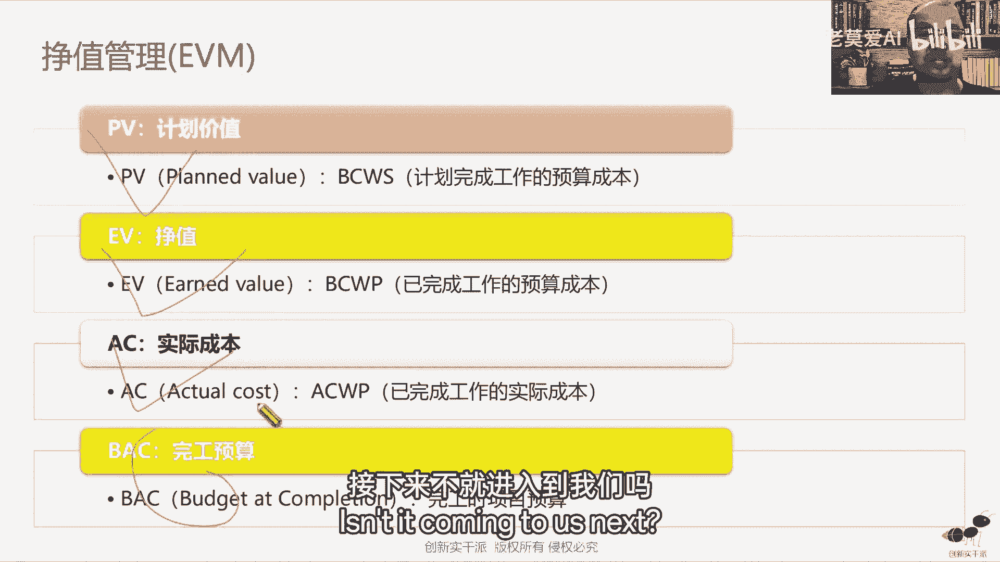

我们基本的表格运算了吗，PV是计划的，我们拿预算的单价，也就是说PV所有的都是什么，都是理论的，EV是实际的工作乘以理论的，我们拿预算的价给你一个赋值，赋值AC是实际的工作乘以实际的单价。

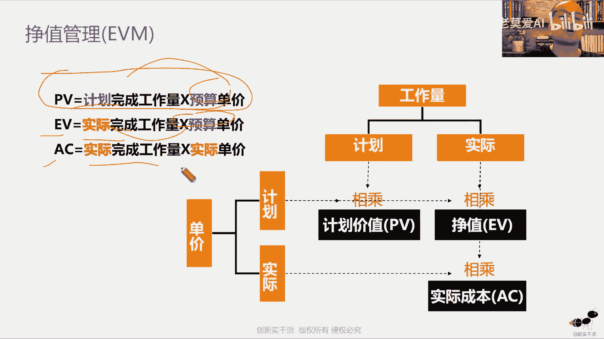

实际的工作乘以乘以实际的单价，所以我们更多是关注这一块，首先你得知道SV跟跟跟跟CVSSPI跟CPI，他们的公式，第一个一位在前或者一位在上，注意一位在前或者什么，这第一个。

第二个讲结果大于零或者大于一都是好的，小于零小于一都是什么，都是不好的，等于那叫什么，那叫符合预算，符合进度，这是第二个，第三个，你还得知道什么SV跟CV它叫绝对偏差。

也就是说它只能基于某一个具体的项目，它的前后不同的时间阶段进行对比，不能跨项目对比，不能跨项目对比，当然有的时候也能跨项目对比，什么时候对比啊，PV是1V1模一样的，BAC也是一模一样的。

那可以跨项目对比，只要有差别那就不行，但是什么时候绝对能够跨项目对比，就SSPI和和CPI，因为它本身是一个什么，就是个相对值就相当好，在这里呢还有一个点要特别注意什么点，就是SSPI。

