# 【最好的PMP课程】PMBOK6精华讲解4-4 - P1 - 老莫爱AI - BV1gE421A7Tg

SPI你得注意注意什么呢，注意SPI大于一的时候，只能说我们项目什么总进度大于一，不能说我们项目的什么，我们项目的进度一定超前的，为什么我们项目进度拿什么说的，拿的是我们什么关键路径来说的。

那么关键路径上的活动没有总超前。

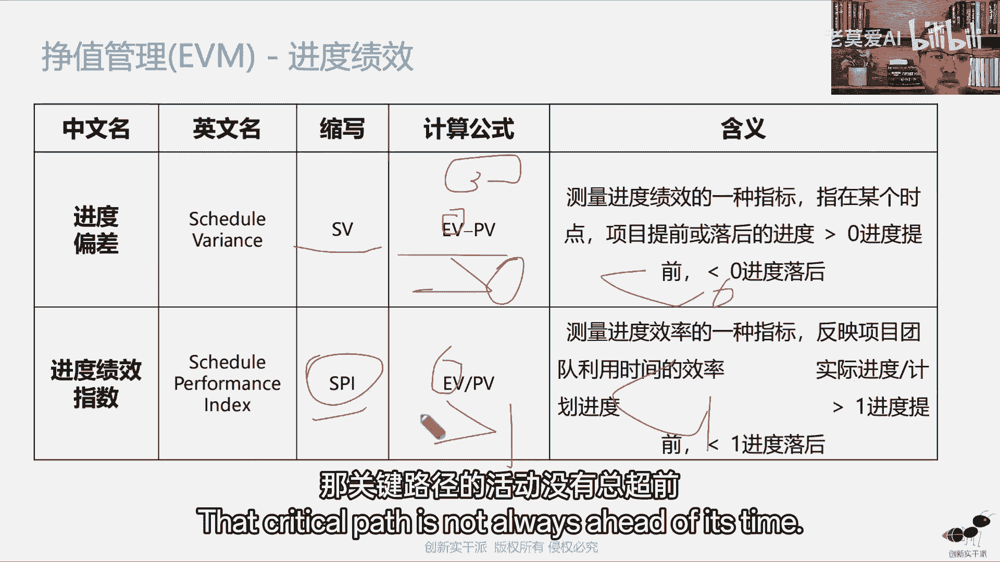

那你就不能说超前，所以你这样算出来，如果问你的时候，你还得说一句什么话，你还得说关键路径上的时间怎么样，第一款好，这个刚才一样。

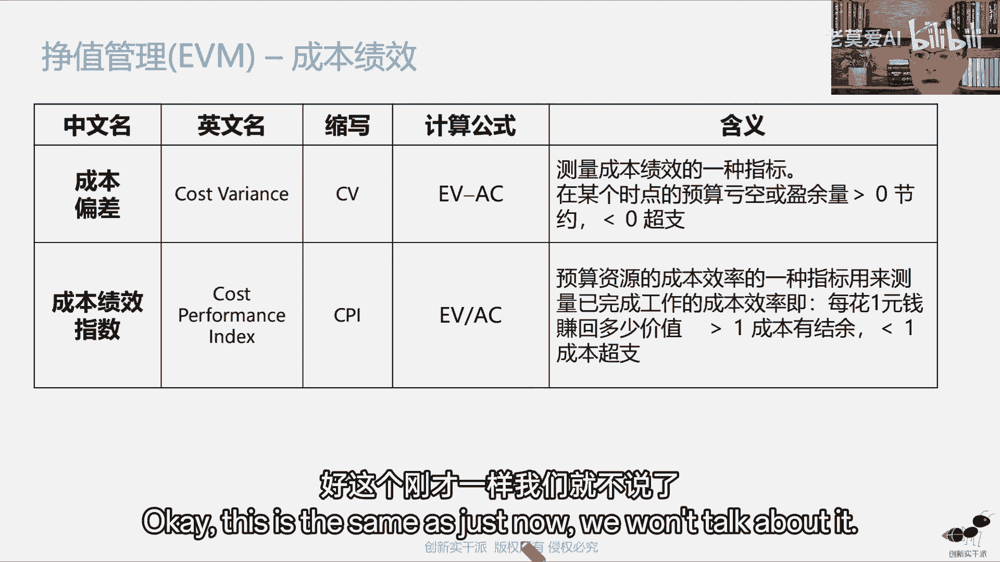

我们就不多说了，好完工偏差这块大家看一下，这块倒没有什么特别的一些点。

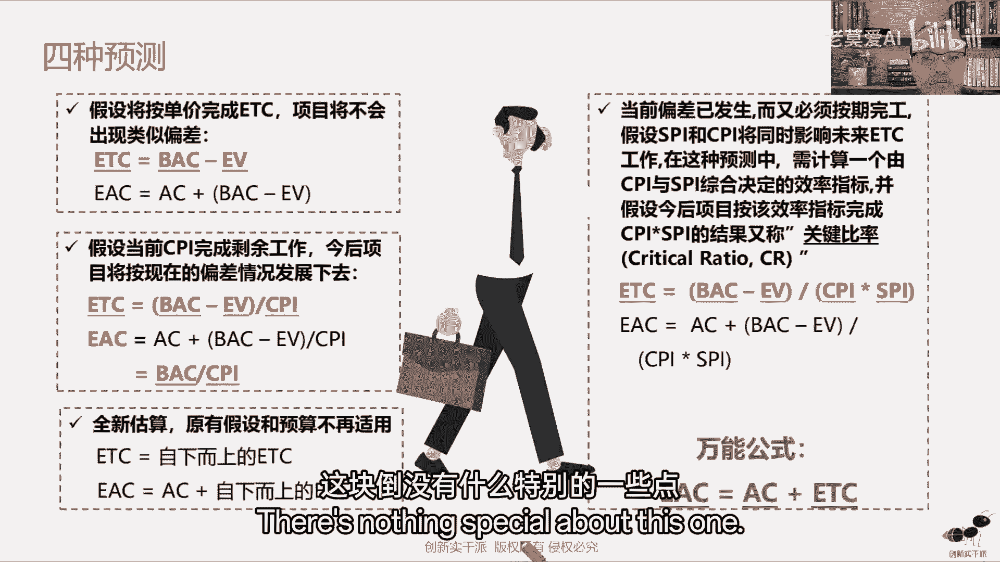

主要是一些基本的公式在用呃，大家看一下啊，结合几道题把它弄懂，弄会算就OK了。

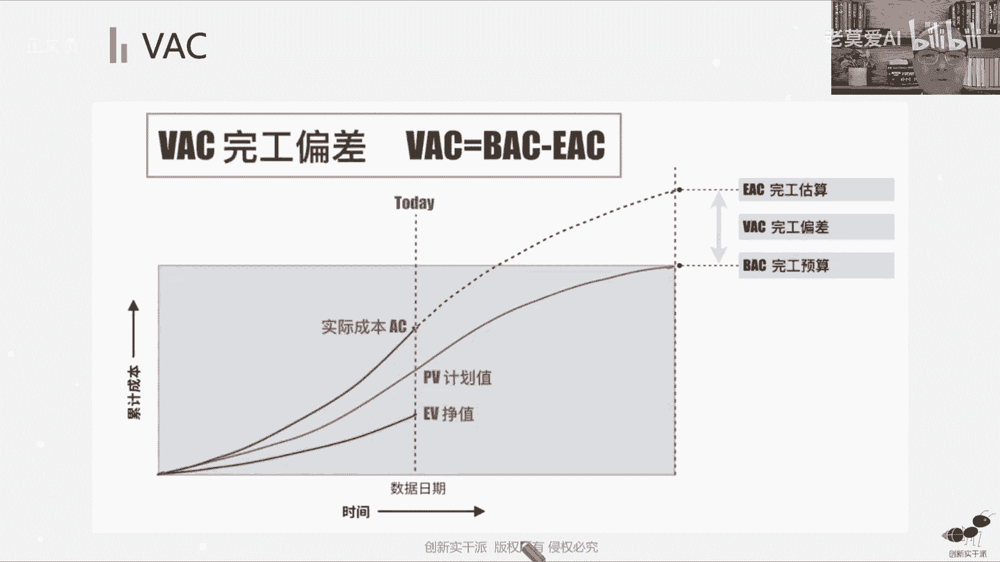

好吧好，接下来让我们一起聊聊风险管理，让我们聊聊风险管理，好了，看前面讲的范围，进度成本范围范范围进度成本，我们来我们聊聊风险，风险的核心在哪里，你要有这个我们讲风险，前面又讲了一个叫什么，一个叫问题。

那你把风险和问题放在一起对比来学，那你想一想风险代表了啥问题，又代表啥，风险代表的是一种事前思维，因为我们重点在什么，在预防问题代表什么，在一种代表一种叫事后思维，代表什么叫你发生了我再说。

发生了我再说，所以我运营中这中间经常谈什么，谈风险，谈问题，在项目上你要花重点时间谈什么，你要学会自己考虑什么，考虑一个东西叫什么叫风险，你要学会考虑风险，就这么回事，好不好，你得有有有这一本。

所以我们项目你看我们在前面，11。11。2识别识别风险，11：03分析，11：04分析，11。5是什么，已经在做规划，风险应对，也就是很多方案我们得提前做，我们既然应对范，我们得提前做。

那有的人说那风险发生了，你再应对，风险发生了，你应对那叫没办法的办法，我们尽可能让风险要么不发生规避，要么让它发生的概率小一点，要不让它发生了，可能影响小一点，我们提前就要把影响降低，提前把影响降低。

那它发生了影响自然小了，要么我们提前买好相关的保险，那不就提前就转移了，那至于说没办法的东西，确实没办法，那只能选择接受，当然还有一类确实比较小的，没有价值依赖它的，那也选择接受，那也选择接受。

无所谓了，就是那么回事儿，对不对，就是那么回事，所以基于这样的一些基本的我们来考虑风险，它是一种什么，它是一种典型的事前思维，也就是说我们先要从思维的角度，你把它有一个基本的理解。

他是一个典型的事前思维。

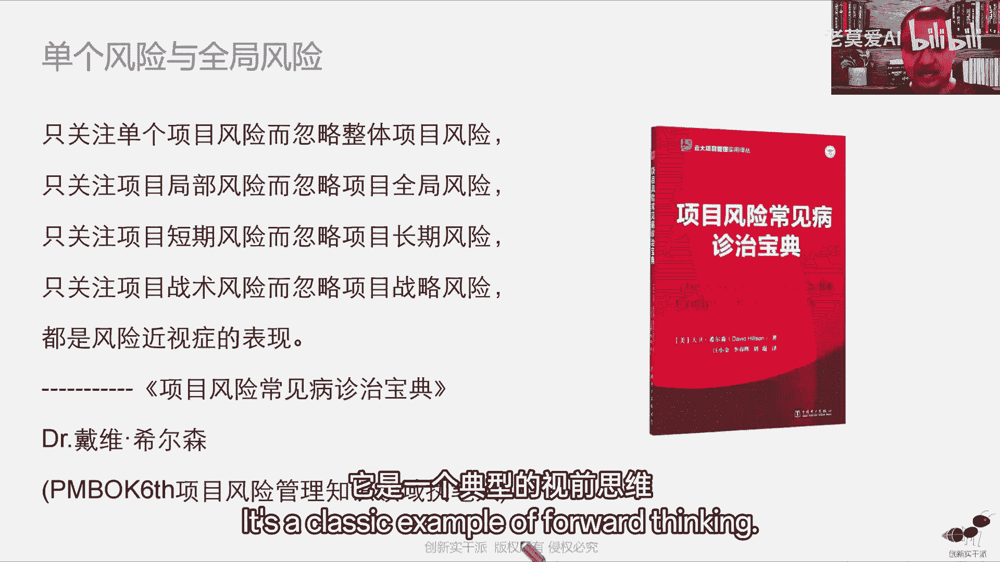

它是个典型的事前思维好，那我们识别风险的时候，可以基于风险，风险结构来说好，现在我们聊了风险与风险结构，WBS工作分解结构吧，OBS组织分解结构吧，还有个什么，还有一个RBS，两个RBS嘛。

一个叫资源分解结果，一个叫风险分解结果，考试时候注意看下英文一个risk，risk这个什么风险，还有个resource，这叫什么资源，注意一下，也就是说从这个角度。

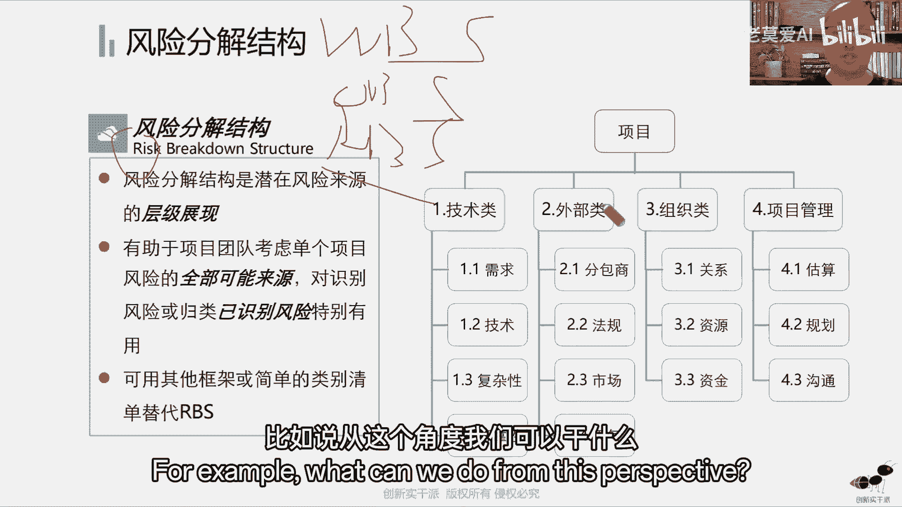

我们可以干什么，可以去识别风险，也可以从SWOT的角度，优势劣势，内部外部因素找到自己的这个优势，有自己的优势，又有这个机会的，我们当然要利用，这对我们俩是一个什么风险，好的风险叫机会。

有自己的劣势的地方，我们又没办法加以补充。

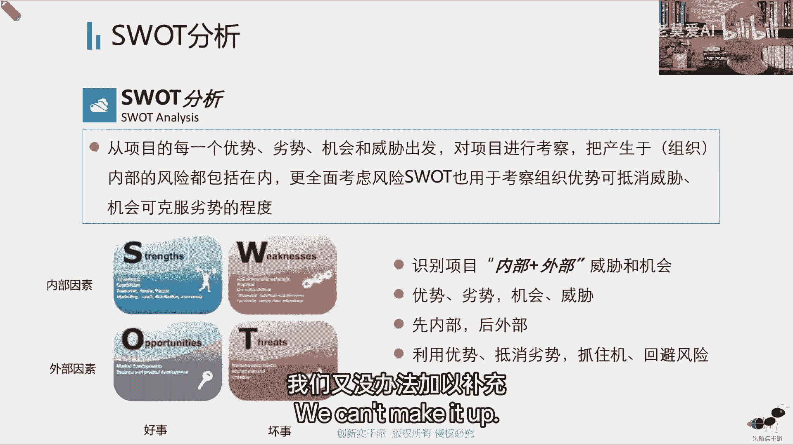

这对我们什么是一个坏的威胁，我们注意这样一些基本点啊，注意前期我们还得在虽然定性风险工具，现在得知道概率影奖矩阵，在定性风险，在高中低级别排位的时候，我们只是在做什么，只是在用，但是在前期的时候。

你得基于基于我们肝性人对风险的什么态度，到底是追求风险，中立风险还是厌恶风险，以及肝性的承担力，最终定义出来多少的风险属于高多少，风险属于低多少风险属于什么，属于低对吧，做出这个概率强矩阵。

做出这么一个概率或方便我们什么用，那我们在定性风险的时候，就会记一个风险概率影响矩阵做什么，就是通过每个风险的概率和影响的评估，把风险的高中低级别给他什么排出来，拍他的目的是什么，就像我们前面说的。

核心目的还是为了干什么，让我们重点关注什么，重点关注高级别的这风险。

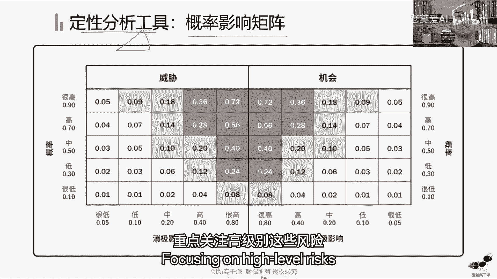

但重点关注高级别这些风险，所以我们高级别的风险，可能会影响到我们项目最终的结果，我们可能要做什么，可能要做定量分析，那定量分析，这里我们就讲了三个比较重要的工具，一个叫什么蒙特卡洛分析。

一个叫龙卷风敏感性分分机，又叫什么决策树。

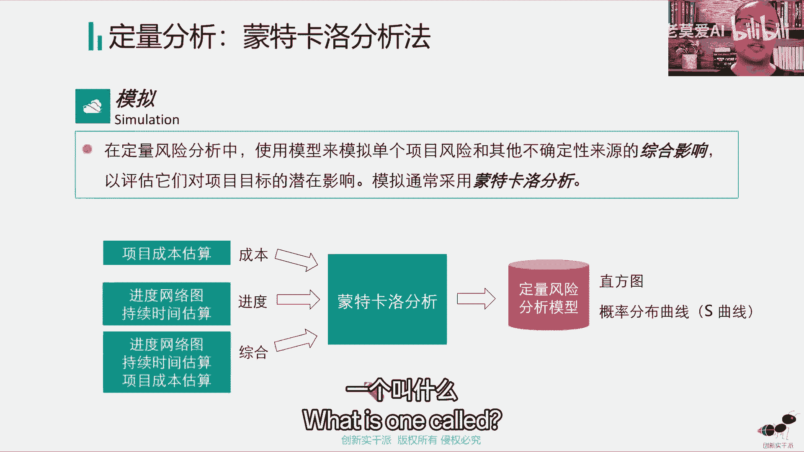

那蒙德卡拉分镜我们都知道它的核心是什么，它的核心就是利用计算机在里面挑数据，通过N次，这个N是多少，基于经验来算，通过N次的一个模拟，看它到底会落到什么点上，把它的各种可能性啊都给他做出一个点出来。

把这个点连成线，这不就可能点就出来了吗，那这个线就是相对比较准确的一条线，那这里有基本的整体目标，有概率有我们总体的预算，比如这道题是吧，85%完成以下的目标是什么，245万，245万完成的目标是什么。

改完成概率85%，那有的人说这个跟风险有什么关系，意味着什么，意味着你有15%的可能性是什么，完不成这个什么这个项目，那你就得考虑了15%的概率，你要不要单，也就是说你即便投了245万。

可能有15%的时候，你钱还得花超，那你得考虑这个，这就对你来讲是一个风险了，有15%的风险是完成不了的，不是对它进行什么量化了吗，那你得考虑，如果你说这个项目对你非常重要，我自完成率要在90%以上。

甚至99%以上，那你就加钱嘛。

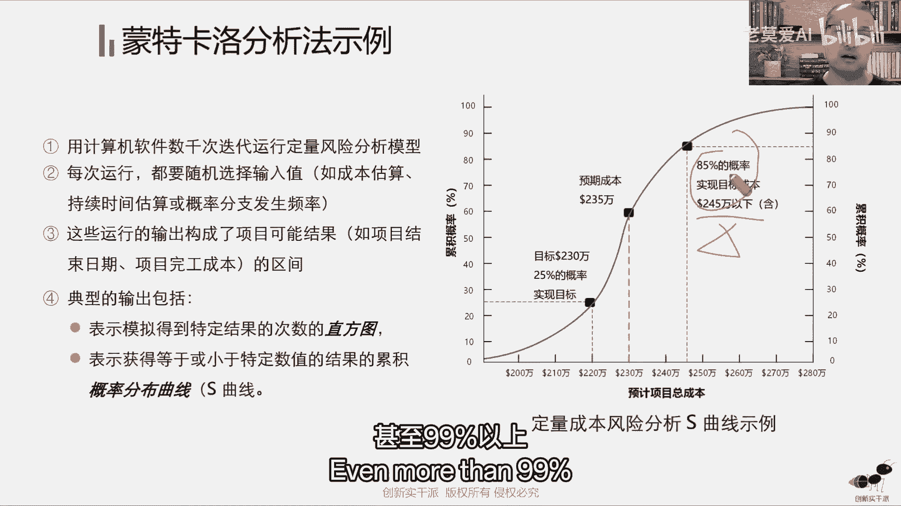

大家就确保它基本能完成吗，基本能，所以这就是什么跟风险，还有一个叫什么叫敏感性分析，敏感性分析最终的体现什么是我们讲龙卷风吗，为什么是个龙卷风，因为正值有负值嘛，有赚的有亏的，它就叫什么。

左右都有龙卷风，那它龙卷风的核心是什么，从上至下排除了对我们什么影响最大的那些系，那给我们的感觉是什么，最关注我们上面这一块，这是我们讲的龙卷风，也是他最敏感嘛，让我们关注上面，关注上面这一块。

这是我们的一个核心的一个点，那它对那它量化之后对我们风险的影响是什么，量化完之后，比如说这个减了15%，这个是我看这个是什么，这个是棕色的时候，是贷款利率减到5%的时候减了吗，他减了多少。

比如说这里他减到10%，那你就得知道他动5%，那边能动10%，他的概率动的这么大，他们两个影响这么大，那你就得注意了，接下来你要么动这块，你就要想好跳转一方，还有我们讲的什么。

其实最主要是我们还有一个叫什么叫，决策树分析，那决策这分期实际上就是两边分析，有些事情你做也行，不做也行，比如说我们经常举例子叫什么叫你投资建厂，你投资了，这可能对你来讲是一个机会，但是你这会面临什么。

你投资了很可能一方面是个机会，一方面是一个什么，一方面可能是损失了一个什么一个威胁，那你到底要把投把它做一个什么，做一个整体的分析，分析完之后，到底是投了赚的多还是不投，亏的多，还是投了赚多的。

还是投了到时候亏的多，那你就得考来他们之间拿数据，按照风险进行量化，按这风险好吧。

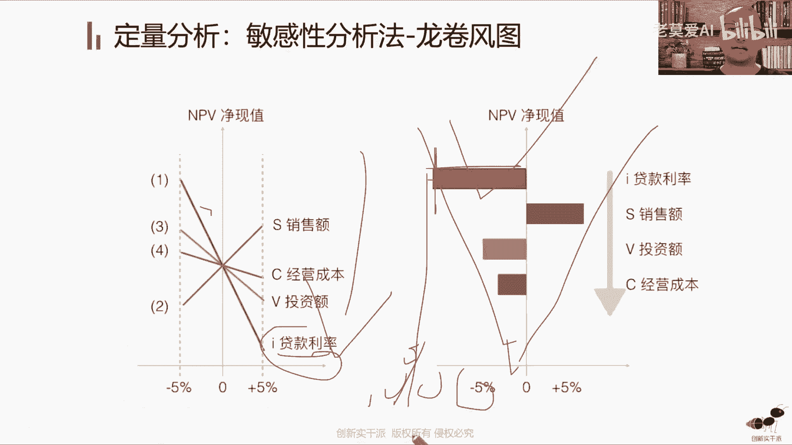

那规划风险管理的时候，我们说这五种基本的策略，在物等基本策略里面实际上只有四种嘛，上报是一种行政策略，这个我们就不说了，不在项目范围之内，或者你识别的东西，你要动用到让领导帮你忙，那就不用说了。

接下来说回避，回避对应的什么对应的开拓嘛，回避回避就要么让这个风险不要出现，而开拓者尽可能让个机会出现，注意这里这两个对比起来，一个问题回避，你说这个风险让他不出现，可以最极端的回避是什么。

就是不做了不做，那这个项目不做，我就有个技术难题，我不用你这个技术方案，那不就这个技术难题就没了吗，但是在开拓这一块儿，因为本身就是你现在正在做的明白了吧，你如果这样做会更好，只是这样做。

如果出现这个机会百分之百会更好，仅此而已，所以它的核心是什么，并不是让它，所以你能保证它出现吗，不一定，但是我们要努力确保它出现叫什么，叫努力确保它出现，怎么样能够做到努力确保它没优质资源。

采用先进技术，好多东西都给你，新年的技术都给你，我尽可能确保你出来，明白了吧，好接下来前进就是在前期前期，要不然降低概率，或者前期把影响降低一下就完事了，那这边的提高跟它对应的就是提高概率或影响。

那这个就是用数量增加数量，还有一个什么转移，找到第三方转移担保合同，这个就是什么找第三方分享嘛，现在我们不是学过采购吗，采购那里不是有个成本激励合同吗，这不就是典型的什么分享吗，你上制成降价了。

我把这个信息分享给你，你得给我也降价呀，那是你的原材料，你给我的东西也得降价，这是大家一起共享利益，好，最终的结束我们就不说了，注意接受，我们叫主动接触和被动接受，主动接触有一些基本的策略。

我们留着资源，我们留着被动接受呢，咱不干，那为什么要接触呢，我们就说过两个点，第一个确实没办法，适应不了，想打印不了，想减轻也减轻不了，它又比较大，怎么没办法，那我就只有接受接触的时候。

最起码绝对概率还是50%了，那另外一种是什么，没有必要规避，没必要减轻，没必要转移，那些东西都是有成本的，都搞都会搞乱，我的计划的转移还需要给钱嘞，前期的心理影响，那都是需要给钱的，我感觉没有必要。

我就不给他，我不做，所以我就接受，没有必要，那我就接受，这是这样的一个点。

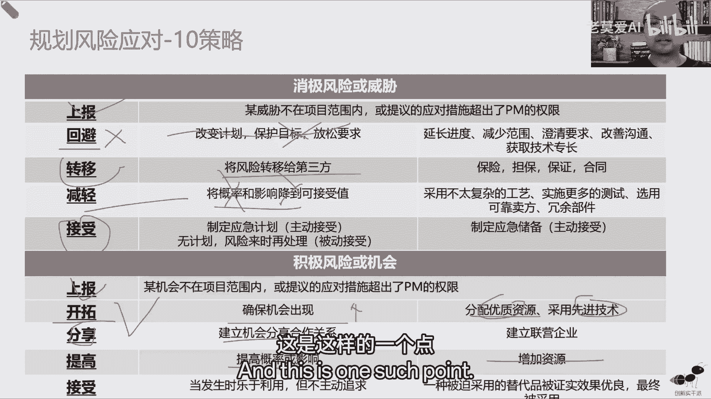

它是基于两个这里讲的几个基本点，应急计划，谈回计划，全面措施，首先讲全面措施，全面措施叫什么，简单来理解就是拍脑袋嘛，就是前面你啥没有真正出现了，你怎么办，用全面措施应急计划，我们说了它的核心是什么。

就是针对于我们讲的有那些应急策略信号的，有那些应急信号的，我们制定计划叫什么叫应急计划，应急计划，那假设前期我们的应对计划，应急计划搞不定怎么办，我们有一个保底计划，搞不定。

我们来处理它叫什么叫保底计划。

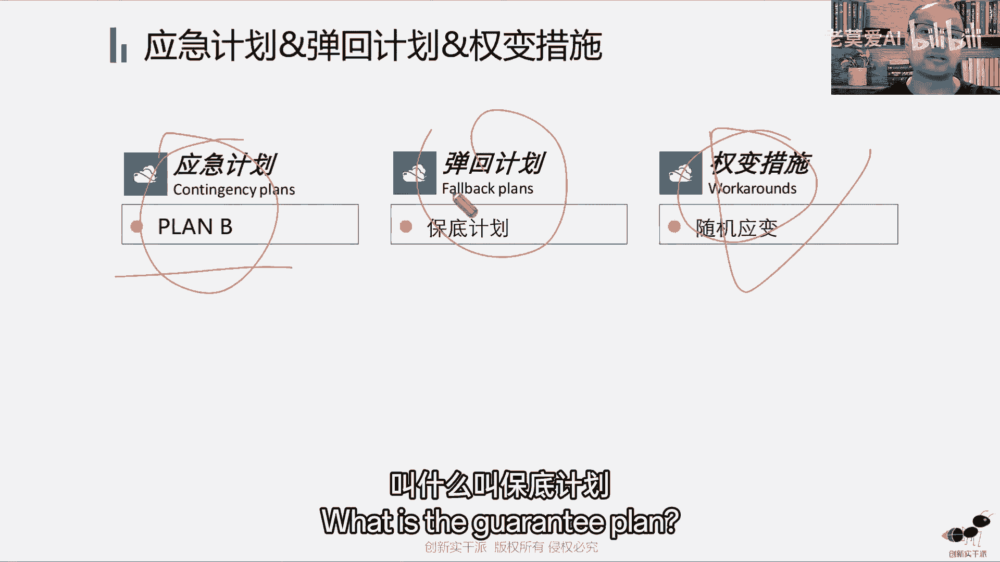

保底计划这样好，这个基本流程我们之前量过了，应对应对策略是吧，触发事件发生了，我们就应应应急计划，这叫应急应对策略，发生之后发生事件，如果搞不定，我们有弹回计划，有效结束无效怎么办。

无效你第三个你没计划叫什么全面措施吗，全面措施嘛，对不对，就像我刚才说的感冒那个例子，你很多时候感冒，你是不是有触发事件的，比如说你鼻子干，嗓子干，这不就快感冒了吗，那你赶紧出动应急计划，赶紧先喝药。

这不就感冒可能就直接先干掉了，但是有的感冒是什么呀，不好意思，你晚上睡觉时候，你根本就不知道，那你睡觉前你就感冒了，嘿你说有有有有有有这个叫什么，有这个是征兆没有有，但是半夜你不知道。

我们可以视为他没有为我们讲征兆的目的，不是说他有没有，而是我们能不能抓得到，你抓不到，那永远对你来讲是一个什么，是没有，永远是没有征兆的这么一个点。

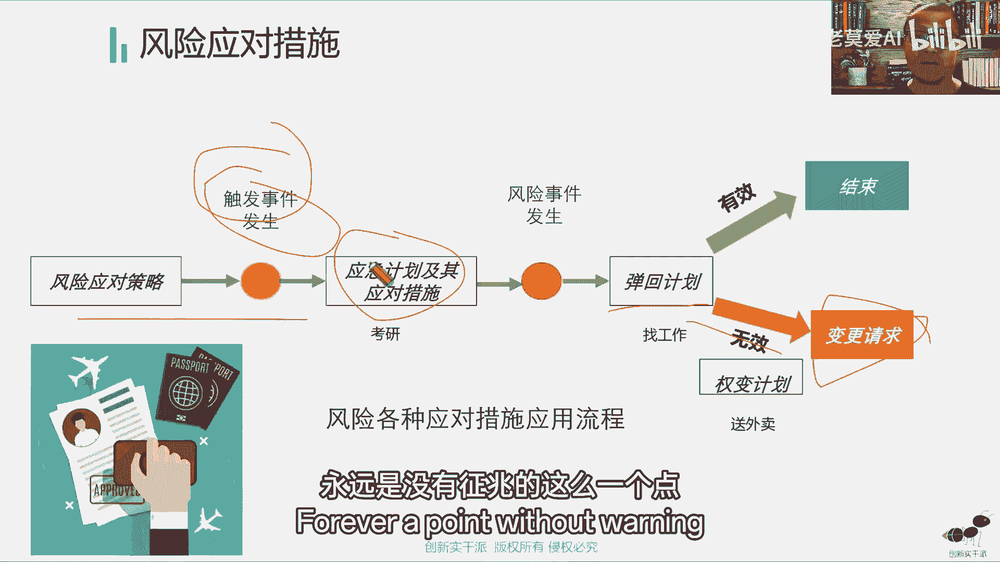

好，我们讲的两种储备是吧，已知的未知用金期储备，我们放在什么相关的什么基准里。

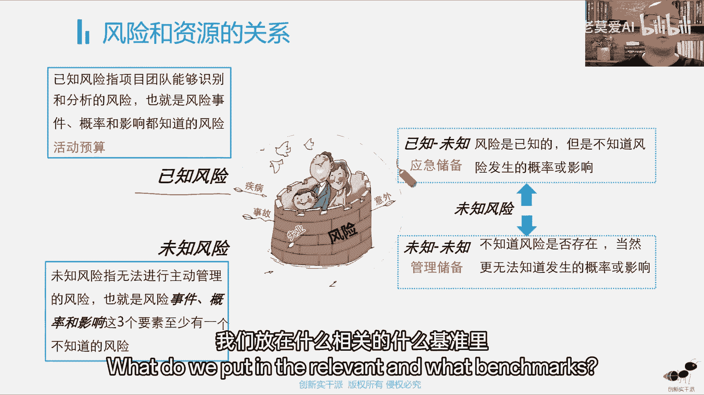

那未知的位置我们用什么用管理储位，就是不放在基础管理，放在整个项目层面进行展开的一个基本点，那这个是我们风险发生的基本监督流程，核心点其实就两个，第一个有新风险，我们按照流程走一遍，识别风险。

分析风险规划应对，如果是旧风险发生了，那我们就按照我们流程继续走，更新风险登记册呀，查查风险登记册，看风险登记册有没有相关的计划，有计划按计划走，没计划，我们看有没有全面措施，这不就核心的三几个点。

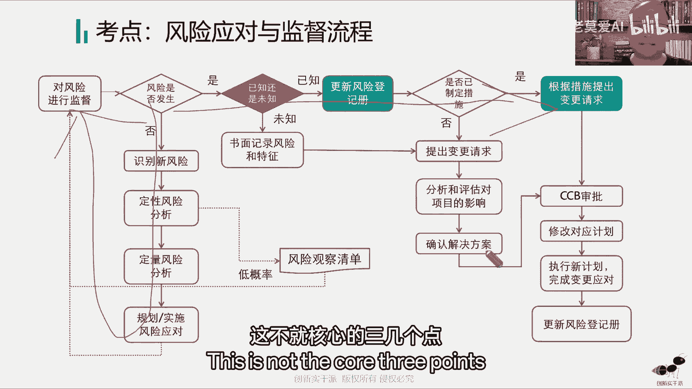

你得把它分开，就好好好，风险讲完了，我们再聊聊其他过程，再在综合聊聊其他的过程好吧，质量管理三步法规划，质量管理，质量以及控制质量好，在这里我先要讲另外两个点，第一个我们前面就讲过什么质量。

我们为什么没有基准，质量不是没有基准，是质量的基准，不是我们定的，因为它是由什么，它是由这个国家定理或者行业定的，它只有两种说法，一种要达成，一种要不达成，没有商量的余地，没有商量的余地。

有的人说我们可以商量，你可以高，那无所谓，你可以高无所谓，因为我们国家出的是什么强制，但是我们培养book可讲的什么共识的部分，不是你们家那部分独特部分，我们不说，这是第一个点，我要说的第二个点。

就是质量计划和质量管理计划，那个两个不一样的概念，就是质量管理计划，它属于什么管理类，也就是说谁来管质量，什么角色，什么职责，用什么机器怎么来管，怎么流程来管，这叫什么质量管理计划，那质量计划什么。

它就类似于我们的范围计划要达成的一个范围，那质量计划也是我们达成了一个什么质量，换句话说是什么，实际上质量计划，简单来说就是我们的什么质量标准，有的人说不对啊，我们公司制定了一个质量计划。

比如说我们的车的速度是要达到两啊，一小时一百二十一百二十公里，可是我们在装的时候，前面是180km，150km，130km，到最终只要达到120km以上，他说前面的180km也是质量标准不对。

那是你们公司内部为了管理好，最终达到120，质量二二，120 222十公里每小时速度的质量计划，你们自己做的什么，做到管理计划，做到管理的控制点，就是这样子好吧，所以管理质量的核心在这里。

我们要说另外一个点，就是我们三大审计质量，审计风险，审计和什么和采购和采购，审计质量审计风险审计和什么和采购审计，首先第一个明确一下审计都是好的，你得知道这是第一个需要明确的这点。

第二个就是什么审计不审计具体的内容，只审计你管理相关的什么管理相关的过程，也就是说为什么审计你记住这句话，就说审计可以跨公司跨项目，那你就知道了，如果他审核具体内容，他哪懂啊。

所以他只能审核具体的管理的过程，管理的流程好，最终控制质量核心点在哪里，就是控制质量的核心点，就是确保我们的东西没有先符合我们自己要求。

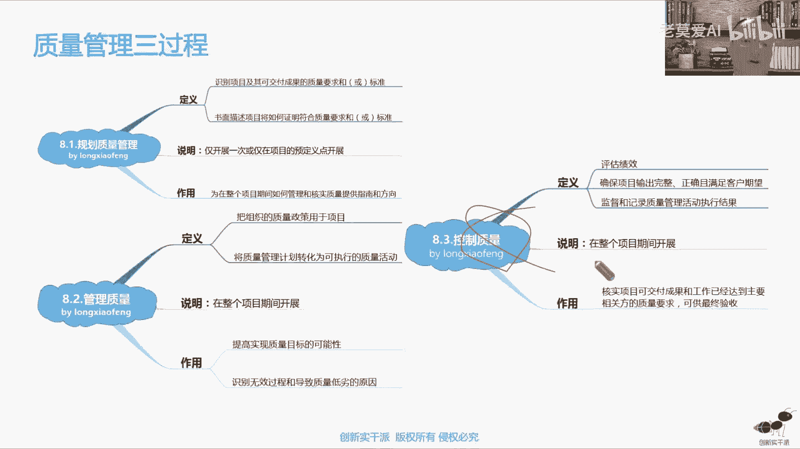

再往外流，就这个意思，好吧好，这我们再聊聊质量的基本的这几种工具，那四种质量基本成本，实际上核心是两个成本，一个叫一致性成本，一个叫非一定成本，说到一致证什么和非正什么，它是名词。

但你也可以把它作为一个什么呃量工具来用，就叫质量成本分析，其实就类似于前面那什么叫成本效益分析啊，很多公司也叫什么叫成本效益比，那你看前面的一致性成本就是为了什么，我为了做到现在的质量，我要做什么事。

做培训给他们流程就是做预防，为了做质量，看你质量到底行不行，我要测试，做破坏我我要测试这个东西，这是我们前期为了达到好的产品，我们来，但是是非议上面什么是已经出现或者会出现的，那些点反光废品。

废料也可能会出现这样一点，那你这样一些点他非预制成本使得什么意思，没有跟我们这个叫什么，满足我们质量要求的那些点，叫什么，叫非一直叫废纸，就这样的一个点好吧，所以呢我们在前期的评价的时候。

你得花时间评价怎么评价，你到底愿意在前期投钱投多一点，做好一致认成本，还是愿意当它出问题了，你在非一定成本里面再做什么再做考量，这简直就是一个什么，本来就是一个什么成本效益分析的。

那有的人特别是小公司更多，我觉你看肯定是一定成本相对什么少一点，非一定成本出现了就多一点，没出现也无所谓，为什么呢，因为你让他前期投入更大的钱，放在一定成本上，他赚了那么多钱。

你比如说你投了100万做非什么，他给你，他就给你出来什么，那几个残次品加起来才10万20万，那我投这100万干啥没有意义。

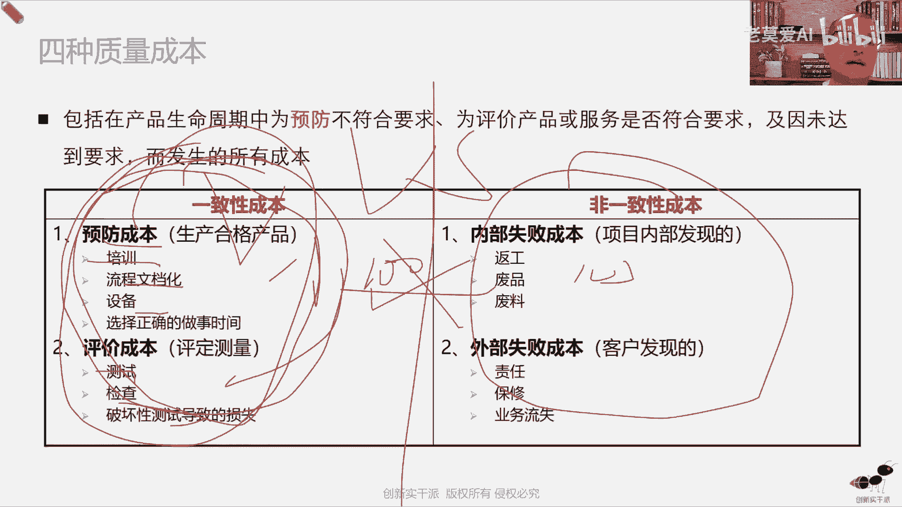

好，这里，我们来看一下团队建设的五个基本的一个阶段，形成震荡规范乘除和解散核心是什么，核心我们通过团队建设的核心，就是为了把这三个阶段相对什么压缩的短一点，因为我们的绩效是什么，我们绩效是这样的。

对不对，到震荡界里是最低的，到规范界里往上爬了，这里是最高的，那怎么样把它缩短他们的时间，那能这个样子，那这样是不是就更高一点，质量更高了。

所以我们团队建设建设什么，建设的核心就是提高个人的技能，提高团队的技能，增加团队的什么凝聚力，增加团队什么理智力，那利率好，那不可避免的，在这个过程中有相关什么有相关的冲突，我们需要解决冲突的几种策略。

最好的是什么，合作解决，这什么都考虑了，最不好的是什么，就不解决嘛，撤退回避，啥都不解决，如果说你就设置层面，本来解决我们要强迫命令，这可能是一方赢一方输，比如说按紧急的情况下，我们需要这样做。

那有人说我只看通关系怎么办，那就是妥协，那就是缓和包容，只看懂关系，我先冷静下来，我们再来考虑下一步，那关系像我那种中间的是我们讲的什么团妥协，你让一步，我让一步就能达成一个所谓的和解是吗。

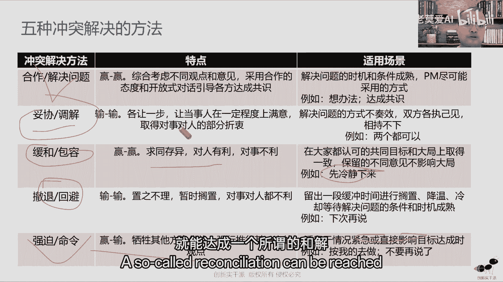

这叫妥协，好这里我们就经常讲了，在前面我们都讲过是吧，管理团队要控制资源，管理团队的核心，他虽然在9。5在执行过程，但是它属隶属于监控过程组，为什么呢，因为我们国外讲的什么人是不能被监督的。

人是不能被控制的，所以把它放在什么就在执行过程中，所以你管理团队按照监控的角度来分析就好，分析了他的核心目的是什么，监控是什么，艺术计划，艺术实际，那管理团队是什么，你按照计划不是经过建设团队的。

把这个人提成了一定的标准，管理团队又是什么，实际中你的这个人有没有达到这个标准，两个进行对比吗，如果这人不行，我再对他进行什么优化。

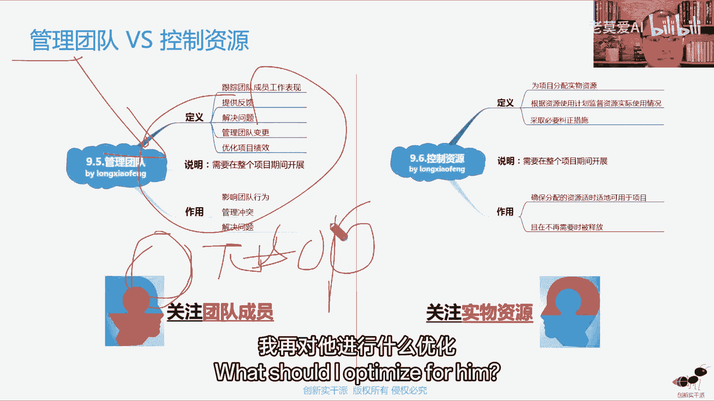

这叫什么，管理团队，管理好沟通的一个基本技术。

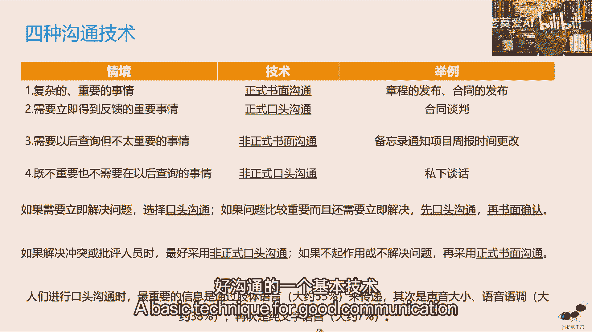

就没有什么太多需要介绍的，但是这里有三种沟通方法，我们要特别注意最好的是什么，教物质沟通，你一言我一语，它体现在哪里，注意体现了什么及时性，他现在什么及时性，有时间的什么及时性。

那推式沟通呢为什么要体现呢，推式沟通这里有个什么有邮件，那你要说你都是工作邮件，你干嘛给他关系，这也可以成为什么属于互动式沟通，但是一般的这个邮件你发出去，可能得等一会儿能回你，推式沟通只只确保推出去。

不确保它回来对我的影响，还有我们讲拉式沟通，拉式沟通更多是什么，从外界很多信息里面怎么往回拉，这是我们三种沟通的一种方法。

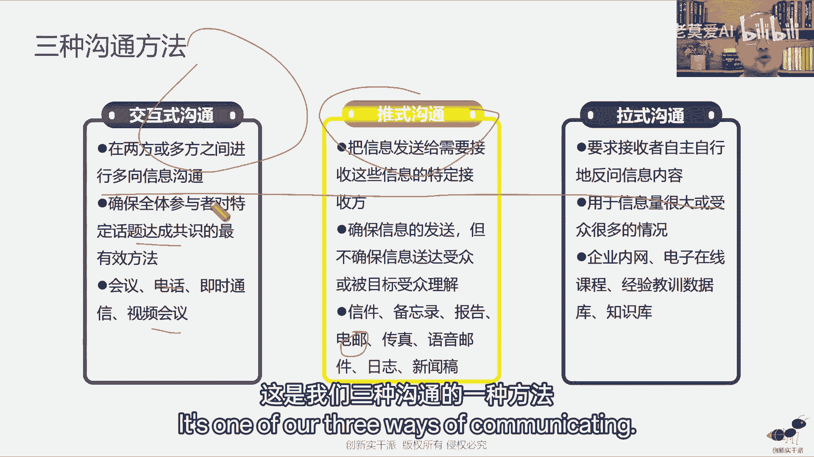

基本的分类好，我们来聊聊最后的合同，站在合同角度这里对采购就比较重要，那为什么总价类合同对我们买方来说，它的风险是最低的，因为我说这个100万，我一旦说出100万，我愿意掏。

那这就是我能承担的什么一个什么一个底线，既然我愿意套，那就说这是我能承担的一个点，无所谓了，那接下来我就不用再掏钱了嘛，所以这对我的风险是最低的，因为我们讲那这个价格是什么成本加利润。

我也不管你成本多少，也不管你利润多少，我100万就要拿我的东西就行了，所以为什么这买房的风险最低呢，他在这，那为什么卖方的风风险最高呢，因为因为钱已经固定了，钱属于什么成本加利润来的，你成本万一高了。

你的利润自然就低了，所以他的风险比较高，那么我们为什么讲成本类合同，为什么对卖方的风险最低，对买方的风险高呢，成本来合同是成本加利润，成本透明，我只赚利润，所以为什么对卖方来说，它的利润它的风险最低的。

因为成本透明，成本实报实销，我是绝对不会存在坤这个点，那我怎么办，只是利润赚的多赚的少了，只是利润赚的多赚的少，那为什么你买方是最高的，因为成本透明之后，他花多少钱成本你都得掏，不像刚才那100万。

他甚至可能会多出这个100万甚至200万，是这样的一个基本点，考试的时候如果把这个搞不定，你就把那两个相互换一下就好。

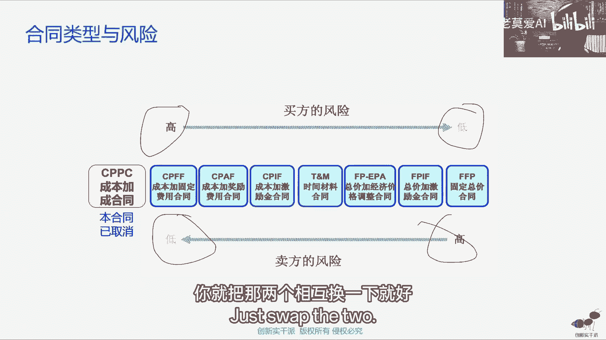

把两个换一下好，那关于这计算题，反正现在是越来越少了，但是我们都讲了，关键路径，要用时间三点估算，你得知道六十八九十五九十九经验值这一块，我刚才说了，这个核心点就是偏差啊啊偏差。

还政治管理也是还有沟通的渠道的计算方法，全渠道预测货币价值，还资质外购分析，这些基本点倒没有什么呃。

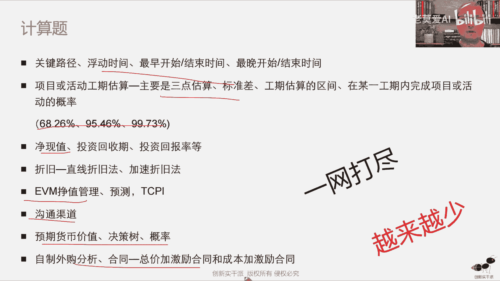

特别好，那讲到这里呢，我们今天晚上给大家讲的就完了，那好讲到这里，我们给大家讲的这个四字串讲也到此，就正式给大家就讲结束了，那我们前面三次重点就把它分开来讲，今天这一次主要把中间的每一个点的。

一些基本的点给大家拿起来串一下一些重点，等下再再说一下，强调一下就好好，那接下来仍旧像我说的，在掌握基础之后，你接下来要通过大量的习题的练习，把这个基础如何转成习题，就如何适应考试的思维和模式。

这个对我们来讲是重中之重的事情，这个对我们俩是重中之重，所以在这一块你一定把基础掌握，接下敏捷掌握之后，怎么样通过习题不断的进行练习练习，拿到他的一个点好吧，那好。

那因为接下来的呃串讲课程又是其他老师在带，我，就没有讲这块课程了，那那接下来我就提前预祝各位，在8月31号的考试，我们能够的顺利的通过，好吧，那谢谢大家，我们不见啊，下次不见，好吧好，谢谢大家。

那今天晚上就到这里好，那我再等一分钟，如果有其他问题，我们及时在互动，就给我打出来沟通一下，好吧好，那谢谢各位好，已经识别到一个相关方，目前是解决态度，希望相关方变成知识性，但是具体要怎么做。

首先首先我们来讲，我们从两个点来答复，你，就说你问的这个问题是一个实际的问题，第一个按照我们的计划里面，你先把这个计划里面，在你的感型人参与计划里面，你可以把他的态度做成目前识别，目前态度非体制性。

接下来就是什么，接下来变成什么期望它变成D变成知识性，这是我刚刚讲的，这是第一个从我们学习的角度，第二个为什么说有说你问的这个是这个叫什么，这实际的问题，其实站在我的角度不太好给你回答这个问题。

那我来举个例子来告诉你，我之前是怎么做的，我之前最早在公司里上班的时候呢，这个样子，因为那个时候刚去的时候出现一种什么状况，我刚开始带研发工艺的时候呢，我们要跟生产打交道。

可是生产那些家伙很多人都是什么，有学历都不太高，学历不太高之后呢，我们在现场去测公室去排60步先，他们虽然说领导打过招呼，但是他们叫配合，他们叫不叫支持是吧，他们叫配合，不要支持我们测一个工时。

因为按照工时到时候会排列相关的人，他们就很抵制，他们跑到现场去在那磨给你，他就找一个人找，找找一个员工，或者找个新员工，让你测工时正常出来，员工测一个公式，测做个产品，比如说十秒他要找一个新员工。

测一个公式，可可能就20秒，30秒，那你怎么弄呢，这是一种典型的一种抵制，那我会怎么做呢，其实那个时候我老大交给我了嘛，你没事了，你就反正你就看着办，人家你也是新人，被人家欺负也正常，那怎么办。

你请人家多吃两顿饭吗，有时候没事跟他多交往一下，多聊一下，你混个脸熟，反正大家又不好舍你的面子，我就这样做了，反正还OK，所以你问的这个问题是一个具体的问题，我没办法从这个点上。

给你一个具体的一个参考跟辅导，因为我不了解你，你提出这个问题的一个什么背景，只是就这个问题而论这个问题，那你就知道为什么p m book里面并没有讲这一块，因为他并没有把这个东西没办法说清楚。

就这个样子好吧，所以这样吧，所以从实际角度，没办法来给你一个具体的一个答复好吧，不好意思，还有没有其他问题，如果没有其他问题，我们就撤了啊，好谢谢，好好好，谢谢大家，咱们不见，咱们在考试来讲就不见好吧。

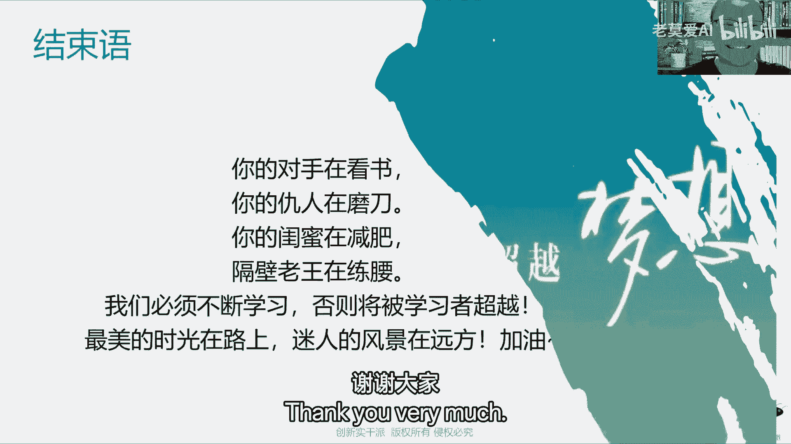