# 【最好的PMP课程】PMBOK7精华讲解1-2 - P1 - 老莫爱AI - BV1ar421K7pq

敏捷术的东西都是它的延伸，什么，三种角色，敏捷里面他会有划分，天然的划分了三种角色，一个叫产品负责人，一个叫敏捷教练，一个叫团队，OK那么三种弓箭，第一个是产品产品代办列表，弓箭其实是什么。

弓箭也是不产生价值的东西，我们有些书上也称为组件，组件不产生价值，第一个是产品代办列表，产品待办列表是什么，就像用户提出需求，比如说用户提了100个需求，那那你100个需求都可以放进来。

都放进这个需求池里面，那我不排我，我没说100个需求，我一个月做完，我只是说你把所有的需求，你排的需求我都丢过来，慢慢的去实现，先实现哪些，后实现哪些，这这个是跟价值相关的，那这个这个按表不说。

先把它按下来，spring代办列表，spring是什么意思，spring其实就是什么一次迭代迭代，比如说我两周发一个版本，或者是说我两周一个迭代，这个可以，其实发版和迭代，你可以在发榜的时候迭代一次。

也可以发榜的时候迭代两次，比如说有些公司它是一个月发一次版本，但是它每两周他都迭代一次，也就是说它迭代第二次的时候他发版啊，第一次的时候是迭代完成，这个工作完成以后内部验收，第二次再发是这样的。

所以迭代跟发版还是有一些不一样的，但是有一些公司啊，他就做的比较激进，就我每迭代一次我就要发榜一次，我每一个每半个月我迭代一次，迭代完之后我就发出去，迭代完之后我就发出去，有什么新增功能。

我就发新增功能，我就发去这样的去做，所以spring它是一次迭代，不是一次发榜，这个迭代和发版的我们要清楚，那么增量是什么，增量其实在互联网里面最容易被理解的，就是像微信，微信每发一次版本。

它是在以前的这个功能的基础上，去增加一些小的功能，这个叫增量，所以增量是结果，代办列表和这个spring代办列表和产品代办列表，都不是结果，那么spring代办列表到底怎么理解呢。

它其实是产品代办列表的子集，我们前面说了100个需求扔过来，我们这两个迭代我就只做五个需求，对不对，这两周我就只做五个需求，那么这五个需求就放到了spring代码列表当中。

这个spring demo列表就是五个需求，所以它是它的子集，这五个需求做完之后它产生的，比如说以前是1。0版本，这五个功能做完之后发布了这个是一点一版本，这一点一版本包含的这五个功能就叫做增量。

那么一点一跟1。0有啥区别，就是多了五个功能，就这样理解就OK了，那五种仪式其实就是五种会议，第一个是冲刺计划会议，就相当于我们以前古老师说的，第六版的就是计划会议，我们项目计划会议其实就放到敏捷里面。

就叫做冲刺计划会议，敏捷里面多了一个什么叫做每日账目会议，就是每天过来同步进展的，这个在传统项目管理里面是没有的，然后第三个是冲刺评审会议是什么，会议当然是我们的每一次我们需要怎么样，我们需要的结果。

就是我们每一次不是产生一个结果吗，我们对结果进行验收的这个会议叫做冲刺，评审会议，冲刺回顾会议是什么，回顾会议也叫关门会议，关门会议他关注的不是结果，而是过程，我们这一次产生了五个功能。

这五个功能在做的时候出现了哪些问题，有哪些不和谐的地方，我们下次要改进的这五个功能，在做的过程当中有什么做得比较好的，下次我们还能再借鉴的啊，都是在这里冲刺回顾会议里面。

最后就是代办书向梳理会议它是什么，它就是怎么样，每一次需求过来，我们要在需求重新去澄清，重新去排序，这样的过程就叫做待办事项梳理过程，所以代办事项梳理会议，他是用来敏捷里面去处理变更用的。

大家记住这个概念就好了，我种价值观是不怎么考的，开放专注，勇气，尊重承诺，它其实就相当于中国人有一句话叫做，对事不对人，一句话就概括了这五种价值观。

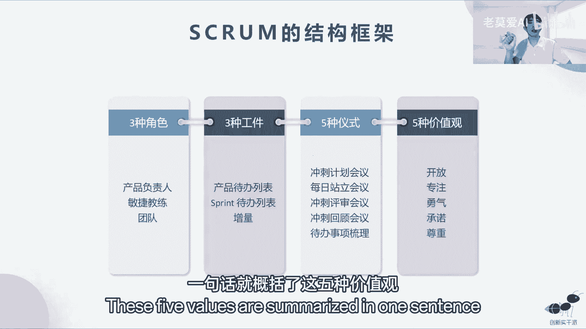

OK好，那我们往下走，三种弓箭我们已经讲的很清楚了。

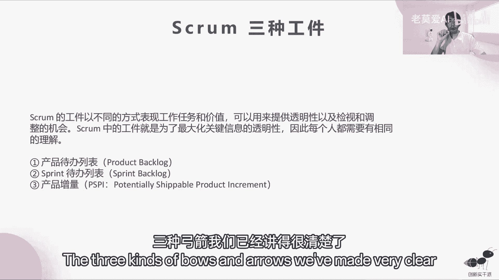

五种仪式也已经讲了，可这个里面就会我们前面讲的几个专家，他带来了自己的一些方法，什么DSDM啊，这些方法其实不考，大致了解一下就可以了，DSDM这个方法怎么master。

dude d s d m里面有一种叫做莫斯科技术，有时候有考过莫斯科技术，它就是P0P1P1P2P3P4，其实我们在工作当中，经常会用我们的这个优先级是吧，事情的优先级。

我们的任务排序P1P1P1P2P3P4，其实就是莫斯科方法，那莫斯科方法来自于哪里。

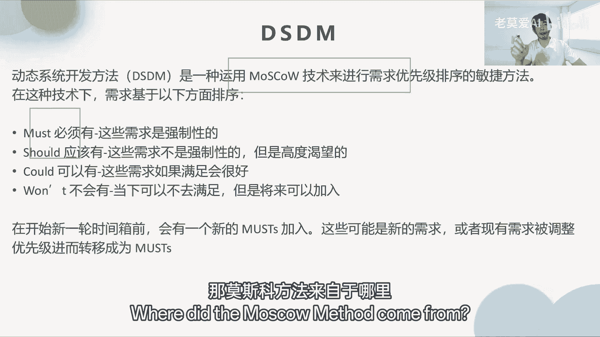

就是DSDM技术动态开发方法里面，水星方法现在不止不考了，所以大家到时候你看一下PPT，稍微看一下，研究一下就好了，这个已经不考了，特性驱动开发，这个也不考了，叫做FDDFDD。

就相当于我们刚开始我们在建楼的时候，我们是要把整个设计图我们都要考虑清楚的，但是建的过程当中，我们可以采用敏捷的方法迭代的方法，比如说我一层楼的建，建好一层楼，让大家去看样板间，大家觉得这个样板间可以。

我再建第二层楼，再看再验收，再建第三层楼是这样的，在设计的时候，我们是采用的这个它其实是一半的敏捷方法，一半的传统的项目管理方法，在设计的时候是用传统项目管理方法去设计，在实现的时候它是用敏捷方法。

就相当于一个杂烩的一个东西。

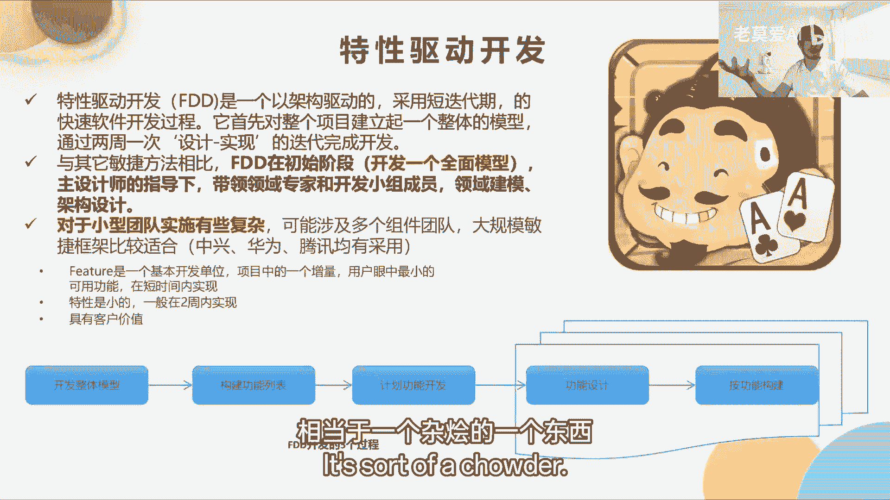

在这里面自适应的方法开发方法，你记住这个人叫吉姆史密斯，吉姆史密斯在敏捷里面是泰山北斗式的人物，他很厉害，他带着一些这种方法过来就可以了啊。

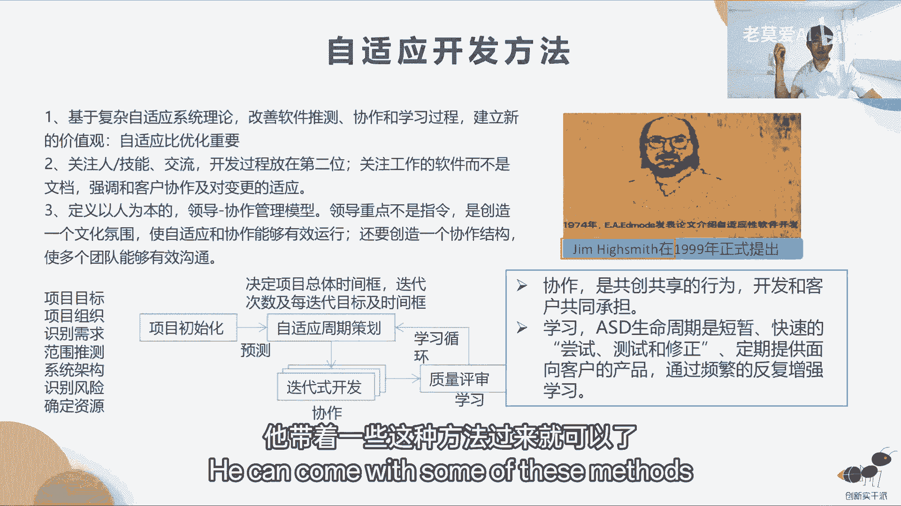

这个东西不会考，不记也没关系，聚集成是一种敏捷的落地的一个工程实践，它其实是关于代码的集成的东西，集成我以前在腾讯的时候，就主要是做主机集，做了一段时间的持续集成的项目经理，我们做什么事情。

我们就是把游戏，我们因为当时在做游戏嘛，我们就把腾讯的所有的游戏开发，我们都有一个代码库去管理起来，所有游戏工作室提供的这个代码，我们都会给它自动编译，自动打包，然后自动部署，自动发布。

每一个工作室他发布的这个游戏，它都能够只要你代码提交，你当天你就能够提交完之后，大概花个一两个小时之后，你就能够看到你的游戏改变改动了哪些地方，新增了哪些功能，它每天都可以看得到。

而且我们会自动打包成手机版本发给他，然后打包的时候，我们也会告诉他他的那个代码在哪个地方，他写的有问题，哪些地方是需要更多的改进的代码，能不能通过这些东西，我们都会提示他这个大的工程叫做持续集成。

OK好。

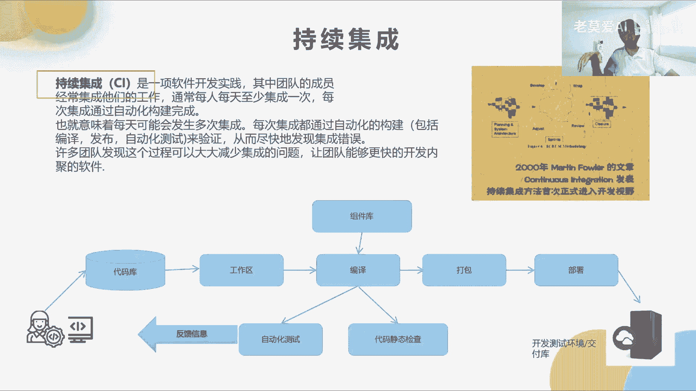

接下来就是生命周期选择，生命周期选择这个东西。

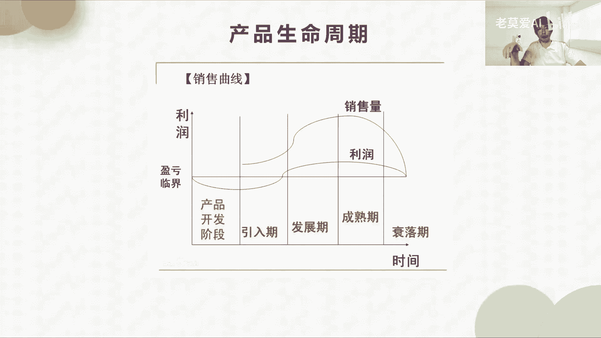

我们要考的是，这前两个东西都是以前的第六版的东西，大家看一下就好了啊，我在这里就不赘述了，第六版的项目生命周期启动规划，执行监控收尾，他的项目周期和一些相互作用的程度，大家都有所了解了。

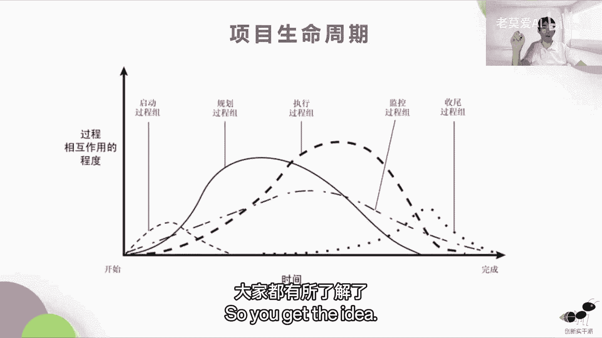

我就不讲了，在敏捷这里面的，我们要分清楚四个生命周期的选择，一种是预测型，预测型是传统的，就是以前古老师讲的部分迭代型，增量型和敏捷型，这个是我们新学的好，我们来看预测型。

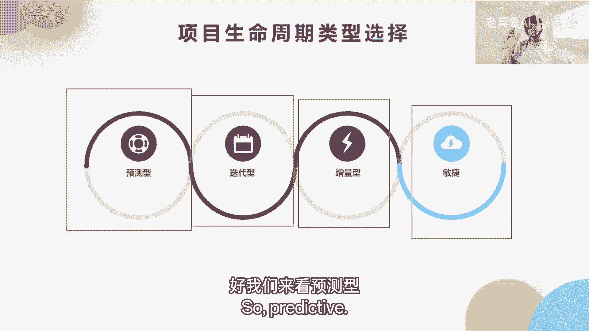

其实就是整体建房子，对不对，他的预测型，比如说先分析有什么需求，在设计这个房子，在构建完了之后，房子再做各种测试。

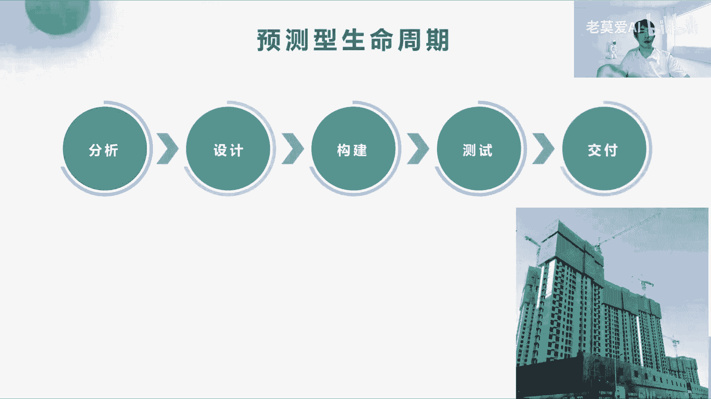

漏水测试，老化测试，这种做完以后再交付，这这个是预序预测型，所以预测型它是比较适合的场景，是合同型的项目，就是甲方和乙方去签合同，乙方只要满足甲方的需求，按部就班的做，做完以后甲方在最后去验收就好了。

这个是合同制的项目。

迭代型跟预测不一样，迭代它是需要在中间不断的去反馈，用户反馈的结果的，比如说分析分析设计完之后，乙方给甲方一个圆形，再去改善改善，然后给他一个原型以后，他提出一些意见，你再去改，改完以后他觉得没问题了。

然后你再进行下一步，比如说构建测试以后，他又提出一些问题，你又改啊，所以最后交付这个是迭代型的生命周期好。

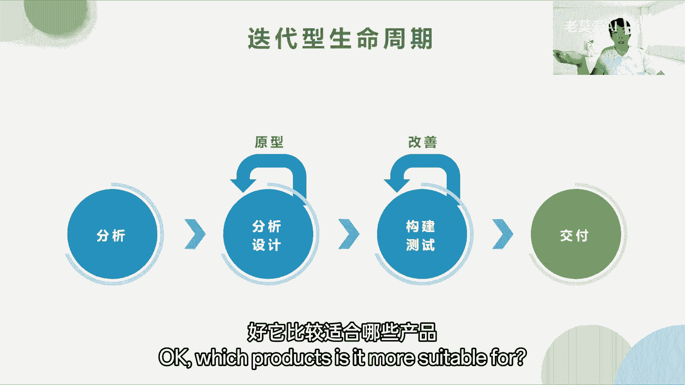

它比较适合哪些场景，适合运维型的产品，比如说你看这个产品已经见到用户了，在互联网的很多产品，它都属于这种迭代型产品，用户他又不断听取用户的说法，用户的不断去需求，提需求以后，他就改动，在不断的去上街。

不断去完善，它属于这种变增量型，增量型跟迭代的区别，很多人搞不懂增量型跟迭代最大区别是什么，迭代它是以时间为单位的交付，比如说我一个月我要更新一次版本，但是更新一次版本，我可能这个月啊我这个版本比较大。

我这个月更新的这个版本，这个功能比较大，我只更新了五个功能，那么下一个月我还是这个时间点，我输出版本，那么这个版本可能每一个功能点比较小，我就有十个小的功能点上线，这个就是迭代，增量是什么。

增量是我的工作，它是以范围为优先的，比如说我这个月我做，我有我这个月我接到了五个需求，那么我就尽量把这个五个需求做完，那做完好，下一个月我接到了十个需求，但是我一个月做不完。

但是我这十个功能需求我一定要做完，所以它的时间是不固定的，你你可以了理解为增量型，它其实跟传统的这种项目管理就很像了，传统的项目管理很像，但是它跟传统的项目管理不像的，又是哪些东西呢。

不像的是传统的项目管理基本上是一次性的，就像甲方和乙方签一个合同，你把他事情完成，这个合同就已经结束了，对不对，它增量型不是增量型，它它是一个长期的项目，它是一个产品，你在在上面，比如说今天我做1。

0版本，明天甲方又给你一个东西，你2。0版本，3。0版本，这个版本频繁度又会比较高，他以这种方式去跟你签合同，短平快的方式去跟你签合的，所以这个叫做增量型的产品，OK那么这是增量型产品的。

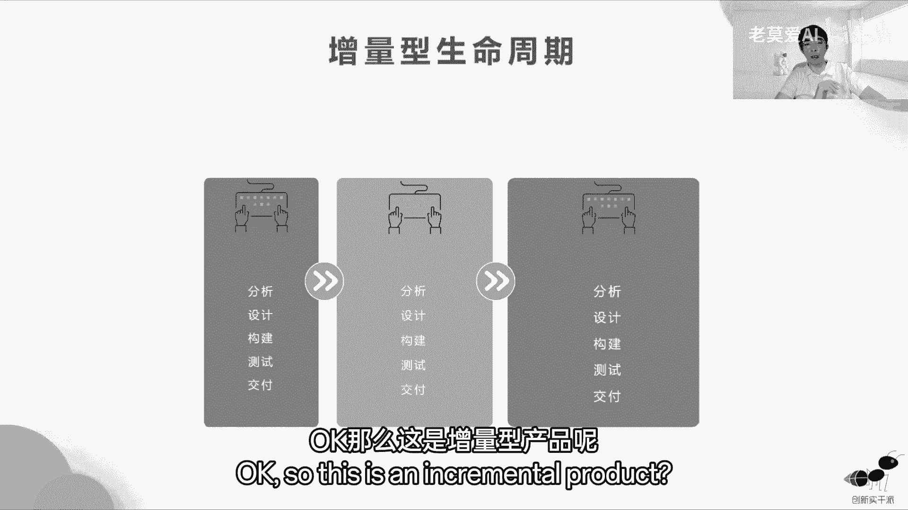

它比较适合什么，如果你在互联网行业，你很适合从0~1去打造产品，因为你想从0~1再去打造产品，最重要的是什么，比如说你要去做一个电商网站，你最重要的你是要把购物和支付流程打通，对不对，但是你做电商网站。

做支付和你的购物和支付这个东西打通，你之前没有这样的经验，或者是说你有经验，那你能估一个很准确的时间吗，不行那每次都会有不一样的需求，你不可能规定说我一定半个月能给你做出来，有时候半个月多一点点。

有时候半个月又少一点点对吧，所以这个时间是不固定的，所以他比较适合从0~1去打造产品好，那我们现在就看到了啊，我们现在这个场景就是这样的，一般我们在进行互联网产品构建的时候，我们在做从0~1。

那肯定有一个过程，这个东西从0~1，我们一般会使用增量的生命周期，那么这个东西一旦从0~11点，零版本发布以后，他就面向客户了，那这个时候我们就开始从开发转向运营的过程，那么从开发的转线运营的过程。

这个过程我们使用什么，一般会使用迭代的东西，因为客户他会提出各种各样的意见，你要加入到里面，本身版本又需要有一些新的功能，我们也会加入这个版本里面，后面就会使用迭代，所以刚开始我们会在互联网里面。

通常用的比较多的是，刚开始是用增量型。

后面用迭代型是这样的，那敏捷型是什么，敏捷型其实就是增量型，加了迭代，它其实是增量和迭代的什么结合体。

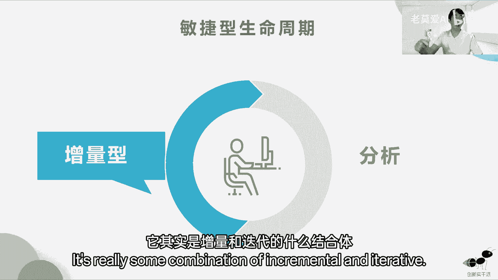

你可以这样理解结合体，所以它四种方法它都有自己的场景，都有自己的场景，我们可以解释一下，比如说预测型，一个公司接到客户5万元的订单，做一个小程序，这个小程序做出来，我交给你了，这个就没事了。

这个就叫预测型，那么增量型是什么，就是我们要从0~1打造一块app是吧，迭代型app已经上线了，我们需要持续的去反馈，接到用户的需求，我们去迭代和反馈，这个是迭代型，敏捷型是什么，创新型的产品。

比如说我要做一款AI的东西，但是这个AI的东西整个市场上都没有竞品，但是我也需要去快速上线，那我们就反复的去试错，一开始我从0~1的时候，在0。1，0。2，0。3还不成熟的时候。

我们就已经把这个项目不断的丢给客户，让客户去反馈，刚开始的可能是我们找到第一批用户，我们免费给他给他去使用，他去反馈，然后我们再去不断的完善完善，完善完善完善到1。0，我们觉得OK这个版本已经很成熟了。

可以为大部分用户给去使用了，我们才会从敏捷再转向怎么迭代性。

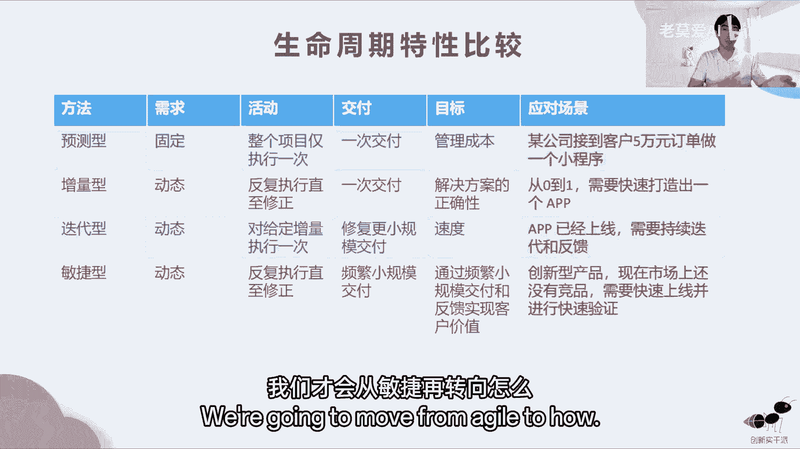

OK好，那基于迭代的敏捷和基于流程的敏捷，这个其实是在敏写实践指南那本书里面有的啊，为什么一定要提一下，因为这本书题啊，但是考试很少考这个东西啊，基于流程的敏捷，基于迭代的敏捷，它是什么。

它是我们现在考试要讲的敏捷，基于流程的敏捷，是一般的实践当中我们会遇到的敏捷，我们想敏捷其实是属于什么乌托邦时代，就我们假想出来一个完美的世界啊，敏捷的终点就是这样的。

那么基于流程的敏捷是我们的现实主义，那我们生产力还不是很发达，那我们团队磨合还不是很好的时候，那么团队的自动化工具也不是很好的时候，这个时候我们要去做敏捷，我们两周你说郭老师啊，我两周发一个版本。

我确实很难，那没关系，你可以延长两周多一点或者两周少一点，这个对时间没有压能那么严格，这个叫基于流程的敏捷，是这个时候这个东西敏捷适用的筛选器。

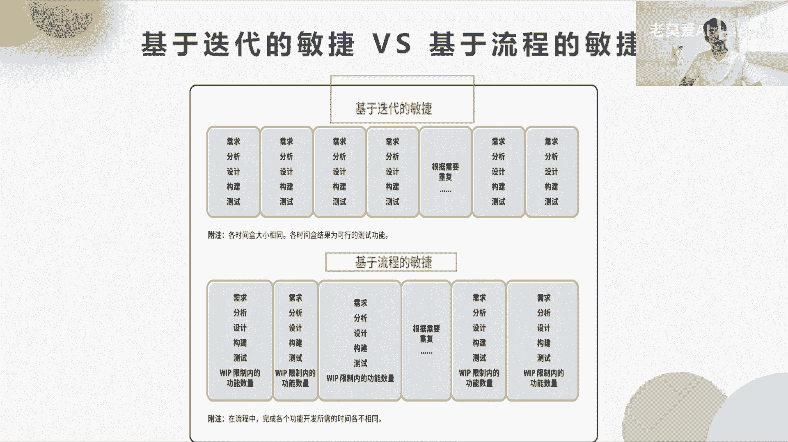

这个不会考，但是大家可以用这个东西来测试一下。

自己的敏捷的团队和自己的团队，适不适合做敏捷。

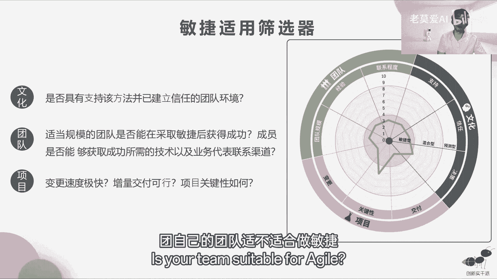

分别从文化团队和项目这三个维度去开始输出，这个会有一些问题去问大家，大家可以如果有有兴趣可以去扫码，就比如说你请问你的项目，二级团队的负责人或者更高领导，是否了解并支持在项目中使用敏捷方法。

12345不太支持，完全不符支持，分数越低就代表你越适应做民解，分数越高是代表你越不适应做敏捷啊，27分以下，如果你得分最后九个问题在27分以下的话，那么你是比较适合做敏捷，27分以上是不太适合做敏捷。

你的团队不太适合做敏捷，或者你的公司的实际情况不允许你转敏捷好。

我们在想敏捷是不是能够解决一些问题，不一定，所以我们就会引入一个叫混合型。

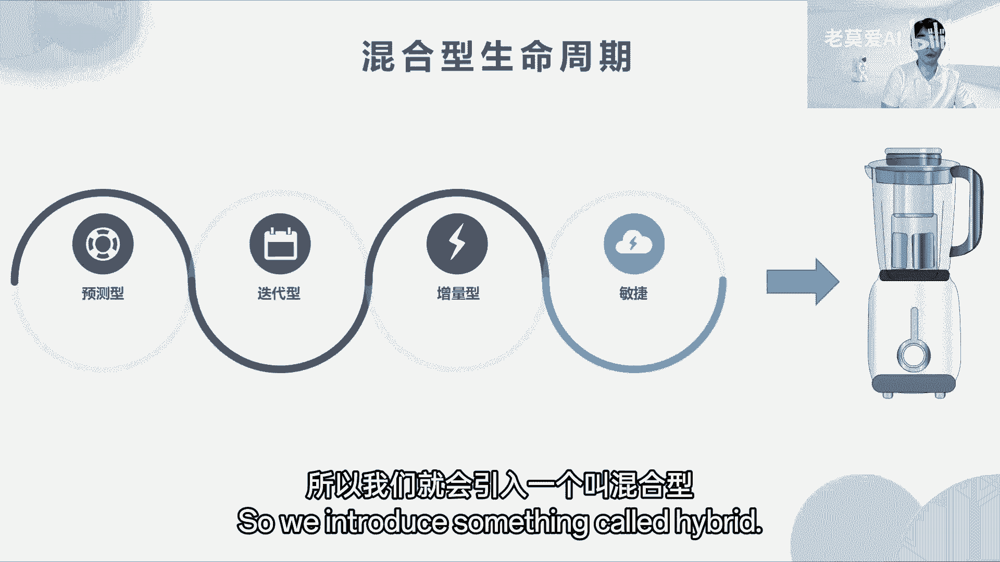

混合型的生命周期，就会有几种敏捷开发预测发布，就像我们传统的，比如说我们制药企业通常会使用的，这样一种方式，比如说我们在制药的时候，他肯定是有一个研发新药研发的过程。

那么整个新药研发的过程是不断试错的过程，可能当初会当中会产生很多的错误，他们会用动物做实验，这种对吧，做失败了，这个动物没有成功，就换一个动物，换一只小白鼠去试验，所以这个整个过程它是属于敏捷型的。

都不断试错的，但是一旦这个药物试验成功获得批准，又进入临床了，临临床又完了进入量产了，那这个时候就是开始预测了预测法预测型的，因为这个时候就是批量生产设计，生产设计生产就不断的去做这个事情了。

所以这个时候就是敏捷加预加预测，先敏捷再预测。

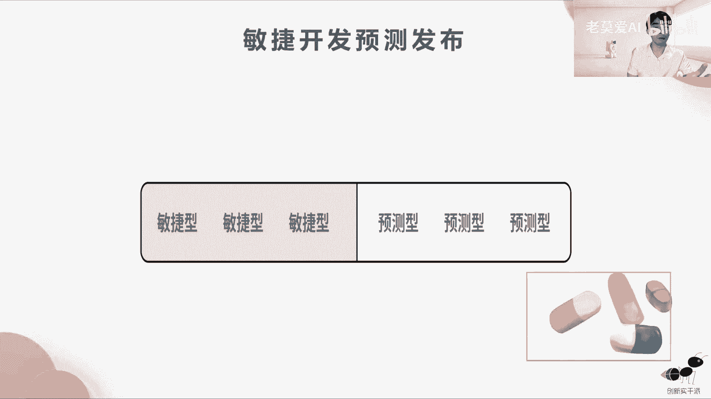

第二种是预测为主，敏捷为辅，这种东西，敏捷为辅是什么东西，刚开始的时候我们一直是预测模型的，比如说我和我的祖国里面，一直到升旗的前夕，他才发现电动升旗杆可能会有问题，那个时候已经分了。

他就做了一个二比一的模型，那个二比一的模型是不断的去调试，内升级的装置的，不断去试错的，所以部分它就是采用的敏捷型，它只有一个小小的装置，需要不断的去调试。

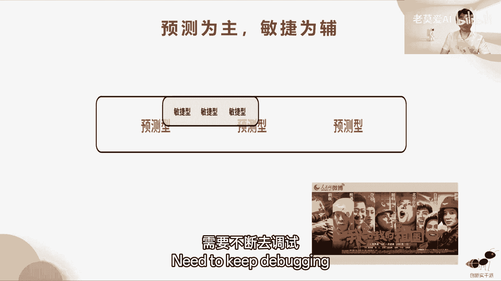

不断试错，那大致他前面设计好了，还是预测型，OKOK第三个是敏捷为主。

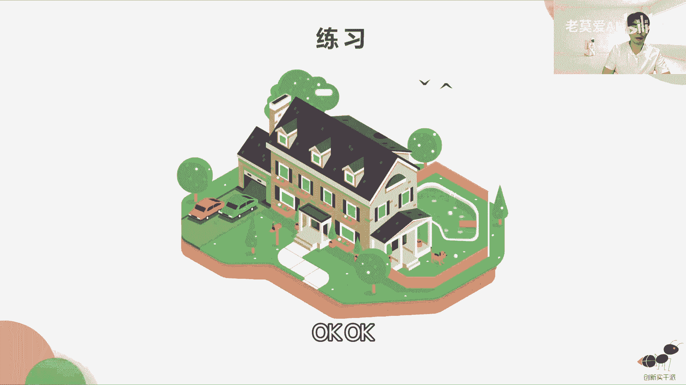

预测为辅，敏捷为主，预测为辅，一般的场景是适用于什么，预测为辅，一般是指比如说我们配电脑对吧，你一般去电脑城配电脑，大家都会问你，你电脑你打算怎么用啊，对不对，你有什么用途啊，你打算配多少钱的啊。

用完之后他会给你去不断的去装配，比如说那打游戏的，他就会可以配一台配置比较高的，那当然你付出的钱要比较高，或者你做AI的这个东西，他就会做的比较高，这些东西它其实是什么，根据你的需求来定制。

比如说那我就办公，那我不需要那么高配置，那么他就会给你配置搞低一点，符合你的需求，然后再不断的去迎合你的需求，这整个过程是属于敏捷型的，但预测型又是什么，这些零件，比如说I3I5I七这种处理器。

它是英特尔已经生产好的，它的生产是由预测决定的，它在生产的时候，这些处理器没有说它是用于办公的，还是由于我游戏的，他只是说它性能有区别，每年都会挤牙膏的去挤一点性能提升，那你买了之后。

他就会怎么样不断的去组装成一台游戏的，或者是办公的，所以主要还是以敏捷为主，去迎合你的需求，它里面的零件都是预测的可好。

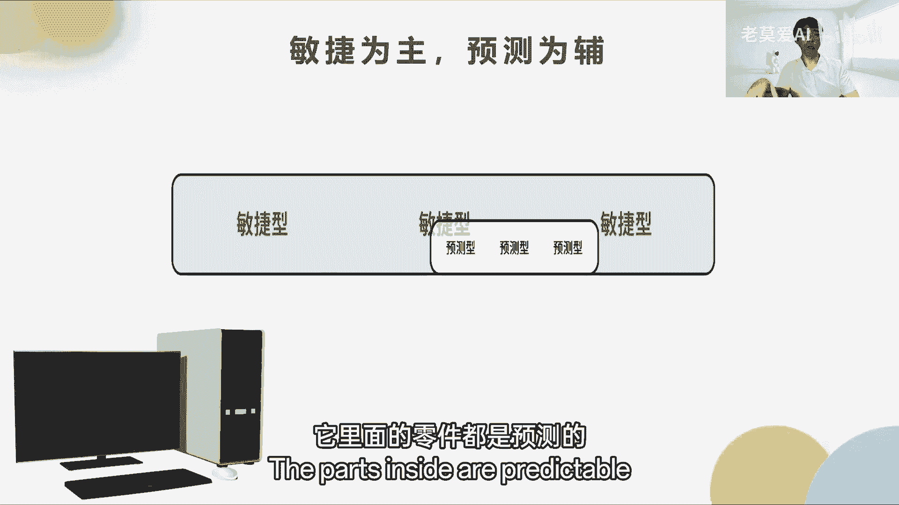

那么混合型的方法，指的是混合了敏捷的一些实践，只要混合了敏捷的一些实践，我们就称为混合敏捷的方法，比如说需求稳定或者偶发型，你混合了一些时间和的概念，你也就变成了一个混合型敏捷，混合型的敏捷。

在整个敏捷的考试里面占了很大的比重，大概占了三四十%的比重，会出混合型的，比如说他说一个团队是生产手机的，你只要看到关键字生产手机的，或者是说它生产软硬结合的项目的，比如说智能手机，智能手表。

还有智能设备啊，什么东西，你一看这个关键字，你就选这个团队一定是使用混合型的，因为手机大家看到的这个手机，它分为软件和硬件，硬件就是我们现在是拿在手上摸得到的东西，叫硬件部分，软件部分就打开很多app。

这个是软件部分，那么APP这个东西它是一定是用敏捷开发的，但硬件这个部分拿在手上看得到的东西，这个一定是用传统的项目管理开发的，为什么，因为传统的项目管理它是不可逆的过程，它要讲究它的质量啊。

你你做出一款手机，你总不可能说我做出一台手机，我前面没做太多设置，就批量生产出现问题了，我在房产手机的房产，它的整个的代价是很大的，而且会引起很大的市场波动，说不定你下一批手机都没办法卖了。

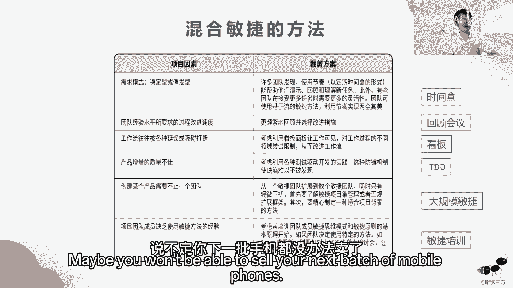