# 【最好的PMP课程】PMBOK7精华讲解2-1 - P1 - 老莫爱AI - BV1m4421Z7Nh

那我们今天就差不多了，但是在开始之前，我还是想跟大家说一件事情，我我们发给大家的邮件的，这链接的东西其实是还有很多价值的，我给大家看一下，我们给大家发的这个链接的东西。

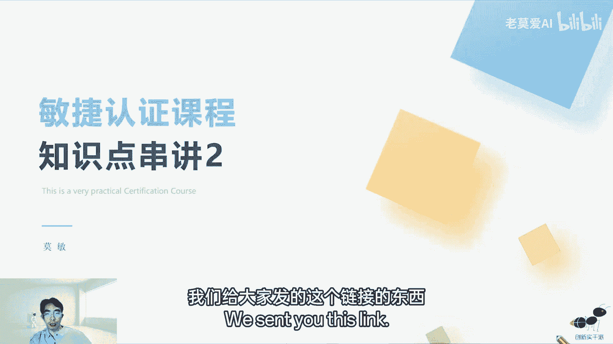

我先切换一下屏幕共享，我会发给大家一个这个东西，其实你们可以多看一下，你们银行PMP的学习资料包，没有的同学可以向我索取，我在这里面还是想跟大家去聊一下这个事情，可以发到这个群里面。

大家可以看到这个地址打开一个什么东西呢，就是PMP的学习资料包，这个资料包，其实是对大家来说是非常有用的东西，特别是我们现在7月份啊，一直到8月份备考的时候，他有个PMP的文件夹。

PMP的文件夹也里面最有用的那一段，我认为是考前冲刺材料，上一周周末的时候，我把这个PMP情景题，40个套路已经发给大家了，这个里面的很多东西是必考的，你看到这个东西想到了什么。

这个东西它一定会帮助你提分的这些东西，这些东西，所以大家可以把这个40个套路要看清楚。

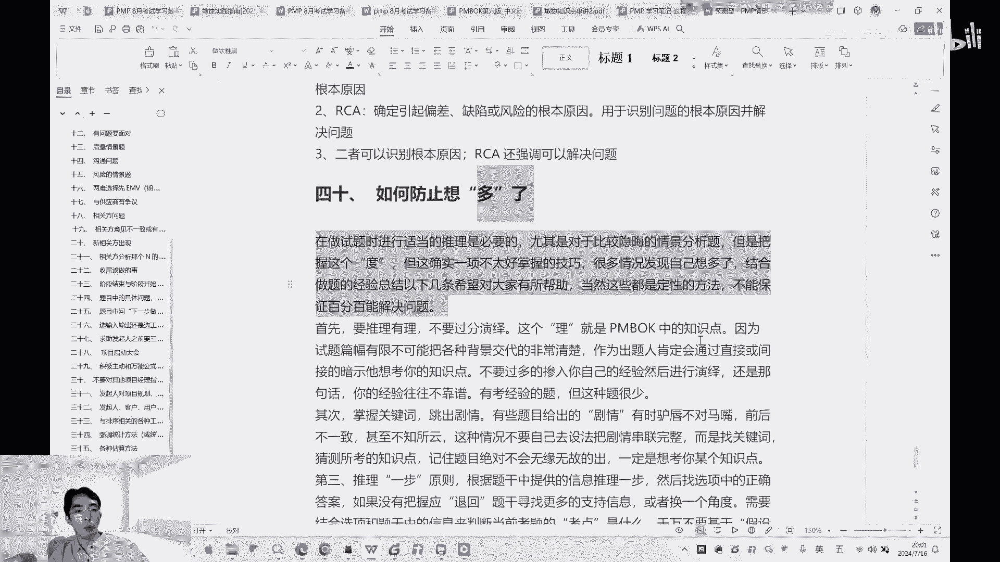

这是第一个我布置下去的作业，第一个大家一定要看的必看的，还有就是适适应型的这样一个，PMP的解题思路，这个是要看的啊，前面那个是关于PMP的预测型的预测型，看完以后看一下适应性的，这两个文件是必看的。

我认为这个是帮助你提分的东西，这里面就会有关于敏捷的一些内容，解题步骤，脑海中要构建什么样的情景，分析题目所在的时机和问谁，SM的做法态度，什么东西，流行翻译的坑，关于选项的一些关键字。

哪些关键字是对的，是错的，这些东西其实这个东西内容也不多，才11页是吧，11页，但是这个11页，其实就是能够让大家去快速提分的一个东西，大家不要去忘记了这些东西了，所以这个东西我让大家看的。

大家一定要看，能够至少把你提个十分左右，我觉得是OK的，那这两个文件是大家一定要看的，一个是适应型，一个是预测型，这些东西其实学习笔记这个东西，你其实可看可不看是吧，做题总结是我们在做完题之后。

给大家做了一个归纳，这个东西其实你有时间就看，没时间就不看，这个没关系，还有考试过关的这个口诀，其实我我觉得大家如果要看的，可能也记不下这么多。

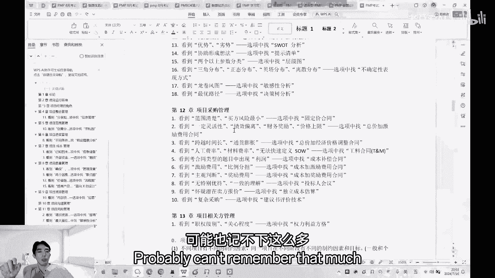

所以这个不是必看选项这个口诀，但是如果你有时间，或者是说说你现在水平已经比较高了，你可以看这个东西去巩固一下，这个是可以的，这个口诀是可以的，图形化的总结的这个东西其实是对于大家来说。

如果你对某一个概念不清楚，那你可以看一下图形总结，比如说采购流程，你对采购流程看不清楚，收尾流程你不太清楚，就这些东西你看一下图形总结，会让你脑袋中有一个这样的框架，也就是说在接下来的这个做题当中。

如果你发现了一些概念性的东西，你不清楚的，你首先看这个图形总结，比你看书会好记忆很多，因为书上的东西它都是抽象过的，它没有那么多形象的记忆的东西，所以你首先看这个，如果这个里面搜索不到，你再去看书。

但这个里面的内容不多，每一页也就一张纸，总共也就35页，就相当于只有35个，这样的内容在这里也不多。

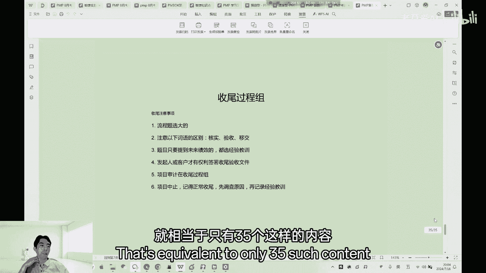

所以我建议这三个文件是大家都要看的，就这个图形化总结适应型的这个pp思路，还有pp情景40个套路，这三个文件是我们考前冲刺材料里面必看的。

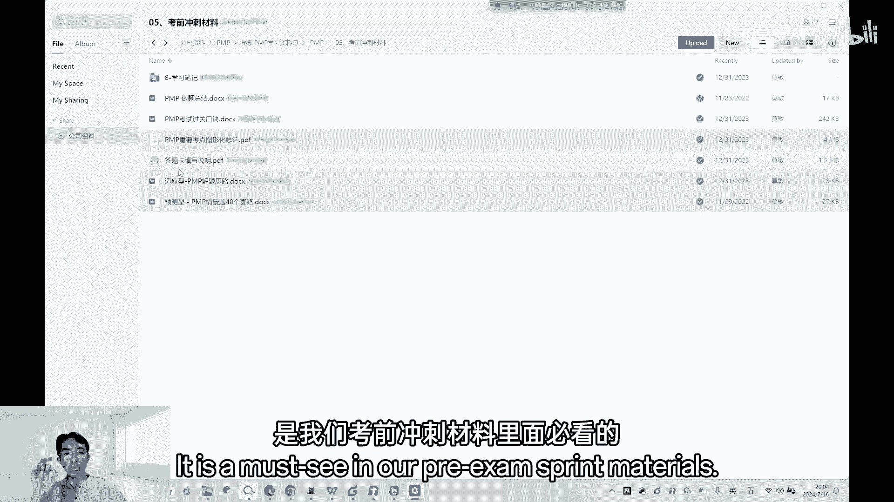

最后考试之前看一下答题卡，说明答题卡怎么填，我会跟大家去。

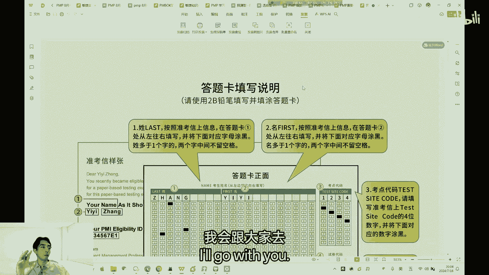

在最后一节课的时候会说这个东西，答题卡怎么去填这个事情，所以大家不要去忽视了这个文件。

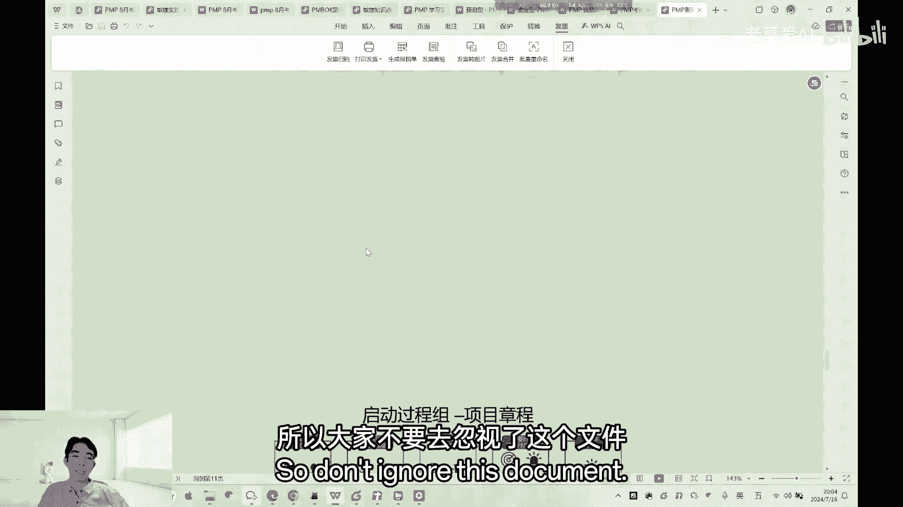

PMP学习资料包，PMP考前冲刺材料，这些东西他是帮助提分的，如果你想呃快速通过，就看这个东西，其他的我觉得大家现在截止点不用看太多，不然你肯定说话，莫老师提供这么多材料是吧，我到底要看哪几个是吧。

那今天我就跟大家说清楚，一个两个三个图形化的总结。

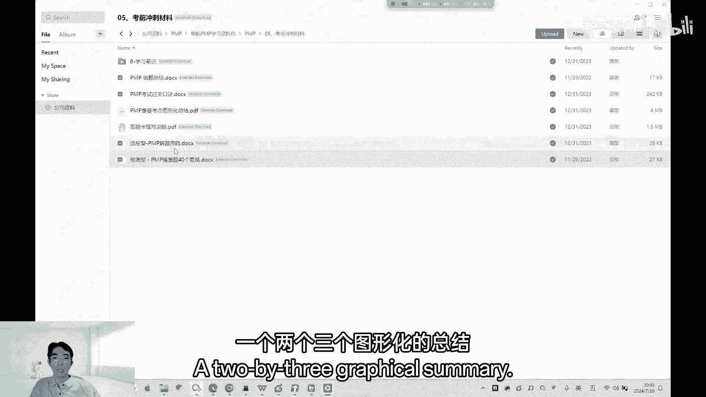

适应型，预测型，这些这三个材料是大家需要去必看的材料。

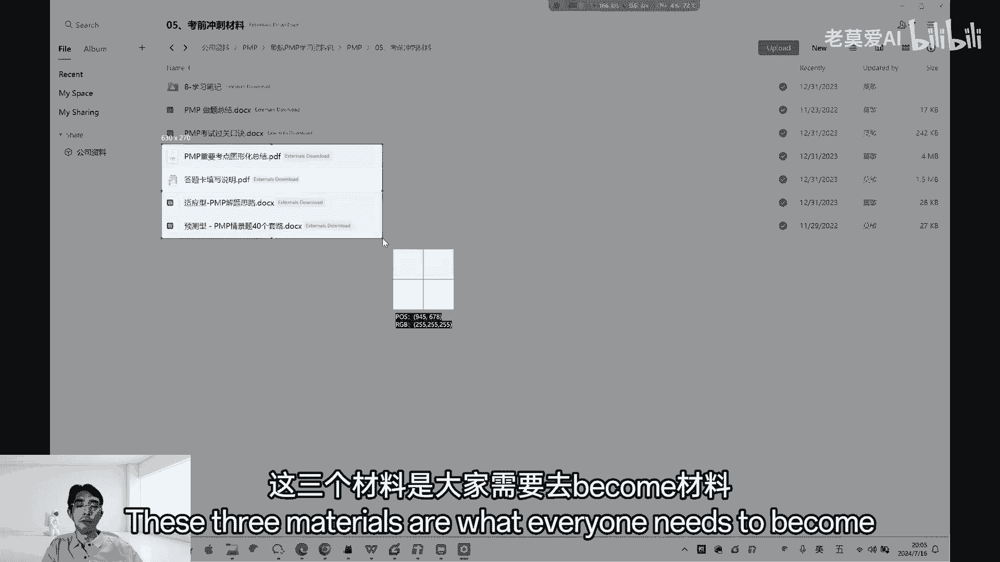

OK好这个就是在我讲这个之前。

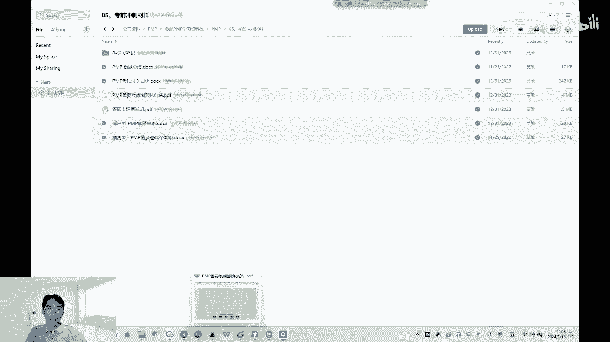

前面的话讲这个重点讲前面的话，那我们回到课程好好。

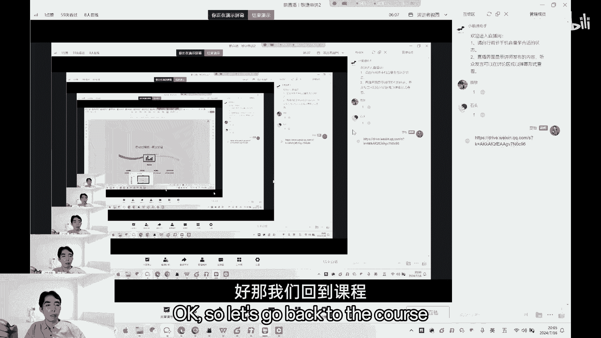

我们今天是讲知识点串讲二，知识点串讲二，它整个在敏捷里面得分是最高的，好我们再来看一下上一节课，其实我们说了，敏捷概述生命周期的选择和实时敏捷，创建敏捷环境，还记得三大角色是吧。

只是敏捷在敏捷环境中交付，主要是写的是敏捷当中3355的五个会议，在五个会议上我们怎么样，这些角色在会议上起到什么样的作用，对啊那今天会展开来跟大家去讲。

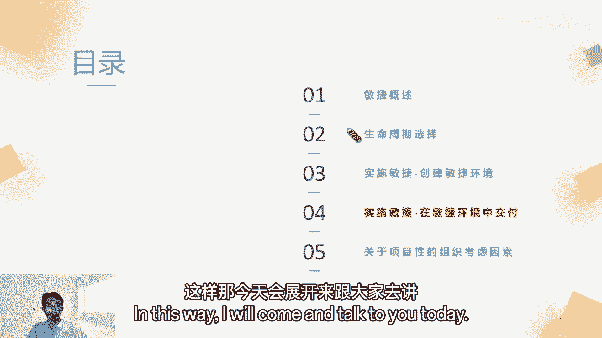

会讲八个，第一个是创建待办事项，它是有时间关系的，你如果记得它是有时间关系，第一个创建代办事项是第一，就相当于你在做项目计划之前，你要去梳理你的需求，第二个是迭代计划会议，就是说梳理完机需求之后。

你要做计划，计划完了之后，我们要去执行，那执行的时候我们要监控，监控完了之后，我们就要商项目要收尾，对不对，项目收尾有两个过程，一个是展示和评审，视和评审，我就是验收结果，还有一个收尾的过程是回顾。

就是验收过程我们要看看中间的过程怎么样好，完了之后就是基于迭代的敏捷交付，价值的实践和增量和反馈，这个三个是一坨的，这三个的需要记忆的东西很少，所以分数主要体现在前五个。

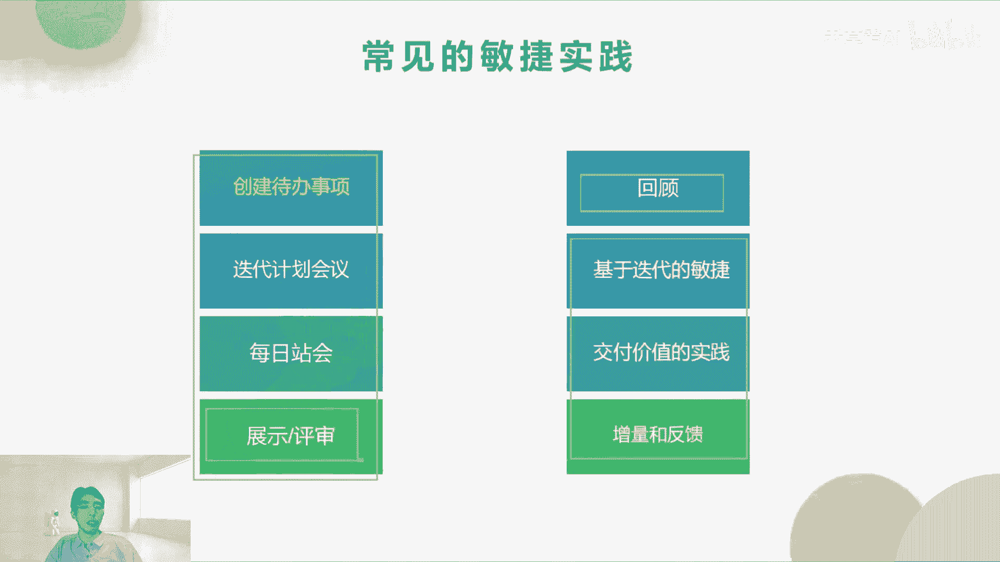

占了大部分的分数就在这里面，好OK那我们接下来再往下面说，第一个是创建待办事项，待办事项它有什么东西，它不仅有用户故事，也就是说我们说的需求，也有外网的一些bug，用户的反馈等等，这个都放在这里。

还有开发任务，比如说我们在过程当中有一些需要去优化的，一些开发人员提出来一些需要优化的点，需要重新去架构的一些点，这个东西都放做开发任务里面，所以这里面为什么叫代办事项列表，不叫需求池。

我我之前是说说需求池，需求池是方便大家的一个怎么理解，其实它更准确的来说，它不仅仅是需求，所以不能叫需求池，更准确的应该叫做创建，就是代办事项，我们叫back nor，Backlog list。

blog就是返回过来的一些需要代办的一些事情，list就是表格的意思，所以是这个东西OK好，那么待办事项它有个deep模型，这个是代办事项的一些属性好第一个deep模型，第一个D是什么。

就是适当的详细程度，Detail approach preter，Propriator，就是适当的详细程度，也就是说我们的整个待办事项列表里面的，每一个需求，它的详细程度它不是越详细越好。

也不是越简略越好，所以它需要有一个适当的详细程度，第二个一它是被估算的，Estimator，ESTTIMOR被估算的是什么意思，就是它整个需求它一定是前面经过了谁的估算，经过了PO的估算。

product owner经过了他的估算，第三个是涌现的，imagine是什么涌现的，他是支持他的需求，是不断的有新的需求过来，因为敏捷他其实就是拥抱变化，你有新的变化过来，他是很支持的，很欢迎的。

所以是有涌现的这样一个特点，最后排了优先级的，就是P排列优先级的是什么意思，他一定是根据我们的什么需求的价值，它排列优先几，价值越高的需求排在越上面，所以他是代办事项这么样一个特点，OK代办事项举例啊。

其实就是我们平时在工作当中用到的，斗地主的待办事项的一个真实的案例，比如说我们代办事项列表，它是由excel表把它管理起来的，它里面有很多，比如说id是吧，还有他的一些type。

就是它的呃当前的一个特性状态，或者你说哦不是特性状态，就是它的分类类型，比如说它是一个feature，也是一个特性对吧，它是一个特性，还是一个外网bug，是体现在这里面。

这里面这个name就是他用户故事的名字，value value就是它的价值，比如说八十八十七十，那么80就大于70，是这样的，我们通过一个权重来去看到它的一个价值，就放在这里。

这个就是它的优先级到底是高还是低，这个就是它的估算的用户估算的，这是这就是他的故事点数，它有三个故事点，一个故事点还是两个故事点，这个后面会说如何去实现这个how to demo。

这个就是对于它的name的一个说明，比如说这一个推荐好友列表，左耳朵展现，那么第一个点击左耳朵入口，会显示一个随机陌生人列表，那么它里面有具体的展现，比如说列表的长度为一十。

moss over列表中的某一个头像，头像会出现三个功能按钮，分别为加好友，滑行发起会话，查看资料，就这些特性它会详细的去描述这些特性，所以这个就是一个待办事项列表的举例。

大家脑子当中会有一个这样的待办事项列表的，这样一个印象，其实就OK了，代办事项梳理了我们整个过程，它其实是一次会议，那么什么时候发生，什么时候发生在下一个迭代之前，说在下个迭代之前，我们先要计划好。

我们要澄清好，我们接下来我们的需求池里面有什么，我们接下来应该做什么，我们要去前面就要去估算好，那么参与人是谁，参与人就是我们的PO，因为他是对这个结果负责的，Product owner，还有就是客户。

客户可以参与进来，客户可以在我们这个待办事项列表，因为有些代办事项列表是由客户提出来的，那么客户如果提出来需求，我们在不太清楚的情况下，我们可以让客户一起去参与，说你提出的需求到底是个什么意思是吧。

你想表达的这个需求到底是个什么意思，我们才能更好的去了解客户的需求，帮客户把需求去更进一步的转化，第三步是干系人，大家稍微等一下好，第三步是干系人，干系人是什么意思呢，就是跟项目有关的人。

比如说你这个需求他不是客户提的，是老板提的，那么老板他也可以去参与到这个事情当中，这个是干性人，这个待办事项列表书里最多花多少时间呢，就是最多花spring的10%的工作量，比如说一个sprint。

他是十天就半个月，其实就是十天的工作日，那么十天我们有可以花一天的时间去做，待办事项的梳理，包括需求的曾经，包括我们对于需求的优先级的一些排序，包括我们对接下来的整个需求工作的一个评估，都可以放到这里。

大家注意了啊，代办事项的梳理，它是对整个需求池的梳理，所以确实是要花这么多时间的好，第四点是how to do，就是如何去做它，我们要讨论合并，就有一些故事它可能是重复的，有一些故事它可能是很大的。

比如说一个史诗级的用户故事，什么叫史诗级的故事，打个比方啊，我让你去实现一个微信的朋友圈功能，那么朋友圈功能，它就是一个很大的一个用户故事，他可能要花几年时间才做完，才能够做的到现在如此的完善。

你说做一个朋友圈功能，简简简单单一句话其实是做不出来的，所以我们要去帮他去做一些分解，那么分解的工作也是在代办事项列表，梳理会上去做，帮他去做估算排序啊等等等，更新发布计划。

所以他是一个顶层次的一个需求的梳理，大家可以去想象，其实在这个代办事项梳理会上，其实我们做的就是产品的顶层设计，顶层设计大家可以这样去理解就好了，好好这边有一个题目，方便大家去巩固这一个知识点的内容。

说作为某敏捷项目的产品负责人，你的工作任务是要跟客户沟通，了解他们的想法和诉求，为此你整理了一个产品代办事项列表的文件，请问在项目过程中，产品代办事项列表会有怎样的变化，OK有ABCD你们可以自由去选。

你们觉得哪一个我待会去公布答案，你们觉得呢我觉得要留一些时间给你们，给大家一些互动的东西，OK好，答案公布一下，正确答案是零，产品代办事项列表，会随着客户的需求变化和调整及时的变化，所以敏捷是什么。

拥抱变化就体现在这里啊，其实B其实也体现了一个变化，只是他的答案是刚好相反的，他说因素会越来越复杂，而更加粗略和模糊，其实因素会越来越简单，因为我们会随着项目的进展，我们会收集到更多的一些信息。

那么这些信息会使我们对于他的理解，会越来越简单，更加越来越详细和清晰，不是粗略和模糊，OKB是刚好相反的，是正确，答案是C，那么敏捷代办事项里面就会有一个用户故事，因为他是个列表。

它是由很多用户故事和外网bug组成的，其中最重要的是用户故事，因为它的组成的大部分其实就是用户故事对吧，那么用户故事的这个格式，它的格式是as a什么，Use thro，作为什么样的用户角色。

i want什么东西，我想要什么样的功能，比如说哇想要什么样的特性的东西，什么solution，怎么样的解决方案都可以提在上面啊，以便于说so that这个是固定的啊，Enefit。

然后原因为这些价值好，这些东西，他其实其实就构成了整个用户故事的东西，OK那么用户故事。

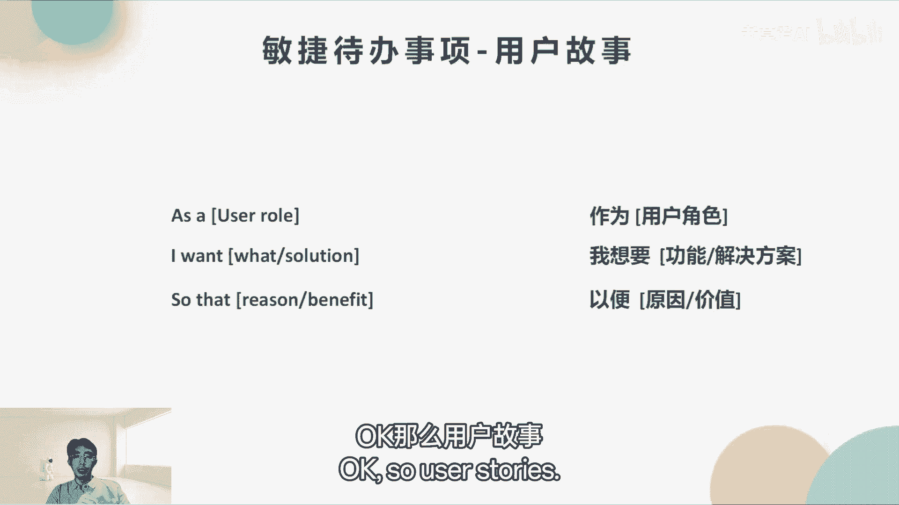

那为什么大家会有一个想法说，为什么他要去叫用户故事，叫需求，为什么不好，因为我们叫了好多年的需求，为什么到敏捷这来就叫做用户故事呢，是因为你叫需求就会出现，每个人脑子的需求都是不一样的。

比如说这个产品在产品眼中需求是什么，需求在产品眼中其实就是什么，一个一个要你去实现的产品功能模块，那么在开发眼中需求到底是什么，那在开发眼中需求就是你产品，你给我提的那些文档，那么在测试的眼中。

他需求是什么，就每个人的眼中的需求都是不一样的，但是你们想象中的需求，真的是用户想要的东西吗，不是其实需求并不是用户想要的需求，是产品经过对用户的语义的解读之后，他写出来的东西是吧。

那么所以我们要更进一步说，我们要探讨用户到底要什么东西，所以这个就是一个我们脑子里思考的，不同的东西，再把它去重新解构，去同化的一个过程，因为大家其实都当过用户，我们也知道用户是怎么想的。

所以我们是不是能够带入用户去想，就叫做用户故事，这个用户故事就是每个人站在用户的角度，然后去想这个功能应该怎么样去实现，所以这样就能够把大家的思想进行统一，叫用户故事，那么用户故事这个考试不会考。

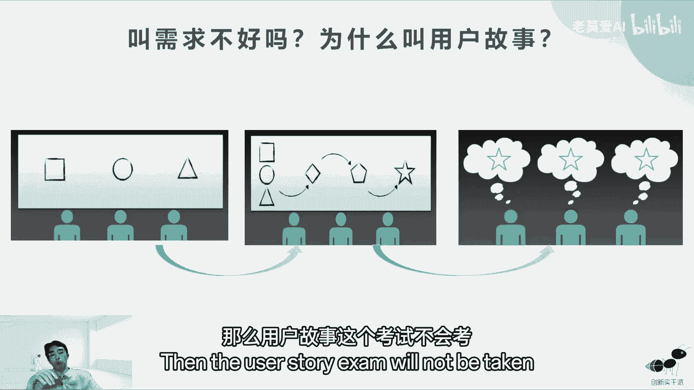

用户故事怎么来，怎会那么用户故事怎么来，不会考，但是没之前是没有哪个老师能够说得清楚的，用户故事怎么来，那我自己又是做产品经理的，在腾讯也是做产品经理的，所以我能够把用户估值掰扯的很清楚。

所以就跟大家顺便讲一讲用户估值怎么来，那么用户故事怎么来，第一个就是我们要找到我们的用户在哪，我们去通过我们明确的产品的目标，我们去收集一些用户画像，这个是明确用户，第二个是用户。

我们找到了用户在使用我们产品的时候，他的一个场景是什么，他在什么样的场景下使用我们的用户，它使用的场景使用的这个画面是什么，所以我们需要去找到我们的用户，去进行什么走访。

去观察用户怎么样去使用我们的产品的，我们做一些用户反弹，这个场景，就是在我们这个用户在使用我们东西的，这个场景下，所做的一些用户反弹的东西，所以它是一个用户反弹的一个输入，就确认场景，第三步。

用户反弹也叫用户调研，就我们去收集用户在使用我们产品的过程当中，的一些行为，他的一些感受啊，一些想法等等，就这些东西，最后第四步就是我们绘制用户体验地图，就我们收集完这些用户。

在我们这个整个场景当中的使用之后，我们可以把用户的这个使用过程，我们可以列出一个地图，他刚开始使用的时候，它怎么样去进入的，在我们场景当中才说它的入口是什么，用户是怎么进入这个入口。

那比如说我们做一个电商网站，用户是怎么进入这个电商网站的，它打开以后，他在首页你能看到什么东西，他怎么去浏览你的商品的，他是先看图文还是先看视频，看完之后他是怎么样去购买的，他是加入购物车还是直接购买。

他购买之后他是怎么付钱的是吧，那付了钱以后，他是怎么观察他的产品，什么时候发货的，发到他手上之后，他又是怎么样去使用，怎么样去评价的，在退货过程当中，他遇到哪些问题等等，这些东西其实可以穿成一条线。

这个就是提炼用户的，这个叫做用户体验地图的一个东西，通过用户体验地图，我们来提炼用户，在整个在使用我们产品进行购物的过程当中，它的爽点是什么，它的痛点是什么，然后再去改变就是痛点。

我们进一步的去怎么样把它痛点进行，进一步的去完善它的爽点，我们把它进一步的放大，让它在我们上面体验更好更爽啊，跟其他的购物平台比起来，它要更爽一些，这些东西就是我们的用户体验地图，我们要做的一些事情。

那么爽点和痛点我们要去做改变，这样就顺势就产生了我们的用户故事，其实我们的每一个用户故事，都是为了增大用户的爽点和减少用户的痛点，大家记住了，去实现我们整个价值，所以用户故事他是怎么来，他就这样来。

经过五步之后，他就实现了用户故事的一个传递。

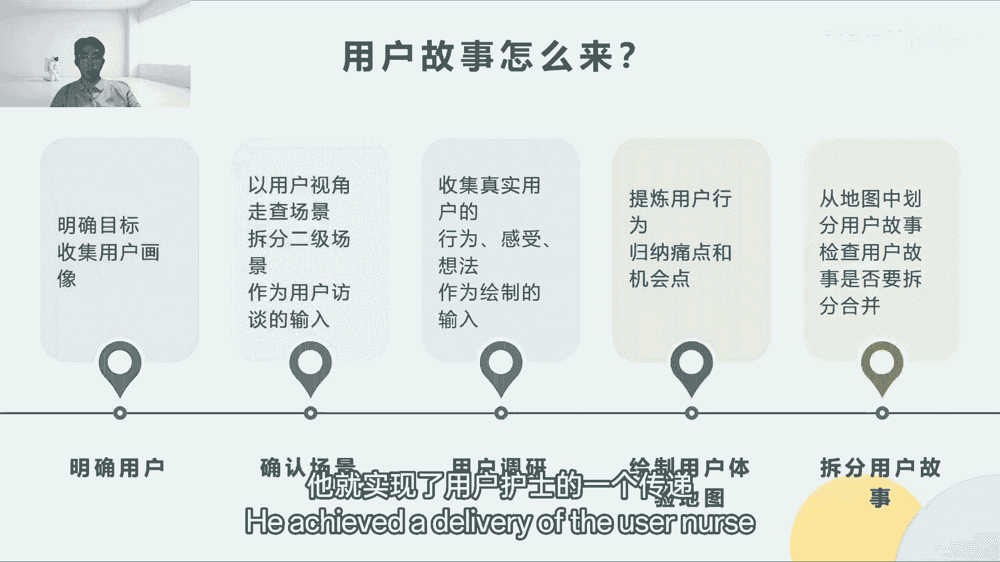

对那么用户故事他也有属性，跟前面那个什么列表一样，它也有属性，它有四个属性，第一个是独立的，每一个用户故事他会独立测试，独立交付，第二个是可协商的，可以讨论的，它不是写在这个需求列表里面的东西。

也不是写在需求文档，那么死的东西写完之后，我们可以讨论的余地，就是这个东西他怎么去做，能够更做得更优化，那么开发人员他有更多的思考的余地，这个是可协商的，第三个是有价值的，这就一定要对用户有价值才可以。

第四个是可估算的，有无估算，那前面已经讲到估算，这里又讲一遍，再第五个是小的，里面的原则是不超过五人天的工作量，为什么，因为我们希望每一个用户故事，它能够至少在一周他能做完一个用户故事。

你不能说我这一周我工作完了以后，这一周什么产出都没有，说一天没有任何产出也就罢了，但是这一周你什么输出都没有，那是说不过去的，所以我们规定了说我们的工作量，在用户故事这个层级的工作量。

是不超过五人天的工作量，最后可测试的可以单独测试，那么我们来拿一个用户故事举例好。

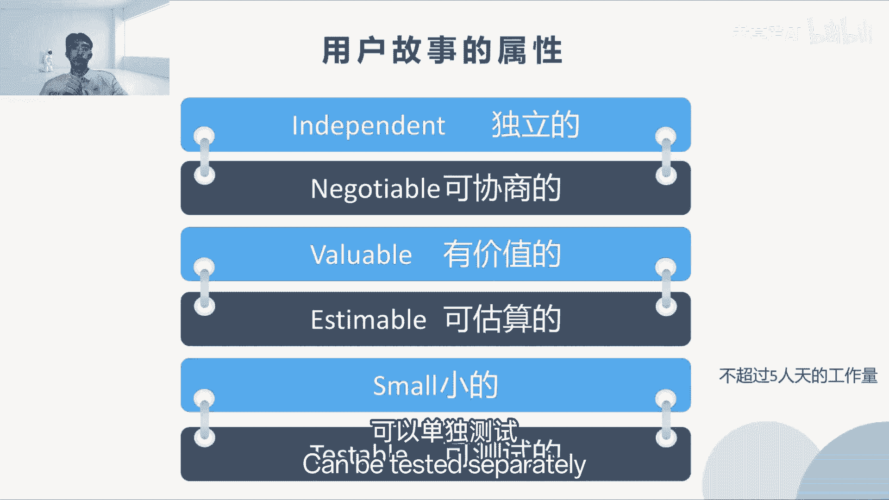

那举例就是作为一个玩家，我想要查查看这个玩家的皮肤时，能让我看到玩家的皮肤的整体效果，以便我是否选择个皮肤特效，这个是王者荣耀里面男性的这样一个皮肤展示，玩角色皮肤的一个用户故事，这个就是一个完整的。

作为一位玩家，我想要什么东西，i want什么东西，以便于so that什么东西，这些东西都会构成了整个完整的用户故事，那么用户故事除了有这么完整的主线之外，还有一个叫做验收条件。

那么这些验收条件到底是什么，它的格式是当什么的时候，它呈现出来一种什么样的状态，这个是用户故事的验收条件，这个用户第二故事的验收条件，它是干什么用的呢，是产品用来验收整个用户故事。

是不是被开发所执行好这样一个结果，他验收的是结果，有些人可能做过测试，他可能会说，他说我这个验收条件看起来很像测试用例，对不对，那他跟测试用例到底有什么区别，它跟测试用例最大的区别是。

它倾向于验收的是完整性啊，而测试用例更倾向于捕捉异常性不合理，有什么事情他能够如果你带入一些特殊值，它会不会报一些异常的东西，可能测试更关注这些东西，更关注异常，那么用户故事它更关注于完整性。

你是不是和想法去完成，按照我们的产品的想法去完成，所以验收条件是产品用的，不是测试用的啊，所以这个是它跟这个测试用例的最大的区别，你比如说这一个，你就说当我查看玩家皮肤的时候。

我能看到玩家皮肤动态的展示出来，会展生它穿上一套皮肤的这个样子等等等等。

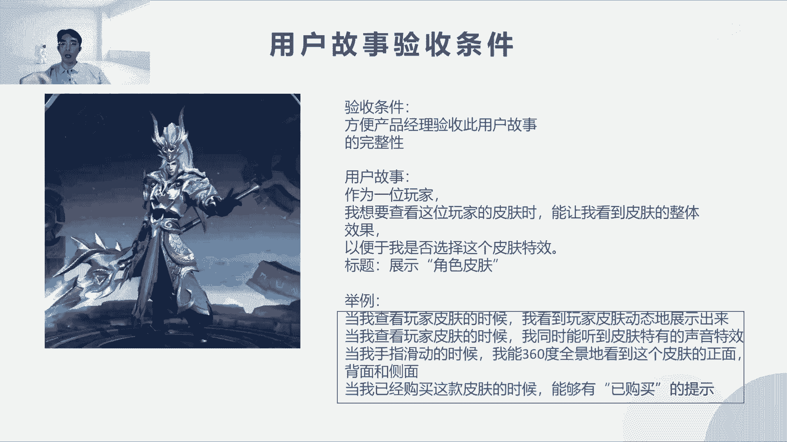

这个就是用户公司的接收条件好，那么用户故事它还可以进行进一步拆分，比如说我们前面举的例子是吧，微信的朋友圈功能，它其实就是一个史诗级的用故事朋友圈功能，它要分很多种，要往下再去进一步细分。

那么细分的原则是什么，假如我朋友圈我下一个迭代就要去做这些功能，那么下一个迭代要做的这些功能，它一定是怎么样，它的一定要拆得很细，以方便我下个迭代马上就要加入进来，如果是以后发布迭代要做的事情。

比如说我一个月之后我再发布，我要去做它，你就不用猜的那么细，你可以再粗一点，将来的是什么意思，就这个功能可能我半年或者一年以后我才做，它现在要不要花时间精力做那么细就不需要，所以他就会拆分规则。

渐进明晰这个意思，可那么它的拆分规则有合并，通过不同的维度去拆分抽取技术共性，这个不会考，我就一笔带过了，因为我们讲课总是也会有一些重点和非重点的，一些东西好我们来一个题目来去。

怎么样巩固一下在一个产品的开发过程当中，团队了解了利益相关方对于产品的需求，并根据需求创建了一张张用户故事卡片，下列哪一项不是故事卡片里面应该包含的信息，A故事的价值点，B功能的描述。

C故事依赖关系D完整的速度。

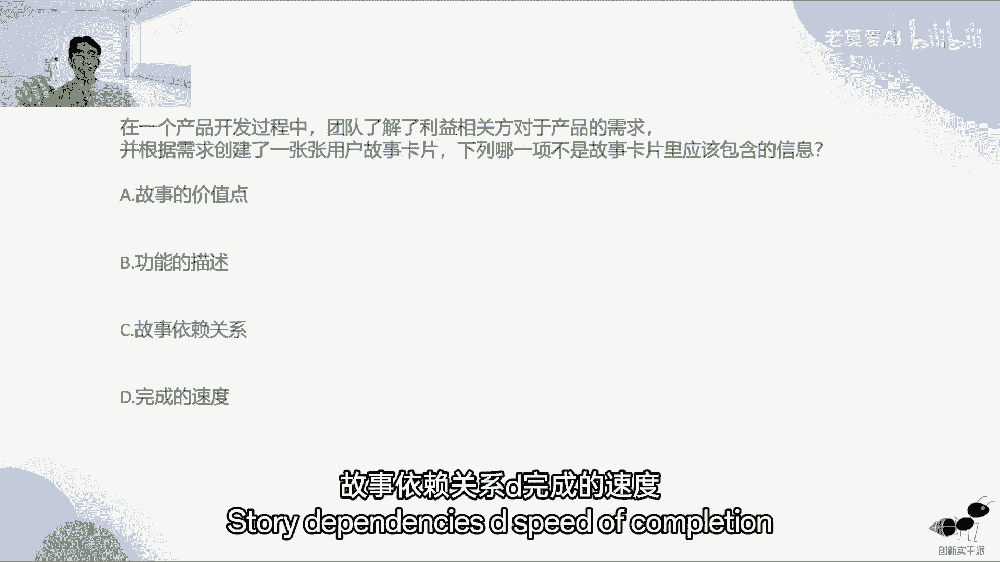

你们觉得不是故事卡片里面应该包含的信息。